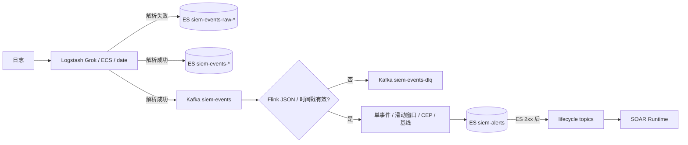

# CLAUDE.md

This file provides guidance to Claude Code (claude.ai/code) when working with code in this repository.

---

# HISIEM 平台 — 项目速览

轻量级 SIEM(Elastic Stack + Flink)。Phase 3.0-3.5 检测引擎基线与 Phase 4.0-4.4.1 控制台/运维能力已完成；控制面为 Spring Boot + PostgreSQL/Flyway，数据面为 Elastic Stack + Kafka + Flink。当前事实与未闭环风险见 [docs/current-status.md](docs/current-status.md)，文档导航见 [docs/](docs/README.md)。

## 数据链路



## 仓库布局

- `modules/` — 控制面物理 Maven 模块（contracts、iam、agent-adapter、security-ops、platform-operations、platform-operations-adapters、detection-control、detection-runtime、platform-migrations、soar-core、soar-adapters、soar-worker-runtime）
- `applications/control-api/` — Spring Boot 控制 API 可执行应用（HTTP/API 进程；只写 detection desired state，不拥有物理部署权限）
- `applications/detection-controller/` — 独立 Spring Boot detection controller（`WebApplicationType.NONE`，默认 disabled adapter；5A durable claim/reconcile core，5B opt-in process adapter）
- `applications/soar-worker/` — 独立 Spring Boot SOAR worker 可执行应用（`WebApplicationType.NONE`，不依赖 control-api）
- `flink/` — **Flink 检测 job**（独立 Maven 工程，主类 `com.siem.DetectionJob`）。规则 YAML 经 `RuleConfigLoader`/`RuleBuilder` 生成单事件、窗口、CEP 和基线四类分支
- `infra/` — 基础设施配置唯一来源:docker-compose、logstash、ES 模板、Kibana 脚本、simulator、deploy.sh
- `src/` `pom.xml` — 历史控制面工作树（当前可执行控制 API 位于 `applications/control-api`）
- `web/` — Vue 3/Vite 控制台；真实路由见 `web/src/router/index.js`，统一请求见 `web/src/api/index.js`，页面按 `views/<module>/` 拆分
- `docs/` — 架构/部署/决策/规则引擎文档

## 常用命令

```bash
# 构建 + 测试 Flink job(Windows 侧)
# 根目录 ./mvnw 用于 Spring Boot 控制面；Flink job 必须用 -f flink/pom.xml。
./mvnw -f flink/pom.xml clean package                       # 构建(含测试)
./mvnw -f flink/pom.xml test                                # 全部用例
./mvnw -f flink/pom.xml test -Dtest=RuleEngineTest          # 单个测试类
./mvnw -pl applications/control-api spring-boot:run                    # 启动控制 API(默认 8080)
./mvnw -pl applications/detection-controller spring-boot:run          # 独立启动检测 controller(默认无物理 adapter)
./mvnw -pl applications/soar-worker spring-boot:run
npm --prefix web run dev                                   # 启动前端(默认 5173)
npm --prefix web run build                                 # Vue 3 生产构建

# 部署(同步仓库 → WSL + 构建 + 拷 jar 进 jobmanager)
MSYS_NO_PATHCONV=1 wsl bash /mnt/d/Project/SIEM/infra/deploy.sh

# 提交/取消 Flink job(容器内)
docker exec siem-flink-jobmanager flink run -d /opt/flink/detection-job-1.0.jar
docker exec siem-flink-jobmanager flink cancel <JobID>   # 先 flink list 查 ID

# 应用 ES 模板 / 建 Kibana dashboard(在 WSL 内)
bash /mnt/d/Project/SIEM/infra/elasticsearch/apply-templates.sh
bash /mnt/d/Project/SIEM/infra/kibana/create-dashboards.sh

# 建 Kafka topic(提交 Flink job 前必须执行;apache/kafka:3.8 默认关闭自动建主题)
bash /mnt/d/Project/SIEM/infra/kafka/create-topics.sh

# 发测试日志 / 暴力破解测试
echo 'Aug 1 10:20:00 server03 sshd[9999]: Failed password for test from 172.16.1.20' | nc -w1 localhost 5000
bash /mnt/d/Project/SIEM/infra/simulator/brute-force-test.sh
```

> WSL 从 Windows 调用时加 `MSYS_NO_PATHCONV=1`(避免 Git Bash 路径转换)。

## 关键知识点(易踩坑)

1. **Flink offset**：`DetectionJob` 用 `committedOffsets(EARLIEST)`（不是固定 `earliest()`），首次运行才回退最早位置。checkpoint 和 Kafka 都是至少一次语义，故障仍可能重放少量在途记录，告警依靠确定性 ES ID 收敛。
2. **事件时间窗口**：当前 SSH 规则是 5 分钟窗口、1 分钟滑动，watermark 有 10 秒乱序容忍和 60 秒分区 idleness；窗口仍要在 watermark 越过边界后才关闭。
3. **Logstash**:点分字段(`source.ip`)在 ES 里是扁平 key 但按嵌套 mapping 索引,查询用点分路径即可;`naming_strategy` 选项在 8.14 不存在。
4. **deploy.sh 不能 rm -rf bind mount 目录**(logstash),会破坏 Docker Desktop 挂载导致 exit 127,用 rsync 原地同步。
5. **Docker Desktop 的"文件级 bind mount"会被 rsync 替换破坏**:compose 若单文件挂载(`./a.yml:/path/a.yml`),rsync 原地替换该文件(Docker Desktop 快照旧 inode)后,容器 restart/up 报 `mount ... no such file or directory`(exit 127)。**解法:改成目录级挂载**(`./logstash/config:/usr/share/logstash/config`,已在 docker-compose.yml;config 目录需内含 jvm.options/log4j2 等镜像默认文件,已从镜像拷入)。目录内文件替换不受影响。
6. **Logstash `--config.test_and_exit -f <conf>` 会引导新实例并争抢持久化队列锁**(`data/queue/main/.lock`,运行中实例持有)→ 误报校验失败。**需加 `--path.data=/tmp/<唯一>` 重定向**(ProcessLogstashDeployer 已处理)。
7. **Logstash 数组不接受尾逗号**:grok/date 的 match 数组末尾留 `,` 会让 `--config.test_and_exit` 报 `Expected one of ...` FATAL。生成器已避免(LogstashConfigGenerator)。
8. **Flink checkpoint 默认在 cancel 时删除**(cleanup-mode=DELETE_ON_CANCELLATION),cancel 后无法从 checkpoint 恢复。**cancel→restore 演练用 savepoint**:`flink cancel -s file:///opt/flink/savepoints <jobid>`(Flink 2.x 推荐 `flink stop -p <dir> <jobid>`);savepoint 目录需 `chown flink:flink`(docker exec 以 root 创建会使 Flink 进程写失败,报 `Failed to create savepoint directory`)。已演练通过(2026-08-16)。
9. **Kibana dashboard** 对象必须带 `kibanaSavedObjectMeta.searchSourceJSON`。
10. **Kafka topic 必须显式创建**：`apache/kafka:3.8` 配置 `auto.create.topics.enable=false`，消费者和生产者都不能依赖自动建 topic。提交 Flink job 前先跑 `infra/kafka/create-topics.sh`（deploy.sh 只同步脚本，不执行）。
12. **SOAR 进程隔离**：`soar-core` 只包含传输无关模型/引擎/SPI，不得引入 Kafka、Actuator health、`java.net.http` 或 scheduled worker loop；Kafka/HTTP 适配在 `soar-adapters`，Kafka consumer/health/lease worker 在 `soar-worker-runtime`。`platform-migrations` 是唯一 `db/migration` 物理来源，control API 与 worker 都用 `classpath:db/migration`。
13. **定时任务隔离**：非 SOAR 的 BackgroundTaskRecovery、CaseAggregateJob、CaseMirrorDispatcher/CaseMirrorReconcileJob 和 NotificationScanner 都受 `app.operations.runtime-enabled` 控制；control API 默认 true，worker 默认 false。不要仅依赖 WebApplicationType 判断。
15. **检测 controller 隔离**：`control-api` 只持久化 desired state 并返回 `202 PENDING`，不得依赖或注入 `RulesDeployer`/`ProcessRulesDeployer`；`detection-controller` 是独立 `WebApplicationType.NONE` 进程，使用 V18 durable claim/lease/fencing。默认 `app.detection.runtime-adapter=disabled` 只报告 UNKNOWN，不执行 Docker/Flink 物理部署；设置为 `process` 才启用 5B 单集群 process adapter。
16. **控制面物理命令隔离**：WSL/Docker `ProcessBuilder` 实现在 `platform-operations-adapters` 模块；control-api 为保持既有非 Detection 运维行为显式依赖该模块，默认 `app.operations.process-adapters=enabled`，可通过环境变量禁用，未来再拆独立 operations worker。Detection controller 不依赖该模块；Detection 5B process adapter 位于 `detection-runtime`，仅在显式 `app.detection.runtime-adapter=process` 时启用。

## 模块边界与进程角色

详细依赖图、职责和运行方式见 [docs/design/module-boundaries.md](docs/design/module-boundaries.md)。

```bash
curl -s "http://localhost:9200/siem-events-*/_count"
curl -s "http://localhost:9200/siem-alerts/_count"
```

## 测试

```bash
./mvnw test                                                # 根项目测试（最新数量见 docs/current-status.md）
./mvnw -f flink/pom.xml test                              # Flink 模块全部 46 个测试
./mvnw -f flink/pom.xml test -Dtest=RuleEngineTest        # 单个测试类
./mvnw -f flink/pom.xml test "-Dtest=WindowRuleTest#bruteForceAlertHasCountAndRelatedEvents"  # 单个方法
```
