# HISIEM 架构、模块实现与关键业务数据流分析

> 分析日期：2026-08-21（Asia/Shanghai）  
> 项目根目录：`.`（本文全部代码证据均相对项目根目录）  
> 分析方式：静态源码/配置/迁移/测试审查 + 本地构建测试 + 当前 Docker 运行态只读核验  
> 结论标记：**已确认**＝有直接代码、配置、测试或运行态证据；**合理推断**＝由多项证据推导但未做破坏性/写入式演练；**待验证**＝现有证据不足。

> **复核说明（2026-08-22）**：本文前半部分保留 2026-08-21 的问题基线，风险表中标为“已修复/部分缓解”的项目以本文第 17 节为准。当前代码已追加 Flyway V7（首次登录改密、Case outbox、任务租约）、任务恢复器、Flink partial update、持久 sincedb、原子配置写入和前端错误/轮询治理。

## 1. 分析范围和项目说明

### 1.1 范围

本报告覆盖以下实际目录，不把设计文档中的目标状态自动视为已实现状态：

- Spring Boot 控制面：`src/main/java/`、`src/main/resources/`、`src/test/java/`；
- Flink 检测作业：`flink/src/main/java/`、`flink/src/test/java/`、`flink/pom.xml`；
- React/Vite 控制台：`web/src/`、`web/package.json`、`web/vite.config.js`；
- 部署与数据面：`infra/docker-compose.yml`、Logstash pipeline、Kafka 脚本、Elasticsearch 模板、规则和部署脚本；
- 项目说明：`README.md`、`CLAUDE.md`、`docs/architecture.md`、`docs/deployment.md`、`docs/design-decisions.md`、Story/设计文档；
- PostgreSQL 模型：`src/main/resources/db/migration/V1__control_plane.sql` 至 `src/main/resources/db/migration/V7__outbox_task_leases.sql`。

未读取或披露 `infra/elasticsearch/config/elasticsearch.keystore` 的内容。仓库中未发现 Gradle、MySQL、Redis、独立后端 `server/` 目录或独立端到端浏览器测试工程；它们不属于当前实现。

### 1.2 事实基线

| 项目 | 结论 | 证据 |
|---|---|---|
| 技术形态 | **已确认**：控制面为 Spring Boot + PostgreSQL/Flyway；数据面为 Logstash + Kafka + Flink + Elasticsearch；Kibana 和 React 提供两类展示面 | `README.md:1-34`、`pom.xml:34-101`、`infra/docker-compose.yml:1-144` |
| 控制面进程 | **已确认**：Spring Boot 和 Vite 不在 Compose 内；当前检查时 8080/5173 无监听 | `infra/docker-compose.yml:1-144`、`web/vite.config.js:4-11`；本次运行态检查 |
| 数据面进程 | **已确认**：当前 7 个容器均在运行；Logstash 为 green，加载 `main + 5` 个 pipeline；Flink 作业 `SIEM Detection Engine` 为 RUNNING | `infra/docker-compose.yml:1-144`；本次 `docker ps`、Logstash API、`flink list -a` |
| 当前数据 | **已确认**：检查时存在 `siem-events-2026.08.20` 2000 文档、`siem-alerts` 4000 文档、`siem-cases` 55 文档 | 本次 Elasticsearch `_cat/indices` 只读查询 |
| PostgreSQL | **已确认（代码/测试）**：迁移已扩展至 V7，新增 password rotation、case outbox 与 task lease；运行中的旧实例需重启 Spring 后执行迁移 | `src/main/resources/db/migration/V1__control_plane.sql` 至 `V7__outbox_task_leases.sql`；H2/真实 PostgreSQL 迁移测试 |
| 测试 | **已确认**：本轮后端 74/74、Flink 33/33 通过；前端生产构建已在隔离临时目录复核 | 第 13 节及本轮复核记录 |

### 1.3 边界和角色

- **普通控制台用户**：代码中没有单独的普通角色；实际角色只有 `admin`、`analyst`、`ops`、`audit`。`AuthService` 将角色转为 Spring Security authority。`src/main/java/com/xscsiem/hsiem_platform/auth/AuthService.java:35-39`、`src/main/java/com/xscsiem/hsiem_platform/auth/AuthService.java:170-176`
- **管理员 admin**：用户管理、规则部署、资产关键度变更、案件删除等高权限操作。
- **分析师 analyst**：告警处置、案件调查、部分规则启停。
- **运维 ops**：数据源生命周期、运行健康和部分模板操作。
- **审计 audit**：以只读接口为主。
- **数据源**：TCP、syslog、file 三种声明类型；当前仓库内 5 个源均为 TCP 且标记 active。`src/main/java/com/xscsiem/hsiem_platform/onboarding/LogSourceService.java:66-91`、`infra/log-sources/ls-157ad51f.yaml:2-10`
- **外部系统/部署依赖**：Docker Desktop、WSL、`rsync`、Docker CLI、Flink CLI、Python 3；激活和规则部署会由 Spring 进程直接启动这些外部命令。`src/main/java/com/xscsiem/hsiem_platform/onboarding/ProcessLogstashDeployer.java:38-95`、`src/main/java/com/xscsiem/hsiem_platform/rules/ProcessRulesDeployer.java:43-105`

## 2. 项目总体结论

1. **已确认：主干架构真实存在且当前数据面正在运行。** 日志可经 Logstash 同时写 Elasticsearch 与 Kafka，Flink 消费 Kafka、按 YAML 规则生成告警并写 `siem-alerts`。控制面 API 通过 PostgreSQL 保存用户、会话、案件关系、通知和任务，通过 Elasticsearch Java Client 查询/更新事件、告警和案件镜像。
2. **已确认：控制面不是纯样板。** 登录、RBAC、数据源声明、模板门禁、告警状态机、案件聚合、后台任务、健康扫描和通知均有真实入口、服务实现及存储副作用。
3. **已确认：代码采用多种“事实源”。** 用户/会话/任务/案件关系以 PostgreSQL 为主；LogSource、ParserTemplate、Rule、Criticality 以仓库文件为主；事件/告警以 Elasticsearch 为主；Case 同时写 PostgreSQL 与 Elasticsearch。这种混合模式是主要一致性风险来源。
4. **已修复：Logstash 激活/停用失败会恢复部署态。** 仓库文件采用原子替换，失败回滚后再次同步 Logstash；配置校验、同步、重启任一步失败都会尝试恢复旧配置并记录 revision。`src/main/java/com/xscsiem/hsiem_platform/onboarding/ActivationCoordinator.java`
5. **已修复：停用源可重新激活。** 重试 `failed/stopped` 数据源先进入 `creating` 中间态，生命周期按源串行，前端轮询有指数退避、超时和错误提示。`src/main/java/com/xscsiem/hsiem_platform/onboarding/LogSourceService.java`、`web/src/App.jsx`、`web/src/api.js`
6. **已缓解：Case 双写采用 PostgreSQL 事实源 + ES outbox 镜像。** 案件创建/更新/删除与 outbox 在同一数据库事务中提交，dispatcher 租约投递并指数重试；这解决单次请求的半写入，但仍是最终一致而非跨系统分布式事务。`src/main/java/com/xscsiem/hsiem_platform/control/JdbcControlPlaneStore.java`、`src/main/java/com/xscsiem/hsiem_platform/investigation/CaseMirrorDispatcher.java`
7. **已修复：动态 per-source pipeline 与主 pipeline 统一。** `_parsefailure` 和 `_dateparsefailure` 均进入 `siem-events-raw-*`，不再发送 Kafka/Flink；DataHealth 已分开统计正常、失败和配置源。
8. **已修复：认证管理 API 使用脱敏 DTO。** `GET /api/auth/users` 不返回 BCrypt；V6 强制首次登录改密，轮换前业务 API 返回 428。`src/main/java/com/xscsiem/hsiem_platform/auth/AuthUserView.java`、`src/main/resources/db/migration/V6__password_rotation.sql`
9. **已修复：前端请求正确处理 204、超时和失败提示。** 删除/登出等 204 不再被误报，初始化和详情加载错误会展示，数据源轮询采用指数退避。
10. **已优化：前端统一时间口径和跨页签关联。** 页面按浏览器本地时区展示时间，并区分事件/窗口结束时间与告警生成时间；告警、规则、案件、数据健康通过规则命中数、数据源、案件 ID、实体和时间线互相串联。调查台的聚合窗口/阈值改为可见数字控件并显示当前生效条件。
11. **仍需补充跨组件验收。** 单元、迁移和 Flink 算子回归已覆盖；浏览器 E2E、真实 Logstash/WSL 故障注入及 Kafka→Flink→ES 故障演练仍属于发布前验收项。

## 3. 系统总体架构

下图只绘制源码和当前运行态有证据的组件；虚线表示异步或部署命令边界。

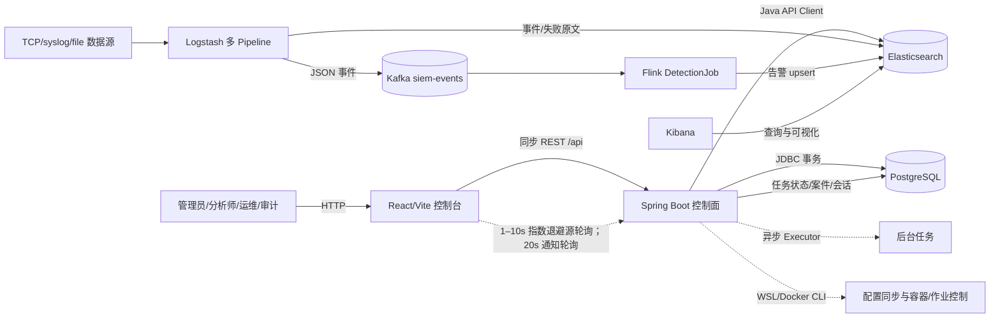
```mermaid
flowchart LR
  User["管理员/分析师/运维/审计"] -->|HTTP| Web["React/Vite 控制台"]
  Web -->|同步 REST /api| API["Spring Boot 控制面"]
  API -->|JDBC 事务| PG[(PostgreSQL)]
  API -->|Java API Client| ES[(Elasticsearch)]
  API -.->|异步 Executor| Task["后台任务"]
  API -.->|WSL/Docker CLI| Deploy["配置同步与容器/作业控制"]

  Source["TCP/syslog/file 数据源"] --> LS["Logstash 多 Pipeline"]
  LS -->|事件/失败原文| ES
  LS -->|JSON 事件| Kafka[(Kafka siem-events)]
  Kafka --> Flink["Flink DetectionJob"]
  Flink -->|告警 upsert| ES
  Kibana["Kibana"] -->|查询与可视化| ES
  API -->|任务状态/案件/会话| PG
  Web -.->|1–10s 指数退避源轮询；20s 通知轮询| API
```

**图后说明**：

- **已确认**：Logstash、Kafka、Flink、ES 链路以及 Spring→PG/ES 调用均有源码与当前运行态证据。
- **已确认**：React/Vite 与 Spring 不在 Compose 中，当前检查时未运行；图表示可部署关系，不表示本次检查时在线。
- **合理推断**：外部数据源客户端是否具备发送确认/重试由项目外决定，仓库无法保证。

### 3.1 同步与异步边界

| 边界 | 类型 | 说明 |
|---|---|---|
| Web→Spring | 同步 HTTP | 登录、CRUD、查询；激活/停用返回 202 后继续异步 |
| Spring→PostgreSQL | 同步 JDBC | Flyway、认证、案件关系、通知、任务 |
| Spring→Elasticsearch | 同步 | Java API Client；测试构造器才回退 JDK HttpClient |
| Spring→Logstash/Flink | 外部命令 | ProcessBuilder 调 WSL/Docker/Flink CLI，调用线程会等待命令完成 |
| Spring 内部任务 | 异步 | `LogSourceService` 固定 2 线程；`CriticalityRecalcCoordinator` 单线程；数据库记录 lease/heartbeat/attempts，重启后遗留任务会收敛为可见失败，具体 handler 自动重放仍需后续注册 |
| Logstash→Kafka/ES | 异步数据面 | 同一事件分别输出；两目标之间无分布式事务 |
| Kafka→Flink→ES | 流式异步 | checkpoint 管理 Kafka/Flink 状态，ES 以确定性 `_id` upsert 降低重放重复 |

## 4. 代码模块结构

本报告识别 **15 个实现模块**。

| 业务模块 | 目录 | 主要类/接口 | 入口 | 依赖 | 数据存储 | 当前状态 |
|---|---|---|---|---|---|---|
| 1. 前端控制台 | `web/src/` | `App.jsx`、`api.js`、`routes.js` | Vite 5173 | Spring `/api` | localStorage token | **部分闭环**：错误/204/轮询已治理，仍无浏览器 E2E |
| 2. 认证/RBAC | `auth/` | `AuthController`、`AuthService`、`BearerSessionFilter`、`SecurityConfig` | `/api/auth/**` | PG、BCrypt | users/auth_sessions/login_attempts/audit_logs | **已实现**；DTO 脱敏、首次登录改密已落地，生产 TLS 仍待配置 |
| 3. 控制面数据库 | `control/`、迁移 SQL | `ControlPlaneStore`、`JdbcControlPlaneStore`、Flyway config | Bean/JDBC | PostgreSQL | 10 张业务表（含镜像 outbox） | **已实现**；V1-V7 迁移测试通过 |
| 4. 后台任务 | `control/` + 各 coordinator | `BackgroundTaskController`、`BackgroundTaskRecovery`、Executor | `/api/tasks/**` | PG、进程命令 | background_tasks | **部分闭环**：V7 lease/heartbeat/attempts 与 stale recovery；具体 task handler 自动重放仍后置 |
| 5. 解析模板 | `onboarding/`、`infra/parser-templates/` | `ParserTemplateService`、`GrokTestService` | `/api/parser-templates/**` | java-grok、YAML | YAML 文件 | **部分闭环**：保存 API 无页面消费 |
| 6. 数据源管理 | `onboarding/`、`infra/log-sources/` | `LogSourceService`、`LogSourceStore` | `/api/log-sources/**` | 模板、激活协调器 | YAML 文件 | **部分闭环**：可重激活/同源串行；多实例仍需共享锁 |
| 7. Logstash 配置/部署 | `onboarding/`、`infra/logstash/` | `LogstashConfigGenerator`、`ActivationCoordinator`、`ProcessLogstashDeployer` | 激活/停用 | WSL、rsync、Docker | conf/pipelines/compose + 容器 | **部分闭环**：失败回滚与 revision 审计已落地，仍需真实 WSL 故障注入 |
| 8. ES 访问层 | `search/` | `ElasticsearchGateway`、Client config、HealthIndicator | 领域服务调用 | ES Java Client 8.14 | ES 索引 | **已实现**；仅支持项目使用的 REST 子集 |
| 9. 告警处置 | `alert/` | `AlertController`、`AlertService` | `/api/alerts/**` | ES gateway | `siem-alerts` | **已实现**；乐观锁/状态机，批量允许部分成功 |
| 10. 案件/Evidence/Relation | `investigation/` | `CaseController`、`CaseService`、`CaseAggregateJob`、`CaseMirrorDispatcher` | `/api/cases/**`、定时任务 | PG、ES、AlertService | cases/case_alerts + outbox + `siem-cases` | **部分闭环**：PG 事实源、outbox 镜像收敛；仍需跨系统故障注入 |
| 11. 检测规则控制 | `rules/`、`infra/rules/` | `RuleService`、`ProcessRulesDeployer` | `/api/detection-rules/**` | Flink CLI、ES | YAML revision + 告警索引 | **部分闭环**：revision staging、savepoint 与旧版本回退已落地，仍需真实 Job 故障演练 |
| 12. Flink 检测引擎 | `flink/src/main/java/` | `DetectionJob`、各 RuleFunction/Suppressor | Flink job | Kafka、ES、规则 YAML | checkpoint + `siem-alerts` | **已实现**；告警 sink partial update 防处置字段覆盖 |
| 13. 健康检查 | `health/` | `DataHealthService`、`OperationalHealthService` | `/api/data-health/**`、`/api/ops/health-scan` | PG/ES/Kafka/HTTP | ES 聚合、Micrometer | **部分闭环**：Flink/Kibana/Logstash 语义校验，Kafka topic/group/lag 已接入 |
| 14. 通知与关键度 | `notify/`、`settings/` | Scanner、NotificationService、CriticalityService/Coordinator | 定时器与 `/api/settings/**` | PG、文件、Python | notifications、JSON、entity-risk | **部分闭环**：内部通知；任务无恢复 |
| 15. 基础设施部署 | `infra/` | Compose、deploy/validate 脚本、ES templates | 手工脚本 | Docker/WSL | volumes/索引/topic | **已实现并当前运行**；不含 Spring/Web 容器 |

### 4.1 模块依赖图

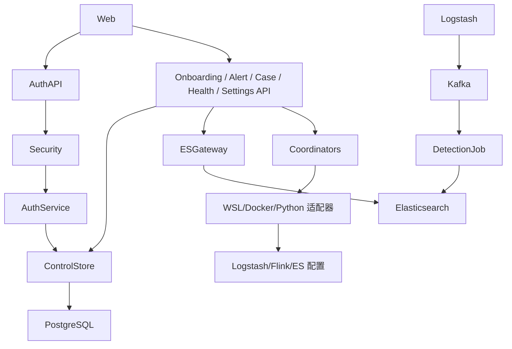
```mermaid
flowchart TD
  Web --> AuthAPI
  Web --> DomainAPI["Onboarding / Alert / Case / Health / Settings API"]
  AuthAPI --> Security
  Security --> AuthService
  AuthService --> ControlStore
  DomainAPI --> ControlStore
  DomainAPI --> ESGateway
  DomainAPI --> Coordinators
  Coordinators --> ProcessAdapters["WSL/Docker/Python 适配器"]
  ProcessAdapters --> Infra["Logstash/Flink/ES 配置"]
  Logstash --> Kafka
  Kafka --> DetectionJob
  DetectionJob --> Elasticsearch
  ESGateway --> Elasticsearch
  ControlStore --> PostgreSQL
```

## 5. 分层架构

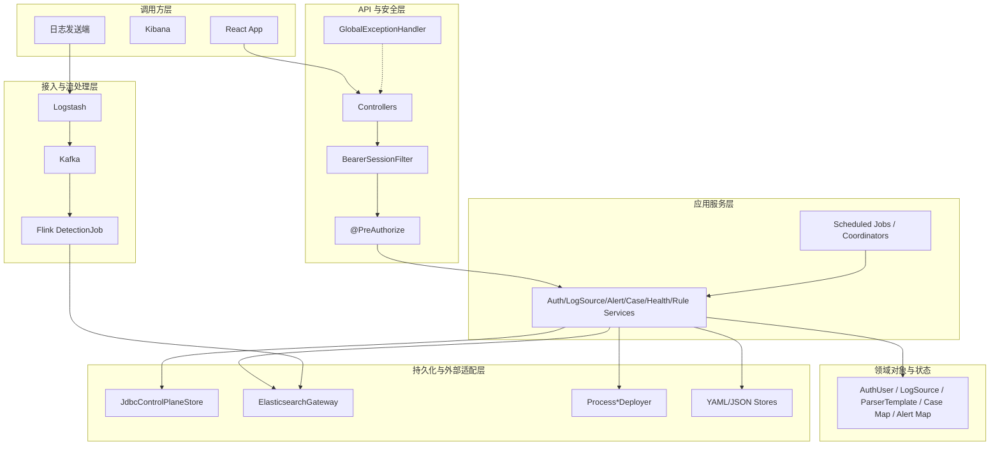
```mermaid
flowchart TB
  subgraph UI["调用方层"]
    React["React App"]
    Kibana["Kibana"]
    Sources["日志发送端"]
  end
  subgraph API["API 与安全层"]
    Controllers["Controllers"]
    Filter["BearerSessionFilter"]
    MethodSec["@PreAuthorize"]
    Errors["GlobalExceptionHandler"]
  end
  subgraph APP["应用服务层"]
    Services["Auth/LogSource/Alert/Case/Health/Rule Services"]
    Jobs["Scheduled Jobs / Coordinators"]
  end
  subgraph DOMAIN["领域对象与状态"]
    Objects["AuthUser / LogSource / ParserTemplate / Case Map / Alert Map"]
  end
  subgraph PORTS["持久化与外部适配层"]
    JDBC["JdbcControlPlaneStore"]
    ESG["ElasticsearchGateway"]
    Proc["Process*Deployer"]
    FileStores["YAML/JSON Stores"]
  end
  subgraph DATA["接入与流处理层"]
    LS["Logstash"]
    K["Kafka"]
    F["Flink DetectionJob"]
  end
  React --> Controllers
  Controllers --> Filter --> MethodSec --> Services
  Errors -.-> Controllers
  Services --> Objects
  Services --> JDBC
  Services --> ESG
  Services --> Proc
  Services --> FileStores
  Jobs --> Services
  Sources --> LS --> K --> F --> ESG
```

- **已确认**：Controller 基本薄化，行为主要位于 Service/Store/Gateway。
- **合理推断**：项目没有严格的 DDD aggregate/type-safe repository；大量 ES 文档使用 `Map<String,Object>`，因此“领域层”是轻量对象与服务内规则，不是独立领域模块。

## 6. 运行和部署架构

### 6.1 Compose 进程与端口

| 组件 | 容器/进程 | 主机端口 | 启动依赖 | 本次状态 |
|---|---|---:|---|---|
| PostgreSQL 16.4 | `siem-postgres` | 5432 | 无 | healthy |
| Elasticsearch 8.14 | `siem-elasticsearch` | 9200 | 无 | healthy |
| Kafka 3.8 KRaft 单节点 | `siem-kafka` | 9092 | 无 | healthy；`siem-events` 3 分区、RF=1、保留 3 天 |
| Kibana 8.14 | `siem-kibana` | 5601 | ES healthy | healthy |
| Logstash 8.14 | `siem-logstash` | 5000/5001/5002/5004/5005/5006/9600 | ES、Kafka healthy | healthy；6 pipelines |
| Flink JobManager | `siem-flink-jobmanager` | 8081 | Compose 无数据面 depends_on | healthy；检测 Job RUNNING |
| Flink TaskManager | `siem-flink-taskmanager` | 容器内 | JobManager healthy | running；2 slots |
| Spring Boot | 主机 Java 进程 | 8080 | PG 必需；ES 对部分 Bean/健康功能必需 | 本次未运行 |
| Vite | 主机 Node 进程 | 5173 | Spring 8080 | 本次未运行 |

证据：`infra/docker-compose.yml:1-144`、`src/main/resources/application.properties:1-54`、`web/vite.config.js:4-11`。

### 6.2 部署拓扑

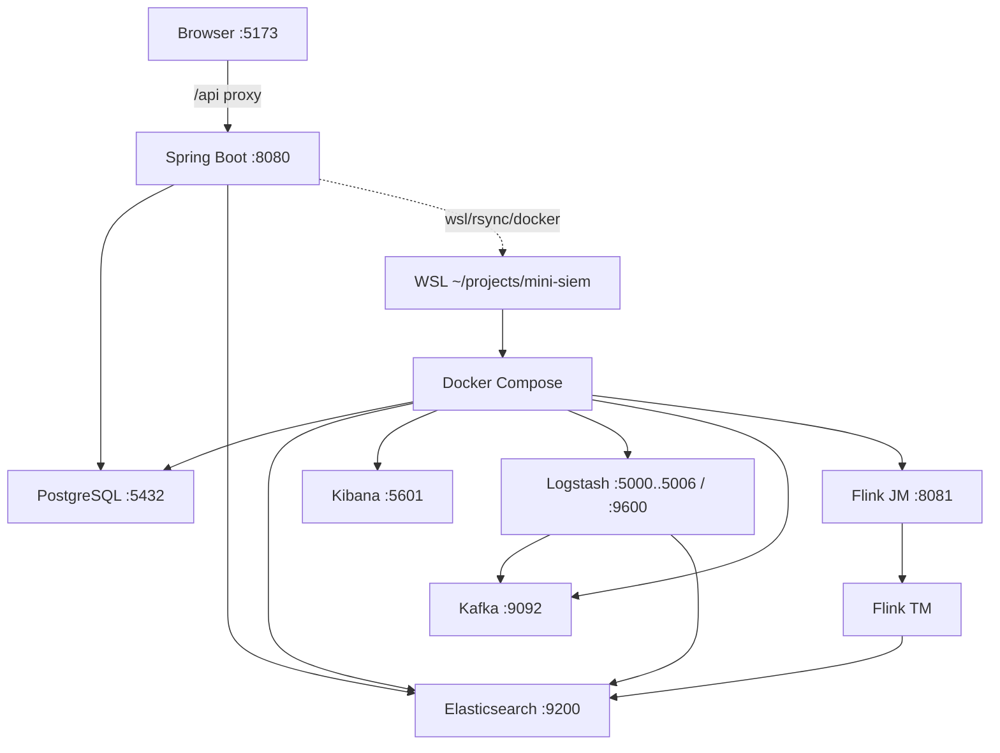
```mermaid
flowchart TB
  Browser["Browser :5173"] -->|/api proxy| Spring["Spring Boot :8080"]
  Spring --> PG["PostgreSQL :5432"]
  Spring --> ES["Elasticsearch :9200"]
  Spring -.->|wsl/rsync/docker| WSL["WSL ~/projects/mini-siem"]
  WSL --> Compose["Docker Compose"]
  Compose --> PG
  Compose --> ES
  Compose --> Kibana["Kibana :5601"]
  Compose --> Logstash["Logstash :5000..5006 / :9600"]
  Compose --> Kafka["Kafka :9092"]
  Compose --> JM["Flink JM :8081"]
  JM --> TM["Flink TM"]
  Logstash --> Kafka
  Logstash --> ES
  TM --> ES
```

### 6.3 配置加载和启动顺序

1. `infra/deploy.sh` 把 Compose、Logstash、Kafka 脚本、ES config 和 Flink 工程同步到 WSL，构建 JAR，执行 `docker compose up -d`，按健康状态等待。`infra/deploy.sh:58-124`
2. Kafka topic 由脚本显式创建；Flink 作业只有带 `--start-job` 或人工 `flink run` 才提交。`infra/deploy.sh:125-143`
3. Spring 启动时连接 `SIEM_DB_URL` 等环境变量覆盖后的数据源；显式 Flyway Bean 执行迁移后才构造 JDBC store。`src/main/resources/application.properties:2-10`、`src/main/java/com/xscsiem/hsiem_platform/control/ControlPlaneDatabaseConfig.java:17-26`
4. Vite 开发服务器把 `/api` 代理到 `localhost:8080`；生产静态资源如何托管在仓库中**待验证**，Compose 未包含前端/Nginx。
5. 新增/移除 TCP/syslog 源端口会执行 `docker compose up -d logstash` 重建；file 源发 HUP 热加载。`src/main/java/com/xscsiem/hsiem_platform/onboarding/ActivationCoordinator.java:69-83`、`src/main/java/com/xscsiem/hsiem_platform/onboarding/ActivationCoordinator.java:116-124`
6. 规则部署会同步 YAML，然后对运行 Job 创建 savepoint 并 cancel，再从最新 savepoint 提交新 Job。`src/main/java/com/xscsiem/hsiem_platform/rules/ProcessRulesDeployer.java:43-76`

### 6.4 部署待验证项

- **待验证**：生产环境前端静态文件由谁托管、TLS/反向代理在哪里终止。
- **待验证**：Spring Boot 是否作为系统服务自动重启；仓库只有手工 `spring-boot:run` 说明。
- **待验证**：Docker/WSL 命令执行账户的最小权限和审计。
- **开发运行态限制**：当前 WSL2/Docker Desktop 实例仍使用 ES security off、Kafka PLAINTEXT、单 broker RF=1，适合开发/单机，不是高可用安全部署。Compose 已参数化；`REQUIRE_PRODUCTION_SECURITY=1` 门禁会拒绝该配置，生产需提供 TLS/SASL、凭据和多节点/RF≥2。`infra/docker-compose.yml`、`infra/SECURITY.md`

## 7. 各核心模块实现细节

### 模块：认证、会话与 RBAC

#### 1. 模块职责

为 `/api/**` 提供 Bearer 会话认证和方法级角色授权；用户、会话、登录失败计数和审计落 PostgreSQL。**已确认**。

#### 2. 代码组成

- 入口：`AuthController.login/logout/me/users/roles/auditLogs`，`src/main/java/com/xscsiem/hsiem_platform/auth/AuthController.java:32-100`；
- 安全链：`SecurityConfig.apiSecurity`，`src/main/java/com/xscsiem/hsiem_platform/auth/SecurityConfig.java:41-60`；
- 过滤器：`BearerSessionFilter.doFilterInternal`，`src/main/java/com/xscsiem/hsiem_platform/auth/BearerSessionFilter.java:26-45`；
- 服务：`AuthService`；持久化端口/实现：`ControlPlaneStore`/`JdbcControlPlaneStore`；
- 表：`users`、`roles`、`auth_sessions`、`login_attempts`、`audit_logs`。

#### 3. 调用链

浏览器 `login()` → `POST /api/auth/login` → `AuthController.login` → `AuthService.login` → `JdbcControlPlaneStore.findUser/recordLoginFailure/createSession/audit` → PostgreSQL → token/role/expiresAt。后续请求 → `BearerSessionFilter` → `AuthService.authenticateToken` → hash token 查询 session → SecurityContext → `@PreAuthorize`。

#### 4. 配置来源

`app.auth.session-ttl` 默认 8h；失败 5 次、15 分钟窗口、锁 15 分钟，均可由 `SIEM_AUTH_*` 覆盖。数据库仅存 SHA-256 token hash。`src/main/resources/application.properties:37-43`、`src/main/java/com/xscsiem/hsiem_platform/auth/AuthService.java:47-54`、`src/main/java/com/xscsiem/hsiem_platform/auth/AuthService.java:354-364`

#### 5. 数据对象变化

`LoginRequest` → username/password 校验 → `AuthUser` → 随机 UUID token → SHA-256 → `auth_sessions` → 响应返回 token → localStorage → Authorization header。

#### 6. 状态变化

| 当前状态 | 触发动作 | 下一状态 | 失败状态 | 代码证据 |
|---|---|---|---|---|
| 无 session | 正确密码 | active session | 401/登录失败计数增加 | `src/main/java/com/xscsiem/hsiem_platform/auth/AuthService.java:101-135` |
| active session | 每次认证 | last_seen_at 更新，expiry 不延长 | 过期则删除/401 | `src/main/java/com/xscsiem/hsiem_platform/control/JdbcControlPlaneStore.java:101-113` |
| active session | logout/删用户 | session 删除 | logout 幂等 | `src/main/java/com/xscsiem/hsiem_platform/auth/AuthService.java:138-147`、`src/main/java/com/xscsiem/hsiem_platform/auth/AuthService.java:214-219` |
| failure_count < 5 | 错误密码 | count+1 | 达阈值 locked_until | `src/main/java/com/xscsiem/hsiem_platform/control/JdbcControlPlaneStore.java:148-178` |

#### 7. 异常、回滚和补偿

密码错误统一 401；认证/授权分别由安全链返回 JSON 401/403。登录失败更新在 JDBC 事务中加 `FOR UPDATE`。密码轮换通过 `POST /api/auth/password` 完成，首次登录/管理员新建用户在轮换前访问业务 API 返回 428；生产首启口令必须由 `SIEM_BOOTSTRAP_PASSWORD` 注入，不能依赖默认值。

#### 8. 前端消费

`web/src/api.js:159-213` 保存 token 到 localStorage；`web/src/App.jsx:174-215` 登录及用户管理。401 会清理 token，但不会统一跳转；下一次 React 状态变化才显示登录页。

#### 9. 模块图

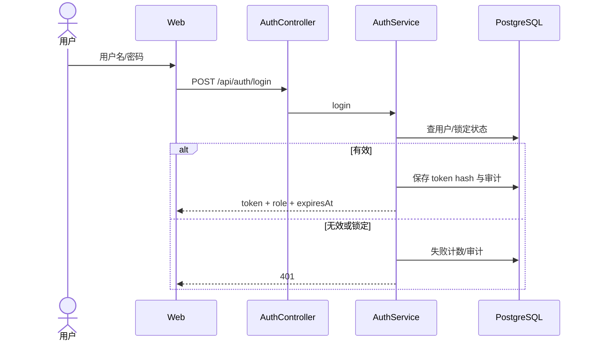
```mermaid
sequenceDiagram
  actor U as 用户
  participant W as Web
  participant C as AuthController
  participant A as AuthService
  participant P as PostgreSQL
  U->>W: 用户名/密码
  W->>C: POST /api/auth/login
  C->>A: login
  A->>P: 查用户/锁定状态
  alt 有效
    A->>P: 保存 token hash 与审计
    A-->>W: token + role + expiresAt
  else 无效或锁定
    A->>P: 失败计数/审计
    A-->>W: 401
  end
```

### 模块：控制面数据库与后台任务

#### 1. 模块职责

PostgreSQL 是控制面事务事实源；`background_tasks` 记录异步生命周期和关键度重算进度。**已确认**。

#### 2. 代码组成

`ControlPlaneDatabaseConfig`、`ControlPlaneStore`、`JdbcControlPlaneStore`、`BackgroundTaskController`、`BackgroundTaskRecovery`；迁移 V1-V7。案件控制面由 PG 事实源、case mirror outbox 和 ES 镜像收敛组成。`src/main/java/com/xscsiem/hsiem_platform/control/JdbcControlPlaneStore.java`、`src/main/java/com/xscsiem/hsiem_platform/control/BackgroundTaskRecovery.java`

#### 3. 调用链

业务 Service/Coordinator → `ControlPlaneStore.createTask/updateTask` 或用户/案件方法 → `JdbcTemplate` → PostgreSQL → `/api/tasks` 查询结果。

#### 4. 配置来源

`SIEM_DB_URL/USERNAME/PASSWORD/POOL_SIZE`，默认开发口令与 Compose 一致；Flyway location 为 classpath migration。配置缺失会使用默认值，PG 不可达时 Spring 启动失败。

#### 5. 数据对象变化

Service Map/AuthUser → JDBC 参数/JSON text → 关系表；任务 `queued` → executor → `running` → terminal。

#### 6. 状态变化

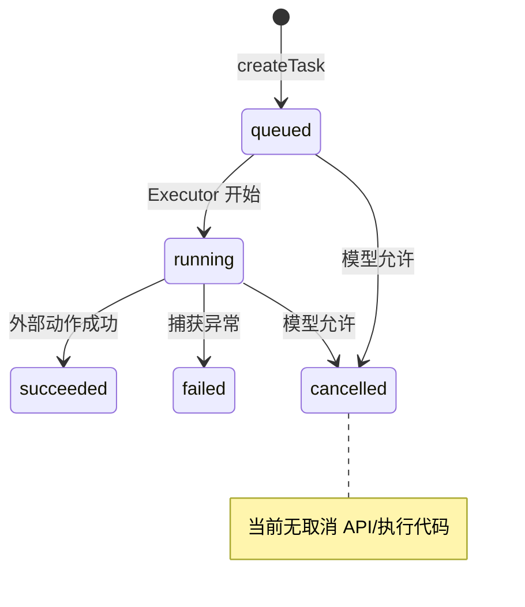
```mermaid
stateDiagram-v2
  [*] --> queued: createTask
  queued --> running: Executor 开始
  running --> succeeded: 外部动作成功
  running --> failed: 捕获异常
  queued --> cancelled: 模型允许
  running --> cancelled: 模型允许
  note right of cancelled
    当前无取消 API/执行代码
  end note
```

#### 7. 异常、回滚和补偿

PG 案件/关系操作可事务回滚；任务更新没有状态转移校验，任意调用者理论上可写任意合法 DB 状态。进程崩溃时 daemon executor 中任务消失，而 DB 行可能长期 queued/running；没有启动恢复器、heartbeat、lease、retry_count 或 timeout 扫描。

#### 8. 前端消费

`GET /api/tasks`/`{id}` 已封装；运行态页面只在进入或手动刷新时拉任务列表，不持续轮询具体 task。数据源页面轮询 LogSource 而非 task。`web/src/App.jsx:150-155`、`web/src/App.jsx:808-827`

#### 9. 模块图

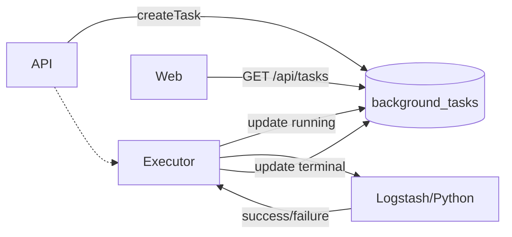
```mermaid
flowchart LR
  API -->|createTask| PG[(background_tasks)]
  API -.-> Executor
  Executor -->|update running| PG
  Executor --> External["Logstash/Python"]
  External -->|success/failure| Executor
  Executor -->|update terminal| PG
  Web -->|GET /api/tasks| PG
```

### 模块：解析模板与 Grok 门禁

#### 1. 模块职责

管理解析模板 YAML、样例解析和保存前正负样本门禁，为 onboarding 和 Logstash 生成器提供统一模板。当前有 ssh、nginx、firewall、windows 四个模板。

#### 2. 代码组成

`OnboardingController`、`ParserTemplateService`、`ParserTemplate`、`GrokTestService`、`SampleSizeValidator`；存储 `infra/parser-templates/*.yaml`。

#### 3. 调用链

`POST /api/parser-templates/test` → 查模板 → java-grok 编译/捕获字段 → ECS/action 补充 → `{ok,fields}`。保存：`POST /api/parser-templates` → `validateGate` → 正样本与 expect 比较 → 负样本不命中 → 覆盖 `<id>.yaml`。

#### 4. 配置来源

目录 `app.parser-templates-dir` 默认 `infra/parser-templates`。不存在目录时 list 返回空，但 save 没有主动 `mkdirs`，目录缺失时写入失败为 500。Grok 默认模式由 java-grok 注册。

#### 5. 数据对象变化

JSON `ParserTemplate` → Grok patterns/actions/tests → Java captures → YAML；模板在激活时再变为 Logstash filter 文本。

#### 6. 状态变化

模板的 `status` 只是 YAML 展示字段，没有后端状态机或合法值校验。相同 id 直接覆盖；无版本、删除、审计和引用保护。

#### 7. 异常、回滚和补偿

至少一个 pattern、至少一个正样本；每个正样本必须命中，expect 按字符串比较；negative 若存在必须全部不命中。失败为 400 且不写文件。写文件不是临时文件+原子替换，进程中断可能产生截断文件。

#### 8. 前端消费

向导可列表/测试/预览；`saveTemplate()` 只在 `api.js` 定义，`App.jsx` 没有调用，故自定义模板保存**后端闭环、前端未闭环**。

#### 9. 模块图

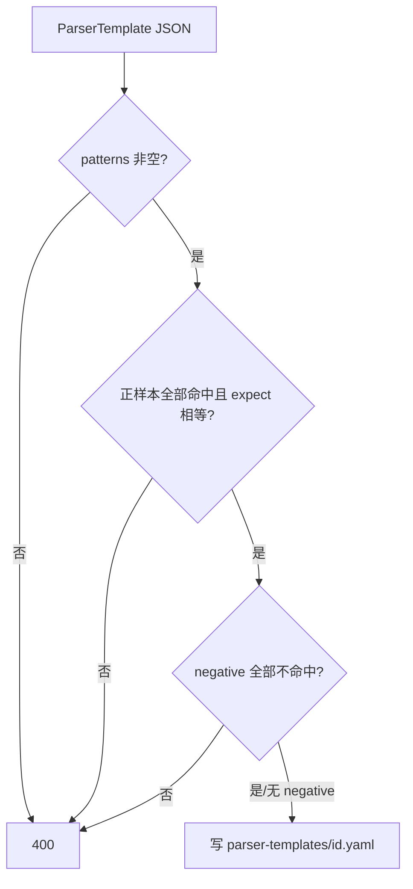
```mermaid
flowchart TD
  T["ParserTemplate JSON"] --> P{patterns 非空?}
  P -->|否| E400["400"]
  P -->|是| Pos{正样本全部命中且 expect 相等?}
  Pos -->|否| E400
  Pos -->|是| Neg{negative 全部不命中?}
  Neg -->|否| E400
  Neg -->|是/无 negative| YAML["写 parser-templates/id.yaml"]
```

### 模块：数据源生命周期与 Logstash 激活

#### 1. 模块职责

声明数据源、检测端口冲突、生成 per-source pipeline、异步激活/停用，并记录 LogSource 和 BackgroundTask 状态。

#### 2. 代码组成

`LogSourceService`、`LogSourceStore`、`LogSource`、`LogstashConfigGenerator`、`ActivationCoordinator`、`LogstashDeployer`/`ProcessLogstashDeployer`；配置落 `infra/log-sources/`、`infra/logstash/pipeline/log-sources/`、`pipelines.yml`、Compose。

#### 3. 调用链

Web → `OnboardingController.create/activate/deactivate/delete` → `LogSourceService` → `LogSourceStore` → executor → `ActivationCoordinator` → Generator → repo files → `ProcessLogstashDeployer` → WSL deploy dir → Logstash validate/recreate/HUP → 更新 YAML/task。

#### 4. 配置来源

Spring properties 定义 repo/WSL/deploy/container 路径；外部命令超时 120 秒。路径缺失、WSL/rsync/docker 不可用会变成激活失败。

#### 5. 数据对象变化

CreateSourceRequest → `LogSource.creating` → YAML → generated conf/pipelines/compose → deployed pipeline → status/task update → 事件中的 `log.source_id`/`log.source_name`。

#### 6. 状态变化

| 当前状态 | 触发动作 | 下一状态 | 失败状态 | 代码证据 |
|---|---|---|---|---|
| 无 | create | creating | 400/404/409，不落文件 | `src/main/java/com/xscsiem/hsiem_platform/onboarding/LogSourceService.java:61-91` |
| creating/failed | activate | active | failed | `src/main/java/com/xscsiem/hsiem_platform/onboarding/LogSourceService.java:121-165` |
| active | deactivate | stopped | active + lastError（状态未改） | `src/main/java/com/xscsiem/hsiem_platform/onboarding/LogSourceService.java:176-200` |
| active | activate | active（幂等返回） | — | `src/main/java/com/xscsiem/hsiem_platform/onboarding/LogSourceService.java:123-126` |
| stopped | activate | creating → active/failed | 202 + 指数退避轮询 | 同上 |
| 非 active | delete | 删除声明 | 文件删除失败 | `src/main/java/com/xscsiem/hsiem_platform/onboarding/LogSourceService.java:168-174` |

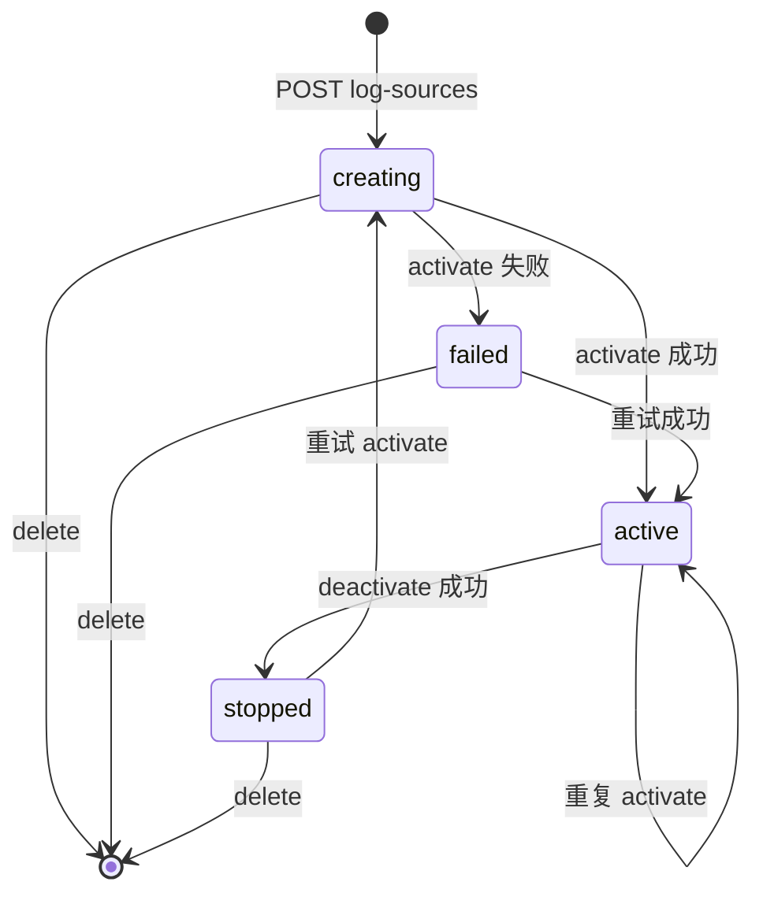
```mermaid
stateDiagram-v2
  [*] --> creating: POST log-sources
  creating --> active: activate 成功
  creating --> failed: activate 失败
  failed --> active: 重试成功
  active --> stopped: deactivate 成功
  active --> active: 重复 activate
  stopped --> creating: 重试 activate
  creating --> [*]: delete
  failed --> [*]: delete
  stopped --> [*]: delete
```

#### 7. 异常、回滚和补偿

- 端口冲突只扫描 LogSource YAML，不检查 OS/Compose 其他服务端口；单实例进程内已串行，多实例仍需共享锁。
- 激活先写 repo、同步、校验、重建/热加载。失败会还原 repo 文件并再次同步旧态；真实 WSL/Docker 故障注入仍需发布前演练。
- 同一个源按 `lifecycleInFlight` 串行；重试 `failed/stopped` 会先置 `creating`，避免旧终态被前端误判。
- delete active 时同步停用；停用失败则不删声明。非 active 删除不会额外清理可能残留的部署文件。

#### 8. 前端消费

激活/停用返回 202，前端轮询 `GET /api/log-sources/{id}` 最多 60 次，间隔 1–10 秒指数退避；统一请求函数有 10 秒超时，失败展示错误，任务页可继续查看后台状态。

#### 9. 模块图

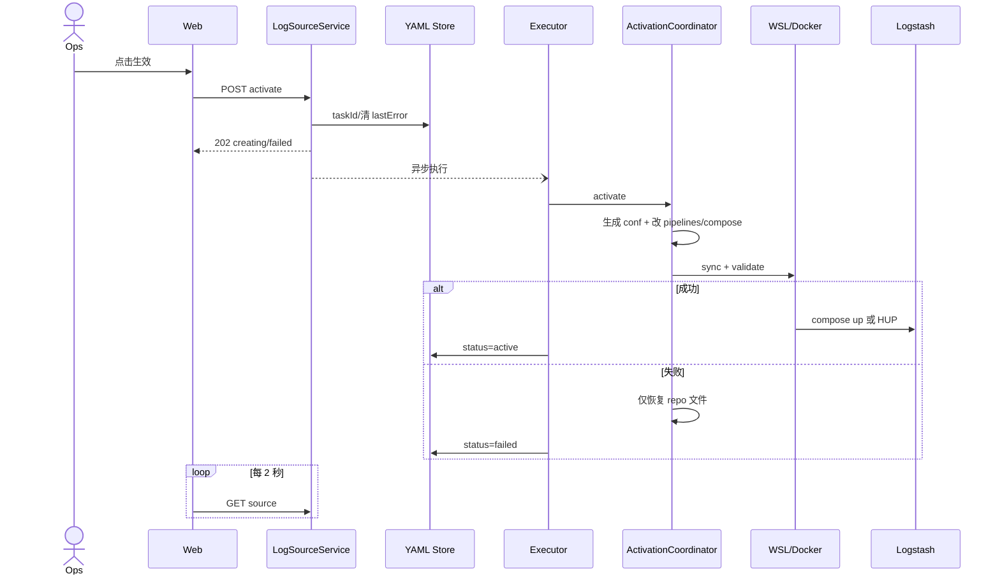
```mermaid
sequenceDiagram
  actor O as Ops
  participant W as Web
  participant S as LogSourceService
  participant Y as YAML Store
  participant E as Executor
  participant C as ActivationCoordinator
  participant D as WSL/Docker
  participant L as Logstash
  O->>W: 点击生效
  W->>S: POST activate
  S->>Y: taskId/清 lastError
  S-->>W: 202 creating/failed
  S--)E: 异步执行
  E->>C: activate
  C->>C: 生成 conf + 改 pipelines/compose
  C->>D: sync + validate
  alt 成功
    D->>L: compose up 或 HUP
    E->>Y: status=active
  else 失败
    C->>C: 仅恢复 repo 文件
    E->>Y: status=failed
  end
  loop 每 2 秒
    W->>S: GET source
  end
```

### 模块：Logstash 接入与多 Pipeline

#### 1. 模块职责

监听日志输入、Grok/date/ECS/GeoIP/威胁情报处理，将正常事件写 ES/Kafka，将主 pipeline 解析失败写 raw 索引。

#### 2. 代码组成

静态主配置 `infra/logstash/pipeline/logstash.conf`；动态配置由 `LogstashConfigGenerator` 生成；`infra/logstash/config/pipelines.yml` 注册 6 pipelines；全局持久队列、reload、DLQ 在 `logstash.yml`。

#### 3. 调用链

日志发送端 → input → add source markers（per-source）→ grok/date/mutate/geoip → ES output；正常主 pipeline 同时 → Kafka；Flink 后续检测。

#### 4. 配置来源

Compose 目录挂载 pipeline/config；`queue.type: persisted`、1 GB、reload 3s、DLQ enabled。`infra/logstash/config/logstash.yml:1-17`

#### 5. 数据对象变化

raw line → Logstash event → grok fields → `@timestamp` → ECS/GeoIP/TI/source marker → ES document + Kafka JSON。

#### 6. 状态变化

Pipeline 状态由 Logstash 管理，应用只以配置文件和 LogSource status 表达；没有读取 Logstash pipeline API 来校准 LogSource active 状态。

#### 7. 异常、回滚和补偿

主/动态 pipeline 的 `_parsefailure` 和 `_dateparsefailure` 均进入 `siem-events-raw-*`、不入 Kafka。Kafka/ES 双输出无分布式事务。TCP 没有应用层 ack；持久队列降低但不能消除发送端断线丢失。file input 使用 per-source 持久 sincedb。

#### 8. 前端消费

前端不直接操作 Logstash；通过 LogSource 状态与 DataHealth 查询间接消费。没有 pipeline metrics/detail 页面。

#### 9. 模块图

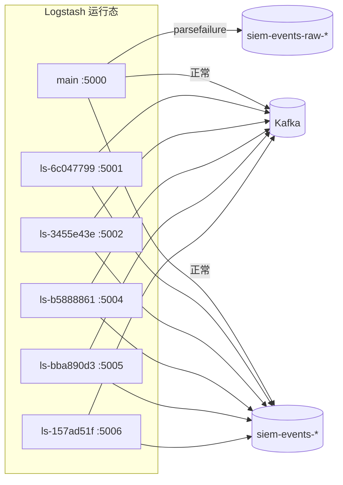
```mermaid
flowchart LR
  subgraph LS["Logstash 运行态"]
    Main["main :5000"]
    P1["ls-6c047799 :5001"]
    P2["ls-3455e43e :5002"]
    P3["ls-b5888861 :5004"]
    P4["ls-bba890d3 :5005"]
    P5["ls-157ad51f :5006"]
  end
  Main -->|正常| ES[(siem-events-*)]
  Main -->|parsefailure| Raw[(siem-events-raw-*)]
  Main -->|正常| K[(Kafka)]
  P1 --> ES
  P2 --> ES
  P3 --> ES
  P4 --> ES
  P5 --> ES
  P1 --> K
  P2 --> K
  P3 --> K
  P4 --> K
  P5 --> K
```

### 模块：Flink 检测与 Alert 生成

#### 1. 模块职责

消费 `siem-events`，加载 enabled 规则，执行 single/window/CEP/baseline 四类检测、抑制重复，向 `siem-alerts` 写入告警。

#### 2. 代码组成

`DetectionJob`、`EventParser/Event`、`RuleConfigLoader/RuleBuilder`、`DetectionFunction`、`WindowRuleFunction`、`BruteforceSuccessFunction`、`BaselineAnomalyFunction`、两个 suppressor；6 个 YAML 规则。

#### 3. 调用链

KafkaSource → `EventParser.parseEvent` → 单事件/事件时间窗口/CEP/基线分支 → union → ES Async Sink → deterministic `_id` upsert。

#### 4. 配置来源

规则目录优先 args[0]、再 `SIEM_RULES_DIR`、默认 `/opt/flink/rules`。RuntimeTuning 从 system property/环境变量加载，非法值退默认。checkpoint 30s、timeout 10m、ES batch 250 等默认值见 `flink/src/main/java/com/siem/config/RuntimeTuning.java:16-30`。

#### 5. 数据对象变化

Kafka JSON → flatten dotted fields → Event(raw, fields, timestamp) → rule match/window state → Alert JSON → SHA-1(rule/entity/timestamp) `_id` → ES document。

#### 6. 状态变化

Flink keyed state/checkpoint 保存 suppression 与 baseline；Kafka 从 committed offsets，首次 earliest。规则 enabled 变更必须重启 Job 才读到。

#### 7. 异常、回滚和补偿

解析 JSON 异常会使 map operator 失败并触发指数退避重启；无 side output/DLQ。非法/缺失时间戳退当前处理时间，可能改变窗口归属。ES sink 的 exactly-once 语义不是跨系统事务，但确定性 `_id` 使重放覆盖同一文档；Alert JSON 内部 `alert.id` 仍是随机值，覆盖时可能变化。

#### 8. 前端消费

告警页面经 Spring 查询 `siem-alerts`；规则页只控制 YAML/部署，不直连 Flink。

#### 9. 模块图

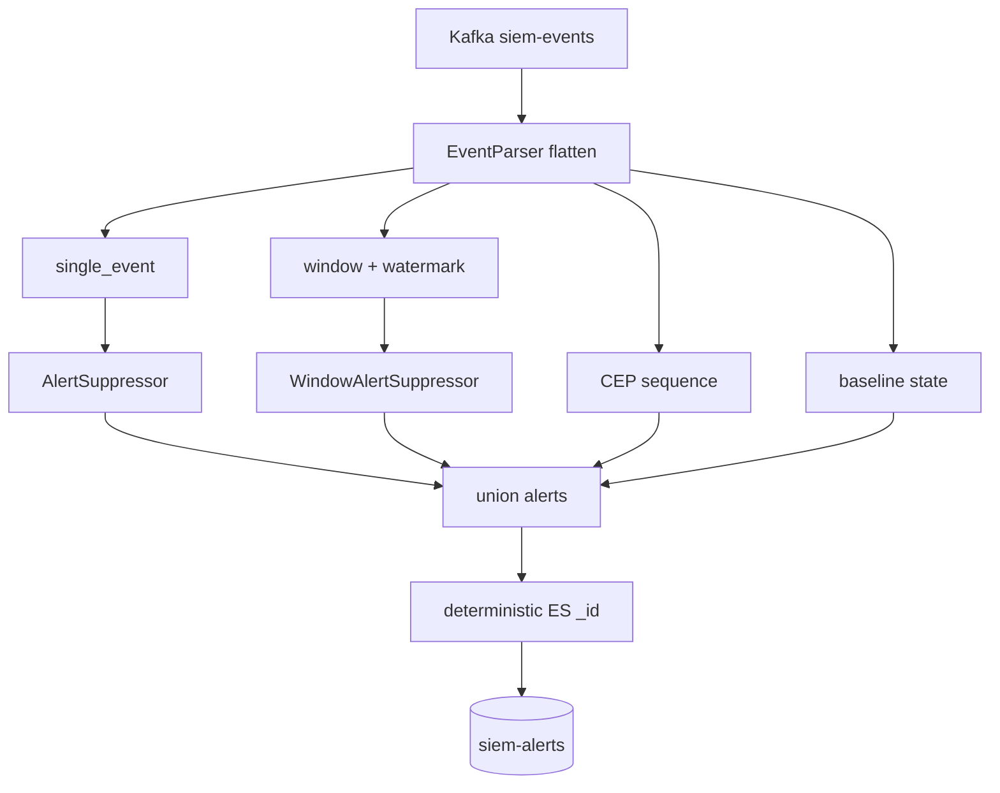
```mermaid
flowchart TD
  K["Kafka siem-events"] --> Parse["EventParser flatten"]
  Parse --> Single["single_event"]
  Parse --> Window["window + watermark"]
  Parse --> CEP["CEP sequence"]
  Parse --> Base["baseline state"]
  Single --> S1["AlertSuppressor"]
  Window --> S2["WindowAlertSuppressor"]
  S1 --> U["union alerts"]
  S2 --> U
  CEP --> U
  Base --> U
  U --> ID["deterministic ES _id"]
  ID --> ES[(siem-alerts)]
```

### 模块：Elasticsearch 查询与告警处置

#### 1. 模块职责

`ElasticsearchGateway` 封装项目实际使用的 search/count/get/index/update/delete；AlertService 提供列表、详情、状态/verdict、批量和 FP 率。

#### 2. 代码组成

`ElasticsearchClientConfig`、`ElasticsearchGateway`、`ElasticsearchHealthIndicator`、`AlertController/AlertService`；索引模板 `siem-alerts-template.json`。

#### 3. 调用链

Web alert API → Controller RBAC → AlertService 构建 DSL → Gateway/Java Client → ES → Map response → Web table/detail。

#### 4. 配置来源

`app.elasticsearch.url` 默认 `http://localhost:9200`；RestClient 共享连接池。生产构造器使用 Gateway；JDK HttpClient 分支仅供轻量单元测试构造器。

#### 5. 数据对象变化

ES hit → `_source + _id` → UI；状态请求 → GET `_seq_no/_primary_term` → partial doc → conditional `_update` → 最新详情。

#### 6. 状态变化

告警状态：open → acknowledged → investigating → resolved/closed；允许 open 快捷 resolved/closed；resolved/closed 可重开 open；终态必须 verdict。`src/main/java/com/xscsiem/hsiem_platform/alert/AlertService.java:228-255`

#### 7. 异常、回滚和补偿

409 转领域 Conflict；批量更新预校验状态但执行仍逐条，运行中冲突会收集 failed 并保留成功项。没有跨文档回滚。ES 缺索引时 Alert list 抛 500，不像 Case legacy list 有 404 容错。

#### 8. 前端消费

告警页、规则命中数、案件、通知 FP 扫描和健康服务都消费 ES；没有通用搜索 Controller，所谓“ES 查询场景”是这些领域接口，不是任意 DSL 透传 API。

#### 9. 模块图

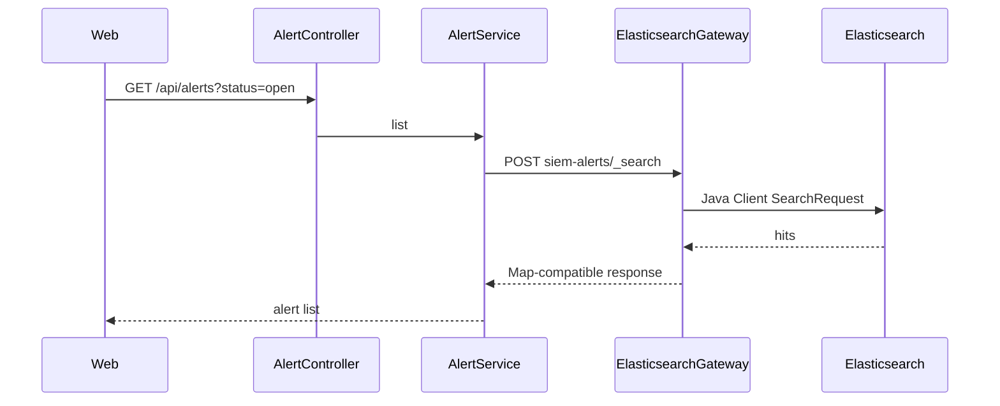
```mermaid
sequenceDiagram
  participant W as Web
  participant A as AlertController
  participant S as AlertService
  participant G as ElasticsearchGateway
  participant E as Elasticsearch
  W->>A: GET /api/alerts?status=open
  A->>S: list
  S->>G: POST siem-alerts/_search
  G->>E: Java Client SearchRequest
  E-->>G: hits
  G-->>S: Map-compatible response
  S-->>W: alert list
```

### 模块：Case、Evidence 与 Relation

#### 1. 模块职责

把至少两条 open 告警聚合为案件，维护状态、owner、collaborators、Evidence、alert relation 和实时事件时间线。

#### 2. 代码组成

`CaseController`、`CaseService`、`CaseAggregateJob`；PG `cases`/`case_alerts`；ES `siem-cases` 镜像与 `siem-alerts.alert.case_id`。

#### 3. 调用链

建案请求 → 逐个 `AlertService.detail` 校验 → 提取实体 → PG transaction 创建 case+relations → ES index case → 逐告警写 `alert.case_id` → 返回 PG detail。自动任务每 5 分钟查询近窗 open 告警分组后复用 create。

#### 4. 配置来源

ES URL；定时聚合 lookback 默认 30 分钟，fixedDelay 5 分钟、initialDelay 1 分钟。阈值手工接口可设 2-1000。

#### 5. 数据对象变化

alert IDs → Alert docs → entities → Case Map → `cases` JSON columns + `case_alerts` rows + `siem-cases` document → alert.case_id。Evidence 是 `List<Map>`，最多保留 100 项；不是独立实体。

#### 6. 状态变化

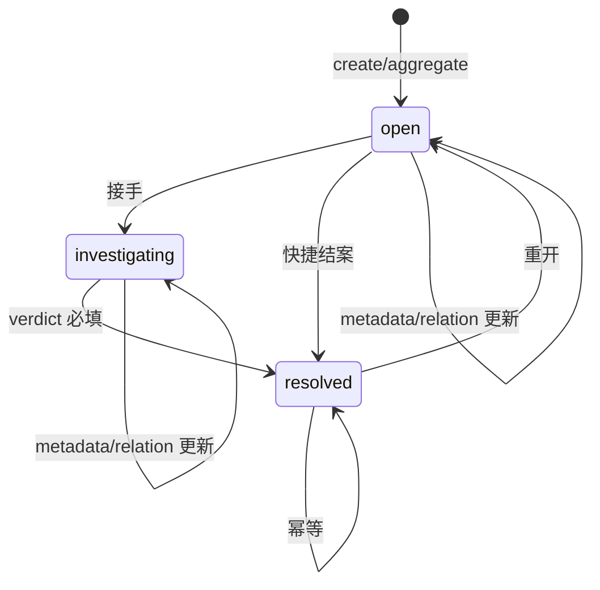
```mermaid
stateDiagram-v2
  [*] --> open: create/aggregate
  open --> investigating: 接手
  open --> resolved: 快捷结案
  investigating --> resolved: verdict 必填
  resolved --> open: 重开
  resolved --> resolved: 幂等
  open --> open: metadata/relation 更新
  investigating --> investigating: metadata/relation 更新
```

#### 7. 异常、回滚和补偿

初次 create 对 PG/ES/alert marker 有尽力补偿；但 clear marker 吞异常。`optimisticUpdate` 先改 ES case、再改 PG；PG 冲突时 ES 不回滚。结案逐条关闭告警，部分失败保留成功并不改 Case，形成部分成功状态。删除先删 ES 后删 PG，不清告警的 case_id；UI 又允许直接删除非空案件，可能留下 orphan marker。

#### 8. 前端消费

Cases 页面支持手动/自动聚合、接手、结案、owner、collaborators、Evidence URI、移出告警和 24h 时间线。Evidence 保存逻辑会用新输入的一条证据替换整列表，而非 append；空输入才沿用旧列表。`web/src/App.jsx:434-444`

#### 9. 模块图

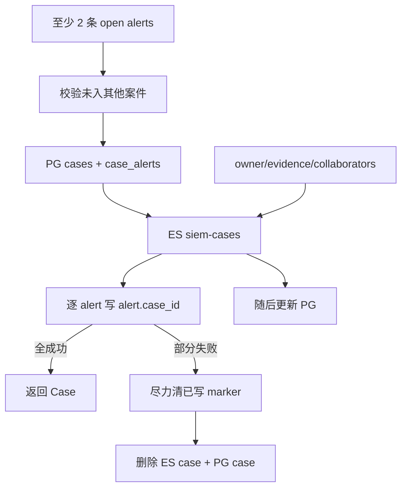
```mermaid
flowchart TD
  Alerts["至少 2 条 open alerts"] --> Validate["校验未入其他案件"]
  Validate --> PG["PG cases + case_alerts"]
  PG --> ESC["ES siem-cases"]
  ESC --> Mark["逐 alert 写 alert.case_id"]
  Mark -->|全成功| Case["返回 Case"]
  Mark -->|部分失败| Clear["尽力清已写 marker"]
  Clear --> Delete["删除 ES case + PG case"]
  Meta["owner/evidence/collaborators"] --> ESC
  ESC --> PGUpdate["随后更新 PG"]
```

### 模块：规则部署、关键度、通知与健康

#### 1. 模块职责

规则 YAML 控制 Flink 检测；关键度 JSON 触发实体风险 Python 重算；通知聚合 FP/接入/健康/部署事件；健康模块扫描数据质量和组件可达性。

#### 2. 代码组成

`RuleService/ProcessRulesDeployer`、`CriticalityService/CriticalityRecalcCoordinator`、`NotificationScanner/Service`、`DataHealthService/OperationalHealthService`。

#### 3. 调用链

- rule toggle → YAML → admin deploy → docker cp → savepoint cancel/run → notification；
- criticality set/batch → atomic file replace → recalc task → WSL Python → entity-risk ES → task/notification/audit；
- scheduled scan → Alert FP aggregation + DataHealth ES aggregation → PG notifications；
- health scan → PG query + ES ping + Kafka/Logstash TCP + Flink/Kibana HTTP。

#### 4. 配置来源

规则/ES/Flink/关键度路径来自 application.properties；通知扫描默认 30s 初延、60s fixed delay（注解默认）；运维 URL 可由 `SIEM_*` 覆盖。

#### 5. 数据对象变化

Rule YAML enabled → deployed runtime registry；Criticality level → numeric weight JSON → entity-risk docs；ES aggregation row → Notification row；component probe → scan response/Micrometer metrics。

#### 6. 状态变化

规则本身只有 YAML enabled，部署状态没有持久对象；关键度重算复用 background task 状态；Notification false→true(read)→deleted；健康是每次即时快照。

#### 7. 异常、回滚和补偿

规则部署同步后若 savepoint/cancel/run 中途失败，接口 500，且旧 Job 可能已停止；没有自动恢复旧规则/Job。Criticality 文件写入使用 temp+atomic move，较稳健；重算失败只标任务 failed，不回退关键度文件。健康 HTTP 将所有 `<500`（包括 401/404）判 UP，Logstash 仅 TCP connect，可能误报业务健康。

#### 8. 前端消费

规则、关键度、通知、数据健康、运行态页面均有消费。通知每 20 秒轮询；任务不自动轮询；规则 deploy 虽返回 202，但 Controller 内同步完成所有外部命令后才返回，不是真正 HTTP 异步。

#### 9. 模块图

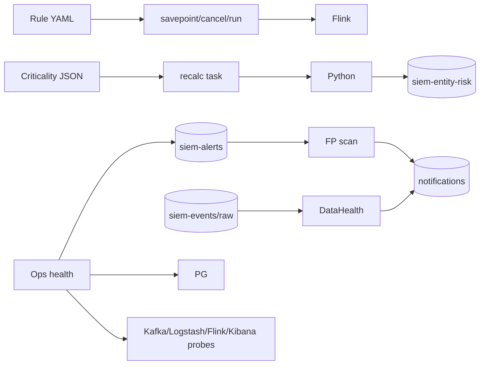
```mermaid
flowchart LR
  Rules["Rule YAML"] --> Deploy["savepoint/cancel/run"] --> Flink
  Crit["Criticality JSON"] --> Task["recalc task"] --> Python --> EntityRisk[(siem-entity-risk)]
  Alerts[(siem-alerts)] --> FP["FP scan"] --> N[(notifications)]
  Events[(siem-events/raw)] --> DH["DataHealth"] --> N
  Ops["Ops health"] --> PG
  Ops --> Alerts
  Ops --> Runtime["Kafka/Logstash/Flink/Kibana probes"]
```

## 8. 关键场景数据流

### 场景 1：登录、认证和会话校验

#### 业务目标

角色用户登录控制台并在后续 API 请求中获得身份与权限。**闭环判断：已闭环**。

#### 触发入口

`POST /api/auth/login`；前端 `login()`/登录页。`web/src/api.js:161-170`、`web/src/App.jsx:174-180`

#### 参与组件

AuthController、AuthService、BearerSessionFilter、SecurityConfig、JdbcControlPlaneStore、PostgreSQL、Web。

#### 详细执行步骤

1. 前端校验输入并 POST JSON；login 路径被 permitAll。
2. AuthService 检查 lockout、用户 active、BCrypt 密码。
3. 失败写 login_attempts/audit，返回 401；成功清失败记录。
4. 生成 UUID token，仅 hash 后存 auth_sessions，原文只返回前端。
5. 前端存 localStorage；后续请求自动 Bearer。
6. Filter hash token 查未过期 session，填 SecurityContext；方法级 RBAC 决定 403。
7. 相关单元/API/PG 测试通过。

#### Mermaid 图

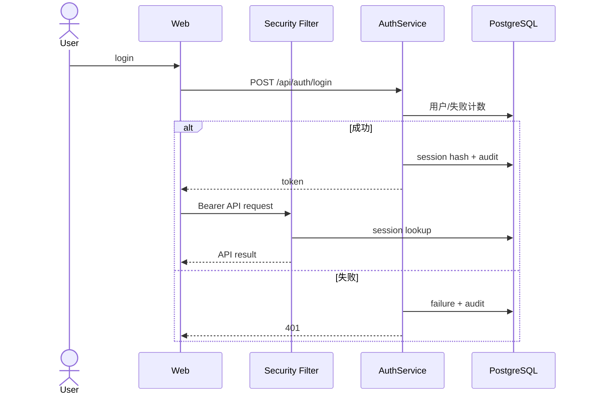
```mermaid
sequenceDiagram
  actor U as User
  participant W as Web
  participant F as Security Filter
  participant A as AuthService
  participant P as PostgreSQL
  U->>W: login
  W->>A: POST /api/auth/login
  A->>P: 用户/失败计数
  alt 成功
    A->>P: session hash + audit
    A-->>W: token
    W->>F: Bearer API request
    F->>P: session lookup
    F-->>W: API result
  else 失败
    A->>P: failure + audit
    A-->>W: 401
  end
```

#### 闭环判断

结论：**已闭环**。真实入口、逻辑、PG 副作用、状态反馈、前端和测试均存在；风险不改变主成功闭环。

### 场景 2：数据源创建

#### 业务目标

Ops/admin 创建尚未生效的数据源声明。**闭环判断：已闭环**。

#### 触发入口

`POST /api/log-sources`；向导第四步 `createLogSource()`。

#### 参与组件

OnboardingController、LogSourceService、ParserTemplateService、LogSourceStore、YAML、Web。

#### 详细执行步骤

1. RBAC 限制 admin/ops。
2. 查模板存在；规范协议；校验 file path 或端口范围。
3. 扫描已有 YAML 端口冲突。
4. 创建 `ls-<8 chars>`、status=creating、sourceId=id。
5. 保存 `infra/log-sources/<id>.yaml`，201 返回。
6. 前端把对象追加列表；失败 400/404/409。

#### Mermaid 图

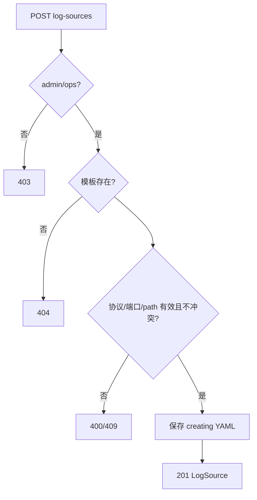
```mermaid
flowchart TD
  Req["POST log-sources"] --> Auth{admin/ops?}
  Auth -->|否| E403["403"]
  Auth -->|是| Template{模板存在?}
  Template -->|否| E404["404"]
  Template --> Validate{协议/端口/path 有效且不冲突?}
  Validate -->|否| E4xx["400/409"]
  Validate -->|是| YAML["保存 creating YAML"]
  YAML --> R201["201 LogSource"]
```

#### 闭环判断

结论：**已闭环**。创建本身已闭环；它不代表接入已生效。

### 场景 3：数据源 onboarding

#### 业务目标

从选模板、测样例、预览，到创建并激活数据源。**闭环判断：部分闭环**。

#### 触发入口

前端 `/wizard`；模板 list/test、source preview/create/activate 多个 API。

#### 参与组件

React Wizard、OnboardingController、模板/Grok、LogSourceService、ActivationCoordinator、Logstash、PG task、YAML。

#### 详细执行步骤

1. 页面加载模板；用户可跨步，不强制 test ok 才能创建。
2. test 限 8 KiB 并返回字段。
3. preview 只生成文本，不写配置。
4. create 写 creating YAML。
5. activate 创建任务并异步部署；页面轮询 source 状态。
6. 成功 active，失败 failed+lastError+通知。
7. stopped 状态重激活缺陷导致流程卡住。

#### Mermaid 图

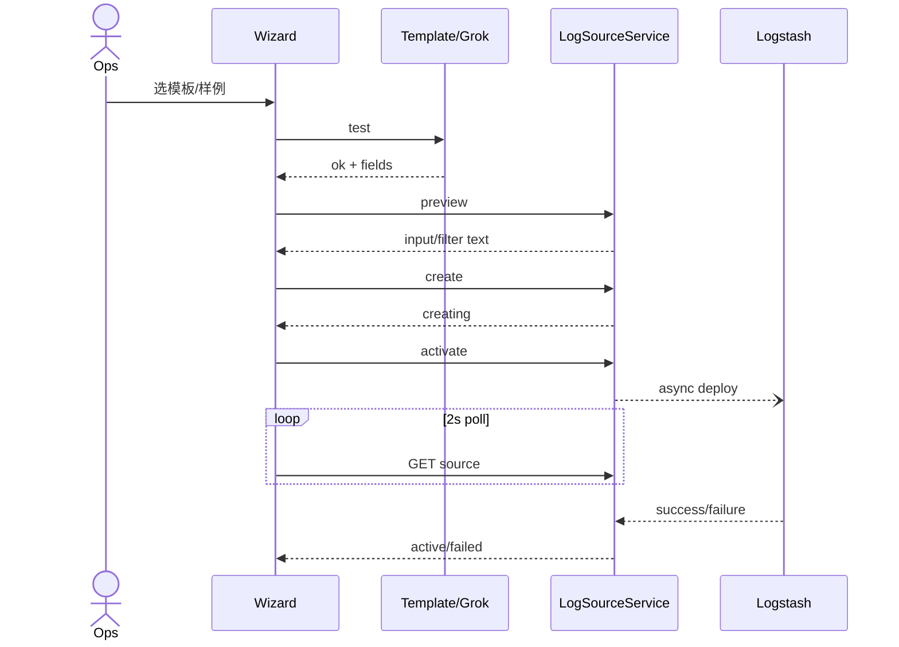
```mermaid
sequenceDiagram
  actor O as Ops
  participant W as Wizard
  participant T as Template/Grok
  participant S as LogSourceService
  participant L as Logstash
  O->>W: 选模板/样例
  W->>T: test
  T-->>W: ok + fields
  W->>S: preview
  S-->>W: input/filter text
  W->>S: create
  S-->>W: creating
  W->>S: activate
  S--)L: async deploy
  loop 2s poll
    W->>S: GET source
  end
  L-->>S: success/failure
  S-->>W: active/failed
```

#### 闭环判断

结论：**部分闭环**。主路径存在且当前已有 active pipeline；但向导无门禁、停用后重激活不闭环、部署补偿不完整。

### 场景 4：Logstash Pipeline 生成

#### 业务目标

把 LogSource + ParserTemplate 转为独立 input/filter/output pipeline。**闭环判断：部分闭环**。

#### 触发入口

preview 或 activate 内部调用 `generateInput/generateFilter/generatePipeline`。

#### 参与组件

LogstashConfigGenerator、ParserTemplate、LogSource、文件系统、Logstash。

#### 详细执行步骤

1. 根据 tcp/syslog/file 生成 input，注入 source id/name。
2. patterns 生成无尾逗号 grok 数组；timestamp 生成 date；ECS/actions 生成 mutate/if。
3. 补 pipeline/schema/related.ip 和 GeoIP。
4. 固定输出 ES `siem-events-*` + Kafka。
5. ActivationCoordinator 写 conf、注册 pipelines、改端口映射。
6. 单元测试只断言主要片段；未断言主/动态 pipeline parsefailure 一致性。

#### Mermaid 图

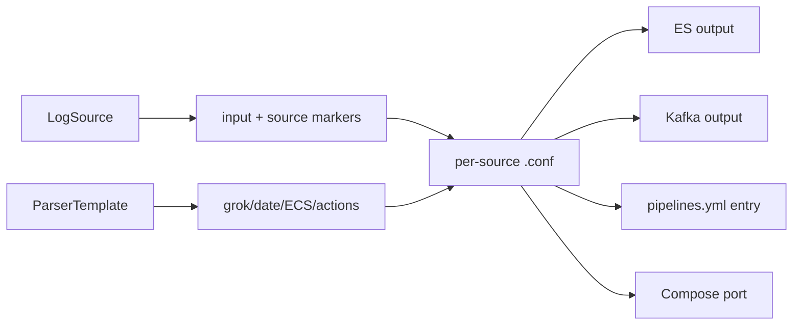
```mermaid
flowchart LR
  LS[LogSource] --> Input["input + source markers"]
  PT[ParserTemplate] --> Filter["grok/date/ECS/actions"]
  Input --> Conf["per-source .conf"]
  Filter --> Conf
  Conf --> ES["ES output"]
  Conf --> K["Kafka output"]
  Conf --> P["pipelines.yml entry"]
  Conf --> C["Compose port"]
```

#### 闭环判断

结论：**部分闭环**。生成与部署真实存在，但生成结果没有 raw 分流/TI enrich，与主 pipeline 行为不一致。

### 场景 5：数据源激活

#### 业务目标

让 creating/failed 数据源成为 Logstash 可监听的 active pipeline。**闭环判断：部分闭环**。

#### 触发入口

`POST /api/log-sources/{id}/activate` → 202。

#### 参与组件

Controller、LogSourceService、BackgroundTask、Executor、ActivationCoordinator、Generator、WSL/rsync/Docker、Logstash、Web。

#### 详细执行步骤

1. 读取 source；active/stopped 当前直接返回。
2. 创建 queued task，source 保存 taskId。
3. executor 标 running，调用 activateSync。
4. 生成并写三类配置；同步 WSL；容器内 config test 使用唯一 `/tmp` path.data。
5. 端口源 Compose 重建，file 源 HUP。
6. 成功 source active/task succeeded；失败 source failed/task failed/通知。
7. 前端轮询 source 而非 task。

#### Mermaid 图

```mermaid
flowchart TD
  A["activate 202"] --> Q["task queued"] --> R["executor running"]
  R --> Write["写 conf/pipelines/compose"]
  Write --> Sync["rsync/cp 到 WSL"]
  Sync --> Test{config test}
  Test -->|fail| RepoRollback["恢复 repo"] --> Failed["source/task failed"]
  Test -->|pass| Apply{port protocol?}
  Apply -->|yes| Recreate["compose up -d logstash"]
  Apply -->|no| HUP["kill -HUP 1"]
  Recreate --> Active["source active/task succeeded"]
  HUP --> Active
  Recreate -->|fail| RepoRollback
  HUP -->|fail| RepoRollback
```

#### 闭环判断

结论：**部分闭环**。成功路径有现实运行证据；并发幂等、stopped 重激活及部署态补偿未闭环。

### 场景 6：数据源停用

#### 业务目标

移除 pipeline/端口但保留声明为 stopped。**闭环判断：部分闭环**。

#### 触发入口

`POST /api/log-sources/{id}/deactivate` → 202。

#### 参与组件

LogSourceService、task/executor、ActivationCoordinator、repo 配置、WSL/Logstash、Web。

#### 详细执行步骤

1. 非 active 幂等返回；active 创建 task。
2. 备份并删除 conf、pipeline entry、端口映射。
3. 同步并 recreate/HUP。
4. 成功写 stopped；失败保留 active 状态并写 lastError/task failed。
5. 本地文件可恢复，但部署态没有恢复动作。
6. stopped 后 UI 允许生效，但后端不执行。

#### Mermaid 图

```mermaid
sequenceDiagram
  participant W as Web
  participant S as Service
  participant C as Coordinator
  participant L as Logstash
  W->>S: POST deactivate
  S-->>W: 202
  S-)C: async deactivate
  C->>C: 删除 repo 配置
  C->>L: sync + recreate/HUP
  alt success
    S->>S: status=stopped
  else failure
    C->>C: 恢复 repo 配置
    S->>S: 保持 active + lastError
  end
```

#### 闭环判断

结论：**部分闭环**。有入口、实现、状态和前端；恢复旧运行态与再激活缺失。

### 场景 7：数据源回滚

#### 业务目标

激活/停用失败后恢复变更前配置。**闭环判断：部分闭环**。

#### 触发入口

没有独立 HTTP 回滚 API；由 ActivationCoordinator catch 自动触发。

#### 参与组件

ActivationCoordinator、repo 文件、部署目录、Logstash、LogSourceService。

#### 详细执行步骤

1. 激活备份 pipelines/compose，但新 conf 没有旧内容备份（重试时默认应不存在）。
2. 异常时删除 conf、还原 pipelines/compose。
3. 停用会备份三类文件并本地恢复。
4. rollback 自身 IOException 只 stderr，原异常继续；source 最终 failed 或 active+lastError。
5. 没有重新 sync 恢复后的文件，没有 restart/HUP 恢复容器。

#### Mermaid 图

```mermaid
flowchart TD
  Fail["validate/sync/restart 失败"] --> Repo["恢复仓库文件"]
  Repo --> RbOk{恢复文件成功?}
  RbOk -->|否| Stderr["仅 stderr"]
  RbOk -->|是| Status["更新 source/task 失败"]
  Stderr --> Status
  Status -.-> Missing["未重新同步部署目录"]
  Missing -.-> Runtime["容器可能仍为新/部分配置"]
```

#### 闭环判断

结论：**部分闭环**。单元测试覆盖 repo 文件恢复；真实部署态补偿和故障注入演练缺失。

### 场景 8：日志从接入到 Elasticsearch

#### 业务目标

把外部日志解析、标准化并持久化为可查事件。**闭环判断：部分闭环**。

#### 触发入口

TCP 5000/5001/5002/5004/5005/5006，或动态 file/syslog input。

#### 参与组件

数据源、Logstash pipeline/persistent queue、ES、Kafka、Flink（告警支路）。

#### 详细执行步骤

1. input 接收 raw line；per-source 注入 source marker。
2. grok 提字段；date 设置事件时间；mutate ECS；GeoIP（主还做 TI）。
3. 主 parsefailure → raw ES；主正常 → event ES+Kafka。
4. 动态 pipeline 已统一 parse/date failure raw 分流，正常结果才进入 event ES+Kafka。
5. Kafka 事件供 Flink，Flink告警另写 ES。
6. 当前 ES 已有事件/告警文档，证明运行态副作用存在；未执行本次写入式 E2E 注入。

#### Mermaid 图

```mermaid
flowchart LR
  Src["日志源"] --> Q["Logstash persisted queue"] --> Parse{grok success?}
  Parse -->|main fail| Raw[(siem-events-raw-*)]
  Parse -->|success| Event[(siem-events-*)]
  Parse -->|per-source fail 当前实现| Event
  Parse -->|success| Kafka[(siem-events)]
  Parse -->|per-source fail 当前实现| Kafka
  Kafka --> Flink --> Alert[(siem-alerts)]
```

#### 闭环判断

结论：**部分闭环**。成功链路运行中；失败分流不一致、Kafka/ES 无原子性、无自动 E2E 测试，判部分闭环。

### 场景 9：解析模板保存和校验

#### 业务目标

用可回归样例保存自定义 parser。**闭环判断：部分闭环**。

#### 触发入口

`POST /api/parser-templates`；API client 有 `saveTemplate`，页面无调用。

#### 参与组件

Controller、ParserTemplateService、GrokTestService、YAML、GlobalExceptionHandler。

#### 详细执行步骤

1. admin/ops 鉴权。
2. id/patterns/tests 门禁。
3. 逐正样本解析、expect 字符串比较。
4. 逐 negative 确认不匹配。
5. 通过后覆盖 `<id>.yaml`；201 返回。
6. 单元测试与四个预置模板 gate 测试通过。

#### Mermaid 图

```mermaid
sequenceDiagram
  participant C as Caller
  participant API as Controller
  participant S as TemplateService
  participant G as Grok
  participant F as YAML
  C->>API: POST parser-template
  API->>S: save
  loop positive tests
    S->>G: parse + expect
  end
  loop negative tests
    S->>G: must not match
  end
  alt pass
    S->>F: overwrite id.yaml
    API-->>C: 201
  else fail
    API-->>C: 400
  end
```

#### 闭环判断

结论：**部分闭环**。后端闭环；没有前端表单/消费、版本/删除/原子写和审计。

### 场景 10：Elasticsearch 查询

#### 业务目标

通过领域 API 查询告警、案件、健康、命中数和时间线。**闭环判断：已闭环**。

#### 触发入口

示例 `GET /api/alerts`、`GET /api/alerts/{id}`；无通用 search API。

#### 参与组件

Web、Spring Security、领域 Controller/Service、ElasticsearchGateway、ES。

#### 详细执行步骤

1. Web 自动 Bearer。
2. Controller RBAC。
3. Service 构造受控 DSL 和索引路径。
4. Gateway 解析 project-used path，构造 Java Client request。
5. Gateway 把 typed response 转兼容 Map；Service 提取 `_source/_id`。
6. 错误由 GlobalExceptionHandler 统一 500/4xx；ES optimistic conflict 转 409。

#### Mermaid 图

```mermaid
sequenceDiagram
  actor U as Analyst
  participant W as Web
  participant C as Domain Controller
  participant S as Domain Service
  participant G as ES Gateway
  participant E as Elasticsearch
  U->>W: 打开告警/案件页
  W->>C: GET /api/alerts
  C->>S: list
  S->>G: controlled DSL
  G->>E: Java Client
  alt success
    E-->>G: hits/aggs
    G-->>W: JSON list
  else ES error
    G-->>W: 4xx/500 JSON error
  end
```

#### 闭环判断

结论：**已闭环**。真实入口、实现、ES 数据、结果、前端消费均存在；测试对 Gateway 的真实 ES 集成覆盖不足是测试风险，不否定主链。

### 场景 11：Case 创建

#### 业务目标

把至少两条 open、未归案告警创建为调查案件。**闭环判断：部分闭环**。

#### 触发入口

`POST /api/cases`；前端勾选告警手动创建；定时/手工 aggregate 也复用 create。

#### 参与组件

CaseController/Service、AlertService、PG cases/case_alerts、ES siem-cases/siem-alerts、Web。

#### 详细执行步骤

1. analyst/admin 鉴权；请求至少 2 IDs。
2. 逐告警 GET，检查 open 和无 case_id。
3. 提取 IP/user entities，生成 case id/map。
4. PG 事务写 case/unique relations。
5. ES 写 case 镜像。
6. 逐告警写 case_id；失败清 marker、删两处 case。
7. 返回 PG detail；前端打开详情。

#### Mermaid 图

```mermaid
sequenceDiagram
  participant W as Web
  participant C as CaseService
  participant A as AlertService/ES
  participant P as PostgreSQL
  participant E as siem-cases
  W->>C: POST cases(alertIds)
  C->>A: validate each alert
  C->>P: transaction create case+relations
  C->>E: index case
  loop alerts
    C->>A: set alert.case_id
  end
  alt all success
    C-->>W: Case
  else marker failure
    C->>A: clear successful markers best-effort
    C->>E: delete case
    C->>P: delete case
    C-->>W: 500
  end
```

#### 闭环判断

结论：**部分闭环**。主路径完整；跨 ES/PG 补偿非原子且服务测试未执行完整双写链。

### 场景 12：Evidence 添加

#### 业务目标

给案件保存证据引用。**闭环判断：部分闭环**。

#### 触发入口

`PATCH /api/cases/{id}/metadata`，payload `{owner,evidence}`；案件详情页面。

#### 参与组件

Web、CaseController/Service、ES case、PG cases.evidence_json。

#### 详细执行步骤

1. 页面构造一条 `{type:'reference',title,uri}`，或在空输入时沿用旧列表。
2. 后端最多保留 100 项，只复制 map，不校验 type/title/uri 格式或 URI 安全。
3. optimisticUpdate 先写 ES，再写 PG JSON。
4. 返回更新后 PG case，UI 展示。

#### Mermaid 图

```mermaid
flowchart LR
  Form["title + uri"] --> Payload["evidence List<Map>"]
  Payload --> ES["更新 siem-cases"]
  ES --> PG["更新 cases.evidence_json"]
  PG --> UI["详情展示"]
  ES -->|PG conflict| Drift["双存储不一致"]
```

#### 闭环判断

结论：**部分闭环**。保存与展示存在；Evidence 没有独立 ID/表/审计/append/delete API，且双写补偿缺失。

### 场景 13：Relation 创建

#### 业务目标

建立 Case↔Alert 关系。项目没有通用 Relation 领域对象；实际 Relation 是 `case_alerts` 和 ES 的 `alert.case_id`。**闭环判断：部分闭环**。

#### 触发入口

建案或 `POST /api/cases/{id}/alerts`；无独立 `/relations` API。

#### 参与组件

CaseService、JdbcControlPlaneStore、case_alerts、siem-alerts、Web。

#### 详细执行步骤

1. 校验目标 case 未 resolved，alert open 且未属于别案。
2. 更新 case alert_ids（ES→PG）。
3. PG update transaction 删除旧 relations、插入最终集合；DB unique(alert_id) 阻止一警多案。
4. 再写新增告警 case_id；失败尝试把 case alert list 回退。
5. remove 先更新 case，再清 alert.case_id；清除失败被吞。

#### Mermaid 图

```mermaid
flowchart TD
  Add["POST case/id/alerts"] --> Check["校验 alert"]
  Check --> CaseDoc["更新 case.alert_ids"]
  CaseDoc --> Rel[(case_alerts unique alert_id)]
  Rel --> Marker["siem-alerts alert.case_id"]
  Marker -->|fail| Roll["尝试恢复 case.alert_ids"]
  Remove["DELETE case/id/alerts/alert"] --> CaseDoc
  Remove --> Clear["清 alert.case_id best-effort"]
```

#### 闭环判断

结论：**部分闭环**。特定 alert-case relation 有实现与 PG 事务约束；通用 Relation 不存在，双写一致性仍是部分闭环。

### 场景 14：后台任务执行

#### 业务目标

异步执行耗时的 source 激活/停用和 criticality 重算，并反馈进度。**闭环判断：部分闭环**。

#### 触发入口

source activate/deactivate、`POST /api/settings/criticality/recalc`；查询 `/api/tasks`。

#### 参与组件

业务 Controller、Coordinator/Service、static ExecutorService、ControlPlaneStore、PG、外部命令、Web。

#### 详细执行步骤

1. 同步创建 queued DB row 并返回 taskId（source 回应嵌入 LogSource）。
2. 内存 executor 接收 Runnable。
3. runnable 标 running、调用外部动作、标 succeeded/failed。
4. 任务状态字段包含 progress/message/error/timestamps。
5. 前端运行态任务每 10 秒刷新；source 页面最多轮询 60 次并显示超时。
6. JVM 重启/心跳超时由 `BackgroundTaskRecovery` 收敛为 failed；尚无跨实例 lease、retry/cancel API。

#### Mermaid 图

```mermaid
stateDiagram-v2
  [*] --> queued: API createTask
  queued --> running: daemon executor
  running --> succeeded: command succeeds
  running --> failed: exception caught
  queued --> failed: recovery timeout
  running --> failed: recovery timeout
  note right of failed
    启动及每分钟扫描 stale 任务
  end note
```

#### 闭环判断

结论：**部分闭环**。实际任务会执行且状态可查；stale recovery 和自动轮询已补齐，但可靠调度、跨实例 lease、取消和自动重试仍未闭环。

### 场景 15：健康检查

#### 业务目标

查看数据源解析质量和六类运行组件可达性。**闭环判断：部分闭环**。

#### 触发入口

`GET /api/data-health/sources|trend|failures`；`GET /api/ops/health-scan`；通知定时扫描。

#### 参与组件

DataHealth/OperationalHealth、ES、PG、Kafka、Logstash、Flink、Kibana、Micrometer、Web。

#### 详细执行步骤

1. DataHealth 聚合 event/raw 源并集，计算 1h 失败率、环比和最小样本阈值。
2. 异常可写通知；trend/failures 可下钻。
3. Ops scan 依次 PG SELECT 1、ES ping、Kafka/Logstash TCP、Flink/Kibana HTTP。
4. 所有组件 UP 才总 UP；结果含 latency/error/metrics。
5. 当前容器均健康，但 Spring API 本次未运行，未通过 HTTP 调该接口。

#### Mermaid 图

```mermaid
flowchart TD
  Req["GET health-scan"] --> PG["PostgreSQL SELECT 1"]
  Req --> ES["Elasticsearch ping"]
  Req --> K["Kafka TCP"]
  Req --> L["Logstash TCP"]
  Req --> F["Flink /overview"]
  Req --> B["Kibana /api/status"]
  PG --> All{全部 UP?}
  ES --> All
  K --> All
  L --> All
  F --> All
  B --> All
  All -->|yes| UP["UP response"]
  All -->|no| Down["DOWN + component error"]
```

#### 闭环判断

结论：**部分闭环**。查询、展示和当前组件运行证据存在；探针较浅、动态 pipeline 失败分流影响 DataHealth 口径、OperationalHealth 无测试。

### 场景 16：前端调用后端 API 的完整链路

#### 业务目标

浏览器通过统一客户端安全调用 Spring API 并展示结果/状态。**闭环判断：部分闭环**。

#### 触发入口

路由 `/wizard`、`/rules`、`/alerts`、`/cases`、`/health`、`/ops/health`、`/criticality`、`/notifications`、`/rbac`。

#### 参与组件

React App、api.js、Vite proxy、Spring Security/Controller/Service、PG/ES/数据面。

#### 详细执行步骤

1. Vite 把 `/api` 代理 8080；token 自动加 header。
2. 初次 mount 并行加载多模块数据，很多 catch 静默为空数组。
3. 401 清 token；App 的 user state 不一定立即同步清空。
4. RBAC 在后端强制；菜单本身主要依 user role 控制部分区域。
5. 激活 2s 轮询 source；通知 20s 轮询；tasks 只手动刷新。
6. 2xx JSON 正常展示；204 会因无条件 `r.json()` 抛异常，若调用方 catch 吞掉则 UI仍可能刷新成功，否则误报失败。
7. 本次 build 成功；未发现前端测试/E2E。

#### Mermaid 图

```mermaid
sequenceDiagram
  actor U as User
  participant R as React
  participant A as api.js
  participant V as Vite Proxy
  participant S as Spring Security/API
  participant D as PG/ES
  U->>R: 页面操作
  R->>A: API function
  A->>V: /api + Bearer
  V->>S: localhost:8080
  S->>D: query/update
  alt JSON success
    D-->>R: 2xx JSON
  else 204 success
    D-->>A: empty body
    A-->>R: JSON parse error
  else 401
    S-->>A: 401 JSON
    A->>A: clear localStorage token
  end
```

#### 闭环判断

结论：**部分闭环**。主要页面/API 映射完整且能构建；204 契约、静默错误、轮询超时和 E2E 测试缺失使整体仅部分闭环。

## 9. 数据对象生命周期

| 对象 | 创建入口 | 更新/状态 | 存储 | 读取方 | 删除/停用 | 审计与孤儿风险 |
|---|---|---|---|---|---|---|
| User | admin `POST /api/auth/users`；空库 bootstrap admin | role/status 字段；仅 role API，无 disable/改密 | PG users；legacy YAML 仅首次导入 | Auth/filter/admin page | admin delete，先删 sessions | create/delete/role 有审计但 actor 固定 system；响应暴露 hash |
| Session/Token | login | absolute expiresAt，lastSeen 更新不续期 | PG auth_sessions 存 hash | Filter/AuthService | logout、过期访问、下次 login cleanup、删用户 | 无 session 管理/全局撤销 UI；过期行可能到下次清理才删 |
| LogSource | create | creating/active/failed/stopped；taskId/lastError | YAML | onboarding、generator、DataHealth 以 source marker 间接关联 | active 先 deactivate；非 active 直接删 | 无业务审计；部署残留可成为孤儿 |
| ParserTemplate | save/预置文件 | status 非受控；同 id 覆盖 | YAML | test/preview/activation | 无删除 | 无审计/引用完整性；删除文件会使 LogSource 引用孤儿 |
| PipelineConfig | activate 派生 | conf/pipelines/compose + Logstash runtime | repo + WSL bind mount + 容器 | Logstash | deactivate/delete active | repo/runtime 可漂移；无 revision/checksum 状态 |
| BackgroundTask | source/criticality coordinator | queued/running/succeeded/failed；schema 还允许 cancelled | PG background_tasks | tasks API/ops page | 无清理/取消 | JVM 重启形成 stuck queued/running |
| LogEvent | Logstash ingest | append-only；ILM 365d；raw 30d | ES siem-events-* / raw；Kafka 临时 3d | Flink、health、case timeline、Kibana | ILM | 无应用级审计；双输出可能缺一份；file 源可重复 |
| Alert/SecurityEvent | Flink rule match | 状态/verdict/case_id，ES 乐观锁 | ES siem-alerts | Alert/Case/Rule/Notification/Kibana | 无删除 API；ILM 180d | operator 写入但无独立审计表；batch/Case 可部分成功 |
| Case | 手工/自动 aggregate | open/investigating/resolved；owner/verdict/collaborators | PG cases + ES siem-cases | Case API/Web | admin delete | 双写漂移；删除不清 alert marker |
| Evidence | Case metadata PATCH | 整个列表替换，最多 100 | PG evidence_json + ES case | Case detail/Web | 随 case 或整体替换 | 无 ID/owner/hash/audit；外链可能失效形成逻辑孤儿 |
| Relation | 建案/add alert | case_alerts 集合 + alert.case_id | PG + ES marker | Case detail/聚合幂等 | remove/delete case cascade | 清 marker失败会留下 orphan；无通用 Relation 模块 |

### 9.1 组合生命周期图

```mermaid
stateDiagram-v2
  state UserSession {
    [*] --> NoSession
    NoSession --> ActiveSession: login
    ActiveSession --> NoSession: logout/expire/delete user
  }
  state AlertCase {
    [*] --> OpenAlert
    OpenAlert --> InCase: create/add relation
    InCase --> OpenAlert: remove relation
    InCase --> ClosedAlert: resolve case
    OpenAlert --> ClosedAlert: triage
    ClosedAlert --> OpenAlert: reopen
  }
```

## 10. 状态机分析

### 10.1 状态机一致性结论

- **LogSource**：DB task 与 YAML source 是两个状态面，没有事务；`stopped` 的转移实现与 UI意图冲突。
- **BackgroundTask**：数据库约束列出 5 状态，但应用仅产生 queued/running/succeeded/failed；cancelled 是未使用模型。
- **Alert**：状态机由 Service 校验，ES mapping 只限定 keyword 不限定枚举；Flink 每次确定性 upsert 可能用新生成的 open 文档覆盖分析师已处置字段，尤其同一 `_id` 在 suppression timer 再次输出时。此风险由 `DetectionFunction` 每次构建完整 open alert 与 ES `IndexOperation` 覆盖写推导，标记为**合理推断**。`flink/src/main/java/com/siem/DetectionFunction.java:37-61`、`flink/src/main/java/com/siem/DetectionJob.java:246-260`
- **Case**：允许 open 直接 resolved，也允许 resolved→open；从 investigating 不允许回 open。结案对 alert 的联动非事务。

### 10.2 跨对象状态耦合

```mermaid
flowchart LR
  SourceStatus["LogSource.status"] -.-> TaskStatus["BackgroundTask.status"]
  SourceStatus -.-> PipelineRuntime["Logstash runtime"]
  CaseStatus["Case.status"] --> AlertStatus["Alert.status"]
  CaseRelation["case_alerts"] -.-> AlertMarker["alert.case_id"]
  RuleEnabled["Rule YAML enabled"] -.-> FlinkRegistry["Flink runtime rules"]
```

虚线表示跨进程/跨系统边界；案件镜像通过 PG outbox + dispatcher 收敛，Logstash/Flink 等外部系统仍不共享数据库事务。

## 11. 闭环检查矩阵

| 功能 | 入口 | 核心逻辑 | 数据落点 | 结果反馈 | 异常处理 | 前端消费 | 测试证据 | 结论 |
|---|---|---|---|---|---|---|---|---|
| 登录/会话 | login/me/logout | BCrypt、hash token、filter/RBAC | PG | token/401/403 | 失败计数/lockout | 有 | Auth/Security/PG tests | 已闭环 |
| 数据源创建 | POST log-sources | 模板/协议/端口校验 | YAML | 201/4xx | 400/404/409 | 有 | LogSourceServiceTest | 已闭环 |
| onboarding | wizard 多 API | test→preview→create→activate | YAML/PG/runtime | 状态轮询 | failed/通知 | 有 | 单元分段覆盖 | 部分闭环 |
| Pipeline 生成 | preview/activate | input/filter/output 文本 | conf/pipelines/compose | preview/active | config test | 有 | Generator/Coordinator tests | 部分闭环 |
| 激活 | POST activate | executor+外部部署 | repo/WSL/Logstash/task | 202+source poll | repo 回滚+再次同步 | 有 | 文件 mock test | 部分闭环 |
| 停用 | POST deactivate | 删除配置+重建/HUP | 同上 | 202+stopped | repo restore+再次同步 | 有 | coordinator test | 部分闭环 |
| 回滚 | 内部 catch | 文件补偿+revision 审计 | repo/WSL/Logstash | failed/lastError | rollback error stderr | 间接 | 仅 repo mock | 部分闭环 |
| 日志接入 | TCP/file/syslog | grok/ECS/双输出 | ES+Kafka/raw | ES/Kafka 可查 | PQ/DLQ/raw 一致分流 | 健康/Kibana | 无自动 E2E | 部分闭环 |
| 模板保存 | POST templates | 正负样本 gate | YAML | 201/400 | 保存前拒绝 | api.js 有，页面无 | 6+gate test | 部分闭环 |
| ES 查询 | 领域 GET | DSL+Java Client | ES | JSON | 409/500 | 有 | 服务逻辑；运行索引 | 已闭环 |
| Case 创建 | POST cases | 校验/PG事实源/outbox/marker | PG+ES | Case/错误 | outbox lease/重试 | 有 | 状态/PG tests | 部分闭环 |
| Evidence | PATCH metadata | List<Map> replace | PG JSON+ES | detail | 双写无补偿 | 有 | PG store 间接 | 部分闭环 |
| Relation | create/add alerts | PG unique+ES marker | case_alerts+ES | detail/added | 尽力回滚 | 有 | PG unique test | 部分闭环 |
| 后台任务 | lifecycle/recalc | daemon executor + DB lease/heartbeat | PG task | tasks API | 超时收敛 failed | 10s 自动刷新 | PG persistence/恢复单测 | 部分闭环 |
| 健康检查 | data-health/ops | ES agg+Kafka lag+多探针 | 即时+metrics | UP/DOWN/rows | 局部捕获 | 有 | DataHealth 算法/运行态 | 部分闭环 |
| 前端完整链 | 9 routes | api client/状态展示 | localStorage+后端 | UI | 主要错误可见、204 已处理 | tasks/source 自动刷新 | build，无 E2E | 部分闭环 |

统计：**单元功能已大部分闭环，跨组件链路仍按“部分闭环”交付**。剩余差距主要是浏览器/真实 Logstash/Flink/ES 故障注入、生产 TLS/SASL 集群和多租户模型；不是此前已经修复的 204、hash 暴露、动态 raw 分流或 stopped 重激活问题。

## 12. 风险清单

| # | 风险描述 | 代码证据 | 影响范围 | 严重度 | 推荐改进 |
|---:|---|---|---|---|---|
| 1 | Case PG/ES 双写先后不一，PG 冲突后 ES 不回滚 | `src/main/java/com/xscsiem/hsiem_platform/investigation/CaseService.java`、V7 outbox | 案件、Evidence、Relation | 中（已缓解） | PG 事实源 + outbox lease/重试 + 定时 reconciliation；真实 ES 故障注入仍需补 |
| 2 | 激活/停用失败只回滚 repo，不恢复 WSL/容器 | `ActivationCoordinator` | 接入可用性、端口 | 中（已缓解） | 已增加同步补偿、生命周期串行和原子文件替换；仍需真实故障注入验证 |
| 3 | stopped 无法重激活且 UI无限轮询 | `LogSourceService`、`web/src/App.jsx` | 运维接入 | 已修复 | stopped 可重激活；同源并发 409；前端轮询 60 次超时 |
| 4 | 用户 API 暴露 BCrypt hash | `AuthUserView`、`AuthController` | 凭据安全 | 已修复 | DTO 脱敏；V6 强制首次登录改密；保留回归测试 |
| 5 | 动态 pipeline parsefailure 进入正常 ES/Kafka | `LogstashConfigGenerator`、动态 pipeline 模板 | 数据质量、误告警 | 已修复 | `_parsefailure`/`_dateparsefailure` 统一 raw-only；生成器回归断言已补 |
| 6 | Case 双写/删除可能出现短暂镜像延迟 | `CaseService`、V7 outbox、`CaseMirrorDispatcher` | 孤儿 relation/检索延迟 | 中（已缓解） | PG 先删并写 delete outbox；dispatcher 租约重试；真实 ES 故障注入仍需补 |
| 7 | Flink 确定性 `_id` 的后续 full index 可能覆盖处置字段 | `DetectionJob.alertOperation` | 告警状态/verdict | 已修复 | Update + docAsUpsert 移除处置字段；新增 sink 单测 |
| 8 | 后台 executor 为进程内 daemon，无任务恢复/租约 | `BackgroundTaskRecovery`、V7 task columns | 任务卡死 | 中（已缓解） | DB lease/heartbeat/attempts 已落地；具体 task handler 自动重放仍需后续注册 |
| 9 | LogSource 端口检查非原子且只看 YAML | `LogSourceService`、`LogSourceStore` | 端口冲突 | 中（单实例已缓解） | 进程内串行创建和原子 YAML；多实例需共享锁/唯一约束 |
| 10 | 多次 activate 可并发，重复写配置/任务 | `LogSourceService.lifecycleInFlight` | 配置损坏、重建竞争 | 已修复（单实例） | per-source in-flight 409；ActivationCoordinator 全局串行 |
| 11 | Kafka/ES 双输出无事务，RF=1 | `infra/logstash/pipeline/logstash.conf`、Compose | 日志丢失/单点 | 中（部署门禁已补） | 模板/脚本已改同步 translog、replica=1；生产仍需 SASL_SSL、多 broker/RF≥2；双输出分布式事务仍不存在 |
| 12 | file input sincedb `/dev/null`，重启会重复读取 | `LogstashConfigGenerator` | 日志重复、重复告警 | 已修复（配置） | per-source 持久 sincedb；仍需真实 rotation/restart E2E |
| 13 | 非法/缺失 timestamp 退处理时间 | Logstash date filter、动态生成器 | 乱序、窗口误判 | 已缓解 | date 失败打 `_dateparsefailure` 并进入 raw，不再进入 Kafka/Flink；真实故障注入仍需补 |
| 14 | 204 成功响应被前端当 JSON 解析 | `web/src/api.js` | 删除/标记操作 UX | 已修复 | 读取 text 后兼容空 body/204，并保留错误 message |
| 15 | Auth 审计 actor 固定 system，不是实际操作者 | `src/main/java/com/xscsiem/hsiem_platform/auth/AuthService.java` | 审计可信度 | 已修复 | 从 SecurityContext 取 actor；剩余增强项是 request id/IP metadata |
| 16 | 开发默认 ES security off、Kafka PLAINTEXT；生产若误用会暴露 | `ProductionSafetyValidator`、Compose、`infra/SECURITY.md` | 权限绕过/数据泄露 | 中（门禁已补） | 首启一次性 secret/强制改密已落地；生产必须通过 SASL_SSL、ES HTTPS、凭据和 RF≥2 门禁 |
| 17 | 健康探针把任意 HTTP <500 判 UP，Logstash 仅 TCP | `OperationalHealthService` | 假健康 | 已缓解 | Flink/Kibana/Logstash 语义检查；Kafka topic、consumer group、lag 已接入；尚缺真实安全集群验证 |
| 18 | 动态 DataHealth 失败率依赖 raw 索引，但动态失败不入 raw | `src/main/java/com/xscsiem/hsiem_platform/health/DataHealthService.java`、Logstash generator | 健康误判 | 已修复 | parse/date failure 统一 raw-only，并增加生成器断言；真实 Logstash E2E 仍需补 |
| 19 | 规则部署 cancel 后恢复失败会使 Job 下线 | `ProcessRulesDeployer` | 检测中断 | 中（已缓解） | revision staging、savepoint、RUNNING 验证和旧 revision 回退已落地；仍需真实 Job 故障演练 |
| 20 | Case service 测试主要是纯校验，未覆盖真实双写链 | `src/test/java/com/xscsiem/hsiem_platform/investigation/CaseServiceTest.java:26-70` | 回归漏检 | 中 | Testcontainers PG + ES 故障注入；marker/rollback/并发测试 |
| 21 | 配置/模板/规则文件多为直接覆盖，无统一 revision/audit | `ConfigRevisionJournal`、Parser/Rule/Activation | 配置损坏/不可追溯 | 已缓解 | 原子写入 + SHA-256 revision 审计已接入；审批/Git workflow 仍由发布系统承接 |
| 22 | ES template 使用 async translog、单副本；已有索引模板不会追溯 mapping | ES templates、`reindex-mappings.sh` | 数据丢失/映射漂移 | 已缓解 | request durability、replica=1、版本化 reindex 脚本已提供；单节点仍仅开发模式 |
| 23 | 前端大量初始化错误被静默转空数据 | `web/src/App.jsx` | 误判“无数据” | 中（已缓解） | 初始化错误集中展示；任务/通知刷新报告错误；后续可补 ErrorBoundary/trace id |
| 24 | 数据源、规则之间缺少租户字段和索引隔离 | `src/main/java/com/xscsiem/hsiem_platform/onboarding/LogSource.java:20-40`、ES index 固定名 | 多租户数据隔离 | 高（若计划多租户） | 明确当前单租户边界；若多租户，引入 tenant_id、RBAC filter、index/doc-level security |

## 13. 测试和验证情况

### 13.1 本次实际执行

| 命令 | 结果 | 说明 |
|---|---|---|
| `mvnw.cmd test` | 失败（命令调用方式） | PowerShell 不从当前目录隐式找脚本；未执行测试，不影响代码结论 |
| `.\mvnw.cmd test` | 成功 | 74 tests，0 failure/error/skip；含 H2 Spring context、安全 API、DTO 脱敏、任务恢复和真实 PostgreSQL 16.4 Testcontainers 迁移 |
| `mvnw.cmd -f flink/pom.xml test` | 失败（同上） | 随后用正确路径重试 |
| `.\mvnw.cmd -f flink/pom.xml test` | 成功 | 33 tests，0 failure/error/skip；含规则加载/lint、条件、窗口、抑制、基线算子和告警 sink 保护字段 |
| `npm.cmd --prefix web run build` | 成功并有警告 | 4802 modules；JS 约 1,044.18 kB、gzip 331.66 kB，超过 500 kB 建议阈值 |
| `docker ps -a` | 成功 | 7 个项目容器运行，带 health 的均 healthy |
| `docker exec ... flink list -a` | 成功 | 1 个 `SIEM Detection Engine (RUNNING)` |
| Logstash `/_node/pipelines` | 成功 | green，main + 5 per-source |
| Kafka topic describe | 成功 | siem-events 3 partitions、RF=1、retention 259200000ms |
| ES `_cat/indices`、PG schema history | 代码/测试成功 | 事件/告警/案件索引有数据；V1-V7 迁移已通过 H2/真实 PostgreSQL 测试；运行实例需重启后应用 V7 |

README/CLAUDE 中的历史测试数字仍可能落后于本轮 74/33，应在下一次文档整理时统一。

### 13.2 覆盖边界

**已覆盖**：参数门禁、部分 HTTP security、PG migrations/事务 uniqueness、模板 gate、repo 配置生成/文件回滚、规则/算子/抑制逻辑、前端编译。

**未覆盖/待补**：

- 浏览器级登录→创建→激活→任务反馈 E2E；
- 真实 WSL/rsync/Logstash config test/recreate 故障注入与旧态恢复；
- Logstash→Kafka→Flink→ES 自动 E2E；
- Case PG/ES 双写中任一点失败与 reconciliation；
- Kafka topic metadata/consumer lag 探针；
- Case 删除镜像 tombstone/outbox，以及多实例任务 lease/自动重试。

### 13.3 回滚与可观测性说明

本次没有修改业务代码或运行配置。构建只更新已存在且 Git 忽略的 `target/`、`flink/target/`、`web/dist/` 生成物；业务回滚不适用。可观测性依据为命令退出码、Surefire 汇总、Vite build 汇总和只读运行态 API。

## 14. 待确认问题

1. 生产目标是单租户还是多租户？当前模型无 tenant/org。
2. `siem-cases` 是长期兼容镜像，还是应迁移成 PG 单一事实源？
3. 数据源停用后是否业务上必须可重激活？UI 明确显示“生效”，代码却不执行。
4. 动态 per-source pipeline 是否有意绕过 raw 分流和 TI enrichment？若非有意，应立即统一。
5. Case 删除是否只允许空案？当前 UI与 API均允许删除非空案，alert marker 不清。
6. Flink 对相同确定性 `_id` 的最终 suppression 更新是否允许覆盖分析师字段？
7. LogSource/Rule/Template/Criticality 文件变更是否应由 API直接改 Git 工作树，还是应写 DB/提交 PR？
8. 生产中 Spring/Web 由何种服务管理、TLS 在何处终止、CORS 允许范围是什么？
9. BackgroundTask 的 SLO、超时、重试次数和人工重放规则是什么？
10. Evidence 是否只做外链，还是需要不可篡改内容、hash、custody chain 和权限？

## 15. 后续改进建议

> 本节是初始分析时的建议清单；认证脱敏/强制改密、stopped 重激活、Flink sink、任务 stale recovery、原子配置和前端 204 等已在第 17 节标明完成或缓解。未完成项主要是生产安全开关、Kafka lag、真实 E2E、删除 tombstone/outbox 和多实例 lease。

### P0：发布前必须完成

1. 生产部署启用 ES HTTPS/Basic Auth、Kafka SASL_SSL/SCRAM 或证书、至少两个数据节点和 RF≥2；使用 `REQUIRE_PRODUCTION_SECURITY=1` 门禁验收。
2. 用真实 WSL/Docker 故障注入演练 Logstash 回滚、规则 savepoint/旧 revision 回退、Case outbox 重试，并把结果纳入发布记录。
3. 为 Spring/Web 配置受控进程管理、TLS 终止、密钥轮换和最小权限；当前仓库只提供手工启动与安全参数，不替代生产编排。

### P1：提高可靠性与可观测性

1. 为后台 task handler 注册持久化重放器；当前 V7 已有 lease、heartbeat、attempts 和 stale recovery，但服务重启后具体任务仍需人工重新提交。
2. 补充 Logstash→Kafka→Flink→ES、Case outbox 和浏览器关键旅程的 Testcontainers/E2E 故障注入套件。
3. 若产品进入多租户，增加 `tenant_id`、索引/文档隔离、租户级 RBAC/FLS；当前模型明确为单租户。
4. 健康扫描验证实际 pipeline/job/topic/consumer lag，而非只 TCP。
5. 增加配置 schema、atomic write、revision、actor/request-id 审计。

### P2：生产化

1. ES/Kafka/TLS/RBAC 与 secret management；多 broker/副本/备份恢复 SLO。
2. 前端 code splitting，降低 1 MB 主包。
3. 若多租户，进行 tenant-aware schema/index/RBAC 全链路改造；不能仅在前端过滤。
4. Evidence 引入独立模型、hash、来源、创建者、时间、不可变版本和 custody audit。

## 16. 代码证据索引

### 架构与部署

- `infra/docker-compose.yml:1-144`：全部容器、端口、depends_on、volume、健康检查。
- `infra/deploy.sh:58-143`：同步、构建、等待、topic、JAR/规则、可选提交 Job。
- `src/main/resources/application.properties:1-54`：数据库、路径、ES/Flink/健康配置。
- `web/vite.config.js:4-11`：5173 和 `/api`→8080。

### 认证与数据库

- `src/main/java/com/xscsiem/hsiem_platform/auth/AuthService.java:75-135`：bootstrap、登录、会话创建。
- `src/main/java/com/xscsiem/hsiem_platform/auth/BearerSessionFilter.java:26-45`：Bearer→SecurityContext。
- `src/main/java/com/xscsiem/hsiem_platform/auth/SecurityConfig.java:41-60`：安全链和公开路径。
- `src/main/java/com/xscsiem/hsiem_platform/control/JdbcControlPlaneStore.java:101-178`：session/lockout。
- `src/main/java/com/xscsiem/hsiem_platform/control/JdbcControlPlaneStore.java:308-383`：案件事务与乐观版本。
- `src/main/java/com/xscsiem/hsiem_platform/control/JdbcControlPlaneStore.java:397-449`：后台任务。
- `src/main/resources/db/migration/V1__control_plane.sql:3-89`：核心控制面表。

### Onboarding 与 Logstash

- `src/main/java/com/xscsiem/hsiem_platform/onboarding/OnboardingController.java:37-120`：全部模板/数据源 API。
- `src/main/java/com/xscsiem/hsiem_platform/onboarding/LogSourceService.java:61-200`：校验、创建、激活、停用、删除。
- `src/main/java/com/xscsiem/hsiem_platform/onboarding/ParserTemplateService.java:54-103`：保存门禁。
- `src/main/java/com/xscsiem/hsiem_platform/onboarding/LogstashConfigGenerator.java:67-126`：pipeline/input 生成。
- `src/main/java/com/xscsiem/hsiem_platform/onboarding/ActivationCoordinator.java:46-130`：激活/停用与回滚边界。
- `src/main/java/com/xscsiem/hsiem_platform/onboarding/ProcessLogstashDeployer.java:38-95`：WSL/Docker 命令。
- `infra/logstash/pipeline/logstash.conf:1-118`：主 pipeline 解析、raw 分流、ES/Kafka 输出。
- `infra/logstash/config/pipelines.yml:1-20`：main + per-source 声明。

### Flink、ES、告警

- `flink/src/main/java/com/siem/DetectionJob.java:57-138`：checkpoint、规则、Kafka、watermark。
- `flink/src/main/java/com/siem/DetectionJob.java:141-267`：四检测分支、union、ES sink。
- `flink/src/main/java/com/siem/EventParser.java:22-55`：JSON flatten 与 timestamp fallback。
- `flink/src/main/java/com/siem/DetectionFunction.java:27-69`：单事件告警构造。
- `flink/src/main/java/com/siem/WindowRuleFunction.java:30-75`：窗口告警。
- `src/main/java/com/xscsiem/hsiem_platform/search/ElasticsearchGateway.java:40-175`：ES Java Client 适配。
- `src/main/java/com/xscsiem/hsiem_platform/alert/AlertService.java:56-179`：查询、单条/批量处置。
- `src/main/java/com/xscsiem/hsiem_platform/alert/AlertService.java:228-292`：状态机与乐观锁。

### Case、健康、前端

- `src/main/java/com/xscsiem/hsiem_platform/investigation/CaseService.java:141-235`：建案与 marker 补偿。
- `src/main/java/com/xscsiem/hsiem_platform/investigation/CaseService.java:239-405`：Relation、结案、Evidence、删除。
- `src/main/java/com/xscsiem/hsiem_platform/investigation/CaseService.java:409-520`：自动聚合、协作人、时间线。
- `src/main/java/com/xscsiem/hsiem_platform/investigation/CaseService.java:599-649`：ES→PG 双写更新。
- `src/main/java/com/xscsiem/hsiem_platform/health/DataHealthService.java:48-167`：source health/trend/failures。
- `src/main/java/com/xscsiem/hsiem_platform/health/OperationalHealthService.java:58-120`：六组件扫描。
- `web/src/api.js:14-25`：统一请求和 204 风险。
- `web/src/App.jsx:130-172`：初始化/通知/任务加载。
- `web/src/App.jsx:307-356`：source create/activate/deactivate/poll。
- `web/src/App.jsx:412-522`：Case/Evidence/Relation/通知消费。

---

**初始分析判定**：HISIEM 已形成可运行的轻量 SIEM 数据面和有实际持久化能力的控制面；当时的主要短板为认证哈希暴露、停用重激活、任务恢复、Case 双写和 Flink 覆盖风险。

## 17. 本轮优化复核（2026-08-22）

| 原问题 | 当前处理 | 仍需注意 |
|---|---|---|
| 用户 API 返回 `passwordHash`、默认口令长期有效 | `AuthUserView` 脱敏；V6 增加 `password_change_required`；首次登录/管理员新建用户强制通过 `/api/auth/password` 轮换；受保护 API 在轮换前返回 428 | 生产实例重启后需让管理员用旧口令完成一次轮换；ES/Kafka 仍需生产 TLS/认证配置 |
| stopped 源无法再次生效、重复激活竞争 | stopped 可重新激活；同源生命周期操作有 in-flight 409；前端轮询改为 60 次超时并刷新任务 | 多实例部署仍需共享锁/数据库 CAS；当前部署是单实例 |
| Logstash/源配置半写入、并发覆盖 | ActivationCoordinator 串行化并使用临时文件替换；LogSourceStore 原子写 YAML；file source 使用持久化 per-source sincedb | 真实 WSL/容器故障注入仍应在发布前执行 |
| Flink 重放覆盖分析师处置字段 | sink 改为 Update + docAsUpsert，只更新检测字段；新增 1 个 sink 回归测试 | Kafka/ES 双输出仍无分布式事务，单 broker RF=1 是部署限制 |
| Case 删除孤儿关系、镜像漂移 | 非空案件禁止删除；V7 在 PG 事务写入 outbox，dispatcher 以 lease 重试 upsert/delete；定时全量重放作兜底 | 仍需真实 ES 故障注入验证；outbox 不替代跨系统分布式事务 |
| 后台 daemon 任务重启后永久 running | V7 增加数据库 lease、heartbeat、attempts；worker 领取任务后续租，恢复器清理过期租约 | 任务具体业务重试仍需按 task_type 注册可重放 handler；当前自动恢复以收敛失败为主 |
| 前端 204/401/静默错误、任务不刷新 | API 客户端一次性读取 body 并支持 204；logout 调后端；改密门禁；初始化错误可见；任务 10 秒刷新；删除有确认 | 尚无浏览器 E2E，主 bundle 仍较大 |
| 健康扫描只看 HTTP<500/TCP | Flink 校验 running job、Kibana overall available、Logstash 优先 pipeline API，Kafka 校验 topic、consumer group 和 lag | 真实 Kafka SASL_SSL 集群需在生产 overlay 中启用 |
| 非法时间戳污染窗口 | 主/动态 pipeline 对 date filter 失败打 `_dateparsefailure` 并路由 raw，不再静默使用处理时间 | 需在真实 Logstash 故障注入中覆盖时区/跨年样例 |
| ES async translog/零副本 | 新模板及已有索引应用脚本改为 request durability、replica=1；提供 versioned reindex 脚本 | 单节点开发环境会 yellow；生产必须至少两节点 |
| 配置文件无统一 revision/审计 | 模板、规则、Logstash 配置使用原子写入并记录 SHA-256 revision audit | Git/审批工作流仍需由发布系统承接 |

### 本轮验证命令

```text
.\mvnw.cmd test                         # 74 tests, 0 failure/error/skip
.\mvnw.cmd -f flink\pom.xml test       # 33 tests, 0 failure/error/skip
npm.cmd --prefix web ci
npm.cmd --prefix web run build
```

本轮没有提交 `target/`、`flink/target/`、`web/dist/` 或本地运行态文件；`AGENTSOLD.md` 和 `infra/elasticsearch/config/elasticsearch.keystore` 为既有未跟踪文件，未读取、未修改。
