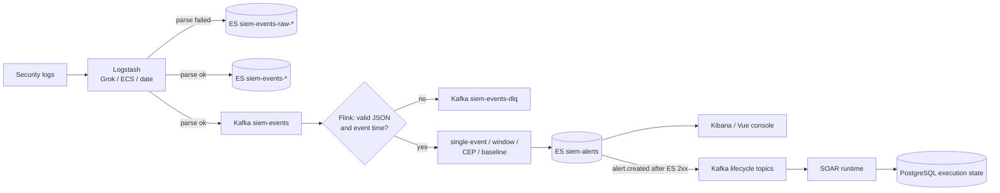

# HISIEM — Lightweight SIEM Platform

> **Primary description.** This is the authoritative project description; the Chinese
> [`README.md`](README.md) is its counterpart, section for section. Both are
> interviewer-facing overviews — deep technical detail lives in [`docs/`](docs/) (see the
> [reading order](#13-documentation-reading-order)), and the code remains the final
> authority on behaviour.

A lightweight SIEM (Security Information and Event Management) platform built on
**Elastic Stack + Kafka + Flink**, with a **Spring Boot** control plane. It covers
log ingestion, parsing and normalization, real-time detection, alert storage,
an analyst console, and deterministic SOAR response execution.

**Status.** The detection-engine baseline (Phase 3.0–3.5) and the console and
operations capabilities (Phase 4.0–4.4.1) are complete and verified. Production
security, high availability and cross-store consistency are **not** closed — see
[Known Limits](#12-known-limits).

---

## 1. Project Summary

| | |
|---|---|
| Domain | Security operations — log ingestion, detection, alerting, incident response |
| Role in the portfolio | **Project 1 of 2.** The security platform. Its AI investigation layer is a separate repository — see [§10](#10-project-relationship-to-hisiem-soc-copilot) |
| Data plane | Logstash → Elasticsearch + Kafka → Flink (detection) → Elasticsearch alerts |
| Control plane | Spring Boot + PostgreSQL (Flyway) — API, cases, rules, IAM, SOAR, operations |
| Language / runtime | Java 21, Spring Boot 4.1, Apache Flink 2.1 |
| Frontend | Vue console (analyst workspace, log search, rule authoring, playbook editor) |
| Engineering focus | **Backend + distributed systems + stream processing + SIEM domain** |

This is deliberately **not** an AI project. It is a streaming data platform with
the reliability, consistency and operational concerns that implies. The AI layer
that consumes it is a separate system (see [§10](#10-project-relationship-to-hisiem-soc-copilot)).

---

## 2. What Problem It Solves

A SIEM has to answer one question continuously and at volume: *given a firehose of
security events, which ones matter, and what should happen next?*

That decomposes into four hard problems, and each one is a distinct engineering
concern in this repository:

1. **Get events in and normalized.** Heterogeneous log sources must be parsed into
   one schema, and unparseable records must not silently vanish.
2. **Detect in real time over an unreliable event stream.** Log events arrive late,
   out of order, and in bursts. Detection that assumes ordered, complete, on-time
   input produces both false negatives and duplicate alerts.
3. **Keep the answer stable under replay.** Streaming pipelines fail and restart.
   A restart must not double-count, double-alert, or lose state.
4. **Turn an alert into an auditable action.** Response is a workflow with leases,
   approvals, branches and retries — not a webhook.

Everything below is the concrete implementation of one of those four.

---

## 3. Architecture Overview

Two planes, deliberately separated:

```text
DATA PLANE          Logstash → Kafka → Flink → Elasticsearch
                    (throughput, event time, windows, detection)

CONTROL PLANE       Spring Boot → PostgreSQL
                    (transactions, cases, rules, IAM, SOAR, operations)
```

The split matters because the two planes have different correctness requirements.
The data plane is optimized for **event-time streaming and convergence**; the control
plane is optimized for **transactional state and referential integrity**. They meet at
one deliberate boundary — a case can span both Elasticsearch and PostgreSQL — and that
boundary is the most interesting consistency problem in the system
(see [§8](#8-reliability-semantics)).

Component responsibilities:

| Component | Owns |
|---|---|
| Logstash | Ingest, Grok/ECS parsing, date normalization only |
| Kafka | Standardized events, parsing DLQ, lifecycle messages |
| Flink | **The detection engine.** Event-time windows, CEP, baselines, suppression |
| Elasticsearch | Events, alerts, risk, compatibility read models |
| Kibana / Vue console | Analyst-facing presentation and authoring |
| Spring Boot | Ingest APIs, case handling, auth, SOAR orchestration, operations APIs |
| PostgreSQL | Control-plane transactional truth and execution state |

Full diagrams: [`docs/architecture-overview.md`](docs/architecture-overview.md).

---

## 4. End-to-End Data Flow



Step by step:

1. **Ingest** — Logstash parses each record into the ECS-shaped event schema. Records
   that fail parsing are routed to a raw Elasticsearch index rather than dropped.
2. **Fan-out** — Successfully parsed events are written to Elasticsearch *and*
   published to the Kafka `siem-events` topic.
3. **Parse gate** — Flink validates JSON structure and event-time validity. Invalid
   records go to `siem-events-dlq`; valid records continue.
4. **Detection** — Four rule categories run over the same event-time stream (see
   [§7](#7-detection-model)).
5. **Store** — Alerts are written to `siem-alerts` in Elasticsearch via an async
   sink.
6. **Announce** — Only after a successful Elasticsearch write does the pipeline emit
   an `alert.created` lifecycle event to Kafka. A failed write produces an exception,
   not a lifecycle event — downstream systems never learn about an alert that was
   not stored.
7. **Respond** — The SOAR runtime consumes lifecycle events, executes playbooks
   against PostgreSQL-backed execution state.

---

## 5. Engineering Highlights

These are the parts worth discussing in depth. Each is implemented, not aspirational.

**Stream processing**

- **A single shared watermark across all detection branches.** Window rules, CEP rules
  and baseline rules all consume the same `parsedTimed` stream, so there is exactly one
  notion of "current event time" in the job — not one per rule family.
- **Bounded out-of-orderness** of 10 seconds: the watermark trails the maximum observed
  event timestamp by a fixed bound, so a bounded amount of reordering is absorbed rather
  than rejected.
- **Idle-partition handling** of 60 seconds: when a key's source goes quiet, its
  watermark is not allowed to stall the whole job. This matters specifically because
  a bursty log source (for example an SSH brute-force target going silent after being
  blocked) would otherwise hold every window open.
- **Event-time windows**, both sliding (5-minute window, 1-minute step) and tumbling.
  The sliding configuration exists to remove boundary blind spots that a fixed tumbling
  window would create.
- **CEP attack chains** — a pattern of N failures followed by a success, within a
  bounded time window.
- **Statistical baselines** — per-key hourly counts compared against a rolling mean
  plus a configurable sigma multiplier.

**Reliability**

- **Checkpointing with `EXACTLY_ONCE` mode**, a bounded checkpoint timeout, a minimum
  pause between checkpoints and a single concurrent checkpoint to avoid checkpoint
  storms, plus a tolerable-failure count so one failed checkpoint does not kill the job.
- **Deterministic alert identity.** An alert's Elasticsearch `_id` is
  `sha1(rule_id | entity | event_time)`. Replaying the same event therefore produces the
  same document id, and the write is an Elasticsearch `_update` (upsert) — so replay
  converges instead of duplicating. This is the mechanism that lets an at-least-once
  delivery path coexist with a user-visible promise of "no duplicate alerts".
- **A real dead-letter path** — parse failures go to a Kafka DLQ topic, not to a log line.
- **Deterministic lifecycle message ids** so downstream consumers can deduplicate
  re-delivered lifecycle events.

**Detection as code**

- Detection rules are YAML files loaded at job startup; only `enabled` rules are
  registered.
- The job verifies the rules directory against a runtime manifest before executing —
  a mismatch is a startup failure, not a silently different detection set.

**Control plane**

- The Spring Boot control plane owns cases, IAM, rule management, operations and SOAR
  orchestration, with PostgreSQL as transactional truth (Flyway-migrated).
- **Detection desired state vs. runtime**: detection configuration and physical runtime
  deployment are separate concerns with separate modules — see
  [§9](#9-detection-control-vs-detection-runtime).

---

## 6. Technology Stack

| Layer | Technology |
|---|---|
| Stream processing | Apache Flink 2.1 (Java 21) |
| Message bus | Apache Kafka 3.8 |
| Search & storage | Elasticsearch 8.14, Kibana 8.14 |
| Ingestion | Logstash 8.14 |
| Control plane | Java 21, Spring Boot 4.1, MyBatis |
| Control-plane database | PostgreSQL 16.4, Flyway migrations |
| Build | Maven multi-module reactor |
| Frontend | Vue console (log search, investigation workspace, rule authoring, playbook editor) |
| Browser tests | Playwright |

---

## 7. Detection Model

Detection is **rule-driven and declarative**. Each rule declares a category, and the
category selects the Flink operator that evaluates it:

| Category | Evaluation model | Example rule in this repo |
|---|---|---|
| `single_event` | Per-event condition match | `rule-ssh-auth-failure-001` |
| `window` | Count of matching events per key within an event-time window ≥ threshold | `rule-ssh-brute-force-001` (5-minute sliding window, 1-minute step, threshold 5, key = `source.ip`) |
| `cep` | Ordered pattern across events within a bounded time window | `rule-ssh-bruteforce-success-001` (N failures followed by a success) |
| `baseline` | Current window count vs. rolling mean + k·σ | `rule-auth-rate-anomaly-001` |

Six rules ship in `infra/rules/`. The rule set is intentionally small and readable —
the point is the detection *engine*, not rule volume.

**Suppression.** Two distinct suppression mechanisms exist, and they use different
notions of time:

- The single-event suppressor keys by rule plus entity and uses a **processing-time
  (wall-clock)** window, evaluated in a timer at window close. It emits one alert per
  suppression window, carrying the *first* alert's original `@timestamp` — which is what
  keeps the deterministic `_id` stable across suppression updates.
- The window-rule suppressor keys by rule plus entity to collapse the overlapping hits a
  sliding window produces for one active attack, so sliding coverage does not create
  duplicate alert documents.

---

## 8. Reliability Semantics

This is the section to read carefully, because the honest answer is more interesting
than a slogan. **The platform does not claim end-to-end exactly-once.** It claims
something narrower and more defensible:

> **Flink operator state is checkpointed exactly-once. Delivery to Kafka sinks is
> at-least-once. Elasticsearch writes converge because they are idempotent by
> construction.**

Precisely:

| Stage | Guarantee | Mechanism |
|---|---|---|
| Flink checkpointing | `CheckpointingMode.EXACTLY_ONCE` | Consistent operator state (window contents, suppressor state, baselines) restored on recovery |
| Kafka source offsets | Tied to checkpoints | Consumer offsets are committed as part of checkpoint completion; first run falls back to `earliest` |
| Kafka sinks (DLQ, alert lifecycle) | `DeliveryGuarantee.AT_LEAST_ONCE` | Duplicates are possible on failure or restore |
| Elasticsearch alert writes | **Idempotent, not transactional** | Deterministic `_id` + `_update` (upsert), so a replay overwrites the same document |
| Lifecycle events | At-least-once delivery, **deterministic message id** | Re-delivery carries the same `message_id`, so downstream can deduplicate |

Two consequences worth stating explicitly:

1. **Checkpointing and delivery semantics are different guarantees.** Flink's
   `EXACTLY_ONCE` checkpoint mode governs *internal state consistency and source offset
   commits*. It does not make a non-transactional external sink exactly-once. Here the
   sink guarantee is chosen explicitly as `AT_LEAST_ONCE`, and correctness is instead
   obtained from idempotent writes downstream of it.
2. **Duplicate suppression is a design property, not an accident.** It depends on the
   alert id being a pure function of `(rule, entity, event time)` and on the lifecycle
   `message_id` being a pure function of `(event type, tenant, object type, alert id,
   occurrence time)`. If either became non-deterministic, replay would produce duplicates.

**Cross-store consistency.** A case can reference both Elasticsearch (alert/event
search) and PostgreSQL (case state). The system uses an **outbox** pattern for lifecycle
messages that must be published as a consequence of a transactional state change, with
lease ownership and reclaim semantics on the outbox rows. This is the boundary where the
two planes meet; `docs/architecture.md` describes it in detail.

---

## 9. Detection Control vs. Detection Runtime

These are deliberately separate modules, and the separation is a design decision worth
understanding:

- **`detection-control`** owns rule definitions, schedules, and *desired vs. observed*
  runtime state. It has **no physical deployment responsibility**.
- **`detection-runtime`** owns transport-neutral runtime port contracts — the interface
  a runtime must satisfy, with no assumption about how it is deployed.
- **`applications/detection-controller`** is the separate controller process
  (`WebApplicationType.NONE`, adapter disabled by default) that reconciles the two.
- **The Flink job** is the actual runtime that evaluates rules.

The consequence: detection *configuration* can change without the control plane knowing
anything about Flink, and the runtime can be replaced without changing rule semantics.
The managed-detection path additionally tracks artifact immutability, claim/lease/fencing
and real observed state — documented in `docs/design/managed-detection-runtime.md`.

---

## 10. Project Relationship to HISIEM-SOC-Copilot

HISIEM is **one of two repositories** in this portfolio. The other is:

**[HISIEM-SOC-Copilot](https://github.com/xsc683/HISIEM-SOC-Copilot)** — an AI
investigation and response *decision* layer that sits on top of this platform.

The division is deliberate and enforced on both sides:

| HISIEM owns | HISIEM-SOC-Copilot owns |
|---|---|
| Security event ingestion | AI-assisted investigation |
| Streaming and detection | Governed tool use |
| Alerts and operational data | Evidence organization and knowledge context |
| Case management | Findings and verdicts |
| **Deterministic SOAR execution and its execution truth** | Response *proposals* and the human-authority workflow |
| Hosting the analyst-facing web application | Execution observation and workspace projection |

The permanent rule that keeps the two from collapsing into each other:

```text
Model proposes  →  Policy constrains  →  Human authorizes
Durable command records intent  →  HISIEM executes  →  Copilot observes
```

**Copilot never becomes a second SIEM or SOAR.** It does not detect, it does not own
alert data, and it does not execute. When an AI investigation recommends a response,
the command is durably recorded and then executed here — and **the execution result
observed in HISIEM is the final truth**, not whatever the Copilot believes it submitted.

> **Note on the frontend.** The analyst workspace UI that Copilot users see is
> implemented *in this repository* (`web/`), because HISIEM owns the platform's web
> application. The Copilot repository contains no frontend. If you are reviewing the
> Copilot project, this is where its UI lives.

---

## 11. Verification / Tests

Test scale — Java test classes, `@Test` methods, Playwright browser specs, rules under
`infra/rules/` and Flyway migrations — is **not repeated here**, because those numbers
drift with the code. [`docs/current-status.md`](docs/current-status.md) is the single
authoritative source for test scale.

Delivery verification covers the root project (Maven reactor), the Flink module tests,
and the frontend production build.

Run:

```bash
# Java build + tests (Maven reactor)
./mvnw verify

# Frontend unit tests + lint
cd web && npm test && npx eslint .

# Browser acceptance
cd web && npx playwright test
```

Local full-stack bring-up (Elasticsearch, Kibana, Logstash, Kafka, Flink, PostgreSQL,
the simulator) is documented in [`docs/deployment.md`](docs/deployment.md) and
[`docs/operations.md`](docs/operations.md); `infra/` is the single source of truth for
configuration.

---

## 12. Known Limits

Stated plainly, because a portfolio project is more credible when its boundaries are
explicit. None of these is a defect being hidden — each is a scope boundary.

**Streaming / event time**

- **No allowed lateness.** Event-time windows close at the watermark. There is no
  `allowedLateness` configuration and no side output for late events, so an event that
  arrives after its window has fired does not contribute to that window's result and is
  not separately captured. Windows are configured with bounded out-of-orderness (10s) and
  idleness handling (60s) to keep this window small in practice, but the boundary is real
  and observable on very late data.
- **Suppression windows for single-event rules are processing-time, not event-time.**
  This is intentional (suppression is an operational rate limit, not a detection
  semantic), but it means suppression behaviour is not replay-deterministic in the same
  way the detection windows are.

**Delivery and consistency**

- Kafka sink delivery is `AT_LEAST_ONCE`; duplicate delivery is possible and is handled
  downstream by deterministic ids rather than prevented at the sink.
- Cross-store (PostgreSQL/Elasticsearch) consistency is bounded by the outbox mechanism,
  not by a distributed transaction.

**Production hardening not closed**

- Production security posture (TLS, authentication, least-privilege) is a documented
  gate, not a shipped default — see `docs/design/security-rbac.md`.
- High availability and multi-node deployment are not part of the current baseline.
- The rule set is a demonstration set, not a production detection content library.

See [`docs/current-status.md`](docs/current-status.md) and
[`docs/project-progress.md`](docs/project-progress.md) for the authoritative
open-item register.

---

## 13. Documentation Reading Order

**If you have 3 minutes:** this file, plus the [architecture overview](docs/architecture-overview.md).

**If you have 30 minutes:** add [`docs/architecture.md`](docs/architecture.md) (data plane /
control plane / boundaries).

**If you want the engineering depth:** [`docs/architecture-deep-dive.md`](docs/architecture-deep-dive.md)
is the full technical walkthrough (configuration compilation, stream processing,
reliability, security, frontend). [`docs/design-decisions.md`](docs/design-decisions.md)
covers the *why* behind the major choices.

| Goal | Document |
|---|---|
| Current verified state and open risks | [`docs/current-status.md`](docs/current-status.md) |
| Capability progress and risk register | [`docs/project-progress.md`](docs/project-progress.md) |
| Real routes, APIs, acceptance checklist | [`docs/product-contract.md`](docs/product-contract.md) |
| Stream processing internals | [`docs/architecture-deep-dive.md`](docs/architecture-deep-dive.md), [`docs/rule-engine.md`](docs/rule-engine.md) |
| Event/alert schema and ES mappings | [`docs/event-alert-schema.md`](docs/event-alert-schema.md) |
| SOAR execution chain | [`docs/soar.md`](docs/soar.md), [`docs/design/soar-runtime-architecture.md`](docs/design/soar-runtime-architecture.md) |
| Managed detection runtime | [`docs/design/managed-detection-runtime.md`](docs/design/managed-detection-runtime.md) |
| Security hardening gates | [`docs/design/security-rbac.md`](docs/design/security-rbac.md) |
| Concepts and experiments | [`docs/learn/`](docs/learn/README.md) |
| History / audit material | [`docs/archive/`](docs/archive/README.md) |

Full index: [`docs/README.md`](docs/README.md).
Interview-oriented review material: [`docs/interview/INTERVIEW_GUIDE.md`](docs/interview/INTERVIEW_GUIDE.md).

---

## 14. Quick Start

Prerequisites: Java 21, Maven, Docker (for the local stack).

```bash
# 1. Build the reactor
./mvnw -q -DskipTests package

# 2. Start the local stack (Elasticsearch, Kibana, Logstash, Kafka, Flink, PostgreSQL)
cd infra && docker compose up -d

# 3. Start the control plane
java -jar applications/control-api/target/*.jar

# 4. Start the detection engine
#    (the Flink job; see docs/deployment.md for the exact submission command)

# 5. Console
#    Kibana:      http://localhost:5601
#    Vue console: see docs/deployment.md
```

See [`docs/deployment.md`](docs/deployment.md) for a new-environment bring-up, and
[`docs/operations.md`](docs/operations.md) for health scans, end-to-end smoke tests,
troubleshooting and rollback. [`infra/README.md`](infra/README.md) documents the
component configuration files and the log simulator used to generate traffic.
