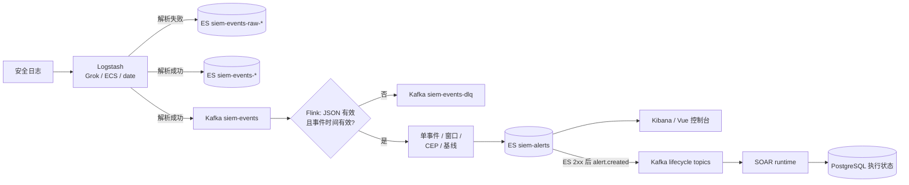

# HISIEM 平台 — 轻量级 SIEM

> **中文对应版本。** 英文版 [README.en.md](README.en.md) 是主入口与事实来源；本文件与其 14 节一一对应，并保留中文版独有的仓库结构、文档入口、模块依赖与快速开始细节。深度技术细节见 [docs/](docs/)，阅读顺序见 [§13](#13-文档阅读顺序)。

基于 **Elastic Stack + Kafka + Flink** 的轻量级 SIEM(Security Information and Event Management)平台，控制面由 **Spring Boot** 承载；覆盖日志采集、解析与标准化、实时检测、告警存储、分析员控制台和确定性 SOAR 响应执行。

**项目状态：** Phase 3.0–3.5 检测引擎基线与 Phase 4.0–4.4.1 控制台与运维能力均已完成并验证；其后又落地三批能力——**确定性 SOAR 闭环**（V11–V15：生命周期消息、租约/fencing、逐 attempt 记录、持久并行与循环）、**Managed Detection Runtime**（5A durable claim/reconcile + 5B 单集群 opt-in process adapter）与**接入 SOC Copilot 的 AI 调查工作台**（BFF 代理 + 工作台页面 + `/api/internal/**` 服务间入口）。当前数据面由 Elastic Stack + Kafka + Flink 承载，控制面由 Spring Boot + PostgreSQL/Flyway 承载。生产安全、高可用、跨存储一致性，以及**与真实 Copilot 实例的跨仓端到端闭环**，均 **尚未** 闭环 —— 当前事实以 [docs/current-status.md](docs/current-status.md) 为准，见 [§12 已知限制](#12-已知限制)。

---

## 1. 项目概要

| | |
|---|---|
| 领域 | 安全运营 —— 日志采集、检测、告警、事件响应 |
| 组合中的位置 | **两个项目中的第 1 个。** 安全平台；其 AI 调查层是独立仓库 —— 见 [§10](#10-与-hisiem-soc-copilot-的项目关系) |
| 数据面 | Logstash → Elasticsearch + Kafka → Flink（检测）→ Elasticsearch 告警 |
| 控制面 | Spring Boot + PostgreSQL(Flyway) —— API、案件、规则、IAM、SOAR、运维 |
| 语言 / 运行时 | Java 21、Spring Boot 4.1、Apache Flink 2.1 |
| 前端 | Vue 控制台（分析员工作台、日志检索、规则编排、playbook 编辑器） |
| 工程重心 | **后端 + 分布式系统 + 流处理 + SIEM 领域** |

这刻意 **不是** 一个 AI 项目。它是一个流式数据平台，以及由此带来的可靠性、一致性和运维问题。AI 的**调查与分析引擎**确实是独立系统（HISIEM-SOC-Copilot 仓），但**接它的那一层在本仓**——服务端代理 `modules/agent-adapter` 与工作台页面 `web/src/views/copilot/` 都在这里（见 [§10](#10-与-hisiem-soc-copilot-的项目关系)）。

---

## 2. 解决什么问题

SIEM 必须持续、在规模上回答一个问题：*面对海量安全事件流，哪些重要，接下来应该发生什么？*

这拆解为四个硬问题，每个在本仓库中都是一项独立的工程议题：

1. **把事件接进来并标准化。** 异构日志源必须解析进同一份 schema，无法解析的记录不能静默消失。
2. **在不可靠的事件流上实时检测。** 日志事件会延迟、乱序、突发到达。假设输入有序、完整、准时的检测会同时产生漏报和重复告警。
3. **在重放下保持结果稳定。** 流式管道会失败并重启；重启不能重复计数、重复告警或丢状态。
4. **把一条告警变成可审计的动作。** 响应是带租约、审批、分支和重试的工作流，不是一个 webhook。

下面的一切都是这四个问题之一的具体实现。

---

## 3. 架构总览

刻意分离的两个平面：

```text
数据面    Logstash → Kafka → Flink → Elasticsearch
         (吞吐、事件时间、窗口、检测)

控制面    Spring Boot → PostgreSQL
         (事务、案件、规则、IAM、SOAR、运维)
```

分离的原因是两个平面的正确性要求不同：数据面针对 **事件时间流式处理与收敛** 优化；控制面针对 **事务状态与引用完整性** 优化。它们在一个刻意的边界相遇 —— 一个案件可以同时跨 Elasticsearch 与 PostgreSQL —— 这是系统中最有意思的一致性问题（见 [§8](#8-可靠性语义)）。

组件职责：

| 组件 | 负责 |
|---|---|
| Logstash | 只做接入、Grok/ECS 解析、日期标准化 |
| Kafka | 标准事件、解析 DLQ、生命周期消息 |
| Flink | **检测引擎。** 事件时间窗口、CEP、基线、抑制 |
| Elasticsearch | 事件、告警、风险、兼容读模型 |
| Kibana / Vue 控制台 | 面向分析员的展示与编排 |
| Spring Boot | 接入 API、案件处置、鉴权、SOAR 编排、运维 API |
| PostgreSQL | 控制面事务事实与执行状态 |

上表是组件职责的单一来源；案件跨 PG/ES 的具体同步、补偿和 outbox 边界见[系统架构](docs/architecture.md)。

完整架构图见 [`docs/architecture-overview.md`](docs/architecture-overview.md)。

### 仓库结构

```
SIEM/
├── pom.xml                   Maven reactor aggregator (Java 21 / Spring Boot 4.1)
├── modules/                  12 个控制面 Maven 模块（contracts、IAM、agent、security-ops、operations、detection、SOAR、migrations）
│   ├── platform-contracts/   跨域稳定契约
│   ├── platform-migrations/  共享 Flyway migration 资源（resource-only）
│   ├── iam/                  认证、会话、租户与控制面存储
│   ├── agent-adapter/        HISIEM-SOC-Copilot 出站适配
│   ├── security-ops/         告警、案件、日志检索与 ES 网关
│   ├── platform-operations/  接入、通知、健康与运维任务
│   ├── platform-operations-adapters/  WSL/Docker ProcessBuilder 物理命令适配
│   ├── detection-control/    规则、计划与 desired/observed runtime（无物理部署）
│   ├── detection-runtime/    transport-neutral runtime port contracts
│   ├── soar-core/            传输无关 SOAR 执行引擎、SPI 与 handler
│   ├── soar-adapters/        Kafka lifecycle 与 HTTP connector 适配
│   └── soar-worker-runtime/  Kafka consumer、health 与 SOAR worker loop
├── applications/control-api/       控制 API 可执行应用（不执行物理检测部署）
├── applications/detection-controller/ 独立检测 controller（WebApplicationType.NONE，默认 disabled adapter）
├── applications/soar-worker/       独立 SOAR worker 可执行应用（无 HTTP）
├── flink/                    独立 Flink job 工程(规则引擎 + 检测任务)
│   ├── pom.xml               Flink 2.1, shade 打 jar, mainClass com.siem.DetectionJob
│   └── src/{main,test}/      规则引擎代码 + JUnit 测试
├── infra/                  基础设施配置(唯一来源,deploy.sh 同步到部署环境)
│   ├── docker-compose.yml  PostgreSQL/ES/Kibana/Logstash/Kafka/Flink 编排
│   ├── logstash/           Grok 解析规则
│   ├── elasticsearch/      索引模板 + 应用脚本
│   ├── kibana/             dashboard 创建脚本 + NDJSON 导出
│   ├── simulator/          日志模拟器(含暴力破解测试脚本)
│   └── deploy.sh           同步仓库 → 部署环境 + 构建 + 拷贝 jar
├── docs/                   当前状态、产品契约、部署、学习与专项技术参考
├── web/                    Vue 3/Vite 控制台（vue-router + Ant Design Vue + Vue Flow）
└── CLAUDE.md               面向 AI 会话的项目速览
```

### SOAR 模块依赖

`soar-core`（传输无关的模型/引擎/SPI）与 `platform-contracts`；Kafka/HTTP adapter 在 `soar-adapters`（`soar-core` 自身不得引入 Kafka、Actuator health 或 JDK HTTP）；`soar-worker-runtime`
依赖前两者并承载 Kafka/Actuator/Micrometer runtime。`control-api` 的生产依赖只有
`soar-core`、`soar-adapters`（另依赖共享 migration 资源），worker-runtime 仅以 test
scope 提供集中单元测试。`soar-worker` 依赖 core、adapters、worker-runtime、iam、
security-ops、platform-operations 和 platform-migrations，不依赖 control-api。

---

## 4. 端到端数据流



逐步说明：

1. **接入** —— Logstash 把每条记录解析为 ECS 形态的事件 schema。解析失败的记录进入 raw Elasticsearch 索引，而不是被丢弃。
2. **扇出** —— 解析成功的事件既写入 Elasticsearch，也发布到 Kafka 的 `siem-events` topic。
3. **解析门禁** —— Flink 校验 JSON 结构与事件时间的有效性。无效记录进入 `siem-events-dlq`，有效记录继续。
4. **检测** —— 四类规则在同一条事件时间流上运行（见 [§7](#7-检测模型)）。
5. **存储** —— 告警经由异步 sink 写入 Elasticsearch 的 `siem-alerts`。
6. **通告** —— 只有在 Elasticsearch 写入成功之后，管道才向 Kafka 发出 `alert.created` 生命周期事件。写入失败产生异常而非生命周期事件 —— 下游系统永远不会得知一条并未存储的告警。
7. **响应** —— SOAR runtime 消费生命周期事件，基于 PostgreSQL 的执行状态执行 playbook。

---

## 5. 工程亮点

这些是值得深入讨论的部分。每一条都是已实现的，不是设想。

**流处理**

- **所有检测分支共用同一个 watermark。** 窗口规则、CEP 规则和基线规则都消费同一个 `parsedTimed` 流，因此整个 job 中只有一个「当前事件时间」的概念，而不是每个规则族各有一个。
- **有界乱序** 为 10 秒：watermark 落后于已观测到的最大事件时间戳一个固定上界，因此有界的乱序被吸收而非拒绝。
- **空闲分区处理** 为 60 秒：某个 key 的数据源静默时，不允许它的 watermark 拖住整个 job。这一点尤其重要，因为突发的日志源（例如 SSH 暴力破解目标被封锁后静默）本来会让所有窗口一直保持打开。
- **事件时间窗口**，既有滑动窗口（5 分钟窗口、1 分钟步长）也有滚动窗口。滑动配置的存在是为了消除固定滚动窗口会造成的边界盲区。
- **CEP 攻击链** —— 有界时间窗口内「N 次失败后紧跟一次成功」的模式。
- **统计基线** —— 按 key 的每小时计数与滚动均值加可配置 sigma 倍数比较。

**可靠性**

- **checkpoint 使用 `EXACTLY_ONCE` 模式**，配合有界的 checkpoint 超时、checkpoint 之间的最小间隔和单并发 checkpoint 以避免 checkpoint 风暴，另加可容忍失败次数，使单次 checkpoint 失败不会杀死 job。
- **确定性告警标识。** 告警在 Elasticsearch 中的 `_id` 是 `sha1(rule_id | entity | event_time)`。重放同一事件因此产生相同的文档 id，写入是 Elasticsearch `_update`（upsert）—— 所以重放会收敛而不是重复。正是这个机制让「至少一次」的投递路径与用户可见的「不重复告警」承诺得以共存。
- **真实的死信路径** —— 解析失败进入 Kafka DLQ topic，而不是写一行日志。
- **确定性的生命周期消息 id**，下游消费者可以据此对重新投递的生命周期事件去重。

**检测即代码**

- 检测规则是 job 启动时加载的 YAML 文件；只有 `enabled` 的规则会被注册。
- job 在执行前会用一个 runtime manifest 校验规则目录 —— 不匹配是启动失败，而不是静默地换了一套检测规则。

**控制面**

- Spring Boot 控制面拥有案件、IAM、规则管理、运维和 SOAR 编排，以 PostgreSQL 为事务事实（由 Flyway 迁移）。
- **检测期望状态 vs 运行时**：检测配置与物理运行时部署是分离的关注点，位于不同模块 —— 见 [§9](#9-检测控制面-vs-检测运行时)。

### 已实现能力清单

- ✅ Logstash Grok 解析 + ECS 字段标准化(`@timestamp` 为真实日志时间)
- ✅ Kafka 事件与生命周期总线（`siem-events`、解析 DLQ、两个 lifecycle topic）
- ✅ Flink 规则引擎:
  - 单事件规则 3 条(SSH 认证失败 / root 认证失败 / 常见账号爆破)
  - 滑动时间窗口规则 1 条（同源 IP 5 分钟 ≥5 次失败 → 暴力破解 critical 告警）
  - CEP 攻击链和认证失败基线异常接入统一规则声明；实体风险由独立后台重算任务聚合
- ✅ 告警扁平 Schema(`siem-alerts`,含 `event.raw`、`event_count`、`related_events`)
- ✅ ES 索引模板 6 类（事件、raw、告警、案件镜像、实体风险和资产关键性），其中 4 类带 ILM 保留策略（事件 365 天、告警/案件 180 天、raw 30 天）
- ✅ Kibana "SIEM 总览" dashboard
- ✅ Flink checkpointing + committed offsets；至少一次重放由确定性告警 ID 收敛
- ✅ Spring Boot 控制面:PostgreSQL/Flyway、登录会话、RBAC、审计、案件、通知、后台任务
- ✅ 运维能力:六组件健康扫描、Actuator/Micrometer、数据源停用/删除回滚、ES 备份恢复演练
- ✅ 前端：Vue 3 模块化路由、规则可视化 CRUD、结构化告警/案件详情、Vue Flow SOAR 设计器和 AI 调查工作台
- ✅ **确定性 SOAR 执行**：生命周期 outbox + 租约/fencing + 逐 attempt 记录；Condition/Business/Human/Wait/Parallel/Join/Loop/Connector 节点；发布门禁与 revision 乐观锁（V11–V15）
- ✅ **Managed Detection Runtime**：检测期望状态与物理运行时分离；5A durable claim/lease/reconcile core；5B 是 opt-in 的单集群 process adapter（默认 `app.detection.runtime-adapter=disabled`，只报 `UNKNOWN`），非 HA
- ✅ **AI 调查工作台**：控制台内从告警/案件详情启动 Copilot 调查，BFF 只读代理工作台读模型，响应提案走「人工批准 → 持久命令 → HISIEM SOAR 执行」。**HISIEM 侧已有测试覆盖；与真实 Copilot 实例的跨仓端到端闭环尚未验证**

---

## 6. 技术栈

| 层 | 技术 |
|---|---|
| 流处理 | Apache Flink 2.1 (Java 21) |
| 消息总线 | Apache Kafka 3.8 |
| 检索与存储 | Elasticsearch 8.14、Kibana 8.14 |
| 接入 | Logstash 8.14 |
| 控制面 | Java 21、Spring Boot 4.1、MyBatis |
| 控制面数据库 | PostgreSQL 16.4、Flyway 迁移 |
| 构建 | Maven 多模块 reactor |
| 前端 | Vue 控制台（日志检索、调查工作台、规则编排、playbook 编辑器） |
| 浏览器测试 | Playwright |

---

## 7. 检测模型

检测是 **规则驱动且声明式** 的。每条规则声明一个类别，类别决定了求值它的 Flink 算子：

| 类别 | 求值模型 | 本仓库中的示例规则 |
|---|---|---|
| `single_event` | 逐事件条件匹配 | `rule-ssh-auth-failure-001` |
| `window` | 每个 key 在事件时间窗口内的匹配事件数 ≥ 阈值 | `rule-ssh-brute-force-001`（5 分钟滑动窗口、1 分钟步长、阈值 5、key = `source.ip`） |
| `cep` | 有界时间窗口内跨事件的有序模式 | `rule-ssh-bruteforce-success-001`（N 次失败后紧跟一次成功） |
| `baseline` | 当前窗口计数 vs 滚动均值 + k·σ | `rule-auth-rate-anomaly-001` |

`infra/rules/` 下随仓库提供 6 条规则。规则集刻意保持小而可读 —— 重点在检测 **引擎**，不在规则数量。

**抑制。** 存在两种不同的抑制机制，它们使用不同的时间概念：

- 单事件抑制器按规则加实体做 key，使用 **处理时间（墙钟）** 窗口，在窗口关闭的 timer 中求值。每个抑制窗口只产出一条告警，携带 *第一条* 告警的原始 `@timestamp` —— 正是这一点让确定性的 `_id` 在抑制更新中保持稳定。
- 窗口规则抑制器按规则加实体做 key，用于收敛滑动窗口对同一次活跃攻击产生的重叠命中，使滑动覆盖不会产生重复的告警文档。

---

## 8. 可靠性语义

这一节值得仔细读，因为诚实的答案比一句口号更有意思。**平台不声称端到端 exactly-once。** 它声称的是一个更窄、更站得住脚的结论：

> **Flink 算子状态是 checkpoint exactly-once。投递到 Kafka sink 是 at-least-once。Elasticsearch 写入因其构造上幂等而收敛。**

精确地说：

| 阶段 | 保证 | 机制 |
|---|---|---|
| Flink checkpointing | `CheckpointingMode.EXACTLY_ONCE` | 恢复时还原一致的算子状态（窗口内容、抑制器状态、基线） |
| Kafka source offset | 绑定到 checkpoint | consumer offset 随 checkpoint 完成一起提交；首次运行回退到 `earliest` |
| Kafka sink（DLQ、告警生命周期） | `DeliveryGuarantee.AT_LEAST_ONCE` | 失败或恢复时可能出现重复 |
| Elasticsearch 告警写入 | **幂等，非事务** | 确定性 `_id` + `_update`（upsert），重放覆盖同一文档 |
| 生命周期事件 | at-least-once 投递，**确定性 message id** | 重新投递携带相同的 `message_id`，下游可据此去重 |

有两个后果值得明确说出来：

1. **checkpointing 与投递语义是两种不同的保证。** Flink 的 `EXACTLY_ONCE` checkpoint 模式管的是 *内部状态一致性与 source offset 提交*。它不会让一个非事务的外部 sink 变成 exactly-once。这里的 sink 保证被显式选为 `AT_LEAST_ONCE`，正确性改由它下游的幂等写入获得。
2. **重复抑制是设计属性，不是偶然。** 它依赖告警 id 是 `(rule, entity, event time)` 的纯函数，以及生命周期 `message_id` 是 `(event type, tenant, object type, alert id, occurrence time)` 的纯函数。两者任一变的不确定，重放就会产生重复。

**跨存储一致性。** 一个案件可以同时引用 Elasticsearch（告警/事件检索）和 PostgreSQL（案件状态）。对于必须作为事务状态变更后果发布的生命周期消息，系统使用 **outbox** 模式，并对 outbox 行施加租约所有权与回收语义。这是两个平面相遇的边界；`docs/architecture.md` 有详细描述。

---

## 9. 检测控制面 vs 检测运行时

这两者是刻意分离的模块，而分离本身是一个值得理解的设计决策：

- **`detection-control`** 拥有规则定义、计划，以及 *desired vs observed* 的运行时状态。它 **没有物理部署职责**。
- **`detection-runtime`** 拥有 transport-neutral 的运行时端口契约 —— 一个运行时必须满足的接口，不假设它如何被部署。
- **`applications/detection-controller`** 是负责调和二者的独立 controller 进程（`WebApplicationType.NONE`，默认 adapter 关闭）。
- **Flink job** 是真正求值规则的运行时。

后果是：检测 *配置* 可以在控制面完全不了解 Flink 的前提下变更，运行时也可以在不改变规则语义的前提下被替换。受管检测路径还额外跟踪 artifact 不可变性、claim/lease/fencing 和真实 observed state —— 见 `docs/design/managed-detection-runtime.md`。

**契约与运行方式补充：** `detection-runtime` 提供 transport-neutral `DetectionGroupLease`、target/observation、`FlinkRuntimePort` 合同、immutable artifact builder、structured job identity 和 opt-in process adapter；`detection-controller` 独立依赖这些合同、detection-control 的 observation bridge 和共享 migration，不依赖 `control-api`。5A/5B 默认 `app.detection.runtime-adapter=disabled`，不执行任何 Docker/Flink 物理部署；设置为 `process` 才启用单集群 process adapter。`control-api` 的 desired deploy/stop/bulk API 仍返回 `202 PENDING`。

---

## 10. 与 HISIEM-SOC-Copilot 的项目关系

HISIEM 是本组合 **两个仓库中的一个**。另一个是：

**[HISIEM-SOC-Copilot](https://github.com/xsc683/HISIEM-SOC-Copilot)** —— 位于本平台之上的 AI 调查与响应 *决策* 层。

分工是刻意的，且在两侧都被强制：

| HISIEM 拥有 | HISIEM-SOC-Copilot 拥有 |
|---|---|
| 安全事件接入 | AI 辅助调查 |
| 流处理与检测 | 受治理的工具使用 |
| 告警与运营数据 | 证据组织与知识上下文 |
| 案件管理 | 结论与研判 |
| **确定性 SOAR 执行及其执行事实** | 响应 *提案* 与人类授权流程 |
| 承载面向分析员的 Web 应用 | 执行观测与工作区投影 |

防止两者互相坍缩成对方的永久规则：

```text
模型提案  →  策略约束  →  人类授权
持久化命令记录意图  →  HISIEM 执行  →  Copilot 观测
```

**Copilot 永远不会变成第二个 SIEM 或 SOAR。** 它不检测、不拥有告警数据、不执行。当 AI 调查建议某个响应时，命令被持久化记录后在 **这里** 执行 —— 并且 **在 HISIEM 中观测到的执行结果才是最终事实**，而不是 Copilot 认为自己提交了什么。

> **关于前端的说明。** Copilot 用户看到的分析员工作台 UI 实现 *在本仓库*（`web/`），因为 HISIEM 拥有平台的 Web 应用。Copilot 仓库不含前端。如果你在审阅 Copilot 项目，它的 UI 就在这里。

**HISIEM-SOC-Copilot 出站适配。** 从告警/案件详情启动 HISIEM-SOC-Copilot 的服务端代理位于 `modules/agent-adapter`，细节见 [`docs/agent-integration.md`](docs/agent-integration.md)。

---

## 11. 验证 / 测试

本仓库的测试规模（Java 测试类数、`@Test` 方法数、Playwright 浏览器用例、`infra/rules/` 下的规则数、Flyway 迁移数）**不在此处重复** —— 这些数字会随代码漂移，唯一权威落点是 [`docs/current-status.md`](docs/current-status.md) 的「测试规模」一节。

交付验证覆盖：根项目（Maven reactor）、Flink 模块测试与前端生产构建。

运行方式：

```bash
# Java 构建 + 测试（Maven reactor）
./mvnw verify

# 前端单元测试 + lint
cd web && npm test && npx eslint .

# 浏览器验收
cd web && npx playwright test
```

本地全栈启动（Elasticsearch、Kibana、Logstash、Kafka、Flink、PostgreSQL、模拟器）见 [`docs/deployment.md`](docs/deployment.md) 与 [`docs/operations.md`](docs/operations.md)；`infra/` 是配置的唯一来源。

---

## 12. 已知限制

直说边界，因为一个作品集项目的边界写得越明确越可信。以下没有一条是被藏起来的缺陷 —— 每一条都是范围边界。

**流处理 / 事件时间**

- **没有 allowed lateness。** 事件时间窗口在 watermark 处关闭。没有 `allowedLateness` 配置，也没有迟到事件的 side output，所以在其窗口触发之后到达的事件既不计入该窗口结果，也不会被单独捕获。窗口配置了有界乱序（10s）和空闲处理（60s）以在实践中让这个窗口尽量小，但边界是真实存在的，并且在极迟数据上可观测到。
- **单事件规则的抑制窗口使用处理时间，不是事件时间。** 这是刻意的（抑制是运维层面的速率限制，不是检测语义），但这也意味着抑制行为不像检测窗口那样具备重放确定性。

**投递与一致性**

- Kafka sink 投递是 `AT_LEAST_ONCE`；重复投递是可能的，由下游通过确定性 id 处理，而不是在 sink 处被阻止。
- 跨存储（PostgreSQL/Elasticsearch）一致性受 outbox 机制约束，而不是分布式事务。

**尚未闭环的生产加固**

- 生产安全姿态（TLS、认证、最小权限）是文档化的门禁，不是已交付的默认值 —— 见 `docs/design/security-rbac.md`。
- 高可用与多节点部署不在当前基线之内。
- 规则集是演示集，不是生产检测内容库。

权威的未闭环事项清单见 [`docs/current-status.md`](docs/current-status.md) 与 [`docs/project-progress.md`](docs/project-progress.md)。

---

## 13. 文档阅读顺序

**如果你只有 3 分钟：** 本文件，加上[架构总览](docs/architecture-overview.md)。

**如果你有 30 分钟：** 加上 [`docs/architecture.md`](docs/architecture.md)（数据面 / 控制面 / 边界）。

**如果你想要工程深度：** [`docs/architecture-deep-dive.md`](docs/architecture-deep-dive.md) 是完整的技术走查（配置编译、流处理、可靠性、安全、前端）。[`docs/design-decisions.md`](docs/design-decisions.md) 覆盖主要选择背后的 *为什么*。

日常先看[当前状态](docs/current-status.md)，再按目标选择部署、运行、架构或产品契约文档；专项设计和学习资料作为深入参考。

| 目标 / 文档 | 内容 |
| --- | --- |
| [docs/current-status.md](docs/current-status.md) | 最近一次验证的能力、部署基线和未闭环生产风险 |
| [docs/project-progress.md](docs/project-progress.md) | 当前能力进展、遗留问题、关闭条件与建议迭代顺序 |
| [docs/architecture.md](docs/architecture.md) | 系统架构、数据流、Schema、规则引擎概览 |
| [docs/architecture-deep-dive.md](docs/architecture-deep-dive.md) | 流处理内部机制（完整技术走查） |
| [docs/deployment.md](docs/deployment.md) | **新机器部署指南**(换环境必备) |
| [docs/operations.md](docs/operations.md) | 日常启动、健康扫描、端到端冒烟、排障和回滚 |
| [docs/design/module-boundaries.md](docs/design/module-boundaries.md) | 模块依赖、进程角色与隔离规则 |
| [docs/design/managed-detection-runtime.md](docs/design/managed-detection-runtime.md) | Phase 5A/5B detection controller、immutable artifact、真实 observed state、process adapter 与限制 |
| [docs/design/security-rbac.md](docs/design/security-rbac.md) | 安全加固门禁 |
| [docs/event-alert-schema.md](docs/event-alert-schema.md) | Event/Alert Schema 与 ES mapping 详细设计 |
| [docs/rule-engine.md](docs/rule-engine.md) | 规则引擎使用与扩展 |
| [docs/soar.md](docs/soar.md) | SOAR 执行链路；另见 [docs/design/soar-runtime-architecture.md](docs/design/soar-runtime-architecture.md) |
| [docs/roadmap.md](docs/roadmap.md) | 统一阶段路线图、验收基线和后续优先级 |
| [docs/product-contract.md](docs/product-contract.md) | 当前页面、API、用户旅程和验收契约 |
| [docs/agent-integration.md](docs/agent-integration.md) | 从告警/案件详情启动 HISIEM-SOC-Copilot 的服务端代理 |
| [docs/guide/](docs/guide/01-这个系统在解决什么问题.md) | **入门指引**（项目优先）：这个系统在解决什么问题 → 一条日志的完整旅程 → 从告警到处置决策 |
| [docs/design/README.md](docs/design/README.md) | `docs/design/` 专项参考的索引（分工、状态规则、使用边界） |
| [docs/architecture-analysis/](docs/architecture-analysis/README.md) | **代码级证据层**：按子系统的 `file:line` 取证与反直觉形态；不是契约，冲突时以契约为准 |
| [docs/learn/README.md](docs/learn/README.md) | 从 SIEM 基础到 Kafka/ES/Flink/Logstash 的学习地图 |
| [docs/archive/](docs/archive/README.md) | 历史 / 审计资料 |
| [AGENTS.md](AGENTS.md) / [CLAUDE.md](CLAUDE.md) | 面向 AI 编码助手的仓库约定（英文 / 中文） |

完整索引：[`docs/README.md`](docs/README.md)。
面向面试的审阅材料：[`docs/interview/INTERVIEW_GUIDE.md`](docs/interview/INTERVIEW_GUIDE.md)。

---

## 14. 快速开始

前置条件：Java 21、Maven、Docker（用于本地全栈）。

```bash
# 1. 克隆仓库,进入 infra/
# 2. 部署基础设施(docker compose)
wsl bash /mnt/d/Project/SIEM/infra/deploy.sh   # 同步到 ~/projects/mini-siem 并构建
cd ~/projects/mini-siem && docker compose up -d
# 3. 应用 ES 索引模板
bash /mnt/d/Project/SIEM/infra/elasticsearch/apply-templates.sh
# 4. 创建 Kibana dashboard
bash /mnt/d/Project/SIEM/infra/kibana/create-dashboards.sh
# 5. 提交 Flink 检测 job
docker exec siem-flink-jobmanager flink run -d /opt/flink/detection-job-1.0.jar
# 6. 验证(发一条测试日志)
echo 'Aug 1 10:20:00 server03 sshd[9999]: Failed password for test from 172.16.1.20' | nc -w1 localhost 5000

# 构建并运行控制面全量测试（在仓库根目录）
./mvnw test
# 只运行 Flink 模块测试
./mvnw -f flink/pom.xml test

# 7. 启动控制面(另开终端;默认连接 localhost:5432/siem)
./mvnw -pl applications/control-api spring-boot:run

# 8. 独立启动 SOAR worker(另开终端;无 HTTP server)
./mvnw -pl applications/soar-worker spring-boot:run
# worker 默认 app.operations.runtime-enabled=false，只有 SOAR runtime/consumer 开启

# 9. 启动前端(另开终端)
npm --prefix web run dev
```

> 详细步骤见 [docs/deployment.md](docs/deployment.md)。

新环境搭建见 [`docs/deployment.md`](docs/deployment.md)；健康扫描、端到端冒烟测试、排障与回滚见 [`docs/operations.md`](docs/operations.md)。[`infra/README.md`](infra/README.md) 记录各组件配置文件与用于生成流量的日志模拟器。
