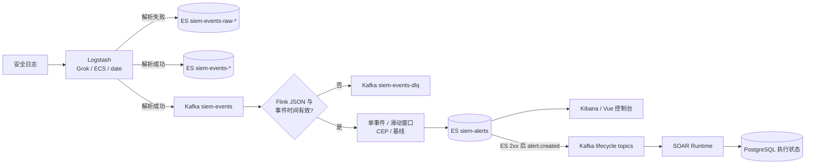

# HISIEM 平台 — 轻量级 SIEM

基于 **Elastic Stack + Flink** 的轻量级 SIEM(Security Information and Event Management),覆盖日志采集、解析、实时检测、告警存储与可视化。

**项目状态:Phase 3.0-3.5 检测引擎基线、Phase 4.0-4.4.1 控制台与运维能力均已完成并验证。**当前数据面由 Elastic Stack + Kafka + Flink 承载，控制面由 Spring Boot + PostgreSQL/Flyway 承载。生产安全、高可用和跨存储一致性仍见[当前状态](docs/current-status.md)。

## 数据链路



**组件职责**：Logstash 只做接入、解析和标准化；Kafka 承载标准事件、解析 DLQ 与生命周期消息；Flink 是检测引擎；ES 负责事件、告警、风险和兼容镜像的检索；Kibana/Vue 负责展示；Spring Boot 负责接入、处置、鉴权、SOAR 和运维 API；PostgreSQL 是控制面事务事实与执行状态存储。案件跨 PG/ES 的具体同步、补偿和 outbox 边界见[系统架构](docs/architecture.md)。

## 仓库结构

```
SIEM/
├── pom.xml / src/          Spring Boot 控制面 API(认证、接入、告警、案件、运维)
├── flink/                  独立 Flink job 工程(规则引擎 + 检测任务)
│   ├── pom.xml             Flink 2.1,shade 打 jar,mainClass com.siem.DetectionJob
│   └── src/{main,test}/    规则引擎代码 + JUnit 测试
├── infra/                  基础设施配置(唯一来源,deploy.sh 同步到部署环境)
│   ├── docker-compose.yml  PostgreSQL/ES/Kibana/Logstash/Kafka/Flink 编排
│   ├── logstash/           Grok 解析规则
│   ├── elasticsearch/      索引模板 + 应用脚本
│   ├── kibana/             dashboard 创建脚本 + NDJSON 导出
│   ├── simulator/          日志模拟器(含暴力破解测试脚本)
│   └── deploy.sh           同步仓库 → 部署环境 + 构建 + 拷贝 jar
├── docs/                   当前状态、产品契约、部署、学习与专项技术参考
├── web/                    Vue 3/Vite 控制台（vue-router + Ant Design Vue + Vue Flow）
└── CLAUDE.md               面向 AI 会话的项目速览
```

## 文档入口

日常先看[当前状态](docs/current-status.md)，再按目标选择部署、运行、架构或产品契约文档；专项设计和学习资料作为深入参考。

| 文档 | 内容 |
| --- | --- |
| [docs/current-status.md](docs/current-status.md) | 最近一次验证的能力、部署基线和未闭环生产风险 |
| [docs/project-progress.md](docs/project-progress.md) | 当前能力进展、遗留问题、关闭条件与建议迭代顺序 |
| [docs/architecture.md](docs/architecture.md) | 系统架构、数据流、Schema、规则引擎概览 |
| [docs/deployment.md](docs/deployment.md) | **新机器部署指南**(换环境必备) |
| [docs/operations.md](docs/operations.md) | 日常启动、健康扫描、端到端冒烟、排障和回滚 |
| [docs/design-decisions.md](docs/design-decisions.md) | 设计决策 + 踩坑记录 |
| [docs/event-alert-schema.md](docs/event-alert-schema.md) | Event/Alert Schema 详细设计 |
| [docs/rule-engine.md](docs/rule-engine.md) | 规则引擎使用与扩展 |
| [docs/roadmap.md](docs/roadmap.md) | 统一阶段路线图、验收基线和后续优先级 |
| [docs/product-contract.md](docs/product-contract.md) | 当前页面、API、用户旅程和验收契约 |
| [docs/agent-integration.md](docs/agent-integration.md) | 从告警/案件详情启动 HISIEM-Agent 的服务端代理 |
| [docs/learn/README.md](docs/learn/README.md) | 从 SIEM 基础到 Kafka/ES/Flink/Logstash 的学习地图 |

## 快速开始(新机器)

```bash
# 1. 克隆仓库,进入 infra/
# 2. 部署基础设施(docker compose)
wsl bash /mnt/d/Project/SIEM/infra/deploy.sh   # 同步到 ~/projects/mini-siem 并构建
cd ~/projects/mini-siem && docker compose up -d
# 3. 应用 ES 索引模板
bash /mnt/d/Project/SIEM/infra/elasticsearch/apply-templates.sh
# 4. 创建 Kibana dashboard
bash /mnt/d/Project/SIEM/infra/kibana/create-dashboards.sh
# 5. 提交 Flink 检测 job
docker exec siem-flink-jobmanager flink run -d /opt/flink/detection-job-1.0.jar
# 6. 验证(发一条测试日志)
echo 'Aug 1 10:20:00 server03 sshd[9999]: Failed password for test from 172.16.1.20' | nc -w1 localhost 5000

# 7. 启动控制面(另开终端;默认连接 localhost:5432/siem)
./mvnw spring-boot:run

# 8. 启动前端(另开终端)
npm --prefix web run dev
```

> 详细步骤见 [docs/deployment.md](docs/deployment.md)。

## 已实现能力

- ✅ Logstash Grok 解析 + ECS 字段标准化(`@timestamp` 为真实日志时间)
- ✅ Kafka 事件与生命周期总线（`siem-events`、解析 DLQ、两个 lifecycle topic）
- ✅ Flink 规则引擎:
  - 单事件规则 3 条(SSH 认证失败 / root 认证失败 / 常见账号爆破)
  - 滑动时间窗口规则 1 条（同源 IP 5 分钟 ≥5 次失败 → 暴力破解 critical 告警）
  - CEP 攻击链和认证失败基线异常接入统一规则声明；实体风险由独立后台重算任务聚合
- ✅ 告警扁平 Schema(`siem-alerts`,含 `event.raw`、`event_count`、`related_events`)
- ✅ ES 索引模板（事件、raw、告警、案件镜像和实体风险）
- ✅ Kibana "SIEM 总览" dashboard
- ✅ Flink checkpointing + committed offsets；至少一次重放由确定性告警 ID 收敛
- ✅ Spring Boot 控制面:PostgreSQL/Flyway、登录会话、RBAC、审计、案件、通知、后台任务
- ✅ 运维能力:六组件健康扫描、Actuator/Micrometer、数据源停用/删除回滚、ES 备份恢复演练
- ✅ 前端：Vue 3 模块化路由、规则可视化 CRUD、结构化告警/案件详情和 Vue Flow SOAR 设计器
- ✅ 测试：根项目、Flink 模块测试与前端生产构建均纳入交付验证（最新数量见 `docs/current-status.md`）
