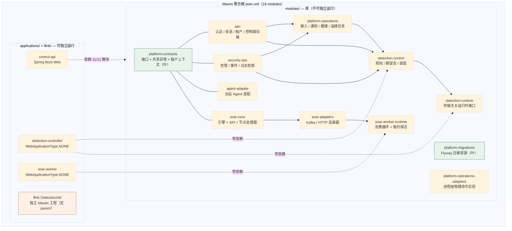
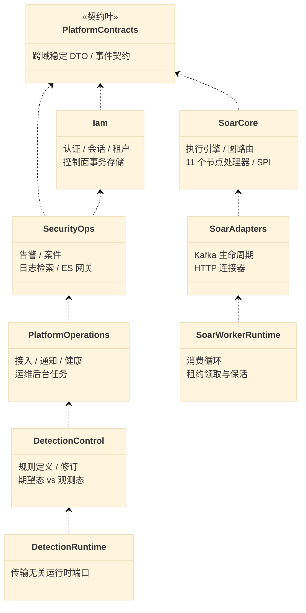
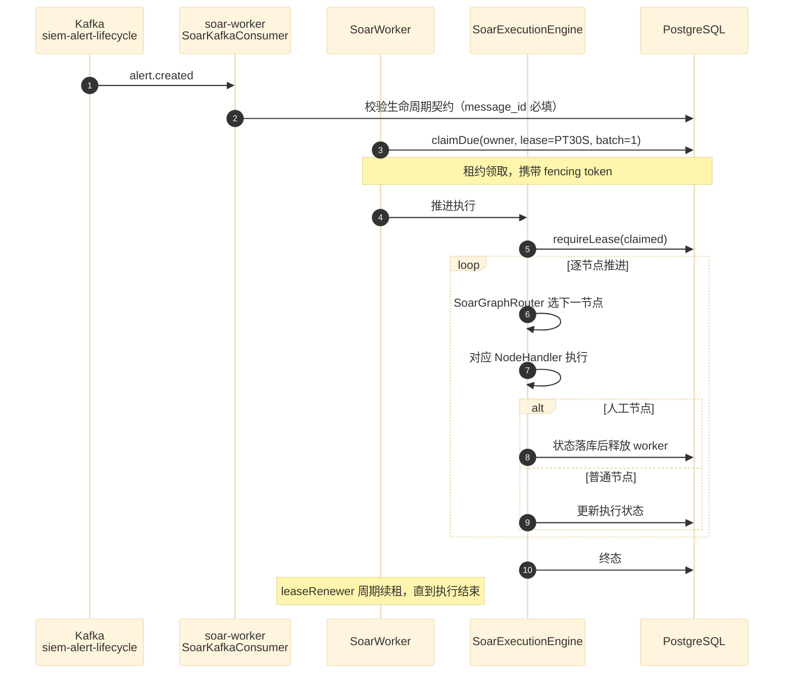

# 00 分层架构与模块总览

> **文档类型**：架构总览（代码级核验，非设计提案）
> **分析对象**：`D:\Project\SIEM`（Maven 多模块聚合工程，groupId 根 `com.xscsiem.hsiem_platform`；Java 21 · Spring Boot 4.1 · MyBatis 4.1 · PostgreSQL 16/Flyway · Kafka 3.8 · Flink 2.1 · Elasticsearch 8.14 · Vue 3.5）
> **取证方式**：无 `.codegraph/` 索引，采用**源码直读 + grep 统计**；每个关键论断均附 `file:line` 相对路径锚点，锚点对应真实代码。
> **结论以当前代码为准**（分支 `add_frame` @ `36b967f`）。
> **文档集**：00–06 共 7 篇，见 [`README.md`](README.md)。

---

## TL;DR

这是一个**按「数据面 / 控制面」双平面切分的 SIEM 平台**，工程上体现为**一个 Maven 聚合工程 + 三个可独立部署的 Spring Boot 进程 + 一个独立的 Flink 工程**：

- **数据面**（`flink/`）：Logstash → Kafka → Flink 检测 → Elasticsearch，事件时间流处理，与 Spring 控制面**零代码依赖**（flink 无 parent pom，独立构建）。
- **控制面**（`modules/` 12 + `applications/` 3）：`control-api` 是**组合根**，依赖 11/12 个模块；`detection-controller` 与 `soar-worker` 是**独立进程**，各有更窄的依赖集。
- **三条架构约束由代码强制**：模块依赖方向无环（`platform-contracts` 为叶）、MyBatis 按域隔离 SqlSessionFactory（三条 `@MapperScan`）、持久层迁移单一来源（`platform-migrations`）。

**最反直觉的一点**：`control-api` 虽然叫「控制 API」，却**不拥有检测的物理部署权**——它只写 desired state 并返回 `202 PENDING`（见 §9）。这条边界是本项目最值得注意的设计。

---

## 1. 分层总览与依赖方向

### 1.1 工程拓扑



**证据**：根 `pom.xml` 的 `<modules>` 共 **16 项**（12 modules + 3 applications + flink）；各模块内部依赖由各自 `pom.xml` 实测得出（见下表）。

### 1.2 依赖方向实测（无反例）

| 模块 | 内部依赖 |
| --- | --- |
| `platform-contracts` | **（无）** ← 叶 |
| `platform-migrations` | **（无）** ← 叶 |
| `iam` | `platform-contracts` |
| `agent-adapter` | `platform-contracts` |
| `security-ops` | `iam`, `platform-contracts` |
| `platform-operations` | `agent-adapter`, `iam`, `platform-contracts`, `security-ops` |
| `platform-operations-adapters` | `platform-operations` |
| `detection-control` | `iam`, `platform-contracts`, `platform-operations`, `security-ops` |
| `detection-runtime` | `detection-control` |
| `soar-core` | `iam`, `platform-contracts` |
| `soar-adapters` | `iam`, `platform-contracts`, `security-ops`, `soar-core` |
| `soar-worker-runtime` | `soar-adapters`, `soar-core` |

> 取证命令（可复现）：
> ```bash
> python -c "import re,pathlib;[print(p.parent.name, sorted(set(re.findall(r'<artifactId>(platform-[a-z-]+|iam|security-ops|soar-[a-z-]+|detection-[a-z]+|agent-adapter)</artifactId>', p.read_text(encoding='utf-8'))))) for p in sorted(pathlib.Path('modules').glob('*/pom.xml'))]"
> ```

**读法**：`platform-contracts` 被 11 个模块依赖、自身零内部依赖 → 它是**契约叶节点**，方向永远向内。
`detection-runtime` 单向依赖 `detection-control`（反向无依赖）→ 端口层在控制层之上，不是被控制层引用。

### 1.3 三个应用的依赖宽度（关键差异）

| 进程 | 依赖模块数 | 依赖集 |
| --- | --- | --- |
| `applications/control-api` | **11 / 12** | 除 `detection-runtime` 外全部 |
| `applications/soar-worker` | 7 | `iam`, `platform-migrations`, `platform-operations`, `security-ops`, `soar-adapters`, `soar-core`, `soar-worker-runtime` |
| `applications/detection-controller` | 4 | `detection-control`, `detection-runtime`, `platform-migrations`（+ 自身包） |

**这条差异是刻意的**：`control-api` 依赖面最宽是因为它是控制面的组合根；两个 worker 依赖面窄，是为了让它们**不把整个控制面拖进进程**。见 `CLAUDE.md` §16「控制面物理命令隔离」。

---

## 2. 导入边界（如何强制）

**本项目不用测试断言强制边界，而是用 Maven 模块边界 + 显式依赖声明强制。** 这是与「AST 扫描测试」流派的关键差异，值得记下：

| 边界 | 强制手段 | 证据 |
| --- | --- | --- |
| 数据面与 Spring 控制面零耦合 | `flink/` **无 parent pom**，不并入根 reactor，版本自 pin | `flink/pom.xml`（独立工程）；根 `pom.xml <modules>` 中 `flink` 仅为聚合项 |
| 模块依赖方向 | Maven `<dependency>` 声明；未声明的模块在编译期不可见 | §1.2 实测表 |
| 迁移资源单一来源 | 只有 `platform-migrations` 含 `db/migration`，其余模块不携带 | `modules/platform-migrations/src/main/resources/db/migration/`（19 个 `V*.sql`） |
| MyBatis 按域隔离 | 每域一个 `SqlSessionFactory` bean + 通配符只加载本域 XML | `MyBatis*Configuration`（见 §3） |

> **与直觉不同的一点**：`platform-migrations` **没有任何 Java 文件**（该模块 0 个 `.java`），它是纯资源模块（`resource-only`）。

---

## 3. 组合根 / 装配入口

**唯一装配所有适配器的地方是 `HsiemPlatformApplication`**（`applications/control-api/.../HsiemPlatformApplication.java:14-27`）：

```java
@SpringBootApplication
@EnableScheduling
@MapperScan(
        basePackageClasses = {ManagedDetectionMapper.class, DetectionRuntimeMapper.class},
        sqlSessionFactoryRef = "detectionSqlSessionFactory")
@MapperScan(
        basePackages = {"com.xscsiem.hsiem_platform.control", "com.xscsiem.hsiem_platform.tenant"},
        annotationClass = Mapper.class,
        sqlSessionFactoryRef = ControlPlaneMyBatisConfiguration.SESSION_FACTORY_NAME)
@MapperScan(
        basePackageClasses = SoarMapper.class,
        annotationClass = Mapper.class,
        sqlSessionFactoryRef = SoarMyBatisConfiguration.SESSION_FACTORY_NAME)
```

**三条 `@MapperScan` 的分工（按域隔离，非按包全扫）**：

| # | 扫描范围 | SqlSessionFactory | 行号 |
| --- | --- | --- | --- |
| 1 | `ManagedDetectionMapper` + `DetectionRuntimeMapper` 所在包 | `detectionSqlSessionFactory` | `:16-18` |
| 2 | `com.xscsiem.hsiem_platform.control` + `.tenant` | `ControlPlaneMyBatisConfiguration.SESSION_FACTORY_NAME`（`@Primary`） | `:19-22` |
| 3 | `SoarMapper` 所在包 | `SoarMyBatisConfiguration.SESSION_FACTORY_NAME` | `:23-26` |

后两条带 `annotationClass = Mapper.class` 且显式 `sqlSessionFactoryRef`——`CLAUDE.md` §持久化约定第 2 条记录了原因：**避免 starter 的 `@ConditionalOnMissingBean` 模板误绑**。

**两个 worker 是独立组合根**：

| 进程 | 组合根类 | 扫描范围 |
| --- | --- | --- |
| `soar-worker` | `entrypoints/SoarWorkerApplication.java` | 只扫 control + soar |
| `detection-controller` | `DetectionControllerApplication.java` | 只扫 `detection.controller` 包 |

> **反直觉真实形态**：`control-api` **不扫** `detection-runtime` / artifact mapper → 保证 `control-api ↔ detection-runtime` 边界封闭（`CLAUDE.md` §持久化约定第 2 条明确写了这一点）。

---

## 4. 配置入口

**每个可执行应用各有一份 `application.properties`**，不是共享一份：

| 应用 | 配置文件 | 关键内容 |
| --- | --- | --- |
| `control-api` | `applications/control-api/src/main/resources/application.properties` | 数据源、SOAR 运行时开关、detection、运维、actuator |
| `soar-worker` | `applications/soar-worker/src/main/resources/application.properties` | `web-application-type=none`、SOAR 开关、Kafka、`app.operations.runtime-enabled=false` |
| `detection-controller` | `applications/detection-controller/src/main/resources/application.properties` | `web-application-type=none`、`app.detection.runtime-adapter=disabled` 默认 |

**配置项全部走「环境变量 + 默认值」形式**，例如 `control-api`：

```properties
app.soar.kafka-bootstrap=${SIEM_KAFKA_BOOTSTRAP:localhost:9092}     # :48
app.soar.worker-lease=${SIEM_SOAR_WORKER_LEASE:PT30S}               # :45
app.soar.lifecycle-outbox-lease=${SIEM_SOAR_LIFECYCLE_OUTBOX_LEASE:PT2M}  # :58
```

**Secret 卫生**：Kafka SASL / TLS 口令只从环境变量读取，默认值为空字符串（`app.soar.kafka-sasl-jaas-config=${SIEM_KAFKA_SASL_JAAS_CONFIG:}`，`:54`），即**未配置时 fail closed**，不硬编码兜底口令。

---

## 5. 模块职责总表



| 模块 | 职责 | 规模（`.java` 总数，含测试） | 关键锚点 |
| --- | --- | --- | --- |
| `platform-contracts` | 跨域端口 + 共享异常 + 租户上下文 | 5 java（main 5 / test 0） | `LifecycleEventPort.java`、`ApiError.java`、`TenantContext.java` |
| `platform-migrations` | Flyway 迁移资源（唯一来源） | **0 java / 19 sql** | `db/migration/V1…V19` |
| `iam` | 认证、会话、租户、控制面存储 | 28 java（main 28 / test 0） | `control/CaseStore.java`、`control/LifecycleOutboxStore.java` |
| `security-ops` | 告警、案件、日志检索、ES 网关 | 13 java（main 13 / test 0） | `alert/AlertService.java`、`investigation/CaseMirrorDispatcher.java` |
| `agent-adapter` | 出站 Agent 适配 | 4 java（main 4 / test 0） | — |
| `platform-operations` | 接入、通知、健康、运维任务 | 25 java（main 25 / test 0） | — |
| `platform-operations-adapters` | WSL/Docker `ProcessBuilder` 物理命令 | 3 java（main 2 / test 1） | 见 `CLAUDE.md` §16 |
| `detection-control` | 规则、修订、期望态、调度 | 30 java（main 30 / test 0） | `rules/ManagedDetectionService.java`、`rules/DetectionPlanCompiler.java` |
| `detection-runtime` | 传输无关运行时端口 | 21 java（main 16 / test 5） | `rules/runtime/DetectionRuntimeMapper.java` |
| `soar-core` | 引擎 + SPI + 节点处理器 | 55 java（main 53 / test 2） | `soar/SoarExecutionEngine.java:17` |
| `soar-adapters` | Kafka / HTTP 连接器 | 18 java（main 14 / test 4） | — |
| `soar-worker-runtime` | 消费循环 + 租约保活 | 5 java（main 3 / test 2） | `soar/SoarWorker.java:23` |

> **规模计数口径**（可复现）：`find modules/<m> -name '*.java' | wc -l`——**含测试文件**。main/test 分列见 **03 篇**。
>
> **注意 `security-ops` 的 13 个 Java 文件对应 4 个子域**（告警 / 案件 / 日志检索 / ES 网关），是本项目里「文件数少但职责宽」的模块；`soar-core` 53 个 main 文件则是最大的模块。**模块大小与职责宽度不成正比**——这是按域拆模块而非按大小拆的结果。

---

## 6. 一次告警的生命周期（控制面视角）



**证据**：`SoarWorker` 的 `@Scheduled(fixedDelayString="${app.soar.worker-poll-ms:500}")`（`SoarWorker.java:49`）触发 `store.claimDue(owner, lease, 1)`（`:52`）；`leaseRenewer` 为单线程调度器（`:42`），`scheduleAtFixedRate` 续租（`:61`）。引擎侧 `requireLease` 在 `SoarExecutionEngine.java:52,54`，`SoarLeaseLostException` 捕获于 `:45,97`。

> 完整的端到端数据流（含数据面）见 **01 篇**。

---

## 7. 运行模式开关

来源于各应用 `application.properties`，均为「环境变量 + 默认值」：

| 开关 | 默认 | 作用 | 证据 |
| --- | --- | --- | --- |
| `app.soar.runtime-enabled` | `true` | control-api 是否启用 SOAR 运行时 | `control-api/application.properties:43` |
| `app.soar.kafka-consumer-enabled` | `true` | 是否开 Kafka 生命周期消费 | `:47` |
| `app.soar.worker-poll-ms` | `500` | worker 轮询间隔 | `:44` |
| `app.soar.worker-lease` | `PT30S` | 执行租约时长 | `:45` |
| `app.soar.worker-batch-size` | `10` | 单次领取上限 | `:46` |
| `app.soar.lifecycle-outbox-enabled` | `true` | 是否启用生命周期 outbox 派发 | `:57` |
| `app.soar.lifecycle-outbox-lease` | `PT2M` | outbox 派发租约 | `:58` |
| `app.soar.lifecycle-outbox-batch-size` | `50` | outbox 单批上限 | `:59` |
| `app.detection.group-buckets` | `1` | 检测分组桶数 | `:41` |
| `app.operations.process-adapters` | `enabled` | WSL/Docker 物理命令适配器 | `:7` |
| `app.operations.runtime-enabled` | control-api `true` / worker `false` | 非 SOAR 后台任务（CaseAggregateJob 等） | `soar-worker/application.properties:4` |
| `app.detection.runtime-adapter` | `disabled` | detection-controller 的物理部署适配器 | `detection-controller/application.properties` |

> **注意 `app.operations.runtime-enabled` 在两个应用里默认值不同**（control-api 默认 true，worker 默认 false）。`CLAUDE.md` §13 明确提醒：**不要仅依赖 `WebApplicationType` 判断**。

---

## 8. 关键设计原则（从代码反推）

| # | 原则 | 代码证据 |
| --- | --- | --- |
| 1 | **数据面独立构建，不并入 Spring reactor** | `flink/pom.xml` 无 `<parent>`；根 `pom.xml` 仅将其列为聚合项 |
| 2 | **契约叶节点向内收敛** | `platform-contracts` 被 11 模块依赖、自身零内部依赖 |
| 3 | **进程按权限宽度分层** | `control-api` 11 模块 vs `detection-controller` 4 模块 vs `soar-worker` 7 模块 |
| 4 | **持久层按域隔离 SqlSessionFactory** | 三条 `@MapperScan`（`HsiemPlatformApplication.java:16-26`） |
| 5 | **迁移资源单一来源** | 只有 `platform-migrations` 含 `db/migration`；两个 worker 都用 `classpath:db/migration` |
| 6 | **secret fail closed** | Kafka SASL/TLS 默认空串（`control-api/application.properties:53-56`） |
| 7 | **执行状态迁移集中在引擎** | `SoarExecutionEngine.java:15` 类注释：*"Node handlers calculate outcomes; this class owns every state transition."* |

---

## 9. 边界与变更守则

从 `CLAUDE.md` §关键知识点（易踩坑）提炼，均为**已在代码中体现的约束**：

1. **新增 mapper 必须同步加进对应应用的 `@MapperScan`**——三条扫描是显式白名单，不是全包扫描（`CLAUDE.md` §持久化约定 2）。
2. **`soar-core` 不得引入 Kafka / Actuator health / `java.net.http` / scheduled worker loop**——传输适配属于 `soar-adapters` 与 `soar-worker-runtime`（`CLAUDE.md` §12）。
3. **`control-api` 不得依赖或注入 `RulesDeployer` / `ProcessRulesDeployer`**——它只持久化 desired state（`CLAUDE.md` §15）。
4. **`detection-controller` 不依赖 `platform-operations-adapters`**；Detection 的 process adapter 位于 `detection-runtime`，仅在显式 `app.detection.runtime-adapter=process` 时启用（`CLAUDE.md` §16）。
5. **Flink job 必须用 `-f flink/pom.xml` 单独构建**——它无 parent，不能并入根 reactor（`CLAUDE.md` 常用命令）。

---

## 10. 待核实

1. **`security-ops` 与 `platform-operations` 的职责重叠边界**——两者都触及通知与健康，本文按依赖方向归类，未逐类核对分工。见 **03 篇**。
2. **`agent-adapter` 出站协议细节**——仅确认依赖 `platform-contracts`，未读其对外契约。见 **03 篇**。
3. **`platform-operations-adapters` 的物理命令清单**——仅确认其为 WSL/Docker `ProcessBuilder` 实现，未枚举全部命令。见 **03 篇**。

---

## 修订记录

| 版本 | 日期 | 变更 | 作者 |
| --- | --- | --- | --- |
| 1.0 | 2026-09-22 | 首版。基于 `add_frame` @ `36b967f` 全量取证。 | code-level-architecture-docs skill |
