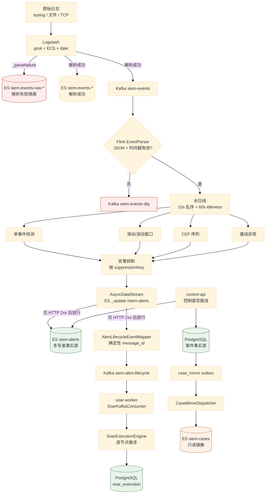
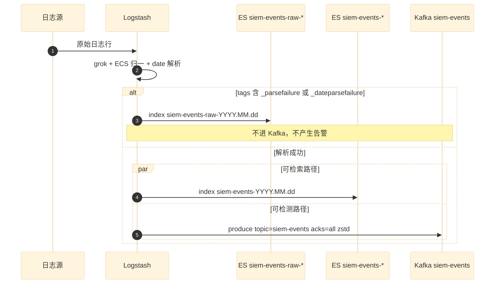
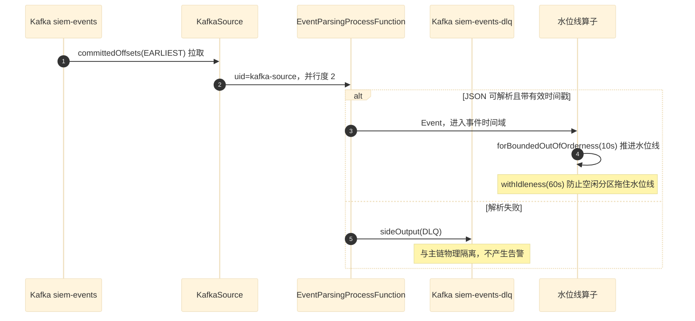
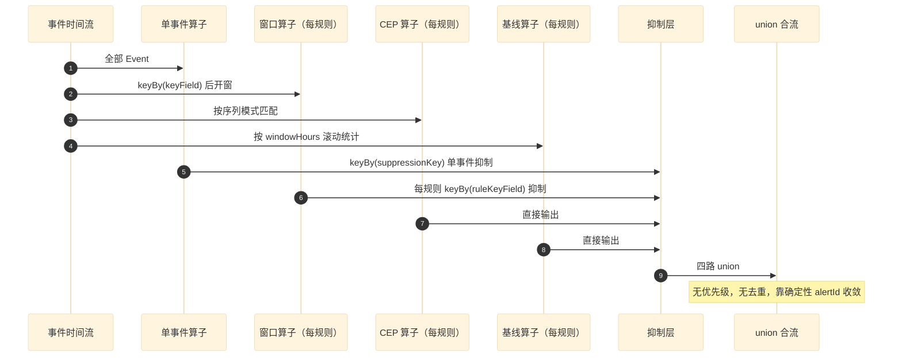
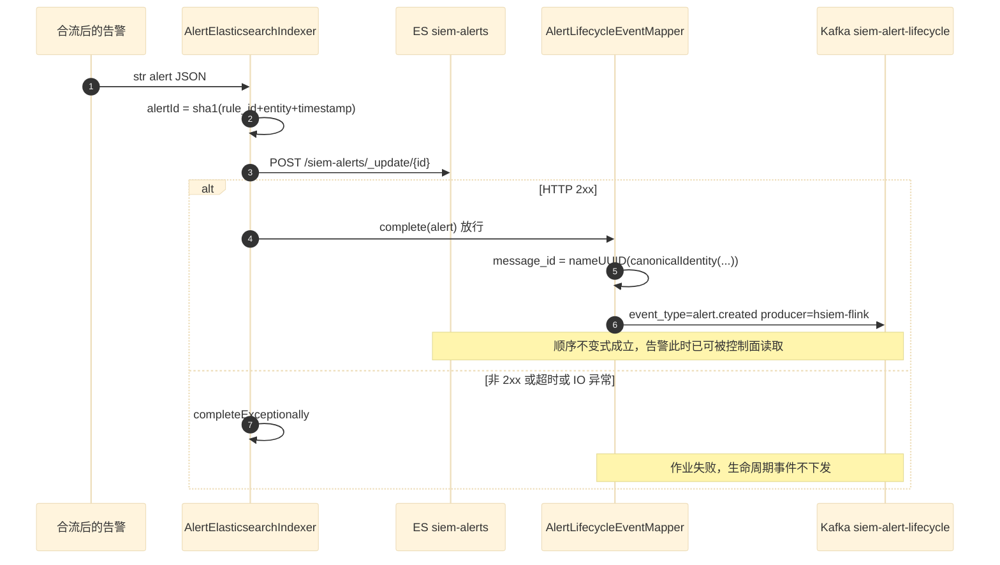
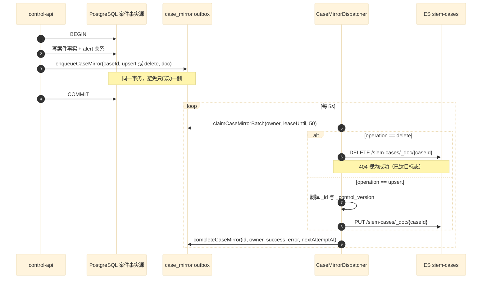
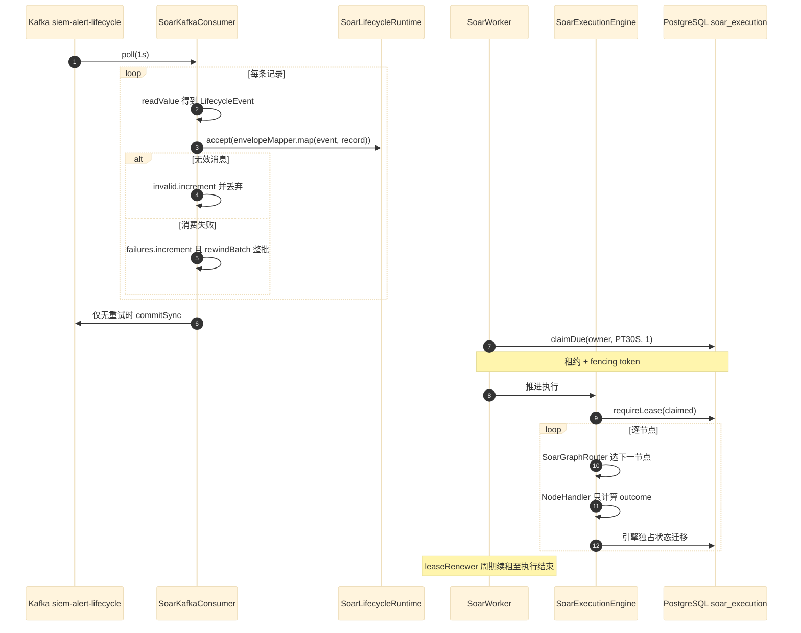
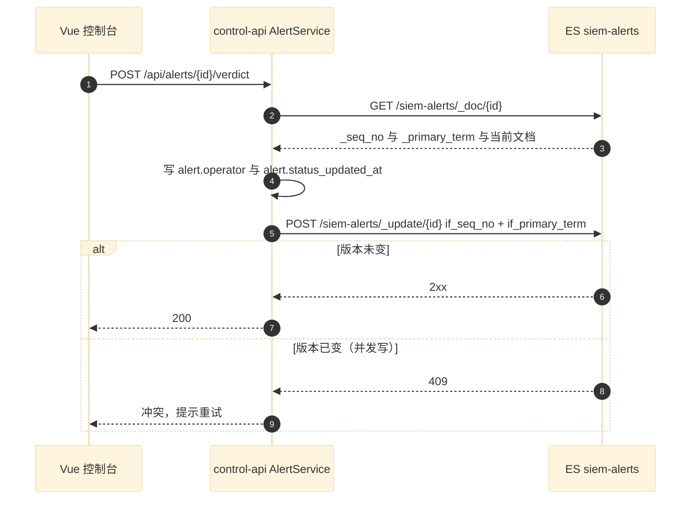

# 01 端到端关键数据流

> **文档类型**：数据流取证（代码级核验，非设计提案）
> **分析对象**：`D:\Project\SIEM`（Maven 聚合工程 + 独立 Flink 工程）
> **取证方式**：源码直读 + grep 统计；每个关键论断附 `file:line` 相对路径锚点
> **结论以当前代码为准**（分支 `add_frame` @ `36b967f`）
> **文档集**：00–06 共 7 篇，见 [`README.md`](README.md)

---

## 一句话定位

本文逐条拆解贯穿 HISIEM 的 **7 条端到端数据流**——从日志进入 Logstash，到 SOAR 逐节点执行处置动作。

每条数据流的写法固定为三段：**关键论断（带 `file:line` 锚点）→ 时序图（mermaid）→ 源码落点行**。

> **模式：论断先行，图佐证论断。** 图里画的每条消息，正文都能指到对应代码行。

---

## 0. 主链总览



**源码落点行**（按图上顺序）：

| 环节 | 锚点 |
| --- | --- |
| Logstash 分流 | `infra/logstash/pipeline/logstash.conf:95,101,109` |
| Flink 源 + 并行度 | `flink/src/main/java/com/siem/DetectionJob.java:107,131,138,146,151` |
| 解析 + DLQ 侧输出 | `DetectionJob.java:156,165,167`；`EventParsingProcessFunction.DLQ` |
| 水位线 | `DetectionJob.java:172,175,177` |
| 单事件 → 抑制 | `DetectionJob.java:189,190,192` |
| 窗口分支 | `DetectionJob.java:200,207,212,217,219,222` |
| CEP 分支 | `DetectionJob.java:236,243` |
| 基线分支 | `DetectionJob.java:260,266,268,271` |
| 合流 | `DetectionJob.java:225,287` |
| ES 索引（异步） | `DetectionJob.java:291,296`；`AlertElasticsearchIndexer.java:40,43,61` |
| 生命周期公告 | `DetectionJob.java:299,309,311`；`AlertLifecycleEventMapper.java:42,43,45` |
| SOAR 消费 | `modules/soar-worker-runtime/.../SoarKafkaConsumer.java:56,58,60,65` |
| SOAR 执行 | `modules/soar-core/.../SoarExecutionEngine.java:52,54`；`SoarWorker.java:49,52` |
| 案件 outbox | `modules/iam/.../control/CaseStore.java:11,33,36,38` |
| 案件镜像投递 | `modules/security-ops/.../investigation/CaseMirrorDispatcher.java:50,54,63,74` |

---

## 1. 数据流：日志接入与分流

### 1.1 关键论断

**论断 1：Logstash 是唯一的接入点，且它做的是「双出口 + 失败隔离」，不是单出口。**

解析成功的日志**同时**写入 ES（可检索）和 Kafka（可检测）——两条路径并行：

```ruby
# infra/logstash/pipeline/logstash.conf:101-121
} else {
  elasticsearch {
    hosts => ["http://elasticsearch:9200"]
    index => "siem-events-%{+YYYY.MM.dd}"
  }

  kafka {
    bootstrap_servers => "kafka:9092"
    topic_id => "siem-events"
    codec => json
    acks => "all"
    retries => 5
    ...
    compression_type => "zstd"
  }
}
```

解析失败（`_parsefailure` / `_dateparsefailure` 标签）的日志被**路由到独立 raw 索引，且不进 Kafka**：

```ruby
# infra/logstash/pipeline/logstash.conf:95-100
if "_parsefailure" in [tags] or "_dateparsefailure" in [tags] {
  elasticsearch {
    hosts => ["http://elasticsearch:9200"]
    index => "siem-events-raw-%{+YYYY.MM.dd}"
  }
}
```

> **这条隔离是有意的**：`logstash.conf:92` 注释写明「保留原文可查（排查窗口，非长期存储），**不进 Kafka → 不进 Flink 检测**（不产生告警）」。即**脏数据永不可能触发告警**——这是数据面的第一道质量闸门。

**论断 2：`siem-events-raw-*` 走独立的 ES 模板，靠 `priority` 压过主模板。**

`logstash.conf:93-94` 注释记录了原因：raw 模板 `priority: 200` > 主模板 `priority: 100`，**避免平级模板 tie-break 覆盖 `match_only_text` 语义**。这是同前缀索引（`siem-events-*` 与 `siem-events-raw-*`）共存时的必要手法。

**论断 3：接入侧配置由控制面程序生成，不是手写的。**

`OnboardingController` 提供 `/api/log-sources` 系列端点（见附录 A），并有 `LogstashConfigGenerator`（测试锚点 `LogstashConfigGeneratorTest.java:51,52`）。生成器已规避两个实战坑（见 `CLAUDE.md` §关键知识点 6、7）：`--path.data` 重定向避免队列锁争抢、数组尾逗号。

### 1.2 时序图



### 1.3 源码落点行

| 行 | 内容 |
| --- | --- |
| `logstash.conf:95` | `if "_parsefailure" in [tags] or "_dateparsefailure" in [tags]` |
| `logstash.conf:98` | raw 索引名 `siem-events-raw-%{+YYYY.MM.dd}` |
| `logstash.conf:104` | 主索引名 `siem-events-%{+YYYY.MM.dd}` |
| `logstash.conf:111` | Kafka `topic_id => "siem-events"` |
| `logstash.conf:113-120` | `acks=all` / `retries=5` / `zstd` / `batch_size=131072` / `linger_ms=5` |

---

## 2. 数据流：Flink 解析、DLQ 隔离与事件时间

### 2.1 关键论断

**论断 1：源用 `committedOffsets(EARLIEST)`，不是固定 `earliest()`。**

```java
// flink/src/main/java/com/siem/DetectionJob.java:138
OffsetsInitializer.committedOffsets(OffsetResetStrategy.EARLIEST)
```

这是**语义差异**而非风格差异：`committedOffsets` 优先使用已提交位点，**仅在没有已提交位点时**才回退到最早位置。固定 `earliest()` 会让每次重启都从头重放。

并行度固定为 2，注释写明了原因——分摊 3 个分区：

```java
// DetectionJob.java:107-108
// KafkaSource 以 2 个并行消费者分摊 3 分区的 siem-events。
env.setParallelism(2);
```

**论断 2：checkpoint 是 `EXACTLY_ONCE`，但 Kafka sink 是 `AT_LEAST_ONCE`——两者不同。**

```java
// DetectionJob.java:113-117
env.enableCheckpointing(tuning.checkpointIntervalMs(), CheckpointingMode.EXACTLY_ONCE);
env.getCheckpointConfig().setCheckpointTimeout(tuning.checkpointTimeoutMs());
env.getCheckpointConfig().setMinPauseBetweenCheckpoints(tuning.minPauseBetweenCheckpointsMs());
env.getCheckpointConfig().setMaxConcurrentCheckpoints(1);
env.getCheckpointConfig().setTolerableCheckpointFailureNumber(tuning.tolerableCheckpointFailures());
```

而 DLQ sink 与 lifecycle sink 都显式声明 `AT_LEAST_ONCE`：

```java
// DetectionJob.java:163（DLQ）
.setDeliveryGuarantee(DeliveryGuarantee.AT_LEAST_ONCE);
// DetectionJob.java:306（lifecycle）
.setDeliveryGuarantee(DeliveryGuarantee.AT_LEAST_ONCE);
```

**这意味着故障恢复时可能重放少量在途记录。** 系统的应对不是「消除重放」，而是**让重放幂等**——见下一条。

**论断 3：告警身份是确定性的 `sha1(rule_id|entity|@timestamp)`，所以重放能收敛。**

```java
// DetectionJob.java:452-463
static String alertId(String element) {
    ...
    String ruleId = String.valueOf(alert.getOrDefault("alert.rule_id", "unknown"));
    Object declaredEntity = alert.get("alert.entity");
    Object ip = alert.get("source.ip");
    Object user = alert.get("user.name");
    String entity = declaredEntity != null ? String.valueOf(declaredEntity)
            : (ip != null ? String.valueOf(ip)
            : (user != null ? String.valueOf(user) : "unknown"));
    String ts = String.valueOf(alert.getOrDefault("@timestamp", "unknown"));
    return sha1Hex(ruleId + "|" + entity + "|" + ts);
}
```

同一个三元组永远算出同一个 ID → 写 ES 用 `_update`（非 `_doc` 索引）**天然幂等**。`CLAUDE.md` §关键知识点 1 明确记录了这个设计意图：*「故障仍可能重放少量在途记录，告警依靠确定性 ES ID 收敛」*。

值得注意：**entity 有优先级链**——`alert.entity` 声明值 > `source.ip` > `user.name` > `"unknown"`。

**论断 4：解析失败走 side output 到独立 DLQ topic，与主链物理隔离。**

```java
// DetectionJob.java:156-167
        .uid("event-parser");
KafkaSinkBuilder<String> dlqSink = KafkaSink.<String>builder()
        ...
        .setDeliveryGuarantee(DeliveryGuarantee.AT_LEAST_ONCE);

parsed.getSideOutput(EventParsingProcessFunction.DLQ)
        ...
        .uid("event-parser-dlq-kafka");
```

**论断 5：水位线容忍 10 秒乱序 + 60 秒分区空闲。**

```java
// DetectionJob.java:172-177
WatermarkStrategy.<Event>forBoundedOutOfOrderness(Duration.ofSeconds(10))
        ...
        .withIdleness(Duration.ofSeconds(60))
        ...
        .uid("window-watermark");
```

`withIdleness(60s)` 是针对**多分区**场景的必要设置：若某分区长期无数据，其水位线会拖住整条流，导致窗口永不关闭。10 秒乱序容忍的代价是**告警延迟至少 10 秒**。

### 2.2 时序图



---

## 3. 数据流：四类检测分支与告警合流

### 3.1 关键论断

**论断 1：四类分支由规则 YAML 驱动，各有独立算子 uid。**

| 分支 | 生成条件 | 算子 uid 模式 | 锚点 |
| --- | --- | --- | --- |
| 单事件 | `"single_event".equals(d.category)` | `single-event-detection` | `DetectionJob.java:184,189` |
| 窗口 | `"window".equals(x.category)` | `window-<ruleId>` | `DetectionJob.java:200,217` |
| CEP | 序列规则 | `cep-<ruleId>` | `DetectionJob.java:243` |
| 基线 | 基线条目 | `baseline-<ruleId>` | `DetectionJob.java:271` |

后三类**按规则逐条建算子**（`uid` 拼规则 id），因为每类规则的 key、窗口长度、阈值都不同。单事件只有一个算子，因为所有单事件规则共用同一套匹配逻辑。

**论断 2：窗口支持两种类型，由规则声明决定。**

```java
// DetectionJob.java:207,212
windowed = keyed.window(SlidingEventTimeWindows.of(...));
// 或
windowed = keyed.window(TumblingEventTimeWindows.of(Duration.ofMinutes(wr.getWindowMinutes())))
```

**论断 3：抑制是每分支独立的一层，不是全局收口。**

单事件抑制：

```java
// DetectionJob.java:190,192
.keyBy(AlertSuppressor::suppressionKey)
        .uid("alert-suppression");
```

窗口抑制**每条规则一个**，且带规则自己的 keyField：

```java
// DetectionJob.java:219,222
.keyBy(alert -> WindowAlertSuppressor.suppressionKey(alert, wr.getKeyField()))
        .uid("window-alert-suppression-" + wr.getId()));
```

**这点容易看错**：`alert-suppression` 是**单事件专用**的；窗口分支不走它，走 `window-alert-suppression-<ruleId>`。四类分支**各自抑制后**才合流。

**论断 4：合流是 `union`，没有优先级或去重。**

```java
// DetectionJob.java:225
DataStream<String> windowAlerts = windowStreams.isEmpty()
        ? null : windowStreams.stream().reduce((a, b) -> a.union(b)).get();
// DetectionJob.java:287
DataStream<String> alerts = allAlerts.stream().reduce((a, b) -> a.union(b)).get();
```

注意两处都**显式处理空集合**（`isEmpty() ? null : ...`），避免 `reduce` 在无规则时抛异常。

**论断 5：全链共 9 个稳定算子 uid。**

grep 实测：`kafka-source`、`event-parser`、`event-parser-dlq-kafka`、`window-watermark`、`single-event-detection`、`alert-suppression`、`es-index-and-forward`、`alert-lifecycle-contract`、`alert-lifecycle-kafka`——外加按规则动态生成的 `window-*` / `cep-*` / `baseline-*` / `window-alert-suppression-*`。

> **为什么 uid 重要**：uid 是 savepoint 恢复的算子寻址键。改 uid 等于让既有 savepoint 失效。见 `CLAUDE.md` §关键知识点 8（cancel 默认删 checkpoint，恢复演练须用 savepoint）。

### 3.2 时序图



---

## 4. 数据流：告警落 ES → 生命周期公告（**顺序保证**）

### 4.1 关键论断

**这条流的全部要点是一个顺序不变式：SOAR 绝不能先于告警可读而收到 `alert.created`。**

**论断 1：ES 写入是异步算子，且只在 HTTP 2xx 时向下游放行。**

```java
// flink/src/main/java/com/siem/DetectionJob.java:291-296
DataStream<String> indexedAlerts = AsyncDataStream.unorderedWait(
                alerts, new AlertElasticsearchIndexer(esUrl, esUser, esPassword),
                30, TimeUnit.SECONDS, tuning.esMaxBufferedRequests())
        .uid("es-index-and-forward");
```

`AlertElasticsearchIndexer` 是 `RichAsyncFunction`，非 2xx 一律 `completeExceptionally`：

```java
// AlertElasticsearchIndexer.java:52-63
client.sendAsync(request.build(), HttpResponse.BodyHandlers.ofString())
        .whenComplete((response, error) -> {
            if (error != null) {
                resultFuture.completeExceptionally(error);
            } else if (response.statusCode() / 100 != 2) {
                resultFuture.completeExceptionally(new IllegalStateException(
                        "Elasticsearch alert update failed HTTP " + response.statusCode()
                                + ": " + response.body()));
            } else {
                resultFuture.complete(Collections.singleton(alert));
            }
        });
```

超时同样 `completeExceptionally`（`:68`）。

**关键点**：`completeExceptionally` 不是「记个日志继续」——异步算子的异常会**触发作业失败**，从而**不会向下游发出生命周期事件**。这就是顺序保证的实现方式：**不是排队，是让前半段失败时后半段根本收不到消息。**

类注释把这个意图写得很直白：

```java
// AlertElasticsearchIndexer.java:18-19
 * This ordering is intentional: SOAR must never consume alert.created before
 * the target alert can be read and updated by the control-plane services.
```

**论断 2：写 ES 用 `_update`（部分更新），不是 `_doc`（整体覆盖）。**

```java
// AlertElasticsearchIndexer.java:43
.uri(URI.create(esUrl + "/siem-alerts/_update/" + id))
```

**这里有个反直觉点**：Flink 写告警用的是 `_update`，而控制面读告警用 `GET /siem-alerts/_doc/{id}`（`AlertService.java:179,201,249,403`），控制面改告警也用 `_update` 但**带乐观锁**（`AlertService.java:401,426`）。

即：**`siem-alerts` 是控制面与数据面共享的事实源**，两个写者用不同的一致性策略（Flink 靠确定性 ID 幂等；控制面靠 `if_seq_no`/`if_primary_term` 乐观锁 + 409 冲突）。

**论断 3：生命周期事件只有一种 `event_type`，且 `message_id` 是确定性的。**

```java
// AlertLifecycleEventMapper.java:42-46
envelope.put("message_id", messageId("alert.created", "default", "alert", alertId, occurredAt));
envelope.put("event_type", "alert.created");
envelope.put("occurred_at", occurredAt.toString());
envelope.put("producer", "hsiem-flink");
envelope.put("tenant_id", "default");
```

硬编码 `"alert.created"`、`"default"`、`"hsiem-flink"`——**Flink 侧只发这一种事件**。控制面侧的其它事件类型来自另一条路径，见 §6。

`message_id` 的确定性来自带长度前缀的规范化编码：

```java
// AlertLifecycleEventMapper.java:70-88
private static String messageId(String eventType, String tenantId, String objectType,
                                String objectId, Instant occurredAt) {
    return UUID.nameUUIDFromBytes(canonicalIdentity(
            eventType, tenantId, objectType, objectId, occurredAt.toString())).toString();
}

/** Encodes each identity component with its byte length to avoid delimiter collisions. */
private static byte[] canonicalIdentity(String... components) {
    ...
    encoded.write(length >>> 24); ... // 4 字节长度前缀
```

**长度前缀是为了避免分隔符碰撞**——`("ab","c")` 与 `("a","bc")` 用 `|` 拼接会得到相同字符串。这是确定性哈希的正确做法。

**论断 4：生命周期事件的 `id` 用的是 ES 文档 id，不是探测器展示用的 `alert.id`。**

```java
// AlertLifecycleEventMapper.java:25-27
// The lifecycle id is the Elasticsearch document id used by AlertService,
// not the detector's display-only alert.id field.
String alertId = DetectionJob.alertId(alertJson);
```

**两个 id 语义不同，容易混淆**：`alert.id` 是探测器内部标识（仅供展示），lifecycle 的 `id` 必须是 ES 文档 id（即 `DetectionJob.alertId` 的 sha1 结果），否则 SOAR 拿到的 id 在控制面查不到。

**论断 5：生命周期 envelope 是「故意小」的契约。**

```java
// AlertLifecycleEventMapper.java:13
/** Converts a stored alert into the deliberately small SOAR lifecycle contract. */
```

只带 11 个告警字段（`AlertLifecycleEventMapper.java:29-39`）：`id`、`rule_id`、`rule_name`、`severity`、`status`、`verdict`、`risk_score`、`source_ip`、`user_name`、`host_name`、`timestamp`。**不带原始事件、不带 `matched_event_ids`**——SOAR 需要明细时回查控制面。

### 4.2 时序图



### 4.3 源码落点行

| 行 | 内容 |
| --- | --- |
| `DetectionJob.java:291` | `AsyncDataStream.unorderedWait(...)`，超时 30s |
| `AlertElasticsearchIndexer.java:43` | `POST /siem-alerts/_update/{id}` |
| `AlertElasticsearchIndexer.java:56-59` | 非 2xx → `completeExceptionally` |
| `AlertElasticsearchIndexer.java:68` | 超时 → `completeExceptionally` |
| `DetectionJob.java:299-306` | lifecycle KafkaSink，`AT_LEAST_ONCE` |
| `DetectionJob.java:309` | `uid("alert-lifecycle-contract")` |
| `AlertLifecycleEventMapper.java:42-45` | `message_id` / `event_type` / `producer` |

---

## 5. 数据流：案件——PostgreSQL 事实源 → outbox → ES 镜像

### 5.1 关键论断

**论断 1：案件的权威存储是 PostgreSQL，ES 只是只读镜像——这与告警相反。**

告警的事实源在 ES（`siem-alerts`）；案件的事实源在 PostgreSQL，ES 中的 `siem-cases` 是投影。端口注释写死了这条边界：

```java
// modules/iam/src/main/java/com/xscsiem/hsiem_platform/control/CaseStore.java:11-12
 * <p>案件写路径的镜像机制是：事实变更在同一事务内先落 PostgreSQL 并由 {@code enqueueCaseMirror} 写入 outbox，再由 {@code
 * claimCaseMirrorBatch}/{@code completeCaseMirror} 投递给 Elasticsearch；业务正常写路径不应绕过此端口直接写 ES。
```

**论断 2：outbox 的入队与事实变更在同一事务内——这是「避免只成功一侧」的机制。**

```java
// CaseStore.java:32-33
/** 在案件事实源事务中写入 ES 镜像 outbox，避免删除/更新只成功一侧。 */
void enqueueCaseMirror(String caseId, String operation, Map<String, Object> document);
```

调用点在 `MyBatisControlPlaneStore`：`:345`、`:431`、`:466`（`upsert` / `delete` 两类操作）。

**论断 3：领取用租约（lease），且注释诚实标注了「当前不用 SKIP LOCKED」。**

```java
// CaseStore.java:35-36
/** 由单个 dispatcher 持有租约领取待投递的镜像操作。 */
List<Map<String, Object>> claimCaseMirrorBatch(String owner, Instant leaseUntil, int size);
```

```java
// CaseMirrorDispatcher.java:20-21
 * 将 PostgreSQL 案件事实源可靠投递到 ES 镜像。数据库 outbox 保证进程重启后仍可重试， lease + 事务行锁保证多实例不会同时处理同一条消息；当前领取 SQL 不使用
 * SKIP LOCKED。
```

> **这是本文最该注意的一处诚实标注**：文档明说「不使用 SKIP LOCKED」。它不隐藏实现选择——租约 + 事务行锁已能保证不重复处理，`SKIP LOCKED` 只是并发性能优化。**这类自我标注比一句「已用最佳实践」可信得多。**

**论断 4：`owner` 是进程启动时生成的随机串——多实例天然隔离。**

```java
// CaseMirrorDispatcher.java:36
private final String owner = "case-mirror-" + UUID.randomUUID();
```

同样的手法出现在 `LifecycleOutboxDispatcher.java:43`（`"lifecycle-outbox-" + UUID.randomUUID()`）。**这是「无中心协调的租约归属」**：每个进程启动时随机认领一个身份，配合 DB 侧 `lease_until` 判活。

**论断 5：投递 target 是 ES 的 `siem-cases/_doc/{caseId}`，删除操作把 404 视为成功。**

```java
// CaseMirrorDispatcher.java:63-67
response = elasticsearch.request("DELETE", "/siem-cases/_doc/" + caseId, null);
if ((response.code() < 200 || response.code() >= 300)
        && response.code() != 404) {
    throw new IllegalStateException("ES 删除案件失败 HTTP " + response.code());
}
```

**`404` 被显式放过**——因为「要删的东西本来就不存在」对镜像而言是**已达目标态**，重试无意义。

**论断 6：投递前剥掉两个控制面内部字段。**

```java
// CaseMirrorDispatcher.java:71-72
document.remove("_id");
document.remove("_control_version");
```

`_control_version` 是控制面乐观锁版本号，属于 PG 事实源的内部状态，**不应泄漏到只读镜像**。

**论断 7：自动聚合是幂等的、每 5 分钟一轮。**

```java
// modules/security-ops/.../investigation/CaseAggregateJob.java:11-13
 * 自动聚合调度(story-07 FR-1):每 5min 扫描近 30min open 告警,
 * 按实体(source.ip 优先,退 user.name)聚类,组内 ≥2 条建案。
 * 幂等可重跑(已入他案告警跳过;已有同实体 open 案不再新建)。
```

```java
// CaseAggregateJob.java:31
@Scheduled(fixedDelay = 5 * 60 * 1000, initialDelay = 60 * 1000)
```

**注意实体优先级与告警 ID 的优先级链一致**（`source.ip` 优先，退 `user.name`）——见 §2.1 论断 3。

**论断 8：聚合的两个幂等条件写成了明确规则。**

`CaseAggregateJob.java:13` 列出：已入他案的告警跳过；已有同实体 open 案不再新建。**这两条让「重跑」安全**——不需要分布式锁。

### 5.2 时序图



---

## 6. 数据流：SOAR——生命周期消费、租约与逐节点执行

### 6.1 关键论断

**论断 1：消费端不用 Spring Kafka，自己起一个平台线程管 `KafkaConsumer`。**

```java
// modules/soar-worker-runtime/.../SoarKafkaConsumer.java:48-51
public void start() {
    if (!running.compareAndSet(false, true)) return;
    thread = Thread.ofPlatform().name("siem-soar-kafka").daemon(true).start(this::consume);
}
```

实现了 `SmartLifecycle`，由 Spring 生命周期驱动；`@ConditionalOnProperty(name = "app.soar.kafka-consumer-enabled", havingValue = "true", matchIfMissing = true)`（`:21`）。

**论断 2：失败记录区分「无效」与「消费失败」两类，处置完全不同。**

```java
// SoarKafkaConsumer.java:63-77
try {
    LifecycleEvent event = objectMapper.readValue(record.value(), LifecycleEvent.class);
    runtime.accept(envelopeMapper.map(event, record));
} catch (IllegalArgumentException | com.fasterxml.jackson.core.JsonProcessingException e) {
    invalid.increment();
    LOG.error("Discard invalid SOAR lifecycle message topic={} partition={} offset={}: {}", ...);
} catch (RuntimeException e) {
    failures.increment();
    LOG.error("SOAR lifecycle consumption failed topic={} partition={} offset={}", ...);
    rewindBatch(active, records);
    retry = true;
    break;
}
```

**「无效」= 丢弃并继续（毒消息不阻塞分区）；「失败」= 回退整批并重试。** 两个 Micrometer 计数器分开：`siem.soar.kafka.invalid`（`:43`）与 `siem.soar.kafka.consume.failed`（`:44`）。

**论断 3：失败时回退的是整个批次，不是失败的那一条分区——原因是 `poll()` 的副作用。**

```java
// SoarKafkaConsumer.java:106-110（类注释）
/**
 * poll() advances the in-memory position of every fetched partition. If one record fails,
 * rewinding only that partition could let a later commit skip unprocessed records from the
 * other partitions in the same batch. Rewind the complete batch; execution uniqueness makes
 * already-processed lifecycle messages safe to replay.
 */
```

**这是本文里最值得单独记住的一处推理**：`commitSync()` 是**全分区提交**的，若只回退失败分区，那么 commit 会把**其它分区已推进的位置**一并提交，从而**跳过那些分区里尚未处理的记录**。所以必须整批回退。而重放的安全性由「执行唯一性」兜底。

**论断 4：只有整批无重试时才 `commitSync`。**

```java
// SoarKafkaConsumer.java:79
if (!retry && !records.isEmpty()) active.commitSync();
```

**论断 5：worker 是轮询 + 租约的，不是事件驱动。**

```java
// modules/soar-worker-runtime/.../SoarWorker.java:49
@Scheduled(fixedDelayString = "${app.soar.worker-poll-ms:500}")
```
配合 `claimDue(owner, lease, 1)`（`SoarWorker.java:52`），默认 `app.soar.worker-lease=PT30S`。

**论断 6：状态迁移权集中在引擎，节点处理器只算结果。**

```java
// modules/soar-core/.../SoarExecutionEngine.java:15（类注释）
 * Node handlers calculate outcomes; this class owns every state transition.
```

租约在引擎内再次校验：`requireLease`（`SoarExecutionEngine.java:52,54`），丢失租约抛 `SoarLeaseLostException`（捕获于 `:45,97`）。**这是 fencing token 语义**——即便消息被重放，过期租约持有者也写不进去。

**论断 7：控制面侧的生命周期事件走 outbox，不走 Flink 那条路。**

```java
// modules/soar-adapters/.../LifecycleEventPublisher.java:69-80
store.enqueueLifecycle(
        event.messageId(), event.eventType(), event.effectiveTenantId(),
        event.objectType(), event.objectId(), event.occurredAt(),
        properties.topicFor(event.objectType()), event.objectId(), body);
```

`LifecycleEventPublisher` 是 `LifecycleEventPort` 的实现（`:15`），持 `LifecycleOutboxStore`（`:22`）。**即控制面产生的事件先落 DB outbox，再由 dispatcher 投 Kafka**——与案件的镜像 outbox 是同一个模式。

```java
// LifecycleOutboxDispatcher.java:24-27（类注释）
/**
 * Delivers the durable lifecycle outbox to Kafka. The database lease is the authority for
 * ownership; Kafka delivery is intentionally at-least-once.
 */
```

```java
// LifecycleOutboxDispatcher.java:43
private final String owner = "lifecycle-outbox-" + UUID.randomUUID();
```

**论断 8：`publish` 在 `enabled=false` 时静默返回。**

```java
// LifecycleEventPublisher.java:52
if (!enabled) return;
```

`enabled` 来自 `app.soar.runtime-enabled`（`:33`）。**注意这是静默的**——不报错、不计数。开关注释见 00 篇 §7。

### 6.2 时序图



---

## 7. 数据流：控制面告警写路径（ES 事实源 + 乐观锁）

### 7.1 关键论断

**论断 1：控制面读告警用 `_doc`，改告警用带乐观锁的 `_update`。**

```java
// modules/security-ops/.../alert/AlertService.java:179
Map<String, Object> doc = esGet("/siem-alerts/_doc/" + id);
```

```java
// AlertService.java:401（方法注释）
/** 乐观锁更新:先 GET 拿 _seq_no/_primary_term,再 _update 带 if_seq_no/if_primary_term,冲突 409。 */
```

```java
// AlertService.java:426
"/siem-alerts/_update/"
```

**这套「GET 版本号 → 带 `if_seq_no` 更新」是标准的 ES 乐观并发控制。** 与 Flink 侧的确定性 ID 幂等形成互补：**Flink 防重复写，控制面防并发覆盖**。

**论断 2：状态变更会写审计字段。**

```java
// AlertService.java:211
doc.put("alert.status_updated_at", Instant.now().toString());
// AlertService.java:349
doc.put("alert.status_updated_at", Instant.now().toString());
```

类注释（`AlertService.java:28`）列出完整能力：*「verdict - 乐观锁更新(_seq_no/_primary_term,并发冲突 409)+ 操作审计(alert.operator/status_updated_at) - 批量」*。

**论断 3：控制面与数据面对 `siem-alerts` 的写权限不对称——但都是写。**

这是本项目的**一处重要架构事实**：`siem-alerts` **不是**「Flink 独占写、控制面只读」。控制面通过 `POST /api/alerts/{id}/status`、`/verdict` 等端点直接改同一批文档。**所以 `siem-alerts` 是多写者的共享事实源**，一致性靠「确定性 ID + 乐观锁」两个机制而非单一写者假设。

### 7.2 时序图



---

## 8. 关键不变式（代码强制）

| # | 不变式 | 强制点 | 违反后果 |
| --- | --- | --- | --- |
| 1 | **脏数据永不产生告警** | `logstash.conf:95` 解析失败走 raw 索引且不进 Kafka | 无告警（结构上不可能） |
| 2 | **SOAR 不先于告警可读而收到 `alert.created`** | `AlertElasticsearchIndexer.java:56,68` 非 2xx/超时 → `completeExceptionally` | 作业失败，事件不下发 |
| 3 | **重放的告警收敛到同一文档** | `DetectionJob.java:463` 确定性 `sha1(rule_id\|entity\|@timestamp)` | 重复文档 |
| 4 | **案件事实与镜像 outbox 同事务** | `CaseStore.java:32` 端口契约；`MyBatisControlPlaneStore.java:345,431,466` | 单侧成功，镜像与事实源不一致 |
| 5 | **租约过期者写不进执行状态** | `SoarExecutionEngine.java:52,54` `requireLease` + `SoarLeaseLostException` | 双 worker 并发推进同一执行 |
| 6 | **消费失败必须整批回退** | `SoarKafkaConsumer.java:74` `rewindBatch` + `:106-110` 注释 | 跨分区跳过未处理记录 |
| 7 | **控制面并发改告警不互相覆盖** | `AlertService.java:401,426` `if_seq_no`/`if_primary_term` | 后写覆盖先写 |
| 8 | **案件自动聚合幂等** | `CaseAggregateJob.java:13` 两条跳过规则 + `:31` fixedDelay | 重复建案 |
| 9 | **`alert.id`（展示）≠ lifecycle `id`（文档 id）** | `AlertLifecycleEventMapper.java:25-27` 显式注释 | SOAR 拿到的 id 在控制面查不到 |

---

## 待核实

本节 6 条待核实项均已解答，答案已并入正文：`EventParser.timestampMillis` 才是时间戳判定点；两个抑制器的计窗差异；409 无自动重试且无冲突率指标；`esRequest` 的 gateway 分支生产恒真。

---

## 附录 A：HTTP 端点全表

`control-api` 共 **104 个端点**，分布在 16 个控制器。

**本表是取证产物**——逐控制器实测所得的**唯一完整端点清单**；**接口的权威来源是 `docs/product-contract.md`**，当前两者尚未对齐。

> **取证命令**（可复现）：
> ```bash
> cd applications/control-api/src/main/java && grep -rhoE '@(Get|Post|Put|Patch|Delete)Mapping' . | wc -l
> ```

| 资源前缀 | 端点数 | 控制器 | 代表端点 |
| --- | --- | --- | --- |
| `/api/alerts` | 10 | `AlertController` | `GET /api/alerts`、`POST /api/alerts/{id}/verdict`、`POST /api/alerts/batch-status` |
| `/api/cases` | 13 | `CaseController` | `GET /api/cases`、`POST /api/cases/aggregate`、`POST /api/cases/{id}/alerts` |
| `/api/detection-rules` | 13 | `RuleController` | `POST /api/detection-rules/deploy`、`POST /api/detection-rules/{id}/rollback` |
| `/api/soar` | 16 | `SoarController` | `POST /api/soar/executions`、`POST /api/soar/approvals/{id}/approve`、`POST /api/soar/playbooks/{id}/publish` |
| `/api/auth` | 10 | `AuthController` | `POST /api/auth/login`、`PUT /api/auth/users/{username}/role` |
| `/api/agent-investigations` | 6 | `AgentInvestigationController` | `POST /api/agent-investigations/{id}/response-proposals`、`POST .../response-approvals/{id}/approve` |
| `/api/log-sources` + `/api/parser-templates` | 11 | `OnboardingController` | `POST /api/log-sources/{id}/activate`、`POST /api/parser-templates/test` |
| `/api/settings/criticality` | 6 | `CriticalityController` | `PUT /api/settings/criticality/{type}/{key}`、`POST .../recalc` |
| `/api/log-search` | 2 | `LogSearchController` | `POST /api/log-search`、`GET /api/log-search/fields` |
| `/api/data-health` | 3 | `DataHealthController` | `GET /api/data-health/sources/{id}/failures` |
| `/api/notifications` | 4 | `NotificationController` | `POST /api/notifications/read-all` |
| `/api/tenants` | 4 | `TenantController` | `PUT /api/tenants/{tenantId}/members/{username}` |
| `/api/internal/soar` | 2 | `InternalSoarController` | `POST /api/internal/soar/executions` |
| `/api/tasks` | 2 | `BackgroundTaskController` | `GET /api/tasks/{id}` |
| `/api/ops` | 1 | `OperationalHealthController` | `GET /api/ops/health-scan` |
| `/hello` | 1 | `HelloController` | `GET /hello` |

> **两处值得注意**：
> 1. **`/api/internal/soar/executions` 是内部端点**（`InternalSoarController`），前缀带 `internal`，与面向控制台的 `/api/soar/executions` 分开。
> 2. **审批端点分布在两处**：`/api/soar/approvals/*`（SOAR 剧本审批）与 `/api/agent-investigations/response-approvals/*`（Agent 响应提案审批）——两者都体现「Agent 建议、人工授权」的分工，但走不同的资源路径。且**「提出」与「授权」是两个不同端点**（`POST .../response-proposals` 提出，`POST .../response-approvals/{id}/approve` 授权），不是同一端点带不同参数。

---

## 附录 B：参与方清单

| 参与方 | 类型 | 角色 | 关键锚点 |
| --- | --- | --- | --- |
| Logstash | 进程 | 接入 + 归一 + 分流 | `infra/logstash/pipeline/logstash.conf` |
| Elasticsearch | 存储 | 事件 / 告警 / 案件镜像 / 原始日志 | 模板见 `infra/elasticsearch/` |
| Kafka | 缓冲 | `siem-events` / `siem-events-dlq` / `siem-alert-lifecycle` / `siem-case-lifecycle` | `infra/kafka/create-topics.sh` |
| Flink `DetectionJob` | 进程 | 检测 + 告警 + 生命周期公告 | `flink/src/main/java/com/siem/DetectionJob.java:78` |
| `control-api` | 进程 | 控制面 API + 组合根 | `HsiemPlatformApplication.java:14-27` |
| `soar-worker` | 进程 | SOAR 消费 + 执行 | `entrypoints/SoarWorkerApplication.java` |
| `detection-controller` | 进程 | 检测期望态协调 | `DetectionControllerApplication.java` |
| PostgreSQL | 存储 | 案件事实源 / SOAR 执行 / outbox | `modules/platform-migrations/src/main/resources/db/migration/` |
| Vue 控制台 | 前端 | 控制台 UI | `web/src/router/index.js`、`web/src/api/index.js` |

**四条 Kafka topic 的创建是显式前置步骤**：`apache/kafka:3.8` 配置 `auto.create.topics.enable=false`，提交 Flink job 前必须先跑 `infra/kafka/create-topics.sh`（`CLAUDE.md` §关键知识点 10）。

**四条 topic 全部 3 分区、RF=1、保留 3 天**（`infra/kafka/create-topics.sh` 的 `PARTITIONS=3` / `RETENTION_MS=259200000`）。脚本会检查既有分区数并在不足时扩容——**注释写明「只能增不能减」**（Kafka 的分区数约束）。

> **`siem-alert-lifecycle` 与 `siem-case-lifecycle` 是两条独立 topic**，由 `SoarKafkaProperties.topicFor(objectType)` 按对象类型选择（见 04 篇 §8.1 论断 5）。所以 **alert 事件与 case 事件走不同的 topic**——这是 01 篇 §6 只画了 alert 路径的原因，case 路径同构但目标 topic 不同。

---

## 修订记录

| 版本 | 日期 | 变更 | 作者 |
| --- | --- | --- | --- |
| 1.0 | 2026-09-22 | 首版。基于 `add_frame` @ `36b967f` 全量取证，7 条数据流。 | code-level-architecture-docs skill |
