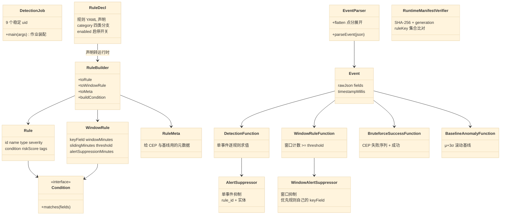
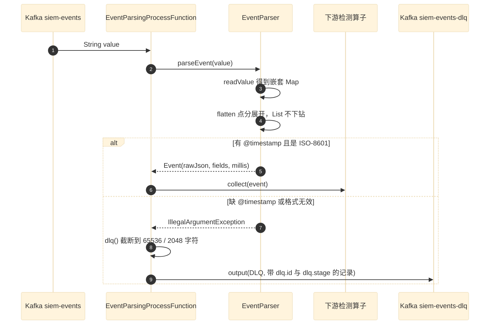
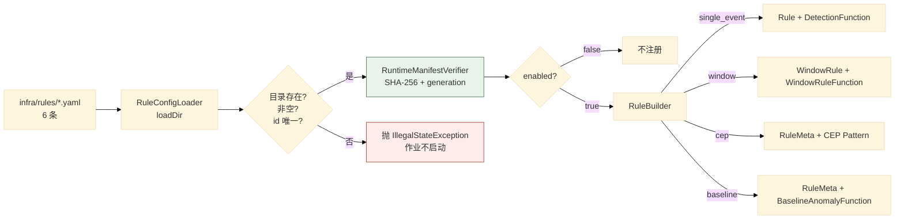
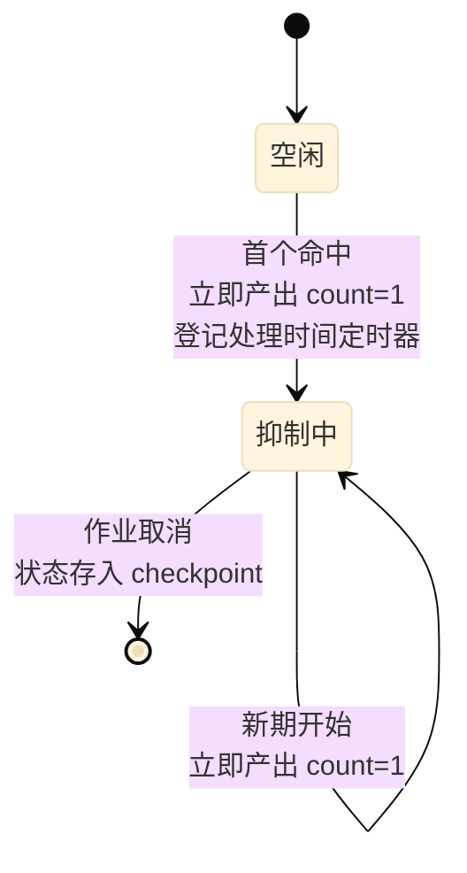
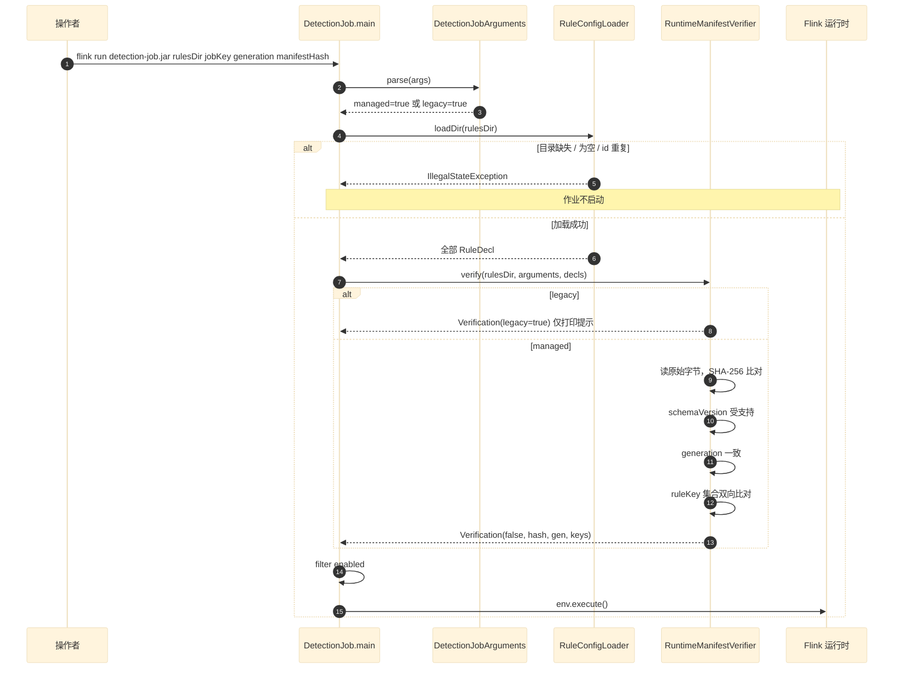
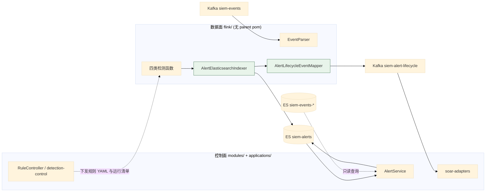

# 02 数据面：接入、缓冲与 Flink 检测引擎

> **文档类型**：子系统深挖（代码级核验，非设计提案）
> **分析对象**：`D:\Project\SIEM` 的数据面——`flink/`（独立 Maven 工程）+ `infra/logstash/` + `infra/kafka/` + `infra/rules/`
> **取证范围**：`flink/src/main/java/com/siem/` 30 个 Java 文件（2606 行）+ `infra/rules/*.yaml` 6 条规则
> **取证方式**：源码直读 + grep 统计；每个关键论断附 `file:line` 锚点
> **结论以当前代码为准**（分支 `add_frame` @ `36b967f`）
> **文档集**：00–06 共 7 篇，见 [`README.md`](README.md)

---

## 为什么数据面独立成篇

**一篇一篇按子系统拆，这一篇的边界由三条代码事实决定**：

1. **独立构建单元**：`flink/pom.xml` **没有 `<parent>`**，不并入根 reactor。`CLAUDE.md` §常用命令明确要求 `./mvnw -f flink/pom.xml ...` 单独构建。
2. **独立进程**：`com.siem.DetectionJob` 是 Flink 作业主类，跑在 Flink 集群，不是 Spring 容器。
3. **零代码依赖**：`flink/` 不 import 任何 `com.xscsiem.hsiem_platform.*` 类——两侧**只通过 Kafka topic 与 ES 索引耦合**。

> **与直觉不同的一点**：根 `pom.xml` 的 `<modules>` 里**列了 `flink`**，但 `flink/pom.xml` 自己**没有 parent**。所以它是「被聚合但不继承」——Maven 能一起构建，但版本、插件、依赖**全部由 `flink/pom.xml` 自己 pin**。这是刻意的隔离手法：数据面升级 Flink 版本时不会牵动控制面。

---

## 1. 关键类与聚合根



**规模实测**（`wc -l`）：

| 文件 | 行数 | 角色 |
| --- | --- | --- |
| `DetectionJob.java` | 482 | 作业装配（唯一 `main`） |
| `RuntimeManifestVerifier.java` | 159 | 运行清单校验 |
| `WindowRule.java` | 156 | 窗口规则模型（5 个重载构造） |
| `BaselineAnomalyFunction.java` | 154 | 基线异常检测 |
| `WindowAlertSuppressor.java` | 129 | 窗口告警抑制 |
| `DetectionJobArguments.java` | 123 | 启动参数解析 |
| `BruteforceSuccessFunction.java` | 108 | CEP 攻击链 |
| `config/RuleDecl.java` | 102 | YAML 声明模型 |
| `AlertSuppressor.java` | 100 | 单事件告警抑制 |
| `AlertLifecycleEventMapper.java` | 99 | 生命周期契约映射 |
| `config/RuleBuilder.java` | 89 | 声明 → 运行时 |
| `Rule.java` | 86 | 单事件规则模型 |
| `RuleRegistry.java` | 78 | 规则注册表 |
| `WindowRuleFunction.java` | 77 | 窗口求值 |
| `config/RuntimeTuning.java` | 75 | 运行参数 |
| `EventParsingProcessFunction.java` | 74 | 解析 + DLQ |
| `DetectionFunction.java` | 72 | 单事件求值 |
| `EventParser.java` | 57 | JSON → 扁平字段 |
| `Event.java` | 48 | 流元素 POJO |
| `Ocsf.java` | 43 | OCSF 输出侧视图 |
| 其余 10 个小类 | 13–27 各，**但有两个例外** | 条件实现 + 声明嵌套类 + **`AlertElasticsearchIndexer.java`（70 行）与 `RuleConfigLoader.java`（62 行）** |

---

## 2. 事件模型与解析

### 2.1 关键论断

**论断 1：点分字段被显式展开为扁平 key——因为 Logstash 输出的是嵌套对象。**

```java
// EventParser.java:9-14（类注释）
/**
 * 事件解析:将 Kafka 中的事件 JSON 解析为扁平点分字段 Map,并提取事件时间戳。
 *
 * Logstash json codec 输出的点分字段(如 source.ip)可能是嵌套对象
 * ({"source":{"ip":...}}),统一展开为扁平 key (source.ip),便于规则按字段名匹配。
 */
```

展开逻辑是递归的，且**只在遇到 `Map` 时下钻**：

```java
// EventParser.java:46-56
private static void flatten(String prefix, Map<String, Object> map, Map<String, Object> out) {
    for (Map.Entry<String, Object> entry : map.entrySet()) {
        String key = prefix.isEmpty() ? entry.getKey() : prefix + "." + entry.getKey();
        Object value = entry.getValue();
        if (value instanceof Map) {
            flatten(key, (Map<String, Object>) value, out);
        } else {
            out.put(key, value); // List 等复杂类型原样保留
        }
    }
}
```

**注意 `List` 不下钻**（`:53` 注释明说「List 等复杂类型原样保留」）。这是有意的：`related_events`、`tags` 这类数组要保持结构。

**论断 2：解析失败有两种原因，都抛 `IllegalArgumentException`，且消息含原始值。**

```java
// EventParser.java:35-44
private static long timestampMillis(Object ts) {
    if (ts == null) {
        throw new IllegalArgumentException("事件缺少 @timestamp");
    }
    try {
        return Instant.parse(ts.toString()).toEpochMilli();
    } catch (Exception e) {
        throw new IllegalArgumentException("事件 @timestamp 不是 ISO-8601 时间: " + ts, e);
    }
}
```

**两种失败**：缺 `@timestamp`、或 `@timestamp` 不是 ISO-8601。**时间戳必须可解析才能进主链**——这是事件时间语义的前提。

**论断 3：毒消息不进 DLQ 就重启作业，而是转成可观测记录。**

```java
// EventParsingProcessFunction.java:14（类注释）
/** Converts poison input records into an observable Kafka DLQ instead of restarting the Flink job. */
```

```java
// EventParsingProcessFunction.java:22-30
@Override
public void processElement(String value, Context context, Collector<Event> output) {
    ParseOutcome outcome = parse(value);
    if (outcome.event() != null) {
        output.collect(outcome.event());
    } else {
        context.output(DLQ, outcome.dlqRecord());
    }
}
```

**论断 4：DLQ 记录自身有界且有身份——两个上限 + 一个内容哈希。**

```java
// EventParsingProcessFunction.java:19-20
private static final int MAX_ORIGINAL_CHARS = 65_536;
private static final int MAX_ERROR_CHARS = 2_048;
```

```java
// EventParsingProcessFunction.java:46-53
Map<String, Object> record = new LinkedHashMap<>();
record.put("@timestamp", Instant.now().toString());
record.put("dlq.id", sha256(original == null ? "<null>" : original));
record.put("dlq.stage", "flink.event-parser");
record.put("dlq.error_type", error.getClass().getName());
record.put("dlq.error_message", errorMessage);
record.put("event.original", safeOriginal);
record.put("event.original_truncated", truncated);
```

**三个设计点值得单独看**：

| 点 | 说明 |
| --- | --- |
| `dlq.id = sha256(原始串)` | **同一条坏消息重复投递产生同一个 id** → DLQ 消费方可以据此去重 |
| `dlq.stage = "flink.event-parser"` | 标明失败发生在**哪一段**——DLQ 可被多个阶段共用 |
| `event.original_truncated` | **截断是显式标记的**，不是静默丢数据（对比：Flink 侧截断有标记） |

**论断 5：`OutputTag` 是静态常量，uid 由作业侧绑定。**

```java
// EventParsingProcessFunction.java:17
public static final OutputTag<String> DLQ = new OutputTag<String>("siem-event-parser-dlq") { };
```

`DetectionJob` 用 `.uid("event-parser-dlq-kafka")` 绑定到 Kafka sink（`DetectionJob.java:167`）。

### 2.2 时序图



### 2.3 源码落点行

| 行 | 内容 |
| --- | --- |
| `EventParser.java:23-28` | `parse(json)` → 扁平 Map |
| `EventParser.java:30-33` | `parseEvent(json)` → `Event` |
| `EventParser.java:46-56` | `flatten` 递归展开 |
| `EventParsingProcessFunction.java:17` | `OutputTag DLQ` |
| `EventParsingProcessFunction.java:28` | `context.output(DLQ, ...)` |
| `EventParsingProcessFunction.java:48` | `dlq.id = sha256(original)` |

---

## 3. 规则模型：声明 → 运行时

### 3.1 关键论断

**论断 1：规则声明的单一来源是 `infra/rules/*.yaml`，共 6 条。**

实测 `ls infra/rules/`：`rule-auth-rate-anomaly-001`、`rule-common-user-bruteforce-001`、`rule-root-login-failure-001`、`rule-ssh-auth-failure-001`、`rule-ssh-brute-force-001`、`rule-ssh-bruteforce-success-001`。

`RuleDecl` 类注释写明定位：*「检测规则声明(infra/rules/*.yaml,检测即代码的单一来源)」*（`config/RuleDecl.java:9`）。

**论断 2：`category` 决定走哪条分支，四类互斥。**

```java
// config/RuleDecl.java:11-17（类注释）
 * 四种类型(type):
 * - single_event:单事件条件匹配(condition)→ 复用 Rule/DetectionFunction
 * - window:窗口计数(keyField 分组,windowMinutes 窗口内 condition 命中数 ≥ threshold)→ 复用 WindowRule
 * - cep:序列关联(cep.pattern)→ 构建 Flink CEP Pattern
 * - baseline:统计基线异常(baseline 参数)→ 复用 BaselineAnomalyFunction
 *
 * enabled=false 时 Flink 启动不注册该规则(启停 = 改 enabled → deploy → 重启 job)。
```

**注意 `category` 与 `type` 是两个不同字段**：

| 字段 | 作用 | 示例值 |
| --- | --- | --- |
| `category` | **分支依据**（走哪个算子） | `window` |
| `type` | **告警的 `alert.type`** | `ssh_brute_force` |

`RuleDecl.java:25-27` 的注释分得很清楚：`category` 是「规则类别(分支依据)」，`type` 是「告警 type(如 ssh_authentication_failure / ssh_bruteforce_success),进 alert.type」。

**论断 3：启停是「改 YAML + 重新部署 + 重启 job」——不是运行时热开关。**

`RuleDecl.java:17` 写明：*「启停 = 改 enabled → deploy → 重启 job」*。`RuleConfigLoader.loadEnabled` 只返回 `enabled=true` 的：

```java
// config/RuleConfigLoader.java:58-61
/** 仅返回 enabled=true 的规则(启动注册依据)。 */
public List<RuleDecl> loadEnabled(String dir) {
    return loadDir(dir).stream().filter(d -> d.enabled).toList();
}
```

> **但 `DetectionJob` 实际用的是 `loadDir` 再自己 filter**（`DetectionJob.java:119,122`），`loadEnabled` 未被主流程调用——**这是「提供了但没用上」的 API**，属于可清理项，记录在 §9 待核实。

**论断 4：加载期校验很硬——目录不存在、目录为空、id 为空、id 重复都会抛异常。**

```java
// config/RuleConfigLoader.java:27-56（节选）
public List<RuleDecl> loadDir(String dir) {
    Path d = Path.of(dir);
    if (!Files.isDirectory(d)) {
        throw new IllegalStateException("规则目录不存在: " + dir);
    }
    ...
                if (declaration == null || declaration.id == null || declaration.id.isBlank()) {
                    throw new IllegalStateException("规则 ID 为空: " + f.getName());
                }
                if (!ids.add(declaration.id)) {
                    throw new IllegalStateException("规则 ID 重复: " + declaration.id);
                }
    ...
    if (decls.isEmpty()) {
        throw new IllegalStateException("规则目录为空: " + dir);
    }
    return decls;
}
```

**「目录为空也抛异常」是 fail-fast 的关键一条**：避免作业以「零规则」的静默状态启动——那样会看起来一切正常却完全无检测能力。

文件按**文件名排序**加载（`:35` `Arrays.sort(files, Comparator.comparing(File::getName))`），保证加载顺序确定。

**论断 5：条件声明递归支持嵌套，5 种类型。**

```java
// config/RuleBuilder.java:54-77
/** 条件声明 → Condition 接口实现(递归支持 all/any/not 嵌套)。 */
public static Condition buildCondition(RuleDecl.ConditionSpec spec) {
    if (spec == null) {
        throw new IllegalArgumentException("规则缺少 condition");
    }
    return switch (spec.type) {
        case "field_equals" -> new FieldEqualsCondition(spec.field, spec.value);
        case "field_in" -> { ... new FieldInCondition(spec.field, spec.values.toArray()); }
        case "all" -> new AllCondition(subConditions(spec, "all"));
        case "any" -> new AnyCondition(subConditions(spec, "any"));
        case "not" -> {
            if (spec.conditions == null || spec.conditions.size() != 1) {
                throw new IllegalArgumentException("not 条件需要恰好一个子条件");
            }
            yield new NotCondition(buildCondition(spec.conditions.get(0)));
        }
        default -> throw new IllegalArgumentException("未知条件类型: " + spec.type);
    };
}
```

**`not` 强制恰好一个子条件**（`:70-72`）——多子条件的 `not` 语义有歧义（NOT(a AND b) 还是 NOT(a) AND NOT(b)？），所以直接拒绝。

**论断 6：`window` 规则的三参数是强制的，缺失即抛异常。**

```java
// config/RuleBuilder.java:33-35
if (d.keyField == null || d.windowMinutes == null || d.threshold == null) {
    throw new IllegalArgumentException("window 规则缺少 keyField/windowMinutes/threshold: " + d.id);
}
```

**论断 7：`WindowRule` 的抑制时长默认回退到窗口长度，且有 5 个重载构造。**

```java
// WindowRule.java:84-87
long suppression = alertSuppressionMinutes == null ? windowMinutes : alertSuppressionMinutes;
if (suppression <= 0) {
    throw new IllegalArgumentException("alertSuppressionMinutes 必须 > 0: " + id);
}
```

**「抑制时长缺省 = 窗口长度」是个合理默认**：窗口 5 分钟，抑制也 5 分钟。

**论断 8：`type` 与 `Rule` 的元数据分工——`RuleMeta` 专门服务无法用 `Rule` 表达的分支。**

```java
// RuleMeta.java:6-10（类注释）
/**
 * 规则元数据(告警输出用),由 RuleDecl 构建,
 * 传给 CEP(BruteforceSuccessFunction)与基线(BaselineAnomalyFunction)等
 * 无法直接用 Rule 表达的函数。
 */
```

**这是「模型跟着分支形态走」的例子**：单事件规则需要 `condition`（`Rule` 有），窗口规则需要 `keyField`+`threshold`（`WindowRule` 有），而 CEP 与基线的判定逻辑完全在算子内部（Pattern 与 μ+3σ），所以只需要元数据——于是有了 `RuleMeta`。

### 3.2 声明到运行时的转换图



---

## 4. 四类检测函数

### 4.1 关键论断

**论断 1：单事件规则是「逐条事件 × 逐条规则」的双层循环——没有索引。**

```java
// DetectionFunction.java:27-35
@Override
public void flatMap(Event event, Collector<String> out) throws Exception {
    Map<String, Object> fields = event.getFields();
    for (Rule rule : registry.getRules()) {
        if (rule.getCondition().matches(fields)) {
            out.collect(MAPPER.writeValueAsString(buildAlert(event.getRawJson(), fields, rule)));
        }
    }
}
```

**复杂度是 O(事件数 × 规则数)**，且 `RuleRegistry` 只支持整表替换（`RuleRegistry.java:22` 构造传入）。当前 6 条规则下这不是问题；规则数上千时需要重新设计。记录在 §9。

> **`RuleRegistry` 还有一个硬编码构造**（`RuleRegistry.java:27-73`，3 条 SSH 规则），注释标明「默认(硬编码 3 条,历史测试用;生产走 YAML 加载)」。**生产路径不经过它**——`DetectionJob` 用 `RuleBuilder` 从 `RuleDecl` 构建 `Rule` 列表。

**论断 2：告警结构是「关键字段提升 + 完整事件存字符串」——决策 D。**

```java
// DetectionFunction.java:14-15（类注释）
 * 告警为扁平结构(决策 D):关键事件字段提升到告警顶层,完整事件存为扁平字符串 event.raw。
```

提升的字段是**白名单**（`DetectionFunction.java:53-59`）：

```java
promote(alert, event, "log.source_id");
promote(alert, event, "log.source_name");
promote(alert, event, "source.ip");
promote(alert, event, "user.name");
promote(alert, event, "host.name");
promote(alert, event, "event.action");
promote(alert, event, "event.category");
alert.put("event.raw", rawJson);
alert.put("event_count", 1);
```

**为什么这样设计**：ES 里查告警时不必 nested 查询就能按 `source.ip` 过滤（顶层字段可索引），同时 `event.raw` 保留了完整原始上下文。

**论断 3：`alert.id` 是随机 UUID——它只是展示标识，不参与身份判定。**

```java
// DetectionFunction.java:43
alert.put("alert.id", UUID.randomUUID().toString());
```

四处生成告警的函数都这样写（`DetectionFunction.java:43`、`WindowRuleFunction.java:50`、`BruteforceSuccessFunction.java:78`、`BaselineAnomalyFunction.java:135`）。**真正的身份是 `DetectionJob.alertId` 算出的 sha1**（见 01 篇 §2.1 论断 3）。这个「双 id」设计在 `AlertLifecycleEventMapper.java:25-27` 有显式注释警告。

**论断 4：窗口规则的实体是显式写入的，且为确定性 ID 提供了输入。**

```java
// WindowRuleFunction.java:57-63
// 窗口规则的分组字段可能是 source.ip/host.name/自定义字段,
// 显式记录实体供下游去重和 ES 确定性 _id 使用。
alert.put("alert.entity", key);
...
alert.put(rule.getKeyField(), key);
```

**这是关键的一处**：窗口规则的 `keyField` 可以是任意字段（`source.ip` / `host.name` / 自定义）。`alertId` 的实体优先级链第一项就是 `alert.entity`——所以窗口告警**无论 keyField 是什么，都能得到稳定身份**。

**反过来看单事件规则**：`DetectionFunction` **不写 `alert.entity`**，只 promote `source.ip` / `user.name`。所以单事件告警的身份回退到 `source.ip` → `user.name`。

**两个分支的实体解析路径不同但收敛到同一套 `alertId` 逻辑**——这是 §7 不变式 3 能成立的原因。

**论断 5：窗口的 `event_count` 是这个规则**实际命中**的数，不是窗口内事件总数。**

```java
// WindowRuleFunction.java:33-41
List<Map<String, Object>> matched = new ArrayList<>();
for (Event e : elements) {
    if (rule.getCondition().matches(e.getFields())) {
        matched.add(e.getFields());
    }
}
if (matched.size() >= rule.getThreshold()) {
    out.collect(MAPPER.writeValueAsString(buildAlert(key, matched, context.window().getEnd())));
}
```

**`matched.size()` 而非 `elements` 的 size**——即 `condition` 不匹配的事件**不计数**。所以一条窗口规则可以复用同一个 `keyBy` 分区而只数自己关心的动作。

**论断 6：`related_events` 存的是完整字段快照列表，无上限。**

```java
// WindowRuleFunction.java:72-73
alert.put("event_count", matched.size());
alert.put("related_events", matched);
```

**这里没有截断**。窗口 5 分钟 + 阈值 5 + 攻击者高频重试时，`related_events` 可能很大。这是**有意的取舍**（保留完整攻击叙事），但**没有上限**是一个待核实的风险点，见 §9。

**论断 7：CEP 只认「失败序列 + 后续成功」，成功事件为空的匹配直接丢弃。**

```java
// BruteforceSuccessFunction.java:64-71
@Override
public void processMatch(Map<String, List<Event>> match, Context ctx, Collector<String> out) throws Exception {
    List<Event> failures = match.getOrDefault(failureStep, List.of());
    List<Event> successes = match.getOrDefault(successStep, List.of());
    if (successes.isEmpty()) {
        return;
    }
    Event success = successes.get(0);
```

**防御性写法**：`getOrDefault` 而非 `get`，且显式判空。步骤名来自规则声明（`failureStep` / `successStep`），有默认值 `"failures"` / `"success"`（`:38`），空串则拒绝（`:59`）。

**论断 8：CEP 告警的 `@timestamp` 用成功事件的时间，`event_count` = 失败数 + 1。**

```java
// BruteforceSuccessFunction.java:74,95-96
alert.put("@timestamp", Instant.ofEpochMilli(success.getTimestampMillis()).toString());
...
alert.put("event.action", "authentication_success");
alert.put("event_count", failures.size() + 1);
```

**`+1` 是把成功事件自己算进去**——语义是「这个攻击链一共发生了 N 个事件」。注意 `event.action` 被**硬编码为 `authentication_success`**（覆写了成功事件的原始值）——告警语义是「得逞」，不是「成功登录」。

**论断 9：基线用 `μ + σ×multiplier`，且要求基线样本数达标。**

```java
// BaselineAnomalyFunction.java:110-118
static boolean isAnomaly(List<Double> baseline, double current, int minBaselineHours,
                         double sigmaMultiplier) {
    if (baseline == null || baseline.size() < minBaselineHours) {
        return false;
    }
    double[] ms = meanSigma(baseline);
    double threshold = ms[0] + sigmaMultiplier * ms[1];
    return threshold > 0 && current > threshold;
}
```

**三个边界条件写得很实**：

| 条件 | 作用 |
| --- | --- |
| `baseline.size() < minBaselineHours` | **基线不足不判异常**——冷启动期不误报 |
| `threshold > 0` | **阈值为 0 或负时永不告警**——否则「0 次也是异常」 |
| `current > threshold` | 严格大于，等于不算 |

**论断 10：基线状态是有界的 `LinkedList`，超出 `baselineHours` 就从头尾淘汰。**

```java
// BaselineAnomalyFunction.java:98-102
baseline.add(current);
while (baseline.size() > baselineHours) {
    baseline.removeFirst();
}
baselineState.update(baseline);
```

**注意顺序**：先判定异常，**再**把当前值加入基线（`:92` 判定在 `:98` 之前）。所以**当前窗口不参与自己的基线**——否则异常值会抬高自己的阈值。

**论断 11：基线的统计量用总体方差（除以 N），不是样本方差（除以 N-1）。**

```java
// BaselineAnomalyFunction.java:121-126
static double[] meanSigma(List<Double> values) {
    double mean = values.stream().mapToDouble(Double::doubleValue).average().orElse(0);
    double variance = values.stream()
            .mapToDouble(v -> (v - mean) * (v - mean)).average().orElse(0);
    return new double[]{mean, Math.sqrt(variance)};
}
```

`.average()` 是除以元素个数——**总体方差**。样本小时总体方差偏小（更敏感）。这是明确的选择，不是笔误。

**论断 12：基线告警带三个可解释字段——这比只报「异常」有用得多。**

```java
// BaselineAnomalyFunction.java:148-150
alert.put("anomaly.baseline_mean", Math.round(mean * 100.0) / 100.0);
alert.put("anomaly.baseline_sigma", Math.round(sigma * 100.0) / 100.0);
alert.put("anomaly.threshold", Math.round(threshold * 100.0) / 100.0);
```

**分析员能直接看到「当前 87 次 vs 基线 μ=6.2 σ=2.1 阈值=12.5」**，而不是只看到一个「异常」标签。

### 4.2 四类分支的求值对比

```mermaid
---
config:
  theme: base
  themeVariables:
    fontFamily: YaHei
---
flowchart TB
    subgraph SINGLE["single_event"]
        S1["逐条事件 × 逐条规则"]
        S2["condition.matches(fields)"]
        S3["event_count = 1<br/>无 alert.entity"]
    end
    subgraph WINDOW["window"]
        W1["keyBy(keyField) 开窗"]
        W2["窗口内过滤出 matched"]
        W3{"matched.size() >= threshold?"}
        W4["event_count = matched.size()<br/>alert.entity = key<br/>related_events = matched"]
    end
    subgraph CEP["cep"]
        C1["Flink CEP Pattern 匹配"]
        C2{"successes 非空?"}
        C3["event_count = failures.size() + 1<br/>event.action 硬编码 success"]
    end
    subgraph BASE["baseline"]
        B1["keyBy(keyField) 小时窗计数"]
        B2{"基线够? 且 threshold>0?<br/>且 current > threshold?"}
        B3["带 anomaly.mean/sigma/threshold"]
    end

    S1 --> S2 --> S3
    W1 --> W2 --> W3 -->|是| W4
    C1 --> C2 -->|是| C3
    B1 --> B2 -->|是| B3
```



---

## 5. 抑制层：两个抑制器，两套语义

### 5.1 关键论断

**论断 1：两个抑制器都用「处理时间」，不是事件时间——且理由是显式写下的。**

```java
// AlertSuppressor.java:18-19（类注释）
 * 实现:keyBy(rule_id + 实体) + 处理时间(墙钟)窗口。用处理时间而非事件时间,
 * 语义是"1 小时内同一实体同一规则不要刷屏",与事件时间窗口(暴力破解)区分。
```

```java
// WindowAlertSuppressor.java:18-19（类注释）
 * 窗口本身仍使用事件时间,这里的抑制使用处理时间表达「告警通知不要刷屏」:
```

**这是本项目里一处清晰的语义分层**：

| 层 | 时间语义 | 目的 |
| --- | --- | --- |
| 窗口/CEP 检测 | **事件时间** | 判定「这段时间内发生了 N 次」 |
| 告警抑制 | **处理时间** | 判定「不要再刷屏」 |

**混用是刻意的**：事件时间适合业务判定，处理时间适合运维节奏。若抑制也用事件时间，历史数据回放时会「按历史时间抑制」，反而刷屏。

**论断 2：抑制模式的骨架一致——首个立即出、期内只累加、期末出最终值。**

```java
// AlertSuppressor.java:21-25（类注释）
 * 行为:
 * - 首个命中:立即产出告警(deduplicated_count=1),登记窗口结束定时器,缓存首个告警 JSON;
 * - 窗口内后续命中:仅累加状态计数,不产出;
 * - 窗口结束(onTimer):产出带最终 count 的告警(首个告警 JSON 的 @timestamp 不变 → _id 稳定,
 *   ES upsert 覆盖更新),随后清空状态。
```

**「首个立即出 + 期末更新」是关键手法**：分析员**立刻**看到告警（不必等窗口结束），而最终计数又通过**同一个 `_id`** 覆盖更新。**延迟与完整性兼得。**

**论断 3：`_id` 稳定的机制是「复用首个告警的 JSON」。**

```java
// AlertSuppressor.java:74
cur.firstAlertJson = alert;   // 首个告警(含首事件 @timestamp,保证 _id 稳定)
```

```java
// AlertSuppressor.java:88-92
if (cur != null && cur.firstAlertJson != null) {
    // 产出最终 count(同一 _id,ES upsert 更新);随后清状态
    out.collect(updateCount(cur.firstAlertJson, cur.count));
}
state.clear();
```

**`alertId = sha1(rule_id | entity | @timestamp)`**，而 `firstAlertJson` 保留了**首个事件的 `@timestamp`**——所以三次输出（首个、期末、以及可能的重启后）都算出同一个 `_id`。

**论断 4：两个抑制器的 `suppressionKey` 不同——窗口版优先用规则自己的 keyField。**

单事件版：

```java
// AlertSuppressor.java:45-54
/** 抑制键 = rule_id + 实体(source.ip 优先,其次 user.name)。供 keyBy 使用。 */
public static String suppressionKey(String alertJson) throws Exception {
    ...
    Object ip = alert.get("source.ip");
    Object user = alert.get("user.name");
    String entity = ip != null ? String.valueOf(ip)
            : (user != null ? String.valueOf(user) : "unknown");
    return ruleId + "|" + entity;
}
```

窗口版：

```java
// WindowAlertSuppressor.java:50-62
/** 窗口规则优先使用自己的 keyField,否则回退到 source.ip/user.name。 */
public static String suppressionKey(String alertJson, String preferredEntityField) throws Exception {
    Map<String, Object> alert = MAPPER.readValue(alertJson, Map.class);
    String ruleId = String.valueOf(alert.getOrDefault("alert.rule_id", "unknown"));
    Object entity = preferredEntityField == null ? null : alert.get(preferredEntityField);
    if (entity == null) {
        entity = alert.get("source.ip");
    }
    if (entity == null) {
        entity = alert.get("user.name");
    }
    return ruleId + "|" + (entity == null ? "unknown" : entity);
}
```

**三级回退：规则自己的 keyField → source.ip → user.name → "unknown"。** 而单事件版是两级。原因是窗口规则的实体由 `alert.entity` + `alert.put(keyField, key)` 显式写入（见 §4.1 论断 4），所以按 keyField 能取到。

**论断 5：窗口抑制器多一个兜底——定时器可能未及时触发。**

```java
// WindowAlertSuppressor.java:75-79
if (current == null || now >= current.suppressUntil) {
    if (current != null) {
        // 定时器可能尚未在本条记录前触发,先完成旧抑制期的最终更新。
        out.collect(mergeLatest(current));
    }
```

**这是对 Flink 定时器语义的正确处理**：处理时间定时器在 watermark/时间推进时触发，**不保证在下一条记录之前**。若直接开始新抑制期而不先结算旧的，**旧期的最终计数就丢了**。代码显式补了这一步。

**论断 6：窗口抑制器的 `mergeLatest` 取 `event_count` 的最大值，并保留 `related_events`。**

```java
// WindowAlertSuppressor.java:105-118
private static String mergeLatest(SuppressState state) throws Exception {
    Map<String, Object> first = MAPPER.readValue(state.firstAlertJson, Map.class);
    Map<String, Object> latest = MAPPER.readValue(state.latestAlertJson, Map.class);

    int firstCount = intValue(first.get("event_count"));
    int latestCount = intValue(latest.get("event_count"));
    first.put("event_count", Math.max(firstCount, latestCount));
    Object related = latest.get("related_events");
    if (related instanceof List<?>) {
        first.put("related_events", related);
    }
    first.put("alert.deduplicated_count", state.windowCount);
    return MAPPER.writeValueAsString(first);
}
```

**三处细节**：

| 细节 | 原因 |
| --- | --- |
| `Math.max` 而非相加 | `event_count` 是**窗口内**命中数，不是累计；取最大窗口更合理 |
| `related_events` 用 `latest` 覆盖 | 保留**最新**窗口的事件明细 |
| `alert.deduplicated_count = windowCount` | 抑制期**收敛了几个窗口**——与 `event_count` 是两个不同量 |

**这是 `event_count` 与 `deduplicated_count` 的语义分工**：前者「一个窗口里发生了几次」，后者「抑制期合并了几个窗口」。

**论断 7：`WindowAlertSuppressor` 拒绝非正抑制时长，`AlertSuppressor` 不校验。**

```java
// WindowAlertSuppressor.java:31-36
public WindowAlertSuppressor(Duration suppressionWindow) {
    if (suppressionWindow == null || suppressionWindow.isZero() || suppressionWindow.isNegative()) {
        throw new IllegalArgumentException("窗口告警抑制时长必须 > 0");
    }
    this.suppressionMillis = suppressionWindow.toMillis();
}
```

**两者校验强度不一致**（`AlertSuppressor.java:34-36` 直接赋值 `window.toMillis()`）。这是可改进点，见 §9。

**论断 8：抑制状态由 Flink checkpoint 托管——重启不丢。**

```java
// WindowAlertSuppressor.java:22（类注释）
 * 状态由 Flink checkpoint 管理,作业重启后不会因为算子内存丢失而重复建档。
```

两者都用 `ValueState`（`AlertSuppressor.java:58-60`、`WindowAlertSuppressor.java:66-67`），不是普通字段。

**论断 9：单事件抑制时长在两处校验——构造器不校验，作业装配侧校验。**

```java
// DetectionJob.java:186,192
long singleSuppressionMinutes = singleEventSuppressionMinutes(singleDecls);
...
.process(new AlertSuppressor(Duration.ofMinutes(singleSuppressionMinutes)))
```

```java
// DetectionJob.java:317-329
static long singleEventSuppressionMinutes(List<RuleDecl> declarations) {
    long selected = 60L;
    boolean explicit = false;
    for (RuleDecl declaration : declarations) {
        if (declaration.alertSuppressionMinutes == null) {
            continue;
        }
        long value = declaration.alertSuppressionMinutes;
        if (value <= 0) {
            throw new IllegalArgumentException("single_event alertSuppressionMinutes 必须 > 0");
        }
        if (explicit && selected != value) {
            throw new IllegalArgumentException("同一 Job Group 的 single_event 抑制时长必须一致");
        }
        ...
```

**三个事实**：

| 事实 | 值 | 锚点 |
| --- | --- | --- |
| 单事件抑制默认时长 | **60 分钟** | `DetectionJob.java:318` |
| 显式值必须 > 0 | 否则抛异常 | `:325-327` |
| **同一 Job Group 内必须一致** | 否则抛异常 | `:328-330` |

> **「同一 Job Group 抑制时长必须一致」是本篇最值得注意的一条约束**。原因是：**所有单事件规则共用同一个 `single-event-detection` 算子与同一个 `alert-suppression` 算子**（§3.1 论断 1 的算子表）。既然共用一个抑制器，抑制时长就只能有一个值——**规则级的 `alertSuppressionMinutes` 在此不是「各自生效」，而是「必须投票出一致值」**。
>
> 这与**窗口规则形成鲜明对比**：窗口抑制是「每规则一个算子」（`window-alert-suppression-<ruleId>`），所以每条窗口规则可以有自己的抑制时长。**同样的 YAML 字段 `alertSuppressionMinutes`，在单事件与窗口两个分支下的语义强度不同**——单事件是「全局一致约束」，窗口是「逐规则独立」。

**论断 10：CEP 的 Pattern 是逐 step 折叠构建的，且 `times` 的三种组合分别处理。**

```java
// DetectionJob.java:416-446
private static Pattern<Event, ?> buildCepPattern(RuleDecl.CepDecl cep) {
    if (cep == null || cep.pattern == null || cep.pattern.isEmpty()) {
        throw new IllegalArgumentException("cep 规则缺少 pattern");
    }
    Pattern<Event, ?> p = null;
    for (RuleDecl.CepStep step : cep.pattern) {
        SimpleCondition<Event> cond = SimpleCondition.of(
                (FilterFunction<Event>) e ->
                        RuleBuilder.buildCondition(step.condition).matches(e.getFields()));
        if ("begin".equals(step.type)) {
            Pattern<Event, ?> begin = Pattern.<Event>begin(step.name).where(cond);
            if (step.timesMax != null) {
                int min = step.timesMin == null ? step.timesMax : step.timesMin;
                begin = begin.times(min, step.timesMax);
            } else if (step.timesMin != null) {
                begin = begin.times(step.timesMin);
            }
            p = begin;
        } else if ("next".equals(step.type)) {
            p = p.next(step.name).where(cond);
        } else if ("followedBy".equals(step.type)) {
            p = p.followedBy(step.name).where(cond);
        } else {
            throw new IllegalArgumentException("未知 CEP 步骤类型: " + step.type);
        }
    }
    if (p != null && cep.withinMinutes != null) {
        p = p.within(Duration.ofMinutes(cep.withinMinutes));
    }
    return p;
}
```

**四点值得注意**：

| 点 | 说明 |
| --- | --- |
| **`times` 只在 `begin` 步生效** | `next` / `followedBy` 分支**完全不读 `timesMin`/`timesMax`**——即重复次数**只能写在首步** |
| `timesMin` 缺省回退到 `timesMax` | `:428` `int min = step.timesMin == null ? step.timesMax : step.timesMin` |
| **条件在每个 step 内独立构建** | 复用 `RuleBuilder.buildCondition`，所以 CEP 步骤条件支持全部 5 种条件类型（含嵌套 `all`/`any`/`not`） |
| **`within` 在循环外统一应用** | 整个序列一个时间上限，不是每步一个 |

**对照实际规则声明**：`rule-ssh-bruteforce-success-001.yaml:21-28` 正是「首步 `begin` 带 `timesMin: 5` / `timesMax: 100`，次步 `next` 无 times」——**与代码的约束一致**。

### 5.2 抑制状态机



> **注意最后一条自环**：`WindowAlertSuppressor.java:75-79` 的分支——当新记录到达时发现 `now >= current.suppressUntil`，**先 `out.collect(mergeLatest(current))` 结算旧期**，再开新期。这是两个抑制器里唯一的一处差异逻辑。

---

## 6. 告警契约与 OCSF 输出视图

### 6.1 关键论断

**论断 1：告警字段是 ECS 存储 + OCSF 视图并存。**

```java
// Ocsf.java:5-9（类注释）
/**
 * OCSF 可移植视图(Phase 3.2):在 ECS 存储的告警上附加 OCSF 核心字段,
 * 使规则/看板未来换平台或对接 AWS Security Lake 时不必重写。
 * 存储仍以 ECS 为准,此为输出侧补充视图;完整映射见 docs/design/ocsf-mapping.md。
 */
```

**「存储以 ECS 为准，OCSF 是附加视图」**——一条告警里同时有 `source.ip`（ECS）与 `ocsf.src_endpoint.ip`（OCSF）。

**论断 2：OCSF 视图只有四个字段，且 `class_uid` 是常量。**

```java
// Ocsf.java:15-16, 33-42
public static final int CLASS_AUTHENTICATION = 3002;
...
public static Map<String, Object> applyAuthView(Map<String, Object> alert, String severity) {
    alert.put("ocsf.class_uid", CLASS_AUTHENTICATION);
    alert.put("ocsf.severity_id", severityId(severity));
    Object ip = alert.get("source.ip");
    if (ip != null) {
        alert.put("ocsf.src_endpoint.ip", ip);
    }
    return alert;
}
```

`3002` 是 OCSF 的 Authentication 事件类。**`ocsf.src_endpoint.ip` 只在 `source.ip` 存在时才写**（`:37-40`）——不写 null。

**论断 3：severity 映射是五档，未知值回落到 0（Unknown）而非抛异常。**

```java
// Ocsf.java:19-31
public static int severityId(String severity) {
    if (severity == null) {
        return 0;
    }
    switch (severity.toLowerCase()) {
        case "info": return 1;
        case "low": return 2;
        case "medium": return 3;
        case "high": return 4;
        case "critical": return 5;
        default: return 0;
    }
}
```

**输入做了 `toLowerCase()`**，所以 `"HIGH"` 与 `"high"` 等价。**对照 `AlertLifecycleEventMapper` 侧**：那里的 `severity` 是直接透传原值（`AlertLifecycleEventMapper.java:32`），不做归一——**两处对 severity 的处理严格度不同**，见 §9。

**论断 4：四类告警共享同一个字段骨架，差异只在分支特有字段。**

| 字段 | single | window | cep | baseline |
| --- | --- | --- | --- | --- |
| `@timestamp` | 事件时间 | **窗口结束时间** | **成功事件时间** | **窗口结束时间** |
| `alert.id` | UUID | UUID | UUID | UUID |
| `alert.rule_id` / `rule_name` / `type` / `severity` | ✓ | ✓ | ✓ | ✓ |
| `alert.risk_score` | ✓ | ✓ | ✓ | ✓ |
| `rule.tags` / `status` / `version` | ✓ | ✓ | ✓ | ✓ |
| `alert.status` = `"open"` | ✓ | ✓ | ✓ | ✓ |
| `alert.entity` | — | **✓ = key** | — | — |
| `event_count` | **1** | 命中数 | 失败数+1 | 命中数 |
| `related_events` | — | ✓ | ✓ | — |
| `event.raw` | ✓ | — | — | — |
| 分支特有 | — | — | `event.action` 硬编码 | `anomaly.*` 三字段 |
| `ocsf.*` | ✓ | ✓ | ✓ | ✓ |

> **`@timestamp` 的取值因分支而异**是本表最该注意的一点：单事件用**事件自身**时间，窗口与基线用**窗口结束**时间，CEP 用**成功事件**时间。这直接影响确定性 `alertId` 的输入。

### 6.2 字段来源锚点

| 分支 | 构造方法 | `@timestamp` 来源 |
| --- | --- | --- |
| single | `DetectionFunction.java:37-64` | `event.get("@timestamp")`（`:39`） |
| window | `WindowRuleFunction.java:44-76` | `Instant.ofEpochMilli(windowEndMillis)`（`:46`） |
| cep | `BruteforceSuccessFunction.java:73-106` | `success.getTimestampMillis()`（`:74`） |
| baseline | `BaselineAnomalyFunction.java:128-153` | `Instant.ofEpochMilli(windowEnd)`（`:131`） |

---

## 7. 运行参数与运行清单校验

### 7.1 关键论断

**论断 1：所有运行参数都有「默认值 + 环境变量/system property 双层覆盖」。**

```java
// config/RuntimeTuning.java:16-18
public static RuntimeTuning defaults() {
    return new RuntimeTuning(30_000, 10 * 60_000, 10_000, 5, 250, 3, 500, 500);
}
```

| 序号 | 字段 | 默认 | 环境变量 |
| --- | --- | --- | --- |
| 1 | `checkpointIntervalMs` | 30 000（30s） | `SIEM_FLINK_CHECKPOINT_INTERVAL_MS` |
| 2 | `checkpointTimeoutMs` | 600 000（10min） | `SIEM_FLINK_CHECKPOINT_TIMEOUT_MS` |
| 3 | `minPauseBetweenCheckpointsMs` | 10 000（10s） | `SIEM_FLINK_CHECKPOINT_MIN_PAUSE_MS` |
| 4 | `tolerableCheckpointFailures` | 5 | `SIEM_FLINK_CHECKPOINT_TOLERABLE_FAILURES` |
| 5 | `esBatchSize` | 250 | `SIEM_FLINK_ES_BATCH_SIZE` |
| 6 | `esMaxInFlightRequests` | 3 | `SIEM_FLINK_ES_MAX_IN_FLIGHT` |
| 7 | `esMaxBufferedRequests` | 500 | `SIEM_FLINK_ES_MAX_BUFFERED` |
| 8 | `esMaxTimeInBufferMs` | 500 | `SIEM_FLINK_ES_MAX_BUFFER_MS` |

**system property 优先于环境变量**：

```java
// config/RuntimeTuning.java:46-49
private static String value(String key) {
    String property = System.getProperty(key);
    return property == null || property.isBlank() ? System.getenv(key) : property;
}
```

**论断 2：非法值静默回退到默认值，且带最小值门限。**

**这 8 个参数里有 3 个是死参数**：`flink/src/main` 与测试中，**`esBatchSize` / `esMaxInFlightRequests` / `esMaxTimeInBufferMs` 从未被读取**（只出现在 `RuntimeTuning` 自身的定义与解析里）；**只有 `esMaxBufferedRequests` 被消费**——`DetectionJob.java:296` 把它传给 `AsyncDataStream.unorderedWait` 的 capacity。

**所以改那 3 个环境变量不会有任何效果。** README 的开关表把它们描述为「ES 批量大小 / 最大在途 / 缓冲最长时间」，同样未指出这一点。**这再次说明「配置项存在」≠「约束生效」。**

```java
// config/RuntimeTuning.java:67-74
private static long parseLong(String value, long fallback, long minimum) {
    try {
        long parsed = Long.parseLong(value);
        return parsed >= minimum ? parsed : fallback;
    } catch (Exception ignored) {
        return fallback;
    }
}
```

**最小值 `1`**——所以 `0` 或负数都被拒绝并回退。**注意这是静默的**：配错一个环境变量不会报错，作业照常启动用默认值。这是可运维性上的取舍点，见 §9。

**论断 3：重启策略是 `exponential-delay`，且参数写死。**

```java
// DetectionJob.java:94-99
conf.set(RestartStrategyOptions.RESTART_STRATEGY, "exponential-delay");
conf.set(RestartStrategyOptions.RESTART_STRATEGY_EXPONENTIAL_DELAY_INITIAL_BACKOFF, Duration.ofSeconds(5));
conf.set(RestartStrategyOptions.RESTART_STRATEGY_EXPONENTIAL_DELAY_MAX_BACKOFF, Duration.ofMinutes(2));
conf.set(RestartStrategyOptions.RESTART_STRATEGY_EXPONENTIAL_DELAY_BACKOFF_MULTIPLIER, 1.5);
conf.set(RestartStrategyOptions.RESTART_STRATEGY_EXPONENTIAL_DELAY_JITTER_FACTOR, 0.1);
conf.set(RestartStrategyOptions.RESTART_STRATEGY_EXPONENTIAL_DELAY_ATTEMPTS, 10);
```

**5 秒起、2 分钟封顶、1.5 倍增长、0.1 抖动、最多 10 次。** 注释（`:93`）记录了 Flink 2.x 的重要变化：*「旧版 `RestartStrategies` 工厂已移除」*——只能用 `Configuration` 选项配置。

**注意这些值**不走 `RuntimeTuning`**，是硬编码的。** 与上面 8 个可调参数形成对比。

**论断 4：状态目录按 `jobKey` 隔离——managed 作业之间不共享状态。**

```java
// DetectionJob.java:84-88
String checkpointRoot = System.getenv().getOrDefault("SIEM_CHECKPOINT_ROOT", DEFAULT_CHECKPOINT_ROOT);
String savepointRoot = System.getenv().getOrDefault("SIEM_SAVEPOINT_ROOT", DEFAULT_SAVEPOINT_ROOT);
String stateSuffix = arguments.managed() ? "/" + arguments.jobKey() : "";

// checkpoint/savepoint 落到 Docker 挂载的持久卷,按 jobKey 隔离 managed jobs。
Configuration conf = new Configuration();
conf.setString("state.checkpoints.dir", appendPath(checkpointRoot, stateSuffix));
```

**legacy 启动用共享路径**（`stateSuffix = ""`），注释（`:82-83`）说明了原因：*「Legacy launches retain the historical shared path until they are redeployed with the typed 5B arguments」*。

**论断 5：运行清单校验是「启动前的强闸门」，四道检查串行。**

```java
// DetectionJob.java:119-121
RuleConfigLoader loader = new RuleConfigLoader();
List<RuleDecl> decls = loader.loadDir(rulesDir);
new RuntimeManifestVerifier().verify(Path.of(rulesDir), arguments, decls);
```

**注意传入的是 `decls`（全部规则），不是 `enabled`**——因为 filter 在下一行（`:122`）。所以**运行清单覆盖全部规则，包括被禁用的**。这是有意的：「禁用」是运行决策，「清单」是部署完整性证明。

四道检查（`RuntimeManifestVerifier.java`）：

| # | 检查 | 行 | 失败 |
| --- | --- | --- | --- |
| 1 | **文件字节的 SHA-256 与参数一致** | `:56-60` | `runtime manifest SHA-256 mismatch` |
| 2 | **schemaVersion 受支持** | `:71-74` | `unsupported runtime manifest schemaVersion` |
| 3 | **generation 与作业参数一致** | `:75-79` | `generation does not match job arguments` |
| 4 | **ruleKey 集合与已加载规则完全一致** | `:104-113` | `missing=... extra=...` |

**第 4 道检查是双向的**：

```java
// RuntimeManifestVerifier.java:104-113
if (!manifestIds.equals(loadedIds)) {
    Set<String> missing = new TreeSet<>(manifestIds);
    missing.removeAll(loadedIds);
    Set<String> extra = new TreeSet<>(loadedIds);
    extra.removeAll(manifestIds);
    throw new IllegalStateException("runtime manifest rule IDs differ from loaded rules; missing="
            + missing + ", extra=" + extra);
}
```

**`missing` 与 `extra` 分开报**——「清单里有但没加载」与「加载了但清单没有」是两种不同的部署错乱。

**论断 6：哈希算的是**原始字节**，不是解析后的对象——所以格式变化也逃不掉。**

```java
// RuntimeManifestVerifier.java:49-60
Path manifest = rulesDir.resolve("runtime-manifest.json").normalize();
byte[] raw;
try {
    raw = Files.readAllBytes(manifest);
} ...
String actualHash = sha256(raw);
if (!actualHash.equalsIgnoreCase(arguments.manifestHash())) {
    throw new IllegalStateException("runtime manifest SHA-256 mismatch: expected "
            + arguments.manifestHash() + ", actual " + actualHash);
}
```

**并且 UTF-8 解码是严格模式**：

```java
// RuntimeManifestVerifier.java:123-129
private static String decodeUtf8(byte[] raw) throws CharacterCodingException {
    return StandardCharsets.UTF_8.newDecoder()
            .onMalformedInput(CodingErrorAction.REPORT)
            .onUnmappableCharacter(CodingErrorAction.REPORT)
            .decode(ByteBuffer.wrap(raw))
            .toString();
}
```

**`REPORT` 而非 `REPLACE`**——非法字节直接抛异常，不静默替换。**这一类细节（字节级哈希 + 严格解码）是「不可变清单」真正不可变的前提。**

**论断 7：legacy 启动跳过校验，但显式声明。**

```java
// RuntimeManifestVerifier.java:44-47
if (arguments.legacy()) {
    System.out.println("[DetectionJob] legacy launch: runtime manifest verification skipped");
    return Verification.legacyVerification();
}
```

```java
// RuntimeManifestVerifier.java:155-157
public static Verification legacyVerification() {
    return new Verification(true, null, 0L, Set.of());
}
```

**`Verification.legacy = true` 让「跳过了校验」成为**返回值里可见的事实**，不是隐含状态。`Verification` 是 `record`（`:149`），构造器做防御性拷贝（`:151-153`）。

**论断 8：`DetectionJobArguments` 有两条启动路径——参数式与环境变量式。**

```java
// DetectionJobArguments.java:11-12（类注释）
 * generation and the SHA-256 of the raw runtime manifest as arguments 1-3.  A one-argument launch
 * remains supported for pre-5B jobs and is explicitly marked as legacy.
```

```java
// DetectionJobArguments.java:44-69（节选）
public static DetectionJobArguments parse(String[] args, Map<String, String> environment) {
    ...
    String rulesDir = args.length > 0 ? args[0] : ...;
    if (args.length == 4) {
        return managed(rulesDir, args[1], args[2], args[3]);
    }
    ...
    String generation = environment.get("SIEM_JOB_GENERATION");
    boolean anyManaged = key != null || generation != null || hash != null;
    if (anyManaged) {
        if (key == null || generation == null || hash == null) {
            ...  // 三个必须同时给
        }
        return managed(rulesDir, key, generation, hash);
    }
    return legacy(rulesDir);
}
```

**两种 managed 路径（4 参数 / 3 环境变量），以及一条 legacy 回退。** 且 `managed` 与 `legacy` 互斥（`:26-28`）：*「legacy arguments cannot carry managed identity」*。

### 7.2 启动闸门时序



---

## 8. 关键不变式（代码强制）

| # | 不变式 | 强制点 | 违反后果 |
| --- | --- | --- | --- |
| 1 | **事件必须有可解析的 ISO-8601 `@timestamp`** | `EventParser.java:35-44` 抛 `IllegalArgumentException` | 进 DLQ，不参与事件时间 |
| 2 | **坏消息进 DLQ，不重启作业** | `EventParsingProcessFunction.java:14,28` 侧输出 | 单条毒消息拖垮整条流 |
| 3 | **DLQ 记录有界** | `EventParsingProcessFunction.java:19-20` 65536 / 2048 字符 | 超大坏消息撑爆 DLQ |
| 4 | **规则目录不能为空** | `RuleConfigLoader.java:52-54` 抛异常 | 作业以零规则静默运行 |
| 5 | **规则 id 全局唯一** | `RuleConfigLoader.java:43-45` 抛异常 | 算子 uid 冲突、告警归属歧义 |
| 6 | **managed 作业的运行清单必须逐字节一致** | `RuntimeManifestVerifier.java:56-60` SHA-256 | 用未授权规则集运行检测 |
| 7 | **清单 ruleKey 与已加载规则双向相等** | `RuntimeManifestVerifier.java:104-113` | 清单与实跑不一致 |
| 8 | **基线不足时不判异常** | `BaselineAnomalyFunction.java:112-114` | 冷启动期误报 |
| 9 | **当前窗口不参与自己的基线** | `BaselineAnomalyFunction.java:92`（判定先于 `:98` 加入） | 异常值抬高自身阈值 |
| 10 | **抑制期的 `_id` 稳定** | `AlertSuppressor.java:74,90`；`WindowAlertSuppressor.java:83,100` 复用首个告警 JSON | 每次输出新建文档，刷屏 |
| 11 | **抑制时长必须 > 0** | `WindowAlertSuppressor.java:32-35`；`DetectionJob.java:325-327` | 除零或永不抑制 |
| 12 | **窗口抑制器先结算旧期再开新期** | `WindowAlertSuppressor.java:76-79` | 旧期最终计数丢失 |
| 13 | **`not` 条件恰好一个子条件** | `RuleBuilder.java:70-72` | 语义歧义 |
| 14 | **同一 Job Group 的 single_event 抑制时长必须一致** | `DetectionJob.java:328-330` 抛异常 | 共用一个抑制器却有两个时长，无法成立 |
| 15 | **CEP 重复次数只能写在 `begin` 步** | `DetectionJob.java:425-440`（`next`/`followedBy` 分支不读 `timesMin`/`timesMax`） | 写在非首步时**静默失效** |
| 16 | **CEP 步骤类型只接受 begin / next / followedBy** | `DetectionJob.java:438-440` 抛异常 | 拼错步骤类型静默产生错误序列 |

---

## 9. 与其他子系统的边界

**数据面与控制面之间没有代码依赖，只有三类契约。**



**三类契约**：

| 契约 | 数据面侧 | 控制面侧 | 锚点 |
| --- | --- | --- | --- |
| **输入**：事件 | 消费 `siem-events` | Logstash 生产 | `DetectionJob.java:146-151` |
| **输出 1**：告警文档 | `_update /siem-alerts/{id}` | `AlertService` 读且改 | `AlertElasticsearchIndexer.java:43`；`AlertService.java:179,426` |
| **输出 2**：生命周期事件 | 生产 `siem-alert-lifecycle` | `SoarKafkaConsumer` 消费 | `AlertLifecycleEventMapper.java:42-47`；`SoarKafkaConsumer.java:58` |
| **部署输入**：规则声明 | `RuleConfigLoader` 读 YAML | `detection-control` 生成 desired state | 见 05 篇 |
| **部署输入**：运行清单 | `RuntimeManifestVerifier` 校验 | 部署侧提供 `jobKey`/`generation`/`hash` | `RuntimeManifestVerifier.java:56-113` |

**数据面唯一「向外写」的两个目标是 ES 的 `siem-alerts` 与 Kafka 的 `siem-alert-lifecycle`。** 它**从不写 PostgreSQL**——所有持久化状态（checkpoint/savepoint）只落在 Flink 自己的状态目录。

> **`siem-alerts` 是共享写目标**（控制面 `AlertService` 也写）。这个双写事实在 01 篇 §4.1 论断 2 与 §7.1 论断 3 有详细说明——**数据面靠确定性 `_id` 幂等，控制面靠 ES 乐观锁**，两个机制互补而非互斥。

---

## 待核实

本节 9 条待核实项均已解答，答案已并入正文：`loadEnabled` 确为死 API；`related_events` 确无上限；3 个运行参数确为死参数；CEP 的 `times` 被控制面 grammar 拦住但 Flink 侧 lint 不查；基线 `LinkedList` 确走 Kryo 序列化。

---

## 修订记录

| 版本 | 日期 | 变更 | 作者 |
| --- | --- | --- | --- |
| 1.0 | 2026-09-22 | 首版。基于 `add_frame` @ `36b967f` 取证，覆盖 30 个 Java 文件 + 6 条规则 YAML。 | code-level-architecture-docs skill |
