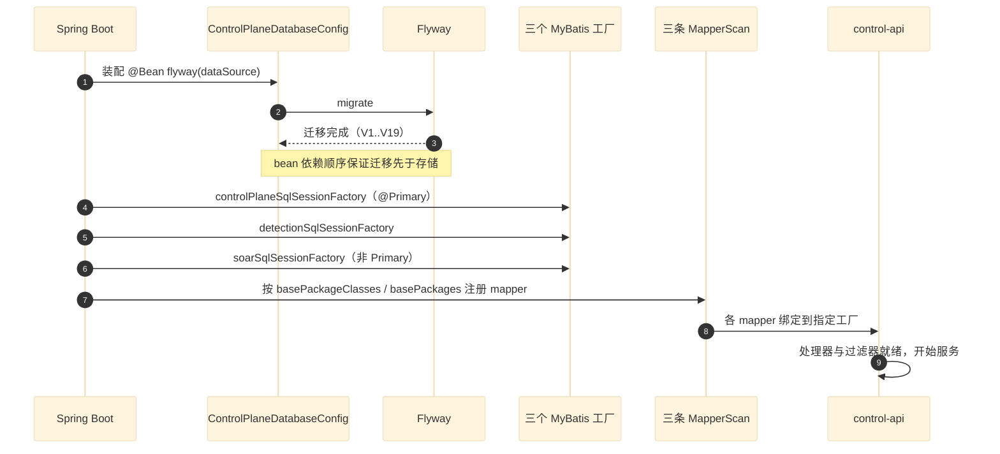
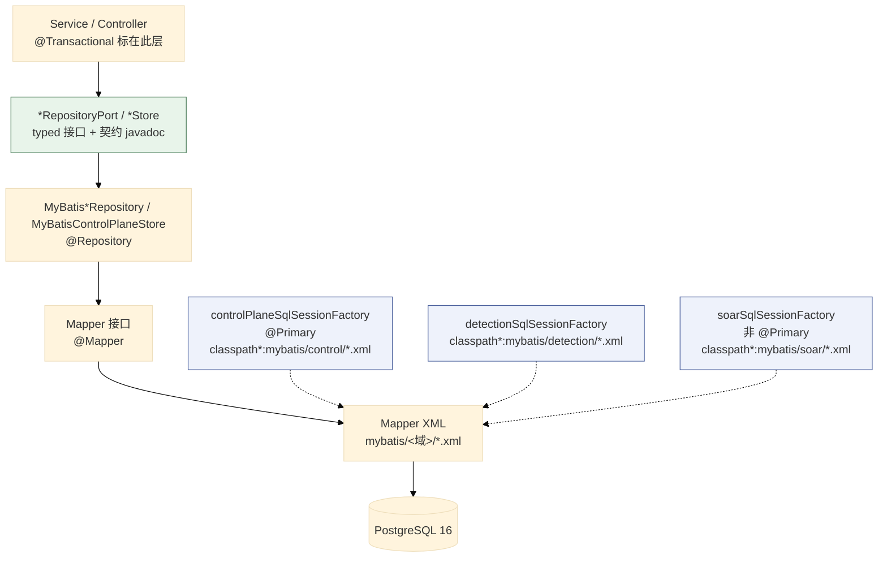
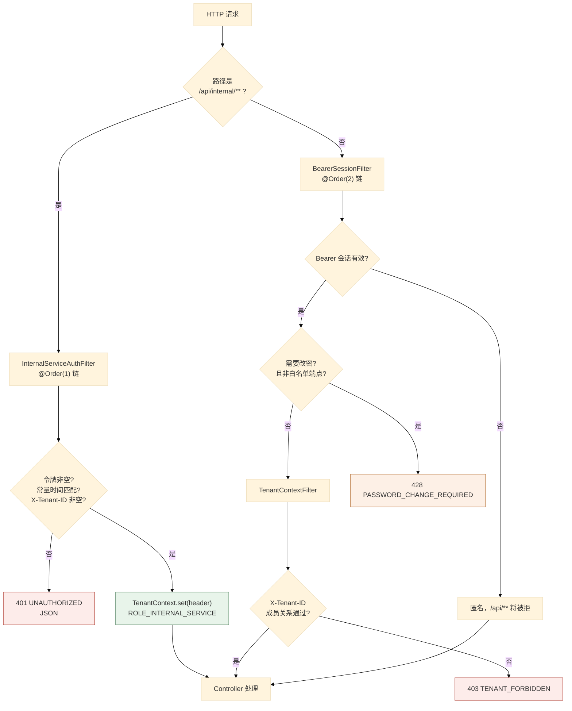
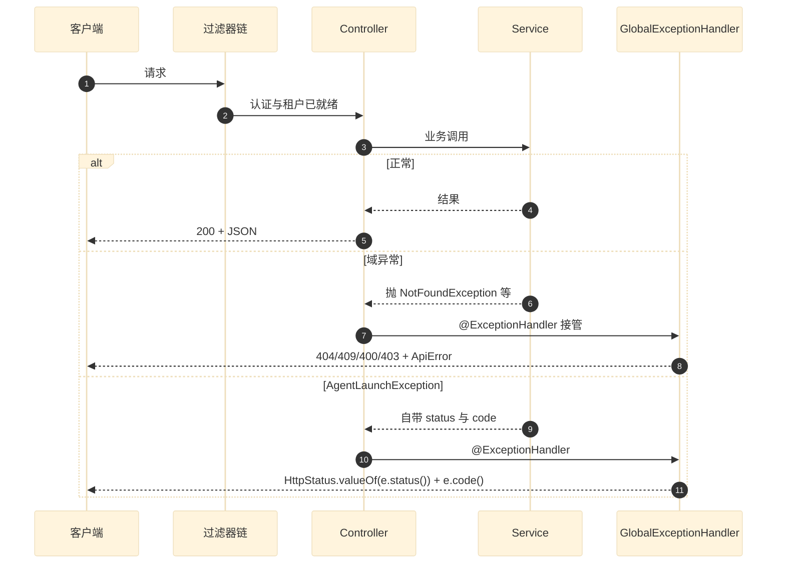
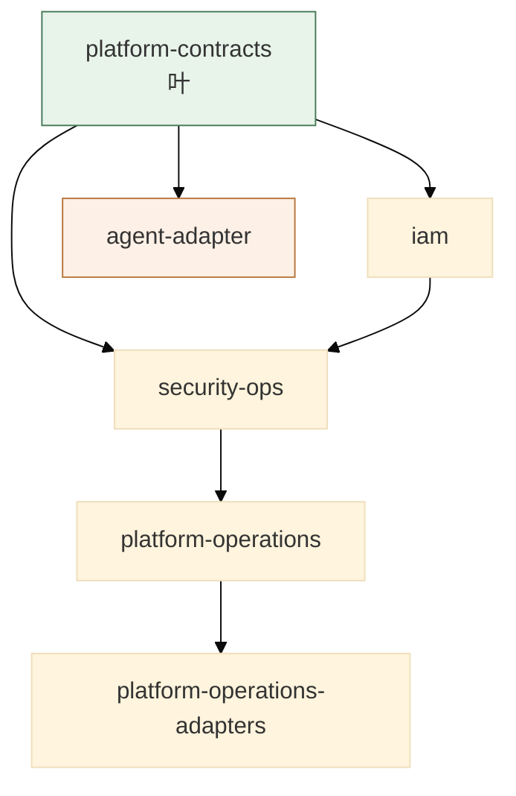
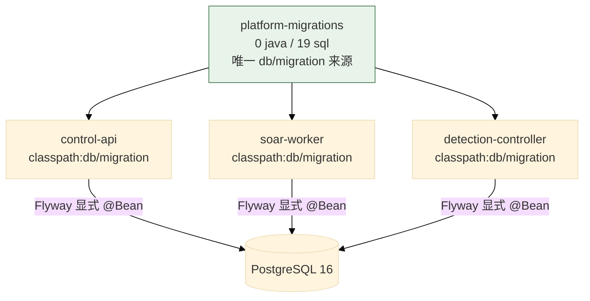
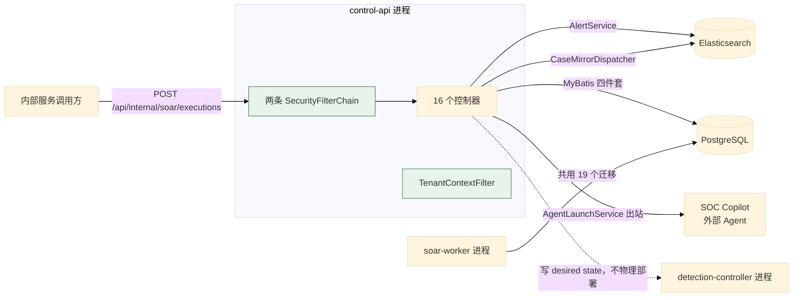

# 03 控制面：Spring Boot 多模块

> **文档类型**：子系统深挖（代码级核验，非设计提案）
> **分析对象**：`D:\Project\SIEM` 的控制面——`modules/` 12 个 Maven 模块 + `applications/` 3 个可执行应用
> **取证范围**：控制面 `modules/` main 源码 **193** 个 `.java` + `control-api` main **23** 个 + 19 个 Flyway 迁移 + 各应用 `application.properties`
> **取证方式**：源码直读 + grep 统计；每个关键论断附 `file:line` 锚点
> **结论以当前代码为准**（分支 `add_frame` @ `36b967f`）
> **文档集**：00–06 共 7 篇，见 [`README.md`](README.md)

---

## 为什么控制面独立成篇

**边界由三个代码事实确定**：

1. **独立构建单元**：`modules/*` 都继承根 `pom.xml`，而 `flink/` 不继承——控制面是「一个 reactor + 三个进程」。
2. **独立进程**：`control-api`（Web）、`detection-controller`（`WebApplicationType.NONE`）、`soar-worker`（`WebApplicationType.NONE`）。
3. **独立 schema owner**：控制面写 PostgreSQL（19 个迁移），数据面不碰 PG。

**但本篇有一个明确的取舍**：SOAR 运行时（`soar-core` / `soar-adapters` / `soar-worker-runtime` + `soar-worker`）与检测控制（`detection-control` / `detection-runtime` / `detection-controller`）**各有独立进程与独立迁移组**，所以它们各自成篇（**04 篇**与**05 篇**）。本篇聚焦**共享的装配骨架 + 安全边界 + 持久化分层 + 面向 API 的四类业务模块**。

---

## 1. 模块规模与依赖（main / test 分列）

| 模块 | main | test | 职责 |
| --- | --- | --- | --- |
| `platform-contracts` | 5 | 0 | **端口 + 共享异常 + 租户上下文**（叶） |
| `platform-migrations` | **0** | 0 | Flyway 资源（叶，纯资源模块） |
| `iam` | 28 | 0 | 认证 / 会话 / 租户 / 控制面存储 |
| `security-ops` | 13 | 0 | 告警 / 案件 / 日志检索 / ES 网关 |
| `agent-adapter` | 4 | 0 | 出站 Agent 适配 |
| `platform-operations` | 25 | 0 | 接入 / 通知 / 健康 / 运维任务 |
| `platform-operations-adapters` | 2 | 1 | WSL/Docker `ProcessBuilder` 物理命令 |
| `detection-control` | 30 | 0 | 规则 / 修订 / 期望态（见 05 篇） |
| `detection-runtime` | 16 | 5 | 传输无关运行时端口（见 05 篇） |
| `soar-core` | 53 | 2 | 引擎 + SPI + 节点处理器（见 04 篇） |
| `soar-adapters` | 14 | 4 | Kafka / HTTP 连接器（见 04 篇） |
| `soar-worker-runtime` | 3 | 2 | 消费循环 + 租约保活（见 04 篇） |
| **`applications/control-api`** | **23** | 45 | 控制面 API 进程 |
| **`applications/detection-controller`** | 11 | 5 | 检测控制进程 |
| **`applications/soar-worker`** | 1 | 2 | SOAR worker 进程 |

> **取证命令**：`find modules/<m> -name '*.java' -path '*/main/*' | wc -l`
>
> **两处值得注意**：
> 1. **`platform-migrations` 与 `iam` 等模块的测试分布极不均**——`iam`、`security-ops`、`platform-operations`、`detection-control` **main 有代码但 test 目录 0 个文件**。它们的测试在哪里？在 **`control-api` 的 45 个测试文件**里（跨模块集成测试）。这是「模块无独立测试但被应用级测试覆盖」的组织方式。
> 2. **`control-api` 的 test 文件数（45）是 main（23）的两倍**——应用层的测试密度显著高于模块层。

---

## 2. 组合根与装配入口

### 2.1 关键论断

**论断 1：三个应用各有一个组合根，且**扫描范围不同**——扫描范围就是权限边界。**

```java
// applications/control-api/.../HsiemPlatformApplication.java:14-27
@SpringBootApplication
@EnableScheduling
@MapperScan(
        basePackageClasses = {ManagedDetectionMapper.class, DetectionRuntimeMapper.class},
        sqlSessionFactoryRef = "detectionSqlSessionFactory")
@MapperScan(
        basePackages = {"com.xscsiem.hsiem_platform.control", "com.xscsiem.hsiem_platform.tenant"},
        annotationClass = Mapper.class,
        sqlSessionFactoryRef = ControlPlaneMyBatisConfiguration.SESSION_FACTORY_NAME)
@MapperScan(
        basePackageClasses = SoarMapper.class,
        annotationClass = Mapper.class,
        sqlSessionFactoryRef = SoarMyBatisConfiguration.SESSION_FACTORY_NAME)
public class HsiemPlatformApplication {
```

| 应用 | 组合根 | 扫描范围 |
| --- | --- | --- |
| `control-api` | `HsiemPlatformApplication.java:14-27` | **三条** `@MapperScan`（detection / control+tenant / soar） |
| `soar-worker` | `entrypoints/SoarWorkerApplication.java` | 只扫 control 与 soar |
| `detection-controller` | `DetectionControllerApplication.java` | 只扫 `detection.controller` 包 |

> **`control-api` 不扫 `detection-runtime` / artifact mapper**——`CLAUDE.md` §持久化约定第 2 条明确写了这一点，目的是**保证 `control-api ↔ detection-runtime` 边界封闭**。虽然上表第一条 `@MapperScan` 的 `basePackageClasses` 里列了 `DetectionRuntimeMapper`，但它属于 **detection 域工厂**（`detectionSqlSessionFactory`），**不是** `detection-runtime` 模块的 artifact mapper 扫描。

**论断 2：`@Primary` 是必要的，且注释写明了原因。**

```java
// modules/iam/.../control/ControlPlaneMyBatisConfiguration.java:22-35
/**
 * Primary so the mybatis starter's shared {@code sqlSessionTemplate} auto-config bean can
 * resolve a single factory when an app also defines a detection factory.
 */
@Bean(name = SESSION_FACTORY_NAME)
@Primary
SqlSessionFactory controlPlaneSqlSessionFactory(DataSource dataSource) throws Exception {
    SqlSessionFactoryBean factory = new SqlSessionFactoryBean();
    factory.setDataSource(dataSource);
    factory.setMapperLocations(
            new PathMatchingResourcePatternResolver()
                    .getResources("classpath*:mybatis/control/*.xml"));
    return factory.getObject();
}
```

**多工厂下必须有且只有一个 `@Primary`**——否则 starter 的 `sqlSessionTemplate` 自动装配无法确定绑哪个。`soar` 工厂则显式**非** `@Primary`（对比 `SoarMyBatisConfiguration`）。

**论断 3：Flyway 迁移是显式执行的，因为 Boot 4.1 不自动装配。**

```java
// modules/iam/.../control/ControlPlaneDatabaseConfig.java:11-20（节选）
/**
 * Spring Boot 4.1 当前不自动装配 Flyway，因此在应用配置层显式执行迁移。
 * Flyway bean 初始化完成后，JDBC 控制面存储才会创建，保证不会先读未建表的数据库。
 */
public class ControlPlaneDatabaseConfig {
    @Bean
    public Flyway flyway(DataSource dataSource, ...) {
        Flyway flyway = Flyway.configure()...
```

> **这是本篇最值得单独记住的一条工程事实**：**Boot 4.1 不自动装配 Flyway**。如果只靠 `spring.flyway.*` 配置，迁移**根本不会跑**。这里用显式 `@Bean` 补上，并靠 **bean 依赖顺序**保证「迁移先于存储创建」。注释里那句「保证不会先读未建表的数据库」就是这个顺序约束的说明。

**论断 4：`ControlPlaneStore` 是**复合端口**——一个接口聚合五个子域。**

```java
// modules/iam/.../control/ControlPlaneStore.java:9-10
public interface ControlPlaneStore
        extends AuthStore, NotificationStore, CaseStore, LifecycleOutboxStore, TaskStore {}
```

**五个子端口**：`AuthStore`（认证）、`NotificationStore`（通知）、`CaseStore`（案件）、`LifecycleOutboxStore`（生命周期 outbox）、`TaskStore`（后台任务）。

**这是「按子域拆分端口，用一个复合接口统一注入」的手法**：调用方注入 `ControlPlaneStore` 即可拿到全部能力，而**每个子端口可独立测试、独立 mock**。

**论断 5：`CaseStore` 的端口契约把镜像机制写进了接口文档。**

```java
// modules/iam/.../control/CaseStore.java:7-13
/**
 * 案件有界上下文的持久化端口：PostgreSQL 案件事实的 CRUD、告警关系与 ES 镜像 outbox。 由控制面 MyBatis 实现({@link
 * MyBatisControlPlaneStore})提供,是 {@link ControlPlaneStore} 的子面。
 *
 * <p>案件写路径的镜像机制是：事实变更在同一事务内先落 PostgreSQL 并由 {@code enqueueCaseMirror} 写入 outbox，再由 {@code
 * claimCaseMirrorBatch}/{@code completeCaseMirror} 投递给 Elasticsearch；业务正常写路径不应绕过此端口直接写 ES。
 */
```

**接口的 javadoc 承载了「不要绕过我」这条约束**——这是把架构规约写在类型系统可见的位置，比写在文档里更难被忽略。

### 2.2 装配时序



---

## 3. 持久化分层：四件套

### 3.1 关键论断

**论断 1：链路是「Service → `*RepositoryPort` → `MyBatis*Repository` → Mapper 接口 → Mapper XML → PostgreSQL」六段。**

`CLAUDE.md` §持久化约定写明这条链路，并明确：*「生产业务代码不再内联 `JdbcTemplate` SQL」*，仅保留两类例外——`@Deprecated` 兼容外观与纯基础设施探针（`OperationalHealthService` 的 `SELECT 1`）。

**论断 2：按域隔离靠「一个工厂 + 一个 XML 通配符」，不是全局 `mapper-locations`。**

| 域 | 工厂 bean | XML 通配符 | XML 位置 |
| --- | --- | --- | --- |
| iam 控制面 | `controlPlaneSqlSessionFactory`（**`@Primary`**） | `classpath*:mybatis/control/*.xml` | `modules/iam/src/main/resources/mybatis/control/` |
| detection | `detectionSqlSessionFactory` | `classpath*:mybatis/detection/*.xml` | 三个位置各自携带 |
| soar | `soarSqlSessionFactory`（非 `@Primary`） | `classpath*:mybatis/soar/*.xml` | `modules/soar-core/src/main/resources/mybatis/soar/` |

**每个工厂只加载自己域的通配符**（`ControlPlaneMyBatisConfiguration.java:31-33`）——所以**某个域的 mapper XML 无法被另一个域误加载**。

> **`CLAUDE.md` 明确警告不要依赖 `mybatis.mapper-locations` 全局限定**。原因是全局配置在三个工厂共存时会互相覆盖。

**论断 3：`@Transactional` 标在 store/service 上，让 mapper 语句与调用方同一事务。**

`CLAUDE.md` §持久化约定第 3 条：*「`@Transactional` 标注在 store/service 上，让 mapper 语句与调用方同一事务，保住 `FOR UPDATE`/乐观版本/租约语义」*。

**这是案件镜像 outbox「同一事务」不变式（01 篇 §5.1 论断 2）能成立的前提**：`enqueueCaseMirror` 与案件事实写入必须在同一事务内，而事务边界由 store/service 上的 `@Transactional` 决定。

**论断 4：`@MapperScan` 显式带 `annotationClass = Mapper.class` + `sqlSessionFactoryRef`，是为了避开 starter 的自动装配陷阱。**

`CLAUDE.md` §持久化约定第 2 条写明原因：*「避免 starter 的 `@ConditionalOnMissingBean` 模板误绑」*。**两处例外**：control-api 的第一条 `@MapperScan`（detection 域）**不带** `annotationClass`，因为它用的是 `basePackageClasses` 精确指定两个 mapper——路径已经足够窄，不需要注解再筛一层。

**论断 5：UUID 列用共享 `TypeHandler`，且只注册在 detection 工厂。**

`CLAUDE.md` §持久化约定第 4 条：*「`UuidTypeHandler` 是共享的 PostgreSQL `uuid`↔`String` 处理器，注册在 `DetectionMyBatisConfiguration`；未使用它的场景可回退 UUID 自动映射」*。

实测文件位置：`modules/detection-control/src/main/java/com/xscsiem/hsiem_platform/rules/UuidTypeHandler.java`。

**论断 6：detection-controller 关闭了下划线自动映射——与本篇其他域相反。**

`CLAUDE.md` §持久化约定第 5 条：*「detection-controller 里 `mybatis.configuration.map-underscore-to-camel-case=false`，column→property 靠显式 `resultMap`/`@Results`，不要依赖自动驼峰映射」*。

实测：`mybatis.configuration.map-underscore-to-camel-case=false` 出现在**两个**应用的配置里——`control-api`（`application.properties:3`）与 `detection-controller`（`application.properties:3`）；只有 `soar-worker` 未设。`CLAUDE.md` §持久化约定第 5 条只说「detection-controller 里…」，并未声称唯一。

**所以 `control-api` 与 `detection-controller` 都要显式维护 `resultMap`。**

### 3.2 分层图



**两个例外**（`CLAUDE.md` §持久化约定第 3 条）：`SoarStore`、`SoarConnectorActionInvocation`、`SoarBusinessActionInvocation` 作为具体 `@Repository` **直接注入 `SoarMapper`**，不套端口——因为 `soar-core` 主代码与 `SoarWorkerTest` 以具体类消费。

---

## 4. 安全边界

### 4.1 关键论断

**论断 1：两条 `SecurityFilterChain`，靠 `securityMatcher` 与 `@Order` 分流。**

```java
// applications/control-api/.../auth/SecurityConfig.java:24（类注释）
/** 阶段 4.2 安全边界:无状态 HTTP 层 + PostgreSQL 持久化 Bearer 会话 + 方法级权限。 */
```

| # | `@Order` | 匹配 | 认证方式 | 锚点 |
| --- | --- | --- | --- | --- |
| 1 | **1** | `/api/internal/**` | `InternalServiceAuthFilter`（服务令牌） | `SecurityConfig.java:46-74` |
| 2 | **2** | 其余全部 | `BearerSessionFilter`（用户会话） | `SecurityConfig.java:76-116` |

**顺序是关键的**：内部服务链**必须排在前面**，且只匹配 `/api/internal/**`——否则用户会话链会先接管内部端点。注释写得很明确：

```java
// SecurityConfig.java:44-45（方法注释）
 * 内部服务到服务链:SOC Copilot 触发 SOAR 执行。必须排在用户会话链之前, 只匹配 /api/internal/**,不要求用户成员关系,不落回用户链。
```

**论断 2：两条链都是 `STATELESS`，且都禁用了 csrf/basic/formLogin。**

```java
// SecurityConfig.java:54-57（内部链）
.csrf(csrf -> csrf.disable())
.cors(cors -> {})
.sessionManagement(
        session -> session.sessionCreationPolicy(SessionCreationPolicy.STATELESS))
```

```java
// SecurityConfig.java:71-72（内部链）
.httpBasic(basic -> basic.disable())
.formLogin(form -> form.disable());
```

**「无状态」与「Bearer 会话」并存不矛盾**：会话状态存在 **PostgreSQL**，不在 HTTP 层（无 `JSESSIONID`、无 `HttpSession`）。`BearerSessionFilter` 每次请求查库还原身份。

**论断 3：授权规则分三段——白名单、actuator 限 ADMIN、`/api/**` 需认证。**

```java
// SecurityConfig.java:88-101
.authorizeHttpRequests(
        auth ->
                auth.requestMatchers(
                                "/api/auth/login",
                                "/actuator/health",
                                "/actuator/info",
                                "/hello")
                        .permitAll()
                        .requestMatchers("/actuator/**")
                        .hasRole("ADMIN")
                        .requestMatchers("/api/**")
                        .authenticated()
                        .anyRequest()
                        .permitAll())
```

**白名单只有四项**：登录、两个 actuator 探针、`/hello`。**其余 `/actuator/**` 限 ADMIN**——这是有意的：`/actuator/env`、`/actuator/beans` 之类的端点会泄漏配置，不能对普通认证用户开放。

**注意 `anyRequest().permitAll()`**——即**不在以上三段的路径默认放行**。安全实际依赖「所有业务路径都在 `/api/**` 下」这条约定。

**论断 4：内部服务认证是 fail-closed，且用常量时间比较。**

```java
// applications/control-api/.../auth/InternalServiceAuthFilter.java:50-57
if (expectedToken.length == 0
        || token == null
        || !MessageDigest.isEqual(expectedToken, token.getBytes(StandardCharsets.UTF_8))
        || tenant == null
        || tenant.isBlank()) {
    writeUnauthorized(response);
    return;
}
```

**四个拒绝条件，任一命中即拒**：

| 条件 | 含义 |
| --- | --- |
| `expectedToken.length == 0` | **配置令牌为空 → 全部拒绝**（不是「空令牌放过」） |
| `token == null` | 请求未带 Bearer |
| `!MessageDigest.isEqual(...)` | 令牌不符（**常量时间**，防时序侧信道） |
| `tenant == null \|\| tenant.isBlank()` | `X-Tenant-ID` 缺失 |

**第一条是 fail-closed 的精髓**：默认配置 `app.internal-service.token:` 为空串（`SecurityConfig.java:50`），所以**未显式配置时内部端点完全不可用**——而不是「任何人可访问」。

**论断 5：这个过滤器**故意不是 `@Component`**。**

```java
// InternalServiceAuthFilter.java:24-26（类注释）
 * <p>只由 /api/internal/** 专用 SecurityFilterChain 装配。故意不是 @Component: 否则 Spring Boot
 * 会把它注册成全局 Servlet Filter,绕过链的匹配范围。...
```

**这是一处真实的 Spring 陷阱**：`@Component` 的 `Filter` 会被 Boot 注册为**全局** Servlet Filter，**不受 `securityMatcher` 约束**。所以必须手动 `new` 后 `addFilterBefore`（`SecurityConfig.java:68-70`）。

**论断 6：`TenantContextFilter` 是 `@Component`，但因此需要**路径兜底**。**

```java
// applications/control-api/.../tenant/TenantContextFilter.java:34-39
// 内部服务链自带独立认证与租户来源(/api/internal/**),用户成员关系校验不适用。
// 该过滤器是 @Component,可能被 Boot 注册为全局 Filter,因此在路径上再兜底一次。
if (request.getRequestURI().startsWith("/api/internal/")) {
    chain.doFilter(request, response);
    return;
}
```

**两个过滤器的 `@Component` 选择相反，各自的原因都写在了注释里**：

| 过滤器 | `@Component`？ | 原因 |
| --- | --- | --- |
| `InternalServiceAuthFilter` | **否** | 是安全边界，绝不能全局生效 |
| `TenantContextFilter` | **是** | 需要全局兜底，但主动跳过 `/api/internal/` |

**论断 7：租户不能被客户端 Header 单方面切换——必须校验成员关系。**

```java
// applications/control-api/.../tenant/TenantContextFilter.java:18（类注释）
/** 认证完成后校验 X-Tenant-ID 成员关系，阻止只靠客户端 Header 切换租户。 */
```

```java
// TenantContextFilter.java:58-64
try {
    String tenant =
            tenants.requireMembership(
                    authentication.getName(), request.getHeader("X-Tenant-ID"));
    TenantContext.set(tenant);
    response.setHeader("X-Tenant-ID", tenant);
    chain.doFilter(request, response);
} catch (ForbiddenException e) {
```

**`requireMembership(username, headerTenant)`** —— 双参数校验。**只看 Header 就切租户**是典型的多租户越权漏洞，这里显式堵住：不属于该租户则抛 `ForbiddenException` → 403 `TENANT_FORBIDDEN`。

**响应头回写 `X-Tenant-ID`**（`:63`）——让客户端知道实际生效的租户。

**论断 8：过滤器链的位置是显式指定的，不是默认顺序。**

```java
// SecurityConfig.java:111-112
.addFilterBefore(bearerSessionFilter, AnonymousAuthenticationFilter.class)
.addFilterAfter(tenantContextFilter, BearerSessionFilter.class)
```

**顺序：`BearerSessionFilter` → `TenantContextFilter`**。租户校验必须**在认证之后**——因为需要 `authentication.getName()`。`addFilterAfter` 精确表达了这条依赖。

**论断 9：测试身份走 `default` 租户，且有显式兼容分支。**

```java
// TenantContextFilter.java:47-56
// 生产认证由 BearerSessionFilter 创建 String principal。Spring Security 测试注解使用
// UserDetails principal，且项目没有启用表单/basic 登录；测试身份保持 default 租户即可。
if (!(authentication.getPrincipal() instanceof String)) {
    TenantContext.set(TenantContext.DEFAULT_TENANT);
    ...
```

**`@WithMockUser` 之类的测试注解读进来的 principal 是 `UserDetails`**（不是生产路径的 `String`），这条分支让测试不必伪造租户成员关系。

**论断 10：密码过期用 428 拦截，且白名单四个端点。**

```java
// BearerSessionFilter.java:33-39
if (user.passwordChangeRequired && requiresPasswordChange(request)) {
    response.setStatus(428); // Precondition Required
    response.setContentType("application/json");
    response.setCharacterEncoding("UTF-8");
    response.getWriter().write("{\"code\":\"PASSWORD_CHANGE_REQUIRED\",\"message\":\"请先修改密码\"}");
    return;
}
```

```java
// BearerSessionFilter.java:52-59
private static boolean requiresPasswordChange(HttpServletRequest request) {
    String path = request.getRequestURI();
    return path.startsWith("/api/")
            && !path.equals("/api/auth/login")
            && !path.equals("/api/auth/password")
            && !path.equals("/api/auth/me")
            && !path.equals("/api/auth/logout");
}
```

**放行四个端点**：登录、改密码、查自己、登出。**其余 `/api/**` 全部 428**——即强制改密**不能靠前端自觉**。

**`428 Precondition Required`（不是 403）** 是语义准确的选择：请求本身合法，只是**前置条件未满足**。

**论断 11：principal 用 username 字符串，不用 `AuthUser` 对象。**

```java
// BearerSessionFilter.java:42-44
// principal 使用用户名而不是 AuthUser 对象,保证 Authentication#getName
// 在审计、操作人和后台任务中得到稳定的 admin/analyst 字符串。
var authentication = new UsernamePasswordAuthenticationToken(user.username, token, authorities);
```

**这个选择直接影响 `TenantContextFilter`**（它靠 `instanceof String` 区分生产/测试路径，见论断 9）。两处是耦合的——改一处必须改另一处。

**论断 12：认证失败返回 JSON 而非重定向。**

两条链都用自定义 `AuthenticationEntryPoint`（`SecurityConfig.java:60-66`、`:104-109`）与 `AccessDeniedHandler`（`:124-132`），统一输出 `ApiError`：

```java
// SecurityConfig.java:134-145
private void writeError(
        ObjectMapper mapper, HttpServletResponse response, int status, String code, String message)
        throws java.io.IOException {
    response.setStatus(status);
    response.setContentType(MediaType.APPLICATION_JSON_VALUE);
    response.setCharacterEncoding("UTF-8");
    mapper.writeValue(
            response.getWriter(), new ApiError(Instant.now(), status, code, message, null));
}
```

**默认的 Spring Security 行为是重定向到登录页**——对纯 API 服务无意义。这里统一成 `ApiError` 结构，与前端的错误处理一致。

**论断 13：`UserDetailsService` 被显式替换为「永不成功」的实现。**

```java
// SecurityConfig.java:35-41
/** 项目使用自定义 Bearer 会话，不启用 Boot 的随机密码用户。 */
@Bean
UserDetailsService unusedFormUserDetailsService() {
    return username -> {
        throw new UsernameNotFoundException("未使用表单登录: " + username);
    };
}
```

**这是为了压掉 Boot 的默认行为**：`spring-boot-starter-security` 在没有 `UserDetailsService` 时会**生成随机密码并打印到日志**。提供一个永远抛异常的实现，既满足自动装配，又杜绝了这条隐式账号路径。

### 4.2 安全过滤器链



---

## 5. API 层

### 5.1 关键论断

**论断 1：16 个控制器，104 个端点，按资源前缀聚集。**

`control-api` main 目录 23 个 Java 文件 = **16 个控制器** + 3 个过滤器 + `SecurityConfig` + `CorsConfig` + `GlobalExceptionHandler` + 组合根。

**完整端点表见 01 篇附录 A**——本文不重复。

**论断 2：全局异常处理把域异常映射到固定的 HTTP 状态与错误码。**

`GlobalExceptionHandler` 集中处理（`applications/control-api/.../onboarding/GlobalExceptionHandler.java`）：

| 异常 | HTTP | 错误码 | 锚点 |
| --- | --- | --- | --- |
| `NotFoundException` | 404 | `NOT_FOUND` | `:34-36` |
| `PortConflictException` | 409 | `PORT_CONFLICT` | `:39-41` |
| `IllegalArgumentException` | 400 | `INVALID_ARGUMENT` | `:44-47` |
| `ConflictException` | 409 | `CONFLICT` | `:50-52` |
| `UnauthorizedException` | 401 | `UNAUTHORIZED` | `:55-58` |
| `ForbiddenException` | 403 | `FORBIDDEN` | `:61-63` |
| `AccessDeniedException` | 403 | `FORBIDDEN` | `:66-69` |
| `LogSearchUnavailableException` | 503 | `LOG_SEARCH_UNAVAILABLE` | `:72-76` |
| `AgentLaunchException` | **动态** | **动态** | `:79-82` |
| `MethodArgumentNotValidException` | 400 | — | `:85` |

**`AgentLaunchException` 是唯一动态映射的**：`error(HttpStatus.valueOf(e.status()), e.code(), ...)` —— 异常自带状态码与错误码，因为 Agent 启动失败的语义取决于下游返回。

**论断 3：`LogSearchUnavailableException` → 503 而不是 500——这是有意义的区分。**

`LOG_SEARCH_UNAVAILABLE` 表示**依赖不可用**（ES 挂了），不是**请求有错**。503 让客户端知道「可以重试」，且不会触发前端的「参数错误」提示路径。

**论断 4：CORS 有独立配置类。**

`applications/control-api/.../onboarding/CorsConfig.java` —— 与 `SecurityConfig` 里的 `.cors(cors -> {})`（启用 CORS 但用外部配置源）配合。

### 5.2 错误处理流



---

## 6. 四类面向 API 的业务模块

### 6.1 `iam`：认证 / 会话 / 租户 / 控制面存储

**28 个 main 文件，三个子包**：

| 子包 | 文件数 | 职责 |
| --- | --- | --- |
| `control/` | 17 | 控制面存储（端口 + MyBatis 实现 + 各 mapper） |
| `auth/` | 6 | 认证 / 会话 / 权限 |
| `tenant/` | 5 | 租户与成员关系 |

**`control/` 的 17 个文件结构**：

```
ControlPlaneStore.java          # 复合端口（extends 5 个子端口）
├─ AuthStore.java               # 认证存储
├─ NotificationStore.java       # 通知存储
├─ CaseStore.java               # 案件存储（含 ES 镜像 outbox）
├─ LifecycleOutboxStore.java    # 生命周期 outbox
└─ TaskStore.java               # 后台任务存储

MyBatisControlPlaneStore.java   # 五端口的统一 MyBatis 实现
ControlPlaneMyBatisConfiguration.java  # @Primary 工厂
ControlPlaneDatabaseConfig.java        # Flyway 显式装配
ControlPlaneRow.java                   # 行映射辅助

CaseMapper.java / CaseMirrorOutboxMapper.java / LifecycleOutboxMapper.java
NotificationMapper.java / RoleAuditMapper.java / TaskMapper.java / UserAuthMapper.java
```

**一个实现类实现五个端口**（`MyBatisControlPlaneStore`），7 个 mapper 接口。**这是「粗粒度实现 + 细粒度端口」的手法**——注入面窄（一个 `ControlPlaneStore`），测试面宽（五个端口可分别断言）。

**`tenant/` 的五件套正好是持久化四件套的范例**：

```
TenantRepositoryPort.java       # 端口
MyBatisTenantRepository.java    # MyBatis adapter
TenantMapper.java               # Mapper 接口
TenantRow.java                  # 行模型
TenantService.java              # 业务服务（requireMembership 在这里）
```

### 6.2 `security-ops`：告警 / 案件 / 日志检索 / ES 网关

**13 个 main 文件，四个子包**——**是「文件少职责宽」的典型**：

| 子包 | 文件 | 职责 |
| --- | --- | --- |
| `alert/` | 1 | `AlertService`（ES 事实源，乐观锁） |
| `investigation/` | 4 | `CaseService` + `CaseAggregateJob` + `CaseMirrorDispatcher` + `CaseMirrorReconcileJob` |
| `logsearch/` | 5 | 日志检索请求/响应/目录/服务/异常 |
| `search/` | 3 | `ElasticsearchGateway` + `ElasticsearchClientConfig` + `ElasticsearchHealthIndicator` |

**`AlertService` 一个文件承载整个告警域**（见 01 篇 §7）——因为告警的事实源在 ES 而非 PG，不走 MyBatis 四件套。

**`search/` 是 ES 访问的唯一出口**：

```java
// modules/security-ops/.../search/ElasticsearchGateway.java
public Response request(String method, String path, String body)           // :40
private Response search(String index, String body)                        // :78
private Response count(String index, String body)                         // :120
private Response get(String index, String id)                             // :128
private Response index(String index, String id, String path, String body)  // :140
private Response update(String index, String id, String path, String body) // :151
private Response delete(String index, String id, String path, String body) // :165
public record Response(int code, Map<String, Object> body)                 // :178
```

**`request(method, path, body)` 是一个「类 REST 通道」**——`AlertService` 与 `CaseMirrorDispatcher` 都通过它发原始 HTTP 方法+路径，而不是走 typed 方法。**这解释了 01 篇 §9 待核实 6**（两条调用分支）的成因：**typed 方法是给已知索引用的便利封装，`request` 是通用逃生口**。

**HTTP 异常被转成 `Response`，不抛**：

```java
// ElasticsearchGateway.java:72
return new Response(status, Map.of("error", e.getMessage()));
```

**注意错误消息直接放入响应体**——见 §9 待核实。

### 6.3 `platform-operations`：接入 / 通知 / 健康 / 运维任务

**25 个 main 文件，五个子包**：

| 子包 | 文件数 | 职责 |
| --- | --- | --- |
| `onboarding/` | 13 | 日志源接入、Logstash 配置生成、grok 测试、解析模板 |
| `settings/` | 4 | 关键性（criticality）设置与重算 |
| `control/` | 3 | 后台任务恢复、配置修订日志、生产安全校验 |
| `health/` | 2 | 数据健康、运维健康 |
| `notify/` | 2 | 通知扫描与服务 |

**`onboarding/` 的 deployer 是「接口 + 禁用实现」双件**：

```
LogstashDeployer.java              # 接口
DisabledLogstashDeployer.java      # 禁用实现
CriticalityDeployer.java           # 接口
DisabledCriticalityDeployer.java   # 禁用实现
```

**这是「默认不执行物理动作」的手法**：默认装配 `Disabled*` 实现，只在显式启用时才换真实现。与 `CLAUDE.md` §16「控制面物理命令隔离」一致。

**`ProductionSafetyValidator`** 属于 `control/`——名字表明它在**启动或部署时校验生产安全性**（具体规则见 §9 待核实）。

**运维任务都在这个模块，且都受同一个开关控制**（`CLAUDE.md` §13）：

| 任务 | 锚点 | 开关 |
| --- | --- | --- |
| `BackgroundTaskRecovery` | `control/BackgroundTaskRecovery.java:39` | `app.operations.runtime-enabled` |
| `NotificationScanner` | `notify/NotificationScanner.java:32` | 同上 |
| `CaseAggregateJob` | `investigation/CaseAggregateJob.java:31`（在 security-ops） | 同上 |
| `CaseMirrorDispatcher` | `investigation/CaseMirrorDispatcher.java:50` | 同上 |
| `CaseMirrorReconcileJob` | `investigation/CaseMirrorReconcileJob.java:19` | 同上 |

**`CLAUDE.md` §13 明确警告**：*「不要仅依赖 `WebApplicationType` 判断」*——因为 `control-api` 默认 `true`、`soar-worker` 默认 `false`，两者都是 Spring Boot 应用但运维任务开关不同。

### 6.4 `agent-adapter`：出站 Agent 适配

**4 个文件，只有一个子包 `agent/`**：

```
AgentInvestigationService.java   # Agent 调查编排
AgentLaunchService.java          # Agent 启动
AgentLaunchResponse.java         # 启动响应契约
AgentLaunchException.java        # 启动异常（自带 status 与 code）
```

**`AgentLaunchException` 是 `GlobalExceptionHandler` 里唯一动态映射的异常**（§5.1 论断 2）——因为它跨进程边界携带了下游的状态码。

**`agent-adapter` 只依赖 `platform-contracts`**（00 篇 §1.2）——它是**出站适配器**，不反向依赖业务模块。这与 `control-api` 的 11 模块依赖面形成鲜明对比。

### 6.5 四模块的依赖方向



**两处值得注意**：

1. **`agent-adapter` 与 `security-ops` / `platform-operations` 无依赖关系**——它自成一条从 `platform-contracts` 直挂的支线。这与它在 `control-api` 里被 11 模块共同装配的事实不矛盾：**模块间无依赖 ≠ 不能在同一进程内共存**。
2. **`platform-operations-adapters` 只依赖 `platform-operations`**——物理命令实现是接入模块的**下游**，不是上游。`CLAUDE.md` §16 记录了这个拆分的目的：*「未来再拆独立 operations worker」*。

---

## 7. 迁移：单一来源

### 7.1 关键论断

**论断 1：19 个迁移文件，全部在 `platform-migrations`，且该模块零 Java 文件。**

```
modules/platform-migrations/src/main/resources/db/migration/
  V1__control_plane.sql
  V2__auth_sessions_and_login_limits.sql
  V3__case_ownership_and_evidence.sql
  V4__notification_retention.sql
  V5__case_collaborators.sql
  V6__password_rotation.sql
  V7__outbox_task_leases.sql
  V8__soar_execution.sql
  V9__soar_orchestration_runtime.sql
  V10__soar_platform_governance.sql
  V11__soar_lifecycle_runtime.sql
  V12__soar_handler_runtime.sql
  V13__soar_parallel_runtime.sql
  V14__soar_loop_runtime.sql
  V15__soar_trigger_type.sql
  V16__managed_detection_runtime.sql
  V17__detection_runtime_observed_state.sql
  V18__detection_controller_leases.sql
  V19__lifecycle_outbox.sql
```

**三个部署单元共用这一份迁移**：`control-api`、`soar-worker`、`detection-controller` 都用 `classpath:db/migration`（`CLAUDE.md` §关键知识点 12）。

**断言：`platform-migrations` 是唯一含 `db/migration` 的模块**——这是「迁移单一来源」的实现方式，也是 00 篇 §2 边界表的第 3 行。

**论断 2：迁移编号反映了三个阶段的能力积累。**

| 区间 | 迁移 | 主题 |
| --- | --- | --- |
| V1–V7 | 7 个 | **控制面基础**：控制面表、认证会话、案件归属、通知保留、协作人、改密、outbox 租约 |
| V8–V15 | 8 个 | **SOAR 运行时**：执行、编排、治理、生命周期、handler、并行、循环、触发类型 |
| V16–V19 | 4 个 | **检测控制 + 生命周期 outbox**：托管检测运行时、观测态、controller 租约、lifecycle outbox |

**这个分组与模块划分的对应关系是清晰的**（V8–V15 ↔ `soar-core`；V16–V18 ↔ `detection-control`/`detection-runtime`）。

> **一处诚实的观察**：V8–V15 共 8 个 SOAR 迁移**全部是加重**（没有一个是修正早期 SOAR 表的）。这与 `CLAUDE.md` 提到的「V8–V10 旧复数表已退役冻结」形成对照——**旧表未删除，新表从 V11 起建**。见 04 篇。

**论断 3：只有 `iam` 的第一个迁移是 `V1__control_plane.sql`——它不是「所有表」的大迁移。**

按 `CLAUDE.md` 的域名划分，V1 是控制面基础表。**后续每个域各自追加自己的迁移**，而不是在 V1 里预建全部表。这是「迁移跟着功能走」而非「迁移跟着 schema 走」。

### 7.2 迁移与部署单元



> **三个进程都跑 Flyway 会不会冲突？** Flyway 自带 schema history 表锁（`flyway_schema_history`），并发执行时后到者等待或跳过。**但 `ControlPlaneDatabaseConfig` 的注释强调的依赖顺序（迁移先于存储创建）是每个进程各自要满足的**——所以三个应用都需要等价的配置。

---

## 8. 关键不变式（代码强制）

| # | 不变式 | 强制点 | 违反后果 |
| --- | --- | --- | --- |
| 1 | **内部服务端点在令牌未配置时完全不可用** | `InternalServiceAuthFilter.java:50` `expectedToken.length == 0` 即拒 | 默认配置下内部端点暴露给任何人 |
| 2 | **令牌比较是常量时间** | `InternalServiceAuthFilter.java:52` `MessageDigest.isEqual` | 时序侧信道泄漏令牌 |
| 3 | **内部服务过滤器不全局生效** | `InternalServiceAuthFilter.java:24-26` 故意非 `@Component` | 绕过 `securityMatcher`，全站要求服务令牌 |
| 4 | **租户不能靠 Header 单方面切换** | `TenantContextFilter.java:60` `requireMembership(username, header)` | 跨租户越权 |
| 5 | **`/api/internal/**` 不要求用户成员关系** | `TenantContextFilter.java:36-39` 路径兜底跳过 | 服务间调用被误判为越权 |
| 6 | **未改密用户只能访问四个端点** | `BearerSessionFilter.java:52-59` 白名单；`:34` 428 | 强制改密被前端绕过 |
| 7 | **`UserDetailsService` 永不成功** | `SecurityConfig.java:37-41` 抛 `UsernameNotFoundException` | Boot 生成随机密码账号 |
| 8 | **认证失败返回 JSON 而非重定向** | `SecurityConfig.java:60-66,104-109,124-132` | API 客户端收到 302 HTML |
| 9 | **审计字段在状态变更时写入** | `AlertService.java:211,349` `alert.status_updated_at` | 无法追溯状态变更时间 |
| 10 | **`@Primary` 工厂只能有一个** | `ControlPlaneMyBatisConfiguration.java:26-27` | starter 无法确定绑哪个工厂 |
| 11 | **Flyway 迁移必须先于存储创建** | `ControlPlaneDatabaseConfig.java:11-12` 注释 + bean 顺序 | 读未建表的数据库 |
| 12 | **案件写路径不绕过端口直接写 ES** | `CaseStore.java:11-12` 接口 javadoc | 事实源与镜像不一致 |
| 13 | **detection-controller 不用自动驼峰映射** | `CLAUDE.md` §持久化约定 5 | 列名映射错乱 |

---

## 9. 与其他子系统的边界



**四条对外边界**：

| 边界 | 方向 | 契约 | 锚点 |
| --- | --- | --- | --- |
| 到 Elasticsearch | 出站 | `ElasticsearchGateway.request(method, path, body)` | `ElasticsearchGateway.java:40` |
| 到 PostgreSQL | 出站 | MyBatis 四件套 | `CLAUDE.md` §持久化约定 |
| 到 SOC Copilot | 出站 | `AgentLaunchService` | `agent-adapter/.../AgentLaunchService.java` |
| 从内部服务 | 入站 | `POST /api/internal/**` + 服务令牌 + `X-Tenant-ID` | `SecurityConfig.java:46-74` |
| 到 detection-controller | **仅状态** | 写 desired state，返回 `202 PENDING` | `CLAUDE.md` §15 |

**最后一条是最重要的一条**：`control-api` **不拥有检测的物理部署权**——它只写期望态。这条边界在 00 篇 §TL;DR 被称为「本项目最值得注意的设计」，详见 **05 篇**。

---

## 待核实

本节 10 条待核实项均已解答，答案已并入正文：`ProductionSafetyValidator` 的 4 条 fail-closed 规则、`ConfigRevisionJournal` 是工具类不是表、ES 网关的 `e.getMessage()` 虽进 body 但当前无可达泄漏路径、ES 客户端未配连接池/超时/重试、`TenantContext.DEFAULT_TENANT` 的零成员关系自动补建为 default、`CorsConfig` 硬编码两个源。

---

## 修订记录

| 版本 | 日期 | 变更 | 作者 |
| --- | --- | --- | --- |
| 1.0 | 2026-09-22 | 首版。基于 `add_frame` @ `36b967f` 取证，覆盖控制面 `modules/` 193 个 main 文件 + `control-api` 23 个 main 文件 + 19 个迁移。 | code-level-architecture-docs skill |
