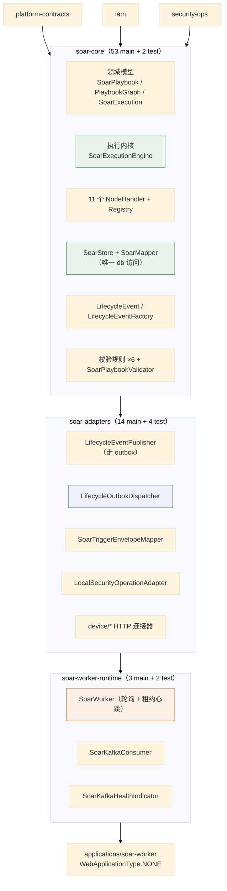
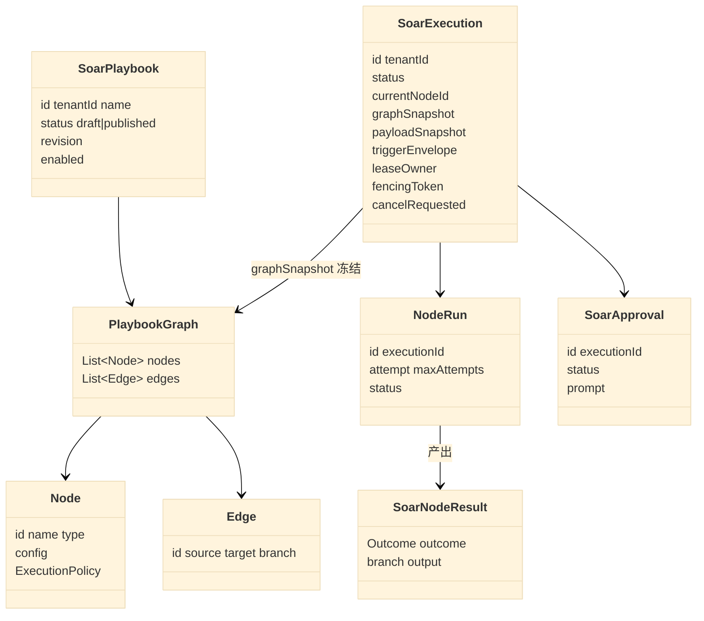
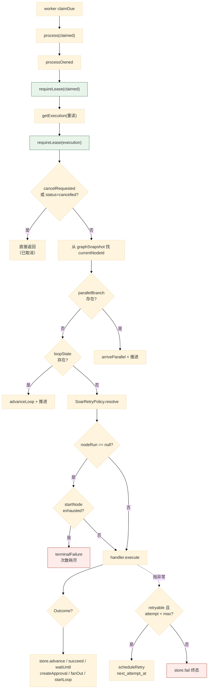
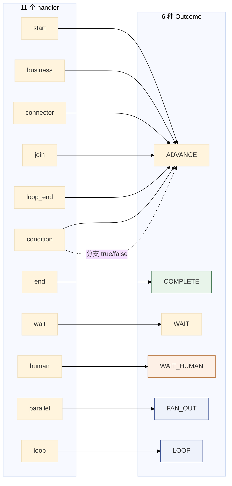
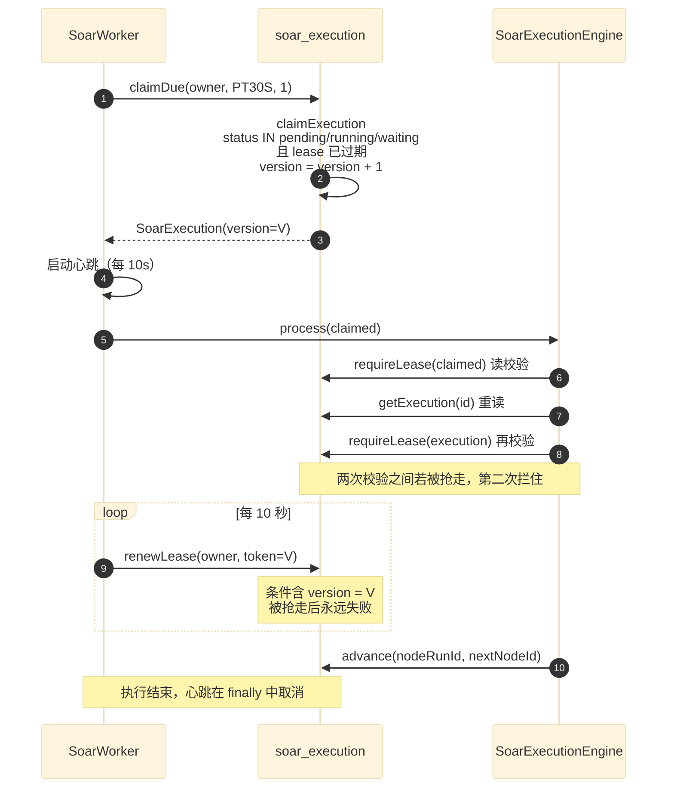
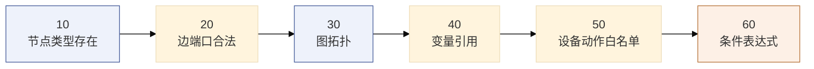
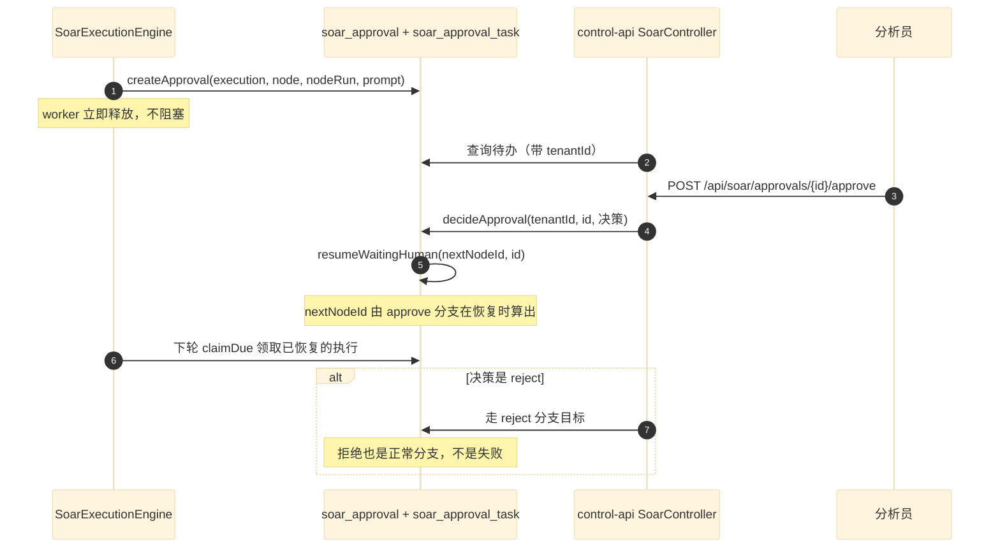
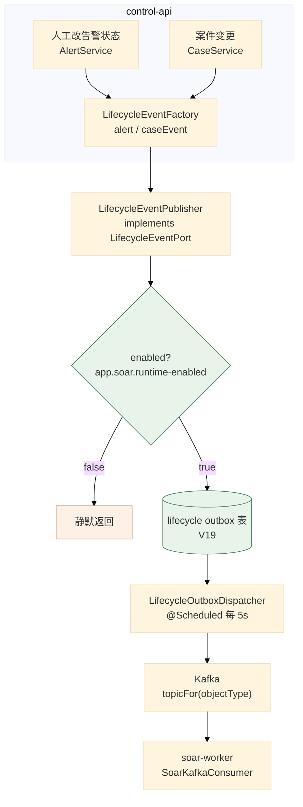
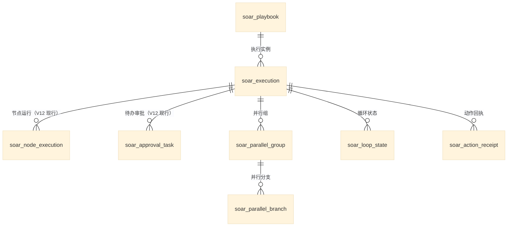
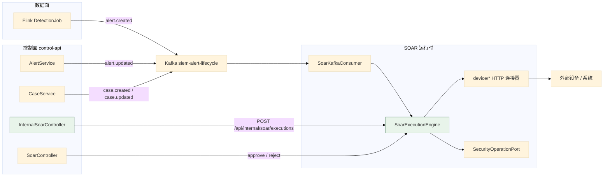

# 04 SOAR 执行子系统

> **文档类型**：子系统深挖（代码级核验，非设计提案）
> **分析对象**：`D:\Project\SIEM` 的 SOAR 运行时——`modules/soar-core`（53 main）+ `modules/soar-adapters`（14 main）+ `modules/soar-worker-runtime`（3 main）+ `applications/soar-worker`
> **取证范围**：SOAR 三个模块 70 个 main 文件 + `SoarMapper.xml` + V8–V15 共 8 个迁移
> **取证方式**：源码直读 + grep 统计；每个关键论断附 `file:line` 锚点
> **结论以当前代码为准**（分支 `add_frame` @ `36b967f`）
> **文档集**：00–06 共 7 篇，见 [`README.md`](README.md)

---

## 为什么 SOAR 独立成篇

**四条代码事实确定了这条边界**：

1. **独立进程**：`applications/soar-worker` 是 `WebApplicationType.NONE` 的独立 Spring Boot 应用。
2. **独立的三层模块链**：`soar-core` → `soar-adapters` → `soar-worker-runtime` 是单向依赖，**与其他域无交叉**（只依赖 `platform-contracts`、`iam`、`security-ops`）。
3. **独立迁移组**：V8–V15 共 8 个迁移，全部是 SOAR 主题。
4. **独立组合根**：`SoarWorkerApplication` 只扫 control + soar，**不依赖 control-api**（`CLAUDE.md` §仓库布局）。

**分层强制是显式的**（`CLAUDE.md` §关键知识点 12）：

> `soar-core` 只包含传输无关模型/引擎/SPI，**不得引入 Kafka、Actuator health、`java.net.http` 或 scheduled worker loop**；Kafka/HTTP 适配在 `soar-adapters`，Kafka consumer/health/lease worker 在 `soar-worker-runtime`。

**实测这条约束在文件分布上成立**：`soar-adapters` 里有 `SoarKafkaConsumer` 之外的 Kafka/HTTP 代码，`soar-core` 的 `pom.xml` 不含对应依赖。

---

## 1. 三层模块与职责



| 层 | 模块 | 包含 | 不包含 |
| --- | --- | --- | --- |
| 内核 | `soar-core` | 模型、引擎、SPI、handler、Store、Mapper、校验 | Kafka、HTTP、定时任务 |
| 适配 | `soar-adapters` | Kafka 生产者/消费者装配、HTTP 连接器、outbox 派发 | Spring 定时调度宿主 |
| 宿主 | `soar-worker-runtime` | 轮询、租约心跳、消费循环、健康指示器 | 业务逻辑 |

> **`soar-core` 的测试文件只有 2 个，`soar-adapters` 有 4 个，`soar-worker-runtime` 有 2 个**——而 `control-api` 里有 45 个测试文件。SOAR 的深度集成测试（租约/fencing/并行/循环）在 `control-api` 的 `SoarRuntimeIntegrationTest`（`CLAUDE.md` §持久化约定第 6 条：*「H2 PostgreSQL 模式跑全 Soar 租约/fencing/并行/循环路径」*）。

---

## 2. 领域模型

### 2.1 关键论断

**论断 1：Playbook 图是「节点 + 边 + 每节点执行策略」的扁平记录。**

```java
// modules/soar-core/.../PlaybookGraph.java:7-35（节选）
public record PlaybookGraph(List<Node> nodes, List<Edge> edges) {
    public record Node(String id, String name, String type, Map<String, Object> config,
                       ...) {
        public Node(String id, String name, String type, Map<String, Object> config, ...) {...}
    }
    public record ExecutionPolicy(int maxAttempts, long initialDelaySeconds, ...) {
        public static ExecutionPolicy defaults() {...}
    }
    public record Edge(String id, String source, String target, String branch) { }
}
```

**边用 `(source, target, branch)` 三元组标识分支**——不是「一个节点一个 next」。这是**多分支与并行/条件节点的建模基础**。

**论断 2：图的拓扑复杂度被「节点类型」吸收，不是被「边」吸收。**

`SoarGraphRouter` **只有 13 行**——它只做一次边查找：

```java
// SoarGraphRouter.java:8-13
public String next(PlaybookGraph graph, String source, String branch) {
    return graph.edges().stream()
            .filter(edge -> edge.source().equals(source) && branch.equals(edge.branch()))
            .map(PlaybookGraph.Edge::target).findFirst()
            .orElseThrow(() -> new IllegalStateException("节点 " + source + " 缺少 " + branch + " 分支"));
}
```

**没有环检测、没有拓扑排序、没有可达性分析。** 原因：**环路不靠通用图算法表达，而是靠 `loop` / `loop_end` 节点对显式建模**。所以运行时的路由永远是「按分支取下一个节点」——**复杂度被前移到了校验期**（见 §5）与**节点类型**（见 §3）。

**论断 3：执行有一个「图快照」，执行期间不重新读 Playbook。**

```java
// SoarExecutionEngine.java:56-59
PlaybookGraph.Node node = execution.graphSnapshot().nodes().stream()
        .filter(candidate -> candidate.id().equals(execution.currentNodeId())).findFirst()
        .orElseThrow(() -> new IllegalStateException(
                "执行快照缺少当前节点: " + execution.currentNodeId()));
```

`execution.graphSnapshot()` —— **执行开始时的图被冻结在 `SoarExecution` 里**。所以执行中途改 Playbook **不影响在途执行**。

**论断 4：`SoarExecution.NodeRun` 是「一次节点尝试」的持久化实体。**

从 `SoarMapper.xml` 的方法集可反推（`SoarMapper.java:232-285`）：`selectResumableNodeRun`、`insertNodeRun`、`markNodeRunRetrying`、`updateNodeRunInput`、`finishNodeRun`、`finishNodeRunNoGuard`、`setNodeRunWaiting`、`setNodeRunWaitingHuman`、`cancelNodeRuns`、`failParentNodeRun`。

**注意 `finishNodeRun` 与 `finishNodeRunNoGuard` 是两个方法**——带 guard 的那个守卫的是 **node-run 状态白名单**（`WHERE id = ? AND status IN ('running','waiting','waiting_human','retrying')`，`SoarMapper.xml:496-502`），**不是租约/版本**；`finishNodeRunNoGuard` 无任何 WHERE 守卫，用于并行 join 与 loop 完成两条清理路径。

租约/版本校验在**别的语句**（`renewLease` 的 `lease_owner = ? AND version = ?`、`selectLeaseHolders` 的 `FOR UPDATE`）。`SoarStore.finishNode` 的语义是「更新行数 ≠ 1 就抛 `IllegalStateException`」。

### 2.2 模型关系



---

## 3. 执行内核

### 3.1 关键论断

**论断 1：引擎独占全部状态迁移，这是写在类注释里的铁律。**

```java
// SoarExecutionEngine.java:15（类注释）
/** Durable execution kernel. Node handlers calculate outcomes; this class owns every state transition. */
```

同样的意思在 `SoarNodeResult` 上复述了一遍：

```java
// SoarNodeResult.java:9（类注释）
/** A handler describes the outcome; only the execution engine is allowed to commit transitions. */
```

**两处独立注释指向同一条约束**——说明它是刻意的设计决定，不是偶然的代码组织。

**论断 2：一次 `process` = 一次节点尝试，不是「跑完整条流程」。**

```java
// SoarExecutionEngine.java:41-42
/** Executes one durable node attempt. A later worker claim advances the next node. */
public void process(SoarExecution claimed) {
```

**这是 durable execution 的核心手法**：每个节点尝试独立提交，**进程崩溃最多丢失一个节点的进度**，且因为 `SoarStore` 的状态机，恢复后从 DB 里的 `current_node_id` 继续。**没有「内存里跑完整条流程」的路径。**

**论断 3：租约在引擎内被**两次**校验——一次对参数，一次对重读的对象。**

```java
// SoarExecutionEngine.java:51-55
private void processOwned(SoarExecution claimed) {
    store.requireLease(claimed);
    SoarExecution execution = store.getExecution(claimed.id());
    store.requireLease(execution);
    if (execution.cancelRequested() || "cancelled".equals(execution.status())) return;
```

**为什么校验两次**：`claimed` 是 worker 领取时拿到的快照；`execution` 是从 DB 重读的。**如果两次之间租约已过期（或被别的 worker 抢走），第二次校验会拦住**。这是 TOCTOU 的正确处理——**重读之后必须重新验证**。

**论断 4：取消检查在租约校验之后，所以「取消」也不会绕过 fencing。**

```java
// SoarExecutionEngine.java:55
if (execution.cancelRequested() || "cancelled".equals(execution.status())) return;
```

**顺序很重要**：先 `requireLease`（可能抛 `SoarLeaseLostException`），再判 cancel。**过期租约的持有者连「发现取消」的资格都没有**——它直接被 fencing 拦掉。

**论断 5：`SoarLeaseLostException` 在 engine 里被**重新抛出**，不被吞掉。**

```java
// SoarExecutionEngine.java:43-49
try {
    processOwned(claimed);
} catch (SoarLeaseLostException lost) {
    LOG.warn("SOAR stale worker result fenced execution={} owner={} token={}",
            claimed.id(), claimed.leaseOwner(), claimed.fencingToken());
}
```

```java
// SoarExecutionEngine.java:97-99
} catch (SoarLeaseLostException lost) {
    throw lost;
} catch (RuntimeException e) {
```

**外层吞掉并**降级为 warn 日志**（这是正常的 fencing 结果，不是错误）；内层显式重抛，**避免它被通用的 `catch (RuntimeException e)` 当作「可重试的节点失败」处理**。

> **这条内层重抛是很容易漏掉的写法**。如果没有 `:97-99`，丢失租约会被 `:99` 的通用 catch 捕获 → 走 `retryable(e)` → 因为 `SoarLeaseLostException` 不是那三个白名单异常 → **被判为可重试** → 调度重试。那会让「已被 fencing 的 worker」重新写入状态，**直接破坏 fencing 语义**。

**论断 6：节点结果有 6 种 outcome，每种都有对应的强制校验。**

```java
// SoarNodeResult.java:56-63
public enum Outcome {
    ADVANCE,
    COMPLETE,
    WAIT,
    WAIT_HUMAN,
    FAN_OUT,
    LOOP
}
```

`commit` 的 switch 对**每一种**都做前置校验（`SoarExecutionEngine.java:119-164`）：

| Outcome | 强制校验 | 行 | 不满足时 |
| --- | --- | --- | --- |
| `ADVANCE` | `result.branch()` 必须在 `handler.outgoingBranches()` 里 | `:121-123` | 抛「返回了非法分支」 |
| `COMPLETE` | `handler.outgoingBranches()` **必须为空** | `:128-130` | 抛「只有终止节点可以结束执行」 |
| `WAIT` | `resumeAt` 非空**且在未来** | `:135-137` | 抛「必须返回未来的恢复时间」 |
| `WAIT_HUMAN` | `approvalPrompt` 非空白 | `:141-143` | 抛「人工节点必须返回审批提示语」 |
| `FAN_OUT` | 分支数 ≥2 **且** `joinNode` 非空 | `:147-149` | 抛「必须返回至少两个分支和 join 节点」 |
| `LOOP` | body 起止非空、items 非空、`maxIterations >= items.size()` | `:157-160` | 抛「返回了非法的持久化循环状态」 |

**这是一组「handler 与引擎的契约断言」**——handler 是扩展点（可能有第三方实现），所以引擎**不信任 handler 的返回值**，每条都验。**`COMPLETE` 那条最能说明问题**：它靠 `outgoingBranches().isEmpty()` 来判断「这是不是终止节点」——**所以 `end` handler 的 `outgoingBranches()` 返回空集，`SoarEndNodeHandler.java:27-28`**。

**论断 7：`LOOP` 的校验里有一条容易忽略的算术约束。**

```java
// SoarExecutionEngine.java:157-159
if (result.loopBodyStart() == null || result.loopBodyEnd() == null
        || result.loopItems().isEmpty() || result.loopMaxIterations() < result.loopItems().size()) {
    throw new IllegalStateException("循环节点返回了非法的持久化循环状态");
}
```

**`loopMaxIterations() < loopItems().size()`** —— 即**迭代上限不能小于待处理项数**。**这条防的是「循环声明了 N 项但只允许跑 M<N 次」**——那会导致部分项被静默跳过。

**论断 8：重试白名单是「三个异常类型不可重试」，其余都可重试。**

```java
// SoarExecutionEngine.java:186-190
private boolean retryable(RuntimeException error) {
    return !(error instanceof IllegalArgumentException
            || error instanceof ConflictException
            || error instanceof NotFoundException);
}
```

**语义是「参数错、状态冲突、找不到」不该重试**（重试也不会变好），**其余（网络超时、下游 5xx 等）可重试**。这是**默认可重试**的乐观策略，与「默认不可重试」的保守策略相反。

**论断 9：重试有独立的状态与调度时间，不是立即重跑。**

```java
// SoarExecutionEngine.java:100-109
String message = message(e);
if (nodeRun != null && retryable(e) && nodeRun.attempt() < retryPolicy.maxAttempts()) {
    Instant nextAttempt = Instant.now().plus(retryPolicy.delayAfter(nodeRun.attempt()));
    store.scheduleRetry(execution, nodeRun.id(), message, nextAttempt);
    retried.increment();
    LOG.warn("SOAR node retry scheduled execution={} node={} attempt={} next={}: {}",
            execution.id(), node.id(), nodeRun.attempt(), nextAttempt, message);
} else {
    terminalFailure(execution, node, nodeRun, message, e);
}
```

**`scheduleRetry` 写入 `next_attempt_at`**——所以重试也是**持久的、跨进程的**。worker 下次 `claimDue` 时会按时间领取。

**论断 10：`attempt` 用尽是一条**终态失败**，且错误消息是专门的。**

```java
// SoarExecutionEngine.java:85-89
if (started.exhausted()) {
    terminalFailure(execution, node, nodeRun,
            "节点执行次数已耗尽: " + retryPolicy.maxAttempts(), null);
    return;
}
```

**注意 `cause` 传 `null`**（`:87`）——所以日志走的是「无异常对象」分支（`:196-198`），只打消息。**「次数耗尽」不是某个具体异常导致的，而是累计结果**。

**论断 11：节点配置在**执行前**做模板解析，且解析两次。**

```java
// SoarExecutionEngine.java:80-93（节选）
Map<String, Object> resolvedConfig = templates.resolveMap(node.config(), context.templateVariables());
if (nodeRun == null) {
    SoarStore.StartAttempt started = store.startNode(execution, node,
            context.persistedInput(handler.auditSafeConfig(resolvedConfig)), retryPolicy.maxAttempts());
    nodeRun = started.run();
    if (started.exhausted()) { ... }
    context = context(execution, node, nodeRun, outputs, variables);
    resolvedConfig = templates.resolveMap(node.config(), context.templateVariables());
    store.updateNodeInput(execution, nodeRun.id(),
            context.persistedInput(handler.auditSafeConfig(resolvedConfig)));
}
SoarNodeResult result = handler.execute(context, resolvedConfig);
```

**为什么解析两次**：`startNode` 会分配 `nodeRun.id` 与递增 `sequence`，而 **`context.templateVariables()` 依赖这两个值**。所以第一次解析是为了**算出要持久化的 input**（此时还没有 nodeRun），第二次是**用真实 nodeRun 重解析**并更新持久化 input，然后才交给 handler。

**论断 12：持久化的节点输入经两步脱敏——`auditSafeConfig` 先过滤，`persistedInput` 再包装。**

```java
context.persistedInput(handler.auditSafeConfig(resolvedConfig))
```

**`handler.auditSafeConfig(...)` 是 SPI 上的方法**——每个 handler 自己决定哪些配置可以进审计（见 §8 不变式）。`SoarMessage`/secret 类的字段应在这一步被剔除。

**论断 13：`FAN_OUT` 与 `LOOP` 在**进入**时就走专门分支，不经过 handler。**

```java
// SoarExecutionEngine.java:61-72
SoarStore.ParallelBranch parallelBranch = store.parallelBranch(execution.id(), node.id());
if (parallelBranch != null) {
    store.arriveParallel(execution, parallelBranch,
            router.next(execution.graphSnapshot(), node.id(), "next"));
    return;
}
SoarStore.LoopState loopState = store.loopState(execution.id(), node.id());
if (loopState != null) {
    store.advanceLoop(execution, loopState,
            router.next(execution.graphSnapshot(), node.id(), "next"));
    return;
}
```

**当节点处于「并行分支」或「循环体」中时，它不执行自己的 handler**——而是标记「到达」并推进到下一个节点。**handler 只在首次进入 `parallel` / `loop` 节点时运行一次**，负责算出分支列表与迭代项。

**这解释了持久化的 `soar_parallel_branch` 与 `soar_loop_state` 表存在的必要性**：它们是「节点已经被 fan-out / 进入循环」的标记，让引擎在重新领取同一节点时知道「我该走 arrive/advance 而不是 execute」。

### 3.2 执行内核流



---

## 4. 十一个节点处理器

### 4.1 关键论断

**论断 1：实测 **11** 个 `SoarNodeHandler` 实现，不是 12 个。**

```
$ grep -rl "implements SoarNodeHandler" --include=*.java modules/ | wc -l
11
```

| # | `type()` | 实现类 | `outgoingBranches()` |
| --- | --- | --- | --- |
| 1 | `start` | `SoarStartNodeHandler.java:11-12` | `next`（默认） |
| 2 | `end` | `SoarEndNodeHandler.java:12-13` | **空集**（`SoarEndNodeHandler.java:27-28`） |
| 3 | `condition` | `SoarConditionNodeHandler.java:23-24` | **`{true, false}`**（`:59-60`） |
| 4 | `human` | `SoarHumanNodeHandler.java:12-13` | **`{approve, reject}`**（`:29-30`） |
| 5 | `business` | `SoarBusinessNodeHandler.java:20-21` | `next`（默认） |
| 6 | `wait` | `SoarWaitNodeHandler.java:16-17` | `next`（默认） |
| 7 | `connector` | `execution/handler/SoarConnectorNodeHandler.java:30-31` | `next`（默认） |
| 8 | `join` | `execution/handler/SoarJoinNodeHandler.java:15-16` | `next`（默认） |
| 9 | `loop` | `execution/handler/SoarLoopNodeHandler.java:18-19` | `next`（默认） |
| 10 | `loop_end` | `execution/handler/SoarLoopEndNodeHandler.java:15-16` | `next`（默认） |
| 11 | `parallel` | `execution/handler/SoarParallelNodeHandler.java:20-21` | `next`（默认） |

**论断 2：默认分支是 `next`，只有三个 handler 覆写它。**

```java
// SoarNodeHandler.java:15-17
default Set<String> outgoingBranches() {
    return Set.of("next");
}
```

**只有 `end`（空集）、`condition`（true/false）、`human`（approve/reject）覆写**。**这是一个很好的默认值选择**：绝大多数节点就是单出口，只有 3 个节点需要多分支。

**论断 3：注册表拒绝重复 type，且拒绝空 type。**

```java
// SoarNodeHandlerRegistry.java:15-27
public SoarNodeHandlerRegistry(List<SoarNodeHandler> candidates) {
    Map<String, SoarNodeHandler> registered = new LinkedHashMap<>();
    for (SoarNodeHandler handler : candidates) {
        if (handler.type() == null || handler.type().isBlank()) {
            throw new IllegalStateException("SOAR NodeHandler type 不能为空");
        }
        SoarNodeHandler previous = registered.put(handler.type(), handler);
        if (previous != null) {
            throw new IllegalStateException("SOAR NodeHandler 重复注册: " + handler.type());
        }
    }
    handlers = Map.copyOf(registered);
}
```

**构造期就抛异常 → 应用启动失败。** 这是 fail-fast：**重复 type 会在启动时暴露，而不是在某个执行流走到那个节点时才暴露**。

**论断 4：注册表靠 Spring 注入全部实现，没有手工注册清单。**

```java
public SoarNodeHandlerRegistry(List<SoarNodeHandler> candidates) {
```

**Spring 会把所有 `SoarNodeHandler` bean 收集进 `List`**。所以**新增 handler = 新增一个 `@Component`，不改任何注册代码**。这与数据面 `RuleRegistry` 的硬编码列表（02 篇 §4.1 论断 1）形成对比。

**论断 5：未知节点类型在引擎里抛 `IllegalArgumentException`。**

```java
// SoarNodeHandlerRegistry.java:29-33
public SoarNodeHandler require(String type) {
    SoarNodeHandler handler = handlers.get(type);
    if (handler == null) throw new IllegalArgumentException("不支持的节点类型: " + type);
    return handler;
}
```

**`IllegalArgumentException` 在 `retryable()` 的白名单里**（`SoarExecutionEngine.java:187`）——所以未知节点类型**不会重试，直接终态失败**。这是正确判断：重试不会让一个不存在的 handler 出现。

### 4.2 六种 Outcome 与 handler 的映射



---

## 5. 租约与 fencing：SQL 层面的实现

### 5.1 关键论断

**论断 1：领取（claim）与续租（renew）是两条不同的 SQL，语义不对称。**

```xml
<!-- SoarMapper.xml:275-283 -->
<update id="claimExecution">
  UPDATE soar_execution SET lease_owner = #{owner,jdbcType=VARCHAR},
    lease_expires_at = #{leaseUntil,jdbcType=TIMESTAMP},
    status = 'running', started_at = COALESCE(started_at, CURRENT_TIMESTAMP),
    updated_at = CURRENT_TIMESTAMP, version = version + 1
  WHERE id = #{id,jdbcType=VARCHAR}
    AND status IN ('pending','running','waiting')
    AND (lease_expires_at IS NULL OR lease_expires_at &lt; CURRENT_TIMESTAMP)
</update>
```

```xml
<!-- SoarMapper.xml:285-291 -->
<update id="renewLease">
  UPDATE soar_execution SET lease_expires_at = #{leaseUntil,jdbcType=TIMESTAMP},
    updated_at = CURRENT_TIMESTAMP
  WHERE id = #{id,jdbcType=VARCHAR} AND status = 'running' AND cancel_requested = FALSE
    AND lease_owner = #{owner,jdbcType=VARCHAR} AND version = #{fencingToken,jdbcType=BIGINT}
    AND lease_expires_at &gt;= CURRENT_TIMESTAMP
</update>
```

**四处不对称，每一处都有意义**：

| 维度 | `claimExecution` | `renewLease` |
| --- | --- | --- |
| **owner 条件** | 无（谁都能抢空闲的） | **必须等于自己** |
| **version 条件** | 无（并递增 version） | **必须等于自己的 fencingToken** |
| **过期条件** | **必须已过期或为空** | **必须未过期** |
| **status 条件** | `IN ('pending','running','waiting')` | **仅 `'running'`** |

**`claimExecution` 递增 `version`，`renewLease` 校验 `version`** —— **`version` 列就是 fencing token**。新领取者让 `version+1`，于是**旧持有者的 `renewLease` 永远匹配不上**（`version = #{fencingToken}` 失败）。

**论断 2：`renewLease` 还额外要求 `cancel_requested = FALSE`。**

**取消请求会让续租失败** → 心跳日志会报「lease renewal rejected」→ 但**执行本身不会立即停**。真正的停止来自引擎里的取消检查（`SoarExecutionEngine.java:55`）。

**论断 3：`selectLeaseHolders` 是「校验租约」的读版本，且可选加 `FOR UPDATE`。**

```xml
<!-- SoarMapper.xml:293-297 -->
<select id="selectLeaseHolders" resultType="string">
  SELECT id FROM soar_execution WHERE id = #{id,jdbcType=VARCHAR}
    AND status = 'running' AND cancel_requested = FALSE AND lease_owner = #{owner,jdbcType=VARCHAR}
    AND version = #{fencingToken,jdbcType=BIGINT} AND lease_expires_at &gt;= CURRENT_TIMESTAMP
    <if test="lock">FOR UPDATE</if>
</select>
```

**`store.requireLease(execution)` 就是调它**（`SoarExecutionEngine.java:52,54`）。`<if test="lock">FOR UPDATE</if>` 让调用方决定是否加行锁——**在已经处于事务里、需要串行化时用得上**。

**注意 `selectLeaseHolders` 与 `renewLease` 的条件几乎相同**（status=running、cancel_requested=FALSE、owner 匹配、version 匹配、未过期）——**校验与续租用同一套判据**。

**论断 4：worker 的 `owner` 是「JVM 名 + 随机 UUID」。**

```java
// SoarWorker.java:31
private final String owner = ManagementFactory.getRuntimeMXBean().getName() + ":" + UUID.randomUUID();
```

**`getRuntimeMXBean().getName()` 通常是 `pid@hostname`**。所以 owner 形如 `12345@host:8f3a...`——**既能定位到进程，又保证同一进程重启后不复用身份**。

**对照**：`CaseMirrorDispatcher` 与 `LifecycleOutboxDispatcher` 的 owner 只有 `UUID.randomUUID()`（01 篇 §5.1 论断 4），**没有 JVM 名**。三种 owner 构造方式不同，但都保证唯一性。

**论断 5：心跳间隔是租约的 1/3，且封顶 10 秒。**

```java
// SoarWorker.java:60
long heartbeatMillis = Math.max(1L, Math.min(10_000L, lease.toMillis() / 3L));
```

**默认租约 `PT30S` → 心跳 10 秒**（正好是封顶值）。**1/3 是标准的租约心跳比**：保证在租约过期前至少有 2 次续租机会。

**论断 6：续租失败只记一次警告，不中止执行。**

```java
// SoarWorker.java:61-70
ScheduledFuture<?> heartbeat = leaseRenewer.scheduleAtFixedRate(() -> {
    try {
        if (!store.renewLease(execution, lease) && reportedLost.compareAndSet(false, true)) {
            LOG.warn("SOAR lease renewal rejected execution={} owner={} token={}",
                    execution.id(), execution.leaseOwner(), execution.fencingToken());
        }
    } catch (RuntimeException error) {
        LOG.warn("SOAR lease renewal failed execution={}", execution.id(), error);
    }
}, heartbeatMillis, heartbeatMillis, TimeUnit.MILLISECONDS);
```

**`reportedLost.compareAndSet(false, true)` 保证只报一次**（否则每 10 秒刷一条）。**心跳的职责是「尽力续租」，不是「监控」**——真正的中止由引擎里的 `requireLease` 完成。

**论断 7：心跳在 `finally` 里取消，无论节点成功还是抛异常。**

```java
// SoarWorker.java:71-75
try {
    engine.process(execution);
} finally {
    heartbeat.cancel(false);
}
```

**`cancel(false)` 不打断正在跑的心跳**（允许当前这次跑完），避免在线程池任务里抛 `InterruptedException`。

**论断 8：`leaseRenewer` 是单线程守护线程池，且 `@PreDestroy` 关闭。**

```java
// SoarWorker.java:42-46
this.leaseRenewer = Executors.newSingleThreadScheduledExecutor(task -> {
    Thread thread = new Thread(task, "soar-lease-renewer");
    thread.setDaemon(true);
    return thread;
});
```

```java
// SoarWorker.java:78-81
@PreDestroy
void close() {
    leaseRenewer.shutdownNow();
}
```

**单线程**：`poll()` 是 `@Scheduled` 串行的（`fixedDelay`），一次只处理一个执行，所以心跳也只需要一个线程。

### 5.2 fencing 时序



---

## 6. 校验：六条规则，按序执行

### 6.1 关键论断

**论断 1：六条校验规则有显式 `order()`，编号间隔为 10。**

| # | `order()` | 规则 | 校验什么 |
| --- | --- | --- | --- |
| 1 | **10** | `NodeTypeValidationRule` | 节点类型存在 |
| 2 | **20** | `EdgePortValidationRule` | 边的分支端口合法 |
| 3 | **30** | `GraphTopologyValidationRule` | 图拓扑（连通、可达） |
| 4 | **40** | `VariableReferenceValidationRule` | 变量引用可解析 |
| 5 | **50** | `DeviceActionValidationRule` | 设备动作在白名单（依赖 `SoarConnectorRegistry`） |
| 6 | **60** | `ConditionValidationRule` | 条件表达式合法 |

**编号间隔 10 是刻意的**——留出插入新规则的余量。**顺序是「结构 → 引用 → 语义」**：



**为什么这个顺序重要**：**先验结构再验语义**——如果节点类型都不存在，去检查它的变量引用是没意义的（会产生误导性错误）。**这避免了「一个根本性的错误产生 20 条下游噪音错误」**。

**论断 2：`DeviceActionValidationRule` 需要外部依赖，其他五条不需要。**

```java
// DeviceActionValidationRule.java:12
public DeviceActionValidationRule(SoarConnectorRegistry connectors) {
```

**证明这一点的是构造器签名**——它注入 `SoarConnectorRegistry`。**校验规则也可以是有依赖的 bean**，不是纯函数。

**论断 3：规则实现 `SoarPlaybookValidationRule` 接口，`order()` 有默认值。**

```java
// SoarPlaybookValidationRule.java:4-6
public interface SoarPlaybookValidationRule {
    default int order() {
```

**有默认值意味着「不关心顺序的规则可以不写 `order()`」**——但实测六条规则**都显式写了**。这说明当前所有规则都有顺序敏感性。

### 6.2 校验上下文

`SoarValidationContext` 是规则的入参载体（`playbook/validation/SoarValidationContext.java`）——**六条规则共享同一个上下文对象**，每条往里加自己的发现。这是「校验器链 + 共享上下文」的标准形态。

---

## 7. 人工审批

### 7.1 关键论断

**论断 1：人工节点不阻塞 worker，而是「落库后释放」。**

```java
// SoarExecutionEngine.java:140-145
case WAIT_HUMAN -> {
    if (result.approvalPrompt() == null || result.approvalPrompt().isBlank()) {
        throw new IllegalStateException("人工节点必须返回审批提示语");
    }
    store.createApproval(execution, node, nodeRun, result.approvalPrompt());
}
```

**`createApproval` 之后就返回了**——worker 立刻去处理下一个执行。**审批是异步的，不占用 worker 时间**。这是 SOAR 能处理大量待审批实例的前提。

**论断 2：审批表是 `soar_approval`（V11）+ `soar_approval_task`（V12）。**

`SoarMapper.xml` 对 `soar_approval_task` 有 **6 处**引用。**两张表的分工**：

- `soar_approval` —— **审批的业务实体**（对应一次人工节点）
- `soar_approval_task` —— **待办任务**（让审批出现在某人的待办列表里）

**这是「业务实体 + 待办索引」的拆分**——同一次审批，一张表存事实，一张表供查询。

**论断 3：审批决策用 `decideApproval`，且有租户参数。**

从 `SoarMapper.java` 的方法集可见：`selectApproval(tenantId, id)`（`:297`）、`decideApproval(...)`（`:311`）——**审批查询与决策都带租户**，所以审批不能跨租户看到或决定。

**论断 4：审批通过后的恢复走 `resumeWaitingHuman`，取消走 `cancelPendingApprovals`。**

```java
// SoarMapper.java 方法集
int resumeWaitingHuman(@Param("nextNodeId") String nextNodeId, @Param("id") String id);   // :154
int cancelPendingApprovals(@Param("executionId") String executionId);                    // :318
```

**`resumeWaitingHuman` 显式接收 `nextNodeId`**——所以**审批的 `approve` 分支目标在恢复时才确定**，即恢复时重新走一次 `router.next(...)`。

**论断 5：`human` 节点的两个分支是 `approve` / `reject`（实测）。**

```java
// SoarHumanNodeHandler.java:29-30
public Set<String> outgoingBranches() {
    return Set.of("approve", "reject");
}
```

**所以「拒绝」也是一条正常分支，不是失败**——Playbook 可以为拒绝设计后续动作（比如通知、记录）。**这与「Agent 建议、人工授权」的分工一致**：拒绝是预期内的结果。

### 7.2 人工审批流



---

## 8. 生命周期事件

### 8.1 关键论断

**论断 1：控制面侧共有 **4** 种事件类型，且按类型决定业务时间字段。**

```java
// modules/soar-core/.../LifecycleEventFactory.java:54-59
String primary = switch (eventType) {
    case "alert.created" -> "@timestamp";
    case "alert.updated" -> "alert.status_updated_at";
    case "case.created" -> "case.created_at";
    case "case.updated" -> "case.updated_at";
    default -> throw new IllegalArgumentException("不支持的生命周期事件: " + eventType);
};
```

**四种类型成对**：alert 的 created/updated，case 的 created/updated。**取时间的字段按语义选**——`created` 用创建时间，`updated` 用**状态变更时间**。

**论断 2：`producer` 是 `"hsiem-control"`——与 Flink 的 `"hsiem-flink"` 区分。**

```java
// LifecycleEventFactory.java:32-33（alert）
return new LifecycleEvent(messageId(eventType, tenantId, "alert", alert.get("id"), occurredAt),
        eventType, occurredAt, "hsiem-control", tenantId, alert, null);
```

```java
// LifecycleEventFactory.java:46-47（case）
return new LifecycleEvent(messageId(eventType, tenantId, "case", caseObject.get("id"), occurredAt),
        eventType, occurredAt, "hsiem-control", tenantId, null, caseObject);
```

**两个生产者标识让消费方能分辨事件来源**：Flink 只发 `alert.created`（数据面检测到），控制面发全部四种（人改状态、案件变更）。

**注意最后一个参数**：alert 事件带 `alert`、`case` 为 null；case 事件反之。**所以一条生命周期事件只描述一种对象**。

**论断 3：`id` 取值有回退链——`_id` 优先，回退到 `alert.id`。**

```java
// LifecycleEventFactory.java:21
put(alert, "id", first(source, "_id", "alert.id"));
```

```java
// LifecycleEventFactory.java:39
put(caseObject, "id", first(source, "case.id", "_id"));
```

**告警优先用 `_id`（ES 文档 id），案件优先用 `case.id`**——**两者的优先级正好相反**。原因是告警的事实源在 ES（文档 id 是权威身份），案件的事实源在 PG（`case.id` 是权威身份）。**这与 01 篇 §4.1 论断 4 和 §5.1 论断 1 的两条边界完全一致**。

**论断 4：事件进入 outbox，由独立 dispatcher 投递——与案件镜像是同一模式。**

```java
// modules/soar-adapters/.../LifecycleEventPublisher.java:69-80
store.enqueueLifecycle(
        event.messageId(), event.eventType(), event.effectiveTenantId(),
        event.objectType(), event.objectId(), event.occurredAt(),
        properties.topicFor(event.objectType()), event.objectId(), body);
```

**`enqueueLifecycle` 是 `LifecycleOutboxStore` 的方法**（`control/LifecycleOutboxStore.java`）——与 `CaseStore.enqueueCaseMirror` 是**同构的两个 outbox**，共享 `platform-migrations/V19__lifecycle_outbox.sql` 与 V7 的 outbox 租约模式。

**论断 5：`topicFor(objectType)` 按对象类型选择 topic。**

```java
// modules/soar-adapters/.../SoarKafkaProperties.java:84
public String topicFor(String objectType) {
```

**所以 alert 事件与 case 事件可以进不同 topic**（由 `SoarKafkaProperties` 配置决定），消费方按需订阅。

**论断 6：`publish` 在 `enabled=false` 时静默返回。**

```java
// LifecycleEventPublisher.java:51-52
public void publish(LifecycleEvent event) {
    if (!enabled) return;
```

**`enabled` 来自 `app.soar.runtime-enabled`**（`LifecycleEventPublisher.java:33`，默认 `true`）。**静默**——不报错、不计数。这与 01 篇 §6.1 论断 8 是同一条观察。

### 8.2 事件产生与投递



---

## 9. 持久化：单数运行时与冻结的复数表

### 9.1 关键论断

**论断 1：`SoarMapper.xml` 只引用 8 张表，全部是单数命名。**

实测 `grep -oE "(FROM|INTO|UPDATE|JOIN) [a-z_]+" SoarMapper.xml | sort | uniq -c`：

| 引用次数 | 表 | 创建迁移 |
| --- | --- | --- |
| **28** | `soar_execution` | V11 |
| **15** | `soar_node_execution` | V12 |
| **11** | `soar_parallel_group` | V13 |
| **10** | `soar_loop_state` | V14 |
| **9** | `soar_playbook` | V11 |
| **8** | `soar_parallel_branch` | V13 |
| **6** | `soar_approval_task` | V12 |
| **2** | `soar_action_receipt` | V12 |

**注意 `soar_node_run`（V11 建）不在此列**——`SoarMapper.xml` 里对应的方法（`insertNodeRun` 等）操作的是 **`soar_node_execution`**（V12）。

**论断 2：V8 建的复数表 `soar_executions` / `soar_step_executions` 仍然存在于 schema，但**零代码引用**。**

```sql
-- V8__soar_execution.sql:2,28
CREATE TABLE soar_executions (
CREATE TABLE soar_step_executions (
```

```sql
-- V10__soar_platform_governance.sql:25-41（继续在复数表上加列、加约束、加索引）
ALTER TABLE soar_executions ADD COLUMN tenant_id VARCHAR(64) NOT NULL DEFAULT 'default';
...
ALTER TABLE soar_step_executions DROP CONSTRAINT soar_step_status_ck;
```

**实测结果**：

```bash
$ grep -rn "soar_executions\|soar_step_executions" --include=*.java --include=*.xml --include=*.vue --include=*.js . | grep -v /target/
# 命中的全部是 V8 / V9 / V10 三个迁移文件本身
```

**八个 SOAR 迁移里 `DROP TABLE` 计数全部为 0。**

> **这是本项目最值得记录的一处「反直觉真实形态」**：
>
> **V8 建的 `soar_executions` / `soar_step_executions` 从未被删除，也从未被任何 Java 或前端代码引用。** V9、V10 还在往上加列、加外键、加索引（说明当时是活跃表），但 V11 另起炉灶建了单数版 `soar_execution`，此后全部代码只走单数表。
>
> **结果是：数据库里同时存在两套 SOAR 运行时表，一套活的、一套冻结的。** 这不是 bug，是**「只加不改」的迁移纪律**的副作用——Flyway 迁移一旦发布就不修改，而删除旧表被推迟了（可能为了保留历史执行数据）。
>
> **运维含义**：接手者看到 `soar_executions` 会以为是当前表，实际它是死表。**本文档显式标注这一点。**

**论断 3：迁移编号与能力演进的分组。**

| 迁移 | 建的表 | 主题 |
| --- | --- | --- |
| V8 | `soar_executions`, `soar_step_executions` | **旧运行时（已冻结）** |
| V9 | `soar_execution_events` | 编排事件 |
| V10 | `tenants`, `tenant_memberships`, `soar_playbook_revisions`, `soar_connector_runtime`, `soar_connector_invocations` | 多租户 + 治理 |
| **V11** | **`soar_playbook`, `soar_execution`, `soar_node_run`, `soar_approval`** | **单数运行时起点** |
| V12 | `soar_node_execution`, `soar_approval_task`, `soar_action_receipt` | handler 运行时 |
| V13 | `soar_parallel_group`, `soar_parallel_branch` | 并行 |
| V14 | `soar_loop_state` | 循环 |
| V15 | （无建表）| 触发类型字段 |

**V11 是分水岭**——从这一版起换成了单数命名，并引入 `soar_node_run` / `soar_approval`。

**论断 4：`soar_playbook` 有 `soar_playbook_revisions`（V10）与之配套。**

**修订历史是独立表**——Playbook 改版留痕。`SoarStore.updatePlaybook` 带 `expectedRevision` 参数（`SoarStore.java:89-100`），`publishPlaybook` 也带（`:115-119`）——**乐观锁**。

**论断 5：`SoarStore` 是**具体类**，不套端口。**

`CLAUDE.md` §持久化约定第 3 条明确：*「例外：`SoarStore`、`SoarConnectorActionInvocation`、`SoarBusinessActionInvocation` 作为具体 `@Repository` 直接注入 `SoarMapper`（soar-core 主代码/`SoarWorkerTest` 以具体类消费，不套端口）」*。

**所以 SOAR 域的持久化分层与其他域不同**——没有 `*RepositoryPort` 接口层。**这是刻意的例外，不是遗漏。**

**论断 6：`SoarStore` 里的冲突判定是统一的辅助方法。**

```java
// SoarStore.java:110-111, 118-119
if (updated == 0) distinguishMissingOrConflict(tenantId, id);
```

**「更新影响 0 行」有两种可能：对象不存在，或版本冲突。** `distinguishMissingOrConflict` 负责区分——这是**乐观锁正确实现的关键**：不能把两种失败混报成同一种。

**论断 7：`SoarStore` 的域规则检查在 store 层，不在 SQL 层。**

```java
// SoarStore.java:125-127
if (enabled && "draft".equals(current.status())) {
    throw new ConflictException("草稿必须先发布，不能直接启用");
}
```

```java
// SoarStore.java:136-139
int active = mapper.countActiveExecutions(tenantId, id);
if (active > 0) {
    throw new ConflictException("Playbook 存在活动执行，需先取消执行实例");
}
```

**两条域规则**：草稿不能直接启用；有活动执行不能删。**它们需要「先读后写」**，所以放在 store 而不是 SQL 的 `WHERE` 子句里。注意 `deletePlaybook` 的检查（先 `countActiveExecutions` 再删）**在并发下有 TOCTOU 窗口**——见 §11。

### 9.2 表关系



**本图只画 `SoarMapper.xml` 真正读写的那 8 张表**（见 §9.1 论断 1）。零代码引用的冻结表均不在图中——它们的唯一命中是 V9/V10/V11 建表语句与测试断言；被剔除的共 6 张（`soar_executions` / `soar_step_executions` / `soar_execution_events` / `soar_playbook_revisions` / `soar_connector_runtime` / `soar_connector_invocations`），外加 V11 遗留的 `soar_node_run` 与 `soar_approval`。

---

## 10. 关键不变式（代码强制）

| # | 不变式 | 强制点 | 违反后果 |
| --- | --- | --- | --- |
| 1 | **只有引擎能迁移执行状态** | `SoarExecutionEngine.java:15`；`SoarNodeResult.java:9` 双注释 | handler 直接改状态，状态机失控 |
| 2 | **一次 `process` 只推进一个节点** | `SoarExecutionEngine.java:41-42` 注释 | 崩溃丢失多节点进度 |
| 3 | **租约在重读后必须重新校验** | `SoarExecutionEngine.java:52,54` 两次 `requireLease` | TOCTOU：过期租约持有者写入 |
| 4 | **`SoarLeaseLostException` 不被当作可重试失败** | `SoarExecutionEngine.java:97-99` 内层重抛 | fencing 语义被重试破坏 |
| 5 | **`version` 列即 fencing token** | `SoarMapper.xml:279` claim 递增；`:289` renew 校验 | 旧持有者续租成功 |
| 6 | **续租要求 owner + version 双重匹配** | `SoarMapper.xml:289` | 抢来的执行仍被原持有者续租 |
| 7 | **`COMPLETE` 只能由无出边的节点发出** | `SoarExecutionEngine.java:128-130` | 中间节点提前终止流程 |
| 8 | **分支必须在 handler 声明的闭集内** | `SoarExecutionEngine.java:121-123` | 走不存在的边 |
| 9 | **`WAIT` 的 `resumeAt` 必须在未来** | `SoarExecutionEngine.java:135-137` | 无限立即重试 |
| 10 | **循环迭代上限 ≥ 待处理项数** | `SoarExecutionEngine.java:157-159` | 静默跳过循环项 |
| 11 | **NodeHandler type 不可为空、不可重复** | `SoarNodeHandlerRegistry.java:18-24` | 启动失败（fail-fast） |
| 12 | **未知节点类型不重试** | `SoarNodeHandlerRegistry.java:31` 抛 `IllegalArgumentException` + `SoarExecutionEngine.java:187` 白名单 | 无意义重试 |
| 13 | **人工节点不阻塞 worker** | `SoarExecutionEngine.java:144` `createApproval` 后即返回 | worker 被审批等待占满 |
| 14 | **审批查询与决策都带租户** | `SoarMapper.java:297,311` | 跨租户审批 |
| 15 | **Playbook 修订用乐观锁** | `SoarStore.java:110,118` `distinguishMissingOrConflict` | 并发覆盖 |
| 16 | **草稿不能直接启用** | `SoarStore.java:125-127` | 未发布流程被执行 |
| 17 | **有活动执行不能删 Playbook** | `SoarStore.java:136-139` | 在途执行失去定义 |
| 18 | **执行图在执行开始时冻结** | `SoarExecution.graphSnapshot()`（`SoarExecutionEngine.java:56`） | 改流程影响在途执行 |

---

## 11. 与其他子系统的边界



**五条边界**：

| 边界 | 方向 | 契约 | 锚点 |
| --- | --- | --- | --- |
| 从 Kafka | 入站 | 4 种生命周期事件（`producer` 区分来源） | `LifecycleEventFactory.java:54-59` |
| 从 control-api | 入站 | `POST /api/internal/soar/executions`（服务令牌） | `SecurityConfig.java:46-74` |
| 从控制台 | 入站 | `POST /api/soar/executions`、`/approvals/{id}/approve\|reject` | `SoarController` |
| 到外部设备 | 出站 | `device/*` HTTP 连接器 + `SecurityOperationPort` | `soar-adapters/.../device/` |
| 到 PostgreSQL | 出站 | `SoarMapper` + `mybatis/soar/*.xml` | `SoarMyBatisConfiguration` |

**「Agent 建议、人工授权」这条不变式在本篇的落点**：`human` 节点的 `WAIT_HUMAN` outcome 与 `soar_approval` 表——**执行流程**在需要授权时**必须停下来等一个人**，且该等待是**持久化的**（进程重启也还在等）。

---

## 待核实

本节 12 条待核实项均已解答，答案已并入正文：复数表零代码引用且无删除迁移、`soar_node_run`→`soar_node_execution` 是 V12 的行级搬迁、`deletePlaybook` 的 TOCTOU 窗口存在且无外层保护、`auditSafeConfig` 只有 1 个 handler 覆写（其余 10 个走恒等默认）、模板语法就是 `${path.to.value}` 且无默认值/转义/函数、条件求值纯 AND 且 7 个操作符、`ConnectorAuditSanitizer` 只按 key 名子串匹配不含 value、`SoarKafkaHealthIndicator` 只看 lag 无数值阈值。

---

## 修订记录

| 版本 | 日期 | 变更 | 作者 |
| --- | --- | --- | --- |
| 1.0 | 2026-09-22 | 首版。基于 `add_frame` @ `36b967f` 取证，覆盖 SOAR 三模块 70 个 main 文件 + V8–V15 共 8 个迁移。**修正 00 篇「12 个节点处理器」为实测 11 个。** | code-level-architecture-docs skill |
