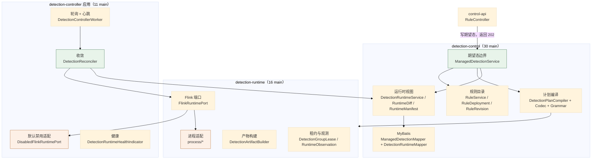
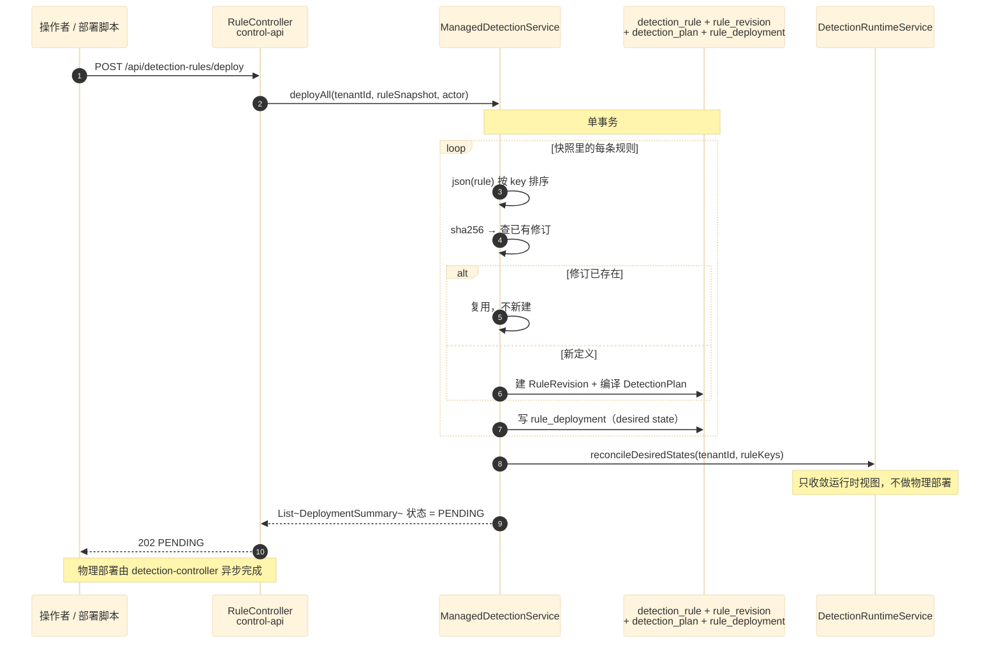
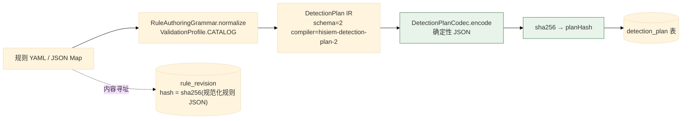
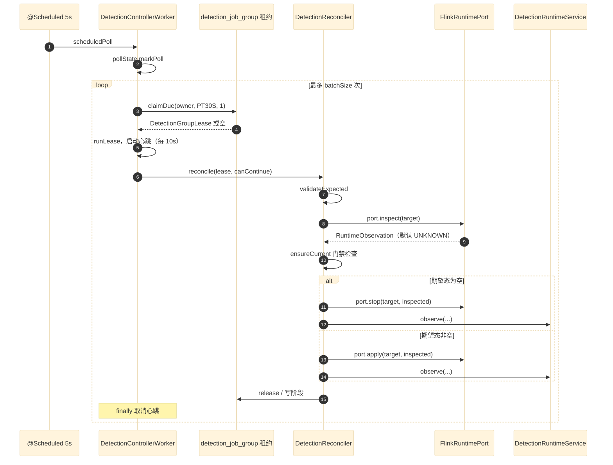
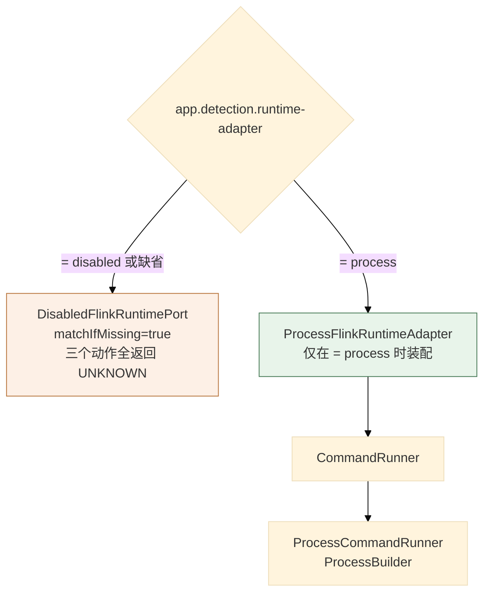
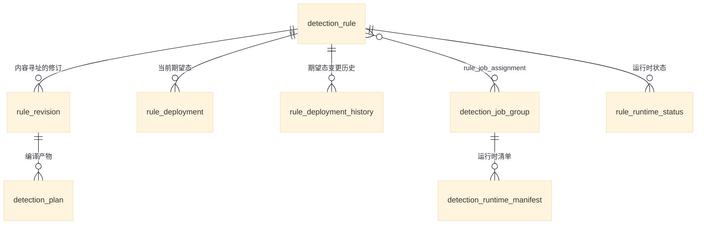
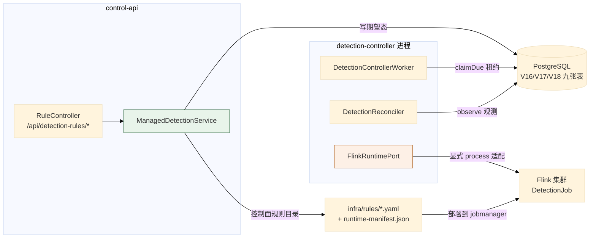

# 05 检测控制子系统

> **文档类型**：子系统深挖（代码级核验，非设计提案）
> **分析对象**：`D:\Project\SIEM` 的检测控制运行时——`modules/detection-control`（30 main）+ `modules/detection-runtime`（16 main）+ `applications/detection-controller`（11 main）
> **取证范围**：三个模块 57 个 main 文件 + `DetectionControllerMapper.xml` + V16/V17/V18 共 3 个迁移
> **取证方式**：源码直读 + grep 统计；每个关键论断附 `file:line` 锚点
> **结论以当前代码为准**（分支 `add_frame` @ `36b967f`）
> **文档集**：00–06 共 7 篇，见 [`README.md`](README.md)

---

## 为什么检测控制独立成篇

**四条代码事实确定边界**：

1. **独立进程**：`applications/detection-controller` 是 `WebApplicationType.NONE` 的独立 Spring Boot 应用，与 `control-api`、`soar-worker` 并列。
2. **三层模块链**：`detection-control` → `detection-runtime` 单向依赖，加上 controller 应用。
3. **独立迁移组**：V16、V17、V18 三个迁移全是检测控制主题。
4. **独立组合根**：`DetectionControllerApplication` **只扫 `detection.controller` 包**（`CLAUDE.md` §持久化约定第 2 条）。

**本篇的核心命题是一条边界**：

> **`control-api` 写「期望态」（desired state），`detection-controller` 做「实际态收敛」（reconciliation）。前者不拥有物理部署权。**

这条边界在 00 篇 TL;DR 被称为「本项目最值得注意的设计」，其代码强制点在本篇展开。

---

## 1. 模块与职责



| 模块 | main | test | 职责 |
| --- | --- | --- | --- |
| `detection-control` | 30 | 0 | 规则目录、期望态、计划编译、运行时视图 |
| `detection-runtime` | 16 | 5 | 物理产物构建、Flink 端口与其进程实现 |
| `applications/detection-controller` | 11 | 5 | 轮询、收敛、健康 |

---

## 2. 期望态边界：`control-api` 不部署

### 2.1 关键论断

**论断 1：`deployAll` 的注释直接写明「物理 Flink controller 刻意不参与」。**

```java
// modules/detection-control/.../rules/ManagedDetectionService.java:70-73（方法注释）
/**
 * Persists a single YAML snapshot as desired state in one transaction, then reconciles all
 * touched rules once. The physical Flink controller is intentionally not involved.
 */
@Transactional
public List<DeploymentSummary> deployAll(
        String tenantId, List<Map<String, Object>> ruleSnapshot, String actor) {
```

**「intentionally not involved」是刻意的措辞**——不是「暂时还没接」，是「本就不该接」。

**论断 2：`deployAll` 在**一个事务**里持久化整份 YAML 快照。**

```java
// ManagedDetectionService.java:74-107（节选）
@Transactional
public List<DeploymentSummary> deployAll(
        String tenantId, List<Map<String, Object>> ruleSnapshot, String actor) {
    if (tenantId == null || tenantId.isBlank()) {
        throw new IllegalArgumentException("tenantId must not be blank");
    }
    if (ruleSnapshot == null || ruleSnapshot.isEmpty()) {
        return List.of();
    }
    List<String> ruleKeys = new ArrayList<>();
    List<DeploymentSummary> summaries = new ArrayList<>();
    for (Map<String, Object> rule : ruleSnapshot) {
        ...
        RuleDeployment deployment =
                setDesiredStateForRule(tenantId, ruleKey, rule, DeploymentCommand.empty(),
                        desiredState, actor, false);
        ruleKeys.add(ruleKey);
        summaries.add(pendingSummary(deployment));
    }
    runtime.reconcileDesiredStates(tenantId, ruleKeys);
    return List.copyOf(summaries);
}
```

**三个要点**：

| 点 | 说明 |
| --- | --- |
| **整份快照一个事务** | 部分成功不可能——要么全部规则落库，要么全不落 |
| **`pendingSummary(...)`** | 返回的是 **PENDING** 状态，不是「已部署」 |
| **`reconcileDesiredStates` 只做视图收敛** | 不是物理部署（见论断 3） |

**论断 3：`reconcileDesiredStates` 是「让运行时视图与期望态一致」，不是「启动 Flink 作业」。**

名字容易误解。它的作用域是 `DetectionRuntimeService`（`detection-control` 内的运行时**视图**服务），而**物理动作在 `detection-runtime` 的 `FlinkRuntimePort`**。两者是不同层的两个概念，**共享了「reconcile」这个词**。

**论断 4：期望态的相等判定是**四部分**的，不是只比状态。**

```java
// ManagedDetectionService.java:220-241
private boolean sameDesiredState(
        RuleDeployment previous, RuleRevision requestedRevision,
        DetectionPlanArtifact requestedPlan, DesiredState desiredState, String targetCluster) {
    if (previous == null
            || desiredState != previous.desiredState()
            || !targetCluster.equals(previous.targetCluster())) {
        return false;
    }
    UUID previousRevisionId = previous.desiredRevisionId();
    // Revision provenance is part of logical desired state even when the compiled physical
    // plan hash is unchanged.  An explicit deploy of a newer equivalent revision must be
    // recorded, while the runtime layer can keep the existing physical generation.
    if (!requestedRevision.revisionId().equals(previousRevisionId)) {
        return false;
    }
    DetectionPlanArtifact previousPlan =
            previousRevisionId == null ? null : findPlan(previousRevisionId);
    return previousPlan != null && previousPlan.planHash().equals(requestedPlan.planHash());
}
```

**四部分**：`desiredState` + `targetCluster` + `revisionId` + `planHash`。

**那条注释是本篇最值得读的一段**——它解释了一个反直觉的选择：

> **「修订来源」也是逻辑期望态的一部分，即使编译出的物理计划哈希没变。**

**场景**：同一份规则 YAML 被再次 `deploy`。编译产物完全相同（`planHash` 一样），但**这仍是一次显式的部署意图**，必须被记录。**运行时层可以复用已有的物理 generation**（不做无谓的重启），但**期望态账本上必须有这一笔**。

**这是「意图」与「物理产物」分离的一个具体体现**：`revisionId` 记录**人做了什么**，`planHash` 记录**机器算出什么**。二者不等价。

**论断 5：`RuleRevision` 的身份是「规则定义内容的 SHA-256」。**

```java
// ManagedDetectionService.java:208-214
private RuleRevision findCurrentRevision(Map<String, Object> rule) {
    String ruleKey = String.valueOf(rule.get("id"));
    String definition = json(rule);
    String hash = sha256(definition);
    RuleRevision row = repository.findRevision(ruleKey, hash);
    return row;
}
```

```java
// ManagedDetectionService.java:255-260
private RuleRevision ensureRevision(Map<String, Object> rule, String actor) {
    String ruleKey = String.valueOf(rule.get("id"));
    String definition = json(rule);
    String hash = sha256(definition);
    RuleRevision existing = repository.findRevision(ruleKey, hash);
    if (existing != null) return existing;
```

**同一份规则定义 → 同一个 `hash` → **复用已有修订**（`ensureRevision` 里 `existing != null` 直接返回）。所以「重复部署同一份 YAML」不会产生新修订行**。

**论断 6：JSON 序列化强制按 key 排序——这是哈希可复现的前提。**

```java
// ManagedDetectionService.java:27-28
private final ObjectMapper mapper =
        new ObjectMapper().configure(SerializationFeature.ORDER_MAP_ENTRIES_BY_KEYS, true);
```

**没有这一行，同一份 Map 在不同 JVM 上的迭代顺序可能不同 → `json(rule)` 不同 → `sha256` 不同 → 每次部署都产生「新修订」**。这是内容寻址系统的必要条件。

> **对照**：`RuntimeManifestVerifier` 用**原始文件字节**做哈希（02 篇 §7.1 论断 6），因为那里要校验的是**文件没被改动**；这里用**规范化 JSON**做哈希，因为要判定的是**语义相同**。**两处哈希的目标不同，手法也不同**——这是刻意的。

**论断 7：`deploy` 与 `stop` 都收敛到同一个私有方法。**

```java
// ManagedDetectionService.java:64-68
@Transactional
public RuleDeployment deploy(
        String tenantId, String ruleKey, DeploymentCommand command, String actor) {
    return setDesiredState(tenantId, ruleKey, command, DesiredState.RUNNING, actor);
}
```

```java
// ManagedDetectionService.java:110-114
@Transactional
public RuleDeployment stop(String tenantId, String ruleKey, String actor) {
    return setDesiredState(
            tenantId, ruleKey, DeploymentCommand.empty(), DesiredState.STOPPED, actor);
}
```

**「启停」不是两个特性，而是同一个 `DesiredState` 枚举的两个取值。** 这与 02 篇 §3.1 论断 3 的规则 `enabled` 开关形成对照：

| 层 | 启停机制 | 生效方式 |
| --- | --- | --- |
| **Flink 侧**（02 篇） | 规则 YAML 的 `enabled` 字段 | 改 YAML → deploy → **重启 job** |
| **控制面侧**（本篇） | `DesiredState.RUNNING / STOPPED` | 调 API → 写期望态 → controller 收敛 |

**两层各自的「开关」语义不同**：Flink 的 `enabled` 决定**这条规则是否被编译进作业**；控制面的 `DesiredState` 决定**这个规则组是否应该处于运行状态**。

**论断 8：`sourceCommit` 是可配置的来源标记，默认 `working-tree`。**

```java
// ManagedDetectionService.java:37
@Value("${app.detection.source-commit:working-tree}") String sourceCommit,
```

**默认值表明「未指定 commit」是正常状态**（本地开发），而生产部署应显式传入。这是**来源可追溯性**的设计——每条期望态记录知道它来自哪个代码版本。

### 2.2 期望态写入时序



---

## 3. 计划编译：确定性 IR

### 3.1 关键论断

**论断 1：编译器输出一个带版本的 typed IR，且有**两个**版本号。**

```java
// modules/detection-control/.../rules/DetectionPlanCompiler.java:10-14
/** Compiles the bounded authoring grammar directly into the typed v2 DetectionPlan IR. */
public final class DetectionPlanCompiler {
    public static final String VERSION = "hisiem-detection-plan-2";
    public static final String SCHEMA_VERSION = "2";
    private static final String INPUT_SOURCE = "siem-events";
    private static final String AUTHENTICATION_FAILURE = "authentication_failure";
```

| 常量 | 值 | 含义 |
| --- | --- | --- |
| `VERSION` | `hisiem-detection-plan-2` | **编译器版本**（字符串，含语义名） |
| `SCHEMA_VERSION` | `2` | **IR schema 版本**（进 plan 内容） |

**两个版本号作用不同**：`VERSION` 是「谁编译的」，`SCHEMA_VERSION` 是「产物是什么结构」。`findPlan(revisionId, DetectionPlanCompiler.VERSION)`（`ManagedDetectionService.java:217,244`）用前者做查询键——**所以换编译器版本会让旧计划查不到，从而触发重新编译**。

**论断 2：编译入口显式声明「修订号不是计划身份」。**

```java
// DetectionPlanCompiler.java:20-23
/** Revision is a persistence provenance input and intentionally not plan identity. */
public CompiledPlan compile(Map<String, Object> rule, int revision) {
    return compile(rule);
}
```

**带 `revision` 参数的重载**直接丢弃该参数**并转发到无参版本**。这是**用签名表达意图**：调用了带 revision 的版本，但产物里不含 revision。

> **这条与 `sameDesiredState` 的注释（§2.1 论断 4）是同一个设计的两面**：
> - `revisionId` 属于**期望态身份**（要记录「谁部署的」）
> - `revisionId` 不属于**计划身份**（`planHash` 只看编译产物）
>
> **两个不同的身份系统，共用了 `revision` 这个概念**——这是最容易搞混的一处。

**论断 3：计划 JSON 由专用 codec 生成，然后取 SHA-256 作为 `planHash`。**

```java
// DetectionPlanCompiler.java:25-38
public CompiledPlan compile(Map<String, Object> rule) {
    RuleAuthoringGrammar.NormalizedRule normalized =
            grammar.normalize(rule, RuleAuthoringGrammar.ValidationProfile.CATALOG);
    DetectionPlan plan =
            new DetectionPlan(
                    SCHEMA_VERSION,
                    VERSION,
                    normalized.id(),
                    new DetectionPlan.Input(INPUT_SOURCE),
                    detection(normalized),
                    alert(normalized));
    String json = codec.encode(plan);
    return new CompiledPlan(json, sha256(json), plan);
}
```

**`codec.encode(plan)` 是必经路径**——不允许直接 `Jackson.writeValueAsString(plan)`。**这保证了编码的确定性**（字段顺序、null 处理、数字格式都由 codec 决定）。

**论断 4：规则先经过「有界创作语法」归一化，且区分两种校验档。**

```java
RuleAuthoringGrammar.NormalizedRule normalized =
        grammar.normalize(rule, RuleAuthoringGrammar.ValidationProfile.CATALOG);
```

`ValidationProfile.CATALOG` —— **有一组以上的校验档**。名字表明 `CATALOG` 是「规则目录」场景的档位（可能比运行时档更宽松或更严格）。**具体档位集合未取证**，见 §9。

**论断 5：输入源是硬编码常量 `siem-events`。**

```java
private static final String INPUT_SOURCE = "siem-events";
```

**控制面侧编译计划时就知道数据面消费的 topic 名**——这是两台机器之间**唯一被硬编码的耦合点**。改成别的 topic 名需要同时改 Flink 侧与这里。

**论断 6：`AUTHENTICATION_FAILURE` 也是硬编码常量。**

```java
private static final String AUTHENTICATION_FAILURE = "authentication_failure";
```

**当前编译只支持认证失败类规则**——这与 02 篇 §3.1 论断 1（`RuleRegistry` 注释「当前管道只有 SSH 认证失败事件」）一致。**两处独立佐证了「当前检测域是 SSH 认证」这条事实**。

### 3.2 编译与身份



> **两条独立的哈希链**：规则定义 → `rule_revision.hash`；编译产物 → `detection_plan.plan_hash`。**它们会不同步地变化**：改规则的 `description` 会改前者不改后者（因为 `description` 不进 IR 的检测逻辑）；改 `threshold` 会两者都改。**这正是 `sameDesiredState` 要同时比 `revisionId` 与 `planHash` 的原因。**

---

## 4. 控制器：轮询、心跳与收敛

### 4.1 关键论断

**论断 1：worker 一次只领 **1** 个租约，注释写明了原因。**

```java
// applications/detection-controller/.../DetectionControllerWorker.java:105-114
while (processed < batchSize && !Thread.currentThread().isInterrupted()) {
    // Claim only the item being processed. Claiming a whole batch would leave every
    // later lease without a heartbeat while the first adapter action is still running.
    List<DetectionGroupLease> claimed = repository.claimDue(owner, leaseDuration, 1);
    if (claimed.isEmpty()) {
        break;
    }
    runLease(claimed.getFirst());
    processed++;
}
```

**这段注释是本篇最值得读的一处工程推理**：

> **若一次领一整批，第一个租约的物理动作还在跑时，后面每个租约都已经过期了**——因为心跳是**按租约**启动的（`runLease` 里才起心跳）。领了 10 个但只给第 1 个起心跳，后 9 个就在「无人续租」的状态下等待。

**所以 `batchSize` 的真实语义是「一轮最多处理几个」，不是「一次领几个」。**

**断言对照**：`SoarWorker` 用**同样的写法**（`SoarWorker.java:51-55` 循环 `claimDue(..., 1)`），但**没有写注释解释**。**同一模式在两处的注释完备度不同**——本处的注释是更好的文档（04 篇 §3.1 论断 2 只从「一次一个节点」的角度描述了它）。

**论断 2：轮询失败被吞掉，注释解释为「单次失败不该终止调度器」。**

```java
// DetectionControllerWorker.java:87-99
@Scheduled(
        fixedDelayString = "${app.detection.controller.poll-ms:5000}",
        initialDelayString = "${app.detection.controller.initial-delay-ms:1000}")
public void scheduledPoll() {
    try {
        runOnce();
    } catch (RuntimeException failure) {
        if (Thread.currentThread().isInterrupted()) {
            Thread.currentThread().interrupt();
        }
        // One failed poll must not terminate Spring's scheduler; individual claims are fenced.
    }
}
```

**两行 catch 代码**：

1. **中断标志被显式恢复**（`Thread.currentThread().interrupt()`）——否则中断会被吞掉，线程池无法感知停机请求。
2. **注释指出安全依据**：「单个 claim 是被 fencing 的」——所以即使这一轮里的某个动作处于中间态，DB 租约也会保证别的 worker 不会同时处理它。

**对比 `SoarKafkaConsumer`**（01 篇 §6.1 论断 2）：那里的失败**会**回退整批并重试——因为**它没有 DB 租约兜底**，Kafka offset 就是它唯一的位置记录。**两处的失败策略差异由「是否有持久化租约」决定**。

**论断 3：心跳用「健康标志 + 时间片」双条件，且失败一次就不再尝试。**

```java
// DetectionControllerWorker.java:120-137
private void runLease(DetectionGroupLease lease) {
    AtomicBoolean heartbeatHealthy = new AtomicBoolean(true);
    long heartbeatMillis = Math.max(50L, leaseDuration.toMillis() / 3L);
    ScheduledFuture<?> heartbeat =
            heartbeatExecutor.scheduleAtFixedRate(
                    () -> {
                        if (!heartbeatHealthy.get()) return;
                        try {
                            if (!repository.heartbeat(lease, leaseDuration)) {
                                heartbeatHealthy.set(false);
                            }
                        } catch (RuntimeException failure) {
                            heartbeatHealthy.set(false);
                        }
                    },
                    heartbeatMillis, heartbeatMillis, TimeUnit.MILLISECONDS);
```

**两处与 `SoarWorker` 的差异**：

| 维度 | `DetectionControllerWorker` | `SoarWorker` |
| --- | --- | --- |
| 失败后是否继续尝试 | **否**（`heartbeatHealthy` 置 false 后直接 return） | 是（只记一次日志，继续尝试） |
| 心跳间隔下限 | `Math.max(50L, ...)` | `Math.max(1L, ...)` |
| 心跳间隔上限 | **无**（不封顶） | `Math.min(10_000L, ...)` |

**第一条是关键差异**：检测控制器**心跳一旦失败就放弃**，而 SOAR worker 会继续试。原因在论断 4。

**论断 4：心跳健康是传给收敛器的**门禁**。**

```java
// DetectionControllerWorker.java:138-147
try {
    reconciler.reconcile(
            lease,
            () ->
                    heartbeatHealthy.get()
                            && !Thread.currentThread().isInterrupted()
                            && repository.isCurrent(lease));
} finally {
    heartbeat.cancel(false);
}
```

**第三个参数 `canContinue` 是 `BooleanSupplier`**，由**三个条件**合成：

| 条件 | 作用 |
| --- | --- |
| `heartbeatHealthy.get()` | 心跳失败 → 立即停止后续动作 |
| `!Thread.currentThread().isInterrupted()` | 停机中 → 停止 |
| `repository.isCurrent(lease)` | **DB 层 fencing** → 租约被抢走就停 |

**这解释了论断 3 的行为**：因为 `heartbeatHealthy` 会被当作门禁传到收敛器里，**一旦为 false，收敛器会在下一个检查点停止**。所以「不再尝试续租」不是疏忽，而是**「已经决定放弃，不必再续」**。

**论断 5：收敛器在每个阶段之间都检查门禁。**

```java
// applications/detection-controller/.../DetectionReconciler.java:18-21（类注释）
/**
 * One fenced reconciliation attempt. The adapter is the only component allowed to perform an
 * external action; observed rows are written exclusively through DetectionRuntimeService.observe.
 */
```

```java
// DetectionReconciler.java:65-76
public void reconcile(DetectionGroupLease lease, BooleanSupplier canContinue) {
    Objects.requireNonNull(lease, "lease must not be null");
    Objects.requireNonNull(canContinue, "canContinue must not be null");
    try {
        RuntimeManifest expected = validateExpected(lease);
        DetectionRuntimeTarget target = new DetectionRuntimeTarget(lease);
        ensureCurrent(lease, canContinue);

        RuntimeObservation inspected = port.inspect(target);
        ensureCurrent(lease, canContinue);
        RuntimeManifest actual = toManifest(target, inspected);
        ensureCurrent(lease, canContinue);
```

**`ensureCurrent(lease, canContinue)` 在每次外部调用前后都执行**——文中共出现多次（`:71,74,76,87,89,...`）。**这是「租约可能在任何一刻失效」的正确应对**：不假设一次检查能覆盖整段逻辑。

**论断 6：注释明确了「唯一允许执行外部动作的组件是适配器」。**

```java
 * One fenced reconciliation attempt. The adapter is the only component allowed to perform an
 * external action; observed rows are written exclusively through DetectionRuntimeService.observe.
```

**两条约束**：

| 约束 | 含义 |
| --- | --- |
| **适配器是唯一执行外部动作的组件** | 收敛器只做编排与判定，不自己 `exec` |
| **观测行只能经 `DetectionRuntimeService.observe` 写入** | 单一写入口，无法绕过 fencing |

**第二条与 `SoarExecutionEngine` 的「引擎独占状态迁移」（04 篇 §3.1 论断 1）是同构的**——**每个有状态子系统都有一个唯一的状态写入口**。

**论断 7：空期望态 = 显式停止，且不依赖适配器报告什么。**

```java
// DetectionReconciler.java:79-90（节选）
RuntimeObservation verified = inspected;
if (expected.members().isEmpty()) {
    boolean alreadyStopped =
            "STOPPED".equalsIgnoreCase(inspected.runtimeState())
                    && inspected.members().isEmpty();
    if (!alreadyStopped) {
        // Empty desired state is an explicit stop, even when an adapter reports
        // UNKNOWN.
        requirePhase(lease, ReconcileState.APPLYING, canContinue);
        ensureCurrent(lease, canContinue);
        port.stop(target, inspected);
        ensureCurrent(lease, canContinue);
        requirePhase(lease, ReconcileState.VERIFYING, canContinue);
```

**注释「even when an adapter reports UNKNOWN」是关键**——默认的 `DisabledFlinkRuntimePort` **总是报 UNKNOWN**（`DisabledFlinkRuntimePort.java:20,25,30`）。若代码路径写成「UNKNOWN 就跳过」，那么**默认配置下停止指令永远不会被下发**，期望态与实际的差距会被永久掩盖。

**这里的处理是**：只认「明确报告 STOPPED 且成员为空」为「已达目标态」，**其余一律走 stop 动作**。UNKNOWN **不算达标**。

**论断 8：收敛状态机有显式阶段。**

```java
// DetectionReconciler.java:86,90 引用
requirePhase(lease, ReconcileState.APPLYING, canContinue);
requirePhase(lease, ReconcileState.VERIFYING, canContinue);
```

`ReconcileState` 与 `ControllerPollState` 是两个独立的状态类：

| 类 | 作用域 | 文件 |
| --- | --- | --- |
| `ReconcileState` | **单次收敛**的阶段 | `applications/detection-controller/.../ReconcileState.java` |
| `ControllerPollState` | **轮询进程**的状态（`pollState.markPoll()`，`:103`） | `.../ControllerPollState.java` |

**`requirePhase` 的存在暗示阶段是有序的、且不能跳**——见 §9 待核实。

**论断 9：`owner` 可由配置覆盖，默认「前缀 + 随机 UUID」。**

```java
// DetectionControllerWorker.java:41-43
configuredOwner == null || configuredOwner.isBlank()
        ? "detection-controller-" + UUID.randomUUID()
        : configuredOwner,
```

**这是三处 owner 构造里唯一可配置的**（对照 `SoarWorker.java:31` 的 JVM 名 + UUID，与 outbox dispatcher 的纯 UUID，见 04 篇 §5.1 论断 4 与 01 篇 §5.1 论断 4）。

**可配置的用途**：多副本部署时给每个副本一个稳定名字（便于日志定位），而不是每次重启换名字。

**论断 10：租约时长必须为正，且 `batchSize` 被夹在 [1, 100]。**

```java
// DetectionControllerWorker.java:61-65
if (leaseDuration == null || leaseDuration.isZero() || leaseDuration.isNegative()) {
    throw new IllegalArgumentException("lease duration must be positive");
}
this.leaseDuration = leaseDuration;
this.batchSize = Math.max(1, Math.min(100, batchSize));
```

**租约非法 → 抛异常（启动失败）；`batchSize` 非法 → 静默夹取**。**两处严格度不同**——配置错误里，「租约为 0」是致命错误，「batchSize 太大」只是不合理。

### 4.2 收敛时序



---

## 5. 两层适配：禁用默认与进程可选

### 5.1 关键论断

**论断 1：默认适配器**永远**报 UNKNOWN，且注释写明「物理适配刻意推迟到 5B」。**

```java
// applications/detection-controller/.../DisabledFlinkRuntimePort.java:9-32
/**
 * Safe 5A default. It never starts/stops/submits a job and always reports UNKNOWN. A physical
 * adapter is deliberately deferred to 5B.
 */
@Component
@ConditionalOnProperty(name = "app.detection.runtime-adapter", havingValue = "disabled",
        matchIfMissing = true)
public class DisabledFlinkRuntimePort implements FlinkRuntimePort {

    @Override
    public RuntimeObservation inspect(DetectionRuntimeTarget target) {
        return RuntimeObservation.unknown(target);
    }

    @Override
    public RuntimeObservation apply(DetectionRuntimeTarget target, RuntimeObservation current) {
        return RuntimeObservation.unknown(target);
    }

    @Override
    public RuntimeObservation stop(DetectionRuntimeTarget target, RuntimeObservation current) {
        return RuntimeObservation.unknown(target);
    }
}
```

**`matchIfMissing = true`** —— 三个动作全部返回 `unknown`，**不抛异常、不报错**。所以默认配置下 controller **正常轮询、正常收敛、正常写观测**，只是**观测永远是 UNKNOWN**。

**这是一种「安全但可见」的默认**：系统不会假装已部署，而是**持续记录「我不知道实际状态」**。

**论断 2：进程适配器在 `detection-runtime`（不在 `platform-operations-adapters`）。**

`CLAUDE.md` §16 明确：*「Detection controller 不依赖该模块；Detection 5B process adapter 位于 `detection-runtime`，仅在显式 `app.detection.runtime-adapter=process` 时启用」*。

实测文件（`modules/detection-runtime/src/main/java/.../runtime/process/`）：

| 文件 | 职责 |
| --- | --- |
| `ProcessFlinkRuntimeAdapter.java` | `FlinkRuntimePort` 的进程实现 |
| `ProcessFlinkRuntimeConfiguration.java` | 条件装配 |
| `CommandRunner.java` | 命令执行端口 |
| `ProcessCommandRunner.java` | `ProcessBuilder` 实现 |

**这是一个实际的物理隔离决策**：检测的物理部署命令**不放在通用的 `platform-operations-adapters`**，而是放在 `detection-runtime` 自己的 `process/` 子包。**好处是检测域可以独立演进自己的部署机制，不牵动控制面通用运维命令。**

**论断 3：`FlinkRuntimePort` 只有三个方法——inspect / apply / stop。**

从 `DisabledFlinkRuntimePort` 的实现可反推（`:18-31`）：

| 方法 | 签名 | 语义 |
| --- | --- | --- |
| `inspect` | `(target) → RuntimeObservation` | **只读**：实际状态是什么 |
| `apply` | `(target, current) → RuntimeObservation` | **写**：让它变成期望态 |
| `stop` | `(target, current) → RuntimeObservation` | **写**：停掉 |

**`apply` 与 `stop` 都接收 `current`**——即**先 inspect 再决策**的模式被编码进了接口签名。适配器**必须**基于当前观测来决定动作，不能盲目下发。

**论断 4：观测是「目标 + 状态 + 成员」三元组。**

从 `RuntimeObservation.unknown(target)` 与 `inspected.runtimeState()`、`inspected.members()`（`DetectionReconciler.java:81-82`）可反推：`RuntimeObservation` 至少含 **runtimeState（字符串）+ members（集合）**，并绑定一个 `target`。

**`members` 是「这个规则组里实际在跑的成员」**——它是 `toManifest(target, inspected)`（`DetectionReconciler.java:75`）的输入，转成 `RuntimeManifest` 后与 `expected` 比对。

**论断 5：`DetectionGroupLease` 是控制器侧的租约实体。**

`repository.claimDue(owner, leaseDuration, 1)` 返回 `List<DetectionGroupLease>`（`DetectionControllerWorker.java:108`）——**租约的粒度是「作业组」（job group），不是单条规则**。

这与 V16/V18 的表对应：`detection_job_group`（V16）+ `rule_job_assignment`（V16）+ `detection_runtime_manifest`（V17）+ `rule_runtime_status`（V18）。

**「按作业组租约」而不是「按规则租约」的含义**：一个 Flink 作业承载多条规则（`rule_job_assignment` 关联），**收敛与重启的粒度是作业**——因为 Flink 作业的重启成本决定它不可能按规则粒度重启。

**这与 02 篇 §3.1 论断 1 的观测吻合**：Flink 侧「按规则逐条建算子」，但**作业只有一个**。控制面的「作业组」概念正是对这个事实的建模。

### 5.2 适配器选择



> **默认是 `disabled`**（00 篇 §7 开关表）。所以**新部署的实例不会执行任何物理部署动作**，只记录 UNKNOWN。要真正接管 Flink 作业必须显式设 `app.detection.runtime-adapter=process`。

---

## 6. 租约与 fencing：与 SOAR 的对比

**两个子系统都实现了「DB 租约 + fencing token + 心跳」，但细节不同。**

| 维度 | SOAR（04 篇） | 检测控制（本篇） |
| --- | --- | --- |
| **租约列** | `soar_execution.lease_owner` / `lease_expires_at` / `version` | `detection_job_group` 的租约列（+ `fencingToken`） |
| **fencing token** | **`version` 列**（claim 递增、renew 校验） | `ObservationFence.fencingToken`（独立字段） |
| **租约粒度** | 单次执行 | **作业组** |
| **心跳失败后** | 继续尝试续租，只记一次日志 | **停止尝试**，并把健康标志传给收敛器当门禁 |
| **心跳间隔** | `min(10s, lease/3)`，封顶 10 秒 | `max(50ms, lease/3)`，**不封顶** |
| **领取数量** | 循环里每次领 1 个 | 循环里每次领 1 个（**有注释解释**） |
| **状态写入口** | `SoarExecutionEngine`（引擎独占） | `DetectionRuntimeService.observe`（唯一写入口） |
| **失败时的批次处理** | 节点级重试 + `next_attempt_at` | 轮询失败吞掉；单 claim 由 fencing 兜底 |

**一处概念上的差异值得单独指出**：

```java
// modules/detection-control/.../runtime/runtime/ObservationFence.java:5-12
/** Immutable controller ownership epoch required for observed-state writes. */
public record ObservationFence(
        String tenantId, String groupKey, String targetCluster,
        String owner, long fencingToken, long desiredGeneration) {
```

**`ObservationFence` 是六元组**，比 SOAR 的 `(owner, version)` 二元组表达力更强：

| 字段 | 作用 |
| --- | --- |
| `tenantId` | 租户隔离 |
| `groupKey` | 作业组身份 |
| `targetCluster` | **目标集群**（多集群场景） |
| `owner` | 谁持有 |
| `fencingToken` | fencing |
| **`desiredGeneration`** | **期望态代数** |

**`desiredGeneration` 是 SOAR 没有的**：它让「**基于哪一代期望态的观测**」成为可校验的事实。**如果期望态在收敛过程中被改了（generation 递增），基于旧代数的观测就不该被写入**——否则会用「旧目标的观测」去更新「新目标的账本」。

**这是「期望态 vs 观测态」分离架构带来的必然要求**，SOAR 没有这个概念因为它没有独立的期望态账本。

---

## 7. 持久化：九张表

### 7.1 关键论断

**论断 1：V16–V18 共建立 9 张表，分属三个功能层。**

| 层 | 表 | 迁移 |
| --- | --- | --- |
| **规则目录** | `detection_rule` | V16 |
| | `rule_revision` | V16 |
| **期望态与计划** | `detection_plan` | V16 |
| | `rule_deployment` | V16 |
| | `rule_deployment_history` | V16 |
| **作业分组与运行时** | `detection_job_group` | **V17** |
| | `rule_job_assignment` | **V17** |
| | `detection_runtime_manifest` | **V17** |
| | `rule_runtime_status` | **V17** |

**V16 建 5 张，V17 建 4 张，V18 不建表**（只 ALTER 加 controller 租约列 + 3 个 CHECK + 2 个索引）。

**论断 2：`rule_deployment` 与 `rule_deployment_history` 是「当前态 + 历史」的分拆。**

**这是「当前态表 + 追加式历史表」的标准形态**：查当前状态走 `rule_deployment`（小、索引好），审计走 `rule_deployment_history`（只追加）。

**对照 SOAR**：那里用 `soar_playbook_revisions`（修订表）承载历史（见 04 篇 §9.1 论断 4）。**两个子系统都用「主表 + 历史表」模式。**

**论断 3：`detection_runtime_manifest`（V17）与 Flink 侧的 `runtime-manifest.json` 是**两回事**。**

| 物 | 位置 | 谁生成 | 谁校验 |
| --- | --- | --- | --- |
| `runtime-manifest.json` | **规则目录里的文件** | 部署侧 | Flink 的 `RuntimeManifestVerifier`（02 篇 §7） |
| `detection_runtime_manifest` | **PostgreSQL 表** | 控制面 | `DetectionRuntimeService` |

**名字相同但作用域完全不同**——一个是「Flink 作业启动前要校验的文件」，一个是「控制面记录的运行时清单」。**这是容易搞混的一处**。

> **两者通过 `generation` 关联**：Flink 的 `DetectionJobArguments.generation()`（02 篇 §7.1 论断 8）与 `ObservationFence.desiredGeneration`（本篇 §6）说的是同一个代数概念——**控制面递增 generation，Flink 校验自己收到的 generation**。这条链路把「期望态账本」与「数据面作业」连了起来。

**论断 4：`detection-controller` 关闭了自动驼峰映射。**

`CLAUDE.md` §持久化约定第 5 条：*「detection-controller 里 `mybatis.configuration.map-underscore-to-camel-case=false`，column→property 靠显式 `resultMap`/`@Results`」*。

实测：`control-api` **也**关闭了该配置（`application.properties:3`）。**两个应用都要维护 `resultMap`**，不是只有 detection-controller。

**论断 5：`detection-controller` 只扫自己的包，是**最窄**的扫描范围。**

```java
// CLAUDE.md §持久化约定第 2 条
// DetectionControllerApplication 只扫 detection.controller 包
```

**对照**：`control-api` 三条 `@MapperScan` 覆盖 detection + control + tenant + soar；`soar-worker` 覆盖 control + soar。**`detection-controller` 的依赖面只有 4 个模块**（00 篇 §1.3），扫描面也最窄。

### 7.2 表关系



---

## 8. 关键不变式（代码强制）

| # | 不变式 | 强制点 | 违反后果 |
| --- | --- | --- | --- |
| 1 | **`control-api` 不做物理部署** | `ManagedDetectionService.java:70-73` 注释；`CLAUDE.md` §15 | 控制面进程需要 Flink 凭据与集群访问权 |
| 2 | **期望态写入是单事务的整份快照** | `ManagedDetectionService.java:74` `@Transactional` | 部分规则落库，期望态不自洽 |
| 3 | **规则修订按内容寻址** | `ManagedDetectionService.java:255-260` `sha256(json)` 命中即复用 | 重复部署产生无限修订 |
| 4 | **JSON 序列化按 key 排序** | `ManagedDetectionService.java:27-28` `ORDER_MAP_ENTRIES_BY_KEYS` | 哈希不可复现，修订永不命中 |
| 5 | **期望态相等需四部分都等** | `ManagedDetectionService.java:226-240` | 漏记显式部署，或做无谓重启 |
| 6 | **修订号不是计划身份** | `DetectionPlanCompiler.java:20-23` 显式丢弃 revision 参数 | 计划哈希随修订漂移 |
| 7 | **计划 JSON 必经 codec** | `DetectionPlanCompiler.java:36` `codec.encode(plan)` | 编码不确定，planHash 不稳定 |
| 8 | **一次只领 1 个租约** | `DetectionControllerWorker.java:106-108` + 注释 | 后续租约无心跳而过期 |
| 9 | **心跳失败即放弃续租** | `DetectionControllerWorker.java:126,129,132` 置 `heartbeatHealthy=false` | 已决定放弃却继续续租，与 fencing 冲突 |
| 10 | **心跳健康是收敛器的门禁** | `DetectionControllerWorker.java:139-144` `canContinue` 三条件 | 心跳已死仍执行物理动作 |
| 11 | **每个阶段的边界都检查门禁** | `DetectionReconciler.java:71,74,76,87,89,...` `ensureCurrent` | 长事务中租约失效未被察觉 |
| 12 | **只有适配器执行外部动作** | `DetectionReconciler.java:18-20` 注释 | 收敛逻辑与物理命令耦合 |
| 13 | **观测行只能经 `observe` 写入** | 同上注释 | 绕过 fencing 写观测 |
| 14 | **空期望态即停止，UNKNOWN 不算达标** | `DetectionReconciler.java:79-88` + 注释 | 默认适配器下停止指令永不下发 |
| 15 | **默认适配器不执行任何物理动作** | `DisabledFlinkRuntimePort.java:9-15` `matchIfMissing=true` | 新实例误接管 Flink 作业 |
| 16 | **`apply`/`stop` 必须接收 `current`** | `DisabledFlinkRuntimePort.java:24,29` 接口签名 | 适配器盲目下发，不基于现状决策 |
| 17 | **观测受代数约束** | `ObservationFence.java:6-12` `desiredGeneration` | 用旧目标的观测更新新目标账本 |
| 18 | **租约时长必须为正** | `DetectionControllerWorker.java:61-63` 抛异常 | 无限租约或立即过期 |

---

## 9. 与其他子系统的边界



**三条边界**：

| 边界 | 方向 | 契约 | 锚点 |
| --- | --- | --- | --- |
| `control-api` → 期望态表 | 写 | `ManagedDetectionService.setDesiredState` | `ManagedDetectionService.java:64-114` |
| `detection-controller` → 期望态表 | **读写** | `claimDue` / `heartbeat` / `isCurrent` / `observe` | `DetectionControllerWorker.java:108,128,143` |
| `detection-controller` → Flink | **默认不断开** | `FlinkRuntimePort`（默认 `Disabled`） | `DisabledFlinkRuntimePort.java:13-16` |

**加上一条「经文件系统的间接边界」**：控制面的规则目录（`infra/rules/*.yaml`）与 `runtime-manifest.json` 最终由部署流程同步到 Flink 的 jobmanager 上（`RuleConfigLoader` 类注释：*「容器：deploy.sh 把 infra/rules 同步到 jobmanager /opt/flink/rules」*，02 篇）。

> **所以「期望态 → 实际态」有两条路径**：
> 1. **文件路径**：`infra/rules/*.yaml` → `deploy.sh` → jobmanager → Flink 的 `RuleConfigLoader`（这是**实际生效**的路径）
> 2. **控制器路径**：`/api/detection-rules/deploy` → 期望态表 → `detection-controller` → `FlinkRuntimePort`（默认禁用）
>
> **第一条是当前实际使用的路径，第二条是 5B 之后的路径。** 本文档如实记录这个双轨状态——`CLAUDE.md` §15 的措辞（`detection-controller` 是「5A durable claim/reconcile core，5B opt-in process adapter」）与此一致。

---

## 待核实

本节 12 条待核实项均已解答，答案已并入正文：`ValidationProfile` 只有 2 档、`ReconcileState` 6 阶段且 `transitionPhase` 是纯 UPDATE 无状态机校验、`observe` 的 fencing 靠 `FOR UPDATE` + 条件式 SQL 三重校验、`RuntimeDiff` 的三类差异且 generationMismatch 也算不同步、产物是**不可变目录树**不是 jar、`jobKey`/作业名的确定性编码、`group-buckets` 影响**作业组粒度**、**无独立调度器**（组键纯确定性派生）、health indicator **恒返回 UP**、`source-commit` 仓库内无脚本人传。

---

## 修订记录

| 版本 | 日期 | 变更 | 作者 |
| --- | --- | --- | --- |
| 1.0 | 2026-09-22 | 首版。基于 `add_frame` @ `36b967f` 取证，覆盖检测控制三模块 57 个 main 文件 + V16–V18 共 3 个迁移。 | code-level-architecture-docs skill |
