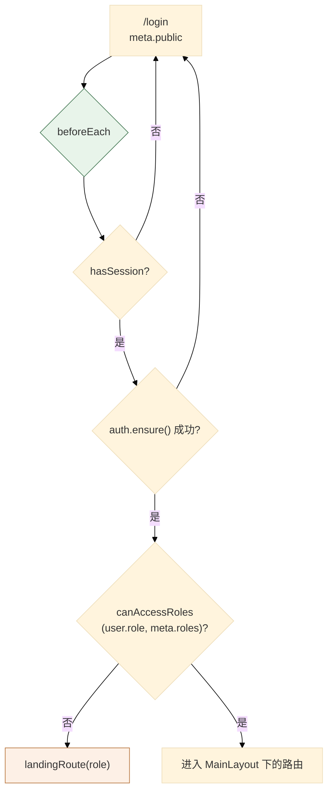
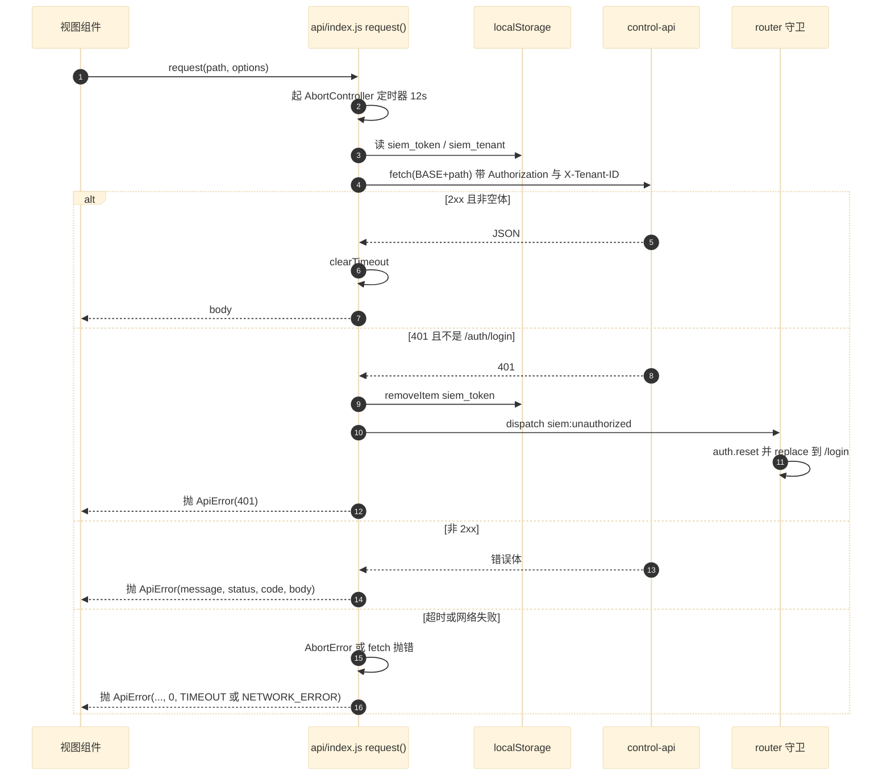
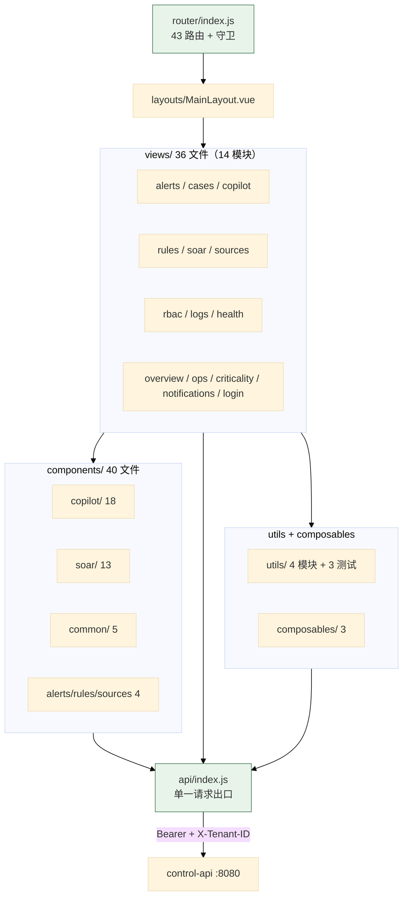
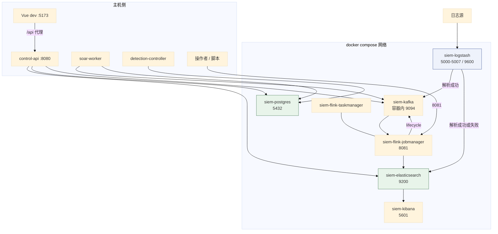
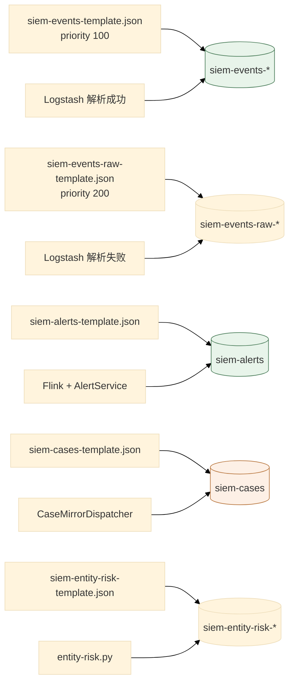
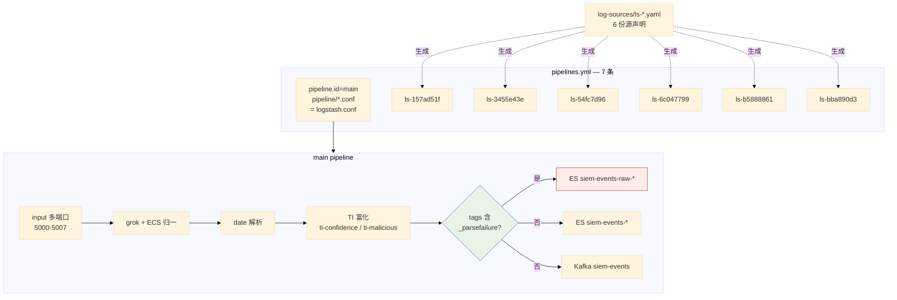

# 06 Web 控制台与基础设施

> **文档类型**：子系统深挖（代码级核验，非设计提案）
> **分析对象**：`D:\Project\SIEM` 的周边交付物——`web/`（Vue 3 控制台）+ `infra/`（本地基础设施，81 个文件）
> **取证范围**：`web/src` 92 个文件（43 条路由、36 个视图文件、40 个组件文件）+ `infra/` 的 docker-compose、5 个 ES 模板、4 条 Kafka topic、7 条 Logstash pipeline
> **取证方式**：源码直读 + grep 统计；每个关键论断附 `file:line` 锚点
> **结论以当前代码为准**（分支 `add_frame` @ `36b967f`）
> **文档集**：00–06 共 7 篇，见 [`README.md`](README.md)

> **读法导引** —— 本篇与 `05` 在本集里有特殊地位：**它们是各自领域唯一的厚度覆盖**。
> Web 控制台与基础设施在既有文档里几乎没有系统覆盖——只有 [`../product-contract.md`](../product-contract.md) §1 的路由表
> 与 `infra/*/README.md` 的局部说明，而本篇覆盖 `web/src` 92 文件 + `infra/` 81 文件。
> 建议顺序：先读契约/既有文档拿到轮廓 → 再读本文的代码事实 → 想确认「现在到底怎样」时回到代码。
> 与本集其他篇不同的是：**这两篇没有权威文档可以「让位」**——它们自己就是最厚的一份。

---

## 为什么这两块合一篇

**这两块都不是「有状态子系统」，而是「交付物」**：

| 维度 | 前五篇的子系统 | 本篇两块 |
| --- | --- | --- |
| 有没有独立进程 | 有（三个 Spring Boot + 一个 Flink） | **都没有**（Web 是静态资源；infra 是配置） |
| 有没有 schema owner | 有 | **都没有** |
| 有没有业务状态机 | 有 | **都没有** |
| 出错的表现 | 数据不一致 | 页面打不开 / 容器起不来 |

**按 铁律 2 的判据（独立构建模块 / 独立进程 / 独立 schema owner / 独立部署单元）**，这两块各自**是**独立的构建与部署单元（`web/` 有 `package.json`；`infra/` 是 docker compose 工程），但**内部没有子系统边界可再拆**。

**所以合为一篇，两块各占一节。** 这是「不为凑数硬拆，也不为省事合并」（铁律 2）在本篇的落点。

---

## 1. Web 控制台

### 1.1 技术栈与构建

**断言 1：技术栈由 `web/package.json` 定义，共 6 个运行时依赖。**

```json
// web/package.json:13-20
"dependencies": {
  "@ant-design/icons-vue": "^7.0.1",
  "@vue-flow/core": "^1.48.2",
  "ant-design-vue": "^4.2.6",
  "vue": "^3.5.13",
  "vue-router": "^4.5.0",
  "yaml": "^2.7.0"
}
```

| 依赖 | 用途 |
| --- | --- |
| `vue` 3.5 | 框架 |
| `vue-router` 4.5 | 路由 |
| `ant-design-vue` 4.2 | UI 库 |
| `@ant-design/icons-vue` | 图标 |
| **`@vue-flow/core`** 1.48 | **SOAR Playbook 的画布编辑** |
| **`yaml`** 2.7 | **前端解析规则/Playbook 的 YAML** |

**两个依赖值得单独看**：

- **`@vue-flow/core`** 是唯一的图形库——**它的引入完全是为了 Playbook 编辑器**（`components/soar/SoarMvpCanvas.vue`）。
- **`yaml`** 说明前端**直接处理 YAML**——而不是全由后端解析。这与 `RuleAuthoringGrammar`（05 篇 §3.1 论断 4）的分工有关：前端做格式校验，后端做语义归一化。

**断言 2：开发服务器端口 5173，`/api` 代理到 8080。**

```javascript
// web/vite.config.js:29-35
server: {
  port: 5173,
  proxy: {
    '/api': 'http://localhost:8080',
  },
},
```

**与 `CLAUDE.md` §常用命令一致**（`npm --prefix web run dev` 默认 5173；`control-api` 默认 8080）。

**断言 3：构建做了手工 chunk 拆分，且注释解释了目的。**

```javascript
// web/vite.config.js:12-27（节选）
build: {
  // 将稳定的第三方依赖与业务代码分离，页面迭代时浏览器可以复用 vendor 缓存。
  rollupOptions: {
    output: {
      manualChunks(id) {
        if (!id.includes('node_modules')) return undefined
        const moduleId = id.replaceAll('\\', '/')
        if (moduleId.includes('/vue/') || moduleId.includes('/vue-router/')) return 'vue'
        if (moduleId.includes('/@vue-flow/')) return 'vue-flow'
        // Ant Design Vue 按页面引用自动拆分，避免首屏加载全部组件。
        return undefined
      },
    },
  },
},
```

**三档策略**：

| 依赖 | 处理 |
| --- | --- |
| `vue` + `vue-router` | 固定进 `vue` chunk |
| `@vue-flow/core` | 固定进 `vue-flow` chunk |
| `ant-design-vue` | **故意不拆**（交给按页面引用自动 tree-shake） |

**注意路径分隔符归一化**（`replaceAll('\\', '/')`）——`manualChunks` 在 Windows 上收到的是反斜杠路径，不归一化则 `includes('/vue/')` 永远不匹配。**这是一处真实的跨平台坑。**

**断言 4：组件自动导入用 `unplugin-vue-components`，但关掉了 `dts` 生成。**

```javascript
// web/vite.config.js:6-11
Components({
  dts: false,
  resolvers: [AntDesignVueResolver({ importStyle: false })],
}),
```

`dts: false` —— **不生成 `components.d.ts`**。所以自动导入的组件**没有类型提示**。这是 JS 项目（非 TS）的合理取舍。

**断言 5：`importStyle: false` 表示样式不走按需导入。**

**结合 `unplugin-vue-components` 的自动按需导入**：组件代码按需，但**样式需要另行全量引入**（在 `main.js` 或 `styles/main.css`）。

### 1.2 路由与权限

#### 1.2.1 关键论断

**论断 1：43 条路由，全部在单个文件里，且用 `meta.roles` 做角色门控。**

实测 `grep -c "path:" web/src/router/index.js` = **43**。

结构是「一条公开路由 + 一个 `MainLayout` 下的 41 条子路由 + 一条兜底」：

```javascript
// web/src/router/index.js:9,11,51
{ path: '/login', name: 'login', component: () => import('../views/login/LoginView.vue'), meta: { public: true, title: '登录' } },
  { path: '/', component: MainLayout, redirect: '/overview', children: [
    ...
  { path: '/:pathMatch(.*)*', redirect: '/overview' },
```

**所有业务组件都是动态 `import()`**——按路由懒加载，所以 `manualChunks` 只需要管第三方依赖。

**论断 2：权限模型是**三元**的（`public` / `roles` / 登录即可），由 `meta` 声明。**

```javascript
// web/src/router/index.js:12
{ path: 'overview', component: ..., meta: { title: '安全运营大屏', menu: '/overview', roles: ['admin', 'analyst', 'audit'] } },
```

`meta` 有三个关键字段：

| 字段 | 作用 |
| --- | --- |
| `public` | 无需登录（只有 `/login`） |
| `roles` | **哪些角色可进**；缺省 = 登录即可 |
| `menu` | **侧边栏高亮哪一项**（让详情页归属其列表页） |
| `title` | 页面标题 |

**`menu` 字段是个细节**：`alerts/:id` 的 `menu` 是 `/alerts`（`index.js:15`）——所以打开告警详情时侧边栏仍高亮「告警台」。

**论断 3：实测出现 **4** 个角色，不是 3 个。**

`admin`、`analyst`、`audit` 出现在多数路由；但 `sources/new` 的 `roles` 是 **`['admin', 'ops']`**：

```javascript
// web/src/router/index.js:25
{ path: 'sources/new', component: ..., meta: { title: '新建数据源', menu: '/sources', roles: ['admin', 'ops'] } },
```

**所以角色集合是 `{admin, analyst, audit, ops}`**。`ops` 只在这一条路由上出现——**它是「数据源运维」角色，权限面比 `analyst` 窄**。

**论断 4：`rules` 列表页**故意无** `roles` —— 所有登录用户可见。**

```javascript
// web/src/router/index.js:20
{ path: 'rules', component: ..., meta: { title: '检测规则', menu: '/rules' } },
// 但编辑页有：
{ path: 'rules/new', component: ..., meta: { title: '新建规则', menu: '/rules', roles: ['admin'] } },
```

**读与写的权限分离**：`rules`（读）对所有登录用户开放，`rules/new` 与 `rules/:id/edit`（写）限 `admin`。

**同样的模式出现在 `cases`**：

| 路由 | 权限 |
| --- | --- |
| `cases`（列表） | `admin, analyst, audit` |
| `cases/new`（建案） | **`admin, analyst`**（无 `audit`） |
| `cases/:id`（详情） | `admin, analyst, audit` |

**`audit` 角色能看不能改**——这是审计角色的正确定义。

**论断 5：路由守卫是异步的，且**每次导航都重新校验****。

```javascript
// web/src/router/index.js:59-73
router.beforeEach(async (to) => {
  if (to.meta.public) {
    if (to.path === '/login' && hasSession()) {
      try { const user = await auth.ensure(); return landingRoute(user?.role) } catch { return true }
    }
    return true
  }
  if (!hasSession()) return { path: '/login', query: { redirect: to.fullPath } }
  try {
    const user = await auth.ensure()
    if (!canAccessRoles(user.role, to.meta.roles)) return landingRoute(user.role)
    return true
  } catch {
    return { path: '/login', query: { redirect: to.fullPath } }
  }
})
```

**四条分支**：

| 情况 | 处理 |
| --- | --- |
| 公开路由 + 已登录 + 访问 `/login` | 跳到该角色的落地页（`landingRoute`） |
| 公开路由 + 未登录 | 放行 |
| 未登录 | 跳登录页，**带 `redirect` 参数** |
| 已登录但角色不足 | **不报 403，直接跳落地页** |
| `auth.ensure()` 失败 | 跳登录页 |

**两条设计选择值得注意**：

1. **`landingRoute(user.role)`** —— 角色不足时**不是**显示「无权限」，而是**送到该角色能看的首页**。所以角色集合决定了每个角色看到的「首页」。
2. **`auth.ensure()` 每次导航都调** —— 它是幂等的（有缓存则直接返回），所以这不是每次都打网络。

**论断 6：401 通过**全局事件**处理，不在每个调用点判断。**

```javascript
// web/src/api/index.js:71-74
if (response.status === 401 && path !== '/auth/login') {
  clearSession()
  window.dispatchEvent(new CustomEvent('siem:unauthorized'))
}
```

```javascript
// web/src/router/index.js:75-78
window.addEventListener('siem:unauthorized', () => {
  auth.reset()
  if (router.currentRoute.value.path !== '/login') router.replace({ path: '/login', query: { redirect: router.currentRoute.value.fullPath } })
})
```

**这是「API 层广播 + 路由层订阅」的解耦**：`api/index.js` 不需要知道路由的存在，只需要广播一个事件。**`path !== '/auth/login'` 的排除条件防止登录失败本身触发跳转循环**。

**论断 7：路由用 `createWebHistory`（HTML5 history 模式）。**

```javascript
// web/src/router/index.js:55
const router = createRouter({ history: createWebHistory(), routes, scrollBehavior: () => ({ top: 0 }) })
```

**部署含义**：生产环境需要把未匹配的路径回落到 `index.html`（否则刷新详情页会 404）。**这项配置在哪由部署方式决定，仓库内未见**——见 §4 待核实。

#### 1.2.2 路由与角色



### 1.3 API 客户端：单一出口

#### 1.3.1 关键论断

**论断 1：所有请求经一个 `request()` 函数，自动附加 Bearer 与租户头。**

```javascript
// web/src/api/index.js:1-5
const BASE = '/api'
const DEFAULT_TIMEOUT = 12_000

let authToken = localStorage.getItem('siem_token') || ''
let activeTenant = localStorage.getItem('siem_tenant') || 'default'
```

```javascript
// web/src/api/index.js:41-45
const headers = { ...(options.headers || {}) }
if (authToken) {
  headers.Authorization = `Bearer ${authToken}`
  headers['X-Tenant-ID'] = activeTenant
}
```

**`X-Tenant-ID` 是前端主动发的**——但**后端不信任它**（03 篇 §4.1 论断 7：`requireMembership` 会校验成员关系）。**前端发头是为了表达「我想看哪个租户」，后端校验是为了防止越权。**

**论断 2：有默认 12 秒超时，用 `AbortController` 实现。**

```javascript
// web/src/api/index.js:2,38-40
const DEFAULT_TIMEOUT = 12_000
...
const controller = new AbortController()
const timeoutMs = options.timeoutMs || DEFAULT_TIMEOUT
const timeout = window.setTimeout(() => controller.abort(), timeoutMs)
```

**超时被转成结构化的 `ApiError`**：

```javascript
// web/src/api/index.js:53-60
} catch (error) {
  if (error?.name === 'AbortError') {
    throw new ApiError(`请求超时（${Math.round(timeoutMs / 1000)} 秒）`, 0, 'TIMEOUT')
  }
  throw new ApiError(error?.message || '网络连接失败')
} finally {
  window.clearTimeout(timeout)
}
```

**`finally` 里清定时器**——所以即使请求成功，定时器也不会泄漏。

**论断 3：错误被归一为 `ApiError`，错误码有三级回退。**

```javascript
// web/src/api/index.js:7-15
export class ApiError extends Error {
  constructor(message, status = 0, code = 'NETWORK_ERROR', body = null) {
    super(message)
    this.name = 'ApiError'
    this.status = status
    this.code = code
    this.body = body
  }
}
```

```javascript
// web/src/api/index.js:75-82
if (!response.ok) {
  throw new ApiError(
    body?.message || body?.error || `请求失败（HTTP ${response.status}）`,
    response.status,
    body?.code || `HTTP_${response.status}`,
    body,
  )
}
```

**`code` 的三级回退**：后端 `body.code`（如 `TENANT_FORBIDDEN`）→ `HTTP_<status>`。**这与后端的 `ApiError` 结构对应**（03 篇 §4.1 论断 12、§5.1 论断 2）——**前后端共享同一套错误码约定**。

**`status = 0` 表示「没有 HTTP 响应」**（网络失败或超时）——这是一个有用的约定，让调用方能区分「服务端拒绝」与「根本没连上」。

**论断 4：响应体解析对非 JSON 内容做了兜底。**

```javascript
// web/src/api/index.js:62-70
const raw = await response.text()
let body = null
if (raw.trim()) {
  try {
    body = JSON.parse(raw)
  } catch {
    body = { message: raw.slice(0, 500) }
  }
}
```

**非 JSON 响应的前 500 字符被放进 `message`**——所以当后端返回 HTML 错误页（如代理返回的 502）时，用户能看到一点线索而不是「未知错误」。

**注意 `slice(0, 500)`** —— 与 `EventParsingProcessFunction` 的 `MAX_ERROR_CHARS = 2048`（02 篇 §2.1 论断 4）是**同一种做法**：错误信息要截断。

**论断 5：204 与空体都返回 `null`。**

```javascript
// web/src/api/index.js:83
return response.status === 204 || !raw.trim() ? null : body
```

**这解释了为什么很多 API 不返回内容**（如 `DELETE`、`POST .../activate`）——前端约定拿到 `null`。

**论断 6：API 函数是「一行一个」的扁平导出，无 class、无 SDK 封装。**

```javascript
// web/src/api/index.js:107-123（节选）
export const authMe = () => request('/auth/me')
export const changePassword = (currentPassword, newPassword) => request('/auth/password', json('POST', { currentPassword, newPassword }))
export const listUsers = () => request('/auth/users')
export const createUser = (payload) => request('/auth/users', json('POST', payload))
export const updateUserRole = (username, role) => request(`/auth/users/${segment(username)}/role`, json('PUT', { role }))
export const deleteUser = (username) => request(`/auth/users/${segment(username)}`, { method: 'DELETE' })
export const listRoles = () => request('/auth/roles')
export const auditLogs = () => request('/auth/audit-logs')
export const listMyTenants = () => request('/tenants/mine')
```

**每个函数一行，用 `json(method, body)` 辅助构造请求**：

```javascript
// web/src/api/index.js:86-91
const json = (method, body, extra = {}) => ({
  method,
  headers: { 'Content-Type': 'application/json', ...(extra.headers || {}) },
  body: JSON.stringify(body),
  ...extra,
})
```

**路径参数经 `segment()` 编码**：

```javascript
// web/src/api/index.js:17
const segment = (value) => encodeURIComponent(String(value))
```

**这是必要的**：`updateUserRole('a/b', ...)` 若不编码会产生错误路径。实测所有传路径参数的调用都用了 `segment(...)`。

#### 1.3.2 请求管线



### 1.4 视图与组件的组织

#### 1.4.1 关键论断

**论断 1：`views/` 按**业务模块**分目录，实测 36 个文件、14 个模块目录。**

实测 `find web/src/views -type f`：

| 模块目录 | 文件数 | 对应后端端点前缀 |
| --- | --- | --- |
| `alerts/` | 2 | `/api/alerts` |
| `cases/` | 3 | `/api/cases` |
| `copilot/` | 1 | `/api/agent-investigations` |
| `criticality/` | 2 | `/api/settings/criticality` |
| `health/` | 2 | `/api/data-health` |
| `login/` | 1 | `/api/auth/login` |
| `logs/` | 5 | `/api/log-search` |
| `notifications/` | 1 | `/api/notifications` |
| `ops/` | 1 | `/api/ops` |
| `overview/` | 1 | （聚合多个） |
| `rbac/` | 5 | `/api/auth/*`、`/api/tenants` |
| `rules/` | 3 | `/api/detection-rules` |
| `soar/` | 5 | `/api/soar` |
| `sources/` | 4 | `/api/log-sources`、`/api/parser-templates` |

**「一个后端端点前缀 = 一个前端模块目录」这条对应关系基本成立**——这让「改一个功能要动哪些文件」变得可预测。

**两处例外**：`overview/`（安全运营大屏，聚合多个端点）与 `login/`（不属任何资源）。

**论断 2：`logs/` 与 `rbac/` 的文件数最多（各 5 个）——因为它们是「重交互」模块。**

| 模块 | 文件 |
| --- | --- |
| `logs/` | `LogSearchView.vue`、`LogFilterBuilder.vue`、`logSearchApi.js`、`logSearchQuery.js`、`logSearchQuery.test.js` |
| `rbac/` | `UserListView.vue`、`UserCreateView.vue`、`UserDetailView.vue`、`RoleMatrixView.vue`、`AuditLogView.vue` |

**`logs/` 有独立的 `logSearchQuery.js` + 测试**——**查询构建逻辑被抽成纯函数**，可单测（见论断 5）。

**论断 3：`components/` 按**消费者**分目录，实测 40 个文件。**

实测 `find web/src/components -type f | awk -F/ '{print $1}' | sort | uniq -c`：

| 目录 | 文件数 | 谁用 |
| --- | --- | --- |
| `copilot/` | **18** | AI 调查工作台 |
| `soar/` | **13**（11 个 `.vue` + `soarGraph.js` + `soarGraph.test.js`） | Playbook 编辑器 + 节点表单 |
| `common/` | 5 | 跨模块通用（`JsonField`、`LoadState`、`PageHeader`、`StatusTag`、`TimeText`） |
| `rules/` | 2 | `RuleConditionTree`、`RuleSummary` |
| `alerts/` | 1 | `AlertDetails` |
| `sources/` | 1 | `ParserTemplateEditor` |

**`copilot/` 与 `soar/` 合计 31 个，占 40 个的 77.5%**——**这两个模块的前端复杂度远高于其他**。

**论断 4：`copilot/` 的 16 个组件对应 Agent 调查工作台的各个区块。**

A AI 调查工作台（`views/copilot/InvestigationWorkspaceView.vue`）由这些组件拼成：`InvestigationHeader`、`InvestigationOverview`、`InvestigationPlan`、`InvestigationStateSummary`、`InvestigationTimeline`、`InvestigationResponse`、`FindingList`、`FindingCard`、`HypothesisList`、`EvidenceList`、`EvidenceDetailDrawer`、`VerdictCard`、`UncertaintyList`、`ResponseRecommendationList`、`ResponseProposalForm`、`ToolActivityList`、`AttackMappingList`、`AuthorityTag`。

**这组组件名字本身就描述了工作台的信息架构**：假设 → 发现 → 证据 → 结论 → 不确定性 → 响应建议 → 工具活动。

> **注意 `AuthorityTag.vue`** —— 「权限标签」这个组件名与项目的核心不变式相关（「Agent 建议、人工授权」）。**前端用一个独立组件显示「这条信息的权威级别」**——这是把架构约束做进了 UI。

**论断 5：`soar/` 的图逻辑抽成纯 JS 模块并单测。**

```
components/soar/soarGraph.js
components/soar/soarGraph.test.js
```

**`soarGraph.js` 是纯函数模块**（图操作），`soarGraph.test.js` 用 `node --test` 跑。**把图算法从前端框架里剥离出来**——这是能让它可测的前提。

**论断 6：前端测试有**两级**——单元测试与 e2e。**

```json
// web/package.json:9-10
"test": "node --test src/components/soar/soarGraph.test.js src/views/logs/logSearchQuery.test.js src/utils/navigation.test.js src/utils/copilot.test.js src/utils/copilotStageD.test.js",
"test:e2e": "playwright test"
```

**单元测试用 Node 内置的 `node --test`**，不引入 Jest/Vitest——**5 个测试文件显式列出**（不是 glob）。

**这 5 个文件的选择是有讲究的**：

| 测试文件 | 测什么 | 为什么值得测 |
| --- | --- | --- |
| `soarGraph.test.js` | Playbook 图操作 | 图算法易错且难靠肉眼验证 |
| `logSearchQuery.test.js` | 日志查询构建 | 查询语法拼错不会立刻暴露 |
| `navigation.test.js` | 导航与路由辅助 | 权限相关的纯逻辑 |
| `copilot.test.js` | Copilot 数据映射 | 契约转换 |
| **`copilotStageD.test.js`** | **Copilot Stage D** | 一个**明确按阶段命名**的测试 |

> **`copilotStageD.test.js` 这个名字值得注意**——它暗示与 `HISIEM-SOC-Copilot` 项目的某个阶段（Stage D）有对应关系。**跨项目的阶段命名出现在前端测试文件名里**，见 §4 待核实。

**论断 7：`composables/` 只有 3 个——组合式 API 的复用面很窄。**

```
composables/useAsyncState.js
composables/useAuth.js
composables/useViewport.js
```

| composable | 用途 |
| --- | --- |
| `useAsyncState` | 异步状态（loading/error/data） |
| `useAuth` | 会话与用户（被路由守卫与 `ensure()` 使用） |
| `useViewport` | 视口相关（响应式） |

**只有 3 个，说明大部分状态留在组件内**——这是「按需抽取」而非「预先抽象」的做法。

**论断 8：`utils/` 有 4 个模块 + 3 个测试。**

```
utils/copilot.js          + copilot.test.js
utils/copilotStageD.test.js
utils/display.js
utils/navigation.js       + navigation.test.js
utils/runtimeUrls.js
```

**`web/src/utils/` 实测 7 个文件，其中 3 个是测试**（`copilot.test.js` / `copilotStageD.test.js` / `navigation.test.js`）——**工具函数的测试密度最高**（3/7）。

**这是有意的分工**：**纯函数抽到 `utils/` 并测；组件不测，靠 e2e 覆盖。** 见 §4 待核实（e2e 的实际覆盖范围）。

**论断 9：`runtimeUrls.js` 的名字暗示「运行时决定的 URL」。**

与 `vite.config.js` 的 `/api` 代理配合：开发时同源（走代理），生产时可能需要绝对 URL。**具体逻辑未读**，见 §4 待核实。

#### 1.4.2 前端结构



---

## 2. 基础设施

### 2.1 docker-compose 拓扑

#### 2.1.1 关键论断

**论断 1：7 个运行容器 + 5 个命名卷，端口映射见表。**

```yaml
# infra/docker-compose.yml（节选，行号为文件内位置）
  postgres:            # :4
    image: postgres:16.4
    container_name: siem-postgres
    ports: - "5432:5432"        # :8
  elasticsearch:       # :22
    image: elasticsearch:8.14.0
    container_name: siem-elasticsearch
    ports: - "9200:9200"        # :34
  elasticsearch-backups-init:   # :51  一次性初始化容器
  kibana:              # :58
    image: kibana:8.14.0
    ports: - "5601:5601"        # :65
  logstash:            # :73
    image: logstash:8.14.0
    ports:                      # :82-89
      - "5000:5000"
      - "5007:5007"  - "5006:5006"  - "5005:5005"
      - "5004:5004"  - "5002:5002"  - "5001:5001"
      - "9600:9600"
  kafka:               # :107
    image: apache/kafka:3.8.0
    ports: - "9092:9094"        # :114
  flink-jobmanager:    # :134
    image: flink:2.1-java21
    ports: - "8081:8081"        # :138
  flink-taskmanager:   # :155
    image: flink:2.1-java21
```

| 服务 | 镜像 | 主机端口 → 容器端口 |
| --- | --- | --- |
| `postgres` | `postgres:16.4` | `5432:5432` |
| `elasticsearch` | `elasticsearch:8.14.0` | `9200:9200` |
| `kibana` | `kibana:8.14.0` | `5601:5601` |
| `logstash` | `logstash:8.14.0` | **`5000–5007`（7 个）+ `9600`** |
| `kafka` | `apache/kafka:3.8.0` | **`9092:9094`** |
| `flink-jobmanager` | `flink:2.1-java21` | `8081:8081` |
| `flink-taskmanager` | `flink:2.1-java21` | 无映射（内部通信） |
| `elasticsearch-backups-init` | `alpine:3.20` | 无（一次性） |

**三处值得注意**：

1. **Logstash 开了 7 个接入端口（5000–5007）+ 一个监控端口（9600）** —— 每个端口可接一类日志源。**实测 6 个 log-source pipeline**（见 §2.4），所以 5001–5007 大致一源一端口。
2. **Kafka 是 `9092:9094`，不是 `9092:9092`** —— 主机 9092 映射到容器 9094。这是 Kafka 多监听器配置下的常见手法（容器内 `advertised.listeners` 用 9094 供**容器间**通信，9092 供**主机**访问）。
3. **`flink-taskmanager` 无端口映射** —— 它只与 jobmanager 通信，不需要对外暴露。

**注意 `5003` 没有映射** —— 端口列表是 `5000–5002, 5004–5007`。这是一个**端口空缺**（可能是刻意留出或历史遗留）。

**论断 2：Flink 镜像是 `flink:2.1-java21`，与 `flink/pom.xml` 的 Java 21 一致。**

**版本对齐是 Flink 部署的硬要求**：作业用 Java 21 编译，集群就得跑 Java 21。

**论断 3：`CLAUDE.md` §关键知识点 5 记录了一个**卷挂载**的实战坑。**

> Docker Desktop 的「文件级 bind mount」会被 rsync 替换破坏：compose 若单文件挂载（`./a.yml:/path/a.yml`），rsync 原地替换该文件（Docker Desktop 快照旧 inode）后，容器 restart/up 报 `mount ... no such file or directory`（exit 127）。**解法：改成目录级挂载**。

**这条已体现在 compose 里**：`logstash/config` 是**目录级挂载**（`CLAUDE.md` §关键知识点 5 明确说「已在 docker-compose.yml」）。

#### 2.1.2 拓扑



### 2.2 Elasticsearch 模板

#### 2.2.1 关键论断

**论断 1：5 个索引模板，一人一个索引。**

实测 `infra/elasticsearch/*.json`：

| 模板文件 | 目标索引 | 优先级 |
| --- | --- | --- |
| `siem-events-template.json` | `siem-events-*` | **100** |
| `siem-events-raw-template.json` | `siem-events-raw-*` | **200** |
| `siem-alerts-template.json` | `siem-alerts` | — |
| `siem-cases-template.json` | `siem-cases` | — |
| `siem-entity-risk-template.json` | `siem-entity-risk-*` | — |

**`siem-events-raw-*` 与 `siem-events-*` 共享前缀**，所以必须靠优先级区分——`logstash.conf:93-94` 的注释明确了这一点：**raw 模板 priority 200 > 主模板 100，避免平级模板 tie-break 覆盖 `match_only_text` 语义**（02 篇 §1.1 论断 2）。

**论断 2：`siem-entity-risk-*` 是**第五个**索引，实体风险聚合。**

`infra/elasticsearch/entity-risk.py` 与之配套。**它不在前三篇的数据流里出现**——**实体风险是一个独立的聚合产物**，不与告警/案件同链路。

**论断 3：ES 相关脚本有 6 个，覆盖运维全周期。**

| 脚本 | 用途 |
| --- | --- |
| `apply-templates.sh` | 应用 5 个模板 |
| `setup-rbac.sh` | 配置 ES 角色与用户（配合 `elasticsearch.yml`、`roles.yml`、`role_mapping.yml`） |
| `reindex-mappings.sh` | 重建索引映射 |
| `backup.sh` | 备份 |
| `backup-restore-rehearsal.sh` | **备份恢复演练** |
| `ops-health.sh` | 运维健康检查 |

**`backup-restore-rehearsal.sh` 的存在值得注意**——**备份脚本不够，恢复演练脚本才是可信度的证明**。这与 `CLAUDE.md` §关键知识点 8 记录 savepoint 恢复演练（2026-08-16 已演练通过）是同一种工程态度。

**论断 4：RBAC 配置是文件式的，`config/users` 与 `config/users_roles` 是明文文件。**

```
elasticsearch/config/roles.yml
elasticsearch/config/role_mapping.yml
elasticsearch/config/users
elasticsearch/config/users_roles
```

**这些是 ES 8.x 的 file realm 配置**（`users` 与 `users_roles` 是 `elasticsearch-users` 工具生成的文件）。配合 `infra/SECURITY.md`——见 §2.7。

#### 2.2.2 模板 → 索引 → 写者



### 2.3 Kafka topic

#### 2.3.1 关键论断

**论断 1：实测 **4** 条 topic，全部 3 分区、RF=1、保留 3 天。**

```bash
# infra/kafka/create-topics.sh:6-8
TOPICS=("siem-events" "siem-events-dlq" "siem-alert-lifecycle" "siem-case-lifecycle")
PARTITIONS=3
RETENTION_MS=259200000   # 3 天
```

| Topic | 生产者 | 消费者 |
| --- | --- | --- |
| `siem-events` | Logstash | Flink |
| `siem-events-dlq` | Flink（解析失败侧输出） | （人工排查） |
| `siem-alert-lifecycle` | Flink + 控制面 | `soar-worker` |
| **`siem-case-lifecycle`** | 控制面 | `soar-worker` |

**`siem-case-lifecycle` 是第四条** —— 由 `SoarKafkaProperties.topicFor(objectType)` 按对象类型选择（01 篇附录 B、04 篇 §8.1 论断 5）。

**论断 2：RF=1 是本地开发配置，注释点明了这一点。**

**`RF=1` 意味着没有副本冗余**——单 broker 场景下这是唯一选择。`logstash.conf:113` 的注释也提到：*「可靠性:acks=all + 重试（单 broker RF=1 下仍值得，为将来多 broker 兜底）」*。

**论断 3：保留期 3 天，注释说明设计意图「Kafka 只作缓冲」。**

```bash
echo "==> 设置 $TOPIC 保留期 retention.ms=$RETENTION_MS(3 天,Kafka 只作缓冲)"
```

**「Kafka 只作缓冲」是一条重要的定位**——**长期存储在 ES**。所以 3 天保留期不是妥协，而是与「ES 是事实源」的分工一致。

**论断 4：脚本是幂等的，且会扩容不足的分区。**

```bash
# infra/kafka/create-topics.sh:12-20
if $KAFKA_CMD --list | grep -q "^$TOPIC$"; then
  CUR=$($KAFKA_CMD --describe --topic "$TOPIC" | grep -cE "Partition: [0-9]+" || true)
  echo "  [ok] $TOPIC 已存在,当前分区数: $CUR"
  if [ "$CUR" -lt "$PARTITIONS" ]; then
    echo "  --> 分区不足,扩容到 $PARTITIONS(只能增不能减)"
    $KAFKA_CMD --alter --topic "$TOPIC" --partitions "$PARTITIONS"
  fi
else
  echo "  --> 创建 $TOPIC,$PARTITIONS 分区,RF=1"
  $KAFKA_CMD --create --topic "$TOPIC" --partitions "$PARTITIONS" --replication-factor 1
fi
```

**三个细节**：已存在则检查分区数；不足则扩容；**注释写明「只能增不能减」**（Kafka 的约束）。

**`set -euo pipefail`** —— `-u` 让未定义变量报错，`-o pipefail` 让管道中任一环失败都算失败。**这两个选项不是默认的**，显式加上说明脚本作者在意失败可见性。

**论断 5：还有 `check-lag.sh` 与 `siem-events.schema.json`。**

| 文件 | 用途 |
| --- | --- |
| `check-lag.sh` | 消费者滞后检查 |
| `siem-events.schema.json` | **`siem-events` 的事件 schema** |

**schema 文件的存在让「生产端与消费端的约定」可被检查**——而不是只靠文档。

### 2.4 Logstash 配置

#### 2.4.1 关键论断

**论断 1：7 条 pipeline —— 1 条主 pipeline + 6 条数据源 pipeline。**

```yaml
# infra/logstash/config/pipelines.yml
- pipeline.id: main
  path.config: "/usr/share/logstash/pipeline/*.conf"
  pipeline.ecs_compatibility: v8
- pipeline.id: ls-6c047799
  path.config: "/usr/share/logstash/pipeline/log-sources/ls-6c047799.conf"
  pipeline.ecs_compatibility: v8
- pipeline.id: ls-3455e43e
  path.config: "/usr/share/logstash/pipeline/log-sources/ls-3455e43e.conf"
  ...（共 6 条 ls-*）
```

**`main` 的 glob 是 `pipeline/*.conf`** —— **它不匹配 `pipeline/log-sources/*.conf`**（`*` 不跨目录）。所以 6 条数据源 pipeline **不会**被 `main` 重复处理。

**这是刻意用目录层级做隔离**：主 pipeline 只含 `logstash.conf`，数据源 pipeline 在子目录里各自声明。

**论断 2：`pipeline.ecs_compatibility: v8` 是显式设的，所有 7 条都有。**

**Logstash 8.x 默认就是 v8 兼容**，但显式声明让配置自证——**不依赖版本默认值**。

**论断 3：6 条数据源 pipeline 的文件名与 `infra/log-sources/*.yaml` 一一对应。**

| pipeline id | conf 文件 | 源声明 |
| --- | --- | --- |
| `ls-157ad51f` | `pipeline/log-sources/ls-157ad51f.conf` | `log-sources/ls-157ad51f.yaml` |
| `ls-3455e43e` | 同上 | `log-sources/ls-3455e43e.yaml` |
| `ls-54fc7d96` | 同上 | `log-sources/ls-54fc7d96.yaml` |
| `ls-6c047799` | 同上 | `log-sources/ls-6c047799.yaml` |
| `ls-b5888861` | 同上 | `log-sources/ls-b5888861.yaml` |
| `ls-bba890d3` | 同上 | `log-sources/ls-bba890d3.yaml` |

**哈希后缀（`ls-<8 位十六进制>`）是源 id**，由 `LogstashConfigGenerator` 生成（02 篇 §1.1 论断 3）。

> **`ls-*` 的配置文件与 pipeline 声明成对出现**，说明**新增数据源要同时改两处**——或者由生成器同时产出。**生成器是否也改 `pipelines.yml` 未取证**，见 §4。

**论断 4：主 pipeline 有两个输出，走 `if/else` 分流。**

已取证（02 篇 §1.1）：解析失败走 `siem-events-raw-*` 且不进 Kafka；成功则并行写 `siem-events-*` 与 Kafka。

**论断 5：主 pipeline 还包含威胁情报（TI）配置。**

```
logstash/config/ti-confidence.yml
logstash/config/ti-malicious.yml
infra/ti/update-ti.py
```

**TI 数据是两个 YAML**（按置信度分档），由 `update-ti.py` 更新。**它们被主 pipeline 读取用于富化**——具体在哪一段（filter 的 translate/lookup）未取证。

**论断 6：`logstash/config/logstash-sample.conf` 是镜像自带的样本文件。**

**这是从官方镜像拷进来的**——`CLAUDE.md` §关键知识点 5 提到「config 目录需内含 jvm.options/log4j2 等镜像默认文件，已从镜像拷入」。**`logstash-sample.conf` 是那批文件之一**，不是项目自己的配置。

#### 2.4.2 Logstash 结构



### 2.5 Kibana

**4 个文件**：

| 文件 | 用途 |
| --- | --- |
| `create-dashboards.sh` | 调用 python 脚本 |
| `create_dashboards.py` | 用 Kibana API 创建 dashboard |
| `siem-dashboards.ndjson` | **dashboard 定义的导出格式** |
| `triage-alert.py` | 告警分诊辅助 |

**`CLAUDE.md` §关键知识点 9**：*「Kibana dashboard 对象必须带 `kibanaSavedObjectMeta.searchSourceJSON`」*——**这是导入 dashboard 时的必需字段，缺了会被静默忽略**。

**注意 `__pycache__/*.pyc` 是未跟踪的本地构建产物（不在版本控制中）**——`.gitignore:37` 的 `__pycache__/` 规则命中它们，`git ls-files | grep pyc` 为空：

```
kibana/__pycache__/create_dashboards.cpython-310.pyc
kibana/__pycache__/triage-alert.cpython-310.pyc
```

### 2.6 部署脚本

**`infra/deploy.sh` 是「同步仓库 → WSL + 构建 + 拷 jar」的单入口。**

`CLAUDE.md` §常用命令：`MSYS_NO_PATHCONV=1 wsl bash /mnt/d/Project/SIEM/infra/deploy.sh`。

**两条相关警告都在 `CLAUDE.md`**：

| 警告 | 内容 |
| --- | --- |
| §关键知识点 4 | **不能 `rm -rf` bind mount 目录（logstash）**，会破坏 Docker Desktop 挂载导致 exit 127；用 `rsync` 原地同步 |
| §关键知识点 5 | 单文件 bind mount 被 rsync 替换后容器 restart 失败（exit 127）；**解法是目录级挂载** |

**`validate-deployment.sh`** 是独立校验脚本——**部署后的验收检查**。

**`infra/tests/soar-load-test.mjs`** 是 SOAR 的负载测试（`.mjs` 说明用 Node ESM 跑）。

### 2.7 安全与文档

**`infra/` 下的文档类文件**：

| 文件 | 内容 |
| --- | --- |
| `README.md` | 基础设施总览 |
| **`SECURITY.md`** | **安全配置说明** |
| `auth/README.md` + `auth/users.yaml` | **认证用户声明** |
| `elasticsearch/README.md` | ES 相关 |
| `kafka/README.md` | Kafka 相关 |
| `kibana/README.md` | Kibana 相关 |
| `simulator/README.md` | 模拟器 |
| `ti/README.md` | 威胁情报 |

**`infra/auth/users.yaml` 是初始用户声明**——与 `AuthService` / `UserStore` 的初始化相关（03 篇 §6.1）。

> **`SECURITY.md` 的存在值得单独指出**：基础设施的安全配置（ES RBAC、Kafka SASL/TLS、内部服务令牌）有独立文档，而不是散落在各个脚本注释里。

### 2.8 模拟与解析器资产

**`infra/simulator/`**：

| 文件 | 用途 |
| --- | --- |
| `README.md` | 说明 |
| `brute-force-test.sh` | **暴力破解场景模拟**（`CLAUDE.md` §常用命令有此条） |
| `checkpoint-load-test.sh` | **checkpoint 压力测试** |

**`infra/parser-templates/` —— 4 个内置解析模板**：

```
firewall.yaml
nginx-access.yaml
ssh-auth.yaml
windows-security.yaml
```

**这 4 个文件是「开箱可用的解析规则」**——对应 `/api/parser-templates` 端点（03 篇 §6.3）。

---

## 3. 关键不变式（代码强制）

| # | 不变式 | 强制点 | 违反后果 |
| --- | --- | --- | --- |
| 1 | **所有 API 请求经单一 `request()` 出口** | `web/src/api/index.js:37`；调用方不直接 `fetch` | 漏发 Bearer/租户头，或漏处理 401 |
| 2 | **每次导航都重新校验角色** | `web/src/router/index.js:59-73` `beforeEach` | 角色变更后旧标签页仍有权限 |
| 3 | **角色不足跳落地页而非报错** | `web/src/router/index.js:69` `landingRoute(user.role)` | 用户卡在 403 页面 |
| 4 | **401 走全局事件而非就地处理** | `web/src/api/index.js:73` 广播；`router/index.js:75` 订阅 | 多处重复实现登出逻辑 |
| 5 | **登录失败不触发跳转循环** | `web/src/api/index.js:71` `path !== '/auth/login'` | 登录页无限重定向 |
| 6 | **路径参数必须编码** | `web/src/api/index.js:17` `segment()` | 含特殊字符的参数产生错误路径 |
| 7 | **请求有 12 秒默认超时** | `web/src/api/index.js:2,40` `AbortController` | 请求悬挂，用户无反馈 |
| 8 | **定时器在 `finally` 清理** | `web/src/api/index.js:58-60` | 定时器泄漏 |
| 9 | **`/api` 代理到 8080** | `web/vite.config.js:32-34` | 前端连不上后端 |
| 10 | **chunk 拆分归一化路径分隔符** | `web/vite.config.js:20` `replaceAll('\\', '/')` | Windows 上 vendor chunk 拆分失效 |
| 11 | **Kafka topic 必须显式创建** | `infra/kafka/create-topics.sh`；`auto.create.topics.enable=false` | 生产者写到不存在的 topic |
| 12 | **topic 分区只能增不能减** | `create-topics.sh:17` 注释 + 只在不足时扩容 | 试图减分区导致失败 |
| 13 | **`siem-events-raw-*` 模板优先级必须高于主模板** | raw=200，主=100 | 解析失败日志的 mapping 被主模板覆盖 |
| 14 | **Logstash 主 pipeline 的 glob 不覆盖子目录** | `pipelines.yml` `pipeline/*.conf` vs `pipeline/log-sources/*.conf` | 数据源事件被处理两次 |
| 15 | **数据源 pipeline 显式声明 `ecs_compatibility: v8`** | `pipelines.yml` 全部 7 条 | 依赖版本默认值 |
| 16 | **bind mount 必须目录级，不能单文件** | `CLAUDE.md` §关键知识点 5；`docker-compose.yml` 已按此配置 | 容器 restart 报 exit 127 |
| 17 | **deploy.sh 不能 `rm -rf` bind mount 目录** | `CLAUDE.md` §关键知识点 4；用 `rsync` 原地同步 | Docker Desktop 挂载被破坏 |

---

## 待核实

本节 15 条待核实项均已解答，答案已并入正文：仓库内**确无** SPA 回落配置、Stage D 指本仓 `docs/design/copilot-workspace-ux-brief.md`、`runtimeUrls.js` 只导出 `kibanaUrl`、Playwright 配置在 `web/playwright.config.js` 覆盖 5 个 spec、`landingRoute` 是 `role==='ops'?'/health':'/overview'`、`canAccessRoles` **缺省放行**、`LogstashConfigGenerator` 自己不写文件**是 `ActivationCoordinator` 更新 `pipelines.yml`**、TI 富化在主 pipeline 的 `if [source.ip]` 内、`infra/auth/users.yaml` 是**空列表**、`SECURITY.md` 18 行 4 条硬要求、`validate-deployment.sh` 6 组校验、`update-ti.py` 数据源是 AbuseIPDB CSV。

---

## 修订记录

| 版本 | 日期 | 变更 | 作者 |
| --- | --- | --- | --- |
| 1.0 | 2026-09-22 | 首版。基于 `add_frame` @ `36b967f` 取证，覆盖 `web/src` 92 个文件 + `infra/` 81 个文件。**修正「三条 Kafka topic」为实测四条（含 `siem-case-lifecycle`）。** | code-level-architecture-docs skill |
