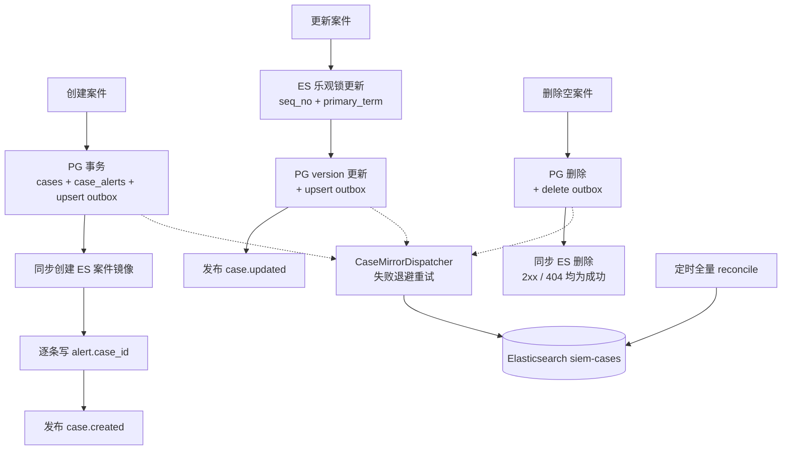

# 架构实现细节剖面：从代码到运行配置

> 本文展示当前 HISIEM 中“声明 → 编译 → 发布 → 流处理 → 处置”的实际实现。代码片段均来自当前仓库；个别片段省略 import、JDBC 参数或与主逻辑无关的分支。每节同时给出实现类、配置文件和生成物，便于从文档回到代码核对。系统总体边界见 [`architecture.md`](architecture.md)，接口和对象关系见 [`product-contract.md`](product-contract.md)。

## 1. 先看清楚一次配置变更会产生什么

同一个数据源在仓库里不是一份文件，而是一组有不同职责的产物：

~~~text
infra/parser-templates/ssh-auth.yaml
        │ Jackson YAML
        ▼
ParserTemplate（Java 类型化 DSL）
        │ GrokTestService + ParserTemplateService.validateGate
        ▼
LogstashConfigGenerator.generatePipeline(LogSource, ParserTemplate)
        │
        ├── infra/logstash/pipeline/log-sources/ls-54fc7d96.conf
        ├── infra/logstash/config/pipelines.yml
        ├── infra/docker-compose.yml（TCP/Syslog 端口映射）
        └── PostgreSQL audit_logs（配置 revision + actor）
~~~

运行时则是另一条链：

~~~text
source .conf
  ├─ 解析成功 → siem-events-* + Kafka siem-events
  │                       └─ Flink 严格解析
  │                            ├─ 合法事件 → DetectionJob → siem-alerts
  │                            └─ 坏 JSON/时间戳 → Kafka siem-events-dlq
  └─ Grok/date 失败 → siem-events-raw-*（不写 Kafka）
~~~

这个拆分的核心不是“文件很多”，而是把四类变化隔离：

| 变化 | 声明位置 | 执行位置 |
| --- | --- | --- |
| 日志长什么样 | parser template YAML | Logstash grok/date/mutate |
| 哪个端口/文件接入 | log source YAML | Logstash input + Compose |
| 什么事件算命中 | rule YAML | Flink typed operator |
| 分析师如何处置 | PostgreSQL/ES API | Alert/Case service 状态机 |

## 2. 解析模板不是注释：它会被反序列化、校验并编译

### 2.1 YAML 字段与 Java 对象一一对应

实现位置：`infra/parser-templates/ssh-auth.yaml`、`src/main/java/com/xscsiem/hsiem_platform/onboarding/ParserTemplate.java`。

当前 infra/parser-templates/ssh-auth.yaml 的实际结构（截取关键字段）是：

~~~yaml
id: ssh-auth
name: SSH 认证日志
protocol: tcp
ecs:
  event.category: authentication
patterns:
  - "%{SYSLOGTIMESTAMP:timestamp} %{HOSTNAME:host.name} sshd.*Failed password for %{USERNAME:user.name} from %{IP:source.ip}"
  - "%{SYSLOGTIMESTAMP:timestamp} %{HOSTNAME:host.name} sshd.*Failed password for invalid user %{USERNAME:user.name} from %{IP:source.ip}"
  - "%{SYSLOGTIMESTAMP:timestamp} %{HOSTNAME:host.name} sshd.*Accepted password for %{USERNAME:user.name} from %{IP:source.ip}"
timestamp:
  source: timestamp
  formats: ["MMM dd HH:mm:ss", "MMM  d HH:mm:ss"]
  timezone: Asia/Shanghai
actions:
  - match: "/Failed password/"
    fields:
      event.action: authentication_failure
      event.outcome: failure
      event.type: denied
tests:
  - sample: "Aug 1 10:20:00 server03 sshd[9999]: Failed password for test from 172.16.1.20"
    expect:
      user.name: test
      source.ip: 172.16.1.20
      event.action: authentication_failure
negative:
  - "not an ssh authentication line"
~~~

对应的 src/main/java/com/xscsiem/hsiem_platform/onboarding/ParserTemplate.java 不是一个无类型 Map，而是显式的中间表示：

~~~java
@JsonAutoDetect(fieldVisibility = JsonAutoDetect.Visibility.ANY)
public class ParserTemplate {
    public String id;
    public String name;
    public String description;
    public String protocol;
    public String status;
    public Map<String, String> ecs;
    public List<String> patterns;
    public Timestamp timestamp;
    public List<Action> actions;
    public List<Test> tests;
    public List<String> negative;

    public static class Timestamp {
        public String source;
        public List<String> formats;
        public String timezone;
    }

    public static class Action {
        public String match;
        public Map<String, String> fields;
    }
}
~~~

这样设计有两个直接收益：YAML 的字段结构能在 Java 层被验证，生成器也不需要猜测字符串含义；同时 tests、negative 和运行字段属于同一个对象，预览、保存和正式生成不会各自解析一遍不同格式。

### 2.2 预览解析与保存门禁实际共用一条代码路径

实现位置：`src/main/java/com/xscsiem/hsiem_platform/onboarding/GrokTestService.java`、`ParserTemplateService.java`、`OnboardingController.java`。

GrokTestService.test 的关键逻辑是“按顺序尝试 pattern，首个捕获成功后补固定字段和 action”：

~~~java
public ParseResult test(ParserTemplate template, String sample) {
    Map<String, Object> fields = new LinkedHashMap<>();
    fields.put("message", sample);
    boolean matched = false;

    for (String pattern : template.patterns) {
        Grok grok = compiler.compile(pattern);
        Match match = grok.match(sample);
        Map<String, Object> captures = match.capture();
        if (captures != null && !captures.isEmpty()) {
            captures.forEach((key, value) -> fields.put(key, first(value)));
            matched = true;
            break;
        }
    }
    if (!matched) return new ParseResult(false, fields);

    if (template.ecs != null) fields.putAll(template.ecs);
    if (template.actions != null) {
        for (ParserTemplate.Action action : template.actions) {
            if (action.match != null && matches(action.match, sample)) {
                fields.putAll(action.fields);
                break;
            }
        }
    }
    return new ParseResult(true, fields);
}
~~~

ParserTemplateService.validateGate 在任何文件写入之前调用同一个 grok.test：

~~~java
public void validateGate(ParserTemplate t) {
    if (t.id == null || t.id.isBlank())
        throw new IllegalArgumentException("模板 id 不能为空");
    if (t.patterns == null || t.patterns.isEmpty())
        throw new IllegalArgumentException("模板至少需要一个 grok 模式");
    if (t.tests == null || t.tests.isEmpty())
        throw new IllegalArgumentException("模板至少需要一个正样本");

    for (ParserTemplate.Test test : t.tests) {
        ParseResult result = grok.test(t, test.sample);
        if (!result.ok()) throw new IllegalArgumentException("正样本未命中");
        if (test.expect != null) {
            for (var expected : test.expect.entrySet()) {
                Object actual = result.fields().get(expected.getKey());
                if (!Objects.equals(String.valueOf(actual),
                        String.valueOf(expected.getValue()))) {
                    throw new IllegalArgumentException("正样本字段不符: " + expected.getKey());
                }
            }
        }
    }
    if (t.negative != null) {
        for (String negative : t.negative) {
            if (grok.test(t, negative).ok()) {
                throw new IllegalArgumentException("负样本不应命中: " + negative);
            }
        }
    }
}
~~~

通过后才执行：

~~~java
ConfigRevisionJournal.atomicWrite(file.toPath(),
        yamlMapper.writeValueAsString(t));
ConfigRevisionJournal.record(control, "parser-template",
        file.toPath(), actor());
~~~

这个顺序很关键：先验证，再原子写文件，再把内容 hash 和真实操作者写入审计；不会出现“页面预览成功、保存时换了一套解析器”或“半写 YAML 被 Logstash 读取”的情况。样例正文还由 SampleSizeValidator 限制为 API 最大 1 MiB、UI 最大 8 KiB。

### 2.3 Java 生成器如何逐字段编译成 .conf

实现位置：`src/main/java/com/xscsiem/hsiem_platform/onboarding/LogstashConfigGenerator.java`。

LogstashConfigGenerator.generateFilter 中的实际映射是：

~~~java
// patterns → grok.match
for (int i = 0; i < t.patterns.size(); i++) {
    sb.append("    \"").append(t.patterns.get(i)).append("\"")
      .append(i < t.patterns.size() - 1 ? "," : "").append("\n");
}
sb.append("  ] }\n  tag_on_failure => [\"_parsefailure\"]\n}\n");

// timestamp → date.match + timezone + @timestamp
sb.append("date {\n  match => [ \"").append(t.timestamp.source).append("\"");
for (String format : t.timestamp.formats) {
    sb.append(", \"").append(format).append("\"");
}
sb.append(" ]\n  timezone => \"").append(t.timestamp.timezone)
  .append("\"\n  target => \"@timestamp\"\n");

// actions → Logstash if + mutate
sb.append("if [message] =~ ").append(action.match)
  .append(" {\n  mutate { add_field => {");
~~~

这里的 i < size - 1 是有业务后果的：Logstash 8.14 的数组尾逗号会使 --config.test_and_exit 直接 FATAL。indent 把同一 filter 片段嵌入完整 pipeline，escape 处理名称、路径中的引号/换行，避免用户输入破坏配置语法。

同一个生成器还负责协议策略：

~~~java
String input = switch (protocol) {
    case "syslog" -> "syslog {\n    port => " + s.port + "\n";
    case "file" -> "file {\n    path => [\"" + escape(s.path) + "\"]\n"
            + "    start_position => \"beginning\"\n"
            + "    sincedb_path => \"/usr/share/logstash/data/sincedb-"
            + escape(s.id) + "\"\n";
    default -> "tcp {\n    port => " + s.port + "\n";
};
return input + "    add_field => { \"log.source_id\" => \""
        + escape(s.sourceId) + "\" \"log.source_name\" => \""
        + escape(s.name) + "\" }\n  }\n";
~~~

因此 file input 不再使用 /dev/null sincedb；每个来源拥有持久读取游标，重启不会从头重复读文件。

### 2.4 生成结果与源码逐段对应

对照文件：`infra/log-sources/ls-54fc7d96.yaml`、`infra/logstash/pipeline/log-sources/ls-54fc7d96.conf`；生成入口仍是 `LogstashConfigGenerator.generatePipeline`。

以 ls-54fc7d96 为例，infra/log-sources/ls-54fc7d96.yaml 声明：

~~~yaml
id: "ls-54fc7d96"
name: "demo-ssh-source"
protocol: "tcp"
templateId: "ssh-auth"
port: 5007
sourceId: "ls-54fc7d96"
status: "active"
~~~

生成的 infra/logstash/pipeline/log-sources/ls-54fc7d96.conf 对应为：

~~~conf
input {
    tcp {
        port => 5007
        add_field => { "log.source_id" => "ls-54fc7d96" "log.source_name" => "demo-ssh-source" }
      }
}

filter {
    # grok 解析(模板 ssh-auth)
    grok {
      match => { "message" => [
        "%{SYSLOGTIMESTAMP:timestamp} %{HOSTNAME:host.name} sshd.*Failed password for %{USERNAME:user.name} from %{IP:source.ip}",
        "%{SYSLOGTIMESTAMP:timestamp} %{HOSTNAME:host.name} sshd.*Failed password for invalid user %{USERNAME:user.name} from %{IP:source.ip}",
        "%{SYSLOGTIMESTAMP:timestamp} %{HOSTNAME:host.name} sshd.*Accepted password for %{USERNAME:user.name} from %{IP:source.ip}"
      ] }
      tag_on_failure => ["_parsefailure"]
    }
    # @timestamp = 日志时间
    date {
      match => [ "timestamp", "MMM dd HH:mm:ss", "MMM  d HH:mm:ss" ]
      timezone => "Asia/Shanghai"
      target => "@timestamp"
      tag_on_failure => ["_dateparsefailure"]
    }
    mutate {
      add_field => { "event.category" => "authentication" }
    }
    if [message] =~ /Failed password/ {
      mutate { add_field => { "event.action" => "authentication_failure" "event.outcome" => "failure" "event.type" => "denied" } }
    }
    if [message] =~ /Accepted password/ {
      mutate { add_field => { "event.action" => "authentication_success" "event.outcome" => "success" "event.type" => "allowed" } }
    }

  # 字段规范化(ECS 对齐,决策 D:扁平存储)
  mutate {
    remove_field => [ "timestamp" ]
    add_field => {
      "pipeline" => "mini-siem"
      "event.schema_version" => "1.0"
    }
    add_field => { "related.ip" => "%{source.ip}" }
  }
  if [source.ip] {
    geoip {
      source => "source.ip"
      target => "source"
    }
  }
}

output {
  if "_parsefailure" in [tags] or "_dateparsefailure" in [tags] {
    elasticsearch {
      hosts => ["http://elasticsearch:9200"]
      index => "siem-events-raw-%{+YYYY.MM.dd}"
    }
  } else {
    elasticsearch {
      hosts => ["http://elasticsearch:9200"]
      index => "siem-events-%{+YYYY.MM.dd}"
    }

    kafka {
      bootstrap_servers => "kafka:9092"
      topic_id => "siem-events"
      codec => json
      acks => "all"
      retries => 5
      retry_backoff_ms => 1000
      compression_type => "zstd"
      batch_size => 131072
      linger_ms => 5
    }
  }
}
~~~

这里不是 YAML 复制到 conf：templateId 选择了解析 DSL，protocol/port 选择了 input 策略，sourceId/name 被注入每条事件，timestamp 变成事件时间，actions 变成 Logstash 条件。预览 API 和激活流程都调用 generatePipeline，所以预览内容就是实际部署内容的同源结果。

## 3. 数据源激活的实现：状态机 + 补偿发布

### 3.1 创建阶段先写声明，激活阶段才接触外部系统

实现位置：`src/main/java/com/xscsiem/hsiem_platform/onboarding/LogSourceService.java`、`src/main/java/com/xscsiem/hsiem_platform/control/BackgroundTaskController.java`。

LogSourceService.create 只接受 tcp/syslog/file，file 强制 port=0，TCP/Syslog 检查 1–65535 和 JVM 内端口锁：

~~~java
final int requestedPort = port;
synchronized (portLock) {
    boolean taken = requestedPort > 0 && store.list().stream()
            .anyMatch(s -> s.port == requestedPort
                    && !"file".equalsIgnoreCase(s.protocol));
    if (taken) throw new PortConflictException(requestedPort);
    LogSource s = LogSource.creating(name, protocol, templateId, port, path);
    store.save(s);                 // creating
    return s;
}
~~~

激活不是 HTTP 请求内同步完成，而是先创建 background_tasks 记录，把状态改成 creating，worker 再执行；下面是去掉 null 保护后的核心分支：

~~~java
if (!lifecycleInFlight.add(id)) {
    throw new ConflictException("数据源正在执行其他生效任务: " + id);
}
s.status = "creating";
s.taskId = control.createTask("log_source_activate",
        id, "等待数据源配置生效");
store.save(s);
ACTIVATOR.execute(() -> {
    if (taskId != null && !control.claimTask(taskId, TASK_OWNER,
            Instant.now().plusSeconds(600))) return;
    if (taskId != null) control.heartbeatTask(taskId, TASK_OWNER,
            Instant.now().plusSeconds(600), 10, "正在生成 Logstash 配置");
    if (taskId != null) control.heartbeatTask(taskId, TASK_OWNER,
            Instant.now().plusSeconds(600), 40, "正在校验并同步 Logstash 配置");
    LogSource result = activateSync(id);
    if (taskId != null) control.updateTask(taskId,
            result.status.equals("active") ? "succeeded" : "failed", 100,
            result.status.equals("active") ? "数据源已生效" : "数据源生效失败",
            result.status.equals("active") ? null : result.lastError);
});
~~~

状态的含义是可观察的：creating 表示任务仍在执行，active 表示 Logstash 已通过校验并完成 reload/restart，failed 携带 lastError，stopped 表示声明保留但 pipeline 已移除。

### 3.2 ActivationCoordinator 不是普通文件写入器

实现位置：`src/main/java/com/xscsiem/hsiem_platform/onboarding/ActivationCoordinator.java`、`LogstashDeployer.java`。

激活方法的关键顺序如下：

~~~java
public synchronized void activate(LogSource s, ParserTemplate t) {
    Path confFile = Path.of(pipelineDir, "log-sources", s.id + ".conf");
    Path pipelines = Path.of(configDir, "pipelines.yml");
    Path compose = Path.of(composeFile);
    String containerPath = containerPipelineRoot + "/log-sources/" + s.id + ".conf";
    String pipelinesBackup = Files.exists(pipelines) ? Files.readString(pipelines) : "";
    String composeBackup = null;
    try {
        String conf = generator.generatePipeline(s, t);
        atomicWrite(confFile, conf);
        String entry = "- pipeline.id: " + pipelineId(s) + "\n"
                + "  path.config: \"" + containerPath + "\"\n"
                + "  pipeline.ecs_compatibility: v8\n";
        String base = pipelinesBackup.endsWith("\n")
                ? pipelinesBackup : pipelinesBackup + "\n";
        atomicWrite(pipelines, base + entry);
        composeBackup = addPortToCompose(compose, s.port);

        deployer.syncLogstash();
        if (!deployer.validateConfig(containerPath)) {
            rollbackAndResync(confFile, pipelines, pipelinesBackup,
                    compose, composeBackup);
            throw new ActivationFailedException("Logstash 配置校验失败,已回滚");
        }
        if (portProtocol(s)) deployer.restartLogstash();
        else deployer.reloadLogstash();

        ConfigRevisionJournal.record(control,
                "logstash-pipeline", confFile, "system");
    } catch (IOException | RuntimeException e) {
        rollbackAndResync(confFile, pipelines, pipelinesBackup,
                compose, composeBackup);
        throw new ActivationFailedException("生效失败,已回滚", e);
    }
}
~~~

对应的 pipelines.yml 生成项是：

~~~yaml
- pipeline.id: ls-54fc7d96
  path.config: "/usr/share/logstash/pipeline/log-sources/ls-54fc7d96.conf"
  pipeline.ecs_compatibility: v8
~~~

端口协议必须 restart，因为 Docker Compose 的宿主端口只在容器创建时生效；file pipeline 没有宿主端口，可以直接 HUP reload。同步、配置测试、重启任一步失败都恢复仓库文件并再次同步 WSL，防止“本地已回滚、WSL 仍残留坏配置”。ProcessLogstashDeployer 还并行消费外部进程输出，避免 stdout 管道写满导致 waitFor 假死。

### 3.3 规则发布使用另一套带 savepoint 的补偿

实现位置：`src/main/java/com/xscsiem/hsiem_platform/rules/ProcessRulesDeployer.java`、`RuleService.java`、`RuleController.java`。

ProcessRulesDeployer.syncRules 不覆盖 /opt/flink/rules，而是建立 revision 目录：

~~~java
String revision = "rev-" + Instant.now().toEpochMilli() + "-"
        + UUID.randomUUID().toString().substring(0, 8);
String target = "/opt/flink/rules-revisions/" + revision;
run("docker", "exec", containerName, "mkdir", "-p", target);
run("wsl", "bash", "-c", "docker cp " + wslRepoPath
        + "/infra/rules/. " + containerName + ":" + target + "/");
activeRulesDir = target;
~~~

重启流程是 cancel -s savepoint → 从 savepoint 用新目录提交 → 轮询 flink list 确认 RUNNING；新目录提交失败则用相同 savepoint 和 lastSuccessfulRulesDir 恢复旧 Job。规则变更因此不会因为一次提交失败而让检测面长期停机。

## 4. Logstash 到 Flink 的数据质量和 schema 细节

### 4.1 正常事件与隔离事件在 output 层分叉

实现位置：`LogstashConfigGenerator.generatePipeline` 以及生成物 `infra/logstash/pipeline/log-sources/*.conf`。

生成器实际写出的 output 逻辑是：

~~~conf
output {
  if "_parsefailure" in [tags] or "_dateparsefailure" in [tags] {
    elasticsearch {
      hosts => ["http://elasticsearch:9200"]
      index => "siem-events-raw-%{+YYYY.MM.dd}"
    }
  } else {
    elasticsearch { index => "siem-events-%{+YYYY.MM.dd}" }
    kafka {
      bootstrap_servers => "kafka:9092"
      topic_id => "siem-events"
      codec => json
      acks => "all"
      retries => 5
      compression_type => "zstd"
      batch_size => 131072
      linger_ms => 5
    }
  }
}
~~~

失败事件保留在 ES 供 DataHealth 查询，但不进入 Kafka，因此不会因为未知字段触发 Flink 规则。正常事件会同时保留检索副本和检测总线副本。

### 4.2 ES template 约束字段类型，历史索引用 reindex 切换

实现位置：`infra/elasticsearch/siem-events-template.json`、`infra/elasticsearch/siem-events-raw-template.json`、`infra/elasticsearch/reindex-mappings.sh`。

infra/elasticsearch/siem-events-template.json 的动态映射不是一律 keyword：

~~~json
"dynamic_templates": [
  { "suffix_id": { "match": "*_id",
                   "mapping": { "type": "keyword" } } },
  { "log_path": { "path_match": "log.*",
                  "mapping": { "type": "keyword" } } },
  { "ip_fields": { "match_mapping_type": "string", "match": "*ip*",
                   "mapping": { "type": "ip" } } },
  { "default_string": { "match_mapping_type": "string",
                        "mapping": { "type": "keyword" } } }
]
~~~

source.ip 是 ip 类型，event.original/message 保留文本能力，related_events 在告警模板中是 nested。raw 模板 priority 更高，覆盖 siem-events-* 对 raw 名称的通配匹配。模板只影响新索引，因此 reindex-mappings.sh 采取“新索引 → _reindex → alias 原子切换”，而不是尝试修改既有 mapping。

### 4.3 Flink 先扁平化 JSON，再按事件时间计算

实现位置：`flink/src/main/java/com/siem/EventParser.java`、`EventParsingProcessFunction.java`、`Event.java`、`DetectionJob.java`。

Logstash JSON 可能产生嵌套对象，但规则 YAML 使用 source.ip、event.action 这样的点分字段。EventParser 递归展开 Map，List 保持原样：

~~~java
private static void flatten(String prefix, Map<String, Object> map,
                            Map<String, Object> out) {
    for (Map.Entry<String, Object> entry : map.entrySet()) {
        String key = prefix.isEmpty() ? entry.getKey() : prefix + "." + entry.getKey();
        Object value = entry.getValue();
        if (value instanceof Map) flatten(key, (Map<String, Object>) value, out);
        else out.put(key, value);
    }
}

public static Event parseEvent(String json) throws Exception {
    Map<String, Object> fields = parse(json);
    return new Event(json, fields, timestampMillis(fields.get("@timestamp")));
}
~~~

解析不再用 processing time 掩盖缺失或非法 `@timestamp`。`EventParsingProcessFunction` 捕获坏 JSON/事件时间异常，正常 Event 输出到主流，失败记录输出到 Flink side output，再以 `AT_LEAST_ONCE` 写入 `siem-events-dlq`：

~~~java
ParseOutcome outcome = parse(value);
if (outcome.event() != null) output.collect(outcome.event());
else context.output(DLQ, outcome.dlqRecord());
~~~

DLQ 记录包含确定性 SHA-256 `dlq.id`、stage、异常类型/消息、失败时间、原始消息与 64 KiB 截断标记。这种分流同时保护两件事：毒消息不会触发 Flink restart loop，也不会以伪造的“当前时间”进入窗口、CEP 和事件排序。DLQ 当前只负责隔离/观测，修复后必须从受控入口重新产生标准事件。

## 5. Flink 规则如何从 YAML 变成不同算子

### 5.1 条件树由递归 builder 生成

实现位置：`flink/src/main/java/com/siem/config/RuleBuilder.java`、`RuleDecl.java`、`Condition` 各实现类。

规则文件中的条件：

对应文件：`infra/rules/rule-common-user-bruteforce-001.yaml`。

~~~yaml
category: single_event
condition:
  type: all
  conditions:
    - { type: field_equals, field: event.action, value: authentication_failure }
    - type: field_in
      field: user.name
      values: [admin, test, guest, postgres]
~~~

RuleBuilder.buildCondition 把它转换成组合对象，而不是在 DetectionJob 里拼字符串：

~~~java
return switch (spec.type) {
    case "field_equals" -> new FieldEqualsCondition(spec.field, spec.value);
    case "field_in" -> new FieldInCondition(spec.field, spec.values.toArray());
    case "all" -> new AllCondition(subConditions(spec, "all"));
    case "any" -> new AnyCondition(subConditions(spec, "any"));
    case "not" -> new NotCondition(buildCondition(spec.conditions.get(0)));
    default -> throw new IllegalArgumentException("未知条件类型: " + spec.type);
};
~~~

这个递归边界还负责拒绝非法声明，例如 not 不是恰好一个子条件、field_in 没有 values、window 规则缺少 keyField/windowMinutes/threshold。

### 5.2 四种 category 在 DetectionJob 中走四条真实执行分支

实现位置：`flink/src/main/java/com/siem/DetectionJob.java`、`WindowRuleFunction.java`、`BruteforceSuccessFunction.java`、`BaselineAnomalyFunction.java`。

~~~java
List<RuleDecl> enabled = decls.stream().filter(d -> d.enabled).toList();

DataStream<String> singleAlerts = parsed
        .flatMap(new DetectionFunction(new RuleRegistry(singleRules)))
        .keyBy(AlertSuppressor::suppressionKey)
        .process(new AlertSuppressor(Duration.ofMinutes(60)));

for (RuleDecl d : enabled.stream().filter(x -> "window".equals(x.category)).toList()) {
    WindowRule wr = builder.toWindowRule(d);
KeyedStream<Event, String> keyed = parsedTimed.keyBy(e -> String.valueOf(
        e.getFields().getOrDefault(wr.getKeyField(), "unknown")));
SingleOutputStreamOperator<String> windowed;
if (wr.getSlidingMinutes() != null && wr.getSlidingMinutes() > 0) {
    windowed = keyed.window(SlidingEventTimeWindows.of(
                    Duration.ofMinutes(wr.getWindowMinutes()),
                    Duration.ofMinutes(wr.getSlidingMinutes())))
            .process(new WindowRuleFunction(wr));
} else {
    windowed = keyed.window(TumblingEventTimeWindows.of(
                    Duration.ofMinutes(wr.getWindowMinutes())))
            .process(new WindowRuleFunction(wr));
}
}

for (RuleDecl d : enabled.stream().filter(x -> "cep".equals(x.category)).toList()) {
    RuleMeta meta = builder.toMeta(d);
    CEP.pattern(parsedTimed.keyBy(e -> String.valueOf(
            e.getFields().getOrDefault(d.keyField, "unknown"))),
            buildCepPattern(d.cep))
            .process(new BruteforceSuccessFunction(
                    meta.id(), meta.name(), meta.type(), meta.severity(),
                    meta.description(), meta.riskScore(), meta.tags(),
                    meta.status(), meta.version()))
            .uid("cep-" + d.id);
}

for (RuleDecl d : enabled.stream().filter(x -> "baseline".equals(x.category)).toList()) {
    RuleDecl.BaselineDecl b = d.baseline;
    if (b == null || b.baselineHours == null || b.minBaselineHours == null)
        throw new IllegalArgumentException("baseline 规则缺少 baseline 参数: " + d.id);
    RuleMeta meta = builder.toMeta(d);
    long windowHours = b.windowHours == null ? 1L : b.windowHours;
    parsedTimed.keyBy(e -> String.valueOf(
            e.getFields().getOrDefault(b.keyField, "unknown")))
            .window(TumblingEventTimeWindows.of(Duration.ofHours(windowHours)))
            .process(new BaselineAnomalyFunction(b.baselineHours, b.minBaselineHours, meta));
}
~~~

四条分支共享同一事件时间流：

~~~java
WatermarkStrategy.<Event>forBoundedOutOfOrderness(Duration.ofSeconds(10))
    .withTimestampAssigner((event, recordTs) -> event.getTimestampMillis())
    .withIdleness(Duration.ofSeconds(60));
~~~

10 秒是乱序容忍，不是“平台时间”；60 秒 idle 是为了避免某个暂时无日志的 key 阻塞其它 key 的窗口关闭。滑动窗口覆盖边界后，再由 WindowAlertSuppressor 按规则+实体抑制重复告警。

### 5.3 checkpoint、Kafka offset 和 operator UID 是可恢复性的三层

实现位置：`flink/src/main/java/com/siem/DetectionJob.java` 运行环境初始化和 Kafka source 构建部分。

~~~java
env.enableCheckpointing(tuning.checkpointIntervalMs(), CheckpointingMode.EXACTLY_ONCE);
env.getCheckpointConfig().setCheckpointTimeout(tuning.checkpointTimeoutMs());
env.getCheckpointConfig().setMaxConcurrentCheckpoints(1);
env.getCheckpointConfig().setTolerableCheckpointFailureNumber(
        tuning.tolerableCheckpointFailures());

KafkaSource.<String>builder()
    .setTopics("siem-events")
    .setGroupId("siem-detection")
    .setStartingOffsets(OffsetsInitializer.committedOffsets(EARLIEST));
~~~

checkpoint 持久化到 /opt/flink/checkpoints，Kafka 从已提交 offset 恢复，首次启动才回退 earliest，算子通过 .uid("...") 固定状态身份。三者共同决定重启后是继续消费、恢复窗口状态，还是从头建立检测状态。

## 6. 告警写入为什么不会轻易重复或覆盖处置

### 6.1 确定性 _id 把重放变成更新

实现位置：`flink/src/main/java/com/siem/DetectionJob.java` 的 `alertId`、ES sink 构建部分。

DetectionJob.alertId 实际计算：

~~~java
String ruleId = String.valueOf(alert.getOrDefault("alert.rule_id", "unknown"));
Object declaredEntity = alert.get("alert.entity");
Object ip = alert.get("source.ip");
Object user = alert.get("user.name");
String entity = declaredEntity != null ? String.valueOf(declaredEntity)
        : (ip != null ? String.valueOf(ip)
        : (user != null ? String.valueOf(user) : "unknown"));
String ts = String.valueOf(alert.getOrDefault("@timestamp", "unknown"));
return sha1Hex(ruleId + "|" + entity + "|" + ts);
~~~

同一个规则、实体、事件时间再次进入 Kafka 时，ES _id 相同，写入不会新增第二条文档。

### 6.2 Flink sink 对分析师字段做 partial update 保护

实现位置：`flink/src/main/java/com/siem/DetectionJob.java` 的 `toBulkOperation`。

~~~java
Map<String, Object> full = ALERT_MAPPER.readValue(element, Map.class);
Map<String, Object> patch = new HashMap<>(full);
Set<String> protectedFields = Set.of(
        "alert.status", "alert.analyst_verdict", "alert.operator",
        "alert.status_updated_at", "alert.case_id");
protectedFields.forEach(patch::remove);

return new UpdateOperation.Builder<JsonData, JsonData>()
        .index("siem-alerts")
        .id(alertId(element))
        .action(new UpdateAction.Builder<JsonData, JsonData>()
                .doc(JsonData.fromJson(ALERT_MAPPER.writeValueAsString(patch)))
                .upsert(JsonData.fromJson(element))
                .docAsUpsert(true)
                .build())
        .build();
~~~

首次命中用完整文档 upsert，后续检测更新只提交检测侧字段。窗口结束、作业重放或 suppression timer 不会把分析师刚写入的 status、verdict、operator、case 关系覆盖掉。

### 6.3 分析师更新使用 ES 乐观锁，并且批量请求先预检查

实现位置：`src/main/java/com/xscsiem/hsiem_platform/alert/AlertService.java`、`AlertController.java`。

AlertService 先 GET 得到 _seq_no/_primary_term，再发送：

~~~java
int code = esCallCode("POST",
        "/siem-alerts/_update/" + id
        + "?if_seq_no=" + seqObj + "&if_primary_term=" + ptObj,
        "{\"doc\":" + MAPPER.writeValueAsString(doc) + "}");
if (code == 409) {
    throw new ConflictException("告警已被其他分析师更新,请刷新后重试");
}
~~~

批量处置先逐条读取文档，检查结案是否有 verdict、状态转移是否合法，再执行逐条更新（下面省略校验方法参数）：

~~~java
for (String id : ids) {
    Map<String, Object> current = esGet("/siem-alerts/_doc/" + id);
    currentById.put(id, current); // verdict-only 也必须拿版本
    validateStatusTransition(...);
}
if (!missingVerdict.isEmpty() || !invalidTransitions.isEmpty()) throw ...;
for (String id : ids) {
    try {
        optimisticUpdate(id, buildDoc(status, verdict, operator),
                currentById.get(id));
    } catch (Exception e) {
        failed.add(id);
    }
}
~~~

因此“只提交 verdict”的批量请求不会因为缺少版本号全部失败，单条并发冲突也会被明确返回，而不是静默覆盖。

## 7. 案件一致性：PostgreSQL 事实、同步保护与 outbox 收敛

当前实现不是“只写 PostgreSQL、完全异步镜像”的纯 outbox，也不是把 PostgreSQL 和 Elasticsearch 假装成一个事务。`CaseService` 仍保留同步 ES 路径，用于创建时立即建立可见镜像、更新时利用 `_seq_no/_primary_term` 拒绝并发覆盖，以及维护告警的 `alert.case_id`；同一笔 PostgreSQL 事务还写入 outbox，进程或网络故障后由 dispatcher 重试。准确的数据流如下：

这张图中的三条主路径顺序不同：创建以 PostgreSQL 为先，更新以 ES 乐观锁为先，删除以 PostgreSQL 为先。任何一条都不提供跨 PG/ES/Kafka 的原子提交；补偿、outbox 与定时 reconcile 只负责暴露失败并让状态收敛。

### 7.1 案件主表、关系表和 outbox 在同一数据库事务中落地

实现位置：`src/main/java/com/xscsiem/hsiem_platform/control/JdbcControlPlaneStore.java`、`src/main/resources/db/migration/V*.sql`。

JdbcControlPlaneStore.createCase 的核心 SQL（JDBC 参数映射省略）：

~~~java
@Transactional
public void createCase(Map<String, Object> document, List<String> alertIds) {
    jdbc.update("""
        INSERT INTO cases(id, title, status, aggregation, operator, owner, verdict,
            created_at, updated_at, closed_at, alert_ids_json, entities_json,
            evidence_json, collaborators_json, version)
        VALUES (?, ?, ?, ?, ?, ?, ?, ?, ?, ?, ?, ?, ?, ?, 0)
        """, ...);
    insertRelations(value(document, "case.id"), alertIds);
    enqueueCaseMirror(value(document, "case.id"), "upsert", document);
}
~~~

cases.version 在 update 时作为乐观锁：

~~~sql
UPDATE cases
SET ..., version = version + 1
WHERE id = ? AND version = ?;
~~~

更新行数为 0 即表示并发修改，业务层要求刷新后重试。case_alerts.alert_id 有唯一约束，告警不能同时归属多个案件。

### 7.2 outbox 合并、租约和退避分别解决三个问题

实现位置：`src/main/java/com/xscsiem/hsiem_platform/investigation/CaseMirrorDispatcher.java`、`ControlPlaneStore.java`。

case_mirror_outbox 的实际字段：

~~~sql
CREATE TABLE case_mirror_outbox (
    id BIGINT GENERATED BY DEFAULT AS IDENTITY PRIMARY KEY,
    case_id VARCHAR(128) NOT NULL,
    operation VARCHAR(16) NOT NULL,
    payload_json TEXT,
    status VARCHAR(16) NOT NULL DEFAULT 'pending',
    attempts INTEGER NOT NULL DEFAULT 0,
    available_at TIMESTAMP WITH TIME ZONE NOT NULL DEFAULT CURRENT_TIMESTAMP,
    locked_until TIMESTAMP WITH TIME ZONE,
    lease_owner VARCHAR(128),
    last_error TEXT,
    created_at TIMESTAMP WITH TIME ZONE NOT NULL DEFAULT CURRENT_TIMESTAMP,
    updated_at TIMESTAMP WITH TIME ZONE NOT NULL DEFAULT CURRENT_TIMESTAMP,
    CONSTRAINT case_mirror_outbox_operation_ck CHECK (operation IN ('upsert', 'delete')),
    CONSTRAINT case_mirror_outbox_status_ck CHECK (status IN ('pending', 'in_flight', 'succeeded', 'failed'))
);
CREATE INDEX case_mirror_outbox_ready_idx
    ON case_mirror_outbox (status, available_at, locked_until);
~~~

连续更新同一案件时，enqueueCaseMirror 先把已有 pending/failed upsert 的 payload 替换成最新文档；delete 不允许被旧 upsert 覆盖。dispatcher 领取时写入 owner、lease 和 attempts：

~~~java
List<Map<String, Object>> batch = control.claimCaseMirrorBatch(
        owner, Instant.now().plus(lease), 50);
...
control.completeCaseMirror(id, owner, true, null, Instant.now());
~~~

ES 失败时按 min(300s, 2^attempts) 计算下一次时间并保留清洗后的错误；进程重启后 pending/failed 记录仍在数据库，不需要依赖原 JVM 内存。

DELETE 镜像把任意 HTTP 2xx 和 404 都视为幂等成功：2xx 覆盖 Elasticsearch 可能返回的多种成功状态，404 表示目标已经不存在；其他状态才进入退避重试。对应回归测试直接模拟 200，防止再次把成功删除错误判断为失败。

需要注意，当前 claim SQL 使用 `FOR UPDATE`，并没有使用 `SKIP LOCKED`；多个 dispatcher 实例不会同时成功处理同一行，但可能在领取阶段等待数据库行锁。这对当前规模可用，不应在架构文档中写成无阻塞的横向领取。

### 7.3 同步 ES 路径承担即时校验，outbox 承担故障后收敛

创建时 `control.createCase` 会在 PostgreSQL 中写事实和 outbox，随后 `CaseService` 同步创建 ES 案件文档；如果同步 ES 写失败，会删除刚创建的 PostgreSQL 案件，并由 delete outbox 继续清理可能存在的镜像。更新的顺序相反：先对 ES 文档做 `_seq_no/_primary_term` 乐观锁更新，再以 PostgreSQL `version` 更新关系事实并排入最新镜像。删除则先删除 PostgreSQL 事实并排入 delete outbox，之后同步 ES 删除失败只记录警告，交给 dispatcher 重试。

因此 outbox 是恢复机制，不是当前用户请求的唯一写路径。控制面读取优先使用 PostgreSQL；ES 中的 `siem-cases` 是兼容检索镜像，而事件时间线仍直接查询 `siem-events-*`。

### 7.4 告警 case_id 是快速索引，业务层仍有补偿

实现位置：`src/main/java/com/xscsiem/hsiem_platform/investigation/CaseService.java`。

案件创建前先检查所有告警 open 且没有其它 case_id。案件和关系成功后，再逐条写 ES alert marker：

~~~java
for (String id : alertIds) {
    int code = esCallCode("POST", "/siem-alerts/_update/" + id,
            "{\"doc\":{\"alert.case_id\":\"" + caseId + "\"}}");
    if (code / 100 == 2) marked.add(id);
    else failed.add(id);
}
if (!failed.isEmpty()) {
    for (String id : marked) clearAlertCase(id);
    throw new IllegalStateException("告警标记案件失败,已回滚成功标记");
}
~~~

这段补偿不能制造跨 ES 索引事务，但它把“部分告警已归案、部分没有”的孤儿状态显式暴露出来，并尽力清理已成功 marker。ES 只保留查询镜像，控制面是案件事实源；旧 ES 案件在查询时才惰性导入 PostgreSQL。

## 8. 配置 revision、后台任务和关键度文件的持久化细节

### 8.1 文件配置统一原子写入并记录内容 hash

实现位置：`src/main/java/com/xscsiem/hsiem_platform/control/ConfigRevisionJournal.java`。

ConfigRevisionJournal.atomicWrite 的机制：

~~~java
Path tmp = Files.createTempFile(parent, path.getFileName().toString(), ".tmp");
try {
    Files.writeString(tmp, content, StandardCharsets.UTF_8);
    try {
        Files.move(tmp, path, REPLACE_EXISTING, ATOMIC_MOVE);
    } catch (AtomicMoveNotSupportedException e) {
        Files.move(tmp, path, REPLACE_EXISTING);
    }
} finally {
    Files.deleteIfExists(tmp);
}
~~~

record 对最终文件计算 SHA-256，审计目标形如 kind:path#revision-prefix。规则启停更进一步只替换 YAML 的 enabled: true/false 行，保留注释和字段顺序，避免管理 UI 产生整文件重排。

### 8.2 任务租约让进程内 worker 具备可收敛状态

实现位置：`src/main/java/com/xscsiem/hsiem_platform/control/BackgroundTaskRecovery.java`、`ControlPlaneStore.java`、`src/main/resources/db/migration/V7__outbox_task_leases.sql`。

background_tasks 在 V7 增加：

~~~sql
ALTER TABLE background_tasks ADD COLUMN lease_owner VARCHAR(128);
ALTER TABLE background_tasks ADD COLUMN lease_until TIMESTAMP WITH TIME ZONE;
ALTER TABLE background_tasks ADD COLUMN heartbeat_at TIMESTAMP WITH TIME ZONE;
ALTER TABLE background_tasks ADD COLUMN attempts INTEGER NOT NULL DEFAULT 0;
ALTER TABLE background_tasks ADD COLUMN max_attempts INTEGER NOT NULL DEFAULT 3;
~~~

worker 领取任务、定期 heartbeat、最终更新状态；BackgroundTaskRecovery 在启动和每 60 秒扫描一次，把超过 stale-after（默认 5 分钟）的任务标记为 failed：

~~~java
control.recoverStaleTasks(
        Instant.now().minus(staleAfter),
        "服务重启或任务心跳超时，任务未能完成；请重新提交");
~~~

这没有把任务伪装成可自动续跑；它准确表达“原执行上下文已经消失，需要人工重试”，避免前端永久显示进行中。

### 8.3 资产关键度更新是全量校验、单次替换

实现位置：`src/main/java/com/xscsiem/hsiem_platform/settings/CriticalityService.java`、`CriticalityRecalcCoordinator.java`、`ProcessCriticalityDeployer.java`。

CriticalityService 只允许 ip/user/host，校验 key 长度、字符集和 IP 格式；级别映射为 low=0.5、medium=1.0、high=1.5、extreme=2.0。批量接口先验证最多 1000 条全部输入，再写一次临时文件并原子替换，任何一项失败都不改变旧文件。

异步重算不是“只返回 200”：CriticalityRecalcCoordinator 写入任务、claim、heartbeat，ProcessCriticalityDeployer 实际调用：

~~~text
wsl bash -c "python3 infra/elasticsearch/entity-risk.py --write"
~~~

成功后更新任务、生成通知并记录 actor；外部命令输出会清除 NUL 字符并限制 4000 字节，避免 WSL 的编码污染 PostgreSQL。

## 9. 认证实现展示：输出 DTO、持久会话和首次改密

实现位置：`src/main/java/com/xscsiem/hsiem_platform/auth/AuthUserView.java`、`AuthService.java`、`BearerSessionFilter.java`。

用户实体内部含 passwordHash，但管理 API 使用独立输出类型：

~~~java
public record AuthUserView(
        String id, String username, String role, String status,
        String createdAt, boolean passwordChangeRequired) {
    public static AuthUserView from(AuthUser user) {
        return new AuthUserView(user.id, user.username, user.role,
                user.status, user.createdAt, user.passwordChangeRequired);
    }
}
~~~

登录返回原始 token，但 PostgreSQL 只保存 SHA-256(token)；请求经过 BearerSessionFilter 后才构造 Spring Security Authentication。首次登录账号的 passwordChangeRequired=true 时，除了 login/password/me/logout 之外的 API 直接返回 428：

~~~java
if (user.passwordChangeRequired && requiresPasswordChange(request)) {
    response.setStatus(428);
    response.getWriter().write(
        "{\"code\":\"PASSWORD_CHANGE_REQUIRED\",\"message\":\"请先修改密码\"}");
    return;
}
~~~

密码修改成功才把标志置为 false；登录失败在 PostgreSQL login_attempts 中按窗口累计并锁定。Authentication#getName 使用用户名字符串，审计日志得到稳定 actor，而不是序列化整个用户对象。

## 10. 运行态健康检查的代码分层

### 10.1 Kafka 检查 topic、分区、group offset 和 lag

实现位置：`src/main/java/com/xscsiem/hsiem_platform/health/OperationalHealthService.java`。

OperationalHealthService.kafka() 不是 Socket.connect：

~~~java
var description = admin.describeTopics(List.of(kafkaTopic))
        .allTopicNames().get(4, TimeUnit.SECONDS).get(kafkaTopic);
if (description == null || description.partitions().isEmpty()) return down("topic 不存在或没有分区");
List<TopicPartition> partitions = description.partitions().stream()
        .map(p -> new TopicPartition(kafkaTopic, p.partition())).toList();
Map<TopicPartition, OffsetSpec> requests = new HashMap<>();
partitions.forEach(p -> requests.put(p, OffsetSpec.latest()));
Map<TopicPartition, Long> end =
        admin.listOffsets(requests).all().get(4, TimeUnit.SECONDS)
        .entrySet().stream()
        .collect(Collectors.toMap(Map.Entry::getKey, e -> e.getValue().offset()));
Map<TopicPartition, OffsetAndMetadata> committed =
        admin.listConsumerGroupOffsets(kafkaGroup)
        .partitionsToOffsetAndMetadata().get(4, TimeUnit.SECONDS);

long lag = 0;
int missing = 0;
for (TopicPartition partition : partitions) {
    Long latest = end.get(partition);
    OffsetAndMetadata offset = committed.get(partition);
    if (latest != null && offset != null) {
        lag += Math.max(0, latest - offset.offset());
    }
    if (offset == null) missing++;
}
~~~

没有 topic、所有 partition 都没有 group offset 或 lag 超过 kafkaMaxLag 才会返回 DOWN，并把 topic、group、partition 数和 lag 放进结果；缺失 offset 不会触发空指针，而是计入 missing。

### 10.2 Logstash API 失败时明确标记降级

实现位置：`src/main/java/com/xscsiem/hsiem_platform/health/OperationalHealthService.java`。

~~~java
Map<String, Object> monitoring = httpJson(
        "logstash", logstashUrl + "/_node/pipelines",
        node -> node.path("pipelines").isObject()
              && node.path("pipelines").size() > 0,
        "Logstash 没有活动 pipeline");
if ("UP".equals(monitoring.get("status"))) return monitoring;

Map<String, Object> socket = tcp("logstash", host, port);
if ("UP".equals(socket.get("status"))) {
    socket.put("probe", "tcp");
    socket.put("degraded", true);
    socket.put("warning", "监控 API 不可用，仅确认端口监听");
}
return socket;
~~~

因此用户看到的 UP 并不掩盖 API 不可用；Flink 还要求 /overview 中存在 RUNNING Job，Kibana 要求 overall level 为 available。扫描本身用 Micrometer 记录次数、耗时和最后扫描时间。

## 11. 前端实现如何承接后端真实状态

### 11.1 所有请求通过一个协议边界

实现位置：`web/src/api/index.js`、`src/main/java/com/xscsiem/hsiem_platform/onboarding/GlobalExceptionHandler.java`。

Vue 控制台的统一 request 直接处理超时、401、非 JSON 和 204，并保留状态码与错误代码：

~~~javascript
const controller = new AbortController()
const timeout = window.setTimeout(() => controller.abort(), 10000)
try {
  r = await fetch(BASE + path, {
    ...options,
    signal: options?.signal || controller.signal,
    headers: authHeaders(options?.headers),
  })
} finally {
  window.clearTimeout(timeout)
}
if (r.status === 401 && path !== '/auth/login') {
  authToken = ''
  localStorage.removeItem('siem_token')
}
const raw = await r.text()
let body = null
if (raw.trim()) {
  try { body = JSON.parse(raw) } catch {
    body = { message: raw.slice(0, 200) }
  }
}
if (!r.ok) throw new Error(body?.message || "请求失败: " + r.status)
return r.status === 204 || !raw.trim() ? null : body
~~~

后端 GlobalExceptionHandler 将 400/404/409/401/403/500 统一成 ApiError(timestamp,status,code,message,path)，前端不会把后端异常误显示成空数据。

### 11.2 告警详情先组织调查信息，再保留完整对象

实现位置：`web/src/views/alerts/AlertDetailView.vue`、`web/src/components/alerts/AlertDetails.vue`。

告警列表使用 `_id` 作为 row key，只承担风险、规则、实体、案件和时间的索引职责。详情页先将风险、状态、事件/生成时间、规则、实体、用户和主机组成 Descriptions，再把 `related_events` 按事件折叠，保留每条 `event.original`。完整告警和每条关联事件的 JSON 位于次级入口，使用可滚动且 `overflow-wrap:anywhere` 的代码面板；长数组不再被表格展开区截断，也不会把 JSON dump 当成主要分析界面。

### 11.3 调查台和后台任务展示的是后端状态机

实现位置：`web/src/views/cases/`、`web/src/views/sources/`、`web/src/views/ops/`；后端状态来自 `BackgroundTaskController` 与 `OnboardingController`。

自动聚合请求携带 `windowMinutes/threshold/groupByRule`，数字输入与可读摘要同时显示实际值。数据源详情只在存在 `taskId` 时使用最长两分钟的退避轮询；运行态扫描由用户显式触发并同时刷新任务。每个路由拥有自己的 loading/error/empty，接口失败不会被改写成“暂无数据”，根布局也不再挂载时拉取全站接口。

## 12. 代码级实现与测试的对应关系

| 实现片段 | 直接验证它的测试 |
| --- | --- |
| ParserTemplate 正负样例门禁、Grok 首匹配 | TemplateGateTest、ParserTemplateServiceTest |
| generateInput/generateFilter/generatePipeline 语法与 raw 分支 | LogstashConfigGeneratorTest |
| 激活备份、配置校验、失败回滚、端口冲突 | ActivationCoordinatorTest、LogSourceServiceTest |
| 条件树、窗口边界、CEP、基线、抑制状态 | RuleEngineTest、WindowRuleTest、BaselineAnomalyTest、SuppressionTest |
| Flink poison event、事件时间门禁和 DLQ 契约 | EventParsingProcessFunctionTest |
| 确定性告警 ID、partial update、处置状态机 | DetectionJobSinkTest、AlertServiceTest |
| 案件关系、版本冲突、镜像删除 2xx 和控制面迁移 | CaseServiceTest、CaseMirrorDispatcherTest、ControlPlaneStoreTest、PostgresMigrationContainerTest |
| SOAR fencing、续租、重试历史和生命周期恢复 | SoarRuntimeIntegrationTest、SoarWorkerTest |
| 用户视图、首次改密、Bearer 权限 | AuthUserViewTest、AuthServiceTest、SecurityApiTest |
| 健康指标、通知频控、关键度原子批量 | DataHealthServiceTest、NotificationServiceTest、CriticalityServiceTest |

代码片段、配置片段和测试需要一起看：单独看 YAML 看不到发布补偿，单独看 Java 看不到运行时字段，单独看前端又看不到状态机和最终一致性。

## 13. 由实现直接推导出的边界

- synchronized、lifecycleInFlight 和端口锁只覆盖单 JVM；多副本控制面仍需要分布式锁。
- outbox 把案件事实到 ES 变成可重试的最终一致性，不是跨 ES/PostgreSQL 的原子事务。
- Flink savepoint 保护规则状态，但规则启停仍需要重启 Job；规模扩大后需要动态规则广播或版本化作业。
- raw 索引保留坏数据并阻止检测污染，但不会自动修复模板；DataHealth 和通知负责暴露问题。
- 本地 Compose 的 PLAINTEXT、单节点和 RF=1 只适合当前环境；生产必须满足 ProductionSafetyValidator 的 TLS/SASL 门禁并补足拓扑高可用。
