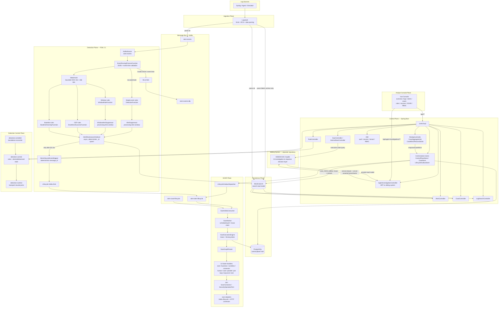
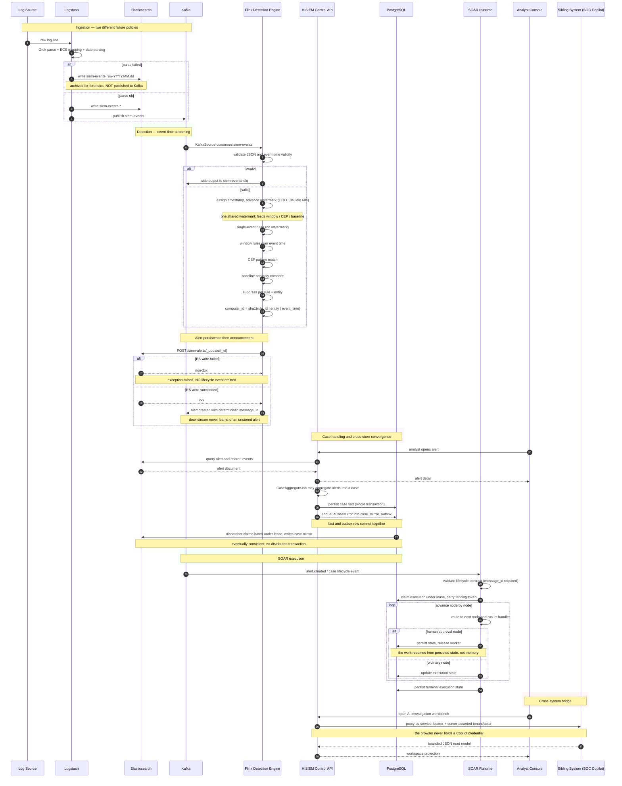

# HISIEM — Architecture Diagram & Data Flow Diagram

Two canonical diagrams for the platform:

1. **[Architecture diagram](#1-architecture-diagram)** — *what the system is made of*
2. **[Data flow diagram](#2-data-flow-diagram)** — *what happens when a real log line flows through it*

Companion documents: [`architecture.md`](architecture.md) (data/control plane boundaries),
[`architecture-overview.md`](architecture-overview.md) (four-figure overview),
[`architecture-deep-dive.md`](architecture-deep-dive.md) (full technical walkthrough).

---

## 1. Architecture Diagram

Every component grouped by the responsibility plane that owns it, with the flows that cross
plane boundaries made explicit.



### What this diagram solves

It answers **"which plane owns which responsibility, and where does a flow cross a plane
boundary?"** The crossing points are where the interesting engineering lives — each one is a
place where two different correctness models meet.

### Component responsibilities

| Plane | Owns | Notable non-responsibility |
|---|---|---|
| **Ingestion** | Parse, normalize to ECS, route by parse outcome | Does not detect |
| **Detection (Flink)** | Event-time windowing, CEP, baselines, suppression, alert identity | Does not store or manage cases |
| **Message Bus** | Durable fan-out, DLQ, lifecycle contract carrier | Does not compute |
| **Persistence** | PostgreSQL = transactional truth; Elasticsearch = rebuildable search read model | Neither alone is a complete truth |
| **SOAR** | Playbook execution: node-by-node advance under lease, with fencing | Does not decide *whether* to run — that is a durable command from the control plane |
| **Control Plane** | Cases, alerts surface, rules, log search, IAM/RBAC, ops APIs, the Copilot BFF | **Does not perform physical detection deployment** |
| **Detection Control** | Rule definitions, desired vs. observed runtime state, reconciliation | **No physical deployment responsibility** |
| **Console** | Analyst presentation and authoring | Holds no authority of its own |
| **Sibling System** | AI investigation, evidence, response *proposal*, human-authority workflow | **Does not detect and does not execute** |

### Where data comes from and goes

```text
IN    Log lines arrive at Logstash from syslog / agents / the simulator.
      Parsed events fan out to Elasticsearch (search) AND Kafka (streaming).
      Flink consumes Kafka, detects, and writes alerts back to Elasticsearch.

OUT   Alerts become lifecycle events on Kafka (only after a successful ES write).
      soar-worker consumes those, executes SOAR playbooks, and records execution
      state in PostgreSQL. The console reads from both stores.

CROSS The console never talks to the sibling system directly. It calls HISIEM's
      /api/agent-investigations/** BFF, which proxies server-side with a service
      credential and a tenant/actor taken from HISIEM's already-validated context.
```

### Where truth and authority live

```text
PostgreSQL                    = control-plane transactional truth
                                (cases, rules, IAM, SOAR execution state, outboxes)
Elasticsearch                 = rebuildable search read model
                                (events, raw events, alerts, case mirror, entity risk)
Flink operator state          = recoverable detection working state (checkpointed)
SOAR execution state          = execution truth, recorded in PostgreSQL
Alert document identity       = deterministic: sha1(rule_id | entity | event_time)
Sibling-system execution view = NOT authoritative here; HISIEM's observed state is
                                the final execution truth for the combined system
```

### Reliability boundaries

| # | Boundary | Where | What can go wrong |
|---|---|---|---|
| 1 | Parse boundary | Logstash → ES raw / ES events + Kafka | Unparseable records must be retained, never silently dropped |
| 2 | Event-time boundary | Kafka → Flink timestamp assignment | Source clock is trusted; skew is not reconciled |
| 3 | Sink boundary | Flink → Elasticsearch | Non-transactional write; convergence relies on deterministic `_id` |
| 4 | Announcement boundary | ES 2xx → Kafka lifecycle event | Ordering is load-bearing: downstream must never learn of an unstored alert |
| 5 | Cross-store boundary | PostgreSQL ↔ Elasticsearch | No distributed transaction; convergence via `case_mirror_outbox` with lease + reclaim |
| 6 | Execution boundary | Control plane → SOAR | Playbook advancement is lease-protected; **node-side-effect idempotency belongs to the connector** |
| 7 | Cross-system boundary | HISIEM BFF → sibling system | Tenant/actor are server-asserted; the browser can never override them |

---

## 2. Data Flow Diagram

One real log line, followed end to end.



### What this diagram solves

It answers **"what actually happens, in order, and where can each step fail?"** The three
`alt` branches are the parts worth memorizing: parse failure, event-time validation failure,
and a failed alert write. Each one has a *different* policy, and mixing them up is the most
common way to misdescribe this pipeline.

### The three failure policies, side by side

| Failure | Destination | Policy |
|---|---|---|
| Logstash parse failure | ES `siem-events-raw-YYYY.MM.dd` | **Retained for forensics**; daily index, short retention, never enters Kafka or Flink |
| Flink validation failure (JSON / event time) | Kafka `siem-events-dlq` | **Quarantined** for reprocessing; no automated replay tooling today |
| Elasticsearch alert write failure | exception, and **no lifecycle event** | The announcement is suppressed so no downstream system sees a phantom alert |

### Load-bearing ordering

```text
1. The alert must be STORED before it is ANNOUNCED.
   ES 2xx → lifecycle event. A failed write produces an exception, not an event.

2. The case fact and its outbox row commit in the SAME transaction.
   Publication becomes a consequence of the commit, not a second independent action.

3. The SOAR execution state lands in PostgreSQL BEFORE the worker releases it.
   That is what makes a human-approval node resumable rather than blocking.
```

### Where the sibling system meets HISIEM

```text
Browser  →  HISIEM /api/agent-investigations/**  (Spring Security RBAC)
         →  AgentInvestigationService            (server-side proxy)
         →  Copilot API                          (service bearer credential)

Tenant and actor are taken from HISIEM's already-validated context.
A browser cannot override them through a request body or header, and Copilot
credentials are never returned to the client.
```

The reverse direction is equally deliberate: the execution state that matters for the
combined system is the one **HISIEM records**, not the one the sibling believes it submitted.
