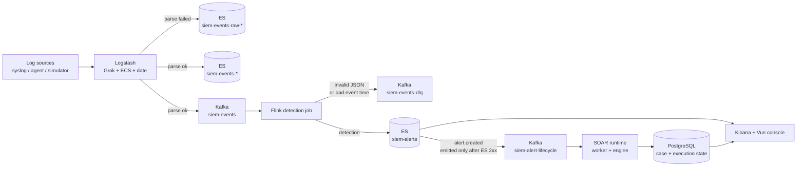
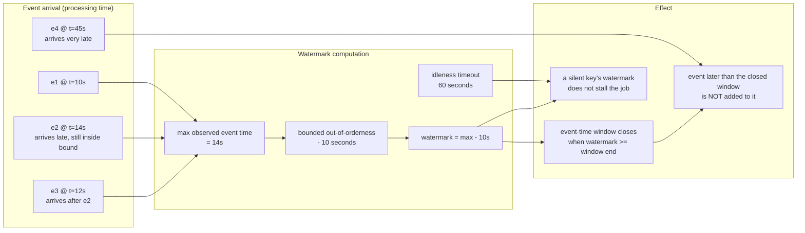
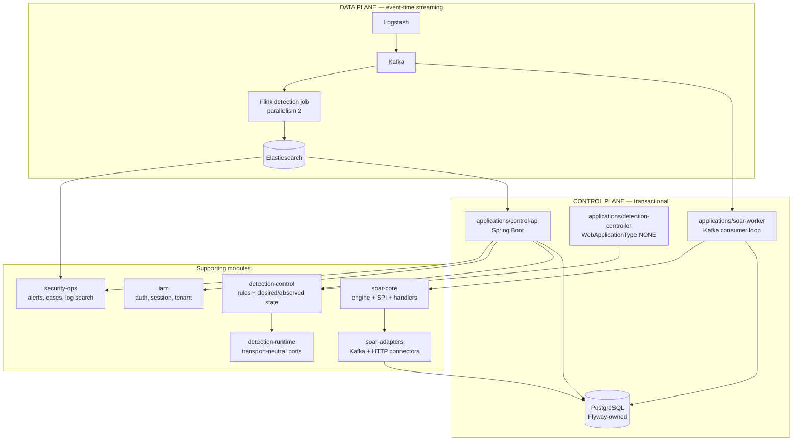
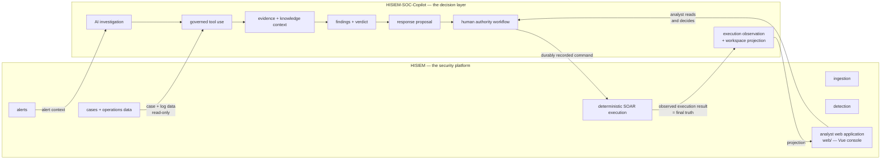

# HISIEM — Architecture Overview

A concise, diagram-first model of the system. This document is navigation and visual
summary only; the authoritative technical detail is in
[`architecture.md`](architecture.md) and
[`architecture-deep-dive.md`](architecture-deep-dive.md).

---

## Figure 1 — End-to-end data path

From raw log to executed response.



**The one ordering rule to notice:** the lifecycle event on the right is emitted by the
async Elasticsearch sink **only after the alert write succeeded**. A failed write
propagates as an exception, so no downstream consumer can learn about an alert that was
never stored.

---

## Figure 2 — Event-time processing timeline

How the watermark, bounded out-of-orderness, idleness and window triggering relate.



Read it as three separate mechanisms that are easy to conflate:

| Mechanism | Value here | What it does |
|---|---|---|
| Bounded out-of-orderness | 10 seconds | Lets the watermark trail the newest observed event time by a fixed bound, so modest reordering is absorbed rather than treated as late |
| Idleness | 60 seconds | Stops a source that has gone quiet from holding every window open forever |
| Window trigger | watermark ≥ window end | Windows fire on event time. **Once a window has fired, there is no allowed-lateness re-fire** |

**There is no `allowedLateness` configuration in this job, and no late-event side output.**
The boundary is therefore: reordering inside the 10-second bound is absorbed; an event
that arrives after its window has already fired does not contribute to that window's
result and is not separately captured. See
[Known Limits](../README.en.md#12-known-limits).

---

## Figure 3 — Control plane vs. data plane

The actual module and process boundaries.



**Why the boundary is where it is:**

- `detection-control` owns rule definitions, schedules and *desired vs. observed* runtime
  state, and has **no physical deployment responsibility**.
- `detection-runtime` owns transport-neutral runtime port contracts — an interface with no
  assumption about how the runtime is deployed.
- `applications/detection-controller` reconciles the two; `WebApplicationType.NONE` and a
  disabled-by-default adapter mean it is a reconciler, not a web service.
- The Flink job is the actual runtime and is deployed separately from the control plane.

Consequence: detection *configuration* changes without the control plane knowing anything
about Flink, and the runtime can be replaced without changing rule semantics.
Details: [`design/managed-detection-runtime.md`](design/managed-detection-runtime.md).

---

## Figure 4 — HISIEM ↔ HISIEM-SOC-Copilot boundary

Two repositories, one system. See
[the Copilot repository](https://github.com/xsc683/HISIEM-SOC-Copilot).



The permanent rule:

```text
Model proposes  →  Policy constrains  →  Human authorizes
Durable command records intent  →  HISIEM executes  →  Copilot observes
```

**Ownership, stated once:**

| HISIEM owns | Copilot owns |
|---|---|
| Security event ingestion | AI-assisted investigation |
| Streaming and detection | Governed tool use |
| Alerts and operational data | Evidence organization and knowledge context |
| Case management | Findings and verdicts |
| **Deterministic SOAR execution and the execution record** | Response proposals and the human-authority workflow |
| Hosting the analyst web application | Execution observation and workspace projection |

**Copilot is never a second SIEM and never a second SOAR.** It does not detect, it does
not own alert data, it does not execute. When its investigation recommends a response, the
command is durably recorded and executed *here*; the execution state observed in HISIEM is
the final truth, not what Copilot believes it submitted.

**The Analyst Workspace UI lives in this repository** (`web/`), because HISIEM owns the
platform's web application. The Copilot repository contains no frontend.

---

## Related documents

| Topic | Document |
|---|---|
| Data/control plane detail and boundaries | [`architecture.md`](architecture.md) |
| Full technical walkthrough | [`architecture-deep-dive.md`](architecture-deep-dive.md) |
| Why these choices were made | [`design-decisions.md`](design-decisions.md) |
| Detection engine and rule authoring | [`rule-engine.md`](rule-engine.md) |
| Event and alert schema, ES mappings | [`event-alert-schema.md`](event-alert-schema.md) |
| SOAR execution chain | [`soar.md`](soar.md), [`design/soar-runtime-architecture.md`](design/soar-runtime-architecture.md) |
| Current verified state | [`current-status.md`](current-status.md) |
