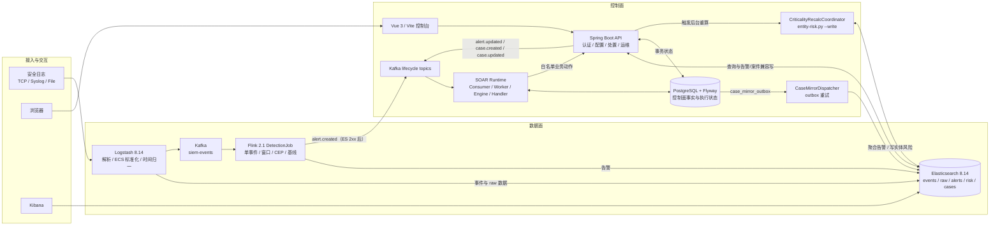
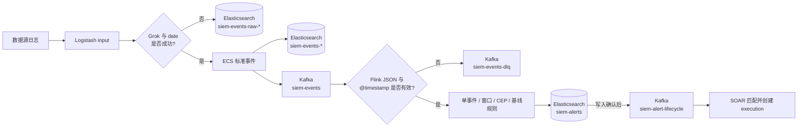
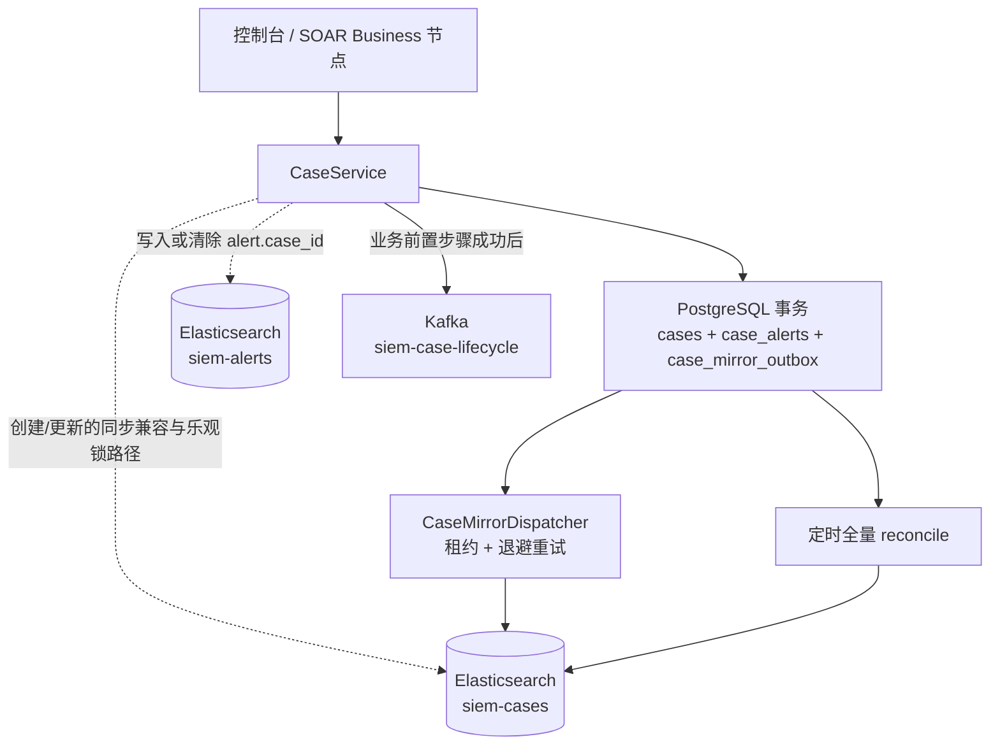
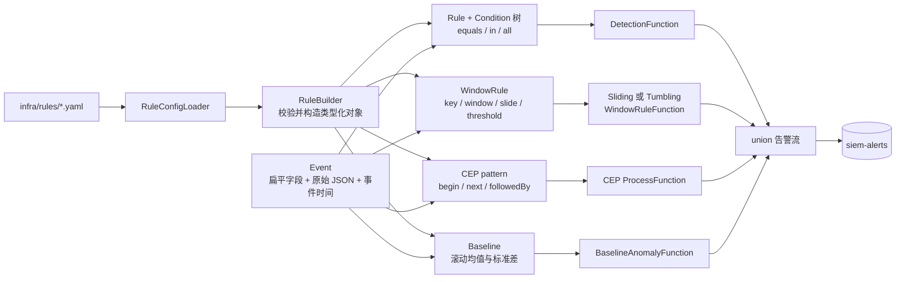

# 系统架构

> 定位：当前实现的架构总览。运行态和风险以 [`current-status.md`](current-status.md) 为准，产品页面/API 以 [`product-contract.md`](product-contract.md) 为准，部署命令以 [`deployment.md`](deployment.md) 和 [`operations.md`](operations.md) 为准；专项设计见 `design/`。
>
> 当前实现分为两条链路：Elastic Stack + Kafka + Flink 组成数据面，Spring Boot + PostgreSQL/Flyway 组成控制面。数据面负责事件检测，控制面负责配置、处置、权限和运维状态。
>
> 若要查看通读项目后提炼的实现亮点和关键细节，请阅读 [`architecture-deep-dive.md`](architecture-deep-dive.md)。

## 1. 整体架构

图中的实线表示当前存在的运行链路，不代表所有箭头都处于同一个事务。尤其是 PostgreSQL、Elasticsearch 与 Kafka 之间没有分布式事务：案件镜像依靠 outbox 和定时收敛，控制面 lifecycle 发布失败只记录指标并等待后续治理。

## 2. 组件职责

| 组件 | 职责 | 明确不做 |
| --- | --- | --- |
| Logstash | 接收日志、Grok 解析、ECS 标准化、输出事件 | 不检测、不生成告警 |
| Kafka | 事件总线,解耦生产者(Logstash)与消费者(Flink) | — |
| Flink | 检测引擎:规则匹配、时间窗口关联、告警生成 | — |
| Elasticsearch | 事件与告警的存储、检索、聚合 | — |
| Kibana | 可视化 dashboard、索引模式 | — |
| Spring Boot | 接入向导、告警/案件处置、SOAR 编排、认证授权、通知、任务与健康扫描 API | 不替代 Flink 检测引擎，不执行任意 Shell |
| PostgreSQL | 控制面事务数据：用户/会话、角色、案件关系、SOAR 执行、通知、审计、后台任务 | 不存储事件与告警正文 |

## 3. 数据流

### 3.1 日志到告警、DLQ 与 SOAR

raw 与 DLQ 是两个不同失败边界：`siem-events-raw-*` 隔离 Logstash 的 Grok/date 失败，因此不会进入 Kafka；`siem-events-dlq` 接收已经进入 `siem-events`、但 Flink 无法解析 JSON 或事件时间的消息。

1. 日志按数据源声明进入 Logstash（默认示例端口为 TCP:5000，也可由接入向导配置 TCP/Syslog/File），`grok` 提取 `timestamp`/`host.name`/`user.name`/`source.ip`
2. `date` filter 把日志时间解析进 `@timestamp`(Asia/Shanghai)
3. `mutate` 补齐 ECS 字段:`event.category/action/outcome/type/schema_version`、`related.ip`、`pipeline`
4. Logstash 输出:
   - ES:`siem-events-%{+YYYY.MM.dd}`(按日志日期分索引)
   - Kafka:topic `siem-events`(JSON)
5. Flink `DetectionJob`（当前 6 条检测规则）:
   - 解析事件为扁平点分字段(`Event` POJO)；坏 JSON、缺失或非法 `@timestamp` 通过 side output 写入 `siem-events-dlq`，不进入检测分支
   - 单事件规则逐条匹配 → 每条命中生成一条告警
   - 时间窗口规则(事件时间窗口 + watermark)→ 窗口关闭时统计命中数,≥阈值生成关联告警
   - CEP 序列和基线异常分别处理攻击链、统计异常，并统一写入告警字段
6. Flink 先写入 ES `siem-alerts`：新文档使用完整 upsert，重放或抑制更新只提交不含分析师处置字段的 partial doc；ES 确认成功后才将最小 `alert.created` 契约写入 Kafka `siem-alert-lifecycle`。
7. 告警/案件控制面变更成功后分别发布 `alert.updated`、`case.created/updated` 到两个 lifecycle topic。SOAR 消费组只读取这两个 topic，匹配已发布且启用的 Playbook，执行 Start/End/Condition/Business/Human/Wait。
8. 控制台写操作通过 Spring Security 鉴权；案件处置状态、SOAR Playbook/执行快照/逐 attempt I/O/审批/动作回执、用户会话、通知、审计和后台任务写入 PostgreSQL，Flyway 负责当前 V1-V15 迁移。

### 3.2 案件写入与最终一致性

当前案件链路是“PostgreSQL 事实源 + ES 兼容镜像 + 同步业务保护 + 异步收敛”的混合实现，而不是纯 outbox：创建先写 PostgreSQL/outbox，再同步写案件镜像并标记告警；更新先用 ES `_seq_no/_primary_term` 做乐观锁，再以 PostgreSQL `version` 更新事实并排入 outbox；删除先删 PostgreSQL并排入 delete outbox，再尽力同步删除 ES。同步步骤失败会进行补偿，但跨系统仍不具备原子性，outbox 与 reconcile 用于让镜像最终收敛。

## 4. 控制面边界与接口

控制面不参与实时日志消费，也不把事件/告警正文复制到 PostgreSQL。它通过 Elasticsearch Java API Client 检索事件、告警和实体风险，并在 PostgreSQL 中维护需要事务一致性的状态。

| 能力 | 当前实现 | 主要接口/存储 |
| --- | --- | --- |
| 认证与 RBAC | Spring Security、Bearer 会话、登录失败限制、首次改密 | `/api/auth/**`、`users`/`auth_sessions` |
| 数据源接入 | 模板预览、创建、生效、停用、删除与失败回滚 | `/api/log-sources/**`、`infra/log-sources/*.yaml` |
| 告警与案件 | 告警状态/verdict、案件聚合、负责人/证据、时间线 | `/api/alerts/**`、`/api/cases/**`、案件关系表 + ES 镜像 |
| SOAR | Kafka/人工触发、11 类可插拔 Handler、持久并行/循环、Connector 注册表、重试退避、人工审批、续租 Worker、fencing 和逐 attempt I/O | `/api/soar/**`、V11–V15 `soar_*` 表、两个 lifecycle topic |
| 运维治理 | 六组件健康扫描、后台任务租约/恢复、指标、备份恢复演练 | `/api/ops/health-scan`、`/api/tasks/**`、Actuator |

控制面默认连接 `localhost:5432/siem`；真实部署时先确认 PostgreSQL、ES、Kafka、Logstash、Flink、Kibana 均通过健康检查，再启动 Spring Boot。

## 5. 事件 Schema(摘要)

事件索引:`siem-events-*` + 别名 `siem-events`。字段(ECS 对齐):

| 字段 | 类型 | 说明 |
| --- | --- | --- |
| `@timestamp` | date | 日志发生时间(Logstash date filter 解析) |
| `event.category` | keyword | `authentication` |
| `event.action` | keyword | `authentication_failure`(规则触发字段) |
| `event.outcome` / `event.type` | keyword | `failure` / `denied` |
| `event.original` | match_only_text | 原始日志 |
| `event.schema_version` | keyword | `1.0` |
| `source.ip` | ip | 攻击源 IP |
| `user.name` / `host.name` | keyword | 目标用户 / 主机 |
| `related.ip` | keyword | 关联 IP |
| `message` | text | 可读消息 |

## 6. 告警 Schema(摘要)

告警索引:`siem-alerts`。扁平结构(关键事件字段提升到顶层):

| 字段 | 类型 | 说明 |
| --- | --- | --- |
| `@timestamp` | date | 事件时间(单事件)/ 窗口结束时间(窗口规则) |
| `alert.created_at` | date | 检测时间 |
| `alert.id` | keyword | UUID |
| `alert.rule_id` / `rule_name` / `type` / `severity` | keyword | 命中的规则元数据 |
| `alert.description` | text | 描述 |
| `source.ip` / `user.name` / `host.name` / `event.action` | — | 从事件提升的顶层字段 |
| `event.raw` | match_only_text | 完整原始事件(单事件规则) |
| `event_count` | integer | 关联事件数(窗口规则 >1) |
| `related_events` | nested | 窗口内事件列表(窗口规则) |

## 7. 规则引擎概览

- 单事件规则：一条事件可命中多条规则，各生成一条告警；`RuleRegistry` 只是运行时集合，不是元数据来源。
- 窗口规则：当前 SSH 规则为事件时间 5 分钟窗口、1 分钟滑动；未配置 `slidingMinutes` 时才使用 tumbling window。
- CEP 与基线分支分别识别事件序列和统计偏离，四条分支最终合并到同一安全告警写入链路。

详见 [rule-engine.md](rule-engine.md)、[product-contract.md](product-contract.md) 与 [deployment.md](deployment.md)。
