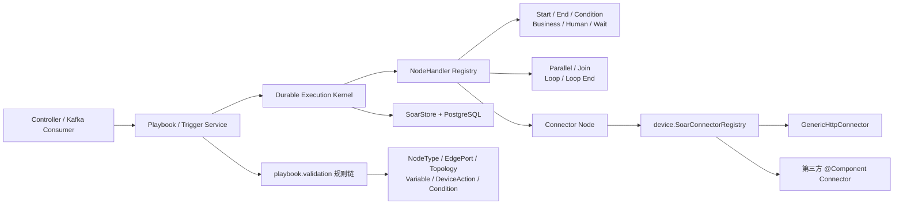
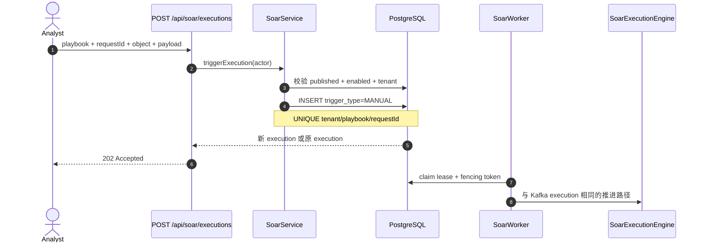
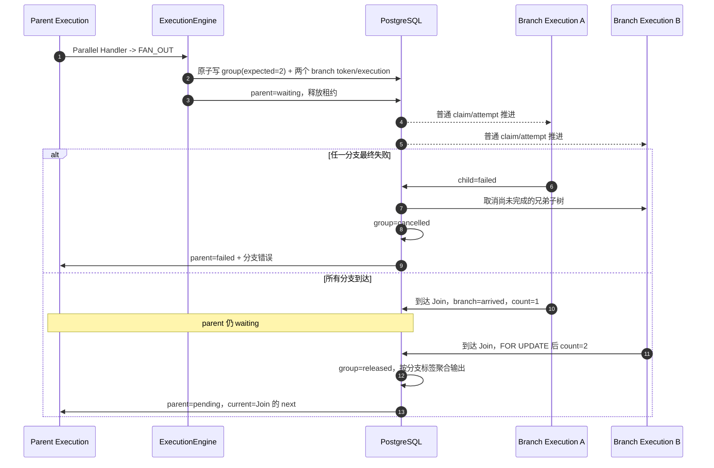
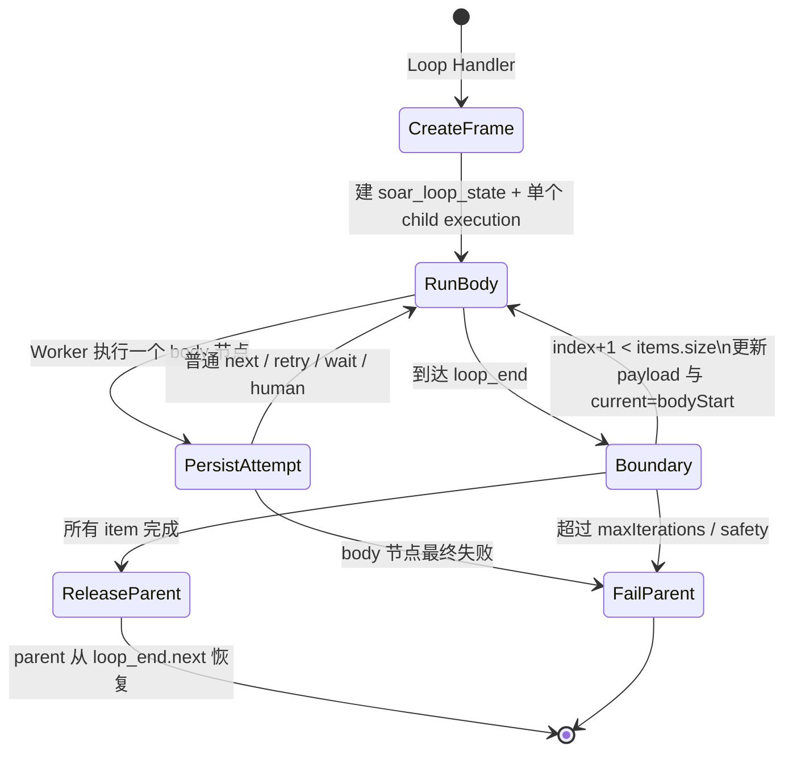
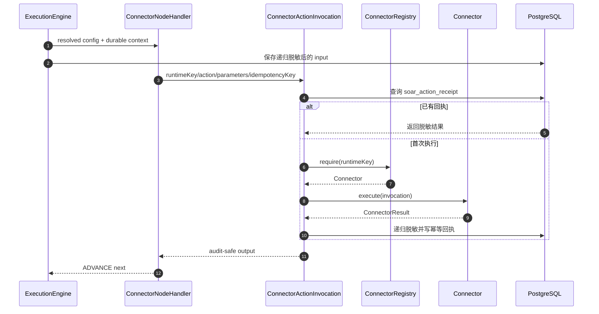

# SOAR 能力扩展架构与持久执行数据流

> 状态：V13–V15 已实现。本文补充 [SOAR 运行时架构](soar-runtime-architecture.md)，重点说明并行、循环、手动触发、设备连接器和发布校验怎样复用 V11/V12 的租约、fencing、逐 attempt 与幂等回执。AI Agent 尚未实现。

## 1. 设计原则与模块边界

本轮没有引入内存 BFS。一个节点仍由 `SoarWorker` 领取一个数据库 execution、`SoarExecutionEngine` 执行一次 Handler、`SoarStore` 在 fencing 条件下提交一次状态变化。并行和循环只是把“下一步”扩展为可恢复的子状态机；分支和迭代本身也使用普通 `soar_execution`，因此服务退出后不需要从 JVM 对象恢复图游标。

新增扩展点均由 Spring 收集：

- 节点实现 `SoarNodeHandler`，注册表按 `type` 唯一装配；
- 设备实现 `SoarConnector`，注册表按 `runtimeKey` 唯一装配；
- 发布规则实现 `SoarPlaybookValidationRule`，门面按 `order` 执行；
- 调度核心只认识统一的 `SoarNodeResult`，不会 `new` 具体 Handler、Connector 或 Validator。

旧的 V11/V12 执行类保留在兼容包中，新增结构化节点、设备与发布规则分别进入 `soar.execution.handler`、`soar.device`、`soar.playbook.validation`。这是刻意的渐进拆分：新能力按单向依赖的领域包扩展，同时不通过大规模改包破坏已稳定迁移和运行行为。

## 2. 手动触发与生命周期触发合流

`POST /api/soar/executions` 接受 `playbookId/requestId/objectType/objectId/eventType/payload`。只允许 admin/analyst 触发已发布且启用的 Playbook；对象和事件必须符合该 Playbook 入口。`requestId` 是客户端幂等键，超时重试时复用它会返回原 execution。若 payload 直接填写对象字段，服务会归一化为 `alert`/`case` 根对象并补齐 ID；已携带根对象时，ID 与 `objectId` 不一致会被拒绝。

Kafka 生命周期入口写 `trigger_type=KAFKA`；并行/循环内部 execution 写 `INTERNAL`。列表默认只展示 KAFKA/MANUAL 根实例，内部实例仍可按 ID 查询并保留完整 attempt 历史。

## 3. 持久并行 fan-out / join

Parallel 节点配置 2–16 个分支标签和一个 `joinNode`。发布时要求配置标签与边端口完全一致、每条分支的所有路径都到达该 Join，且不同 Parallel 不能共享同一个 Join。

每个分支不是内存任务，而是一条普通子 execution；`soar_parallel_branch` 是持久 token，`soar_parallel_group.expected_count/arrived_count` 是 Join 计数器。

多个 Worker 可以同时处理不同分支；Join 计数更新使用事务和行锁，重复到达由 branch 状态条件更新拒绝。父 execution 的租约不会覆盖子 execution，每个分支仍有自己的 fencing token、attempt 和动作回执。任一分支最终失败时，事务会把父 execution 置为 failed、取消尚未完成的兄弟子树并关闭 Join group，不会留下永久 waiting 的父实例。

## 4. 持久有界循环

Loop 节点配置 `items/bodyStart/bodyEnd/maxIterations`。当前语义是对静态 item 列表串行迭代；当前项通过 `${loop.index}` 与 `${loop.item}` 进入子 execution payload。`bodyEnd` 必须是 `loop_end`，每条 body 路径都必须到达它，循环体内禁止再放 Loop。

迭代复用同一个 child execution，但每次 body 节点访问仍生成新的 `visit_no/attempt`，所以节点 I/O 和幂等键不会覆盖上一轮。状态表持久保存当前 index；进程在任意 body 节点退出后，Worker 按原租约恢复。body 节点最终失败会同步关闭 frame 并使父实例失败。发布门禁和运行时都限制最多 1000 次，配置上限小于 item 数量会被拒绝。

## 5. 设备连接器

`SoarConnector` 只有三个核心契约：`runtimeKey()`、`capabilities()`、`execute(ConnectorInvocation)`。Invocation 携带 tenant/execution/node/action/parameters/timeout/idempotencyKey；新增厂商实现只需增加 `@Component`，不修改 Engine。

内置 `http` Connector 支持 GET/POST/PUT/PATCH/DELETE、1–120000 ms 超时并默认拒绝 loopback、link-local 和 RFC1918 目标，降低 SSRF 风险。每次调用自动携带稳定的 `Idempotency-Key` 请求头；密码、token、authorization、API key、private key 等键在节点输入、输出和回执落库前递归替换为 `[REDACTED]`，响应中的 `x-request-id` 会作为外部追踪 ID 保存。

当前实现不包含凭据库、mTLS、统一出口代理、限流/熔断/配额或隔离执行沙箱；因此 HTTP Connector 只适合学习环境和无凭据的受控 API。生产接入必须先补这些边界，且目标系统应接受 idempotency key 或提供动作查询/补偿。

## 6. 发布验证器链

`SoarPlaybookValidator` 保留原有门禁作为兼容基线，并在完整发布校验后依次调用 Spring 自动收集规则：

1. `NodeTypeValidationRule`：节点类型必须有 Handler；
2. `EdgePortValidationRule`：branch 必须是运行时可精确路由的小写端口；
3. `GraphTopologyValidationRule`：Parallel/Join 不能非法共享；
4. `VariableReferenceValidationRule`：模板根对象和 `nodes.<id>` 引用必须存在；
5. `DeviceActionValidationRule`：Connector 与 action 必须在注册能力中；
6. `ConditionValidationRule`：字段、操作符和值重新走条件 DSL 校验。

此外，核心拓扑门禁校验全图连通、可达终止、无普通有向环、Parallel 所有路径汇入 Join、Loop 所有路径汇入 Loop End、Loop 禁止嵌套。增加新规则只需实现接口并注册组件。

## 7. 取消、恢复与数据表

取消根 execution 时，Store 以父子 execution 关系做无状态 DFS，取消所有尚未终态的 Parallel/Loop 后代、节点 attempt 和审批任务，再把 group/frame 标记 cancelled。内部子 execution 由创建时唯一绑定，不会被多个父实例共享，因此不会误取消另一条根流程；API 禁止单独取消 INTERNAL 子实例，避免共享 Join/父 frame 永久等待。

V13–V15 新增：

| 结构 | 作用 |
| --- | --- |
| `soar_parallel_group` | Join 目标、expected/arrived 计数、聚合输出和 released 状态 |
| `soar_parallel_branch` | 每个分支的持久 token、标签、子 execution 和到达状态 |
| `soar_execution.parallel_parent_id` | Parallel 父子关系与取消传播 |
| `soar_loop_state` | Loop 父/子 execution、body 边界、items、index、safety 和终态 |
| `soar_execution.trigger_type` | `KAFKA/MANUAL/INTERNAL` 入口分类 |

新增状态没有替代 V11/V12：子 execution 仍使用 `soar_node_execution`、租约/version fencing 和 `soar_action_receipt`。数据库是唯一恢复事实源。

## 8. 当前边界

- AI Agent、Tool Registry、Function Calling 与 SSE 尚未实现；这是低优先级独立增量，不能在没有草稿租约校验时接入 mutating Tool。
- Loop 当前只接受静态 item 数组，不支持任意 while、动态追加、嵌套 Loop 或批量并发 map。
- Parallel 是实际多 execution 并行，但尚未提供分支级暂停/单独重跑 UI。
- Connector 只有通用 HTTP 基线，未内置具体 EDR、防火墙或工单厂商适配器。
- V8–V10 历史迁移仍不修改；当前运行事实为 V11–V15。
