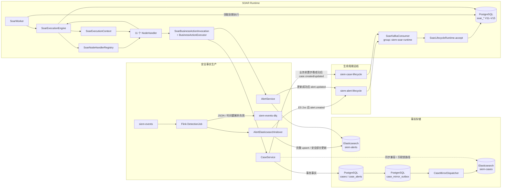
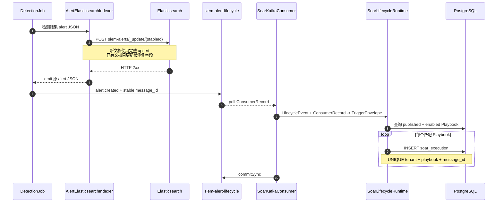
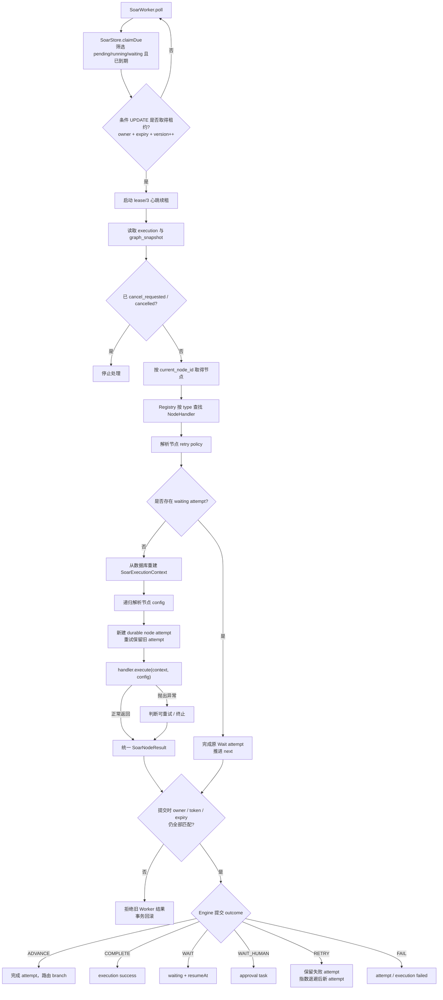
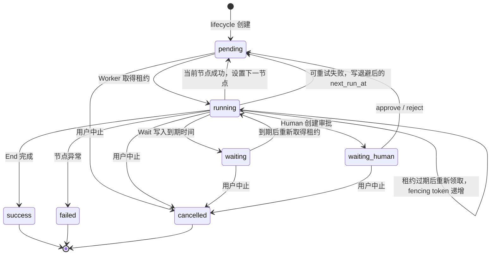
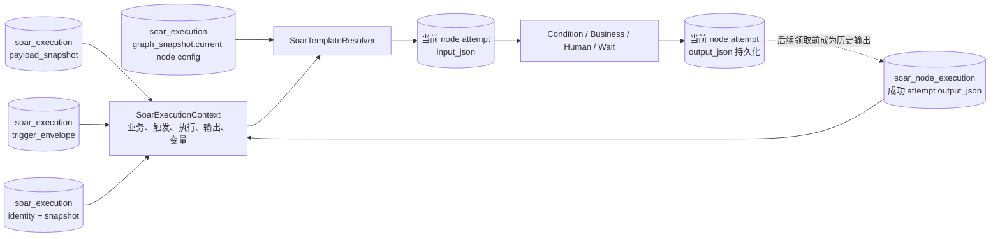
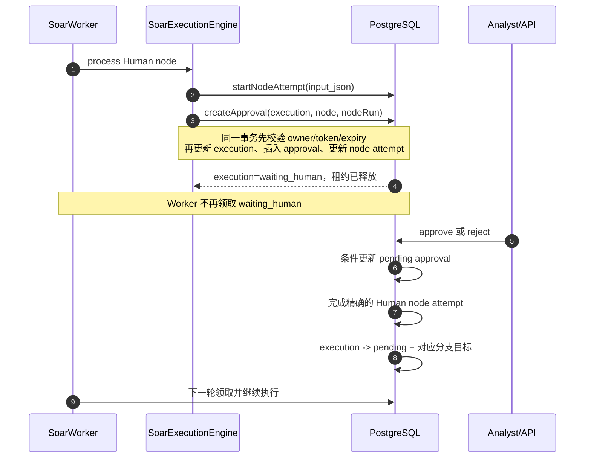
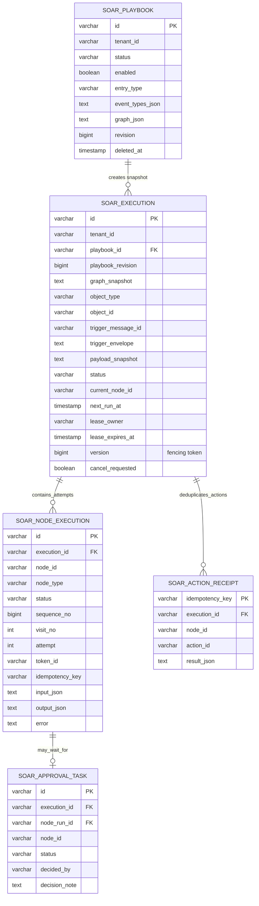

# SOAR 模块架构设计与后端执行数据流

> 状态：已实现。本文重点解释 V11/V12 基础持久执行内核；V13–V15 的并行、循环、Connector、手动触发和验证器链见 [`soar-capability-runtime.md`](soar-capability-runtime.md)。功能契约见 [`../soar.md`](../soar.md)。

## 1. 设计目标与运行边界

SOAR 后端不是另一套检测引擎。Flink 负责把事件检测成告警，告警和案件服务负责保存业务事实，SOAR 只在事实保存成功后接收生命周期消息并编排处置动作。

当前运行边界固定为：

- 入口对象只有 `alert` 和 `case`，入口事件只有 `alert.created/updated`、`case.created/updated`；
- Kafka lifecycle Topic 是自动入口，`POST /api/soar/executions` 是受 RBAC 和 requestId 幂等保护的手动入口；
- 基础图保持无普通有向环；显式 Parallel/Join 和 Loop/Loop End 由数据库子状态机实现；
- Business 节点只调用 `AlertService`、`CaseService` 白名单；Connector 节点可调用已注册连接器，当前内置受限通用 HTTP，不执行 Shell；
- PostgreSQL 保存 Playbook、触发信封、执行快照、当前节点、每次节点 attempt 的 I/O、等待时间、租约、审批和业务动作幂等回执，进程内只保存可重建的 `SoarExecutionContext`。

这种分工避免 SOAR 直接读取原始事件流，也避免为自动化动作复制一套告警/案件状态机。

## 2. 组件架构

架构中有两类写入：

1. **事实写入**：告警或案件先进入其事实存储；
2. **编排写入**：Kafka 或人工 API 只负责创建根执行，执行与内部并行/循环状态全部写入 V11–V15 `soar_*` 表。

因此 Kafka 消息不是告警/案件事实源。SOAR 即使重放消息，也使用 `alert.id` 或 `case.id` 调用原业务服务，而不是用 payload 覆盖事实存储。

## 3. 生命周期消息是自动执行入口

### 3.1 新告警链路

`AlertElasticsearchIndexer` 是顺序门：只有 ES 返回 2xx 才向下游 lifecycle Kafka Sink 发消息。新告警的 `alert.id` 使用确定性的 ES 文档 `_id`，Flink 再用 `alert.created + ES _id` 生成确定性 `message_id`。Flink checkpoint 重放时，Kafka 可能再次出现同一消息，但数据库唯一键不会再次创建同一 Playbook 的执行。

控制面更新路径略有不同：`AlertService.update/batch` 在 ES 乐观锁更新成功后发布 `alert.updated`；`CaseService` 的 PostgreSQL 事务会同时写 `case_mirror_outbox`，但当前仍保留同步 ES 兼容路径和 `alert.case_id` 维护，业务前置步骤成功后才发布 `case.created/updated`。outbox 负责镜像失败后的重试收敛，不把 PG、ES 与 Kafka 变成一个事务。`LifecycleEventPublisher` 使用 `acks=all + enable.idempotence=true`，异步回调记录发布成功或失败指标。

### 3.2 消费提交策略

`SoarKafkaConsumer` 订阅两个 lifecycle Topic，但不订阅 `siem-events`。单批消息的处理结果决定 offset 行为：

| 情况 | 处理 | offset |
| --- | --- | --- |
| 合法消息，执行创建成功或命中去重 | 正常完成 | 本批 `commitSync` |
| JSON/契约非法 | 记录 error 和 invalid counter，丢弃毒消息 | 提交，避免永久阻塞分区 |
| PostgreSQL 等暂态运行异常 | 将本次 poll 涉及的全部分区回退到各自本批首 offset | 不提交本批，整批重放；已成功项由 execution 唯一键去重 |
| Consumer/Broker 连接异常 | 关闭当前 client，等待 1 秒后重建并重新入组 | 使用消费组已提交 offset 恢复 |

`SoarLifecycleRuntime.accept` 只匹配 tenant、对象类型、event type 一致且 `status=published AND enabled=true` 的 Playbook。一条消息可以创建多个 Playbook execution，但同一 Playbook 对同一 `message_id` 最多创建一次。

Consumer 不把不可序列化的 `ConsumerRecord` 直接交给 Handler，而是转换为 `SoarTriggerEnvelope`。其中业务 `messageId` 继续承担跨重放去重，Kafka `topic/partition/offset/timestamp/key/headers` 只作为可审计的传输坐标保存。两者不能混为一个 ID：消息迁移 Topic 后业务身份仍不变，排查消费问题时又能准确回到原分区位置。Header 原始字节使用 Base64 保存，避免把二进制追踪信息错误按文本解码。

## 4. 执行实例如何创建

创建 execution 时，后端不会只保存 `playbook_id`。`SoarStore.createExecution` 同时冻结：

- `playbook_name`、`playbook_revision`；
- 完整 `graph_snapshot`；
- `object_type/object_id/event_type/trigger_message_id`；
- 完整 `trigger_envelope`，包括 producer、occurredAt 和 Kafka 传输坐标；
- 完整但精简的 `payload_snapshot`；
- Start 节点 ID 作为 `current_node_id`。

初始状态是 `pending`，`next_run_at=CURRENT_TIMESTAMP`，说明它已经可以被 Worker 领取。之后即使管理员编辑、停用或重新发布 Playbook，已有 execution 仍按创建时的图和参数执行，不会在流程中途切换定义。

## 5. Worker 的单节点推进模型

`SoarWorker` 默认每 500 ms 轮询一次，单轮最多处理 10 个执行，租约默认 30 秒。它每次只领取一条并立即推进一个持久化节点，不会先占住整批租约，也不会把整张图放进一个长事务。

领取分为“查候选”和“条件更新”两步。多个应用实例可能同时看见同一候选，但只有满足“状态仍可运行且租约为空或已过期”的 UPDATE 能取得它。租约成功后 execution 进入 `running`，写入 `lease_owner/lease_expires_at`。节点结束、挂起或失败时释放租约。

### 5.1 为什么按节点提交

每个节点形成一个可观察、可恢复的持久化边界：

1. 读取 execution 快照和当前节点；
2. 从 execution、trigger、payload 和历史输出构造显式 `SoarExecutionContext`；
3. 解析参数并写 `soar_node_execution.input_json`；
4. Registry 选择 Handler，Handler 只返回 `SoarNodeResult`；
5. Engine 统一写 attempt 的 `output_json/error/status`；
6. 更新 execution 的 `status/current_node_id/next_run_at` 并释放租约。

服务在第 6 步完成后退出，下次启动会从新的 `current_node_id` 继续。它不会依赖 JVM 中保存一条“正在走到哪里”的链表。

claim 不只是写 `lease_owner/lease_expires_at`，还原子递增 `soar_execution.version`，返回值就是本次租约的 fencing token。Worker 在 Handler 运行期间用独立 daemon scheduler 续租；状态提交 SQL 必须同时满足 `lease_owner = ? AND version = ? AND lease_expires_at >= CURRENT_TIMESTAMP`。因此“旧 Worker 超时—新 Worker 接管—旧 Worker 晚到”时，最后一步会因 token 不匹配回滚 node run 与 execution 的整个事务。Worker 每次只 claim 一条并立即执行，`batch-size` 表示单轮最多处理多少条，不再提前占有一批尚未执行的租约。

`NodeHandler` 不持有 `SoarStore`，也不能自己选择任意后继节点。它只声明节点类型、合法出边、默认执行次数，校验配置并返回 `ADVANCE/COMPLETE/WAIT/WAIT_HUMAN`。分支合法性、图路由、状态转换和租约释放集中在 Engine，避免新增节点时复制恢复逻辑。

## 6. 执行状态机

Playbook 的 `disabled` 和 execution 的 `cancelled` 没有继承关系。停用 Playbook 只阻止新消息匹配，已创建的 execution 仍使用快照跑完；中止则只改变指定 execution，并同步取消活动 node run 和 pending approval。

## 7. 基础六类节点的后端语义

| 节点 | 入口数据 | 后端执行 | 输出与下一步 |
| --- | --- | --- | --- |
| Start | lifecycle event type、object ID | 记录启动节点 I/O | 沿唯一 `next` |
| End | 前序节点结果 | 完成 node run，写 execution `success/finished_at` | 无出边 |
| Condition | 冻结的 `payload_snapshot` | 按字段路径读取值，1–10 条条件全部 AND | 输出 `matched/branch`，走 `true` 或 `false` |
| Business | 解析后的 action/parameters | `SoarBusinessNodeHandler` 经幂等 Invocation 调现有服务 | 服务响应和 action receipt 落库，沿 `next` |
| Human | 解析后的 prompt | 创建 `soar_approval_task`，执行进入 `waiting_human` | approve/reject 后恢复对应分支 |
| Wait | amount/unit | 写 `next_run_at`，执行进入 `waiting` | 到期后完成原 Wait，再沿 `next` |

条件值类型由字段字典限制。`SoarConditionEvaluator` 对数字使用 `BigDecimal` 比较，`contains` 同时支持字符串和集合，空值判断支持 null、空白字符串、空集合和空 Map。条件只读取生命周期 payload，不允许用手写路径访问任意告警原文。

## 8. 参数和节点输出怎样传递

模板支持 `${alert.id}`、`${case.id}`、`${nodes.<nodeId>.output.<field>}`，也支持 `${execution.id}`、`${execution.playbookRevision}`、`${trigger.messageId}`、`${trigger.kafka.topic}` 和 `${variables.<name>}`。解析是递归且严格的：

- Map 和 List 内的模板都会处理；
- 整个值只有一个模板时保留原类型，例如数字或列表不会被转成字符串；
- 模板嵌入普通文本时才转成字符串；
- 路径不存在或值为 null 时节点直接失败，不把 `${...}` 原样传给服务。

节点输入和输出先持久化再供后续节点使用，所以等待、人工确认或应用重启不会丢失参数链。

上下文不是一份不断修改并无限膨胀的全局 JSON。`SoarExecutionContext` 是每次 attempt 从事实表重建的不可变视图：`payload` 保留入口业务事实，`trigger` 保留消息来源，`execution` 提供运行身份，`nodes` 暴露每个节点最近一次成功输出，`variables` 只合并 Handler 明确输出在 `variables` 下的值。这样 Handler 接口稳定，同时数据库仍是上下文事实源。

## 9. Human 与 Wait 为什么能真正挂起

### 9.1 人工确认

审批分支不是由前端传下一个节点 ID。`SoarService.decideApproval` 从 execution 的 `graph_snapshot` 中查找 Human 节点的 `approve/reject` 边，再由 `SoarStore` 在同一事务中更新 approval、node run 和 execution。若执行已经取消或审批被其他分析师处理，条件更新失败并回滚，不会生成悬空待办或把取消的实例复活。

### 9.2 等待节点

Wait 第一次运行时写 `node attempt=waiting` 和绝对时间 `next_run_at=now+duration`，然后释放租约。`claimDue` 只领取 `next_run_at <= CURRENT_TIMESTAMP` 的记录，因此等待期间没有线程 sleep，也没有循环占用 Worker。

到期后 execution 再次被领取。Runtime 识别“当前节点是 Wait 且已有 waiting node run”，直接完成原 Wait 节点并推进 `next`，不会重新计算持续时间，因此服务重启或轮询延迟不会让等待被重复延长。

## 10. Business 节点怎样复用平台能力

`SoarBusinessActionExecutor` 是编排层到业务层的防腐边界。它只接受 action dictionary 中的动作，把执行实例转换为审计 actor `soar:<executionId>`，再调用现有服务：

| 对象 | action | 实际服务调用 |
| --- | --- | --- |
| alert | `alert.update_status` | `AlertService.update` |
| alert | `alert.update_verdict` | `AlertService.update` |
| alert | `alert.create_case` | `CaseService.createFromAlert` |
| alert | `alert.add_to_case` | `CaseService.addAlerts` |
| case | `case.update_status` | `CaseService.updateStatus` |
| case | `case.close` | `CaseService.updateStatus(... resolved ...)` |
| case | `case.add_alert` | `CaseService.addAlerts` |
| case | `case.update_owner` | `CaseService.updateMetadata` |
| case | `case.add_evidence` | 读取现有证据后调用 `CaseService.updateMetadata` |

这意味着业务节点天然复用原有状态校验、ES 乐观锁、案件 PostgreSQL 关系、补偿处理和 lifecycle 再发布。Playbook 不能绕过服务层直接修改 ES/PG，也不能构造一个未登记的 action ID。

`SoarBusinessActionInvocation` 位于 Handler 与 Executor 之间。每个逻辑节点访问生成稳定的 `idempotencyKey=execution:node:visit`；同一次访问的多个 retry attempt 共享该键。Invocation 先查询 `soar_action_receipt`，已有成功回执就直接返回原 output；没有回执才在同一 PostgreSQL 事务中调用平台服务并保存结果。因此在“动作事务已提交、Engine 尚未推进节点”时崩溃，租约恢复后的下一次 attempt 不会重复执行内部控制面动作。外部 Connector 仍必须把该键传给目标系统，或提供自身查询/补偿协议。

业务动作可能产生新的 `alert.updated` 或 `case.updated` 消息；只有订阅该 event type 的已发布 Playbook 才会创建新 execution。数据库去重只抑制同一 `message_id + playbook_id`，不会错误吞掉合法的新一次业务更新。

## 11. 持久化关系

关键约束包括：

- `soar_execution(tenant_id, playbook_id, trigger_message_id)` 唯一，负责消息幂等；
- `soar_node_execution(execution_id, sequence_no)` 唯一，每个 attempt 都保留，不再覆盖历史；
- `soar_node_execution(execution_id, node_id, visit_no, attempt)` 唯一，使循环复用节点时每次 visit 和 retry 都有独立身份；并行 token 由 V13 `soar_parallel_branch` 持久化；
- 同一逻辑 visit 的 retry 共享 `idempotency_key`，不同 visit 使用不同键；
- `soar_approval_task(node_run_id)` 唯一，审批绑定精确 attempt，而不是笼统绑定节点 ID；
- `soar_action_receipt(idempotency_key)` 唯一，缓存已提交的内部业务动作结果；
- execution 保存 `graph_snapshot/payload_snapshot`，运行时不依赖可变 Playbook；
- Playbook 使用 `revision` 乐观锁，过期保存或发布返回 409；删除是软删除，存在活动 execution 时拒绝。

## 12. 一致性、恢复和错误语义

| 风险点 | 当前保护 |
| --- | --- |
| Kafka 至少一次投递 | execution 唯一键去重 |
| 多 Worker 同时看见候选 | 条件 UPDATE 竞争租约；每次 claim 递增 version 作为 fencing token |
| Handler 执行超过初始租约 | 独立心跳约每个 lease/3 续租；所有提交校验 owner/token/expiry |
| 旧 Worker 在新 Worker 接管后晚到 | fencing 条件更新返回 0，node run 与 execution 状态事务回滚 |
| 进程在节点之间退出 | current node、逐 attempt I/O、next_run_at 均持久化 |
| 租约内进程退出 | 原 running attempt 标记 retrying，新 attempt 保留完整历史 |
| 暂态 Handler 异常 | 每节点执行策略控制最大次数、指数退避和上限；不可重试异常直接终止 |
| 人工审批与取消并发 | approval 和 execution 状态条件更新；失败即事务回滚 |
| 节点执行时用户取消 | 推进 SQL 要求 `status=running AND cancel_requested=false`，取消实例不会被完成回写复活 |
| Playbook 运行中被编辑 | execution 使用 graph revision 快照 |
| 检测重放覆盖分析师告警字段 | Flink 新建用完整 upsert，已有文档只更新检测字段 |
| 非法 lifecycle 消息阻塞分区 | 记录后提交毒消息；暂态异常才 seek 重试 |
| 内部业务动作成功后推进前崩溃 | 稳定幂等键和 `soar_action_receipt` 返回已提交结果 |

仍需明确当前边界：action receipt 能把同一 PostgreSQL 事务内的控制面写入与回执绑定，但无法把任意第三方 HTTP、网络设备和 Elasticsearch 写入纳入 PostgreSQL 原子事务。这不是通用 exactly-once。未来接入外部设备动作时，需要把 `idempotencyKey` 传递给 Connector，区分可安全重试与终端错误，并为不支持幂等的动作提供查询、人工确认或 Saga 补偿。

## 13. 可观测性与运行参数

`SoarKafkaHealthIndicator` 检查：

- consumer 线程是否运行；
- `siem-alert-lifecycle`、`siem-case-lifecycle` 是否存在；
- `siem-soar-runtime` 已提交 offset 与 Topic 末端 offset；
- 所有分区的累计 lag 和检查延迟。

主要指标包括 lifecycle 发布成功/失败、合法接收、去重、非法消息、消费失败、节点重试、执行成功/失败和 `siem.soar.kafka.lag`。主要参数为：

| 配置 | 默认值 | 作用 |
| --- | --- | --- |
| `app.soar.runtime-enabled` | `true` | 启用 Worker 和 lifecycle publisher |
| `app.soar.worker-poll-ms` | `500` | 到期执行扫描周期 |
| `app.soar.worker-lease` | `PT30S` | 单节点执行租约 |
| `app.soar.worker-batch-size` | `10` | 单轮最多领取数量 |
| `app.soar.kafka-consumer-enabled` | `true` | 启用 lifecycle consumer |
| `app.soar.kafka-group` | `siem-soar-runtime` | 消费组 |
| `app.soar.alert-topic` | `siem-alert-lifecycle` | 告警生命周期 Topic |
| `app.soar.case-topic` | `siem-case-lifecycle` | 案件生命周期 Topic |

## 14. 代码实现导航

| 职责 | 实现位置 |
| --- | --- |
| Kafka 契约 | `LifecycleEvent`、`LifecycleEventFactory` |
| 控制面 Producer | `LifecycleEventPublisher`、`SoarKafkaProperties` |
| Flink 告警落库后发布 | `flink/AlertElasticsearchIndexer`、`AlertLifecycleEventMapper` |
| Consumer 和 offset 策略 | `SoarKafkaConsumer` |
| Playbook 匹配与执行创建 | `SoarLifecycleRuntime`、`SoarTriggerEnvelope` |
| 到期扫描、续租与 fencing | `SoarWorker`、`SoarStore.claimDue/renewLease/requireLease`、`SoarLeaseLostException` |
| 执行内核和统一状态提交 | `SoarExecutionEngine`、`SoarNodeResult`、`SoarGraphRouter` |
| 显式上下文 | `SoarExecutionContext` |
| 节点 SPI 与注册 | `SoarNodeHandler`、`SoarNodeHandlerRegistry`、11 类 `*NodeHandler` |
| 条件与模板 | `SoarConditionEvaluator`、`SoarTemplateResolver` |
| 业务动作适配与幂等 | `SoarBusinessActionInvocation`、`SoarBusinessActionExecutor` |
| Playbook 发布门禁 | `SoarPlaybookValidator` |
| 审批、取消、执行查询 | `SoarService`、`SoarStore`、`SoarController` |
| 数据库结构 | `V11__soar_lifecycle_runtime.sql` 至 `V15__soar_trigger_type.sql` |

## 15. 设计取舍的外部依据

本实现没有照搬某个产品，而是选择与当前规模匹配的机制：

- [Camunda Job Worker](https://docs.camunda.io/docs/components/concepts/job-workers/) 把 Worker 结果建模为 complete/fail，并把输出变量交回引擎合并；这里对应“Handler 返回 `SoarNodeResult`，Engine 提交”，避免 Handler 操纵调度状态；
- [AWS Step Functions](https://docs.aws.amazon.com/step-functions/latest/dg/concepts-statemachines.html) 把 Wait、callback token、Retry/Catch 作为显式状态语义；这里的 Wait/Human 都释放租约，retry policy 使用最大次数与指数退避；
- [Temporal](https://docs.temporal.io/) 和 [Conductor durable execution](https://github.com/conductor-oss/conductor/blob/main/docs/architecture/durable-execution.md) 都强调每一步持久化、崩溃恢复和 at-least-once 下的动作幂等；这里使用逐 attempt 历史、稳定 idempotency key 和 action receipt；
- [Kafka `ConsumerRecord`](https://kafka.apache.org/28/javadoc/org/apache/kafka/clients/consumer/ConsumerRecord.html) 原生区分业务 key/value 与 topic、partition、offset、timestamp、headers；这里完整保存传输坐标，但仍以 producer 生成的 `messageId` 做业务去重。

这套实现的核心不是“在内存里遍历一张图”，而是把每个节点推进建模为可领取、可提交、可挂起、可恢复的数据库状态变化；Kafka 只负责交付事实，PostgreSQL 中的 execution/trigger 快照和逐 attempt 历史才是后端执行过程的事实源。
