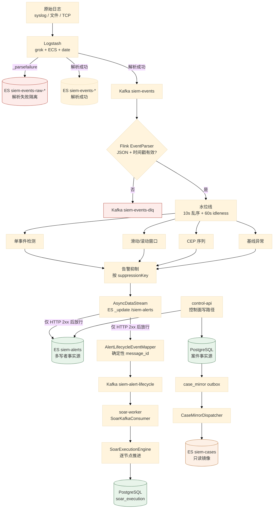

# 01 端到端关键数据流

> **文档类型**：数据流取证（代码级核验，非设计提案）
> **分析对象**：`D:\Project\SIEM`（Maven 聚合工程 + 独立 Flink 工程）
> **取证方式**：源码直读 + grep 统计；每个关键论断附 `file:line` 相对路径锚点
> **结论以当前代码为准**（分支 `add_frame` @ `36b967f`）
> **文档集**：00–06 共 7 篇，见 [`README.md`](README.md)

---

## 一句话定位

本文逐条拆解贯穿 HISIEM 的 **7 条端到端数据流**——从日志进入 Logstash，到 SOAR 逐节点执行处置动作。

每节给出**关键论断 + `file:line` 锚点**，并标出这个项目里**反直觉、容易看错**的地方。代码片段只保留「少一行就看不出意图」的几行，其余事实以锚点代替。全链拓扑见 §0，跨流硬约束汇总在 §8。

---

## 0. 主链总览



各环节的 `file:line` 锚点分散在 §1–§7 各自的小节里，不在此重复。

---

## 1. 数据流：日志接入与分流

### 1.1 关键论断

**论断 1：Logstash 是唯一接入点，做的是「双出口 + 失败隔离」，不是单出口。**

解析成功的日志**同时**写 ES（可检索）与 Kafka（可检测），两条路径并行（`infra/logstash/pipeline/logstash.conf:101-121`）。解析失败（`_parsefailure` / `_dateparsefailure` 标签）的日志被路由到独立 raw 索引，**且不进 Kafka**：

```ruby
# infra/logstash/pipeline/logstash.conf:95-100
if "_parsefailure" in [tags] or "_dateparsefailure" in [tags] {
  elasticsearch { ... index => "siem-events-raw-%{+YYYY.MM.dd}" }
}
```

> **这条隔离是有意的**：`logstash.conf:92` 注释写明「保留原文可查（排查窗口，非长期存储），**不进 Kafka → 不进 Flink 检测**（不产生告警）」。即**脏数据在结构上不可能触发告警**——这是数据面的第一道质量闸门。

**论断 2：`siem-events-raw-*` 走独立 ES 模板，靠 `priority` 压过主模板。**

`logstash.conf:93-94` 注释记录了原因：raw 模板 `priority: 200` > 主模板 `priority: 100`，避免平级模板 tie-break 覆盖 `match_only_text` 语义。同前缀索引（`siem-events-*` 与 `siem-events-raw-*`）共存时必须显式定优先级。

**论断 3：接入侧配置由控制面程序生成，不是手写的。**

`OnboardingController` 提供 `/api/log-sources` 与 `/api/parser-templates` 系列端点（端点清单的权威来源是 [`product-contract.md`](../../contracts/product-contract.md)），生成逻辑在 `LogstashConfigGenerator`（测试锚点 `LogstashConfigGeneratorTest.java:51,52`）。生成器已规避两个实战坑（`CLAUDE.md` §关键知识点 6、7）：`--path.data` 重定向避免队列锁争抢、数组尾逗号。

## 2. 数据流：Flink 解析、DLQ 隔离与事件时间

### 2.1 关键论断

**论断 1：源用 `committedOffsets(EARLIEST)`，不是固定 `earliest()`。**

`DetectionJob.java:138` 是 `OffsetsInitializer.committedOffsets(OffsetResetStrategy.EARLIEST)`。这是**语义差异**而非风格差异：`committedOffsets` 优先使用已提交位点，**仅在没有已提交位点时**才回退到最早位置；固定 `earliest()` 会让每次重启都从头重放。

并行度固定为 2，注释写明是为了分摊 3 个分区（`DetectionJob.java:107-108`：`// KafkaSource 以 2 个并行消费者分摊 3 分区的 siem-events。`）。

**论断 2：checkpoint 是 `EXACTLY_ONCE`，但 Kafka sink 是 `AT_LEAST_ONCE`——两者不同。**

`DetectionJob.java:113-117` 启用 `EXACTLY_ONCE` checkpoint（并设超时、最小间隔、并发上限、可容忍失败数）；而 DLQ sink（`:163`）与 lifecycle sink（`:306`）都显式声明 `DeliveryGuarantee.AT_LEAST_ONCE`。

**故障恢复时可能重放少量在途记录。** 系统的应对不是消除重放，而是**让重放幂等**——见下一条。

**论断 3：告警身份是确定性的 `sha1(rule_id|entity|@timestamp)`，所以重放收敛到同一文档。**

```java
// DetectionJob.java:452-463
static String alertId(String element) {
    ...
    String ruleId = String.valueOf(alert.getOrDefault("alert.rule_id", "unknown"));
    Object declaredEntity = alert.get("alert.entity");
    Object ip = alert.get("source.ip");
    Object user = alert.get("user.name");
    String entity = declaredEntity != null ? String.valueOf(declaredEntity)
            : (ip != null ? String.valueOf(ip)
            : (user != null ? String.valueOf(user) : "unknown"));
    String ts = String.valueOf(alert.getOrDefault("@timestamp", "unknown"));
    return sha1Hex(ruleId + "|" + entity + "|" + ts);
}
```

同一个三元组永远算出同一个 ID → 写 ES 走 `_update`（非整体覆盖），**天然幂等**。`CLAUDE.md` §关键知识点 1 记录了这个设计意图：*「故障仍可能重放少量在途记录，告警依靠确定性 ES ID 收敛」*。

**反直觉点：entity 有优先级链**——`alert.entity` 声明值 > `source.ip` > `user.name` > `"unknown"`。

**论断 4：解析失败走 side output 到独立 DLQ topic，与主链物理隔离。**

`DetectionJob.java:156-167`：`parsed.getSideOutput(EventParsingProcessFunction.DLQ)` 接到独立 `KafkaSink`（uid `event-parser-dlq-kafka`），与主链的 `event-parser` 算子分开。

**论断 5：水位线容忍 10 秒乱序 + 60 秒分区空闲。**

`DetectionJob.java:172-177`：`forBoundedOutOfOrderness(Duration.ofSeconds(10))` 加 `withIdleness(Duration.ofSeconds(60))`（uid `window-watermark`）。

- `withIdleness(60s)` 是**多分区场景的必要设置**：某分区长期无数据时，它的水位线会拖住整条流，窗口永不关闭。
- 代价：**告警延迟至少 10 秒**。

## 3. 数据流：四类检测分支与告警合流

### 3.1 关键论断

**论断 1：四类分支由规则 YAML 驱动，各有独立算子 uid。**

| 分支 | 生成条件 | 算子 uid 模式 | 锚点 |
| --- | --- | --- | --- |
| 单事件 | `"single_event".equals(d.category)` | `single-event-detection` | `DetectionJob.java:184,189` |
| 窗口 | `"window".equals(x.category)` | `window-<ruleId>` | `DetectionJob.java:200,217` |
| CEP | 序列规则 | `cep-<ruleId>` | `DetectionJob.java:243` |
| 基线 | 基线条目 | `baseline-<ruleId>` | `DetectionJob.java:271` |

后三类**按规则逐条建算子**（`uid` 拼规则 id），因为每类规则的 key、窗口长度、阈值都不同；单事件只有一个算子，因为所有单事件规则共用同一套匹配逻辑。

**论断 2：窗口支持滑动与滚动两种，由规则声明决定。**

`DetectionJob.java:207` 用 `SlidingEventTimeWindows`，`:212` 用 `TumblingEventTimeWindows.of(Duration.ofMinutes(wr.getWindowMinutes()))`。

**论断 3：抑制是每分支独立的一层，不是全局收口。**

单事件抑制用 `keyBy(AlertSuppressor::suppressionKey)`，uid `alert-suppression`（`DetectionJob.java:190,192`）；窗口抑制**每条规则一个**，且带规则自己的 keyField，uid `window-alert-suppression-<ruleId>`（`:219,222`）。

> **这点容易看错**：`alert-suppression` 是**单事件专用**的；窗口分支不走它，走 `window-alert-suppression-<ruleId>`。四类分支**各自抑制后**才合流。

**论断 4：合流是 `union`，没有优先级或去重。**

`DetectionJob.java:225,287` 两处都用 `streams.reduce((a, b) -> a.union(b))`，且都**显式处理空集合**（`isEmpty() ? null : ...`），避免无规则时 `reduce` 抛异常。

**论断 5：全链共 9 个稳定算子 uid。**

grep 实测：`kafka-source`、`event-parser`、`event-parser-dlq-kafka`、`window-watermark`、`single-event-detection`、`alert-suppression`、`es-index-and-forward`、`alert-lifecycle-contract`、`alert-lifecycle-kafka`——外加按规则动态生成的 `window-*` / `cep-*` / `baseline-*` / `window-alert-suppression-*`。

> **为什么 uid 重要**：uid 是 savepoint 恢复的算子寻址键，改 uid 等于让既有 savepoint 失效。见 `CLAUDE.md` §关键知识点 8（cancel 默认删 checkpoint，恢复演练须用 savepoint）。

## 4. 数据流：告警落 ES → 生命周期公告（**顺序保证**）

### 4.1 关键论断

**这条流的全部要点是一个顺序不变式：SOAR 绝不能先于告警可读而收到 `alert.created`。**

**论断 1：ES 写入是异步算子，且只在 HTTP 2xx 时向下游放行。**

`DetectionJob.java:291-296` 用 `AsyncDataStream.unorderedWait(..., new AlertElasticsearchIndexer(...), 30, TimeUnit.SECONDS, ...)`（uid `es-index-and-forward`）。`AlertElasticsearchIndexer` 是 `RichAsyncFunction`，非 2xx 与超时一律 `completeExceptionally`：

```java
// AlertElasticsearchIndexer.java:52-63（超时同样 completeExceptionally，:68）
.whenComplete((response, error) -> {
    if (error != null) {
        resultFuture.completeExceptionally(error);
    } else if (response.statusCode() / 100 != 2) {
        resultFuture.completeExceptionally(new IllegalStateException(
                "Elasticsearch alert update failed HTTP " + response.statusCode() + ": " + response.body()));
    } else {
        resultFuture.complete(Collections.singleton(alert));
    }
});
```

**关键点**：`completeExceptionally` 不是「记个日志继续」——异步算子的异常会**触发作业失败**，从而**不会向下游发出生命周期事件**。顺序保证的实现方式是**让前半段失败时后半段根本收不到消息**，而不是排队。类注释把意图写得很直白：

```java
// AlertElasticsearchIndexer.java:18-19
 * This ordering is intentional: SOAR must never consume alert.created before
 * the target alert can be read and updated by the control-plane services.
```

**论断 2：`siem-alerts` 是数据面与控制面共享的事实源，两个写者用不同的一致性策略。**

- **Flink 写**用 `_update`（部分更新），不用 `_doc` 整体覆盖（`AlertElasticsearchIndexer.java:43`），靠确定性 ID 幂等。
- **控制面读**用 `GET /siem-alerts/_doc/{id}`（`AlertService.java:179,201,249,403`）；**改**用带乐观锁的 `_update`（`AlertService.java:401,426`，`if_seq_no`/`if_primary_term`，冲突返回 409）。

**Flink 防重复写，控制面防并发覆盖**——两种机制互补，而不是单一写者假设。

**论断 3：生命周期事件只有一种 `event_type`，且 `message_id` 是确定性的。**

`AlertLifecycleEventMapper.java:42-46` 硬编码 `"alert.created"`、`"default"`、`"hsiem-flink"`——**Flink 侧只发这一种事件**；控制面侧的其它事件类型走另一条路径（见 §6 论断 7）。

`message_id` 的确定性来自**带长度前缀**的规范化编码：

```java
// AlertLifecycleEventMapper.java:70-88
return UUID.nameUUIDFromBytes(canonicalIdentity(
        eventType, tenantId, objectType, objectId, occurredAt.toString())).toString();

/** Encodes each identity component with its byte length to avoid delimiter collisions. */
private static byte[] canonicalIdentity(String... components) {
    encoded.write(length >>> 24); ...    // 4 字节长度前缀
```

**长度前缀是为了避免分隔符碰撞**——`("ab","c")` 与 `("a","bc")` 用 `|` 拼接会得到相同字符串。这是确定性哈希的正确做法。

**论断 4：生命周期事件的 `id` 是 ES 文档 id，不是探测器展示用的 `alert.id`。**

`AlertLifecycleEventMapper.java:25-27` 显式注释：*「The lifecycle id is the Elasticsearch document id used by AlertService, not the detector's display-only alert.id field.」*，取值即 `DetectionJob.alertId(alertJson)`。

**两个 id 语义不同，容易混淆**：`alert.id` 只是探测器内部标识（仅供展示）；lifecycle 的 `id` 必须是 ES 文档 id，否则 SOAR 拿到的 id 在控制面查不到。

**论断 5：生命周期 envelope 是「故意小」的契约。**

`AlertLifecycleEventMapper.java:13` 类注释：*「Converts a stored alert into the deliberately small SOAR lifecycle contract.」*。只带 11 个告警字段（`AlertLifecycleEventMapper.java:29-39`）：`id`、`rule_id`、`rule_name`、`severity`、`status`、`verdict`、`risk_score`、`source_ip`、`user_name`、`host_name`、`timestamp`。**不带原始事件、不带 `matched_event_ids`**——SOAR 需要明细时回查控制面。

## 5. 数据流：案件——PostgreSQL 事实源 → outbox → ES 镜像

### 5.1 关键论断

**论断 1：案件的权威存储是 PostgreSQL，ES 只是只读镜像——这与告警相反。**

告警的事实源在 ES（`siem-alerts`）；案件的事实源在 PostgreSQL，ES 里的 `siem-cases` 是投影。端口注释写死了这条边界（`CaseStore.java:11-12`）：事实变更在同一事务内先落 PostgreSQL 并由 `enqueueCaseMirror` 写入 outbox，再由 `claimCaseMirrorBatch`/`completeCaseMirror` 投递给 Elasticsearch；**业务正常写路径不应绕过此端口直接写 ES**。

**论断 2：outbox 入队与事实变更在同一事务内——这是「避免只成功一侧」的机制。**

`CaseStore.java:32-33`：*「在案件事实源事务中写入 ES 镜像 outbox，避免删除/更新只成功一侧。」*。调用点在 `MyBatisControlPlaneStore` 的 `:345`、`:431`、`:466`（`upsert` / `delete` 两类操作）。

**论断 3：领取用租约，且注释诚实标注了「当前不用 SKIP LOCKED」。**

`CaseStore.java:35-36` 定义 `claimCaseMirrorBatch(String owner, Instant leaseUntil, int size)`；`CaseMirrorDispatcher.java:20-21` 类注释说明：数据库 outbox 保证进程重启后仍可重试，**lease + 事务行锁**保证多实例不会同时处理同一条消息，*「当前领取 SQL 不使用 SKIP LOCKED」*。

> **这是本文最该注意的一处诚实标注**：文档明说不使用 `SKIP LOCKED`，不隐藏实现选择——租约 + 事务行锁已能保证不重复处理，`SKIP LOCKED` 只是并发性能优化。**这类自我标注比一句「已用最佳实践」可信得多。**

**论断 4：`owner` 是进程启动时生成的随机串——多实例天然隔离。**

`CaseMirrorDispatcher.java:36` 是 `owner = "case-mirror-" + UUID.randomUUID()`；`LifecycleOutboxDispatcher.java:43` 同法（`"lifecycle-outbox-" + UUID.randomUUID()`）。**这是「无中心协调的租约归属」**：每个进程启动时随机认领一个身份，配合 DB 侧 `lease_until` 判活。

**论断 5：投递 target 是 `siem-cases/_doc/{caseId}`，删除操作把 404 视为成功。**

```java
// CaseMirrorDispatcher.java:63-67
response = elasticsearch.request("DELETE", "/siem-cases/_doc/" + caseId, null);
if ((response.code() < 200 || response.code() >= 300) && response.code() != 404) {
    throw new IllegalStateException("ES 删除案件失败 HTTP " + response.code());
}
```

**`404` 被显式放过**——「要删的东西本来就不存在」对镜像而言是**已达目标态**，重试无意义。

**论断 6：投递前剥掉两个控制面内部字段。**

`CaseMirrorDispatcher.java:71-72` 移除 `_id` 与 `_control_version`。`_control_version` 是 PG 事实源的乐观锁版本号，**不应泄漏到只读镜像**。

**论断 7：自动聚合每 5 分钟一轮，靠两条显式跳过规则做到幂等。**

```java
// CaseAggregateJob.java:11-13（类注释）
 * 自动聚合调度(story-07 FR-1):每 5min 扫描近 30min open 告警,
 * 按实体(source.ip 优先,退 user.name)聚类,组内 ≥2 条建案。
 * 幂等可重跑(已入他案告警跳过;已有同实体 open 案不再新建)。
```

触发点是 `@Scheduled(fixedDelay = 5 * 60 * 1000, initialDelay = 60 * 1000)`（`CaseAggregateJob.java:31`）。

**那两条跳过规则（已入他案的告警跳过；已有同实体 open 案不再新建）让「重跑」安全**，不需要分布式锁。**实体优先级与告警 ID 的优先级链一致**（`source.ip` 优先，退 `user.name`），见 §2 论断 3。

## 6. 数据流：SOAR——生命周期消费、租约与逐节点执行

### 6.1 关键论断

**论断 1：消费端不用 Spring Kafka，自己起一个平台线程管 `KafkaConsumer`。**

`SoarKafkaConsumer.java:48-51` 用 `Thread.ofPlatform().name("siem-soar-kafka").daemon(true)` 起消费线程，实现 `SmartLifecycle` 由 Spring 生命周期驱动；装配由 `@ConditionalOnProperty(name = "app.soar.kafka-consumer-enabled", havingValue = "true", matchIfMissing = true)`（`:21`）控制。

**论断 2：失败记录区分「无效」与「消费失败」两类，处置完全不同。**

```java
// SoarKafkaConsumer.java:63-77
} catch (IllegalArgumentException | com.fasterxml.jackson.core.JsonProcessingException e) {
    invalid.increment();                    // 无效：丢弃，继续
    LOG.error("Discard invalid SOAR lifecycle message topic={} partition={} offset={}: {}", ...);
} catch (RuntimeException e) {
    failures.increment();                   // 消费失败：回退整批
    LOG.error("SOAR lifecycle consumption failed topic={} partition={} offset={}", ...);
    rewindBatch(active, records);
    retry = true;
    break;
}
```

**「无效」= 丢弃并继续（毒消息不阻塞分区）；「失败」= 回退整批并重试。** 两个 Micrometer 计数器分开：`siem.soar.kafka.invalid`（`:43`）与 `siem.soar.kafka.consume.failed`（`:44`）。

**论断 3：失败时回退的是整个批次，不是失败的那一条分区——原因是 `poll()` 的副作用。**

```java
// SoarKafkaConsumer.java:106-110（类注释）
/**
 * poll() advances the in-memory position of every fetched partition. If one record fails,
 * rewinding only that partition could let a later commit skip unprocessed records from the
 * other partitions in the same batch. Rewind the complete batch; execution uniqueness makes
 * already-processed lifecycle messages safe to replay.
 */
```

**这是本文里最值得单独记住的一处推理**：`commitSync()` 是**全分区提交**的，若只回退失败分区，commit 会把**其它分区已推进的位置**一并提交，从而**跳过那些分区里尚未处理的记录**。所以必须整批回退；重放的安全性由「执行唯一性」兜底。

**论断 4：只有整批无重试时才 `commitSync`。**

`SoarKafkaConsumer.java:79`：`if (!retry && !records.isEmpty()) active.commitSync();`。

**论断 5：worker 是轮询 + 租约的，不是事件驱动。**

`SoarWorker.java:49` 的 `@Scheduled(fixedDelayString = "${app.soar.worker-poll-ms:500}")` 配合 `claimDue(owner, lease, 1)`（`SoarWorker.java:52`），默认 `app.soar.worker-lease=PT30S`。

**论断 6：状态迁移权集中在引擎，节点处理器只算结果；租约构成 fencing。**

`SoarExecutionEngine.java:15` 类注释：*「Node handlers calculate outcomes; this class owns every state transition.」*。租约在引擎内再次校验（`requireLease`，`:52,54`），丢失租约抛 `SoarLeaseLostException`（捕获于 `:45,97`）。**这是 fencing token 语义**——即便消息被重放，过期租约持有者也写不进去。

**论断 7：控制面侧的生命周期事件走 DB outbox，不走 Flink 那条路。**

`LifecycleEventPublisher` 是 `LifecycleEventPort` 的实现（`:15`），持 `LifecycleOutboxStore`（`:22`），`publish` 时调 `store.enqueueLifecycle(...)`（`:69-80`，含 `properties.topicFor(event.objectType())` 选 topic）。**即控制面产生的事件先落 DB outbox，再由 dispatcher 投 Kafka**——与案件的镜像 outbox 是同一个模式。

```java
// LifecycleOutboxDispatcher.java:24-27（类注释）
/**
 * Delivers the durable lifecycle outbox to Kafka. The database lease is the authority for
 * ownership; Kafka delivery is intentionally at-least-once.
 */
```

**论断 8：`publish` 在 `enabled=false` 时静默返回。**

`LifecycleEventPublisher.java:52` 是 `if (!enabled) return;`，`enabled` 来自 `app.soar.runtime-enabled`（`:33`）。**注意这是静默的**——不报错、不计数。开关注释见 00 篇 §7。

## 7. 数据流：控制面告警写路径（ES 事实源 + 乐观锁）

### 7.1 关键论断

**论断 1：控制面读告警用 `_doc`，改告警用带乐观锁的 `_update`。**

读是 `AlertService.java:179` 的 `esGet("/siem-alerts/_doc/" + id)`；改是 `AlertService.java:401`，方法注释记「乐观锁更新:先 GET 拿 `_seq_no`/`_primary_term`,再 `_update` 带 `if_seq_no`/`if_primary_term`,冲突 409」，实现在 `:426`。**这是标准的 ES 乐观并发控制**，与 Flink 侧的确定性 ID 幂等互补。

**论断 2：状态变更写审计字段。**

`AlertService.java:211,349` 写入 `alert.status_updated_at`；配合 `alert.operator`，构成操作审计（类注释 `AlertService.java:28` 列出完整能力：*「verdict - 乐观锁更新(_seq_no/_primary_term,并发冲突 409)+ 操作审计(alert.operator/status_updated_at) - 批量」*）。

**论断 3：控制面与数据面对 `siem-alerts` 的写权限不对称——但都是写。**

`siem-alerts` **不是**「Flink 独占写、控制面只读」。控制面通过 `POST /api/alerts/{id}/status`、`/verdict` 等端点直接改同一批文档。**所以 `siem-alerts` 是多写者的共享事实源**，一致性靠「确定性 ID + 乐观锁」两个机制，而不是单一写者假设。

## 8. 关键不变式（代码强制）

| # | 不变式 | 强制点 | 违反后果 |
| --- | --- | --- | --- |
| 1 | **脏数据永不产生告警** | `logstash.conf:95` 解析失败走 raw 索引且不进 Kafka | 无告警（结构上不可能） |
| 2 | **SOAR 不先于告警可读而收到 `alert.created`** | `AlertElasticsearchIndexer.java:56,68` 非 2xx/超时 → `completeExceptionally` | 作业失败，事件不下发 |
| 3 | **重放的告警收敛到同一文档** | `DetectionJob.java:463` 确定性 `sha1(rule_id\|entity\|@timestamp)` | 重复文档 |
| 4 | **案件事实与镜像 outbox 同事务** | `CaseStore.java:32` 端口契约；`MyBatisControlPlaneStore.java:345,431,466` | 单侧成功，镜像与事实源不一致 |
| 5 | **租约过期者写不进执行状态** | `SoarExecutionEngine.java:52,54` `requireLease` + `SoarLeaseLostException` | 双 worker 并发推进同一执行 |
| 6 | **消费失败必须整批回退** | `SoarKafkaConsumer.java:74` `rewindBatch` + `:106-110` 注释 | 跨分区跳过未处理记录 |
| 7 | **控制面并发改告警不互相覆盖** | `AlertService.java:401,426` `if_seq_no`/`if_primary_term` | 后写覆盖先写 |
| 8 | **案件自动聚合幂等** | `CaseAggregateJob.java:13` 两条跳过规则 + `:31` fixedDelay | 重复建案 |
| 9 | **`alert.id`（展示）≠ lifecycle `id`（文档 id）** | `AlertLifecycleEventMapper.java:25-27` 显式注释 | SOAR 拿到的 id 在控制面查不到 |

---

## 附录：Kafka 主题（数据流的事实前提）

`siem-events`、`siem-events-dlq`、`siem-alert-lifecycle`、`siem-case-lifecycle` 四条 topic **全部 3 分区、RF=1、保留 3 天**（`infra/kafka/create-topics.sh` 的 `PARTITIONS=3` / `RETENTION_MS=259200000`）；脚本会检查既有分区数并在不足时扩容——注释写明**只能增不能减**（Kafka 的分区数约束）。

**创建是显式前置步骤**：`apache/kafka:3.8` 配置 `auto.create.topics.enable=false`，提交 Flink job 前必须先跑 `infra/kafka/create-topics.sh`（`CLAUDE.md` §关键知识点 10）。`deploy.sh` 只同步脚本，不执行它。

**`siem-alert-lifecycle` 与 `siem-case-lifecycle` 是两条独立 topic**，由 `SoarKafkaProperties.topicFor(objectType)` 按对象类型选择（见 04 篇 §8.1 论断 5）。因此 alert 事件与 case 事件走不同的 topic——§6 描述的是 alert 路径，case 路径同构，仅目标 topic 不同。
