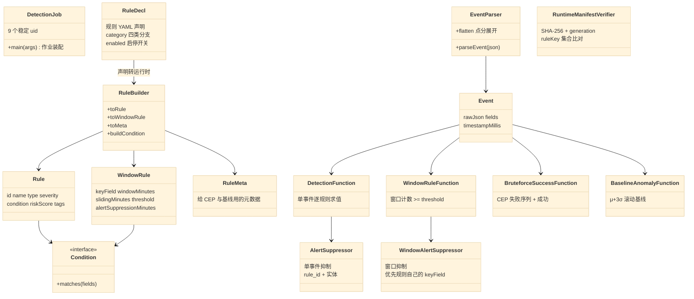
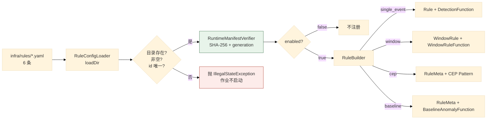
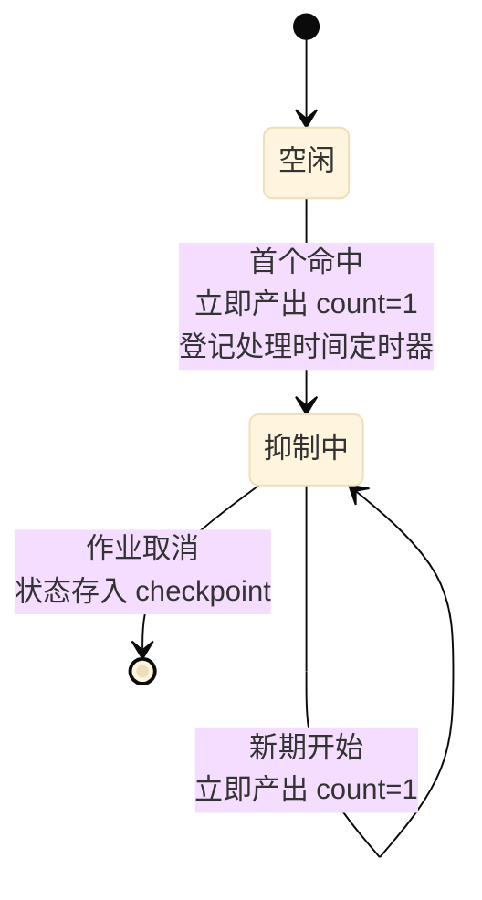
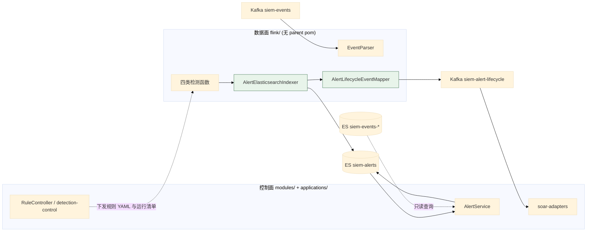

# 02 数据面：接入、缓冲与 Flink 检测引擎

> **文档类型**：子系统深挖（代码级核验，非设计提案）
> **分析对象**：`D:\Project\SIEM` 的数据面——`flink/`（独立 Maven 工程）+ `infra/logstash/` + `infra/kafka/` + `infra/rules/`
> **取证范围**：`flink/src/main/java/com/siem/` 30 个 Java 文件（2606 行）+ `infra/rules/*.yaml` 6 条规则
> **取证方式**：源码直读 + grep 统计；每个关键论断附 `file:line` 锚点
> **结论以当前代码为准**（分支 `add_frame` @ `36b967f`）
> **文档集**：00–06 共 7 篇，见 [`README.md`](README.md)

---

## 1. 关键类与聚合根



**读法**：上半部分是**模型类**（`RuleDecl` → `RuleBuilder` → `Rule` / `WindowRule` / `RuleMeta`，条件统一落到 `Condition` 接口）；下半部分是**算子类**（解析、四类检测函数、两个抑制器、清单校验）。两条链的接口就是 §3 的声明到运行时转换与 §4 的四类分支。

> 各文件的行数与清单不再列出——那是构建产物级别的统计，不是论断的依据。

---

## 2. 事件模型与解析

### 2.1 关键论断

**论断 1：点分字段被显式展开为扁平 key——因为 Logstash 输出的是嵌套对象。**

`EventParser.java:9-14` 类注释说明：Logstash `json` codec 输出的点分字段（如 `source.ip`）可能是嵌套对象（`{"source":{"ip":...}}`），统一展开为扁平 key，便于规则按字段名匹配。

```java
// EventParser.java:46-56
private static void flatten(String prefix, Map<String, Object> map, Map<String, Object> out) {
    for (Map.Entry<String, Object> entry : map.entrySet()) {
        String key = prefix.isEmpty() ? entry.getKey() : prefix + "." + entry.getKey();
        Object value = entry.getValue();
        if (value instanceof Map) {
            flatten(key, (Map<String, Object>) value, out);
        } else {
            out.put(key, value);   // List 等复杂类型原样保留
        }
    }
}
```

**递归只在遇到 `Map` 时下钻**（`:53` 注释明说「List 等复杂类型原样保留」）——`related_events`、`tags` 这类数组要保持结构。

**论断 2：解析失败有两种原因，都抛 `IllegalArgumentException`，且消息含原始值。**

`EventParser.java:35-44` 的 `timestampMillis`：`@timestamp` 为 `null` 时抛「事件缺少 @timestamp」；`Instant.parse` 失败时抛「事件 @timestamp 不是 ISO-8601 时间: 」+ 原值。**时间戳必须可解析才能进主链**——这是事件时间语义的前提。

**论断 3：毒消息不是重启作业，而是转成可观测记录。**

`EventParsingProcessFunction.java:14` 类注释：*「Converts poison input records into an observable Kafka DLQ instead of restarting the Flink job.」*。实现是 `processElement` 里二选一（`:22-30`）：解析成功 `output.collect(outcome.event())`，否则 `context.output(DLQ, outcome.dlqRecord())`。

**论断 4：DLQ 记录自身有界且有身份——两个上限 + 一个内容哈希。**

上限是 `MAX_ORIGINAL_CHARS = 65_536` 与 `MAX_ERROR_CHARS = 2_048`（`EventParsingProcessFunction.java:19-20`）；记录字段是 `dlq.id`、`dlq.stage`、`dlq.error_type`、`dlq.error_message`、`event.original`、`event.original_truncated`（`:46-53`）。三个设计点：

| 点 | 说明 |
| --- | --- |
| `dlq.id = sha256(原始串)` | **同一条坏消息重复投递产生同一个 id** → DLQ 消费方可以据此去重 |
| `dlq.stage = "flink.event-parser"` | 标明失败发生在**哪一段**——DLQ 可被多个阶段共用 |
| `event.original_truncated` | **截断是显式标记的**，不是静默丢数据 |

**论断 5：`OutputTag` 是静态常量，uid 由作业侧绑定。**

`EventParsingProcessFunction.java:17` 定义 `public static final OutputTag<String> DLQ = new OutputTag<String>("siem-event-parser-dlq") { }`；`DetectionJob` 用 `.uid("event-parser-dlq-kafka")` 把它绑到 Kafka sink（`DetectionJob.java:167`）。

## 3. 规则模型：声明 → 运行时

### 3.1 关键论断

**论断 1：规则声明的单一来源是 `infra/rules/*.yaml`，共 6 条。**

实测 `ls infra/rules/`：`rule-auth-rate-anomaly-001`、`rule-common-user-bruteforce-001`、`rule-root-login-failure-001`、`rule-ssh-auth-failure-001`、`rule-ssh-brute-force-001`、`rule-ssh-bruteforce-success-001`。`config/RuleDecl.java:9` 类注释把自己的定位写死了：*「检测规则声明(infra/rules/*.yaml,检测即代码的单一来源)」*。

**论断 2：`category` 决定走哪条分支（四类互斥），它与 `type` 是两个不同字段。**

| 字段 | 作用 | 示例值 |
| --- | --- | --- |
| `category` | **分支依据**（走哪个算子） | `window` |
| `type` | **告警的 `alert.type`** | `ssh_brute_force` |

`RuleDecl.java:11-17` 列明四类：`single_event`（条件匹配）、`window`（窗口内命中数 ≥ threshold）、`cep`（序列）、`baseline`（统计基线）。`:25-27` 的注释把两个字段分开写：`category` 是「规则类别(分支依据)」，`type` 是「告警 type(如 ssh_authentication_failure / ssh_bruteforce_success),进 alert.type」。

**论断 3：启停是「改 YAML + 重新部署 + 重启 job」，不是运行时热开关。**

`RuleDecl.java:17`：*「启停 = 改 enabled → deploy → 重启 job」*。`RuleConfigLoader.loadEnabled`（`config/RuleConfigLoader.java:58-61`）只返回 `enabled=true` 的规则，**但 `DetectionJob` 实际用的是 `loadDir` 再自己 filter**（`DetectionJob.java:119,122`）——**`loadEnabled` 是一个「提供了但没被主流程调用」的 API**。

**论断 4：加载期校验很硬——目录不存在、目录为空、id 为空、id 重复都会抛异常。**

`config/RuleConfigLoader.java:27-56`：`!Files.isDirectory(d)` → 「规则目录不存在」；id 为 `null` 或空白 → 「规则 ID 为空」；id 重复 → 「规则 ID 重复」；`decls.isEmpty()` → 「规则目录为空」。

**「目录为空也抛异常」是 fail-fast 的关键一条**：避免作业以「零规则」的静默状态启动——那样会看起来一切正常却完全无检测能力。文件按**文件名排序**加载（`:35` `Arrays.sort(files, Comparator.comparing(File::getName))`），保证加载顺序确定。

**论断 5：条件声明递归支持嵌套，共 5 种类型。**

`config/RuleBuilder.java:54-77` 的 `buildCondition` 用 switch 分发：`field_equals`、`field_in`、`all`、`any`、`not`，未知类型抛异常。**`not` 强制恰好一个子条件**（`:70-72`）——多子条件的 `not` 语义有歧义（`NOT(a AND b)` 还是 `NOT(a) AND NOT(b)`？），所以直接拒绝。

**论断 6：`window` 规则的三参数是强制的，缺失即抛异常。**

`config/RuleBuilder.java:33-35`：`keyField` / `windowMinutes` / `threshold` 任一为 `null` 即抛异常。

**论断 7：`WindowRule` 的抑制时长默认回退到窗口长度。**

`WindowRule.java:84-87`：`alertSuppressionMinutes == null ? windowMinutes : alertSuppressionMinutes`，且 `<= 0` 抛异常。**「抑制时长缺省 = 窗口长度」是个合理默认**：窗口 5 分钟，抑制也 5 分钟。

**论断 8：`RuleMeta` 专门服务无法用 `Rule` 表达的分支。**

`RuleMeta.java:6-10` 类注释：元数据由 `RuleDecl` 构建，传给 CEP（`BruteforceSuccessFunction`）与基线（`BaselineAnomalyFunction`）等**无法直接用 `Rule` 表达的函数**。**这是「模型跟着分支形态走」**：单事件规则需要 `condition`（`Rule` 有），窗口规则需要 `keyField` + `threshold`（`WindowRule` 有），而 CEP 与基线的判定逻辑完全在算子内部（Pattern 与 μ+3σ），只需要元数据——于是有了 `RuleMeta`。

### 3.2 声明到运行时的转换图



---

## 4. 四类检测函数

### 4.1 关键论断

**论断 1：单事件规则是「逐条事件 × 逐条规则」的双层循环——没有索引。**

`DetectionFunction.java:27-35`：`flatMap` 对 `registry.getRules()` 逐条 `rule.getCondition().matches(fields)`。**复杂度 O(事件数 × 规则数)**，且 `RuleRegistry` 只支持整表替换（`RuleRegistry.java:22` 构造传入）。当前 6 条规则下这不是问题；规则数上千时需要重新设计。

> `RuleRegistry` 里还有一份**硬编码的 3 条 SSH 规则构造**（`RuleRegistry.java:27-73`），注释标明「历史测试用;生产走 YAML 加载」。**生产路径不经过它**——`DetectionJob` 用 `RuleBuilder` 从 `RuleDecl` 构建。

**论断 2：告警是「关键字段提升 + 完整事件存字符串」——决策 D。**

`DetectionFunction.java:14-15` 类注释点明结构。提升的是**白名单**（`:53-59`）：`log.source_id`、`log.source_name`、`source.ip`、`user.name`、`host.name`、`event.action`、`event.category`，再把完整 JSON 存进 `event.raw`、`event_count = 1`。**为什么这样设计**：ES 里查告警时不必 nested 查询就能按 `source.ip` 过滤（顶层字段可索引），同时 `event.raw` 保留完整原始上下文。

**论断 3：`alert.id` 是随机 UUID——它只是展示标识，不参与身份判定。**

四处生成告警的函数都写 `alert.put("alert.id", UUID.randomUUID().toString())`（`DetectionFunction.java:43`、`WindowRuleFunction.java:50`、`BruteforceSuccessFunction.java:78`、`BaselineAnomalyFunction.java:135`）。**真正的身份是 `DetectionJob.alertId` 算出的 sha1**（见 01 篇 §2 论断 3）。这个「双 id」设计在 `AlertLifecycleEventMapper.java:25-27` 有显式注释警告。

**论断 4：窗口规则的实体是显式写入的，正是它为确定性 ID 提供了输入。**

`WindowRuleFunction.java:57-63` 除 `alert.put(rule.getKeyField(), key)` 外还写 `alert.put("alert.entity", key)`，注释写明「窗口规则的分组字段可能是 source.ip/host.name/自定义字段,显式记录实体供下游去重和 ES 确定性 _id 使用」。

**这是关键的一处**：窗口的 `keyField` 可以是任意字段，而 `alertId` 的实体优先级链第一项就是 `alert.entity`——所以窗口告警**无论 keyField 是什么都能得到稳定身份**。**反过来看单事件**：`DetectionFunction` **不写 `alert.entity`**，只 promote `source.ip` / `user.name`，所以单事件告警的身份回退到 `source.ip` → `user.name`。两个分支的解析路径不同，但收敛到同一套 `alertId` 逻辑——这是 §8 不变式 3 能成立的原因。

**论断 5：窗口的 `event_count` 是条件命中数而非窗口内事件总数；`related_events` 是命中项的完整快照，且无上限。**

`WindowRuleFunction.java:33-41` 先只把 `condition` 命中的事件收进 `matched`，再判 `matched.size() >= rule.getThreshold()`。所以**不匹配的事件不计数**——一条窗口规则可以复用同一个 `keyBy` 分区而只数自己关心的动作。产出时 `alert.put("event_count", matched.size())`、`alert.put("related_events", matched)`（`:72-73`），**`related_events` 没有截断**：窗口 5 分钟 + 攻击者高频重试时可能很大。这是**有意的取舍**（保留完整攻击叙事），但没有上限是风险点。

**论断 6：CEP 只认「失败序列 + 后续成功」，成功事件为空的匹配直接丢弃。**

`BruteforceSuccessFunction.java:64-71` 用 `match.getOrDefault(failureStep, List.of())` 与 `getOrDefault(successStep, List.of())`，`successes.isEmpty()` 就 `return`。步骤名来自规则声明，默认 `"failures"` / `"success"`（`:38`），空串则拒绝（`:59`）。

**论断 7：CEP 告警的 `@timestamp` 用成功事件的时间，`event_count` = 失败数 + 1，`event.action` 被硬编码。**

`BruteforceSuccessFunction.java:74` 取 `success.getTimestampMillis()`；`:95-96` 写 `event.action = "authentication_success"` 与 `event_count = failures.size() + 1`。**`+1` 是把成功事件自己算进去**，语义是「这条攻击链一共发生了 N 个事件」；**`event.action` 覆写了成功事件的原始值**——告警语义是「得逞」，不是「成功登录」。

**论断 8：基线用 `μ + σ×multiplier`，三个边界条件写得很实。**

```java
// BaselineAnomalyFunction.java:110-118
static boolean isAnomaly(List<Double> baseline, double current, int minBaselineHours,
                         double sigmaMultiplier) {
    if (baseline == null || baseline.size() < minBaselineHours) {
        return false;
    }
    double[] ms = meanSigma(baseline);
    double threshold = ms[0] + sigmaMultiplier * ms[1];
    return threshold > 0 && current > threshold;
}
```

| 条件 | 作用 |
| --- | --- |
| `baseline.size() < minBaselineHours` | **基线不足不判异常**——冷启动期不误报 |
| `threshold > 0` | **阈值为 0 或负时永不告警**——否则「0 次也是异常」 |
| `current > threshold` | 严格大于，等于不算 |

告警带三个可解释字段（`BaselineAnomalyFunction.java:148-150`）：`anomaly.baseline_mean`、`anomaly.baseline_sigma`、`anomaly.threshold`。**分析员能直接看到「当前 87 次 vs 基线 μ=6.2 σ=2.1 阈值=12.5」**，而不是只看到一个「异常」标签。

**论断 9：基线状态是有界 `LinkedList`，且当前窗口不参与自己的基线。**

`BaselineAnomalyFunction.java:98-102`：先 `baseline.add(current)`，再 `while (baseline.size() > baselineHours) baseline.removeFirst()`。**顺序是关键**——判定在 `:92`、加入在 `:98`，**所以当前窗口不参与判定自己的阈值**，否则异常值会抬高自己的门限。

**论断 10：统计量用总体方差（除以 N），不是样本方差（除以 N-1）。**

`BaselineAnomalyFunction.java:121-126` 的 `meanSigma` 对 `(v - mean)²` 取 `.average()`——`.average()` 除以元素个数，即**总体方差**。样本小时总体方差偏小（更敏感）。**这是明确的选择，不是笔误。**

### 4.2 四类分支的求值对比

```mermaid
---
config:
  theme: base
  themeVariables:
    fontFamily: YaHei
---
flowchart TB
    subgraph SINGLE["single_event"]
        S1["逐条事件 × 逐条规则"]
        S2["condition.matches(fields)"]
        S3["event_count = 1<br/>无 alert.entity"]
    end
    subgraph WINDOW["window"]
        W1["keyBy(keyField) 开窗"]
        W2["窗口内过滤出 matched"]
        W3{"matched.size() >= threshold?"}
        W4["event_count = matched.size()<br/>alert.entity = key<br/>related_events = matched"]
    end
    subgraph CEP["cep"]
        C1["Flink CEP Pattern 匹配"]
        C2{"successes 非空?"}
        C3["event_count = failures.size() + 1<br/>event.action 硬编码 success"]
    end
    subgraph BASE["baseline"]
        B1["keyBy(keyField) 小时窗计数"]
        B2{"基线够? 且 threshold>0?<br/>且 current > threshold?"}
        B3["带 anomaly.mean/sigma/threshold"]
    end

    S1 --> S2 --> S3
    W1 --> W2 --> W3 -->|是| W4
    C1 --> C2 -->|是| C3
    B1 --> B2 -->|是| B3
```



---

## 5. 抑制层：两个抑制器，两套语义

### 5.1 关键论断

**论断 1：两个抑制器都用「处理时间」，不是事件时间——且理由写在注释里。**

`AlertSuppressor.java:18-19`：*「用处理时间而非事件时间,语义是"1 小时内同一实体同一规则不要刷屏",与事件时间窗口(暴力破解)区分。」*；`WindowAlertSuppressor.java:18-19` 同旨。

| 层 | 时间语义 | 目的 |
| --- | --- | --- |
| 窗口 / CEP 检测 | **事件时间** | 判定「这段时间内发生了 N 次」 |
| 告警抑制 | **处理时间** | 判定「不要再刷屏」 |

**混用是刻意的**：事件时间适合业务判定，处理时间适合运维节奏。若抑制也用事件时间，历史数据回放时会「按历史时间抑制」，反而刷屏。

**论断 2：抑制模式的骨架一致——首个立即出、期内只累加、期末出最终值。**

`AlertSuppressor.java:21-25` 类注释写明三步：首个命中**立即**产出（`deduplicated_count=1`）并缓存首个告警 JSON；窗口内后续命中只累加状态计数、不产出；`onTimer` 时产出带最终 count 的告警，**首个告警 JSON 的 `@timestamp` 不变 → `_id` 稳定，ES upsert 覆盖更新**，随后清空状态。

**「首个立即出 + 期末更新」是关键手法**：分析员**立刻**看到告警（不必等窗口结束），而最终计数又通过同一个 `_id` 覆盖更新——**延迟与完整性兼得**。

**论断 3：`_id` 稳定的机制是「复用首个告警的 JSON」。**

`AlertSuppressor.java:74` 把首个告警（含首事件 `@timestamp`）存进 `cur.firstAlertJson`，`AlertSuppressor.java:88-92` 在 `onTimer` 里用 `updateCount(cur.firstAlertJson, cur.count)` 产出最终值。因为 `alertId = sha1(rule_id | entity | @timestamp)`，而 `firstAlertJson` 保留了**首个事件的 `@timestamp`**，所以三次输出都算出同一个 `_id`。

**论断 4：两个抑制器的 `suppressionKey` 回退链长度不同。**

- 单事件版（`AlertSuppressor.java:45-54`）：`rule_id | source.ip → user.name → "unknown"`，两级。
- 窗口版（`WindowAlertSuppressor.java:50-62`）：`rule_id | 规则自己的 keyField → source.ip → user.name → "unknown"`，三级。

原因是窗口规则的实体由 `alert.entity` + `alert.put(keyField, key)` 显式写入（§4 论断 4），所以按 keyField 取得到。

**论断 5：窗口抑制器多一个兜底——定时器可能未及时触发。**

`WindowAlertSuppressor.java:75-79`：新记录到达时若 `now >= current.suppressUntil`，**先 `out.collect(mergeLatest(current))` 结算旧期**，再开新期；注释写明「定时器可能尚未在本条记录前触发,先完成旧抑制期的最终更新」。

**这是对 Flink 处理时间定时器语义的正确处理**：定时器在时间推进时触发，**不保证在下一条记录之前**；直接开新期会丢掉旧期的最终计数。

**论断 6：`mergeLatest` 取窗口 `event_count` 的最大值，并与 `deduplicated_count` 分工。**

`WindowAlertSuppressor.java:105-118`：`first.put("event_count", Math.max(firstCount, latestCount))`，`related_events` 用 `latest` 覆盖，再 `first.put("alert.deduplicated_count", state.windowCount)`。

| 细节 | 原因 |
| --- | --- |
| `Math.max` 而非相加 | `event_count` 是**窗口内**命中数，不是累计；取最大窗口更合理 |
| `related_events` 用 `latest` 覆盖 | 保留**最新**窗口的事件明细 |
| `deduplicated_count = windowCount` | 抑制期**收敛了几个窗口**——与 `event_count` 是两个不同量 |

**论断 7：两个抑制器的校验强度不一致。**

`WindowAlertSuppressor.java:31-36` 构造器拒绝 `null` / 零 / 负时长；`AlertSuppressor.java:34-36` 直接 `window.toMillis()`，不校验。**可改进点。**

**论断 8：抑制状态由 Flink checkpoint 托管——重启不丢。**

`WindowAlertSuppressor.java:22` 类注释：状态由 checkpoint 管理，作业重启后不会因为算子内存丢失而重复建档。两者都用 `ValueState`（`AlertSuppressor.java:58-60`、`WindowAlertSuppressor.java:66-67`），不是普通字段。

**论断 9：单事件抑制时长有三条约束，其中一条最反直觉。**

`DetectionJob.java:317-329` 的 `singleEventSuppressionMinutes` 把各规则自己的 `alertSuppressionMinutes` 收敛成一个值，三条约束：

| 事实 | 值 | 锚点 |
| --- | --- | --- |
| 默认时长 | **60 分钟** | `DetectionJob.java:318` |
| 显式值必须 > 0 | 否则抛异常 | `:325-327` |
| **同一 Job Group 内必须一致** | 否则抛异常 | `:328-330` |

收敛出的时长在 `DetectionJob.java:186,192` 交给 `new AlertSuppressor(Duration.ofMinutes(...))`。

> **「同一 Job Group 抑制时长必须一致」是本篇最值得注意的约束。** 原因是**所有单事件规则共用同一个 `single-event-detection` 算子与同一个 `alert-suppression` 算子**（§3 论断 1 的算子表）。既然共用一个抑制器，时长就只能有一个值——**规则级的 `alertSuppressionMinutes` 在单事件分支下不是「各自生效」，而是「必须投票出一致值」**。
>
> 这与**窗口规则形成鲜明对比**：窗口抑制是「每规则一个算子」（`window-alert-suppression-<ruleId>`），每条窗口规则可以有自己的抑制时长。**同一个 YAML 字段在两个分支下的语义强度不同**——单事件是全局一致约束，窗口是逐规则独立。

**论断 10：CEP 的 Pattern 逐 step 折叠构建，`times` 只在首步生效。**

`DetectionJob.java:416-446` 的 `buildCepPattern`：

| 点 | 说明 |
| --- | --- |
| **`times` 只在 `begin` 步生效** | `next` / `followedBy` 分支**完全不读 `timesMin`/`timesMax`**——重复次数**只能写在首步** |
| `timesMin` 缺省回退到 `timesMax` | `:428` `int min = step.timesMin == null ? step.timesMax : step.timesMin` |
| **条件在每个 step 内独立构建** | 复用 `RuleBuilder.buildCondition`，所以 CEP 步骤条件支持全部 5 种条件类型（含嵌套 `all`/`any`/`not`） |
| **`within` 在循环外统一应用** | 整个序列一个时间上限，不是每步一个 |

未知步骤类型抛异常（`:438-440`）。**对照实际规则声明**：`rule-ssh-bruteforce-success-001.yaml:21-28` 正是「首步 `begin` 带 `timesMin: 5` / `timesMax: 100`，次步 `next` 无 times」——**与代码的约束一致**。

### 5.2 抑制状态机



> **注意最后一条自环**：`WindowAlertSuppressor.java:75-79` 的分支——当新记录到达时发现 `now >= current.suppressUntil`，**先 `out.collect(mergeLatest(current))` 结算旧期**，再开新期。这是两个抑制器里唯一的一处差异逻辑。

---

## 6. 告警契约与 OCSF 输出视图

### 6.1 关键论断

**论断 1：告警字段是 ECS 存储 + OCSF 视图并存。**

`Ocsf.java:5-9` 类注释：OCSF 是**可移植视图**，在 ECS 存储的告警上附加 OCSF 核心字段，使规则/看板未来换平台或对接 AWS Security Lake 时不必重写；**存储仍以 ECS 为准**，完整映射见 `docs/design/ocsf-mapping.md`。所以一条告警里同时有 `source.ip`（ECS）与 `ocsf.src_endpoint.ip`（OCSF）。

**论断 2：OCSF 视图只有四个字段，`class_uid` 是常量。**

`Ocsf.java:15` 定义 `CLASS_AUTHENTICATION = 3002`（OCSF 的 Authentication 事件类）；`applyAuthView`（`:33-42`）写 `ocsf.class_uid`、`ocsf.severity_id`，且**只在 `source.ip` 存在时才写 `ocsf.src_endpoint.ip`**（`:37-40`）——不写 null。

**论断 3：severity 映射是五档，未知值回落到 0（Unknown）而非抛异常。**

`Ocsf.java:19-31`：`null` → 0；`info` / `low` / `medium` / `high` / `critical` → 1..5；其它 → 0。**输入做了 `toLowerCase()`**，所以 `"HIGH"` 与 `"high"` 等价。**对照 `AlertLifecycleEventMapper.java:32`**：那里的 `severity` 直接透传原值，不做归一——**两处对 severity 的处理严格度不同**。

**论断 4：四类告警共享同一个字段骨架，差异只在分支特有字段。**

| 字段 | single | window | cep | baseline |
| --- | --- | --- | --- | --- |
| `@timestamp` | 事件时间 | **窗口结束时间** | **成功事件时间** | **窗口结束时间** |
| `alert.id` | UUID | UUID | UUID | UUID |
| `alert.rule_id` / `rule_name` / `type` / `severity` | ✓ | ✓ | ✓ | ✓ |
| `alert.risk_score` | ✓ | ✓ | ✓ | ✓ |
| `rule.tags` / `status` / `version` | ✓ | ✓ | ✓ | ✓ |
| `alert.status` = `"open"` | ✓ | ✓ | ✓ | ✓ |
| `alert.entity` | — | **✓ = key** | — | — |
| `event_count` | **1** | 命中数 | 失败数 + 1 | 命中数 |
| `related_events` | — | ✓ | ✓ | — |
| `event.raw` | ✓ | — | — | — |
| 分支特有 | — | — | `event.action` 硬编码 | `anomaly.*` 三字段 |
| `ocsf.*` | ✓ | ✓ | ✓ | ✓ |

> **`@timestamp` 的取值因分支而异**是本表最该注意的一点：单事件用**事件自身**时间，窗口与基线用**窗口结束**时间，CEP 用**成功事件**时间。它直接决定确定性 `alertId` 的输入。

---

## 7. 运行参数与运行清单校验

### 7.1 关键论断

**论断 1：所有运行参数都是「默认值 + system property / 环境变量双层覆盖」。**

`config/RuntimeTuning.java:16-18` 的 `defaults()` 给出八个默认值：

| 序号 | 字段 | 默认 | 环境变量 |
| --- | --- | --- | --- |
| 1 | `checkpointIntervalMs` | 30 000（30s） | `SIEM_FLINK_CHECKPOINT_INTERVAL_MS` |
| 2 | `checkpointTimeoutMs` | 600 000（10min） | `SIEM_FLINK_CHECKPOINT_TIMEOUT_MS` |
| 3 | `minPauseBetweenCheckpointsMs` | 10 000（10s） | `SIEM_FLINK_CHECKPOINT_MIN_PAUSE_MS` |
| 4 | `tolerableCheckpointFailures` | 5 | `SIEM_FLINK_CHECKPOINT_TOLERABLE_FAILURES` |
| 5 | `esBatchSize` | 250 | `SIEM_FLINK_ES_BATCH_SIZE` |
| 6 | `esMaxInFlightRequests` | 3 | `SIEM_FLINK_ES_MAX_IN_FLIGHT` |
| 7 | `esMaxBufferedRequests` | 500 | `SIEM_FLINK_ES_MAX_BUFFERED` |
| 8 | `esMaxTimeInBufferMs` | 500 | `SIEM_FLINK_ES_MAX_BUFFER_MS` |

`value()`（`config/RuntimeTuning.java:46-49`）先读 `System.getProperty(key)`，为空才读 `System.getenv(key)`——**system property 优先**。

**论断 2：这八个参数里有三个是死参数。**

`esBatchSize`、`esMaxInFlightRequests`、`esMaxTimeInBufferMs` 在 `flink/src/main` 与测试中**从未被读取**（只出现在 `RuntimeTuning` 自身的定义与解析里）；**只有 `esMaxBufferedRequests` 被消费**——`DetectionJob.java:296` 把它传给 `AsyncDataStream.unorderedWait` 的 capacity。

**所以改那三个环境变量不会有任何效果。** 现有文档把它们描述为「ES 批量大小 / 最大在途 / 缓冲最长时间」，同样没有指出这一点。**「配置项存在」≠「约束生效」。**

非法值的处置是**静默回退**：`parseLong`（`config/RuntimeTuning.java:67-74`）解析失败、或解析结果小于最小值（`1`）时都回退默认值，不报错。配错一个环境变量不会让作业启动失败，只是不生效——这是可运维性上的取舍点。

**论断 3：重启策略是 `exponential-delay`，参数硬编码。**

`DetectionJob.java:94-99`：初始 5 秒、上限 2 分钟、1.5 倍增长、0.1 抖动、最多 10 次。注释（`:93`）记录 Flink 2.x 的变化：**「旧版 `RestartStrategies` 工厂已移除」**，只能用 `Configuration` 选项配置。**这些值不走 `RuntimeTuning`**，与上面八个可调参数形成对比。

**论断 4：状态目录按 `jobKey` 隔离——managed 作业之间不共享状态。**

`DetectionJob.java:84-88`：checkpoint / savepoint 根目录可由 `SIEM_CHECKPOINT_ROOT` / `SIEM_SAVEPOINT_ROOT` 覆盖，managed 作业在路径后拼 `/<jobKey>`，落进 Docker 挂载的持久卷。**legacy 启动用共享路径**（`stateSuffix = ""`），注释（`:82-83`）说明是为兼容历史部署，重部署到 5B 参数后即消失。

**论断 5：运行清单校验是「启动前的强闸门」，四道检查串行。**

`DetectionJob.java:119-121` 先 `loadDir`、再 `new RuntimeManifestVerifier().verify(Path.of(rulesDir), arguments, decls)`——**传入的是全部规则而不是过滤后的 `enabled`**（filter 在下一行 `:122`）。所以**运行清单覆盖全部规则、包括被禁用的**：这是有意的，「禁用」是运行决策，「清单」是部署完整性证明。

四道检查（`RuntimeManifestVerifier.java`）：

| # | 检查 | 行 | 失败 |
| --- | --- | --- | --- |
| 1 | **文件字节的 SHA-256 与参数一致** | `:56-60` | `runtime manifest SHA-256 mismatch` |
| 2 | **schemaVersion 受支持** | `:71-74` | `unsupported runtime manifest schemaVersion` |
| 3 | **generation 与作业参数一致** | `:75-79` | `generation does not match job arguments` |
| 4 | **ruleKey 集合与已加载规则完全一致** | `:104-113` | `missing=... extra=...` |

**第 4 道是双向的**：`manifestIds.equals(loadedIds)` 不成立时，`missing`（清单有但没加载）与 `extra`（加载了但清单没有）**分开报**——这是两种不同的部署错乱。

**论断 6：哈希算的是原始字节，且 UTF-8 解码用严格模式。**

`RuntimeManifestVerifier.java:49-60` 读 `rulesDir.resolve("runtime-manifest.json")` 后用 `Files.readAllBytes(...)` 取原始字节再 `sha256(raw)`，比的是**字节**而不是解析后的对象——所以格式变化也逃不掉。解码走 `decodeUtf8`（`:123-129`），`onMalformedInput(REPORT)` + `onUnmappableCharacter(REPORT)`——**非法字节直接抛异常，不静默替换**。**字节级哈希 + 严格解码，是「不可变清单」真正不可变的前提。**

**论断 7：legacy 启动跳过校验，但让「跳过」成为返回值里可见的事实。**

`RuntimeManifestVerifier.java:44-47` 在 `arguments.legacy()` 时打印一行并返回 `legacyVerification()`；`:155-157` 构造 `new Verification(true, null, 0L, Set.of())`。`Verification` 是 `record`（`:149`），构造器做防御性拷贝（`:151-153`）。**校验是否发生不是隐含状态，而是 `Verification.legacy` 这个字段。**

**论断 8：`DetectionJobArguments` 有两条 managed 路径 + 一条 legacy 回退。**

`DetectionJobArguments.java:11-12` 类注释：managed 启动把 generation 与运行清单 SHA-256 作为第 1–3 个参数；单参数启动为 pre-5B 作业保留并**显式标记为 legacy**。`parse`（`:44-69`）接受 4 参数式，或 `SIEM_JOB_KEY` / `SIEM_JOB_GENERATION` / `SIEM_JOB_MANIFEST_SHA256` 三环境变量的形式——**三个必须同时给**，只给一部分即抛异常；都没有则回退 `legacy`。`managed` 与 `legacy` 互斥（`:26-28`）。

## 8. 关键不变式（代码强制）

| # | 不变式 | 强制点 | 违反后果 |
| --- | --- | --- | --- |
| 1 | **事件必须有可解析的 ISO-8601 `@timestamp`** | `EventParser.java:35-44` 抛 `IllegalArgumentException` | 进 DLQ，不参与事件时间 |
| 2 | **坏消息进 DLQ，不重启作业** | `EventParsingProcessFunction.java:14,28` 侧输出 | 单条毒消息拖垮整条流 |
| 3 | **DLQ 记录有界** | `EventParsingProcessFunction.java:19-20` 65536 / 2048 字符 | 超大坏消息撑爆 DLQ |
| 4 | **规则目录不能为空** | `RuleConfigLoader.java:52-54` 抛异常 | 作业以零规则静默运行 |
| 5 | **规则 id 全局唯一** | `RuleConfigLoader.java:43-45` 抛异常 | 算子 uid 冲突、告警归属歧义 |
| 6 | **managed 作业的运行清单必须逐字节一致** | `RuntimeManifestVerifier.java:56-60` SHA-256 | 用未授权规则集运行检测 |
| 7 | **清单 ruleKey 与已加载规则双向相等** | `RuntimeManifestVerifier.java:104-113` | 清单与实跑不一致 |
| 8 | **基线不足时不判异常** | `BaselineAnomalyFunction.java:112-114` | 冷启动期误报 |
| 9 | **当前窗口不参与自己的基线** | `BaselineAnomalyFunction.java:92`（判定先于 `:98` 加入） | 异常值抬高自身阈值 |
| 10 | **抑制期的 `_id` 稳定** | `AlertSuppressor.java:74,90`；`WindowAlertSuppressor.java:83,100` 复用首个告警 JSON | 每次输出新建文档，刷屏 |
| 11 | **抑制时长必须 > 0** | `WindowAlertSuppressor.java:32-35`；`DetectionJob.java:325-327` | 除零或永不抑制 |
| 12 | **窗口抑制器先结算旧期再开新期** | `WindowAlertSuppressor.java:76-79` | 旧期最终计数丢失 |
| 13 | **`not` 条件恰好一个子条件** | `RuleBuilder.java:70-72` | 语义歧义 |
| 14 | **同一 Job Group 的 single_event 抑制时长必须一致** | `DetectionJob.java:328-330` 抛异常 | 共用一个抑制器却有两个时长，无法成立 |
| 15 | **CEP 重复次数只能写在 `begin` 步** | `DetectionJob.java:425-440`（`next`/`followedBy` 分支不读 `timesMin`/`timesMax`） | 写在非首步时**静默失效** |
| 16 | **CEP 步骤类型只接受 begin / next / followedBy** | `DetectionJob.java:438-440` 抛异常 | 拼错步骤类型静默产生错误序列 |
| 17 | **告警写入不得覆盖分析师处置字段** | `DetectionJob.java:384-386` 从 partial doc 中移除 5 个受保护字段 | 窗口结束/重放/抑制定时器抹掉人工结论 |
| 18 | **`docAsUpsert` 必须保持默认 false** | `DetectionJobSinkTest` 断言 `update.action().docAsUpsert()` 非 TRUE | 文档不存在时用裁剪后的 partial doc 建文档，新告警反而缺字段 |

### 8.1 告警 partial update 的受保护字段

`DetectionJob.alertOperation(String)` 生成的是 **partial update**：先把完整告警转成 Map，再从副本里移除分析师字段，然后 `.doc(partialDoc).upsert(fullDoc)`。

```java
// DetectionJob.java:379-395
Set<String> protectedFields = Set.of(
        "alert.status", "alert.analyst_verdict", "alert.operator",
        "alert.status_updated_at", "alert.case_id");
protectedFields.forEach(patch::remove);
JsonData fullDoc = JsonData.fromJson(element);
JsonData partialDoc = JsonData.fromJson(ALERT_MAPPER.writeValueAsString(patch));
return new UpdateOperation.Builder<JsonData, JsonData>()
        .index("siem-alerts")
        .id(alertId(element))
        .action(new UpdateAction.Builder<JsonData, JsonData>()
                .doc(partialDoc)
                .upsert(fullDoc)
                .build())
        .build();
```

**`.doc()` 与 `.upsert()` 是成对的，`docAsUpsert` 必须保持默认的 false**：一旦加上 `.docAsUpsert(true)`，Elasticsearch 会在文档不存在时也用那份**被裁剪过的** partial doc 建文档，于是新告警恰好缺掉那 5 个字段。`DetectionJobSinkTest` 把这一点固定成了断言（不变式 18）。

契约层面的同一事实写在 [`soar.md`](../../status/soar.md) §2——那里是它作为契约的主人。

---

## 9. 与其他子系统的边界

**数据面与控制面之间没有代码依赖，只有三类契约。**



**三类契约**：

| 契约 | 数据面侧 | 控制面侧 | 锚点 |
| --- | --- | --- | --- |
| **输入**：事件 | 消费 `siem-events` | Logstash 生产 | `DetectionJob.java:146-151` |
| **输出 1**：告警文档 | `_update /siem-alerts/{id}` | `AlertService` 读且改 | `AlertElasticsearchIndexer.java:43`；`AlertService.java:179,426` |
| **输出 2**：生命周期事件 | 生产 `siem-alert-lifecycle` | `SoarKafkaConsumer` 消费 | `AlertLifecycleEventMapper.java:42-47`；`SoarKafkaConsumer.java:58` |
| **部署输入**：规则声明 | `RuleConfigLoader` 读 YAML | `detection-control` 生成 desired state | 见 05 篇 |
| **部署输入**：运行清单 | `RuntimeManifestVerifier` 校验 | 部署侧提供 `jobKey`/`generation`/`hash` | `RuntimeManifestVerifier.java:56-113` |

**数据面唯一「向外写」的两个目标是 ES 的 `siem-alerts` 与 Kafka 的 `siem-alert-lifecycle`。** 它**从不写 PostgreSQL**——所有持久化状态（checkpoint/savepoint）只落在 Flink 自己的状态目录。

> **`siem-alerts` 是共享写目标**（控制面 `AlertService` 也写）。这个双写事实在 01 篇 §4.1 论断 2 与 §7.1 论断 3 有详细说明——**数据面靠确定性 `_id` 幂等，控制面靠 ES 乐观锁**，两个机制互补而非互斥。

---
