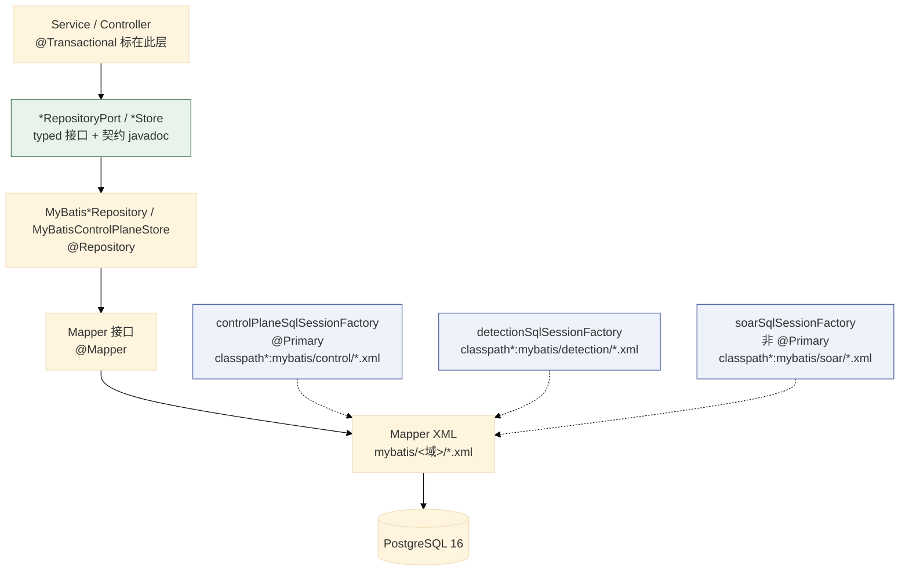
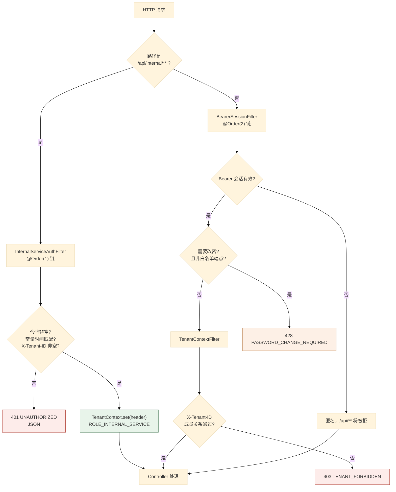
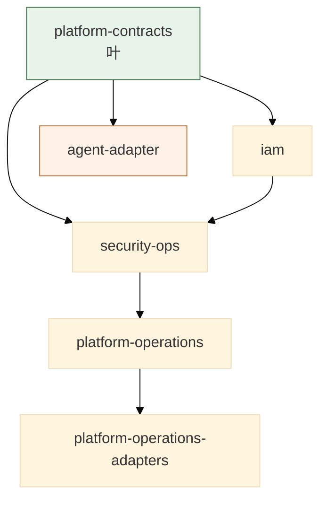
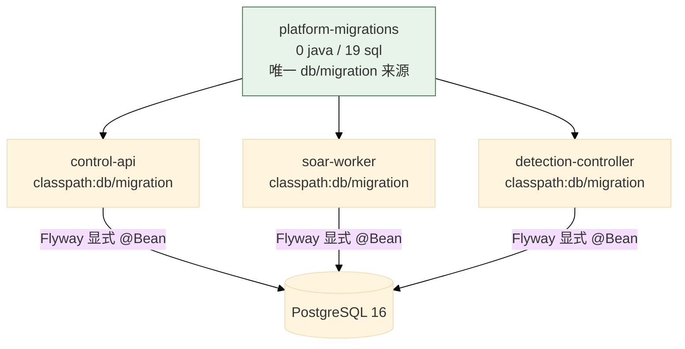
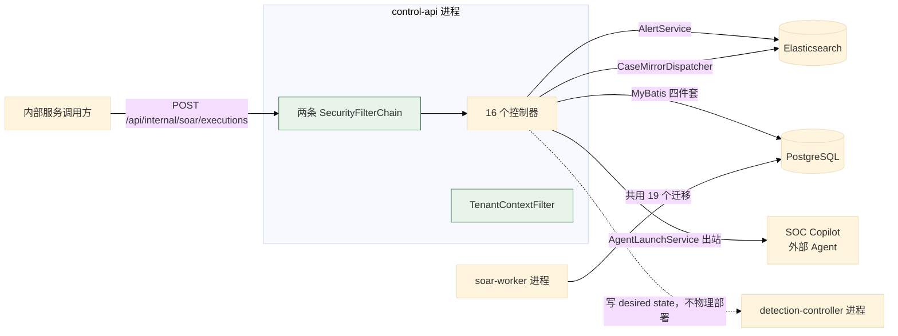

# 03 控制面：Spring Boot 多模块

> **文档类型**：子系统深挖（代码级核验，非设计提案）
> **分析对象**：`D:\Project\SIEM` 的控制面——`modules/` 12 个 Maven 模块 + `applications/` 3 个可执行应用
> **取证范围**：控制面 `modules/` main 源码 **193** 个 `.java` + `control-api` main **23** 个 + 19 个 Flyway 迁移 + 各应用 `application.properties`
> **取证方式**：源码直读 + grep 统计；每个关键论断附 `file:line` 锚点
> **结论以当前代码为准**（分支 `add_frame` @ `36b967f`）
> **文档集**：00–06 共 7 篇，见 [`README.md`](README.md)

---

## 1. 模块规模与依赖（main / test 分列）

**模块清单与各自职责、main/test 规模是 00 篇总表的主人**（00 篇 §5）——本节不重复，只记一件 00 篇的表里看不出的事。

**`iam`、`security-ops`、`platform-operations`、`detection-control` 都是 main 有代码、test 目录 0 个文件。** 那它们的测试在哪？在 **`control-api` 的 45 个测试文件**里——这是「模块无独立测试、由应用级集成测试覆盖」的组织方式。

> **`control-api` 的 test 文件数（45）是 main（23）的两倍**——应用层的测试密度显著高于模块层。模块层 0 测试不是遗漏，是分工：模块提供装配单元，应用提供可运行的验证。

## 2. 组合根与装配入口

### 2.1 关键论断

**论断 1：三个应用各有一个组合根，扫描范围不同——扫描范围就是权限边界。**

`applications/control-api/.../HsiemPlatformApplication.java:14-27` 上挂了**三条** `@MapperScan`；两个 worker 各自的启动类只扫自己那一小块。

| 应用 | 组合根 | 扫描范围 |
| --- | --- | --- |
| `control-api` | `HsiemPlatformApplication.java:14-27` | **三条** `@MapperScan`（detection / control+tenant / soar） |
| `soar-worker` | `entrypoints/SoarWorkerApplication.java` | 只扫 control 与 soar |
| `detection-controller` | `DetectionControllerApplication.java` | 只扫 `detection.controller` 包 |

**关键在「不扫什么」**：`control-api` 不扫 `detection-runtime` / artifact mapper（`CLAUDE.md` §持久化约定第 2 条），目的是**保证 `control-api ↔ detection-runtime` 边界封闭**。第一条 `@MapperScan` 的 `basePackageClasses` 里虽然列了 `DetectionRuntimeMapper`，但它属于 **detection 域工厂**（`detectionSqlSessionFactory`），**不是** `detection-runtime` 模块的 artifact mapper 扫描。

**论断 2：多工厂下必须有且只有一个 `@Primary`，注释写明了原因。**

`modules/iam/.../control/ControlPlaneMyBatisConfiguration.java:22-26` 的类注释：*「Primary so the mybatis starter's shared `sqlSessionTemplate` auto-config bean can resolve a single factory when an app also defines a detection factory.」*。没有它，starter 的 `sqlSessionTemplate` 自动装配无法确定绑哪个工厂。对照：`soar` 工厂（`SoarMyBatisConfiguration`）显式**非** `@Primary`。

**论断 3：Flyway 迁移是显式执行的，因为 Boot 4.1 不自动装配。**

`modules/iam/.../control/ControlPlaneDatabaseConfig.java:11-20`：*「Spring Boot 4.1 当前不自动装配 Flyway，因此在应用配置层显式执行迁移。Flyway bean 初始化完成后，JDBC 控制面存储才会创建，保证不会先读未建表的数据库。」*

> **这是本篇最值得单独记住的一条工程事实**：**Boot 4.1 不自动装配 Flyway**。只靠 `spring.flyway.*` 配置，迁移**根本不会跑**。这里用显式 `@Bean` 补上，并靠 **bean 依赖顺序**保证「迁移先于存储创建」——注释里那句「保证不会先读未建表的数据库」就是这个顺序约束。

**论断 4：`ControlPlaneStore` 是复合端口——一个接口聚合五个子域。**

`modules/iam/.../control/ControlPlaneStore.java:9-10`：`extends AuthStore, NotificationStore, CaseStore, LifecycleOutboxStore, TaskStore`。**这是「按子域拆端口、用一个复合接口统一注入」**：调用方注入一个 `ControlPlaneStore` 就拿到全部能力，而**每个子端口仍可独立测试、独立 mock**。

**论断 5：`CaseStore` 把镜像机制写进了接口 javadoc。**

`modules/iam/.../control/CaseStore.java:7-13` 的 javadoc 里除了描述端口，还写着「业务正常写路径不应绕过此端口直接写 ES」。**机制本身见 01 篇 §5**；这里要记的是**约束的载体**——它被写在类型系统可见的位置，比写在文档里更难被忽略。

## 3. 持久化分层：四件套

### 3.1 关键论断

**论断 1：链路是「Service → `*RepositoryPort` → `MyBatis*Repository` → Mapper 接口 → Mapper XML → PostgreSQL」六段。**

`CLAUDE.md` §持久化约定写明这条链路，并明确*「生产业务代码不再内联 `JdbcTemplate` SQL」*；仅保留两类例外——`@Deprecated` 兼容外观与纯基础设施探针（`OperationalHealthService` 的 `SELECT 1`）。

**论断 2：按域隔离靠「一个工厂 + 一个 XML 通配符」，不是全局 `mapper-locations`。**

| 域 | 工厂 bean | XML 通配符 | XML 位置 |
| --- | --- | --- | --- |
| iam 控制面 | `controlPlaneSqlSessionFactory`（**`@Primary`**） | `classpath*:mybatis/control/*.xml` | `modules/iam/src/main/resources/mybatis/control/` |
| detection | `detectionSqlSessionFactory` | `classpath*:mybatis/detection/*.xml` | 三个位置各自携带 |
| soar | `soarSqlSessionFactory`（非 `@Primary`） | `classpath*:mybatis/soar/*.xml` | `modules/soar-core/src/main/resources/mybatis/soar/` |

**每个工厂只加载自己域的通配符**（`ControlPlaneMyBatisConfiguration.java:31-33`）——所以某个域的 mapper XML 无法被另一个域误加载。`CLAUDE.md` 明确警告**不要依赖 `mybatis.mapper-locations` 全局限定**：全局配置在三个工厂共存时会互相覆盖。

**论断 3：`@Transactional` 标在 store/service 上，让 mapper 语句与调用方同一事务。**

`CLAUDE.md` §持久化约定第 3 条：*「`@Transactional` 标注在 store/service 上，让 mapper 语句与调用方同一事务，保住 `FOR UPDATE`/乐观版本/租约语义」*。**这是案件镜像 outbox「同一事务」不变式（01 篇 §5 论断 2）能成立的前提**——事务边界由 store/service 上的 `@Transactional` 决定。

**论断 4：`@MapperScan` 显式带 `annotationClass = Mapper.class` + `sqlSessionFactoryRef`，是为了避开 starter 的自动装配陷阱。**

`CLAUDE.md` §持久化约定第 2 条写明原因：*「避免 starter 的 `@ConditionalOnMissingBean` 模板误绑」*。**一处例外**：control-api 的第一条 `@MapperScan`（detection 域）不带 `annotationClass`，因为它用 `basePackageClasses` 精确指定两个 mapper，路径已经足够窄。

**论断 5：UUID 列用共享 `TypeHandler`，且只注册在 detection 工厂。**

`CLAUDE.md` §持久化约定第 4 条：`UuidTypeHandler` 是共享的 PostgreSQL `uuid`↔`String` 处理器，注册在 `DetectionMyBatisConfiguration`；未使用它的场景可回退 UUID 自动映射。实测位置：`modules/detection-control/src/main/java/com/xscsiem/hsiem_platform/rules/UuidTypeHandler.java`。

**论断 6：下划线自动映射是「两个应用关闭」，不是只有 detection-controller。**

实测 `mybatis.configuration.map-underscore-to-camel-case=false` 出现在**两个**应用的配置里——`control-api`（`application.properties:3`）与 `detection-controller`（`application.properties:3`）；只有 `soar-worker` 未设。`CLAUDE.md` §持久化约定第 5 条只说「detection-controller 里…」，并未声称唯一。**所以 `control-api` 与 `detection-controller` 都要显式维护 `resultMap`。**

### 3.2 分层图



**两个例外**（`CLAUDE.md` §持久化约定第 3 条）：`SoarStore`、`SoarConnectorActionInvocation`、`SoarBusinessActionInvocation` 作为具体 `@Repository` **直接注入 `SoarMapper`**，不套端口——因为 `soar-core` 主代码与 `SoarWorkerTest` 以具体类消费。

---

## 4. 安全边界

### 4.1 关键论断

**论断 1：两条 `SecurityFilterChain`，靠 `securityMatcher` 与 `@Order` 分流。**

| # | `@Order` | 匹配 | 认证方式 | 锚点 |
| --- | --- | --- | --- | --- |
| 1 | **1** | `/api/internal/**` | `InternalServiceAuthFilter`（服务令牌） | `SecurityConfig.java:46-74` |
| 2 | **2** | 其余全部 | `BearerSessionFilter`（用户会话） | `SecurityConfig.java:76-116` |

**顺序是关键**：内部服务链**必须排在前面**，且只匹配 `/api/internal/**`——否则用户会话链会先接管内部端点。`SecurityConfig.java:44-45` 方法注释：*「必须排在用户会话链之前, 只匹配 /api/internal/**,不要求用户成员关系,不落回用户链。」*

**论断 2：两条链都是 `STATELESS`，且都禁用了 csrf / basic / formLogin。**

`SecurityConfig.java:54-57,71-72`。**「无状态」与「Bearer 会话」并存不矛盾**：会话状态存在 **PostgreSQL**，不在 HTTP 层（无 `JSESSIONID`、无 `HttpSession`）——`BearerSessionFilter` 每次请求查库还原身份。

**论断 3：授权规则分三段——白名单、actuator 限 ADMIN、`/api/**` 需认证。**

`SecurityConfig.java:88-101`：白名单**只有四项**（`/api/auth/login`、`/actuator/health`、`/actuator/info`、`/hello`）`permitAll`；其余 `/actuator/**` `hasRole("ADMIN")`；`/api/**` `authenticated()`；`anyRequest().permitAll()`。

**actuator 限 ADMIN 是有意的**：`/actuator/env`、`/actuator/beans` 会泄漏配置，不能对普通认证用户开放。

**注意 `anyRequest().permitAll()`**——**不在以上三段的路径默认放行**。安全实际依赖「所有业务路径都在 `/api/**` 下」这条约定。

**论断 4：内部服务认证是 fail-closed，且用常量时间比较。**

`InternalServiceAuthFilter.java:50-57` 一次判四个拒绝条件，任一命中即 401：

| 条件 | 含义 |
| --- | --- |
| `expectedToken.length == 0` | **配置令牌为空 → 全部拒绝**（不是「空令牌放过」） |
| `token == null` | 请求未带 Bearer |
| `!MessageDigest.isEqual(...)` | 令牌不符（**常量时间**，防时序侧信道） |
| `tenant == null \|\| tenant.isBlank()` | `X-Tenant-ID` 缺失 |

**第一条是 fail-closed 的精髓**：默认配置 `app.internal-service.token:` 为空串（`SecurityConfig.java:50`），所以**未显式配置时内部端点完全不可用**——而不是「任何人可访问」。

**论断 5：这个过滤器故意**不是** `@Component`。**

`InternalServiceAuthFilter.java:24-26` 类注释：只由 `/api/internal/**` 专用的链装配，*「故意不是 @Component: 否则 Spring Boot 会把它注册成全局 Servlet Filter,绕过链的匹配范围」*。**这是一处真实的 Spring 陷阱**——`@Component` 的 `Filter` 会被 Boot 注册为**全局** Servlet Filter，**不受 `securityMatcher` 约束**。所以必须手动 `new` 后 `addFilterBefore`（`SecurityConfig.java:68-70`）。

**论断 6：`TenantContextFilter` 是 `@Component`，因此需要路径兜底。**

`TenantContextFilter.java:34-39` 在 `request.getRequestURI().startsWith("/api/internal/")` 时直接 `chain.doFilter` 放行，注释写明原因是该过滤器是 `@Component`、可能被注册为全局 Filter，所以在路径上再兜底一次。

**两个过滤器的 `@Component` 选择相反，各自的原因都写在注释里**：

| 过滤器 | `@Component`？ | 原因 |
| --- | --- | --- |
| `InternalServiceAuthFilter` | **否** | 是安全边界，绝不能全局生效 |
| `TenantContextFilter` | **是** | 需要全局兜底，但主动跳过 `/api/internal/` |

**论断 7：租户不能被客户端 Header 单方面切换——必须校验成员关系。**

`TenantContextFilter.java:58-64` 调 `tenants.requireMembership(authentication.getName(), request.getHeader("X-Tenant-ID"))`（双参数校验），通过才 `TenantContext.set(tenant)` 并把生效租户回写进响应头；不属于该租户则抛 `ForbiddenException` → 403 `TENANT_FORBIDDEN`。**只看 Header 就切租户**是典型的多租户越权漏洞，这里显式堵住。

**论断 8：过滤器链的位置是显式指定的。**

`SecurityConfig.java:111-112`：`.addFilterBefore(bearerSessionFilter, AnonymousAuthenticationFilter.class)` 与 `.addFilterAfter(tenantContextFilter, BearerSessionFilter.class)`。**顺序是 `BearerSessionFilter` → `TenantContextFilter`**——租户校验必须**在认证之后**，因为需要 `authentication.getName()`。

**论断 9：测试身份走 `default` 租户，且 principal 类型是生产/测试的分界。**

`TenantContextFilter.java:47-56`：生产认证由 `BearerSessionFilter` 创建 **`String` principal**（`BearerSessionFilter.java:42-44`，注释说明用用户名而非 `AuthUser` 对象，是为了让 `Authentication#getName()` 在审计与后台任务里得到稳定的 `admin`/`analyst` 字符串）。Spring Security 测试注解（`@WithMockUser` 等）的 principal 是 `UserDetails`，所以过滤器用 `instanceof String` 分流：**不是 `String` 就置 `TenantContext.DEFAULT_TENANT`**，让测试不必伪造成员关系。**两处是耦合的——改一处必须改另一处。**

**论断 10：密码过期用 428 拦截，白名单只放四个端点。**

`BearerSessionFilter.java:33-39` 对 `user.passwordChangeRequired && requiresPasswordChange(request)` 返回 **428** 与 `{"code":"PASSWORD_CHANGE_REQUIRED"}`；`:52-59` 的 `requiresPasswordChange` 放行 `/api/auth/login`、`/api/auth/password`、`/api/auth/me`、`/api/auth/logout`——**其余 `/api/**` 全部 428**，即强制改密**不能靠前端自觉**。

**`428 Precondition Required`（不是 403）是语义准确的选择**：请求本身合法，只是**前置条件未满足**。

**论断 11：认证失败返回 JSON 而非重定向。**

两条链都用自定义 `AuthenticationEntryPoint`（`SecurityConfig.java:60-66`、`:104-109`）与 `AccessDeniedHandler`（`:124-132`），经 `writeError`（`:134-145`）统一输出 `ApiError` 结构。**默认的 Spring Security 行为是重定向到登录页**——对纯 API 服务无意义，且与前端的错误处理不一致。

**论断 12：`UserDetailsService` 被显式替换为「永不成功」的实现。**

`SecurityConfig.java:35-41` 提供一个永远抛 `UsernameNotFoundException` 的 bean，注释写明「项目使用自定义 Bearer 会话，不启用 Boot 的随机密码用户」。**这是为了压掉 Boot 的默认行为**：`spring-boot-starter-security` 在没有 `UserDetailsService` 时会**生成随机密码并打印到日志**——提供一个必然失败实现，既满足自动装配，又杜绝这条隐式账号路径。

### 4.2 安全过滤器链



---

## 5. API 层

### 5.1 关键论断

**论断 1：16 个控制器，104 个端点，按资源前缀聚集。**

`control-api` main 目录 23 个 Java 文件 = **16 个控制器** + 3 个过滤器 + `SecurityConfig` + `CorsConfig` + `GlobalExceptionHandler` + 组合根。

**完整端点清单的权威来源是 [`product-contract.md`](../../contracts/product-contract.md)**——本文与 01 篇都不再各存一份。

**论断 2：全局异常处理把域异常映射到固定的 HTTP 状态与错误码。**

`GlobalExceptionHandler`（`applications/control-api/.../onboarding/GlobalExceptionHandler.java`）的映射表：

| 异常 | HTTP | 错误码 | 锚点 |
| --- | --- | --- | --- |
| `NotFoundException` | 404 | `NOT_FOUND` | `:34-36` |
| `PortConflictException` | 409 | `PORT_CONFLICT` | `:39-41` |
| `IllegalArgumentException` | 400 | `INVALID_ARGUMENT` | `:44-47` |
| `ConflictException` | 409 | `CONFLICT` | `:50-52` |
| `UnauthorizedException` | 401 | `UNAUTHORIZED` | `:55-58` |
| `ForbiddenException` | 403 | `FORBIDDEN` | `:61-63` |
| `AccessDeniedException` | 403 | `FORBIDDEN` | `:66-69` |
| `LogSearchUnavailableException` | 503 | `LOG_SEARCH_UNAVAILABLE` | `:72-76` |
| `AgentLaunchException` | **动态** | **动态** | `:79-82` |
| `MethodArgumentNotValidException` | 400 | — | `:85` |

**`AgentLaunchException` 是唯一动态映射的**：`error(HttpStatus.valueOf(e.status()), e.code(), ...)`——异常自带状态码与错误码，因为 Agent 启动失败的语义取决于下游返回。

**论断 3：`LogSearchUnavailableException` → 503 而不是 500，是有意义的区分。**

`LOG_SEARCH_UNAVAILABLE` 表示**依赖不可用**（ES 挂了），不是**请求有错**。503 让客户端知道「可以重试」，也不会触发前端的「参数错误」提示路径。

**论断 4：CORS 有独立配置类。**

`applications/control-api/.../onboarding/CorsConfig.java`——与 `SecurityConfig` 里的 `.cors(cors -> {})`（启用 CORS 但用外部配置源）配合。

## 6. 四类面向 API 的业务模块

### 6.1 `iam`：认证 / 会话 / 租户 / 控制面存储

**28 个 main 文件，三个子包**：

| 子包 | 文件数 | 职责 |
| --- | --- | --- |
| `control/` | 17 | 控制面存储（端口 + MyBatis 实现 + 各 mapper） |
| `auth/` | 6 | 认证 / 会话 / 权限 |
| `tenant/` | 5 | 租户与成员关系 |

**`control/` 的形状是「一个实现类实现五个端口」**：`MyBatisControlPlaneStore` 同时实现 §2 论断 4 列出的五个子端口，底下是 7 个 mapper 接口（case / case-mirror-outbox / lifecycle-outbox / notification / role-audit / task / user-auth）。**这是「粗粒度实现 + 细粒度端口」的手法**——注入面窄，测试面宽。

**`tenant/` 的五件套正好是持久化四件套的范例**：

```
TenantRepositoryPort.java       # 端口
MyBatisTenantRepository.java    # MyBatis adapter
TenantMapper.java               # Mapper 接口
TenantRow.java                  # 行模型
TenantService.java              # 业务服务（requireMembership 在这里）
```

### 6.2 `security-ops`：告警 / 案件 / 日志检索 / ES 网关

**13 个 main 文件，四个子包**——**是「文件少职责宽」的典型**：

| 子包 | 文件 | 职责 |
| --- | --- | --- |
| `alert/` | 1 | `AlertService`（ES 事实源，乐观锁） |
| `investigation/` | 4 | `CaseService` + `CaseAggregateJob` + `CaseMirrorDispatcher` + `CaseMirrorReconcileJob` |
| `logsearch/` | 5 | 日志检索请求/响应/目录/服务/异常 |
| `search/` | 3 | `ElasticsearchGateway` + `ElasticsearchClientConfig` + `ElasticsearchHealthIndicator` |

**`AlertService` 一个文件承载整个告警域**（见 01 篇 §7）——因为告警的事实源在 ES 而非 PG，不走 MyBatis 四件套。

**`search/` 是 ES 访问的唯一出口，`ElasticsearchGateway` 有两层 API**：一层是 typed 便利方法（`search` / `count` / `get` / `index` / `update` / `delete`，`:78,120,128,140,151,165`），另一层是通用的 `request(method, path, body)`（`:40`）——`AlertService` 与 `CaseMirrorDispatcher` 都走后者发原始 HTTP 方法 + 路径。

**所以这两层并存是刻意的，不是遗留**：typed 方法是给已知索引用的便利封装，`request` 是通用逃生口。

**HTTP 异常被转成 `Response` 而不抛**（`ElasticsearchGateway.java:72`：`new Response(status, Map.of("error", e.getMessage()))`）。**注意错误消息直接进入响应体**——错误文本会到达客户端可见的 JSON，是一条需要保持警惕的路径。

### 6.3 `platform-operations`：接入 / 通知 / 健康 / 运维任务

**25 个 main 文件，五个子包**：

| 子包 | 文件数 | 职责 |
| --- | --- | --- |
| `onboarding/` | 14 | 日志源接入、Logstash 配置生成、grok 测试、解析模板 |
| `settings/` | 4 | 关键性（criticality）设置与重算 |
| `control/` | 3 | 后台任务恢复、配置修订日志、生产安全校验 |
| `health/` | 2 | 数据健康、运维健康 |
| `notify/` | 2 | 通知扫描与服务 |

**`onboarding/` 的 deployer 是「接口 + 禁用实现」双件**：`LogstashDeployer` / `DisabledLogstashDeployer`、`CriticalityDeployer` / `DisabledCriticalityDeployer`。**这是「默认不执行物理动作」的手法**：默认装配 `Disabled*`，只在显式启用时才换真实现——与 `CLAUDE.md` §16「控制面物理命令隔离」一致。

**`ProductionSafetyValidator`** 属于 `control/`，名字表明它在**启动或部署时校验生产安全性**；具体规则以该类的源码为准。

**运维任务都受同一个开关控制**（`CLAUDE.md` §13）：

| 任务 | 锚点 | 开关 |
| --- | --- | --- |
| `BackgroundTaskRecovery` | `control/BackgroundTaskRecovery.java:39` | `app.operations.runtime-enabled` |
| `NotificationScanner` | `notify/NotificationScanner.java:32` | 同上 |
| `CaseAggregateJob` | `investigation/CaseAggregateJob.java:31`（在 security-ops） | 同上 |
| `CaseMirrorDispatcher` | `investigation/CaseMirrorDispatcher.java:50` | 同上 |
| `CaseMirrorReconcileJob` | `investigation/CaseMirrorReconcileJob.java:19` | 同上 |

**`CLAUDE.md` §13 明确警告**：*「不要仅依赖 `WebApplicationType` 判断」*——因为 `control-api` 默认 `true`、`soar-worker` 默认 `false`，两者都是 Spring Boot 应用但运维任务开关不同。

### 6.4 `agent-adapter`：出站 Agent 适配

**4 个文件，只有一个子包 `agent/`**：`AgentInvestigationService`（调查编排）、`AgentLaunchService`（启动）、`AgentLaunchResponse`（启动响应契约）、`AgentLaunchException`（启动异常，自带 status 与 code）。

**其中 `AgentLaunchException` 是 `GlobalExceptionHandler` 里唯一动态映射的异常**（§5 论断 2）——因为它跨进程边界携带了下游的状态码。

**`agent-adapter` 只依赖 `platform-contracts`**（00 篇 §1.2）——它是**出站适配器**，不反向依赖业务模块。这与 `control-api` 的 11 模块依赖面形成鲜明对比。

### 6.5 四模块的依赖方向



**两处值得注意**：

1. **`agent-adapter` 与 `security-ops` / `platform-operations` 无依赖关系**——它自成一条从 `platform-contracts` 直挂的支线。这与它在 `control-api` 里被 11 模块共同装配的事实不矛盾：**模块间无依赖 ≠ 不能在同一进程内共存**。
2. **`platform-operations-adapters` 只依赖 `platform-operations`**——物理命令实现是接入模块的**下游**，不是上游。`CLAUDE.md` §16 记录了这个拆分的目的：*「未来再拆独立 operations worker」*。

---

## 7. 迁移：单一来源

### 7.1 关键论断

**论断 1：19 个迁移文件全部在 `platform-migrations`，且该模块零 Java 文件。**

**三个部署单元共用这一份迁移**：`control-api`、`soar-worker`、`detection-controller` 都用 `classpath:db/migration`（`CLAUDE.md` §关键知识点 12）。**`platform-migrations` 是唯一含 `db/migration` 的模块**——这是「迁移单一来源」的实现方式，也是 00 篇 §2 边界表的第 3 行。

**论断 2：迁移编号反映了三个阶段的能力积累。**

| 区间 | 迁移 | 主题 |
| --- | --- | --- |
| V1–V7 | 7 个 | **控制面基础**：控制面表、认证会话、案件归属、通知保留、协作人、改密、outbox 租约 |
| V8–V15 | 8 个 | **SOAR 运行时**：执行、编排、治理、生命周期、handler、并行、循环、触发类型 |
| V16–V19 | 4 个 | **检测控制 + 生命周期 outbox**：托管检测运行时、观测态、controller 租约、lifecycle outbox |

**这个分组与模块划分的对应关系是清晰的**（V8–V15 ↔ `soar-core`；V16–V18 ↔ `detection-control`/`detection-runtime`）。

> **一处诚实的观察**：V8–V15 共 8 个 SOAR 迁移**全部是加重**（没有一个是修正早期 SOAR 表的）。这与 `CLAUDE.md` 提到的「V8–V10 旧复数表已退役冻结」形成对照——**旧表未删除，新表从 V11 起建**。见 04 篇。

**论断 3：V1 不是「所有表」的大迁移。**

V1 是控制面基础表；**后续每个域各自追加自己的迁移**，而不是在 V1 里预建全部表。这是「迁移跟着功能走」而非「迁移跟着 schema 走」。

### 7.2 迁移与部署单元



> **三个进程都跑 Flyway 会不会冲突？** Flyway 自带 schema history 表锁（`flyway_schema_history`），并发执行时后到者等待或跳过。**但 `ControlPlaneDatabaseConfig` 的注释强调的依赖顺序（迁移先于存储创建）是每个进程各自要满足的**——所以三个应用都需要等价的配置。

---

## 8. 关键不变式（代码强制）

| # | 不变式 | 强制点 | 违反后果 |
| --- | --- | --- | --- |
| 1 | **内部服务端点在令牌未配置时完全不可用** | `InternalServiceAuthFilter.java:50` `expectedToken.length == 0` 即拒 | 默认配置下内部端点暴露给任何人 |
| 2 | **令牌比较是常量时间** | `InternalServiceAuthFilter.java:52` `MessageDigest.isEqual` | 时序侧信道泄漏令牌 |
| 3 | **内部服务过滤器不全局生效** | `InternalServiceAuthFilter.java:24-26` 故意非 `@Component` | 绕过 `securityMatcher`，全站要求服务令牌 |
| 4 | **租户不能靠 Header 单方面切换** | `TenantContextFilter.java:60` `requireMembership(username, header)` | 跨租户越权 |
| 5 | **`/api/internal/**` 不要求用户成员关系** | `TenantContextFilter.java:36-39` 路径兜底跳过 | 服务间调用被误判为越权 |
| 6 | **未改密用户只能访问四个端点** | `BearerSessionFilter.java:52-59` 白名单；`:34` 428 | 强制改密被前端绕过 |
| 7 | **`UserDetailsService` 永不成功** | `SecurityConfig.java:37-41` 抛 `UsernameNotFoundException` | Boot 生成随机密码账号 |
| 8 | **认证失败返回 JSON 而非重定向** | `SecurityConfig.java:60-66,104-109,124-132` | API 客户端收到 302 HTML |
| 9 | **审计字段在状态变更时写入** | `AlertService.java:211,349` `alert.status_updated_at` | 无法追溯状态变更时间 |
| 10 | **`@Primary` 工厂只能有一个** | `ControlPlaneMyBatisConfiguration.java:26-27` | starter 无法确定绑哪个工厂 |
| 11 | **Flyway 迁移必须先于存储创建** | `ControlPlaneDatabaseConfig.java:11-12` 注释 + bean 顺序 | 读未建表的数据库 |
| 12 | **案件写路径不绕过端口直接写 ES** | `CaseStore.java:11-12` 接口 javadoc | 事实源与镜像不一致 |
| 13 | **detection-controller 不用自动驼峰映射** | `CLAUDE.md` §持久化约定 5 | 列名映射错乱 |

### 8.1 资产关键度：全量校验、单次原子替换

`CriticalityService` 只接受 `ip`/`user`/`host` 三类键，校验键长度、字符集与 IP 格式；级别映射为 `low=0.5`、`medium=1.0`、`high=1.5`、`extreme=2.0`。批量接口先校验**最多 1000 条**全部输入，再写一次临时文件并原子替换——任何一项失败都不改变旧文件。

异步重算不是「返回 200 就算完成」：`CriticalityRecalcCoordinator` 写入任务、claim 并心跳，`ProcessCriticalityDeployer` 实际调用

```text
wsl bash -c "python3 infra/elasticsearch/entity-risk.py --write"
```

成功后才更新任务、生成通知并记录 actor。外部命令输出会被清除 NUL 字符并限制在 4000 字节，避免 WSL 的编码污染 PostgreSQL。

---

## 9. 与其他子系统的边界



**四条对外边界**：

| 边界 | 方向 | 契约 | 锚点 |
| --- | --- | --- | --- |
| 到 Elasticsearch | 出站 | `ElasticsearchGateway.request(method, path, body)` | `ElasticsearchGateway.java:40` |
| 到 PostgreSQL | 出站 | MyBatis 四件套 | `CLAUDE.md` §持久化约定 |
| 到 SOC Copilot | 出站 | `AgentLaunchService` | `agent-adapter/.../AgentLaunchService.java` |
| 从内部服务 | 入站 | `POST /api/internal/**` + 服务令牌 + `X-Tenant-ID` | `SecurityConfig.java:46-74` |
| 到 detection-controller | **仅状态** | 写 desired state，返回 `202 PENDING` | `CLAUDE.md` §15 |

**最后一条是最重要的一条**：`control-api` **不拥有检测的物理部署权**——它只写期望态。这条边界在 00 篇 §TL;DR 被称为「本项目最值得注意的设计」，详见 **05 篇**。

---
