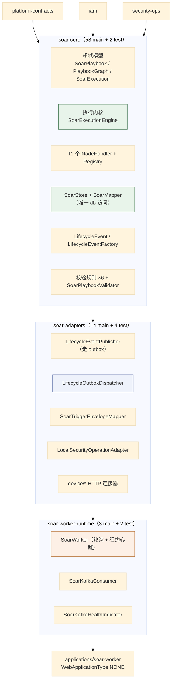
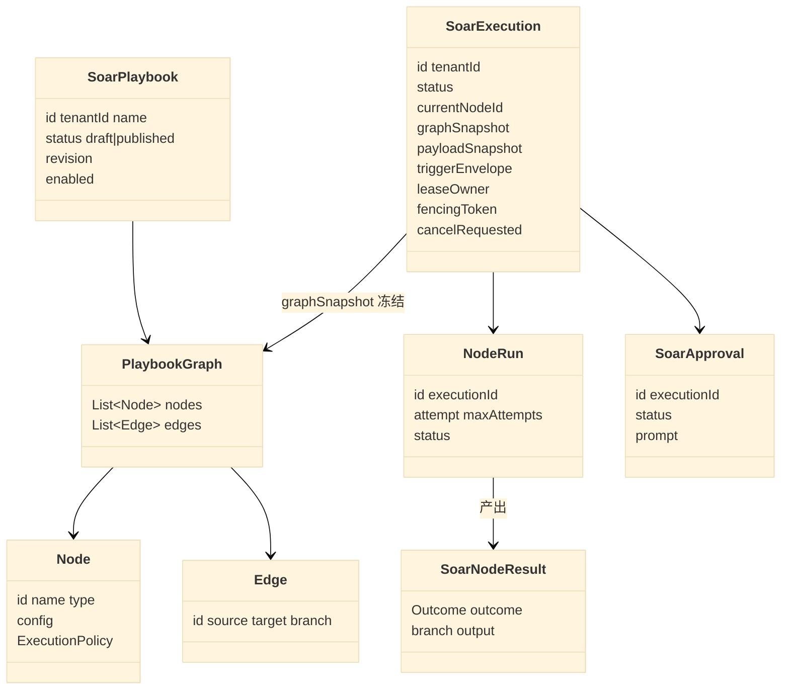
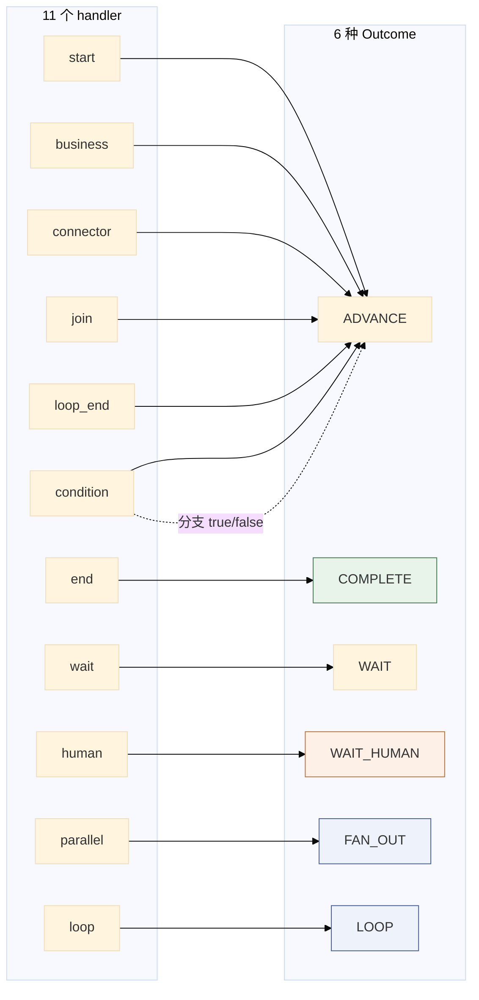
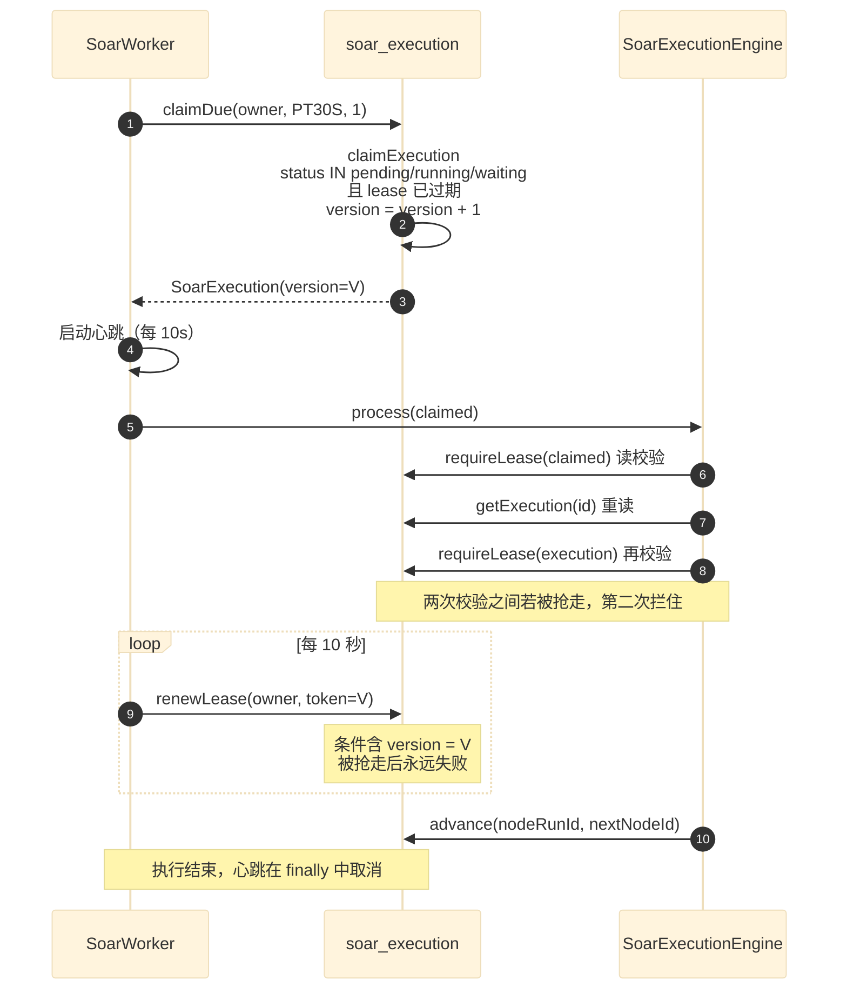
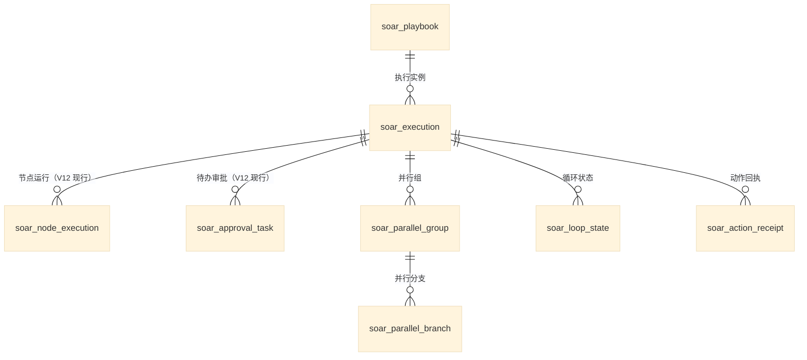
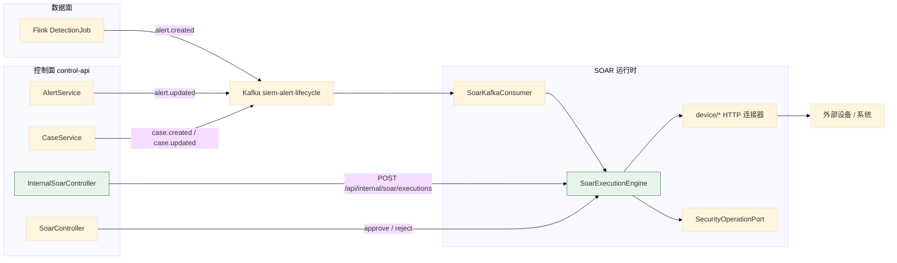

# 04 SOAR 执行子系统

> **文档类型**：子系统深挖（代码级核验，非设计提案）
> **分析对象**：`D:\Project\SIEM` 的 SOAR 运行时——`modules/soar-core`（53 main）+ `modules/soar-adapters`（14 main）+ `modules/soar-worker-runtime`（3 main）+ `applications/soar-worker`
> **取证范围**：SOAR 三个模块 70 个 main 文件 + `SoarMapper.xml` + V8–V15 共 8 个迁移
> **取证方式**：源码直读 + grep 统计；每个关键论断附 `file:line` 锚点
> **结论以当前代码为准**（分支 `add_frame` @ `36b967f`）
> **文档集**：00–06 共 7 篇，见 [`README.md`](README.md)

---

## 1. 三层模块与职责



| 层 | 模块 | 包含 | 不包含 |
| --- | --- | --- | --- |
| 内核 | `soar-core` | 模型、引擎、SPI、handler、Store、Mapper、校验 | Kafka、HTTP、定时任务 |
| 适配 | `soar-adapters` | Kafka 生产者/消费者装配、HTTP 连接器、outbox 派发 | Spring 定时调度宿主 |
| 宿主 | `soar-worker-runtime` | 轮询、租约心跳、消费循环、健康指示器 | 业务逻辑 |

> **测试分布**：`soar-core` 2 个、`soar-adapters` 4 个、`soar-worker-runtime` 2 个测试文件，而 SOAR 的深度集成测试（租约 / fencing / 并行 / 循环）在 `control-api` 的 `SoarRuntimeIntegrationTest` 里（`CLAUDE.md` §持久化约定第 6 条：*「H2 PostgreSQL 模式跑全 Soar 租约/fencing/并行/循环路径」*）——与 03 篇 §1 记的是同一种分工。

---

## 2. 领域模型

### 2.1 关键论断

**论断 1：Playbook 图是「节点 + 边 + 每节点执行策略」的扁平记录。**

`modules/soar-core/.../PlaybookGraph.java:7-35` 是三个 record：`PlaybookGraph(List<Node> nodes, List<Edge> edges)`、`Node(id, name, type, config, ...)`、`Edge(id, source, target, branch)`，执行策略是 `ExecutionPolicy(maxAttempts, initialDelaySeconds, ...)`。

**边用 `(source, target, branch)` 三元组标识分支**——不是「一个节点一个 next」。这是**多分支与并行/条件节点**的建模基础。

**论断 2：图的拓扑复杂度被「节点类型」吸收，不是被「边」吸收。**

`SoarGraphRouter` **只有 13 行**（`SoarGraphRouter.java:8-13`）：按 `source + branch` 过滤边、取第一个 `target`，找不到抛「节点 X 缺少 Y 分支」。**没有环检测、没有拓扑排序、没有可达性分析。**

原因：**环路不靠通用图算法表达，而是靠 `loop` / `loop_end` 节点对显式建模**。所以运行时路由永远是「按分支取下一个节点」——**复杂度被前移到了校验期**（见 §6）与**节点类型**（见 §3）。

**论断 3：执行有一个「图快照」，执行期间不重新读 Playbook。**

`SoarExecutionEngine.java:56-59` 从 `execution.graphSnapshot().nodes()` 里找当前节点，找不到抛「执行快照缺少当前节点」。**执行开始时的图被冻结在 `SoarExecution` 里**——所以执行中途改 Playbook **不影响在途执行**。

**论断 4：`SoarExecution.NodeRun` 是「一次节点尝试」的持久化实体，且有两个 finish 方法。**

从 `SoarMapper.java:232-285` 的方法集可见一次尝试的完整生命周期：`insertNodeRun` / `markNodeRunRetrying` / `updateNodeRunInput` / `finishNodeRun` / `finishNodeRunNoGuard` / `setNodeRunWaiting` / `setNodeRunWaitingHuman` / `cancelNodeRuns` / `failParentNodeRun` / `selectResumableNodeRun`。

**注意 `finishNodeRun` 与 `finishNodeRunNoGuard` 是两个方法**——带 guard 的那个守卫的是 **node-run 状态白名单**（`WHERE id = ? AND status IN ('running','waiting','waiting_human','retrying')`，`SoarMapper.xml:496-502`），**不是租约/版本**；`finishNodeRunNoGuard` 无任何 WHERE 守卫，用于并行 join 与 loop 完成两条清理路径。

**租约/版本校验在别的语句里**（`renewLease` 的 `lease_owner = ? AND version = ?`、`selectLeaseHolders` 的 `FOR UPDATE`）。`SoarStore.finishNode` 的语义是「更新行数 ≠ 1 就抛 `IllegalStateException`」。

### 2.2 模型关系



---

## 3. 执行内核

### 3.1 关键论断

**论断 1：引擎独占全部状态迁移，这是写在两处类注释里的铁律。**

`SoarExecutionEngine.java:15`：*「Durable execution kernel. Node handlers calculate outcomes; this class owns every state transition.」*；`SoarNodeResult.java:9`：*「A handler describes the outcome; only the execution engine is allowed to commit transitions.」*。**两处独立注释指向同一条约束**——说明它是刻意的设计决定，不是偶然的代码组织。

**论断 2：一次 `process` = 一次节点尝试，不是「跑完整条流程」。**

`SoarExecutionEngine.java:41-42`：*「Executes one durable node attempt. A later worker claim advances the next node.」*

**这是 durable execution 的核心手法**：每个节点尝试独立提交，**进程崩溃最多丢失一个节点的进度**，恢复后从 DB 里的 `current_node_id` 继续。**没有「内存里跑完整条流程」的路径。**

**论断 3：租约在引擎内被两次校验，且取消检查排在它之后。**

`SoarExecutionEngine.java:51-55`：`requireLease(claimed)` → `getExecution(claimed.id())` 重读 → `requireLease(execution)` 再校验 → 才判 `cancelRequested()`。

**为什么校验两次**：`claimed` 是 worker 领取时的快照，`execution` 是从 DB 重读的；**两次之间若租约已过期或被别的 worker 抢走，第二次会拦住**。这是 TOCTOU 的正确处理——**重读之后必须重新验证**。

**为什么取消在租约之后**：**过期租约的持有者连「发现取消」的资格都没有**——它直接被 fencing 拦掉。

**论断 4：`SoarLeaseLostException` 在 engine 里被重新抛出，不被吞掉。**

`SoarExecutionEngine.java:43-49` 的外层捕获它并**降级为 warn 日志**（这是正常的 fencing 结果，不是错误）；`:97-99` 的内层显式 `throw lost`，**避免它被 `:99` 的 `catch (RuntimeException e)` 当作「可重试的节点失败」处理**。

> **这条内层重抛是很容易漏掉的写法。** 没有 `:97-99` 的话，丢失租约会被通用 catch 捕获 → 走 `retryable(e)` → 因为 `SoarLeaseLostException` 不在那三个白名单异常里 → **被判为可重试** → 调度重试。那会让「已被 fencing 的 worker」重新写入状态，**直接破坏 fencing 语义**。

**论断 5：节点结果有 6 种 outcome，每种都有对应的强制校验。**

`SoarNodeResult.java:56-63` 定义 `ADVANCE` / `COMPLETE` / `WAIT` / `WAIT_HUMAN` / `FAN_OUT` / `LOOP`；`commit` 的 switch 对**每一种**都做前置校验（`SoarExecutionEngine.java:119-164`）：

| Outcome | 强制校验 | 行 | 不满足时 |
| --- | --- | --- | --- |
| `ADVANCE` | `result.branch()` 必须在 `handler.outgoingBranches()` 里 | `:121-123` | 抛「返回了非法分支」 |
| `COMPLETE` | `handler.outgoingBranches()` **必须为空** | `:128-130` | 抛「只有终止节点可以结束执行」 |
| `WAIT` | `resumeAt` 非空**且在未来** | `:135-137` | 抛「必须返回未来的恢复时间」 |
| `WAIT_HUMAN` | `approvalPrompt` 非空白 | `:141-143` | 抛「人工节点必须返回审批提示语」 |
| `FAN_OUT` | 分支数 ≥2 **且** `joinNode` 非空 | `:147-149` | 抛「必须返回至少两个分支和 join 节点」 |
| `LOOP` | body 起止非空、items 非空、`maxIterations >= items.size()` | `:157-160` | 抛「返回了非法的持久化循环状态」 |

**这是一组「handler 与引擎的契约断言」**——handler 是扩展点（可能有第三方实现），所以引擎**不信任 handler 的返回值**，每条都验。**`COMPLETE` 那条最能说明问题**：它靠 `outgoingBranches().isEmpty()` 判断「这是不是终止节点」——**所以 `end` handler 返回空集**（`SoarEndNodeHandler.java:27-28`）。

**论断 6：`LOOP` 的校验里有一条容易忽略的算术约束。**

`SoarExecutionEngine.java:157-159` 要求 `loopMaxIterations() >= loopItems().size()`——即**迭代上限不能小于待处理项数**。**这条防的是「循环声明了 N 项但只允许跑 M<N 次」**，那会导致部分项被静默跳过。

**论断 7：重试白名单是「三个异常类型不可重试」，其余都可重试。**

`SoarExecutionEngine.java:186-190` 的 `retryable` 排除 `IllegalArgumentException`、`ConflictException`、`NotFoundException`——**语义是「参数错、状态冲突、找不到」不该重试**（重试也不会变好），**其余（网络超时、下游 5xx 等）可重试**。这是**默认可重试**的乐观策略，与「默认不可重试」的保守策略相反。

**论断 8：重试有独立的状态与调度时间，用尽则终态失败。**

`SoarExecutionEngine.java:100-109`：可重试且未达上限时 `store.scheduleRetry(execution, nodeRun.id(), message, nextAttempt)`（算出 `delayAfter(attempt)` 后的时间）；否则 `terminalFailure(...)`。**`scheduleRetry` 写入 `next_attempt_at`**——所以重试也是**持久的、跨进程的**，worker 下次 `claimDue` 时按时间领取。

上限耗尽走 `SoarExecutionEngine.java:85-89`，消息是专门的「节点执行次数已耗尽: N」，且 **`cause` 传 `null`**——**「次数耗尽」不是某个具体异常导致的，而是累计结果**，所以日志走「无异常对象」分支。

**论断 9：节点配置在执行前做模板解析，且解析两次。**

`SoarExecutionEngine.java:80-93`：先 `templates.resolveMap(node.config(), context.templateVariables())` 算出要持久化的 input 并 `startNode`；**`startNode` 分配 `nodeRun.id` 与递增 `sequence` 之后**，重建 context、**再解析一次**、`updateNodeInput` 更新持久化 input，然后才 `handler.execute(context, resolvedConfig)`。

**为什么两次**：`context.templateVariables()` 依赖 `nodeRun.id` 与 `sequence`，而这两个值在第一次解析时还不存在。

**论断 10：持久化的节点输入经两步脱敏。**

`context.persistedInput(handler.auditSafeConfig(resolvedConfig))`——**`auditSafeConfig` 是 SPI 上的方法**，每个 handler 自己决定哪些配置可以进审计，secret 类字段应在这一步被剔除。

**论断 11：`FAN_OUT` 与 `LOOP` 在进入时就走专门分支，不经过 handler。**

`SoarExecutionEngine.java:61-72`：若 `store.parallelBranch(execution.id(), node.id())` 非空，就 `arriveParallel(...)` 并 `return`；若 `store.loopState(...)` 非空，就 `advanceLoop(...)` 并 `return`。

**当节点处于「并行分支」或「循环体」中时，它不执行自己的 handler**——只标记「到达」并推进到下一个节点。**handler 只在首次进入 `parallel` / `loop` 节点时运行一次**，负责算出分支列表与迭代项。

**这解释了 `soar_parallel_branch` 与 `soar_loop_state` 两张表存在的必要性**：它们是「节点已经被 fan-out / 进入循环」的标记，让引擎在重新领取同一节点时知道「我该走 arrive/advance 而不是 execute」。

## 4. 十一个节点处理器

### 4.1 关键论断

**论断 1：实测 11 个 `SoarNodeHandler` 实现，不是 12 个。**

`grep -rl "implements SoarNodeHandler" --include=*.java modules/ | wc -l` → `11`。

| # | `type()` | 实现类 | `outgoingBranches()` |
| --- | --- | --- | --- |
| 1 | `start` | `SoarStartNodeHandler.java:11-12` | `next`（默认） |
| 2 | `end` | `SoarEndNodeHandler.java:12-13` | **空集**（`SoarEndNodeHandler.java:27-28`） |
| 3 | `condition` | `SoarConditionNodeHandler.java:23-24` | **`{true, false}`**（`:59-60`） |
| 4 | `human` | `SoarHumanNodeHandler.java:12-13` | **`{approve, reject}`**（`:29-30`） |
| 5 | `business` | `SoarBusinessNodeHandler.java:20-21` | `next`（默认） |
| 6 | `wait` | `SoarWaitNodeHandler.java:16-17` | `next`（默认） |
| 7 | `connector` | `execution/handler/SoarConnectorNodeHandler.java:30-31` | `next`（默认） |
| 8 | `join` | `execution/handler/SoarJoinNodeHandler.java:15-16` | `next`（默认） |
| 9 | `loop` | `execution/handler/SoarLoopNodeHandler.java:18-19` | `next`（默认） |
| 10 | `loop_end` | `execution/handler/SoarLoopEndNodeHandler.java:15-16` | `next`（默认） |
| 11 | `parallel` | `execution/handler/SoarParallelNodeHandler.java:20-21` | `next`（默认） |

**论断 2：默认分支是 `next`，只有三个 handler 覆写它。**

`SoarNodeHandler.java:15-17` 的默认实现返回 `Set.of("next")`；**只有 `end`（空集）、`condition`（true/false）、`human`（approve/reject）覆写**。**这是一个很好的默认值选择**：绝大多数节点就是单出口。

**论断 3：注册表拒绝空 type 与重复 type，且在构造期就抛。**

`SoarNodeHandlerRegistry.java:15-27`：type 为 `null` 或空白 → 「SOAR NodeHandler type 不能为空」；`registered.put(type, handler)` 返回非 null（即重复）→ 「SOAR NodeHandler 重复注册: 」。**构造期抛异常 → 应用启动失败**，这是 fail-fast：**重复 type 在启动时暴露，而不是等某个执行流走到那个节点才暴露**。

**论断 4：注册表靠 Spring 注入全部实现，没有手工注册清单。**

构造器签名就是 `SoarNodeHandlerRegistry(List<SoarNodeHandler> candidates)`（`:15`）——Spring 把所有 `SoarNodeHandler` bean 收集进 `List`。所以**新增 handler = 新增一个 `@Component`，不改任何注册代码**。这与数据面 `RuleRegistry` 的硬编码列表（02 篇 §4 论断 1）形成对比。

**论断 5：未知节点类型在引擎里抛 `IllegalArgumentException`，因而不重试。**

`SoarNodeHandlerRegistry.java:29-33` 的 `require` 找不到就抛 `IllegalArgumentException("不支持的节点类型: ")`。**该异常在 `retryable()` 的白名单里**（`SoarExecutionEngine.java:187`）——所以未知节点类型**直接终态失败，不重试**。这是正确判断：重试不会让一个不存在的 handler 出现。

### 4.2 六种 Outcome 与 handler 的映射



---

## 5. 租约与 fencing：SQL 层面的实现

### 5.1 关键论断

**论断 1：领取（claim）与续租（renew）是两条不同的 SQL，语义不对称。**

```xml
<!-- SoarMapper.xml:275-283 -->
<update id="claimExecution">
  UPDATE soar_execution SET lease_owner = #{owner,jdbcType=VARCHAR},
    lease_expires_at = #{leaseUntil,jdbcType=TIMESTAMP},
    status = 'running', started_at = COALESCE(started_at, CURRENT_TIMESTAMP),
    updated_at = CURRENT_TIMESTAMP, version = version + 1
  WHERE id = #{id,jdbcType=VARCHAR}
    AND status IN ('pending','running','waiting')
    AND (lease_expires_at IS NULL OR lease_expires_at &lt; CURRENT_TIMESTAMP)
</update>
```

```xml
<!-- SoarMapper.xml:285-291 -->
<update id="renewLease">
  UPDATE soar_execution SET lease_expires_at = #{leaseUntil,jdbcType=TIMESTAMP},
    updated_at = CURRENT_TIMESTAMP
  WHERE id = #{id,jdbcType=VARCHAR} AND status = 'running' AND cancel_requested = FALSE
    AND lease_owner = #{owner,jdbcType=VARCHAR} AND version = #{fencingToken,jdbcType=BIGINT}
    AND lease_expires_at &gt;= CURRENT_TIMESTAMP
</update>
```

**四处不对称，每一处都有意义**：

| 维度 | `claimExecution` | `renewLease` |
| --- | --- | --- |
| **owner 条件** | 无（谁都能抢空闲的） | **必须等于自己** |
| **version 条件** | 无（并递增 version） | **必须等于自己的 fencingToken** |
| **过期条件** | **必须已过期或为空** | **必须未过期** |
| **status 条件** | `IN ('pending','running','waiting')` | **仅 `'running'`** |

**`claimExecution` 递增 `version`，`renewLease` 校验 `version`——`version` 列就是 fencing token。** 新领取者让 `version+1`，于是**旧持有者的 `renewLease` 永远匹配不上**。

**论断 2：`renewLease` 额外要求 `cancel_requested = FALSE`。**

**取消请求会让续租失败** → 心跳日志报「lease renewal rejected」→ 但**执行本身不会立即停**。真正的停止来自引擎里的取消检查（`SoarExecutionEngine.java:55`）。

**论断 3：`selectLeaseHolders` 是「校验租约」的读版本，且可选加 `FOR UPDATE`。**

`SoarMapper.xml:293-297`：条件与 `renewLease` 几乎相同（status=running、cancel_requested=FALSE、owner 匹配、version 匹配、未过期），末尾是 `<if test="lock">FOR UPDATE</if>`。**`store.requireLease(execution)` 就是调它**（`SoarExecutionEngine.java:52,54`）——`lock` 让调用方决定是否加行锁，在已处于事务、需要串行化时用得上。**校验与续租用同一套判据。**

**论断 4：worker 的 `owner` 是「JVM 名 + 随机 UUID」。**

`SoarWorker.java:31`：`ManagementFactory.getRuntimeMXBean().getName() + ":" + UUID.randomUUID()`。`getName()` 通常是 `pid@hostname`，所以 owner 形如 `12345@host:8f3a...`——**既能定位到进程，又保证同一进程重启后不复用身份**。

**对照**：`CaseMirrorDispatcher` 与 `LifecycleOutboxDispatcher` 的 owner 只有 `UUID.randomUUID()`（01 篇 §5 论断 4），**没有 JVM 名**。三种 owner 构造方式不同，但都保证唯一性。

**论断 5：心跳间隔是租约的 1/3，且封顶 10 秒。**

`SoarWorker.java:60`：`Math.max(1L, Math.min(10_000L, lease.toMillis() / 3L))`。**默认租约 `PT30S` → 心跳 10 秒**（正好是封顶值）。**1/3 是标准的租约心跳比**：保证租约过期前至少有 2 次续租机会。

**论断 6：续租失败只记一次警告，不中止执行。**

`SoarWorker.java:61-70` 的心跳任务里，`!store.renewLease(...)` 时用 `reportedLost.compareAndSet(false, true)` 保证**只报一次**（否则每 10 秒刷一条）；异常也只 warn。**心跳的职责是「尽力续租」，不是「监控」**——真正的中止由引擎里的 `requireLease` 完成。

**论断 7：心跳在 `finally` 里取消，且线程池是单线程守护池。**

`SoarWorker.java:71-75` 在 `try { engine.process(execution) } finally { heartbeat.cancel(false) }`——**`cancel(false)` 不打断正在跑的心跳**，避免在线程池任务里抛 `InterruptedException`。心跳池是 `Executors.newSingleThreadScheduledExecutor` 加守护线程（`:42-46`），因为 `poll()` 是 `@Scheduled` 串行的、一次只处理一个执行，所以一个线程足够；`@PreDestroy` 里 `shutdownNow()`（`:78-81`）。

### 5.2 fencing 时序



---

## 6. 校验：六条规则，按序执行

### 6.1 关键论断

**论断 1：六条校验规则有显式 `order()`，编号间隔为 10。**

| # | `order()` | 规则 | 校验什么 |
| --- | --- | --- | --- |
| 1 | **10** | `NodeTypeValidationRule` | 节点类型存在 |
| 2 | **20** | `EdgePortValidationRule` | 边的分支端口合法 |
| 3 | **30** | `GraphTopologyValidationRule` | 图拓扑（连通、可达） |
| 4 | **40** | `VariableReferenceValidationRule` | 变量引用可解析 |
| 5 | **50** | `DeviceActionValidationRule` | 设备动作在白名单（依赖 `SoarConnectorRegistry`） |
| 6 | **60** | `ConditionValidationRule` | 条件表达式合法 |

**编号间隔 10 是刻意的**——留出插入新规则的余量。**顺序是「结构 → 引用 → 语义」**。

**为什么这个顺序重要**：**先验结构再验语义**——如果节点类型都不存在，去检查它的变量引用没有意义，只会产生误导性错误。**这避免了「一个根本性的错误产生 20 条下游噪音错误」。**

**论断 2：`DeviceActionValidationRule` 需要外部依赖，其他五条不需要。**

`DeviceActionValidationRule.java:12` 的构造器注入 `SoarConnectorRegistry`——**证明校验规则也可以是有依赖的 bean**，不是纯函数。

**论断 3：规则实现 `SoarPlaybookValidationRule`，`order()` 有默认值但六条都显式写了。**

`SoarPlaybookValidationRule.java:4-6` 给 `order()` 提供了默认实现，意味着「不关心顺序的规则可以不写」——但实测六条规则**都显式写了**，说明当前所有规则都有顺序敏感性。

### 6.2 校验上下文

`SoarValidationContext` 是规则的入参载体（`playbook/validation/SoarValidationContext.java`）——**六条规则共享同一个上下文对象**，每条往里加自己的发现。这是「校验器链 + 共享上下文」的标准形态。

---

## 7. 人工审批

### 7.1 关键论断

**论断 1：人工节点不阻塞 worker，而是「落库后释放」。**

`SoarExecutionEngine.java:140-145` 的 `WAIT_HUMAN` 分支在 `store.createApproval(execution, node, nodeRun, result.approvalPrompt())` 之后就返回了——worker 立刻去处理下一个执行。**审批是异步的，不占用 worker 时间**，这是 SOAR 能处理大量待审批实例的前提。

**论断 2：审批表是 `soar_approval`（V11）+ `soar_approval_task`（V12）。**

`SoarMapper.xml` 对 `soar_approval_task` 有 6 处引用。**两张表的分工**：`soar_approval` 是**审批的业务实体**（对应一次人工节点），`soar_approval_task` 是**待办任务**（让审批出现在某人的待办列表里）。**这是「业务实体 + 待办索引」的拆分**——同一次审批，一张表存事实，一张表供查询。

**论断 3：审批查询与决策都带租户参数。**

`SoarMapper.java` 的 `selectApproval(tenantId, id)`（`:297`）与 `decideApproval(...)`（`:311`）都接收 `tenantId`——**审批不能跨租户看到或决定**。

**论断 4：审批通过后的恢复走 `resumeWaitingHuman`，取消走 `cancelPendingApprovals`。**

`SoarMapper.java:154` 的 `resumeWaitingHuman(@Param("nextNodeId") String nextNodeId, @Param("id") String id)` **显式接收 `nextNodeId`**——所以**审批 `approve` 分支的目标在恢复时才确定**，即恢复时重新走一次 `router.next(...)`。取消走 `:318` 的 `cancelPendingApprovals(executionId)`。

**论断 5：`human` 节点的两个分支是 `approve` / `reject`。**

`SoarHumanNodeHandler.java:29-30` 返回 `Set.of("approve", "reject")`。**所以「拒绝」也是一条正常分支，不是失败**——Playbook 可以为拒绝设计后续动作（通知、记录）。**这与「Agent 建议、人工授权」的分工一致**：拒绝是预期内的结果。

## 8. 生命周期事件

### 8.1 关键论断

**论断 1：控制面侧共有 4 种事件类型，且按类型决定业务时间字段。**

`modules/soar-core/.../LifecycleEventFactory.java:54-59` 用 switch 取时间字段：`alert.created` → `@timestamp`；`alert.updated` → `alert.status_updated_at`；`case.created` → `case.created_at`；`case.updated` → `case.updated_at`；其它抛「不支持的生命周期事件」。

**四种类型成对**（alert 的 created/updated、case 的 created/updated），**取时间的字段按语义选**——`created` 用创建时间，`updated` 用**状态变更时间**。

**论断 2：`producer` 是 `"hsiem-control"`——与 Flink 的 `"hsiem-flink"` 区分。**

`LifecycleEventFactory.java:32-33`（alert）与 `:46-47`（case）都以 `"hsiem-control"` 构造事件。**两个生产者标识让消费方能分辨来源**：Flink 只发 `alert.created`（数据面检测到），控制面发全部四种（人改状态、案件变更）。

**注意每处的最后一个参数**：alert 事件带 `alert`、`case` 为 `null`；case 事件反之。**所以一条生命周期事件只描述一种对象。**

**论断 3：`id` 取值有回退链，且 alert 与 case 的优先级正好相反。**

`LifecycleEventFactory.java:21` 是 `put(alert, "id", first(source, "_id", "alert.id"))`；`:39` 是 `put(caseObject, "id", first(source, "case.id", "_id"))`。

**告警优先用 `_id`（ES 文档 id），案件优先用 `case.id`**——因为告警的事实源在 ES（文档 id 是权威身份），案件的事实源在 PG（`case.id` 是权威身份）。**这与 01 篇 §4 论断 4 和 §5 论断 1 的两条边界完全一致。**

**论断 4：事件进入 outbox，由独立 dispatcher 投递——与案件镜像是同一模式。**

`modules/soar-adapters/.../LifecycleEventPublisher.java:69-80` 调 `store.enqueueLifecycle(messageId, eventType, effectiveTenantId, objectType, objectId, occurredAt, topicFor(objectType), objectId, body)`。**`enqueueLifecycle` 是 `LifecycleOutboxStore` 的方法**——与 `CaseStore.enqueueCaseMirror` 是**同构的两个 outbox**，共享 `platform-migrations/V19__lifecycle_outbox.sql` 与 V7 的 outbox 租约模式。

**论断 5：`topicFor(objectType)` 按对象类型选择 topic。**

`modules/soar-adapters/.../SoarKafkaProperties.java:84` 的 `topicFor(String objectType)`——所以 alert 事件与 case 事件可以进不同 topic，消费方按需订阅。

**论断 6：`publish` 在 `enabled=false` 时静默返回。**

`LifecycleEventPublisher.java:51-52`：`if (!enabled) return;`，`enabled` 来自 `app.soar.runtime-enabled`（`:33`，默认 `true`）。**静默**——不报错、不计数。这与 01 篇 §6 论断 8 是同一条观察。

## 9. 持久化：单数运行时与冻结的复数表

### 9.1 关键论断

**论断 1：`SoarMapper.xml` 只引用 8 张表，全部是单数命名。**

| 表 | 创建迁移 |
| --- | --- |
| `soar_execution` | V11 |
| `soar_node_execution` | V12 |
| `soar_parallel_group` | V13 |
| `soar_loop_state` | V14 |
| `soar_playbook` | V11 |
| `soar_parallel_branch` | V13 |
| `soar_approval_task` | V12 |
| `soar_action_receipt` | V12 |

**注意 `soar_node_run`（V11 建）不在此列**——`SoarMapper.xml` 里对应的方法（`insertNodeRun` 等）操作的是 **`soar_node_execution`**（V12）。

**论断 2：V8 建的复数表 `soar_executions` / `soar_step_executions` 仍存在于 schema，但零代码引用。**

`V8__soar_execution.sql:2,28` 建了这两张表；`V10__soar_platform_governance.sql:25-41` 还在往上加列、加约束、加索引（说明当时是活跃表）。实测：

```bash
$ grep -rn "soar_executions\|soar_step_executions" --include=*.java --include=*.xml --include=*.vue --include=*.js . | grep -v /target/
# 命中的全部是 V8 / V9 / V10 三个迁移文件本身
```

**八个 SOAR 迁移里 `DROP TABLE` 计数全部为 0。**

> **这是本项目最值得记录的一处「反直觉真实形态」**：
>
> **V8 建的 `soar_executions` / `soar_step_executions` 从未被删除，也从未被任何 Java 或前端代码引用。** V11 另起炉灶建了单数版 `soar_execution`，此后全部代码只走单数表。
>
> **结果是：数据库里同时存在两套 SOAR 运行时表，一套活的、一套冻结的。** 这不是 bug，是**「只加不改」的迁移纪律**的副作用——Flyway 迁移一旦发布就不修改，而删除旧表被推迟了（可能为了保留历史执行数据）。
>
> **运维含义**：接手者看到 `soar_executions` 会以为是当前表，实际它是死表。**本文档显式标注这一点。**

**论断 3：迁移编号与能力演进的分组（SOAR 区间 V8–V15）。**

| 迁移 | 建的表 | 主题 |
| --- | --- | --- |
| V8 | `soar_executions`, `soar_step_executions` | **旧运行时（已冻结）** |
| V9 | `soar_execution_events` | 编排事件 |
| V10 | `tenants`, `tenant_memberships`, `soar_playbook_revisions`, `soar_connector_runtime`, `soar_connector_invocations` | 多租户 + 治理 |
| **V11** | **`soar_playbook`, `soar_execution`, `soar_node_run`, `soar_approval`** | **单数运行时起点** |
| V12 | `soar_node_execution`, `soar_approval_task`, `soar_action_receipt` | handler 运行时 |
| V13 | `soar_parallel_group`, `soar_parallel_branch` | 并行 |
| V14 | `soar_loop_state` | 循环 |
| V15 | （无建表） | 触发类型字段 |

**V11 是分水岭**——从这一版起换成单数命名，并引入 `soar_node_run` / `soar_approval`。整体迁移编号见 03 篇 §7。

**论断 4：`soar_playbook` 有 `soar_playbook_revisions`（V10）与之配套。**

**修订历史是独立表**——Playbook 改版留痕。`SoarStore.updatePlaybook` 带 `expectedRevision` 参数（`SoarStore.java:89-100`），`publishPlaybook` 也带（`:115-119`）——**乐观锁**。

**论断 5：`SoarStore` 是具体类，不套端口。**

`CLAUDE.md` §持久化约定第 3 条明确：`SoarStore`、`SoarConnectorActionInvocation`、`SoarBusinessActionInvocation` 作为具体 `@Repository` 直接注入 `SoarMapper`（soar-core 主代码与 `SoarWorkerTest` 以具体类消费）。**所以 SOAR 域的持久化分层与其他域不同**——没有 `*RepositoryPort` 接口层。**这是刻意的例外，不是遗漏。**

**论断 6：`SoarStore` 里的冲突判定是统一的辅助方法。**

`SoarStore.java:110-111,118-119` 在更新影响 0 行时调 `distinguishMissingOrConflict(tenantId, id)`。**「更新影响 0 行」有两种可能：对象不存在，或版本冲突**——这是**乐观锁正确实现的关键**：不能把两种失败混报成同一种。

**论断 7：`SoarStore` 的域规则检查在 store 层，不在 SQL 层。**

`SoarStore.java:125-127`：`enabled && "draft".equals(current.status())` → 抛「草稿必须先发布，不能直接启用」；`:136-139`：`countActiveExecutions > 0` → 抛「Playbook 存在活动执行，需先取消执行实例」。

**两条域规则需要「先读后写」，所以放在 store 而不是 SQL 的 `WHERE` 子句里。** 注意 `deletePlaybook` 的先 `countActiveExecutions` 再删**在并发下有 TOCTOU 窗口**（没有外层锁，两次调用之间可以新建执行）——这是一处已知缺口，不是不变式。

### 9.2 表关系



**本图只画 `SoarMapper.xml` 真正读写的那 8 张表**（见 §9.1 论断 1）。零代码引用的冻结表均不在图中——它们的唯一命中是 V9/V10/V11 建表语句与测试断言；被剔除的共 6 张（`soar_executions` / `soar_step_executions` / `soar_execution_events` / `soar_playbook_revisions` / `soar_connector_runtime` / `soar_connector_invocations`），外加 V11 遗留的 `soar_node_run` 与 `soar_approval`。

---

## 10. 关键不变式（代码强制）

| # | 不变式 | 强制点 | 违反后果 |
| --- | --- | --- | --- |
| 1 | **只有引擎能迁移执行状态** | `SoarExecutionEngine.java:15`；`SoarNodeResult.java:9` 双注释 | handler 直接改状态，状态机失控 |
| 2 | **一次 `process` 只推进一个节点** | `SoarExecutionEngine.java:41-42` 注释 | 崩溃丢失多节点进度 |
| 3 | **租约在重读后必须重新校验** | `SoarExecutionEngine.java:52,54` 两次 `requireLease` | TOCTOU：过期租约持有者写入 |
| 4 | **`SoarLeaseLostException` 不被当作可重试失败** | `SoarExecutionEngine.java:97-99` 内层重抛 | fencing 语义被重试破坏 |
| 5 | **`version` 列即 fencing token** | `SoarMapper.xml:279` claim 递增；`:289` renew 校验 | 旧持有者续租成功 |
| 6 | **续租要求 owner + version 双重匹配** | `SoarMapper.xml:289` | 抢来的执行仍被原持有者续租 |
| 7 | **`COMPLETE` 只能由无出边的节点发出** | `SoarExecutionEngine.java:128-130` | 中间节点提前终止流程 |
| 8 | **分支必须在 handler 声明的闭集内** | `SoarExecutionEngine.java:121-123` | 走不存在的边 |
| 9 | **`WAIT` 的 `resumeAt` 必须在未来** | `SoarExecutionEngine.java:135-137` | 无限立即重试 |
| 10 | **循环迭代上限 ≥ 待处理项数** | `SoarExecutionEngine.java:157-159` | 静默跳过循环项 |
| 11 | **NodeHandler type 不可为空、不可重复** | `SoarNodeHandlerRegistry.java:18-24` | 启动失败（fail-fast） |
| 12 | **未知节点类型不重试** | `SoarNodeHandlerRegistry.java:31` 抛 `IllegalArgumentException` + `SoarExecutionEngine.java:187` 白名单 | 无意义重试 |
| 13 | **人工节点不阻塞 worker** | `SoarExecutionEngine.java:144` `createApproval` 后即返回 | worker 被审批等待占满 |
| 14 | **审批查询与决策都带租户** | `SoarMapper.java:297,311` | 跨租户审批 |
| 15 | **Playbook 修订用乐观锁** | `SoarStore.java:110,118` `distinguishMissingOrConflict` | 并发覆盖 |
| 16 | **草稿不能直接启用** | `SoarStore.java:125-127` | 未发布流程被执行 |
| 17 | **有活动执行不能删 Playbook** | `SoarStore.java:136-139` | 在途执行失去定义 |
| 18 | **执行图在执行开始时冻结** | `SoarExecution.graphSnapshot()`（`SoarExecutionEngine.java:56`） | 改流程影响在途执行 |

---

## 11. 与其他子系统的边界



**五条边界**：

| 边界 | 方向 | 契约 | 锚点 |
| --- | --- | --- | --- |
| 从 Kafka | 入站 | 4 种生命周期事件（`producer` 区分来源） | `LifecycleEventFactory.java:54-59` |
| 从 control-api | 入站 | `POST /api/internal/soar/executions`（服务令牌） | `SecurityConfig.java:46-74` |
| 从控制台 | 入站 | `POST /api/soar/executions`、`/approvals/{id}/approve\|reject` | `SoarController` |
| 到外部设备 | 出站 | `device/*` HTTP 连接器 + `SecurityOperationPort` | `soar-adapters/.../device/` |
| 到 PostgreSQL | 出站 | `SoarMapper` + `mybatis/soar/*.xml` | `SoarMyBatisConfiguration` |

**「Agent 建议、人工授权」这条不变式在本篇的落点**：`human` 节点的 `WAIT_HUMAN` outcome 与 `soar_approval` 表——**执行流程**在需要授权时**必须停下来等一个人**，且该等待是**持久化的**（进程重启也还在等）。

---
