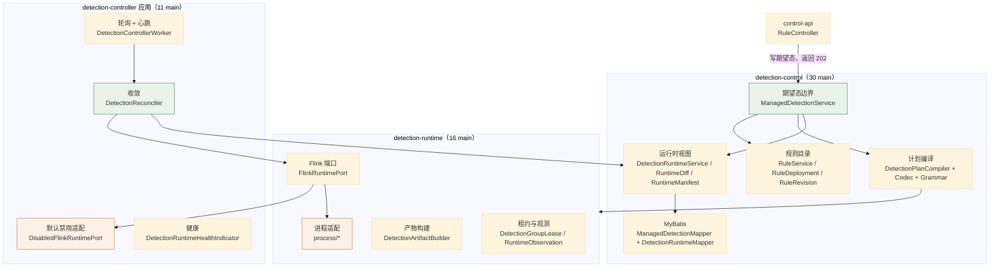
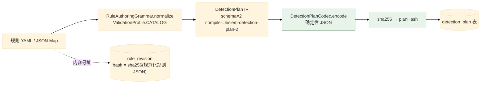
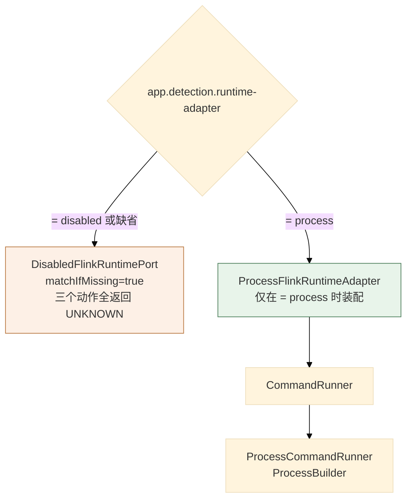
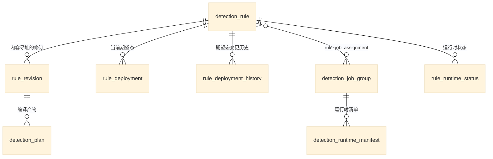
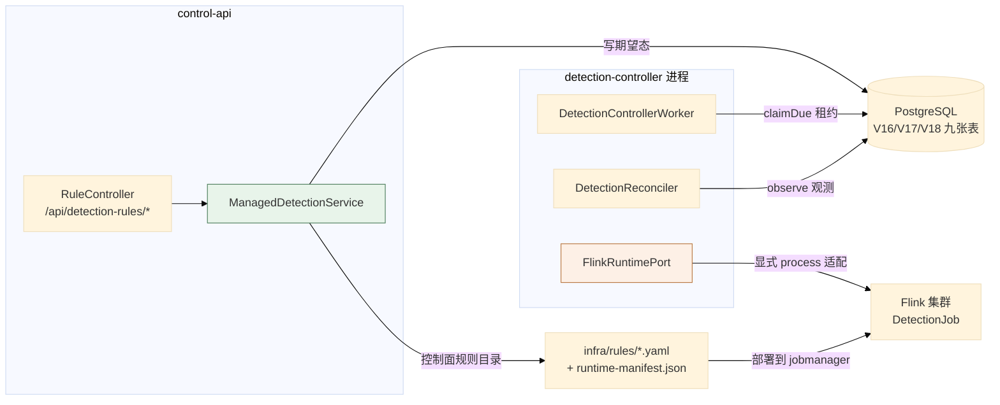

# 05 检测控制子系统

> **文档类型**：子系统深挖（代码级核验，非设计提案）
> **分析对象**：`D:\Project\SIEM` 的检测控制运行时——`modules/detection-control`（30 main）+ `modules/detection-runtime`（16 main）+ `applications/detection-controller`（11 main）
> **取证范围**：三个模块 57 个 main 文件 + `DetectionControllerMapper.xml` + V16/V17/V18 共 3 个迁移
> **取证方式**：源码直读 + grep 统计；每个关键论断附 `file:line` 锚点
> **结论以当前代码为准**（分支 `add_frame` @ `36b967f`）
> **文档集**：00–06 共 7 篇，见 [`README.md`](README.md)

> **读法**：检测控制在权威文档侧只有 [`../../design/managed-detection-runtime.md`](../../design/managed-detection-runtime.md)（71 行），本篇是它之外的代码级覆盖——**确认「现在到底怎样」时回到代码**。

---

## 1. 模块与职责



| 模块 | main | test | 职责 |
| --- | --- | --- | --- |
| `detection-control` | 30 | 0 | 规则目录、期望态、计划编译、运行时视图 |
| `detection-runtime` | 16 | 5 | 物理产物构建、Flink 端口与其进程实现 |
| `applications/detection-controller` | 11 | 5 | 轮询、收敛、健康 |

---

## 2. 期望态边界：`control-api` 不部署

### 2.1 关键论断

**论断 1：`deployAll` 的注释直接写明「物理 Flink controller 刻意不参与」。**

`modules/detection-control/.../rules/ManagedDetectionService.java:70-73` 方法注释：*「Persists a single YAML snapshot as desired state in one transaction, then reconciles all touched rules once. The physical Flink controller is intentionally not involved.」*

**「intentionally not involved」是刻意的措辞**——不是「暂时还没接」，是「本就不该接」。

**论断 2：`deployAll` 在一个事务里持久化整份 YAML 快照。**

`ManagedDetectionService.java:74-107` 的 `@Transactional deployAll(...)` 逐条 `setDesiredStateForRule(...)`，最后调 `runtime.reconcileDesiredStates(tenantId, ruleKeys)`。三个要点：

| 点 | 说明 |
| --- | --- |
| **整份快照一个事务** | 部分成功不可能——要么全部规则落库，要么全不落 |
| **`pendingSummary(...)`** | 返回的是 **PENDING** 状态，不是「已部署」 |
| **`reconcileDesiredStates` 只做视图收敛** | 不是物理部署（见论断 3） |

**论断 3：`reconcileDesiredStates` 是「让运行时视图与期望态一致」，不是「启动 Flink 作业」。**

名字容易误解：它的作用域是 `DetectionRuntimeService`（`detection-control` 内的运行时**视图**服务），而**物理动作在 `detection-runtime` 的 `FlinkRuntimePort`**。两者是不同层的两个概念，**共享了「reconcile」这个词**。

**论断 4：期望态的相等判定是四部分的，不是只比状态。**

`ManagedDetectionService.java:220-241` 的 `sameDesiredState` 依次比 `desiredState`、`targetCluster`、`revisionId`、`planHash`。其中一段注释解释了一个反直觉的选择：

> *「Revision provenance is part of logical desired state even when the compiled physical plan hash is unchanged. An explicit deploy of a newer equivalent revision must be recorded, while the runtime layer can keep the existing physical generation.」*

**场景**：同一份规则 YAML 被再次 `deploy`，编译产物完全相同（`planHash` 一样），但**这仍是一次显式的部署意图**，必须被记录。**运行时层可以复用已有的物理 generation**（不做无谓重启），但**期望态账本上必须有这一笔**。

**这是「意图」与「物理产物」分离的一个具体体现**：`revisionId` 记录**人做了什么**，`planHash` 记录**机器算出什么**。二者不等价。

**论断 5：`RuleRevision` 的身份是「规则定义内容的 SHA-256」，命中即复用。**

`ManagedDetectionService.java:208-214` 的 `findCurrentRevision` 与 `:255-260` 的 `ensureRevision` 都走 `sha256(json(rule))` 再 `repository.findRevision(ruleKey, hash)`；`ensureRevision` 里 `existing != null` 直接返回。**所以「重复部署同一份 YAML」不会产生新修订行。**

**论断 6：JSON 序列化强制按 key 排序——这是哈希可复现的前提。**

`ManagedDetectionService.java:27-28`：`new ObjectMapper().configure(SerializationFeature.ORDER_MAP_ENTRIES_BY_KEYS, true)`。

**没有这一行，同一份 Map 在不同 JVM 上的迭代顺序可能不同 → `json(rule)` 不同 → `sha256` 不同 → 每次部署都产生「新修订」。** 这是内容寻址系统的必要条件。

> **对照**：`RuntimeManifestVerifier` 用**原始文件字节**做哈希（02 篇 §7 论断 6），因为那里要校验**文件没被改动**；这里用**规范化 JSON**做哈希，因为要判定的是**语义相同**。**两处哈希的目标不同，手法也不同**——这是刻意的。

**论断 7：`deploy` 与 `stop` 收敛到同一个私有方法，「启停」只是同一个枚举的两个取值。**

`ManagedDetectionService.java:64-68` 的 `deploy` 调 `setDesiredState(..., DesiredState.RUNNING, ...)`；`:110-114` 的 `stop` 调 `setDesiredState(..., DesiredState.STOPPED, ...)`。这与 02 篇 §3 论断 3 的规则 `enabled` 开关形成对照：

| 层 | 启停机制 | 生效方式 |
| --- | --- | --- |
| **Flink 侧**（02 篇） | 规则 YAML 的 `enabled` 字段 | 改 YAML → deploy → **重启 job** |
| **控制面侧**（本篇） | `DesiredState.RUNNING / STOPPED` | 调 API → 写期望态 → controller 收敛 |

**两层各自的「开关」语义不同**：Flink 的 `enabled` 决定**这条规则是否被编译进作业**；控制面的 `DesiredState` 决定**这个规则组是否应该处于运行状态**。

**论断 8：`sourceCommit` 是可配置的来源标记，默认 `working-tree`。**

`ManagedDetectionService.java:37`：`@Value("${app.detection.source-commit:working-tree}")`。**默认值表明「未指定 commit」是正常状态**（本地开发），生产部署应显式传入——这是**来源可追溯性**的设计：每条期望态记录知道它来自哪个代码版本。

## 3. 计划编译：确定性 IR

### 3.1 关键论断

**论断 1：编译器输出一个带版本的 typed IR，且有两个版本号。**

`modules/detection-control/.../rules/DetectionPlanCompiler.java:10-14` 定义 `VERSION = "hisiem-detection-plan-2"`、`SCHEMA_VERSION = "2"`，另有硬编码的 `INPUT_SOURCE = "siem-events"` 与 `AUTHENTICATION_FAILURE = "authentication_failure"`。

| 常量 | 值 | 含义 |
| --- | --- | --- |
| `VERSION` | `hisiem-detection-plan-2` | **编译器版本**（字符串，含语义名） |
| `SCHEMA_VERSION` | `2` | **IR schema 版本**（进 plan 内容） |

**两个版本号作用不同**：`VERSION` 是「谁编译的」，`SCHEMA_VERSION` 是「产物是什么结构」。`findPlan(revisionId, DetectionPlanCompiler.VERSION)`（`ManagedDetectionService.java:217,244`）用前者做查询键——**所以换编译器版本会让旧计划查不到，从而触发重新编译**。

**论断 2：编译入口显式声明「修订号不是计划身份」。**

`DetectionPlanCompiler.java:20-23`：*「Revision is a persistence provenance input and intentionally not plan identity.」*——带 `revision` 参数的重载**直接丢弃该参数并转发到无参版本**。这是**用签名表达意图**。

> **这条与 `sameDesiredState` 的注释（§2 论断 4）是同一个设计的两面**：`revisionId` 属于**期望态身份**（要记录「谁部署的」），但不属于**计划身份**（`planHash` 只看编译产物）。**两个不同的身份系统共用了 `revision` 这个概念**——这是最容易搞混的一处。

**论断 3：计划 JSON 由专用 codec 生成，再取 SHA-256 作为 `planHash`。**

`DetectionPlanCompiler.java:25-38`：`grammar.normalize(rule, ValidationProfile.CATALOG)` → 构造 `DetectionPlan(SCHEMA_VERSION, VERSION, ...)` → `codec.encode(plan)` → `new CompiledPlan(json, sha256(json), plan)`。

**`codec.encode(plan)` 是必经路径**——不允许直接 `Jackson.writeValueAsString(plan)`。**这保证了编码的确定性**（字段顺序、null 处理、数字格式都由 codec 决定）。

**论断 4：规则先经过「有界创作语法」归一化，校验档实测有 2 个。**

`RuleAuthoringGrammar.java:13-16` 的 `ValidationProfile` 恰有 `CATALOG` 与 `VISUAL_EDITOR` 两档；编译器用的是 `CATALOG`。同文件的类别集合是 `{single_event, window, cep, baseline}`（`:21-22`）。

**论断 5：输入源是硬编码常量 `siem-events`。**

`DetectionPlanCompiler.java:12`。**控制面侧编译计划时就知道数据面消费的 topic 名**——这是两台机器之间**唯一被硬编码的耦合点**：换成别的 topic 名需要同时改 Flink 侧与这里。

**论断 6：当前规则集全部是认证相关规则，但这不是编译能力的上限。**

`infra/rules/` 共 6 条（3 条 `single_event` + 1 条 `window` + 1 条 `cep` + 1 条 `baseline`）——与 02 篇 §3 论断 1（`RuleRegistry` 注释「当前管道只有 SSH 认证失败事件」）互相佐证了「当前检测域是 SSH 认证」这条事实。

**但不要把这句话读成编译能力的上限。** 四类类别都已有实际规则在跑；受限于**规则集内容**的是检测覆盖，不是编译能力。

### 3.2 编译与身份



> **两条独立的哈希链**：规则定义 → `rule_revision.hash`；编译产物 → `detection_plan.plan_hash`。**它们会不同步地变化**：改规则的 `description` 会改前者不改后者（因为 `description` 不进 IR 的检测逻辑）；改 `threshold` 会两者都改。**这正是 `sameDesiredState` 要同时比 `revisionId` 与 `planHash` 的原因。**

---

## 4. 控制器：轮询、心跳与收敛

### 4.1 关键论断

**论断 1：worker 一次只领 1 个租约，注释写明了原因。**

`applications/detection-controller/.../DetectionControllerWorker.java:105-114` 在循环里调 `repository.claimDue(owner, leaseDuration, 1)`，注释是：

> *「Claim only the item being processed. Claiming a whole batch would leave every later lease without a heartbeat while the first adapter action is still running.」*

**这段注释是本篇最值得读的一处工程推理**：**若一次领一整批，第一个租约的物理动作还在跑时，后面每个租约都已经过期了**——因为心跳是**按租约**启动的（`runLease` 里才起心跳）。

**所以 `batchSize` 的真实语义是「一轮最多处理几个」，不是「一次领几个」。**

**对照**：`SoarWorker` 用同样的写法（`SoarWorker.java:51-55` 循环 `claimDue(..., 1)`），但**没有写注释解释**——同一模式在两处的注释完备度不同。

**论断 2：轮询失败被吞掉，注释解释为「单次失败不该终止调度器」。**

`DetectionControllerWorker.java:87-99` 的 `@Scheduled`（`app.detection.controller.poll-ms:5000`）包住 `runOnce()`，捕获 `RuntimeException` 后**显式恢复中断标志**（`Thread.currentThread().interrupt()`），注释：*「One failed poll must not terminate Spring's scheduler; individual claims are fenced.」*

**对比 `SoarKafkaConsumer`**（01 篇 §6 论断 2）：那里的失败**会**回退整批并重试——因为**它没有 DB 租约兜底**，Kafka offset 是它唯一的位置记录。**两处的失败策略差异由「是否有持久化租约」决定。**

**论断 3：心跳用「健康标志 + 时间片」双条件，且失败一次就不再尝试。**

`DetectionControllerWorker.java:120-137` 的心跳任务：`heartbeatHealthy.get()` 为 false 直接 return；`repository.heartbeat(...)` 返回 false 或抛异常，都把标志置 false。间隔是 `Math.max(50L, leaseDuration.toMillis() / 3L)`。

**两处与 `SoarWorker` 的差异**：

| 维度 | `DetectionControllerWorker` | `SoarWorker` |
| --- | --- | --- |
| 失败后是否继续尝试 | **否**（置 false 后直接 return） | 是（只记一次日志，继续尝试） |
| 心跳间隔下限 | `Math.max(50L, ...)` | `Math.max(1L, ...)` |
| 心跳间隔上限 | **无**（不封顶） | `Math.min(10_000L, ...)` |

**第一条是关键差异**，原因在论断 4。

**论断 4：心跳健康是传给收敛器的门禁。**

`DetectionControllerWorker.java:138-147` 把 `() -> heartbeatHealthy.get() && !Thread.currentThread().isInterrupted() && repository.isCurrent(lease)` 作为 `BooleanSupplier canContinue` 交给 `reconciler.reconcile(...)`：

| 条件 | 作用 |
| --- | --- |
| `heartbeatHealthy.get()` | 心跳失败 → 立即停止后续动作 |
| `!Thread.currentThread().isInterrupted()` | 停机中 → 停止 |
| `repository.isCurrent(lease)` | **DB 层 fencing** → 租约被抢走就停 |

**这解释了论断 3**：`heartbeatHealthy` 会被当作门禁传进收敛器，一旦为 false，收敛器在下一个检查点就停。所以「不再尝试续租」不是疏忽，而是**「已经决定放弃，不必再续」**。心跳在 `finally` 里 `cancel(false)`（`:146`）。

**论断 5：收敛器在每个阶段之间都检查门禁。**

`applications/detection-controller/.../DetectionReconciler.java:65-76` 的 `reconcile(lease, canContinue)` 里，`ensureCurrent(lease, canContinue)` 在每次外部调用前后都执行（`:71,74,76,87,89,...`）——实现是 `canContinue.getAsBoolean()` 为假就抛 `StaleLeaseException("lease is no longer current")`（`:226-230`）。**这是「租约可能在任何一刻失效」的正确应对**：不假设一次检查能覆盖整段逻辑。

**论断 6：类的注释明确了「唯一允许执行外部动作的组件是适配器」。**

`DetectionReconciler.java:18-21`：*「One fenced reconciliation attempt. The adapter is the only component allowed to perform an external action; observed rows are written exclusively through DetectionRuntimeService.observe.」*

| 约束 | 含义 |
| --- | --- |
| **适配器是唯一执行外部动作的组件** | 收敛器只做编排与判定，不自己 `exec` |
| **观测行只能经 `DetectionRuntimeService.observe` 写入** | 单一写入口，无法绕过 fencing |

**第二条与 `SoarExecutionEngine` 的「引擎独占状态迁移」（04 篇 §3 论断 1）是同构的**——**每个有状态子系统都有一个唯一的状态写入口**。

**论断 7：空期望态 = 显式停止，且不依赖适配器报告什么。**

`DetectionReconciler.java:79-90`：只有当 `"STOPPED".equalsIgnoreCase(inspected.runtimeState()) && inspected.members().isEmpty()` 时才认为已达目标态，否则走 `port.stop(target, inspected)`。注释：*「Empty desired state is an explicit stop, even when an adapter reports UNKNOWN.」*

**关键就在「even when UNKNOWN」**——默认的 `DisabledFlinkRuntimePort` 总是报 UNKNOWN（`DisabledFlinkRuntimePort.java:20,25,30`）。若代码写成「UNKNOWN 就跳过」，**默认配置下停止指令永远不会被下发**，期望态与实际的差距会被永久掩盖。**这里的处理是：UNKNOWN 不算达标。**

**论断 8：收敛阶段是六值枚举，但阶段写入本身只有租约守卫。**

`DetectionReconciler.java:86,90` 引用 `ReconcileState.APPLYING` / `VERIFYING`；转换经 `requirePhase`（`:221-223`）：`repository.transitionPhase(lease, phase)` 返回非 1 就抛 `StaleLeaseException("lease was fenced before phase ")`。

`ReconcileState` 实测六个值（`ReconcileState.java:4-11`）：`PENDING` / `INSPECTING` / `APPLYING` / `VERIFYING` / `IDLE` / `FAILED`。**注意 `transitionPhase` 本身不带状态机校验**——它是条件式 UPDATE，命令里带的是 `requireLease(lease)` 的结果（`MyBatisDetectionControllerRepository.java:69-74`），守卫的是**「租约仍是自己」**，不是「阶段只能按序前进」。

**另一个状态类**：`ControllerPollState`（`pollState.markPoll()`，`:103`）管的是**轮询进程**的状态，与单次收敛的阶段是两回事。

**论断 9：`owner` 可由配置覆盖，默认「前缀 + 随机 UUID」。**

`DetectionControllerWorker.java:41-43`：`configuredOwner` 为空时用 `"detection-controller-" + UUID.randomUUID()`。**这是三处 owner 构造里唯一可配置的**（对照 `SoarWorker.java:31` 的 JVM 名 + UUID，与 outbox dispatcher 的纯 UUID，见 04 篇 §5 论断 4 与 01 篇 §5 论断 4）。**用途**：多副本部署时给每个副本一个稳定名字（便于日志定位），而不是每次重启换名字。

**论断 10：租约时长必须为正（抛异常），`batchSize` 被静默夹在 [1, 100]。**

`DetectionControllerWorker.java:61-65`：租约为 `null` / 零 / 负 → 抛 `IllegalArgumentException("lease duration must be positive")`；`batchSize = Math.max(1, Math.min(100, batchSize))`。**两处严格度不同**——「租约为 0」是致命错误，「batchSize 太大」只是不合理。

## 5. 两层适配：禁用默认与进程可选

### 5.1 关键论断

**论断 1：默认适配器永远报 UNKNOWN，且注释写明「物理适配刻意推迟到 5B」。**

`applications/detection-controller/.../DisabledFlinkRuntimePort.java:9-15`：*「Safe 5A default. It never starts/stops/submits a job and always reports UNKNOWN. A physical adapter is deliberately deferred to 5B.」*，装配条件是 `@ConditionalOnProperty(name = "app.detection.runtime-adapter", havingValue = "disabled", matchIfMissing = true)`（`:12-13`）。

**`matchIfMissing = true`**——`inspect` / `apply` / `stop` 三个动作全部返回 `RuntimeObservation.unknown(target)`，**不抛异常、不报错**。所以默认配置下 controller **正常轮询、正常收敛、正常写观测**，只是**观测永远是 UNKNOWN**。

**这是一种「安全但可见」的默认**：系统不会假装已部署，而是持续记录「我不知道实际状态」。

**论断 2：进程适配器在 `detection-runtime`，不在 `platform-operations-adapters`。**

`CLAUDE.md` §16：*「Detection controller 不依赖该模块；Detection 5B process adapter 位于 `detection-runtime`，仅在显式 `app.detection.runtime-adapter=process` 时启用」*。实测四个文件在 `modules/detection-runtime/src/main/java/.../runtime/process/`：`ProcessFlinkRuntimeAdapter`（`FlinkRuntimePort` 的进程实现）、`ProcessFlinkRuntimeConfiguration`（条件装配）、`CommandRunner`（命令执行端口）、`ProcessCommandRunner`（`ProcessBuilder` 实现）。

**这是一个实际的物理隔离决策**：检测的物理部署命令**不放在通用的 `platform-operations-adapters`**，而是放在 `detection-runtime` 自己的 `process/` 子包——**好处是检测域可以独立演进自己的部署机制，不牵动控制面通用运维命令。**

**论断 3：`FlinkRuntimePort` 只有三个方法——inspect / apply / stop。**

| 方法 | 签名 | 语义 |
| --- | --- | --- |
| `inspect` | `(target) → RuntimeObservation` | **只读**：实际状态是什么 |
| `apply` | `(target, current) → RuntimeObservation` | **写**：让它变成期望态 |
| `stop` | `(target, current) → RuntimeObservation` | **写**：停掉 |

**`apply` 与 `stop` 都接收 `current`**（`DisabledFlinkRuntimePort.java:24,29`）——即**先 inspect 再决策**的模式被编码进了接口签名。适配器**必须**基于当前观测来决定动作，不能盲目下发。

**论断 4：观测是「目标 + 状态 + 成员」三元组。**

从 `RuntimeObservation.unknown(target)` 与 `inspected.runtimeState()`、`inspected.members()`（`DetectionReconciler.java:81-82`）可反推：`RuntimeObservation` 至少含 **runtimeState（字符串）+ members（集合）**，并绑定一个 `target`。**`members` 是「这个规则组里实际在跑的成员」**——它是 `toManifest(target, inspected)`（`:75`）的输入，转成 `RuntimeManifest` 后与 `expected` 比对。

**论断 5：`DetectionGroupLease` 的粒度是「作业组」，不是单条规则。**

`repository.claimDue(owner, leaseDuration, 1)` 返回 `List<DetectionGroupLease>`（`DetectionControllerWorker.java:108`）——这与 V17 的四张表对应（`detection_job_group` + `rule_job_assignment` + `detection_runtime_manifest` + `rule_runtime_status`，见 §7 论断 1）。

**「按作业组租约」的含义**：一个 Flink 作业承载多条规则（`rule_job_assignment` 关联），**收敛与重启的粒度是作业**——因为 Flink 作业的重启成本决定它不可能按规则粒度重启。

**这与 02 篇 §3 论断 1 的观测吻合**：Flink 侧「按规则逐条建算子」，但**作业只有一个**。控制面的「作业组」概念正是对这个事实的建模。

### 5.2 适配器选择



> **默认是 `disabled`**（00 篇 §7 开关表）。所以**新部署的实例不会执行任何物理部署动作**，只记录 UNKNOWN。要真正接管 Flink 作业必须显式设 `app.detection.runtime-adapter=process`。

---

## 6. 租约与 fencing：与 SOAR 的对比

**两个子系统都实现了「DB 租约 + fencing token + 心跳」，但细节不同。**

| 维度 | SOAR（04 篇） | 检测控制（本篇） |
| --- | --- | --- |
| **租约列** | `soar_execution.lease_owner` / `lease_expires_at` / `version` | `detection_job_group` 的租约列（+ `fencingToken`） |
| **fencing token** | **`version` 列**（claim 递增、renew 校验） | `ObservationFence.fencingToken`（独立字段） |
| **租约粒度** | 单次执行 | **作业组** |
| **心跳失败后** | 继续尝试续租，只记一次日志 | **停止尝试**，并把健康标志传给收敛器当门禁 |
| **心跳间隔** | `min(10s, lease/3)`，封顶 10 秒 | `max(50ms, lease/3)`，**不封顶** |
| **领取数量** | 循环里每次领 1 个 | 循环里每次领 1 个（**有注释解释**） |
| **状态写入口** | `SoarExecutionEngine`（引擎独占） | `DetectionRuntimeService.observe`（唯一写入口） |
| **失败时的批次处理** | 节点级重试 + `next_attempt_at` | 轮询失败吞掉；单 claim 由 fencing 兜底 |

**一处概念上的差异值得单独指出**：

```java
// modules/detection-control/.../runtime/runtime/ObservationFence.java:5-12
/** Immutable controller ownership epoch required for observed-state writes. */
public record ObservationFence(
        String tenantId, String groupKey, String targetCluster,
        String owner, long fencingToken, long desiredGeneration) {
```

**`ObservationFence` 是六元组**，比 SOAR 的 `(owner, version)` 二元组表达力更强：

| 字段 | 作用 |
| --- | --- |
| `tenantId` | 租户隔离 |
| `groupKey` | 作业组身份 |
| `targetCluster` | **目标集群**（多集群场景） |
| `owner` | 谁持有 |
| `fencingToken` | fencing |
| **`desiredGeneration`** | **期望态代数** |

**`desiredGeneration` 是 SOAR 没有的**：它让「**基于哪一代期望态的观测**」成为可校验的事实。**如果期望态在收敛过程中被改了（generation 递增），基于旧代数的观测就不该被写入**——否则会用「旧目标的观测」去更新「新目标的账本」。

**这是「期望态 vs 观测态」分离架构带来的必然要求**，SOAR 没有这个概念因为它没有独立的期望态账本。

---

## 7. 持久化：九张表

### 7.1 关键论断

**论断 1：V16–V18 共建立 9 张表，分属三个功能层。**

| 层 | 表 | 迁移 |
| --- | --- | --- |
| **规则目录** | `detection_rule`、`rule_revision` | V16 |
| **期望态与计划** | `detection_plan`、`rule_deployment`、`rule_deployment_history` | V16 |
| **作业分组与运行时** | `detection_job_group`、`rule_job_assignment`、`detection_runtime_manifest`、`rule_runtime_status` | **V17** |

**V16 建 5 张，V17 建 4 张，V18 不建表**（只 ALTER 加 controller 租约列 + 3 个 CHECK + 2 个索引）。

**论断 2：`rule_deployment` 与 `rule_deployment_history` 是「当前态 + 历史」的分拆。**

查当前状态走 `rule_deployment`（小、索引好），审计走 `rule_deployment_history`（只追加）。**对照 SOAR**：那里用 `soar_playbook_revisions` 承载历史（04 篇 §9 论断 4）——**两个子系统都用「主表 + 历史表」模式。**

**论断 3：`detection_runtime_manifest`（V17）与 Flink 侧的 `runtime-manifest.json` 是两回事。**

| 物 | 位置 | 谁生成 | 谁校验 |
| --- | --- | --- | --- |
| `runtime-manifest.json` | **规则目录里的文件** | 部署侧 | Flink 的 `RuntimeManifestVerifier`（02 篇 §7） |
| `detection_runtime_manifest` | **PostgreSQL 表** | 控制面 | `DetectionRuntimeService` |

**名字相同但作用域完全不同**——一个是「Flink 作业启动前要校验的文件」，一个是「控制面记录的运行时清单」。**这是容易搞混的一处。**

> **两者通过 `generation` 关联**：Flink 的 `DetectionJobArguments.generation()`（02 篇 §7 论断 8）与 `ObservationFence.desiredGeneration`（本篇 §6）说的是同一个代数概念——**控制面递增 generation，Flink 校验自己收到的 generation**。这条链路把「期望态账本」与「数据面作业」连了起来。

**论断 4：关闭下划线自动映射的是两个应用，不是只有 detection-controller。**

`CLAUDE.md` §持久化约定第 5 条只说 detection-controller；实测 `control-api` **也**关闭了该配置（`application.properties:3`）。**两个应用都要维护 `resultMap`**（详见 03 篇 §3 论断 6）。

**论断 5：`detection-controller` 用显式 mapper 白名单，是最窄的扫描范围。**

`DetectionControllerApplication.java:19-25` 的 `@MapperScan(basePackageClasses = {ManagedDetectionMapper, DetectionArtifactMapper, DetectionRuntimeMapper, DetectionControllerMapper})`。

**它并不是「只扫自己的包」**：这四个接口分别落在 `detection-control`、`detection-runtime` 和 `detection-controller` 三个模块的包里。真正让它最窄的是一份**显式接口白名单**——比整包扫描更窄，也更精确（新增 mapper 必须显式登记，不会因为改了包名就被顺带扫进来）。

**对照**：`control-api` 三条 `@MapperScan` 覆盖 detection + control + tenant + soar；`soar-worker` 覆盖 control + soar。**`detection-controller` 的依赖面只有 4 个模块**（00 篇 §1.3），扫描面也最窄。

### 7.2 表关系



---

## 8. 关键不变式（代码强制）

| # | 不变式 | 强制点 | 违反后果 |
| --- | --- | --- | --- |
| 1 | **`control-api` 不做物理部署** | `ManagedDetectionService.java:70-73` 注释；`CLAUDE.md` §15 | 控制面进程需要 Flink 凭据与集群访问权 |
| 2 | **期望态写入是单事务的整份快照** | `ManagedDetectionService.java:74` `@Transactional` | 部分规则落库，期望态不自洽 |
| 3 | **规则修订按内容寻址** | `ManagedDetectionService.java:255-260` `sha256(json)` 命中即复用 | 重复部署产生无限修订 |
| 4 | **JSON 序列化按 key 排序** | `ManagedDetectionService.java:27-28` `ORDER_MAP_ENTRIES_BY_KEYS` | 哈希不可复现，修订永不命中 |
| 5 | **期望态相等需四部分都等** | `ManagedDetectionService.java:226-240` | 漏记显式部署，或做无谓重启 |
| 6 | **修订号不是计划身份** | `DetectionPlanCompiler.java:20-23` 显式丢弃 revision 参数 | 计划哈希随修订漂移 |
| 7 | **计划 JSON 必经 codec** | `DetectionPlanCompiler.java:36` `codec.encode(plan)` | 编码不确定，planHash 不稳定 |
| 8 | **一次只领 1 个租约** | `DetectionControllerWorker.java:106-108` + 注释 | 后续租约无心跳而过期 |
| 9 | **心跳失败即放弃续租** | `DetectionControllerWorker.java:126,129,132` 置 `heartbeatHealthy=false` | 已决定放弃却继续续租，与 fencing 冲突 |
| 10 | **心跳健康是收敛器的门禁** | `DetectionControllerWorker.java:139-144` `canContinue` 三条件 | 心跳已死仍执行物理动作 |
| 11 | **每个阶段的边界都检查门禁** | `DetectionReconciler.java:71,74,76,87,89,...` `ensureCurrent` | 长事务中租约失效未被察觉 |
| 12 | **只有适配器执行外部动作** | `DetectionReconciler.java:18-20` 注释 | 收敛逻辑与物理命令耦合 |
| 13 | **观测行只能经 `observe` 写入** | 同上注释 | 绕过 fencing 写观测 |
| 14 | **空期望态即停止，UNKNOWN 不算达标** | `DetectionReconciler.java:79-88` + 注释 | 默认适配器下停止指令永不下发 |
| 15 | **默认适配器不执行任何物理动作** | `DisabledFlinkRuntimePort.java:9-15` `matchIfMissing=true` | 新实例误接管 Flink 作业 |
| 16 | **`apply`/`stop` 必须接收 `current`** | `DisabledFlinkRuntimePort.java:24,29` 接口签名 | 适配器盲目下发，不基于现状决策 |
| 17 | **观测受代数约束** | `ObservationFence.java:6-12` `desiredGeneration` | 用旧目标的观测更新新目标账本 |
| 18 | **租约时长必须为正** | `DetectionControllerWorker.java:61-63` 抛异常 | 无限租约或立即过期 |

---

## 9. 与其他子系统的边界



**三条边界**：

| 边界 | 方向 | 契约 | 锚点 |
| --- | --- | --- | --- |
| `control-api` → 期望态表 | 写 | `ManagedDetectionService.setDesiredState` | `ManagedDetectionService.java:64-114` |
| `detection-controller` → 期望态表 | **读写** | `claimDue` / `heartbeat` / `isCurrent` / `observe` | `DetectionControllerWorker.java:108,128,143` |
| `detection-controller` → Flink | **默认不断开** | `FlinkRuntimePort`（默认 `Disabled`） | `DisabledFlinkRuntimePort.java:13-16` |

**加上一条「经文件系统的间接边界」**：控制面的规则目录（`infra/rules/*.yaml`）与 `runtime-manifest.json` 最终由部署流程同步到 Flink 的 jobmanager 上（`RuleConfigLoader` 类注释：*「容器：deploy.sh 把 infra/rules 同步到 jobmanager /opt/flink/rules」*，02 篇）。

> **所以「期望态 → 实际态」有两条路径**：
> 1. **文件路径**：`infra/rules/*.yaml` → `deploy.sh` → jobmanager → Flink 的 `RuleConfigLoader`（这是**实际生效**的路径）
> 2. **控制器路径**：`/api/detection-rules/deploy` → 期望态表 → `detection-controller` → `FlinkRuntimePort`（默认禁用）
>
> **第一条是当前实际使用的路径，第二条是 5B 之后的路径。** 本文档如实记录这个双轨状态——`CLAUDE.md` §15 的措辞（`detection-controller` 是「5A durable claim/reconcile core，5B opt-in process adapter」）与此一致。

---
