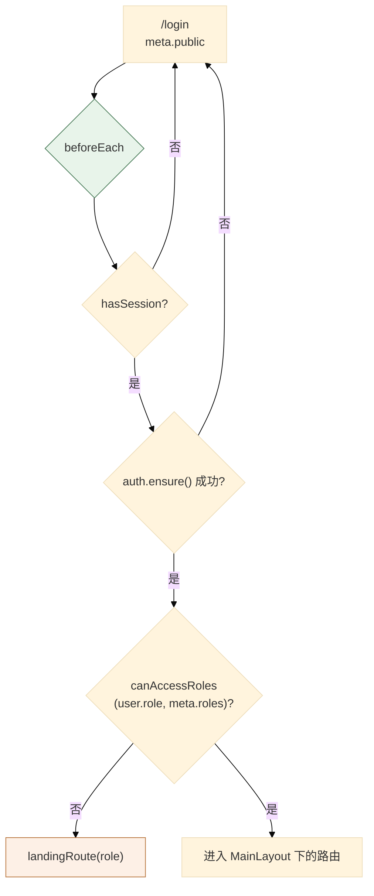
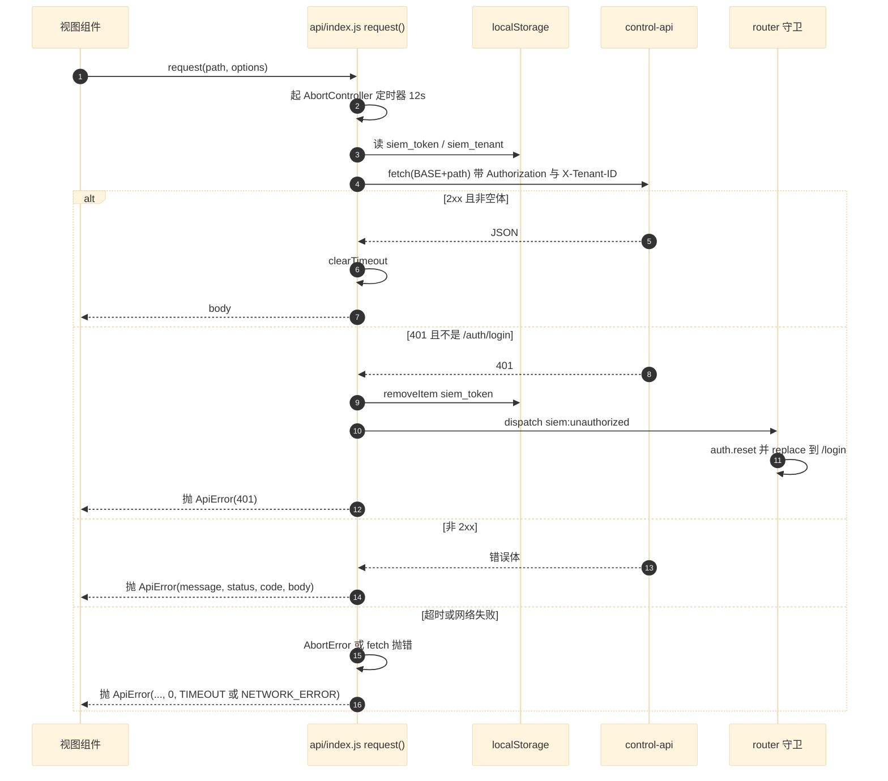
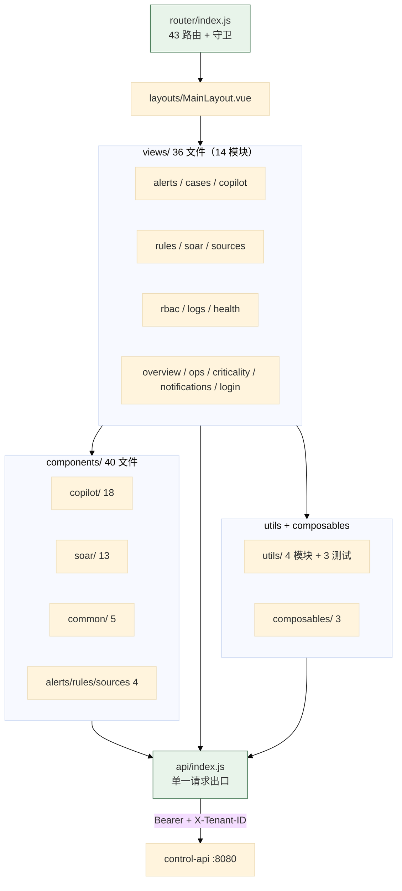
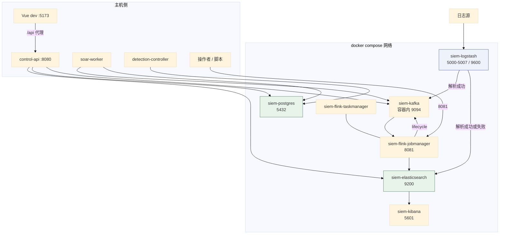
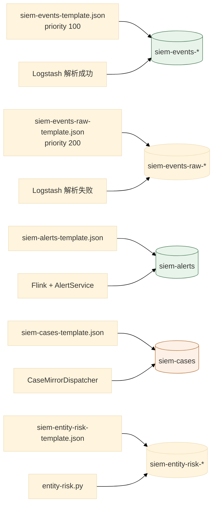
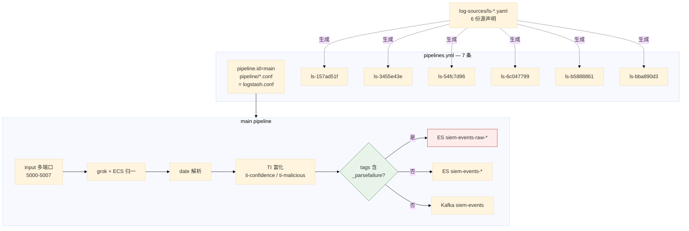

# 06 Web 控制台与基础设施

> **文档类型**：子系统深挖（代码级核验，非设计提案）
> **分析对象**：`D:\Project\SIEM` 的周边交付物——`web/`（Vue 3 控制台）+ `infra/`（本地基础设施，81 个文件）
> **取证范围**：`web/src` 92 个文件（43 条路由、36 个视图文件、40 个组件文件）+ `infra/` 的 docker-compose、5 个 ES 模板、4 条 Kafka topic、7 条 Logstash pipeline
> **取证方式**：源码直读 + grep 统计；每个关键论断附 `file:line` 锚点
> **结论以当前代码为准**（分支 `add_frame` @ `36b967f`）
> **文档集**：00–06 共 7 篇，见 [`README.md`](README.md)

> **读法**：Web 控制台与基础设施在权威文档侧几乎没有系统覆盖——只有 [`../../contracts/product-contract.md`](../../contracts/product-contract.md) §1 的路由表与 `infra/*/README.md` 的局部说明，**本篇是代码级覆盖**；确认「现在到底怎样」时回到代码。

---

## 1. Web 控制台

### 1.1 技术栈与构建

**断言 1：技术栈由 `web/package.json:13-20` 定义，共 6 个运行时依赖。**

| 依赖 | 用途 |
| --- | --- |
| `vue` 3.5 | 框架 |
| `vue-router` 4.5 | 路由 |
| `ant-design-vue` 4.2 | UI 库 |
| `@ant-design/icons-vue` | 图标 |
| **`@vue-flow/core`** 1.48 | **SOAR Playbook 的画布编辑**（`components/soar/SoarMvpCanvas.vue`） |
| **`yaml`** 2.7 | **前端直接解析规则/Playbook 的 YAML** |

**两个依赖值得单独看**：`@vue-flow/core` 是唯一的图形库，引入完全是为了 Playbook 编辑器；`yaml` 说明前端**直接处理 YAML**——与 `RuleAuthoringGrammar`（05 篇 §3 论断 4）的分工有关：**前端做格式校验，后端做语义归一化**。

**断言 2：开发服务器端口 5173，`/api` 代理到 8080**（`web/vite.config.js:29-35`）——与 `CLAUDE.md` §常用命令一致。

**断言 3：构建做了手工 chunk 拆分，三档策略。**

`web/vite.config.js:12-27` 的 `manualChunks`：`vue` + `vue-router` 固定进 `vue` chunk；`@vue-flow/core` 固定进 `vue-flow` chunk；**`ant-design-vue` 故意不拆**（交给按页面引用自动 tree-shake）。

**注意路径分隔符归一化**（`replaceAll('\\', '/')`，`:21`）——`manualChunks` 在 Windows 上收到的是反斜杠路径，不归一化则 `includes('/vue/')` 永远不匹配。**这是一处真实的跨平台坑。**

**断言 4：组件自动导入用 `unplugin-vue-components`，但关掉了 `dts` 生成。**

`web/vite.config.js:6-11`：`Components({ dts: false, resolvers: [AntDesignVueResolver({ importStyle: false })] })`。`dts: false` 意味着**不生成 `components.d.ts`、自动导入的组件没有类型提示**——这是 JS 项目（非 TS）的合理取舍。

**断言 5：`importStyle: false` 表示样式不走按需导入**——组件代码按需，**样式需要另行全量引入**（`main.js` 或 `styles/main.css`）。

### 1.2 路由与权限

#### 1.2.1 关键论断

**论断 1：43 条路由，全在单个文件里，用 `meta.roles` 做角色门控。**

实测 `grep -c "path:" web/src/router/index.js` = **43**。结构是「一条公开路由 + 一个 `MainLayout` 下的 41 条子路由 + 一条兜底」（`index.js:9,11,51`）。**所有业务组件都是动态 `import()`**——按路由懒加载，所以 `manualChunks` 只需要管第三方依赖。

**论断 2：权限模型是三元的（`public` / `roles` / 登录即可），由 `meta` 声明。**

| 字段 | 作用 |
| --- | --- |
| `public` | 无需登录（只有 `/login`） |
| `roles` | **哪些角色可进**；缺省 = 登录即可 |
| `menu` | **侧边栏高亮哪一项**（让详情页归属其列表页） |
| `title` | 页面标题 |

**`menu` 字段是个细节**：`alerts/:id` 的 `menu` 是 `/alerts`（`index.js:15`）——打开告警详情时侧边栏仍高亮「告警台」。

**论断 3：实测出现 4 个角色，不是 3 个。**

`admin` / `analyst` / `audit` 出现在多数路由，但 `sources/new` 的 `roles` 是 **`['admin', 'ops']`**（`index.js:25`）。**所以角色集合是 `{admin, analyst, audit, ops}`**——`ops` 只在这一条路由上出现，是「数据源运维」角色，权限面比 `analyst` 窄。

**论断 4：读与写的权限是分开的。**

`rules` 列表页（`index.js:20`）**故意无 `roles`**——所有登录用户可见；`rules/new` 与 `rules/:id/edit` 限 `admin`。同样的模式出现在 `cases`：

| 路由 | 权限 |
| --- | --- |
| `cases`（列表） | `admin, analyst, audit` |
| `cases/new`（建案） | **`admin, analyst`**（无 `audit`） |
| `cases/:id`（详情） | `admin, analyst, audit` |

**`audit` 角色能看不能改**——这是审计角色的正确定义。

**论断 5：路由守卫是异步的，且每次导航都重新校验。**

`index.js:59-73` 的 `beforeEach` 分四条分支：

| 情况 | 处理 |
| --- | --- |
| 公开路由 + 已登录 + 访问 `/login` | 跳到该角色的落地页（`landingRoute`） |
| 公开路由 + 未登录 | 放行 |
| 未登录 | 跳登录页，**带 `redirect` 参数** |
| 已登录但角色不足 | **不报 403，直接跳落地页** |
| `auth.ensure()` 失败 | 跳登录页 |

**两条设计选择值得注意**：角色不足时不是显示「无权限」，而是**送到该角色能看的首页**；`auth.ensure()` 每次导航都调，但它是幂等的（有缓存则直接返回），所以这不是每次都打网络。

**论断 6：401 通过全局事件处理，不在每个调用点判断。**

`web/src/api/index.js:71-74` 在 `401 && path !== '/auth/login'` 时 `clearSession()` 并 `window.dispatchEvent(new CustomEvent('siem:unauthorized'))`；`router/index.js:75-78` 订阅该事件、`auth.reset()` 并 `replace` 到 `/login`。

**这是「API 层广播 + 路由层订阅」的解耦**：`api/index.js` 不需要知道路由的存在。**`path !== '/auth/login'` 的排除条件防止登录失败本身触发跳转循环。**

**论断 7：路由用 `createWebHistory`（HTML5 history 模式），而仓库不提供 SPA 回落。**

`index.js:55`。**部署含义**：生产环境需要把未匹配路径回落到 `index.html`，否则刷新详情页会 404。**实测仓库内没有任何 SPA 回落配置**（对 `infra/` 与 `web/` 搜 `try_files` / `history-api-fallback`，只命中 parser 模板里的示例日志行）——**这项配置必须由外部反向代理提供，本仓库不提供。**

#### 1.2.2 路由与角色

### 1.3 API 客户端：单一出口

#### 1.3.1 关键论断

**论断 1：所有请求经一个 `request()` 函数，自动附加 Bearer 与租户头。**

`web/src/api/index.js:1-5` 的 `BASE = '/api'`、`DEFAULT_TIMEOUT = 12_000`，token 与租户从 `localStorage` 读；`:41-45` 在 `authToken` 非空时加 `Authorization` 与 `X-Tenant-ID`。

**`X-Tenant-ID` 是前端主动发的**——但**后端不信任它**（03 篇 §4 论断 7：`requireMembership` 校验成员关系）。**前端发头是为了表达「我想看哪个租户」，后端校验是为了防止越权。**

**论断 2：默认 12 秒超时，用 `AbortController` 实现，定时器在 `finally` 里清。**

`api/index.js:2,38-40`；超时被转成结构化错误：`error?.name === 'AbortError'` → `ApiError('请求超时（N 秒）', 0, 'TIMEOUT')`（`:53-60`），其余网络错误 → `ApiError(error?.message || '网络连接失败')`。**`finally` 里 `clearTimeout`**，所以即使请求成功定时器也不泄漏。

**论断 3：错误归一为 `ApiError`，错误码有三级回退。**

`api/index.js:7-15` 定义 `ApiError(message, status = 0, code = 'NETWORK_ERROR', body = null)`；`:75-82` 在 `!response.ok` 时用 `body?.message || body?.error || '请求失败（HTTP N）'`，`code` 取 `body?.code || 'HTTP_<status>'`。

**这与后端的 `ApiError` 结构对应**（03 篇 §4 论断 12、§5 论断 2）——**前后端共享同一套错误码约定**。**`status = 0` 表示「没有 HTTP 响应」**（网络失败或超时），让调用方能区分「服务端拒绝」与「根本没连上」。

**论断 4：响应体解析对非 JSON 内容做了兜底。**

`api/index.js:62-70`：先 `response.text()`，`JSON.parse` 失败则 `body = { message: raw.slice(0, 500) }`。**非 JSON 响应的前 500 字符被放进 `message`**——后端返回 HTML 错误页（如代理的 502）时用户能看到线索。**`slice(0, 500)` 与 `EventParsingProcessFunction` 的 `MAX_ERROR_CHARS`（02 篇 §2 论断 4）是同一种做法：错误信息要截断。**

**论断 5：204 与空体都返回 `null`。**

`api/index.js:83`：`response.status === 204 || !raw.trim() ? null : body`——这解释了为什么很多 API（`DELETE`、`POST .../activate`）不返回内容。

**论断 6：API 函数是「一行一个」的扁平导出，路径参数经 `segment()` 编码。**

`api/index.js:107-123` 每个函数一行，用 `json(method, body)`（`:86-91`）构造请求。**路径参数经 `segment = encodeURIComponent`（`:17`）编码**——`updateUserRole('a/b', ...)` 不编码会产生错误路径；实测所有传路径参数的调用都用了 `segment(...)`。

#### 1.3.2 请求管线

### 1.4 视图与组件的组织

#### 1.4.1 关键论断

**论断 1：`views/` 按业务模块分目录，实测 36 个文件、14 个模块目录。**

| 模块目录 | 文件数 | 对应后端端点前缀 |
| --- | --- | --- |
| `alerts/` | 2 | `/api/alerts` |
| `cases/` | 3 | `/api/cases` |
| `copilot/` | 1 | `/api/agent-investigations` |
| `criticality/` | 2 | `/api/settings/criticality` |
| `health/` | 2 | `/api/data-health` |
| `login/` | 1 | `/api/auth/login` |
| `logs/` | 5 | `/api/log-search` |
| `notifications/` | 1 | `/api/notifications` |
| `ops/` | 1 | `/api/ops` |
| `overview/` | 1 | （聚合多个） |
| `rbac/` | 5 | `/api/auth/*`、`/api/tenants` |
| `rules/` | 3 | `/api/detection-rules` |
| `soar/` | 5 | `/api/soar` |
| `sources/` | 4 | `/api/log-sources`、`/api/parser-templates` |

**「一个后端端点前缀 = 一个前端模块目录」这条对应关系基本成立**——这让「改一个功能要动哪些文件」变得可预测。**两处例外**：`overview/`（聚合多个端点）与 `login/`（不属任何资源）。

**`logs/` 与 `rbac/` 文件数最多（各 5 个）**，因为它们是重交互模块；**`logs/` 还把查询构建逻辑抽成了纯函数** `logSearchQuery.js`，所以它能单测。

**论断 2：`components/` 按消费者分目录，实测 40 个文件。**

| 目录 | 文件数 | 谁用 |
| --- | --- | --- |
| `copilot/` | **18** | AI 调查工作台 |
| `soar/` | **13**（11 个 `.vue` + `soarGraph.js` + `soarGraph.test.js`） | Playbook 编辑器 + 节点表单 |
| `common/` | 5 | 跨模块通用（`JsonField`、`LoadState`、`PageHeader`、`StatusTag`、`TimeText`） |
| `rules/` | 2 | `RuleConditionTree`、`RuleSummary` |
| `alerts/` | 1 | `AlertDetails` |
| `sources/` | 1 | `ParserTemplateEditor` |

**`copilot/` 与 `soar/` 合计 31 个，占 40 个的 77.5%**——**这两个模块的前端复杂度远高于其他**。

**论断 3：`copilot/` 的 18 个组件名字本身就描述了工作台的信息架构。**

`views/copilot/InvestigationWorkspaceView.vue` 由 `InvestigationHeader` / `InvestigationOverview` / `InvestigationPlan` / `InvestigationStateSummary` / `InvestigationTimeline` / `InvestigationResponse` / `FindingList` / `FindingCard` / `HypothesisList` / `EvidenceList` / `EvidenceDetailDrawer` / `VerdictCard` / `UncertaintyList` / `ResponseRecommendationList` / `ResponseProposalForm` / `ToolActivityList` / `AttackMappingList` / `AuthorityTag` 拼成：**假设 → 发现 → 证据 → 结论 → 不确定性 → 响应建议 → 工具活动**。

> **注意 `AuthorityTag.vue`**——「权限标签」这个组件名与项目的核心不变式（「Agent 建议、人工授权」）相关。**前端用一个独立组件显示「这条信息的权威级别」**——这是把架构约束做进了 UI。

**论断 4：`soar/` 的图逻辑抽成纯 JS 模块并单测。**

`components/soar/soarGraph.js` + `soarGraph.test.js`（用 `node --test` 跑）。**把图算法从前端框架里剥离出来**——这是让它可测的前提。

**论断 5：前端测试有两级——单元测试与 e2e。**

`web/package.json:9-10` 的 `"test"` 显式列出 **5 个**单元测试文件（不是 glob），`"test:e2e": "playwright test"`。**单元测试用 Node 内置的 `node --test`，不引入 Jest/Vitest。**

| 测试文件 | 测什么 | 为什么值得测 |
| --- | --- | --- |
| `soarGraph.test.js` | Playbook 图操作 | 图算法易错且难靠肉眼验证 |
| `logSearchQuery.test.js` | 日志查询构建 | 查询语法拼错不会立刻暴露 |
| `navigation.test.js` | 导航与路由辅助 | 权限相关的纯逻辑 |
| `copilot.test.js` | Copilot 数据映射 | 契约转换 |
| **`copilotStageD.test.js`** | **Copilot Stage D** | 一个按阶段命名的展示契约测试 |

> **「Stage D」指本仓的设计文档**，不是外部仓库：[`../../design/copilot-workspace-ux-brief.md`](../../design/copilot-workspace-ux-brief.md) 的标题就是「SOC Copilot 调查工作台 — Stage D UX Brief（实现级）」，该测试文件第一行也写着*「Stage D — 分析师体验的展示契约测试」*。

**e2e 覆盖 5 个 spec**：`web/playwright.config.js` 的 `testDir: './e2e'`，目录下是 `copilot-authority`、`investigation-workspace`、`log-search-overview`、`playbook-editor`、`response-workflow` 五个 `.spec.js`。

**论断 6：`composables/` 只有 3 个——组合式 API 的复用面很窄。**

`useAsyncState`（异步状态 loading/error/data）、`useAuth`（会话与用户，被路由守卫与 `ensure()` 使用）、`useViewport`（视口）。**只有 3 个，说明大部分状态留在组件内**——这是「按需抽取」而非「预先抽象」。

**论断 7：`utils/` 7 个文件里有 3 个是测试——工具函数的测试密度最高。**

`copilot.js` + `copilot.test.js`、`copilotStageD.test.js`、`display.js`、`navigation.js` + `navigation.test.js`、`runtimeUrls.js`。**这是有意的分工：纯函数抽到 `utils/` 并测；组件不测，靠 e2e 覆盖。**

**`runtimeUrls.js` 实测只导出 `kibanaUrl(configured = import.meta.env.VITE_KIBANA_URL)`**——有配置就用配置，否则按当前页面的 protocol / hostname 拼出 `:5601/app/discover`。**所以「runtime」指的是运行环境注入的 Kibana 地址**，与 `vite.config.js` 的 `/api` 代理无关。

#### 1.4.2 前端结构

---

## 2. 基础设施

### 2.1 docker-compose 拓扑

#### 2.1.1 关键论断

**论断 1：7 个运行容器加 1 个一次性初始化容器，端口映射见表。**

| 服务 | 镜像 | 主机端口 → 容器端口 |
| --- | --- | --- |
| `postgres` | `postgres:16.4` | `5432:5432` |
| `elasticsearch` | `elasticsearch:8.14.0` | `9200:9200` |
| `kibana` | `kibana:8.14.0` | `5601:5601` |
| `logstash` | `logstash:8.14.0` | **`5000`–`5007`（7 个）加 `9600`** |
| `kafka` | `apache/kafka:3.8.0` | **`9092:9094`** |
| `flink-jobmanager` | `flink:2.1-java21` | `8081:8081` |
| `flink-taskmanager` | `flink:2.1-java21` | 无映射（内部通信） |
| `elasticsearch-backups-init` | `alpine:3.20` | 无（一次性） |

**三处值得注意**：

1. **Logstash 开了 7 个接入端口（5000、5001、5002、5004、5005、5006、5007）加一个监控端口（9600）**——每个端口可接一类日志源；实测 6 条数据源 pipeline（见 §2.4），大致一源一端口（5000 归 `main`）。**注意 `5003` 没有映射**——这是一个端口空缺。
2. **Kafka 是 `9092:9094`，不是 `9092:9092`**——主机 9092 映射到容器 9094。方向别记反：`KAFKA_LISTENERS` = `INTERNAL://:9092,EXTERNAL://:9094,CONTROLLER://:9093`，`KAFKA_ADVERTISED_LISTENERS` = `INTERNAL://kafka:9092,EXTERNAL://localhost:9092`。所以**容器间**走 `INTERNAL`（`kafka:9092`），**宿主机**走 `EXTERNAL`（`localhost:9092`，实际落在容器 9094，再由端口映射回到宿主机 9092）。
3. **`flink-taskmanager` 无端口映射**——它只与 jobmanager 通信，不需要对外暴露。

**论断 2：Flink 镜像是 `flink:2.1-java21`，与 `flink/pom.xml` 的 Java 21 一致。**

**版本对齐是 Flink 部署的硬要求**：作业用 Java 21 编译，集群就得跑 Java 21。

**论断 3：卷挂载的实战坑已体现在 compose 里。**

`CLAUDE.md` §关键知识点 5：Docker Desktop 的「文件级 bind mount」会被 rsync 替换破坏——单文件挂载（`./a.yml:/path/a.yml`）被 rsync 原地替换（Docker Desktop 快照旧 inode）后，容器 restart/up 报 `mount ... no such file or directory`（exit 127）；**解法是目录级挂载**。**compose 已按此配置**：`logstash/config` 是目录级挂载。

#### 2.1.2 拓扑

### 2.2 Elasticsearch 模板

#### 2.2.1 关键论断

**论断 1：5 个索引模板，一个索引一个模板。**

| 模板文件 | 目标索引 | 优先级 |
| --- | --- | --- |
| `siem-events-template.json` | `siem-events-*` | **100** |
| `siem-events-raw-template.json` | `siem-events-raw-*` | **200** |
| `siem-alerts-template.json` | `siem-alerts` | — |
| `siem-cases-template.json` | `siem-cases` | — |
| `siem-entity-risk-template.json` | `siem-entity-risk`（**无通配符**：实体风险是单索引聚合，不按天滚动） | — |

**`siem-events-raw-*` 与 `siem-events-*` 共享前缀**，所以必须靠优先级区分（`logstash.conf:93-94`，见 02 篇 §1 论断 2）。

**论断 2：`siem-entity-risk` 是第五个索引，实体风险聚合，不在前三篇的数据流里。**

`infra/elasticsearch/entity-risk.py` 与之配套——**它不与告警/案件同链路**，是一个独立的聚合产物（03 篇 §8.1 的 `ProcessCriticalityDeployer` 调的就是它）。

**论断 3：ES 相关脚本 6 个，覆盖运维全周期。**

`apply-templates.sh`（应用 5 个模板）、`setup-rbac.sh`（配置 ES 角色与用户，配合 `elasticsearch.yml` / `roles.yml` / `role_mapping.yml`）、`reindex-mappings.sh`、`backup.sh`、`backup-restore-rehearsal.sh`、`ops-health.sh`。

**`backup-restore-rehearsal.sh` 的存在值得注意**——**备份脚本不够，恢复演练脚本才是可信度的证明**。这与 `CLAUDE.md` §关键知识点 8 记录的 savepoint 恢复演练（2026-08-16 已演练通过）是同一种工程态度。

**论断 4：RBAC 配置是文件式的。**

`elasticsearch/config/` 下有 `roles.yml`、`role_mapping.yml` 与 `users`、`users_roles`——后两个是 ES 8.x file realm 的明文文件（由 `elasticsearch-users` 工具生成），配合 `infra/SECURITY.md`（见 §2.7）。

#### 2.2.2 模板 → 索引 → 写者

### 2.3 Kafka topic

#### 2.3.1 关键论断

**论断 1：实测 4 条 topic，全部 3 分区、RF=1、保留 3 天。**

`infra/kafka/create-topics.sh:6-8` 定义 `TOPICS=("siem-events" "siem-events-dlq" "siem-alert-lifecycle" "siem-case-lifecycle")`、`PARTITIONS=3`、`RETENTION_MS=259200000`。

| Topic | 生产者 | 消费者 |
| --- | --- | --- |
| `siem-events` | Logstash | Flink |
| `siem-events-dlq` | Flink（解析失败侧输出） | （人工排查） |
| `siem-alert-lifecycle` | Flink + 控制面 | `soar-worker` |
| **`siem-case-lifecycle`** | 控制面 | `soar-worker` |

**`siem-case-lifecycle` 是第四条**——由 `SoarKafkaProperties.topicFor(objectType)` 按对象类型选择（04 篇 §8 论断 5）。

**论断 2：RF=1 是本地开发配置。**

**RF=1 意味着没有副本冗余**——单 broker 场景下这是唯一选择。`logstash.conf:113` 的注释也提到：*「可靠性:acks=all + 重试（单 broker RF=1 下仍值得，为将来多 broker 兜底）」*。

**论断 3：保留期 3 天，脚本注释说明设计意图「Kafka 只作缓冲」。**

**长期存储在 ES**——所以 3 天保留期不是妥协，而是与「ES 是事实源」的分工一致。

**论断 4：脚本是幂等的，且会扩容不足的分区。**

`create-topics.sh:12-20`：已存在则 `--describe` 数分区数，不足则 `--alter --partitions`；注释写明**「只能增不能减」**（Kafka 的约束）。脚本开头用了 `set -euo pipefail`——`-u` 让未定义变量报错、`-o pipefail` 让管道中任一环失败都算失败；**这两个选项不是默认的**，显式加上说明作者在意失败可见性。

**论断 5：还有 `check-lag.sh` 与 `siem-events.schema.json`。**

后者是 **`siem-events` 的事件 schema**——**它的存在让「生产端与消费端的约定」可被检查**，而不是只靠文档。

### 2.4 Logstash 配置

#### 2.4.1 关键论断

**论断 1：7 条 pipeline——1 条主 pipeline 加 6 条数据源 pipeline。**

`infra/logstash/config/pipelines.yml` 里 `pipeline.id: main` 的 `path.config` 是 `/usr/share/logstash/pipeline/*.conf`，另有 6 条 `ls-*`。

**`main` 的 glob 是 `pipeline/*.conf`——它不匹配 `pipeline/log-sources/*.conf`**（`*` 不跨目录）。所以 6 条数据源 pipeline **不会**被 `main` 重复处理。**这是刻意用目录层级做隔离。**

**论断 2：`pipeline.ecs_compatibility: v8` 是显式设的，7 条都有。**

**Logstash 8.x 默认就是 v8 兼容**，但显式声明让配置自证——**不依赖版本默认值**。

**论断 3：6 条数据源 pipeline 的文件名与 `infra/log-sources/*.yaml` 一一对应。**

`ls-157ad51f`、`ls-3455e43e`、`ls-54fc7d96`、`ls-6c047799`、`ls-b5888861`、`ls-bba890d3`——**哈希后缀（`ls-<8 位十六进制>`）是源 id**，由 `LogstashConfigGenerator` 生成（02 篇 §1 论断 3）。

> **配置文本与文件写入是分开的两件事**：`LogstashConfigGenerator` 只有 `generateInput` / `generateFilter` / `generatePipeline` 三个返回 `String` 的方法，**自己不写文件**；**写 conf、追加 `pipelines.yml`、校验与失败回滚都由 `ActivationCoordinator` 负责**（`ActivationCoordinator.java:19-20,67,77,128`——校验/同步/重启失败时删 conf 并还原 `pipelines.yml`，再抛 `ActivationFailedException`）。**所以新增数据源只有这一条代码路径改 `pipelines.yml`。**

**论断 4：主 pipeline 的两个输出走 `if/else` 分流。**

解析失败走 `siem-events-raw-*` 且不进 Kafka；成功则并行写 `siem-events-*` 与 Kafka（已取证，02 篇 §1）。

**论断 5：主 pipeline 还包含威胁情报（TI）富化。**

TI 数据是两个 YAML——`logstash/config/ti-confidence.yml` 与 `ti-malicious.yml`，由 `infra/ti/update-ti.py` 更新。**富化位置已取证**：它在 `logstash.conf:66` 的 `if [source.ip]` 块内，用两个 `translate` filter 查字典（`dictionary_path` 分别是 `ti-malicious.yml`（`:75-78`）与 `ti-confidence.yml`（`:81-84`））；`:73-74` 的注释写明字典每日更新，且**字典值始终是字符串、`fallback` 必须同类型**。

**论断 6：`logstash/config/logstash-sample.conf` 是镜像自带的样本文件。**

**这是从官方镜像拷进来的**——`CLAUDE.md` §关键知识点 5 提到 config 目录需内含 `jvm.options` / `log4j2` 等镜像默认文件，已从镜像拷入。**`logstash-sample.conf` 是那批文件之一，不是项目自己的配置。**

#### 2.4.2 Logstash 结构

### 2.5 Kibana

**4 个文件**：`create-dashboards.sh`（调用 python 脚本）、`create_dashboards.py`（用 Kibana API 创建 dashboard）、`siem-dashboards.ndjson`（dashboard 定义的导出格式）、`triage-alert.py`（告警分诊辅助）。

**`CLAUDE.md` §关键知识点 9**：*「Kibana dashboard 对象必须带 `kibanaSavedObjectMeta.searchSourceJSON`」*——**这是导入 dashboard 时的必需字段，缺了会被静默忽略**。

**`__pycache__/*.pyc` 是未跟踪的本地构建产物**——`.gitignore:37` 的 `__pycache__/` 规则命中它们，`git ls-files | grep pyc` 为空。

### 2.6 部署脚本

**`infra/deploy.sh` 是「同步仓库 → WSL + 构建 + 拷 jar」的单入口**（`CLAUDE.md` §常用命令：`MSYS_NO_PATHCONV=1 wsl bash /mnt/d/Project/SIEM/infra/deploy.sh`）。两条相关警告都在 `CLAUDE.md`：§关键知识点 4（**不能 `rm -rf` bind mount 目录（logstash）**，会破坏 Docker Desktop 挂载导致 exit 127；用 `rsync` 原地同步）与 §关键知识点 5（单文件 bind mount 被 rsync 替换后容器 restart 失败；解法是目录级挂载）。

**`validate-deployment.sh`** 是独立校验脚本——部署后的验收检查。**`infra/tests/soar-load-test.mjs`** 是 SOAR 的负载测试（`.mjs` 说明用 Node ESM 跑）。

### 2.7 安全与文档

`infra/` 下的文档类文件：`README.md`（总览）、**`SECURITY.md`**（安全配置说明）、`auth/README.md` + `auth/users.yaml`（认证用户声明），以及 `elasticsearch/`、`kafka/`、`kibana/`、`simulator/`、`ti/` 各自的 `README.md`。

**`infra/auth/users.yaml` 是初始用户声明**——与 `AuthService` / `UserStore` 的初始化相关（03 篇 §6.1）。

> **`SECURITY.md` 的存在值得单独指出**：基础设施的安全配置（ES RBAC、Kafka SASL/TLS、内部服务令牌）有独立文档，而不是散落在各个脚本注释里。

### 2.8 模拟与解析器资产

**`infra/simulator/`**：`README.md`、`brute-force-test.sh`（暴力破解场景模拟，`CLAUDE.md` §常用命令有此条）、`checkpoint-load-test.sh`（checkpoint 压力测试）。

**`infra/parser-templates/` 有 4 个内置解析模板**：`firewall.yaml`、`nginx-access.yaml`、`ssh-auth.yaml`、`windows-security.yaml`——**「开箱可用的解析规则」**，对应 `/api/parser-templates` 端点（03 篇 §6.3）。

## 3. 关键不变式（代码强制）

| # | 不变式 | 强制点 | 违反后果 |
| --- | --- | --- | --- |
| 1 | **所有 API 请求经单一 `request()` 出口** | `web/src/api/index.js:37`；调用方不直接 `fetch` | 漏发 Bearer/租户头，或漏处理 401 |
| 2 | **每次导航都重新校验角色** | `web/src/router/index.js:57` `beforeEach`（守卫体到 :72） | 角色变更后旧标签页仍有权限 |
| 3 | **角色不足跳落地页而非报错** | `web/src/router/index.js:67` `landingRoute(user.role)` | 用户卡在 403 页面 |
| 4 | **401 走全局事件而非就地处理** | `web/src/api/index.js:73` 广播；`router/index.js:74` 订阅（回调体 `:75`） | 多处重复实现登出逻辑 |
| 5 | **登录失败不触发跳转循环** | `web/src/api/index.js:71` `path !== '/auth/login'` | 登录页无限重定向 |
| 6 | **路径参数必须编码** | `web/src/api/index.js:17` `segment()` | 含特殊字符的参数产生错误路径 |
| 7 | **请求有 12 秒默认超时** | `web/src/api/index.js:2,40` `AbortController` | 请求悬挂，用户无反馈 |
| 8 | **定时器在 `finally` 清理** | `web/src/api/index.js:58-60` | 定时器泄漏 |
| 9 | **`/api` 代理到 8080** | `web/vite.config.js:32-34` | 前端连不上后端 |
| 10 | **chunk 拆分归一化路径分隔符** | `web/vite.config.js:21` `replaceAll('\\', '/')` | Windows 上 vendor chunk 拆分失效 |
| 11 | **Kafka topic 必须显式创建** | `infra/kafka/create-topics.sh`；`auto.create.topics.enable=false` | 生产者写到不存在的 topic |
| 12 | **topic 分区只能增不能减** | `create-topics.sh:17` 注释 + 只在不足时扩容 | 试图减分区导致失败 |
| 13 | **`siem-events-raw-*` 模板优先级必须高于主模板** | raw=200，主=100 | 解析失败日志的 mapping 被主模板覆盖 |
| 14 | **Logstash 主 pipeline 的 glob 不覆盖子目录** | `pipelines.yml` `pipeline/*.conf` vs `pipeline/log-sources/*.conf` | 数据源事件被处理两次 |
| 15 | **数据源 pipeline 显式声明 `ecs_compatibility: v8`** | `pipelines.yml` 全部 7 条 | 依赖版本默认值 |
| 16 | **bind mount 必须目录级，不能单文件** | `CLAUDE.md` §关键知识点 5；`docker-compose.yml` 已按此配置 | 容器 restart 报 exit 127 |
| 17 | **deploy.sh 不能 `rm -rf` bind mount 目录** | `CLAUDE.md` §关键知识点 4；用 `rsync` 原地同步 | Docker Desktop 挂载被破坏 |

---
