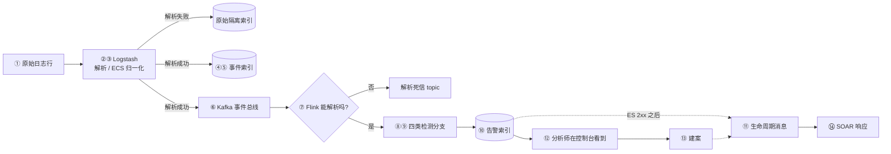

# 一条日志的完整旅程

> **读者对象**：已经知道这个系统"是干什么的"，现在想知道"它到底怎么运转"的人。
> **前置**：读完 [01-这个系统在解决什么问题.md](01-这个系统在解决什么问题.md) 即可。不需要预先了解 Flink、Kafka 或 Elasticsearch——本篇会在每个环节说明它在做什么，但不解释它内部的原理。

本篇只用**一条真实的日志**走完全程。每一步回答三个问题：**谁做的、凭什么这么做、失败了会怎样**。

---

## 0. 样本日志

```text
Aug 1 10:20:00 server03 sshd[9999]: Failed password for test from 172.16.1.20
```

读法：8 月 1 日 10:20:00，主机 `server03` 上的 sshd 进程，记录了一次针对用户 `test` 的密码认证失败，来源 IP 是 `172.16.1.20`。一条孤立的认证失败本身说明不了什么——用户可能只是打错了密码。**这条日志的价值，取决于系统能不能把它和"同一来源 IP 在短时间内的大量失败"联系起来**。整条链路的存在意义，就是让这种联系成为可能。

---

## 1. 全程鸟瞰



图里的编号与下文各节一一对应，两个失败出口刻意不编号——它们是隔离通道，不是主链路的一站。图里有一条虚线特别值得注意：**从上方的告警到下方的生命周期消息，只有当告警写入存储成功之后才会发生**。这个顺序贯穿全篇，第 ⑩ 步会展开。

---

## ① 日志进入采集器

**谁做的**：Logstash 的输入插件在监听一个端口。

**凭什么**：项目里默认的示例端口是 TCP `5000`；同时数据源也可以通过控制台的接入向导配置成 `tcp`、`syslog` 或 `file` 三种协议之一。数据源配置在仓库里是**可审计的项目配置**（`infra/log-sources/` 与 Logstash 的对应目录），生成和修改必须走控制面接口或部署脚本，**不能直接改运行中的容器**。

**失败了会怎样**：数据源生效本身是一个后台任务，顺序是"生成配置 → Logstash 配置校验 → 原子同步 → reload/restart"。失败时会保留旧配置并允许重试，页面上必须能看到任务状态。

**这里有个容易误判的点**：健康扫描显示 Logstash `UP`，只代表端口在监听，不代表 pipeline 在处理数据。端口可达和真正健康是两件不同的事，本仓的健康探针刻意区分了这两种结论。判断接入是否成功，要看事件是否真的出现在索引里，而不是只看监听状态。

---

## ②③ 解析与归一化：文本行变成结构化事件

**谁做的**：Logstash 的过滤器链，按顺序执行三步。

| 步骤 | 做什么 | 这条日志的结果 |
| --- | --- | --- |
| 字段提取 | 用正则从文本里把结构化字段抠出来 | `host.name=server03`、`user.name=test`、`source.ip=172.16.1.20` |
| 时间解析 | 把日志里写的时间解析成事件时间 | 事件时间按日志文本还原，时区为 Asia/Shanghai |
| 字段补全 | 补上规则依赖的标准字段 | 事件类别为认证、动作为认证失败、结果为失败 |

这一步的产物有两个关键性质：**从无到有**（字段是解析出来的，不是原来就有的）和**命名统一**（字段名按 ECS 标准归一化，点分形式）。归一化为什么重要：只有所有数据源都用同一套字段名，规则才可能写成"任何来源的认证失败都匹配"这种与厂商无关的形式——这是第 ⑨ 步能工作的前提。

**失败了会怎样**：解析或时间解析失败的记录进入**原始隔离索引**，并且**根本不会投递到 Kafka**。换句话说，坏数据在进入检测链路之前就被拦下，同时又被留在可以查的地方——不丢弃，也不污染。

---

## ④⑤ Logstash 双写：一份用来存，一份用来检

**谁做的**：Logstash 的输出段同时写两个目标。

| 目标 | 落点 | 用途 |
| --- | --- | --- |
| Elasticsearch | 按日志日期分的事件索引 | 长期存储与检索——"能不能查到历史" |
| Kafka | `siem-events` | 事件总线，供检测引擎实时消费——"能不能实时检测" |

**凭什么**：这是刻意的解耦。存储系统为了检索做了大量索引工作，检索延迟和吞吐特性都不适合做实时消费的通道；反过来，消息总线不做长期存储和全文检索。让一条事件同时进入两条路径，各自做自己擅长的事。

**注意这里已经埋下了一个事实**：同一条事件在系统里存在两份拷贝（一份在检索索引里，一份在消息总线里）。它们不共享事务。后面所有关于"一致性"的讨论，根源都在这里。

---

## ⑥ 事件总线

**谁做的**：Kafka 把生产者和消费者解耦开——Logstash 不需要知道谁在消费。

**凭什么**：本项目的 `siem-events` 配置为 3 个分区，这样可以有多个消费者并行处理。需要知道的运维事实是：本环境的 Kafka **关闭了自动建主题**，所以主题必须由脚本显式创建，依赖"自动建主题"的部署方式在这里会直接失败——这算是一种好的失败，因为它把问题暴露在提交检测作业之前。

**失败了会怎样**：这是链路里唯一一处"生产者不关心消费者死活"的地方。检测作业挂了，事件仍然在积累；作业恢复后从上次提交的位置继续读。

---

## ⑦ 检测引擎的解析门禁

**谁做的**：Flink 检测作业的第一步。

**凭什么**：这一步做两件事——把 JSON 展开成扁平字段（把 `source.ip` 当成一个整字段，而不是嵌套结构），并严格提取事件时间。**只有合法 JSON 且事件时间有效的记录才继续往下走。**

**失败了会怎样**：坏 JSON、缺失或非法事件时间的记录通过旁路输出进入**解析死信 topic**，并且附带错误原因和原始内容。这里有一个刻意的取舍值得记住：这些记录**不会退回到用处理时间凑合**。早期版本如果这么做，会把"时间戳错了"这种数据质量问题掩盖成"数据看起来是好的"，而漏报往往就是这么来的。

**两个失败出口的分工**（这是本仓最容易混淆的一处）：

- 原始隔离索引：拦的是**采集端**解析失败，记录从未进入消息总线。
- 解析死信 topic：拦的是**检测端**解析失败，记录已经进入消息总线、到了检测引擎门口。

---

## ⑧⑨ 检测：四类分支，一个时间概念

**谁做的**：Flink 检测作业里的四类规则分支。规则不是硬编码的，而是从仓库里的 YAML 规则文件加载、经编译后成为作业启动时使用的规则声明。作业启动时会用一份运行时清单校验规则，**不匹配就是启动失败，而不是静默换一套规则运行**。

**这条日志命中了什么**：它命中两条**单事件规则**——"SSH 认证失败"和"常见账号被爆破"（后者要求用户名属于一个常见弱账号集合，`test` 在其中）。所以：

> **一条事件 → 两条告警**，而且这两条告警的严重级不同。

这不是重复告警，而是两条规则从不同角度描述了同一个事实。第一次看数据的人经常在这里困惑，记住"命中一次产生一条告警"就不会了。

**四类规则各自在等什么**：

| 类别 | 判断时机 | 它擅长发现什么 |
| --- | --- | --- |
| 单事件 | 事件到达即判断 | 单条记录就能定性的事，比如针对管理员账号的失败登录 |
| 时间窗口 | 窗口关闭时统计 | 需要聚合才能看出的规律，比如同源 IP 在 5 分钟内失败次数达到阈值 |
| 序列模式 | 有界时间窗内跨事件的有序模式 | 攻击链，比如多次失败之后紧接着一次成功 |
| 统计基线 | 当前计数与滚动均值比较 | 相对自身历史异常的量变，比如认证速率偏离常态 |

**本样本还有一条"未来的告警"**：如果同一个来源 IP 在窗口内继续失败，窗口规则分支会另外产生一条严重级更高的暴力破解告警。也就是说，这条日志既是它自己产生的两条告警的原因，也是后续那条窗口告警的输入之一。

**窗口为什么会"迟到"**：窗口不是按墙上时钟关闭的，而是在"水位线"越过窗口结束时间之后才关闭。本作业允许 10 秒的有界乱序（让水位线落后于已观测到的最新事件时间一个固定上界，这样轻微乱序会被吸收而不是被当成迟到），并设置了 60 秒的空闲超时（避免一个安静下来的数据源把整个作业的窗口永远吊住）。

**必须说清的边界**：本作业**没有配置允许迟到**，也**没有迟到事件的旁路输出**。所以，一个在窗口已经触发之后才到达的事件，既不会计入那个窗口的结果，也不会被单独捕获。边界内（10 秒）的乱序被吸收；超出边界的事件就是丢了那次统计机会。这不是缺陷未修，而是明确的已知限制。

**抑制**：系统里有两处抑制，用的是不同的时间概念。单事件规则的抑制按"规则 + 实体"做键，使用**处理时间**窗口——这是刻意的，因为抑制属于运维层面的限流，不是检测语义。窗口规则的抑制用来收敛滑动窗口对同一次活跃攻击产生的重叠命中，避免同一个攻击产生一堆重复的告警文档。

---

## ⑩ 告警写入存储——以及那条接缝

**谁做的**：Flink 的写入环节。

**凭什么**：告警的文档标识是**确定性**的——由"规则、实体、事件时间"三者算出一个哈希值。这意味着同一条事件被重放时，写的是同一个文档，写入用的是 upsert 语义，于是"至少一次"的投递路径能收敛成用户看到的"不重复告警"。

同时，写入分两种情况：新文档写完整的告警内容；重放或抑制导致的更新只提交检测相关字段，**不碰分析师已经写下的状态、判定和案件关联**。这条保护是必要的——否则一次管道重放就会抹掉人的工作成果。

**这里有一条接缝，全篇最重要**：

> 告警写入存储成功之后，系统才向生命周期 topic 发出 `alert.created`。写入失败会抛异常，而不是发出生命周期消息。

后果很直接：**下游系统永远不会得知一条并没有被存下来的告警**。代价是这两个动作不属于同一个事务——存储更新与消息入队之间存在一个崩溃窗口。本仓用定时对账来暴露并收敛这个窗口，而不是假装它不存在。

---

## ⑪ 生命周期投递与"至少一次"

**谁做的**：一个后台投递器，从控制面数据库的 outbox 里批量领取待发消息。

**凭什么**：领取使用租约，并且要等到消息中间件确认接收之后，才把数据库里的记录标记完成。

**失败了会怎样**：在"消息已确认、数据库尚未标记"之间崩溃，会导致**消息被重复发送**。这是被接受的设计，而不是疏漏——下游依赖一个稳定的消息标识去重，而这个标识由（事件类型、租户、对象类型、告警标识、发生时间）唯一决定。

## ⑫ 分析师看到什么

**谁做的**：控制台的告警台页面（Vue 前端 + 控制面 API），以及作为外部入口的 Kibana。

**凭什么**：告警台按风险排序、支持批量处置，详情页展示结构化证据。展开一条告警时，**要同时看两个时间**：一个是事件时间（对窗口规则来说是窗口结束时间），一个是告警生成时间。它们相等才是巧合。页面上的原始 JSON 使用 UTC。

从告警详情可以跳到关联的案件、实体和事件上下文——这是设计要求的，因为"这条告警和什么有关"往往比"这条告警本身是什么"更重要。

---

## ⑬ 建案

**谁做的**：可以是自动聚合任务，也可以是分析师手动操作。

**凭什么**：自动聚合的条件是**事件时间、按实体分组、30 分钟窗口、至少 2 条告警**。页面上必须把当前使用的窗口、阈值和分组方式显示出来，否则用户没法判断"为什么这两条告警被算成一件事"。

**这一步的存储形态是本仓最复杂的一处**：案件的事实源是控制面的关系数据库，同时 Elasticsearch 里保留一份兼容镜像供检索和展示。

- 创建：先写数据库（案件、案件与告警的关系、镜像待发队列在同一事务里），再同步写镜像并回填告警上的案件关联。
- 更新：先用 Elasticsearch 的版本号做乐观锁，再更新数据库事实。
- 删除：先删数据库并排队镜像删除，再尽力同步删除镜像。

**失败了会怎样**：同步步骤失败会做补偿，但跨系统仍不具备原子性——待发队列加定时全量对账负责让镜像最终收敛。**不要把这个流程读成一次分布式提交，它不是。**

**约束**：结案时必须给出判定结论；仍在关联告警的案件不能删除。

---

## ⑭ SOAR 响应

**谁做的**：独立的 SOAR 运行时（一个不对外提供 Web 服务的进程）。

**凭什么**：它消费生命周期消息，匹配**已发布且已启用**的 Playbook，然后按图的节点执行。触发入口有两个——生命周期消息（自动）和人工手动运行——两者使用同一套去重规则和同一个持久执行内核。也就是说，手动跑一次和自动触发一次，走的是同一条路。

执行细节、审批位置和 AI 调查层怎么接进来，见 [03-从告警到处置决策.md](03-从告警到处置决策.md)。

---

## 2. 时间线小结

| 环节 | 是不是同步 | 失败了会怎样 |
| --- | --- | --- |
| 采集与解析 | 同步处理每条记录 | 进原始隔离索引，不进检测链路 |
| 双写存储与总线 | 两个独立目标 | 各自的失败在各自一侧暴露 |
| 检测解析门禁 | 逐条 | 进解析死信 topic |
| 规则求值 | 逐条 / 窗口关闭时 | 规则加载失败则作业启动失败 |
| 告警写入 | 异步确认 | 抛异常，**不发**生命周期消息 |
| 生命周期投递 | 至少一次 | 允许重复发送，下游按键去重 |
| 案件镜像 | 同步 + 异步收敛 | 同步补偿 + 对账最终一致 |
| SOAR 执行 | 持久化状态机 + 租约 | 租约过期由其他 worker 接管，过期 worker 不能回写 |

顺着这一列往下读，能看到一条清晰的梯度：**越靠近数据面，越依赖"幂等 + 收敛"；越靠近控制面，越依赖"事务 + 租约"**。这正是 [01](01-这个系统在解决什么问题.md) 第 5 节说的两个平面。

---

## 3. 动手验证

只发一条日志，观察链路上每一跳是否都动了：

```bash
# 1. 发送样本日志（TCP 5000）
echo 'Aug 1 10:20:00 server03 sshd[9999]: Failed password for test from 172.16.1.20' | nc -w1 localhost 5000

# 2. 事件数应 +1
curl -s "http://localhost:9200/siem-events-*/_count"

# 3. 告警数应 +2（这条日志命中两条单事件规则）
curl -s "http://localhost:9200/siem-alerts/_count"
```

第 3 步的数字是 2 而不是 1，是最值得亲手确认的一件事——它不是 bug。更细的分步走读（含每一步的中间产物示例和自测题）见 [`../learn/02-pipeline-walkthrough.md`](../learn/02-pipeline-walkthrough.md)。

---

## 4. 路标

| 你现在想做的事 | 读哪一份 |
| --- | --- |
| 看告警之后：排序、聚合、SOAR、AI 层接在哪 | [03-从告警到处置决策.md](03-从告警到处置决策.md) |
| 要带走一份"我该读什么"的地图 | [04-想深入读哪一篇.md](04-想深入读哪一篇.md) |
| 理解四类检测规则怎么写、怎么扩 | [`../rule-engine.md`](../rule-engine.md) |
| 看数据面与控制面的完整数据流和边界 | [`../architecture.md`](../architecture.md) |
| 看两张规范图（平面架构图 + 端到端时序图） | [`../architecture-diagrams.md`](../architecture-diagrams.md) |
| 查事件与告警的字段定义、索引与 mapping 约束 | [`../event-alert-schema.md`](../event-alert-schema.md) |
| 知道 Flink 内部机制的原理（水位线、状态、checkpoint） | [`../learn/05-flink.md`](../learn/05-flink.md) |
| 看真实页面、接口、验收路径，以及未闭环的风险清单 | [`../product-contract.md`](../product-contract.md)、[`../current-status.md`](../current-status.md) |
