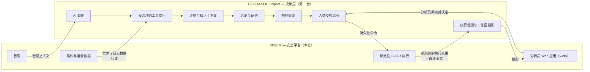

# 从告警到处置决策

> **读者对象**：已经知道"日志怎么变成告警"，现在想知道"告警之后怎么办"的人。
> **前置**：读完 [01](01-这个系统在解决什么问题.md) 和 [02](02-一条日志的完整旅程.md)。不需要预先知道 SOAR、Playbook 是什么——本篇会解释，而且不假设你写过工作流引擎。

---

## 1. 告警落库之后，其实有三件事

一条告警出现在告警索引里，只完成了检测。接下来它要回答三个不同的问题，而**回答这三个问题的是三个不同的机制**：

| 问题 | 由谁回答 | 一句话 |
| --- | --- | --- |
| 我该先看哪一条？ | 风险排序 + 实体风险 | 让有限的注意力落在真正重要的对象上 |
| 这些告警是几件事？ | 案件聚合 | 把同一件事的多条告警收成一个调查单元 |
| 该做什么，谁批准？ | SOAR 执行 + 人工审批 | 把结论变成带审批和留痕的动作 |

本篇按这个顺序讲，最后讲 AI 调查层接在哪一环、边界在哪里。

先记住一件事：**检测环节和响应环节是两套独立系统**。检测跑在数据面（流处理作业），响应跑在控制面（带持久状态的执行内核）。它们之间通过生命周期消息连接，而不是通过函数调用——因为响应要能撑过重启、要能被人审批、要能被追溯，这些都不是流处理作业擅长的事。

---

## 2. 第一件事：决定先看哪一条

**告警自带严重级。** 严重级是**规则元数据**——它是规则作者在写规则时声明的，不是系统运行时算出来的。这意味着严重级描述的是"这类行为通常有多危险"，而不是"这一次发生在你这里有多危险"。

这个区别造成了实际问题：同一条严重级为高的认证失败告警，打在测试机上和打在核心数据库上，处理优先级显然不同。而规则不知道这件事。

**解决办法是引入资产关键度。** 控制面可以维护 IP、用户、主机三类对象的风险权重，并触发后台重算，把"资产本身有多重要"反映到实体风险上。因此：

- **严重级**回答"这类攻击危险吗"——静态，来自规则。
- **实体风险**回答"这个对象对你重要吗"——动态，来自资产权重与聚合结果，由后台重算任务写入。

告警台按风险排序，用的就是这个综合结果。

> **未确认**：严重级与风险值的精确计算口径、重算的触发条件与聚合方式，本篇读过的文档没有给出公式级的说明。需要时以代码和 [`../product-contract.md`](../product-contract.md) 为准。

控制面还提供误报率的查询，用来观察规则本身的质量——一条规则如果长期只产生误报，问题在规则，不在分析师。

**处置有两个独立维度，不能合并**：一个是**判定**（这条告警是真阳性还是误报），一个是**状态**（从新建到已关闭的一组状态机取值，具体取值以产品契约为准）。两者分别校验，并且**批量关闭之前必须先完成判定**。这条约束是刻意的：不允许"悄悄关掉一堆告警却从没说过它们是不是真的"。

---

## 3. 第二件事：把同一件事收成一个案件

一条告警处理完了，但攻击通常不止一条告警。**案件**就是围绕一个实体把多条告警聚起来的调查单元。

**两种产生方式：**

- **自动聚合**：默认条件是**事件时间、按实体分组、30 分钟窗口、至少 2 条告警**。界面上必须把当前使用的窗口、阈值和分组方式显示出来——用户有权知道"为什么这两条告警被算成一件事"。
- **分析师手动聚合**：由人选择要归到哪个案件里。

**案件里装的不是告警的拷贝，而是它们的引用关系。** 案件本身有稳定的标识，关联的告警也有稳定的标识，页面之间靠标识跳转，不靠名称或数组下标。这样才能做到"从告警跳到案件、从案件跳回原始事件"。

案件详情里的**时间线**是从事件存储反查出来的原始事件——也就是说，案件引用的是事件存储里的证据，不是控制面复制的一份数据。控制面**不把事件和告警的正文复制到自己的数据库**。

**存储形态**：案件的事实源在控制面数据库，事件存储里保留一份兼容镜像供检索和展示。两者的收敛机制和失败处理见 [02 的第 ⑬ 步](02-一条日志的完整旅程.md)——一句话概括：不是分布式事务，是同步补偿加定时对账。

**两条硬约束**：结案时必须给出判定结论；仍在关联告警的案件不能删除。

---

## 4. 第三件事：SOAR 的确定性执行

### 4.1 为什么强调"确定性"

响应动作会真的改变生产环境——隔离一台主机、封禁一个 IP。所以本项目的取向是：**响应是一条带租约、带审批、带分支、带重试的工作流，而不是一个 webhook。**

"确定性"体现在三个地方：同一个触发消息不会产生第二个执行；执行到一半崩溃可以从持久状态恢复并继续；执行的每一步输入输出都留下记录。

### 4.2 触发与 Playbook

**两个触发入口，一个持久内核：**

- 生命周期消息（告警或案件发生变更时自动触发）
- 人工手动运行一个已启用的 Playbook

两者使用同一套去重规则，进入同一个执行内核。含义是：手动跑一次和自动触发一次，走的不是两条代码路径。

**Playbook 是一张有向图。** 创建时会自动生成唯一的开始与结束节点；节点分两类：

- **基础节点**：开始/结束、条件分支、业务动作、人工审批、等待。业务动作和条件字段只能从后端提供的字典里选，不能自由填写字段名——这保证了图能被校验。
- **扩展节点**：并行分支与汇合、循环与循环出口、外部连接器。这些需要显式填写汇合点或边界节点，不能靠猜。

**发布要过校验。** 全图可达、端口合法、模板引用存在、并行分支全部汇合、循环体全部到达循环出口且不嵌套——任何一条不满足都拒绝发布。发布成功即启用。

这条设计的价值：**图的问题在发布时暴露，而不是在执行到一半时暴露**。一个"某个节点永远走不到"的 Playbook 如果能发布出去，它会在最需要它的时候默默地不做任何事。

**运行时事实不在文件里。** Playbook 和执行状态以控制面数据库的表为准，不从仓库里的配置文件加载。这与检测规则不同（检测规则以仓库里的规则文件为创作输入）——理解这一点很重要，否则你会去一个不存在的地方找 Playbook 定义。

### 4.3 执行是怎么保证不乱的

这部分是 SOAR 里最值得读的工程细节：

| 机制 | 解决什么 | 具体做法 |
| --- | --- | --- |
| 租约 | 多个 worker 不能同时推进同一个执行 | worker 用租约领取到期节点，租约有时限 |
| 续租 | 长节点执行期间不能被别人抢走 | 执行耗时节点时持续续租 |
| fencing token | 被抢占的旧 worker 不能回来乱写 | 状态提交必须匹配属主、令牌和未过期租约三者 |
| 释放租约 | 等人审批时不该占着 worker | 人工审批和等待节点释放租约，不忙轮询 |
| 状态区分 | 取消和停用不是一回事 | 两者使用不同状态 |
| 图快照 | 编辑 Playbook 不能改变正在跑的执行 | 执行使用启动时的图快照，历史执行可查 |

最后一行尤其值得留意：**一个已开始执行的流程，不会因为你改了 Playbook 而改变语义**。这是"可审计"的前提——你事后看到的执行记录，是当时真正跑的那张图。

### 4.4 人工审批在哪一环

人工审批是图里的一个**节点类型**，不是一个外部流程。

- 执行走到人工审批节点 → 进入等待状态 → 出现在审批页面上
- 有人批准或拒绝 → 原执行沿着对应的分支继续
- 并发审批会被拒绝（冲突保护），不会出现"两个人同时批准同一步"导致的双重执行

把审批做成节点而不是外部钩子的好处：审批位置是图的一部分，可以被设计、被评审、被执行快照记录。你可以在图上直接看到"这一支必须先过人"。

**不在当前契约里的**：子 Playbook、动态映射与条件循环、定时/Webhook 触发、凭据库与互信认证、隔离执行、灰度与双人复核发布——这些是路线图事项。设计文档里描述"待实现"的部分不能被当作现成功能。

---

## 5. AI 调查层接在哪一环

到这里为止讲的都是本仓的能力。**AI 调查层不在本仓库里**——它是另一个独立仓库（HISIEM-SOC-Copilot），被设计成位于本平台之上的**决策层**。

### 5.1 接入位置

它不从数据面上接，而是从**已经有结论的地方**接：



读这张图要抓住三点：

1. **入口是告警**，不是原始日志。AI 层不做检测，它消费的是检测的产物。
2. **对案件与日志数据是只读的。** 它读取平台的数据用于调查，不写平台的业务数据。
3. **它的输出是提案，不是命令。** 提案必须经过人类授权，才会变成一条被持久化记录的命令。

### 5.2 边界：一句话的永久规则

两个仓库之间的分工被写成了一条规则，并且在两侧都被强制：

```text
模型提案  →  策略约束  →  人类授权
持久化命令记录意图  →  HISIEM 执行  →  Copilot 观测
```

拆开看，是三种权力被分给了三方：

| 动作 | 谁能做 |
| --- | --- |
| 提案（建议做什么响应） | 模型 |
| 约束（哪些提案允许存在） | 策略 |
| 授权（真的动手） | 人 |
| 执行（改变生产环境） | HISIEM 的 SOAR 运行时 |
| 观测（记录执行结果） | Copilot，但**事实以 HISIEM 侧观测为准** |

**"Copilot 永远不会变成第二个 SIEM 或 SOAR。"** 它不检测、不拥有告警数据、不执行。这句话不是姿态，而是由数据流方向保证的：命令被持久化记录之后在**本仓**执行，而**在 HISIEM 中观测到的执行结果才是最终事实**——不是 Copilot 认为自己提交了什么。

最后那半句是整个边界设计里最要紧的一条。如果提案方可以自己判定"我已经执行成功了"，那么"提案 → 授权 → 执行"这条链上的每一道检查都形同虚设。把"最终事实"放在执行侧，是让这套分工真正成立的那颗钉子。

### 5.3 两个容易搞错的细节

**分析员工作台的前端在本仓。** Copilot 的用户界面实现于本仓的 `web/` 目录，因为 HISIEM 拥有平台的 Web 应用。Copilot 仓库里没有前端。所以在 Copilot 项目里找不到 UI 是正常的，它在这里。

**本仓还有一个出站适配模块。** 从告警或案件详情启动 HISIEM-SOC-Copilot 的服务端代理位于 `modules/agent-adapter`，细节见 [`../agent-integration.md`](../agent-integration.md)。

### 5.4 本篇没有确认的东西

以下内容我在写这一篇时**没有找到依据**，因此不做描述，也不做推测：

1. **Copilot 与本仓之间的具体接口、协议、部署方式和调用时序。** 本篇读到的文档只给出了方向性的数据流（第 5.1 节那张图）和职责划分，没有给出接缝的技术细节。
2. **AI 层当前的完成度。** 本仓的当前状态文档里，已验证能力清单**没有包含** Copilot 相关条目；因此"AI 调查层已经在本环境端到端跑通"这句话在本篇没有依据。
3. **本仓 `product-contract.md` 把"AI Agent"列为不在当前契约中的内容，`roadmap.md` 也把"AI Agent"列为后续优先级（P2）；同时本仓确实存在上面那个出站适配模块。** 这两处的关系（是同一个能力的两面，还是两个不同阶段的东西）在文档里没有说明，本篇不做判断。
4. **`docs/design/copilot-workspace-ux-brief.md` 存在**，但它没有被列进 [`../README.md`](../README.md) 的专项文档索引；本篇没有读它，因此不能描述它的内容。

---

## 6. 归纳：谁有权做什么

把本篇的内容压成一张表，这是整个处置链的权力结构：

| 动作 | 谁有权做 | 凭什么 |
| --- | --- | --- |
| 产生告警 | 检测作业（规则求值） | 规则声明；没有人工写告警的入口 |
| 建立案件 | 自动聚合任务，或分析师 | 窗口 + 实体 + 阈值，或人的判断 |
| 判定真阳性 / 误报 | 分析师 | 且必须先于关闭告警 |
| 执行响应动作 | SOAR 运行时 | 仅在已发布启用的 Playbook 与已批准的节点上 |
| 批准 | 人（审批节点） | 并发审批有冲突保护 |
| 建议响应 | AI 调查层 | **只能提案；不能授权、不能执行** |

规律很整齐：**提议、授权、执行三件事被分给了三个不同的主体**。任何一方缺位，链条都断掉——没有提议就没有效率，没有授权就没有问责，没有确定性的执行就没有可审计的事实。

---

## 7. 路标

| 你现在想做的事 | 读哪一份 |
| --- | --- |
| 要一份"我该读什么"的地图 | [04-想深入读哪一篇.md](04-想深入读哪一篇.md) |
| 看告警/案件/审批的页面、接口与验收路径 | [`../product-contract.md`](../product-contract.md) |
| 看 SOAR 执行子系统的完整数据流与一致性保护 | [`../design/soar-runtime-architecture.md`](../design/soar-runtime-architecture.md) |
| 看并行/循环/手动触发/连接器这些扩展能力的边界 | [`../design/soar-capability-runtime.md`](../design/soar-capability-runtime.md) |
| 看 Playbook 可视化编辑与发布校验的基线 | [`../design/soar-playbook-mvp.md`](../design/soar-playbook-mvp.md) |
| 看双仓边界与职责划分的原始表述 | [`../../README.md`](../../README.md)（第 10 节）与 [`../architecture-overview.md`](../architecture-overview.md)（图 4） |
| 看 HISIEM-SOC-Copilot 出站适配 | [`../agent-integration.md`](../agent-integration.md) |
| 确认"哪些还只是路线图事项" | [`../roadmap.md`](../roadmap.md) 与 [`../product-contract.md`](../product-contract.md)（第 5 节） |
| 看当前未闭环的生产风险 | [`../current-status.md`](../current-status.md) |
| 学相关基础概念（术语链、TP/FP、严重级与风险） | [`../learn/README.md`](../learn/README.md) 与 [`../learn/01-siem-basics.md`](../learn/01-siem-basics.md) |
