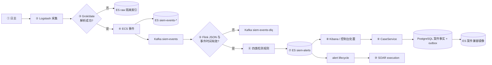
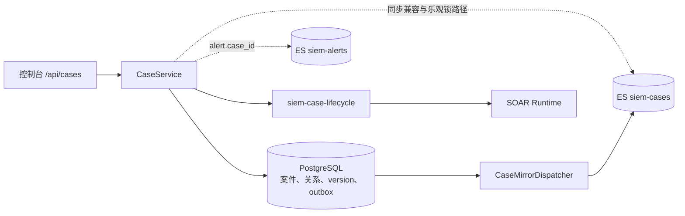

# 功课 2 — 本项目管道全流程走读

> 本文档以一条真实日志为样本,逐段说明数据面经过的每个组件,并补充告警进入控制面案件的路径,使"日志 → 事件 → 告警 → 案件"有具体对应。每个阶段给出**所在组件、文件位置、处理逻辑与中间产物**。

## 1. 完整旅程总览



图中有两个隔离出口：Logstash 的 Grok/date 失败进入 `siem-events-raw-*`，不会投递 Kafka；已经进入 Kafka、但 Flink 无法解析 JSON 或 `@timestamp` 的消息进入 `siem-events-dlq`，不会进入规则分支。

## 2. 样本日志与处理过程

**样本日志**(SSH 认证失败,目标用户 `test`,来源 IP `172.16.1.20`):

```
Aug 1 10:20:00 server03 sshd[9999]: Failed password for test from 172.16.1.20
```

### ②③ Logstash:文本行 → 结构化事件

配置文件:`infra/logstash/pipeline/logstash.conf`,由 input/filter/output 三段组成。

**input**:从 TCP 5000 接收原始日志行。
```ruby
tcp { port => 5000 }
```

**filter** 按顺序执行三次处理:

| 步骤 | 插件 | 作用 | 本样本结果 |
| --- | --- | --- | --- |
| ① 字段提取 | `grok` | 用正则从文本中提取结构化字段 | `host.name=server03`、`user.name=test`、`source.ip=172.16.1.20` |
| ② 时间解析 | `date` | 将日志中写的时间解析为 `@timestamp`(事件时间,时区 Asia/Shanghai) | `@timestamp=2026-08-01T02:20:00.000Z` |
| ③ ECS 补全 | `mutate` | 补充规则依赖的标准字段 | `event.action=authentication_failure`、`event.category=authentication` 等 |

**解析后生成的事件**(即写入 ES 与 Kafka 的 JSON 内容):

```json
{
  "@timestamp": "2026-08-01T02:20:00.000Z",
  "event.action": "authentication_failure",
  "event.category": "authentication",
  "source.ip": "172.16.1.20",
  "user.name": "test",
  "host.name": "server03",
  "message": "Aug 1 10:20:00 server03 sshd[9999]: Failed password for test from 172.16.1.20"
}
```

> 此阶段的关键点:文本被**结构化**(字段从无到有)且**归一化**(字段命名统一为 ECS 点分形式)。

### ④ Logstash 双写:一份用于存储,一份用于检测

`output` 段同时写两个目标:

| 目标 | 索引 / topic | 用途 |
| --- | --- | --- |
| Elasticsearch | `siem-events-%{+YYYY.MM.dd}` | 长期存储与检索(按日志日期分索引) |
| Kafka | `siem-events` | 事件总线,供 Flink 实时消费 |

**设计意图**:存储与检测解耦——ES 解决"能否检索到历史",Kafka 解决"能否实时消费并检测"。

### ⑤ Flink:消费与扁平化

`flink/src/main/java/com/siem/DetectionJob.java`：

```java
KafkaSource<String> source = KafkaSource.builder().setTopics("siem-events")...build();
SingleOutputStreamOperator<Event> parsed = env.fromSource(source, ...)
    .process(new EventParsingProcessFunction());
parsed.getSideOutput(EventParsingProcessFunction.DLQ)
    .sinkTo(dlqSink);
```

`EventParsingProcessFunction` 调用 `EventParser.parseEvent`，将合法 JSON 展开为**扁平字段 Map**（将 `source.ip` 作为单一 key），并严格提取事件时间戳，生成 Flink 内部流转的 `Event` 对象。坏 JSON、缺失或非法时间戳会附带错误原因和原始 payload 写入 DLQ，不再回退到处理时间。

### ⑥ Flink:规则匹配(检测核心)

`DetectionFunction` 对每个事件逐条规则求值。规则由 `infra/rules/*.yaml` 经 `RuleConfigLoader` 和 `RuleBuilder` 构造，不再硬编码在 `RuleRegistry`：

```java
for (Rule rule : registry.getRules()) {
    if (rule.getCondition().matches(fields)) {   // 条件满足
        out.collect(告警JSON);                    // 命中 → 生成告警
    }
}
```

本样本事件（`test` 用户）立即命中 **2 条单事件规则**：

| 规则 ID | 条件 | severity |
| --- | --- | --- |
| `rule-ssh-auth-failure-001` | `event.action == authentication_failure` | medium |
| `rule-common-user-bruteforce-001` | `event.action == authentication_failure` 且 `user.name ∈ {test, admin, ...}` | high |

因此 **1 条事件 → 2 条告警**。

### ⑦ 生成的告警 JSON（写入 siem-alerts）

```json
{
  "@timestamp": "2026-08-01T02:20:00.000Z",
  "alert.created_at": "2026-08-01T02:20:00.5Z",
  "alert.id": "a1b2...",
  "alert.rule_id": "rule-common-user-bruteforce-001",
  "alert.rule_name": "常见账号被爆破",
  "alert.severity": "high",
  "source.ip": "172.16.1.20",
  "user.name": "test",
  "event.raw": "{...完整事件JSON...}",
  "event_count": 1
}
```

告警采用**扁平结构**：关键事件字段提升到顶层（便于筛选/聚合），完整事件存于 `event.raw` 供取证。Flink 使用确定性 ES `_id` 和 update + upsert：新文档写完整告警，重放或抑制更新只提交检测字段，避免覆盖分析师已写入的状态、verdict 和 case_id。ES 返回 2xx 后，Flink 才发布 `alert.created` 到 `siem-alert-lifecycle`。

### ⑧ Kibana 与控制台呈现

`siem-alerts` 的数据进入 `SIEM 总览` dashboard,展示告警严重级分布、TOP 源 IP 等可视化；控制台通过 Spring Boot API 检索告警,执行 ack/investigating/resolved/closed 与 verdict 处置。

### ⑨ 控制面:告警 → 案件

当同一实体在 30 分钟内出现至少两条 open 告警时，`CaseAggregateJob` 可以自动聚合；分析师也可以从控制台手动聚合。`CaseService` 将案件状态、负责人、证据和案件—告警关系写入 PostgreSQL，并在同一数据库事务中写 `case_mirror_outbox`；`CaseMirrorDispatcher` 将事实重试投递到 Elasticsearch 兼容镜像，案件详情的事件时间线再从 ES 反查原始事件。



这里仍不是跨 PostgreSQL、Elasticsearch 和 Kafka 的原子事务。创建、更新、删除使用不同的同步顺序和补偿逻辑，outbox 与定时 reconcile 负责故障后的最终收敛；不能把图理解为一次分布式提交。

## 3. 时间窗口规则的处理差异(第二条 Flink 分支)

上述走的是**单事件规则**（逐条判断）。本项目还有一条**时间窗口规则**（SSH 暴力破解），走另一条分支：

```java
parsed
  .assignTimestampsAndWatermarks(...)                    // 指定事件时间并设置乱序容忍
  .keyBy(source.ip)                                      // 按来源 IP 分组
  .window(SlidingEventTimeWindows.of(5min, 1min))         // 5 分钟窗口，每 1 分钟滑动
  .process(new WindowRuleFunction(...));                 // 窗口关闭时统计 ≥5 次 → 告警
```

**两者差异**:

| 规则类型 | 判断时机 | 能识别的模式 | 例子 |
| --- | --- | --- | --- |
| 单事件规则 | 事件到达即判断 | 单条事件即可判定 | 一条 root 登录失败 |
| 时间窗口规则 | 滑动窗口关闭时统计判断 | 需聚合多条事件的模式 | 5 分钟内 ≥5 次失败 |

**场景举例**:攻击者使用脚本对同一服务器每 30 秒尝试一次密码。单条失败事件无法判定为攻击(可能是正常输错),但窗口规则聚合后识别出"5 分钟内 ≥5 次"的规律,判定为暴力破解。

## 4. 阶段与文件对照

| 阶段 | 组件 | 文件 |
| --- | --- | --- |
| 采集与解析 | Logstash | `infra/logstash/pipeline/logstash.conf` |
| 建 topic | Kafka | `infra/kafka/create-topics.sh` |
| 消费、检测、DLQ 与告警写出 | Flink | `flink/src/main/java/com/siem/DetectionJob.java`、`EventParsingProcessFunction.java`、`DetectionFunction.java`、`WindowRuleFunction.java` |
| 检测规则声明与构建 | Flink + YAML | `infra/rules/*.yaml`、`RuleConfigLoader.java`、`RuleBuilder.java` |
| 事件/告警存储 | ES | `infra/elasticsearch/*-template.json` |
| 呈现/处置 | Kibana + Spring Boot | `infra/kibana/create_dashboards.py`、`src/main/java/.../alert`、`.../investigation` |
| 控制面存储 | PostgreSQL/Flyway | `src/main/resources/db/migration/V1__control_plane.sql` 至 `V12__soar_handler_runtime.sql` |

## 5. 动手验证

```bash
# 发送一条测试日志
echo 'Aug 1 10:20:00 server03 sshd[9999]: Failed password for test from 172.16.1.20' | nc -w1 localhost 5000

# 事件数应增加(该日志产生 1 条事件)
curl -s "http://localhost:9200/siem-events-*/_count"

# 告警数应增加(该日志命中 2 条规则,产生 2 条告警)
curl -s "http://localhost:9200/siem-alerts/_count"

# 查看 Logstash 解析中间结果
# 注意:生产配置已默认关闭 stdout(见 logstash.conf 注释);
#       调试时临时取消 logstash.conf 中 stdout 的注释并 restart logstash。
docker logs siem-logstash --tail 20

# 确认 Flink job 处于运行状态
docker exec siem-flink-jobmanager flink list
```

## 6. 自测

1. 样本日志产生几条告警?为什么?(2 条:命中"SSH 认证失败"与"常见弱账号"两条规则)
2. `event.raw` 的作用是什么?(保存触发事件的完整 JSON,供取证查看)
3. 单事件规则与窗口规则在 Flink 中是否走同一分支?(否,两条分支,最终通过 `union` 合并)
4. 为何需要同时写入 ES 与 Kafka?(存储与检测解耦,ES 管检索、Kafka 管实时消费)
