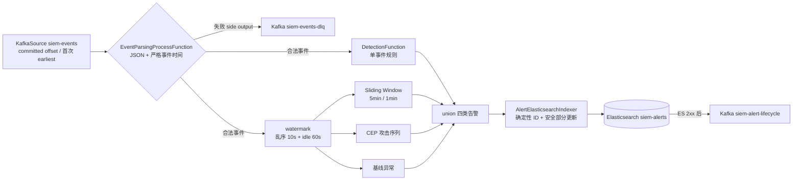

# 功课 5 — Flink 概念与在 SIEM 中的角色

> 本文档给出 Apache Flink 的核心概念定义,并以 `DetectionJob.java` 为实例拆解各算子的作用。重点理解流处理模型、事件时间与 watermark、窗口、状态与容错。

## 1. 定义

**Apache Flink** 是一个分布式流处理引擎。数据以**数据流(DataStream)**的形式按事件顺序流经各算子(operator,即处理步骤),引擎统一管理并行、容错与时间处理。

**定义要点**:
- **有状态**:算子可以保存中间状态(如"某 IP 已失败几次"),跨事件记忆。
- **事件时间**:支持按事件自身携带的时间(而非处理时间)进行窗口与聚合,并容忍乱序。
- **容错**:通过 checkpoint 定期保存状态快照,故障后从最近一次快照恢复。

## 2. 为什么 SIEM 需要 Flink(角色定位)

**定义**:Flink 在本项目中承担**实时检测引擎**的角色,是"规则引擎"的运行时:

| 能力 | 说明 | 场景举例 |
| --- | --- | --- |
| **实时** | 事件到达即检测,无需定时批处理 | 认证失败事件到达后立即逐条匹配规则 |
| **有状态** | 跨事件记忆,支持窗口统计 | 统计"某源 IP 5 分钟内失败次数" |
| **事件时间** | 按攻击发生时间聚合,容忍乱序 | 网络延迟导致的乱序事件仍按日志时间归入正确窗口 |
| **容错** | checkpoint 使重启后从断点恢复 | Flink 故障重启后,从最近 checkpoint 继续消费,不重不漏(配合幂等) |

## 3. 核心概念

### 3.1 程序结构:Source → Operators → Sink

**定义**:一个 Flink 作业由三部分构成——**Source**(数据来源)、**Operators**(处理步骤)、**Sink**(结果写出)。数据流按顺序流经这些算子。

`DetectionJob.java` 的对应:

```
SingleOutputStreamOperator<Event> parsed = env
    .fromSource(KafkaSource, ...)      // Source:从 Kafka siem-events 读取事件
    .process(EventParsingProcessFunction) // Operator:解析事件；毒消息送 side output DLQ
    .flatMap(new DetectionFunction(...)) // Operator:逐条规则匹配(1 事件 → 0/多 告警)
    .sinkTo(ES)                        // Sink:告警写入 ES siem-alerts
```

**场景举例(1 对多的算子)**:`flatMap` 与 `map` 的区别在于,`map` 每个输入产生恰好一个输出,而 `flatMap` 每个输入可产生 0 个或多个输出。检测场景中,一条事件可能命中 0 条、1 条或多条规则,因此必须使用 `flatMap`。

### 3.2 分组(keyBy)与状态

**定义**:`keyBy(field)` 按指定字段将流拆分为多个独立子流,每个 key 拥有独立的状态与统计;状态(state)是算子保存的、跨事件记忆的数据。

**场景举例(按源 IP 分组统计)**:检测"同一源 IP 5 分钟内失败次数",必须按 `source.ip` 分组——不同 IP 的失败次数互不干扰,每个 IP 独立统计。若不分 key,无法区分"IP A 失败 5 次"与"IP B、C、D 各失败 5 次"。

### 3.3 事件时间与 watermark

**定义**:
- **事件时间(event time)**:事件自身携带的发生时间(如日志的 `@timestamp`)。
- **乱序(out-of-order)**:由于网络延迟,时间早的事件可能晚于时间晚的事件到达。
- **watermark(水位线)**:表示"时间戳不超过 watermark 的事件应当都已经到达"的时间标记。当 watermark 越过窗口边界时,该窗口关闭并触发计算。

**watermark 的推进规则**:采用有界乱序策略 `forBoundedOutOfOrderness(B)` 时,watermark = 当前看到的最大事件时间 − B(乱序容忍)。因此总等待时间 = 乱序容忍 + watermark 发射周期。

**场景举例(乱序事件)**:事件 A(`10:20:00`)因网络延迟在事件 B(`10:20:04`)之后到达。若按处理时间分组,二者会被错误拆到不同窗口;事件时间 + watermark 则按日志时间归组,保证正确聚合。

**关键问题(日志暂停)**:若事件流长时间无新事件,watermark 不会推进,已开始的窗口可能迟迟不关闭。解决方案是 `withIdleness`——当某个输入空闲超过阈值时,强制推进 watermark,使窗口及时关闭。本项目窗口分支当前缺少该配置,已列入设计稿 P1。

### 3.4 窗口(window)

**定义**:窗口将无限的数据流切分为有限的时间/数量片段,对每个片段独立计算。窗口是检测"量"类模式的载体。

| 窗口类型 | 定义 | 适用场景 | 本项目 |
| --- | --- | --- | --- |
| **tumbling(滚动)** | 固定对齐、不重叠的等宽窗口 | 定长周期计数 | 未配置 `slidingMinutes` 的窗口规则 |
| **sliding(滑动)** | 固定长度、固定步进的窗口(有重叠) | 跨边界连续监控 | 当前暴力破解规则：5 分钟窗口、1 分钟步长 |
| **session(会话)** | 按活动间隙聚类 | 用户会话/扫描突发 | 未使用 |

**场景举例(滚动窗口的边界盲区)**:滚动窗口固定对齐,攻击者在 4:59 失败 4 次、5:01 失败 1 次——两次分别落在两个对齐窗口中,各自未达阈值 5,但合计已达 5 次,因此滚动窗口**不触发告警**。当前规则使用滑动窗口覆盖该跨边界模式，再用告警抑制减少相邻窗口重复；代价是维护重叠窗口状态。

### 3.5 容错:checkpoint 与 savepoint

**定义**:
- **checkpoint**:Flink 自动、周期性保存的状态快照,用于故障恢复。
- **savepoint**:手动触发的状态快照,用于作业升级或迁移。

**一致性语义**:
- **exactly-once**:每条数据精确处理一次(不重不漏)。
- **at-least-once**:每条数据至少处理一次(可能重复)。

**场景举例(本项目的一致性边界)**:Flink 的 ES 写入和 lifecycle Kafka Sink 采用 **at-least-once** 语义——作业恢复可能重放少量在途记录。当前实现以 `rule_id + 实体 + 事件时间` 生成确定性 `_id`，使 ES 重放收敛到同一文档；已有告警只更新检测字段，保护分析师状态。lifecycle 重复消息再由 execution 唯一键去重。

### 3.6 背压(backpressure)

**定义**:当下游算子处理速度低于上游时,Flink 会自动抑制上游传输速率,使处理速度与消费速度匹配,而非无限堆积内存。这是流处理框架内置的"自适应限速"机制。

**场景举例**:检测算子因规则复杂度高而变慢时,上游不会继续灌入大量事件撑爆内存,而是减速,事件在 Kafka 中排队等待。

## 4. DetectionJob 逐步拆解

`flink/src/main/java/com/siem/DetectionJob.java` 完整数据流:



## 5. 常见问题与设计关注点

1. **`earliest()` 重放历史**:必须使用 `committedOffsets(EARLIEST)`,否则作业重启从头读取,重放全部历史事件,产生重复告警。
2. **checkpoint 生命周期**:当前 Compose 已挂载 `flink-checkpoints` named volume；`docker compose down -v` 仍会删除它，普通 cancel 也按当前 cleanup mode 删除 checkpoint，升级恢复应使用 savepoint。
3. **ES 至少一次重放**:当前使用确定性 `_id`，且已有告警只 partial update 检测字段；不能删掉该保护或覆盖分析师状态。
4. **idle 分区拖住 watermark**:当前使用 `withIdleness(60s)`；新增事件时间分支必须复用同一 watermark 流，不能各自定义冲突语义。
5. **算子无 `.uid()`**:缺少 `.uid()` 时,作业升级后无法从 savepoint 恢复状态,需为所有有状态算子设置。

## 6. 动手验证

```bash
# 查看作业运行状态
docker exec siem-flink-jobmanager flink list

# 访问 Web UI 查看算子、checkpoint、背压情况
# 浏览器打开 http://localhost:8081

# 用 savepoint 停止并恢复（普通 cancel 默认会删除 checkpoint）
docker exec siem-flink-jobmanager flink stop -p file:///opt/flink/savepoints <JobID>
docker exec siem-flink-jobmanager flink run -d -s file:///opt/flink/savepoints/<savepoint> /opt/flink/detection-job-1.0.jar
```

## 7. 自测

1. 四类规则在 Flink 中如何汇合?（单事件、窗口、CEP、基线流通过 `union` 合并为同一告警流）
2. watermark 的作用是什么?(标记"该时间之前的事件应已到达",决定窗口何时关闭)
3. 单机小状态下为何不必使用 RocksDB 状态后端?(状态量 <1GB,默认 HashMap 状态后端足够)
4. at-least-once 语义下如何防止重复告警?(确定性 `_id`,使重放写入变为幂等覆盖)
