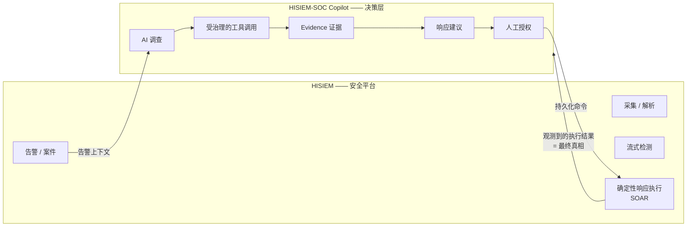
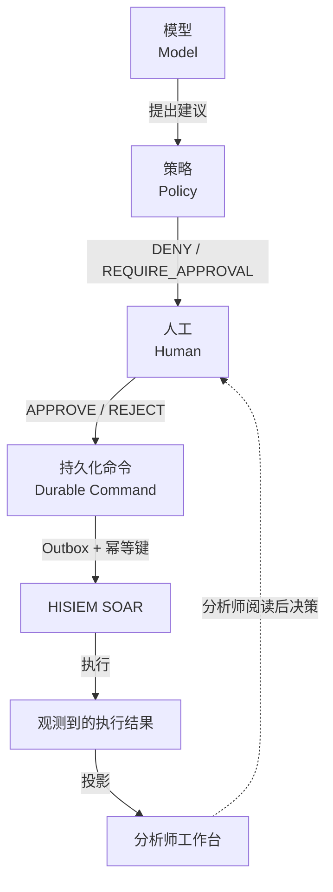
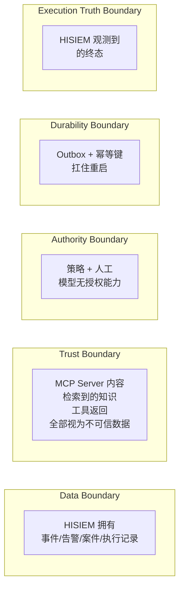
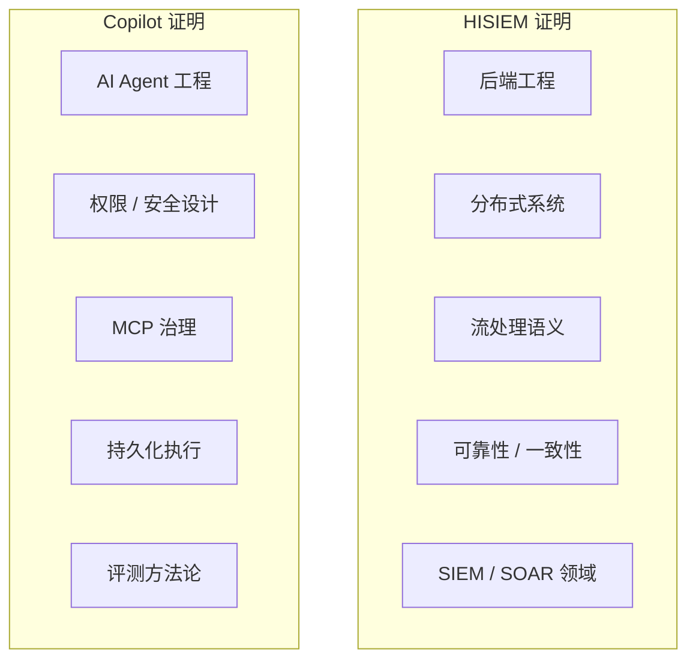

# 00 · 双项目面试复习总览

> 这份文档的目标：让你在 10 分钟内建立起"**两个仓库是一个系统**"的完整认知，并知道每一块该去哪里深挖。

---

## 1. 为什么会有两个仓库

这不是"两个练手项目"，而是**同一个系统按权限边界切成的两半**。



**为什么必须拆开：**

| 维度 | HISIEM | Copilot |
|---|---|---|
| 正确性模型 | 事务性、确定性、权威 | 概率性、自适应、只做建议 |
| 失败后果 | 漏检 / 重复告警 / 数据不一致 | 建议错了，但不会误执行 |
| 信任假设 | 平台代码可信 | **模型输出不可信** |

如果把两者合并，模型的"不确定性"就会渗进执行路径。拆开之后，**平台永远不需要知道 Agent 的存在**。

---

## 2. 一句话记住每个项目

```text
HISIEM  =  数据从哪来 + 怎么检测 + 怎么执行 + 执行结果谁说了算
Copilot =  怎么调查 + 怎么组织证据 + 怎么给建议 + 怎么保证不越权
```

**边界一句话：HISIEM 拥有执行真相；Copilot 拥有调查、推理与响应建议。**

---

## 3. 权限链条（整个作品集的核心）



```text
Model proposes  →  Policy constrains  →  Human authorizes
Durable command records intent  →  HISIEM executes  →  Copilot observes
```

**这句话必须在面试里能一口气说出来，并且能解释每一个箭头为什么存在。**

---

## 4. 需要牢牢记住的九条"不等于"

这些是本作品集**最有区分度**的部分。面试官如果只记住一件事，应该是这个。

| 不等于 | 含义 | 谁在保证 |
|---|---|---|
| **ToolResult ≠ Evidence** | 工具返回是数据，不是事实；工具失败产出**零** Evidence | `EvidenceNormalizer` |
| **Knowledge ≠ Verdict Authority** | 知识只能提供支持性上下文，不能单独支撑确定性结论 | 知识权限类别 + 硬门禁 |
| **Agent Verdict ≠ Analyst Disposition** | 模型结论是建议，不是分析师的判定 | 独立持久化字段 |
| **Policy ≠ Human Approval** | 策略是规则应用，审批是人给的同意 | 独立聚合 |
| **Human Approval ≠ Execution** | 批准授权的是"意图"，不是执行本身 | Durable Command |
| **Submission ≠ Execution Success** | 交出去 ≠ 成功 | 两套状态机 |
| **Telemetry ≠ Business Truth** | 丢遥测不能改变任何业务结果 | 无业务路径读 trace |
| **Frontend ≠ Authority** | 前端只派生展示，不发明状态 | 刷新以服务端为准 |
| **LangGraph Checkpoint ≠ Domain Truth** | 图状态是工作内存，不是业务状态 | 独立 schema |

**唯一一条"等于"：**

```text
HISIEM observed execution result  =  最终执行真相
```

---

## 5. 五条边界（跨系统必须能指出来）



| 边界 | 位置 | 越界的后果 |
|---|---|---|
| **Data Boundary** | HISIEM 拥有安全数据与执行记录；Copilot 只读 + 自己产出调查数据 | 出现"第二份真相" |
| **Trust Boundary** | 所有远程/检索内容一律当数据 | 提示注入可以改写工具选择、租户范围、结论 |
| **Authority Boundary** | 位于"结论"与"策略"之间 | 模型输出直接产生副作用 |
| **Durability Boundary** | 人工批准之后、提交之前 | 重启后命令丢失，或重复执行 |
| **Execution Truth Boundary** | Copilot 的"提交记录" vs HISIEM 的"执行记录" | 系统自信地报告错误结果 |

---

## 6. 两个项目的技术主题分布（避免听起来重复）

面试时最大的风险是：两个项目听起来都像"用了 Kafka 和测试的系统"。必须让它们**证明不同的能力**。



| HISIEM 讲这些 | Copilot 讲这些 |
|---|---|
| Event Time / Watermark / 窗口 / CEP | 权限模型 / 工具治理 / Evidence |
| Checkpoint 状态一致性 vs Sink 投递语义 | 人工授权 / TOCTOU / 持久化执行 |
| Outbox / Lease / Fencing | MCP Discovery-Admission-Selection |
| SOAR 工作流引擎并发安全 | 非补偿性评测 / 架构边界测试 |

**不要做的事：**
- 不要把 HISIEM 说成 AI 项目（它是流处理平台，把它讲成 AI 反而削弱它）
- 不要把 Copilot 说成"更安全的 SIEM"（它不是 SIEM，它不检测）
- 不要在两个项目里重复讲同一件事（例如两边都讲 Kafka）

---

## 7. 一条完整的端到端故事（必须能讲）

```text
Log
 → Logstash 解析（失败进 raw 索引）
 → Elasticsearch + Kafka
 → Flink 校验 → 打时间戳 → Watermark
 → 单事件 / 窗口 / CEP / 基线 检测
 → Alert 写入 ES（确定性 _id）
 → ES 写成功后才发 alert.created 到 Kafka
 → Copilot 启动 Investigation（LangGraph）
 → 模型从 4 个只读工具中选择
 → ToolResult → EvidenceNormalizer → Evidence
 → Finding → Verdict
 → Response Proposal
 → Policy：DENY / REQUIRE_APPROVAL
 → 人工审批（绑定 revision + hash）
 → Outbox → Dispatcher → 幂等提交
 → HISIEM SOAR 执行（Lease + Fencing）
 → Copilot 观测到终态（= 真相）
 → Workspace 从持久化状态重建
```

**这条链上最容易被追问的三个点：**
1. 为什么 Alert 要等 ES 写成功才发事件？（因为下游不能知道一个不存在的告警）
2. 为什么审批要绑 hash？（因为审批后意图可能被改）
3. 为什么终态以 HISIEM 为准？（因为 Copilot 只有"信念"，HISIEM 有"记录"）

---

## 8. 复习节奏建议

| 时间 | 做什么 |
|---|---|
| 第 1 遍 | 通读本文件 + 两份 `01_系统架构`，只看图 |
| 第 2 遍 | 通读两份 `02_核心场景数据流`，**每个场景口述一遍** |
| 第 3 遍 | 读 `Cross-System/01`，练"两分钟讲清两个项目的关系" |
| 第 4 遍 | 精读两份 `03_核心知识点`，重点看"常见错误理解" |
| 面试前 | 只看各文档的「一句话记忆」和「常见错误理解」两节 |

---

## 9. 一句话记忆

```text
两个仓库，一个系统，按权限切。
HISIEM 管执行真相，Copilot 管调查与建议。
模型只能提议，不能授权。
```
