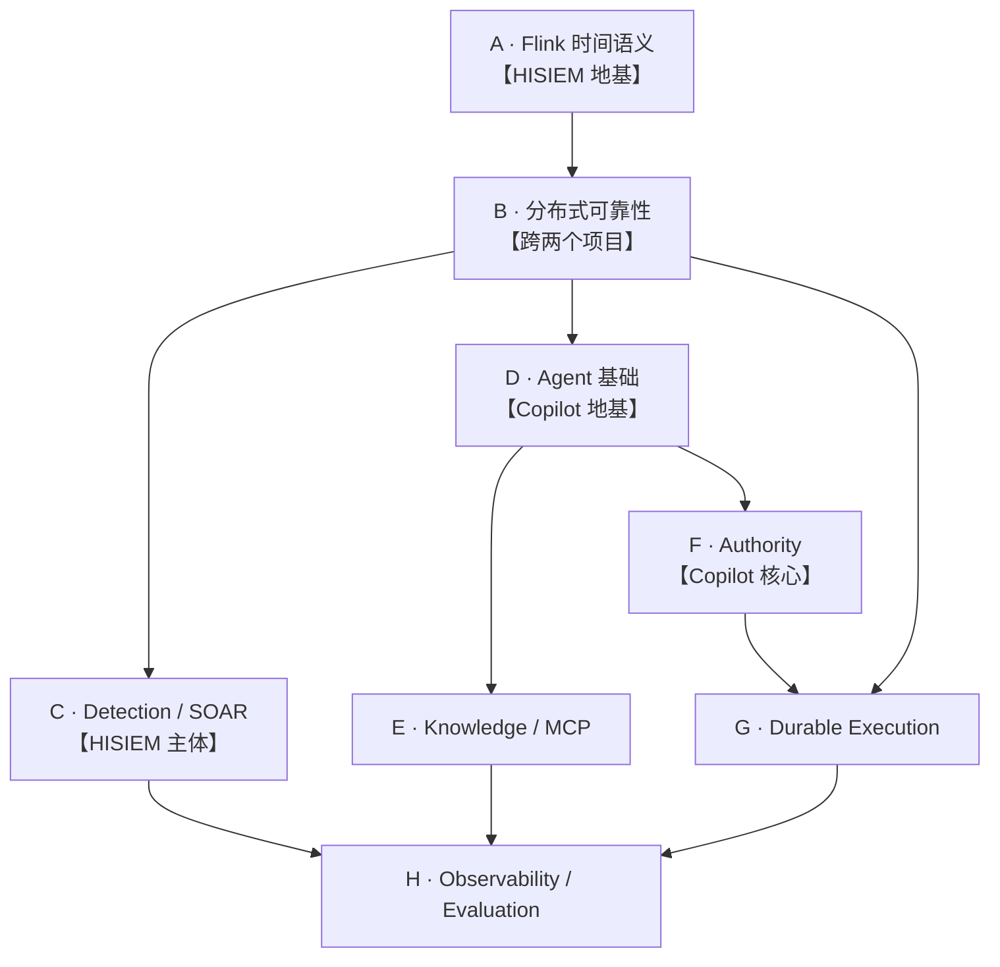

# 01 · 面试学习路线与优先级

> **这份文件回答一个问题："我该按什么顺序学，哪些必须会，哪些只要知道？"**
>
> 第一阶段（`03_*_核心知识点.md`）是**完整教材**；本文件是**路线图**，负责决定学习顺序与投入分配。
> 按**知识依赖**组织，不按文件目录组织。

---

## 0. 怎么用这份文件

```text
第一次学   → 看 03_核心知识点（完整教材）
第二次复习 → 看 04_重点专题精炼（复习卡）
面试前     → 看 Cross-System/02_双项目关键边界速记（10 分钟）
```

**本文件的作用：** 决定"先学哪个、学到什么程度就停"。

**一条总原则：** 先把**依赖链上游**打通。上游没通，下游只能背，一被追问就崩。

---

## 1. 学习路线总图



**依赖关系说明：**

| 阶段 | 为什么在这个位置 |
|---|---|
| **A** | 不懂 Watermark 就读不懂 HISIEM 的检测分支；不懂 Checkpoint 就读不懂恢复 |
| **B** | A 之后、C/D 之前：可靠性概念是两个项目**共用**的（HISIEM 的 Outbox / Copilot 的 Outbox 是同一套思想） |
| **C** | HISIEM 主体。依赖 A（窗口/CEP）与 B（Outbox/Lease） |
| **D** | Copilot 地基。依赖 B（工具调用要懂失败语义） |
| **E** | Agent 的能力面。依赖 D（工具治理打完基础再看检索与 MCP） |
| **F** | Copilot 的核心差异点。依赖 D/E（先知道模型能做什么，再谈它能授权什么） |
| **G** | 依赖 F（先有审批，才谈持久化命令）与 B（Outbox 概念） |
| **H** | 收口。依赖 C（HISIEM 的评测对象）与 G（Copilot 的观测对象） |

---

## 2. 阶段 A · Flink 时间语义

### 前置知识
无。这是整个 HISIEM 的地基。

### 学习目标
能讲清"一条**延迟 7 秒**到达的事件，为什么**不是**迟到"，并且能画出 Watermark 推进的时间线。

### 必须掌握
- Event Time vs Processing Time 的区别，以及**本项目两者都用在哪**
- Watermark 的断言语义，以及它**不是**什么（不是过滤器、不是保证、不是每 key）
- `watermark = max_observed − 10s − 1ms` 里那个 `−1ms` 的作用（闭区间）
- Idleness 作用在**输入通道**，不是 key
- **本项目没有 allowedLateness、没有 late-event side output**，以及这带来的后果

### 理解即可
- Timestamp Assigner 为什么放在解析算子之后
- 窗口触发条件的精确定义（`watermark ≥ maxTimestamp`）

### 暂时不用深挖
- Flink 内部 watermark 对齐机制（barrier alignment 的实现细节）
- 自定义 `WatermarkGenerator` 的写法

### 推荐阅读
- `HISIEM/03_HISIEM_核心知识点.md` → H01 ~ H08
- `HISIEM/02_HISIEM_核心场景数据流.md` → 场景 2

### 推荐代码入口
```text
flink/src/main/java/com/siem/DetectionJob.java:170-177   ← 水印生成
flink/src/main/java/com/siem/DetectionJob.java:187       ← 单事件分支（不走水印）
flink/src/main/java/com/siem/AlertSuppressor.java:65,76  ← 处理时间抑制
flink/src/main/java/com/siem/EventParsingProcessFunction.java
```

### 完成标准
- [ ] 能画出"e1@10:40:30 → e2@10:40:40 → e3@10:40:35"的 Watermark 时间线并解释 e3 为什么不晚
- [ ] 能说出 idleness 的**粒度**，并能说出它在**本拓扑**里可能救不了场的情形
- [ ] 能不问自答地声明"没有 allowedLateness"

---

## 3. 阶段 B · 分布式可靠性

### 前置知识
阶段 A（至少要懂 Checkpoint 是什么）。

### 学习目标
能讲清"**Flink 状态 exactly-once 与 Kafka sink at-least-once 为什么不矛盾**"，并能解释**为什么租约不够、还需要 fencing token**。

### 必须掌握
- Exactly-Once **State** 与 At-Least-Once **Delivery** 分别覆盖什么
- 确定性标识（deterministic identity）如何把重复投递变无害
- Transactional Outbox 解决的是**双写问题**，给的是 **at-least-once + 因果关联**，不是 exactly-once
- Lease vs Fencing Token：一个管**时间窗口**，一个管**可拒绝性**
- 最终一致 ≠ 强一致

### 理解即可
- 幂等键为什么用**业务身份**而不是尝试序号
- Outbox 的 `available_at` / `locked_until` / `lease_owner` 三列各自的作用

### 暂时不用深挖
- 两阶段提交 / XA 的实现细节（只需要知道"为什么不用"）
- Kafka 事务生产者

### 推荐阅读
- `HISIEM/03_HISIEM_核心知识点.md` → H12、H13、H15、H16
- `Copilot/03_Copilot_核心知识点.md` → C22、C23

### 推荐代码入口
```text
# HISIEM
flink/src/main/java/com/siem/DetectionJob.java:449-470   ← 确定性 alert id
flink/src/main/java/com/siem/AlertElasticsearchIndexer.java
modules/platform-migrations/.../V7__outbox_task_leases.sql
modules/platform-migrations/.../V19__lifecycle_outbox.sql
# Copilot
src/hisiem_soc_copilot/infrastructure/durable/dispatcher.py
```

### 完成标准
- [ ] 能一口气说清"状态 exactly-once / 投递 at-least-once / 靠确定性 id 收敛"，并说明三者管的不是同一件事
- [ ] 能解释"为什么 only-lease 不够"（暂停的持有者过期后仍会写）
- [ ] 能把 Outbox 与"直接发消息"的区别讲出来（双写问题）

---

## 4. 阶段 C · Detection / SOAR

### 前置知识
阶段 A（窗口/CEP）+ 阶段 B（Outbox/Lease）。

### 学习目标
能讲清**滑动窗口为什么必要**，以及**SOAR 引擎与"内存脚本"的本质区别**。

### 必须掌握
- 滑动窗口消除**边界盲区**（用 `3 + 2 vs 阈值 5` 的例子，不要说 `5 + 5`）
- 滑动窗口的代价（每事件被多次求值）与配套收敛（`WindowAlertSuppressor` + 确定性 `_id`）
- CEP 解决的是**序列**问题，不是计数问题
- 告警生命周期里的**顺序**：ES 写成功 **之后**才发 `alert.created`
- SOAR 的**逐节点推进** + **人工节点落库挂起**
- 节点副作用的幂等性是 **connector 的责任**，引擎不保证

### 理解即可
- `next` vs `followedBy`（严格/宽松连续）的取舍
- 基线异常检测是 μ + kσ 统计规则，**不是机器学习**

### 暂时不用深挖
- SOAR 全部 11 个节点处理器的实现
- Playbook 图校验规则的细节

### 推荐阅读
- `HISIEM/02_HISIEM_核心场景数据流.md` → 场景 3、4、7、8
- `HISIEM/03_HISIEM_核心知识点.md` → H06、H09、H17、H18

### 推荐代码入口
```text
flink/src/main/java/com/siem/DetectionJob.java:203-222   ← 窗口分支
flink/src/main/java/com/siem/DetectionJob.java:230-247   ← CEP 分支
flink/src/main/java/com/siem/WindowAlertSuppressor.java
modules/soar-core/.../soar/SoarExecutionEngine.java
modules/soar-core/.../soar/execution/handler/
```

### 完成标准
- [ ] 能用 `12:04 → 3 次 / 12:06 → 2 次 / 阈值 5` 讲清边界盲区
- [ ] 能说出滑动窗口的代价，并立刻接上"重复由谁收敛"
- [ ] 能解释 SOAR 的人工节点为什么不占住 worker

---

## 5. 阶段 D · Agent 基础

### 前置知识
阶段 B（失败语义）。

### 学习目标
能讲清"**工具失败为什么产出零 Evidence**"，以及**为什么 Policy/Budget 必须在 Provider 之前**。

### 必须掌握
- LangGraph 的**有界工作内存**定位（不是对话历史，不是业务状态）
- 图结构：`load → hydrate → plan → decide_next ⇄ execute_and_ingest → assess → finalize`
- 工具治理**五道关卡**与**顺序**
- `ToolResult ≠ Evidence`，以及那个**具体故障故事**（MCP server 挂了 → 不能变成"没有发现"）
- **四个模型可选的只读工具** + 一个**系统控制**工具（模型不可选）

### 理解即可
- `ProviderFailureCode` 有 11 类（记住"有类型化失败"即可，不必背全）
- `ResultBounds` 是**硬拒绝上限**，不是截断指令

### 暂时不用深挖
- 全部 15 个 port 的接口签名
- 图 checkpoint 的存储实现细节

### 推荐阅读
- `Copilot/01_Copilot_系统架构与核心组件.md` → 第 3、4、5 节
- `Copilot/02_Copilot_核心场景数据流.md` → 场景 2、3、4
- `Copilot/03_Copilot_核心知识点.md` → C02、C04 ~ C09

### 推荐代码入口
```text
src/hisiem_soc_copilot/agent/graph/builder.py       ← 图装配与路由
src/hisiem_soc_copilot/agent/tools/registry.py      ← 动作空间
src/hisiem_soc_copilot/agent/tools/executor.py      ← 可信上下文注入
src/hisiem_soc_copilot/agent/evidence/normalizer.py ← 证据归一化
src/hisiem_soc_copilot/agent/tools/providers.py     ← 类型化失败契约
```

### 完成标准
- [ ] 能讲出"MCP server 停掉"这个具体故障，以及边界如何阻断它
- [ ] 能说出四个模型可选工具的**准确措辞**（含"还有一个系统控制工具"）
- [ ] 能解释 Policy/Budget 前置的理由（否则拒绝时副作用已发生）

---

## 6. 阶段 E · Knowledge / MCP

### 前置知识
阶段 D（工具治理）。

### 学习目标
能讲清"**发现 ≠ 准入 ≠ 选择**"，以及**为什么知识不能支撑确定性结论**。

### 必须掌握
- **Discovery ≠ Admission ≠ Selection** 三者的差异，以及"**描述是提示面**"这个理由
- 四种失效闭合控制：Schema 指纹 / 协议固定 / 只读分类 / 拒绝而非截断
- 知识检索的机制：FTS + pgvector + **RRF**（以及为什么不用加权分数融合）
- 引用必须解析到**不可变的**内容分块
- 权威边界：**知识 ≠ 平台事实**，**知识-only 不能形成确定性结论**

### 理解即可
- `RRF_K = 60` 是论文原值并冻结为常量
- `MAX_RESULT_LIMIT = 5`，超出被拒绝

### 暂时不用深挖
- pgvector 的索引类型与查询计划
- ATT&CK 单写者切换的事务实现

### ⚠️ 本阶段最容易踩的坑
```text
必须主动声明：没有真实 embedding provider，
混合检索证明的是【接线正确】，不是【语义检索质量】。
产物标记 PLUMBING_ONLY。
```

### 推荐阅读
- `Copilot/01_Copilot_系统架构与核心组件.md` → 第 6、7 节
- `Copilot/02_Copilot_核心场景数据流.md` → 场景 5、6
- `Copilot/03_Copilot_核心知识点.md` → C10 ~ C14

### 推荐代码入口
```text
src/hisiem_soc_copilot/infrastructure/mcp/provider.py
src/hisiem_soc_copilot/application/services/knowledge_retrieval.py
docs/p3/retrieval-contract.md      ← 注意 DRIFT-001
docs/p3/security-boundary.md       ← 注意 DRIFT-001
```

### 完成标准
- [ ] 能说出"为什么要自己写可信描述"
- [ ] 能说出超限为什么拒绝而不是截断
- [ ] **能在被问"检索质量怎么样"之前就主动说明未验证**

---

## 7. 阶段 F · Authority

### 前置知识
阶段 D、E（先知道模型能做什么）。

### 学习目标
能讲清"**从模型输出到副作用之间不存在代码路径**"，并能给出**两个具体防住的 bug**。

### 必须掌握
- 权限链条六段：`Model proposes → Policy constrains → Human authorizes → Durable command records intent → HISIEM executes → Copilot observes`
- 权限边界的位置：**在"结论"与"策略"之间**
- **Policy ≠ Human Approval**（规则应用 vs 同意）
- **Approval ≠ Execution**（授权意图 vs 执行）
- **TOCTOU**：审批绑定 `content_revision` + `content_hash`
- **provenance 被刻意排除**在可批准契约之外

### 理解即可
- `PolicyDecision` 只有 `DENY | REQUIRE_APPROVAL` 两种
- `ResponseActionKey` 的四个动作

### 暂时不用深挖
- 提案聚合的完整状态转移图

### 推荐阅读
- `Copilot/01_Copilot_系统架构与核心组件.md` → 第 8、9、10 节
- `Copilot/02_Copilot_核心场景数据流.md` → 场景 7 ~ 10
- `Copilot/03_Copilot_核心知识点.md` → C17 ~ C21

### 推荐代码入口
```text
src/hisiem_soc_copilot/domain/response/aggregate.py:57-125   ← TOCTOU 绑定
src/hisiem_soc_copilot/domain/response/enums.py
src/hisiem_soc_copilot/domain/response/value_objects.py
```

### 完成标准
- [ ] 能说出"为什么策略与人审批是两件事"
- [ ] 能解释 provenance 为什么被排除（不该影响审批有效性）
- [ ] 能说出 E3 特意加的**过期绑定路径**（证明门禁能失败）

---

## 8. 阶段 G · Durable Execution

### 前置知识
阶段 B（Outbox）+ 阶段 F（审批）。

### 学习目标
能讲清"**为什么不确定的结果必须能被表达**"。

### 必须掌握
- 权限之后、执行之前的位置为什么关键（可能隔几秒到几小时）
- **业务身份幂等键** `response:<tenant>:<proposal>`，以及为什么不用尝试序号
- 有界重试：`_MAX_ATTEMPTS = 10`、`_MAX_BACKOFF_SECONDS = 120`
- **`ATTENTION_REQUIRED` = 结果不确定**，不是错误
- **Submission ≠ Execution Success**：没有任何提交状态的值意味着成功
- **HISIEM 观测到的状态 = 最终执行真相**

### 理解即可
- Outbox 的租约回收与 dead-letter
- observe runner 的轮询直到终态

### 暂时不用深挖
- dispatcher 的完整失败分支（记住那个"resolver 失败曾 dead-letter"的 bug 即可）

### ⭐ 加分项
```text
主动说出修复过的两个持久化 bug：
  ① dispatcher resolver 失败会 dead-letter 本该重试的命令
  ② 尝试计数 off-by-one
"发现了并修好的 bug" 是很强的信号。
```

### 推荐阅读
- `Copilot/02_Copilot_核心场景数据流.md` → 场景 11、12、13
- `Copilot/03_Copilot_核心知识点.md` → C22 ~ C25

### 推荐代码入口
```text
src/hisiem_soc_copilot/infrastructure/durable/dispatcher.py
src/hisiem_soc_copilot/infrastructure/durable/response_runner.py
src/hisiem_soc_copilot/domain/response/enums.py
```

### 完成标准
- [ ] 能解释"为什么重试耗尽不是 FAILED"（FAILED 是对副作用的断言）
- [ ] 能说出"幂等键的作用域是最难做对的部分，而且是一次正确性修复"
- [ ] 能回答"如果 Copilot 和 HISIEM 不一致"→ HISIEM 赢

---

## 9. 阶段 H · Observability / Evaluation

### 前置知识
阶段 C（HISIEM 的评测对象）+ 阶段 G（Copilot 的观测对象）。

### 学习目标
能讲清"**跨持久化边界的因果怎么表达**"与"**非补偿性是什么意思**"。

### 必须掌握
- 异步边界用 **Link**（新 root + Link 到原 trace），不用 parent-child，以及为什么
- 指标标签白名单**失败闭合**（整条拒绝），以及**隐私**理由而不只是基数
- **停掉 Collector 不改变业务结果**（这是被真实验证过的）
- **XP-01：29 场景 / 13 非补偿性硬门禁 / 9 家族**
- **非补偿**：没有分数，一个失败就是全部失败
- **同一时间只允许一次** 的架构测试数字口径：**285 个测试用例**（大量逐模块参数化），**不是 285 条不变量**

### 理解即可
- GP-01 的"先密封再打分"逻辑
- KB-GOLDEN-V1 的语料前置校验

### 暂时不用深挖
- OTel SDK 的实现细节
- 评测 harness 的全部适配器

### 推荐阅读
- `Copilot/03_Copilot_核心知识点.md` → C26、C28、C29、C30
- `Cross-System/01_HISIEM_Copilot_端到端架构与数据流.md` → 第 8 节

### 推荐代码入口
```text
src/hisiem_soc_copilot/infrastructure/observability/{context,metrics}.py
src/hisiem_soc_copilot/evaluation/cross_plane/catalog.py
tests/architecture/            ← 用 pytest 跑一遍看数字
docs/stage-reports/
```

### 完成标准
- [ ] 能解释 Link vs parent-child 的因果差异
- [ ] 能说出"一个失败就是全部失败"，并说明为什么不要分数
- [ ] **能主动说 285 是测试用例数、多为逐模块参数化**

---

## 10. 薄弱点重新评估

按**面试被问概率 × 答错成本 × 与简历 bullet 关联度 ÷ 学习投入**排序。

### P0 —— 面试前必须补齐

| 薄弱点 | 为什么是 P0 | 补齐方式 | 预计投入 |
|---|---|---|---|
| **CEP 状态开销** | 简历写了 CEP；"状态多大"是必然追问 | 只需能说：每个 key 保留部分匹配状态、持续 `within()` 时长、**是作业里最大的状态**、直接影响 checkpoint 大小与时长 | 30 分钟 |
| **Backpressure** | 简历写了异步 ES Sink；"ES 挂了会怎样"是高频追问 | 记住三个数：`esMaxBufferedRequests = 500`、`esMaxInFlightRequests = 3`、`esMaxTimeInBufferMs = 500`；能讲"缓冲填满 → 背压上传 → 拖慢检测"。**明确说没有实测吞吐** | 40 分钟 |
| **DRIFT-001** | 答错就直接翻车（说"知识不可达"） | 记住正确表述：**四个模型可选只读工具，含两个 knowledge 工具** | 15 分钟 |
| **Workspace Projection** | 是 XP-01 的两个 WORKSPACE 场景之一 | 记住五条约束 + 两个事实码（`RECONSTRUCTED_FROM_DURABLE_STATE` / `STALE_OVERRIDDEN_BY_REFRESH`） | 30 分钟 |

### P1 —— 能解释即可

| 薄弱点 | 为什么是 P1 | 需要达到的程度 |
|---|---|---|
| **GP-01 内部流程** | 简历只用"端到端调查正确性"概括，被深挖概率中等 | 能说出四段：materialize → seal → real model run → deterministic score（+ 重复性 3/3）。**不需要**细讲 materializer 实现 |
| **KB-GOLDEN-V1 评分逻辑** | 与"语义质量未验证"绑定，会被一并问到 | 能说出三种检索模式（HYBRID / LEXICAL_ONLY / VECTOR_ONLY）+ 语料前置校验存在。**主动带出 PLUMBING_ONLY** |
| **Flink 2.1 版本差异** | 容易被问"Flink 哪个版本"，答错显生疏 | 只需记住：**Flink 2.1**；`RestartStrategies` 工厂已移除，改用 `Configuration` 选项（这一点代码里明确注释了） |
| **HISIEM Frontend** | 简历没写前端；但工作台在 HISIEM 仓库这点必须能解释 | 只需能说：UI 在 `HISIEM/web/`（5 个 Playwright spec、`utils/copilot.js` 含权威类别派生）。**不需要**读 Vue 文件 |
| **Copilot Ports** | 简历没写端口；但"你怎么解耦"可能被问 | 能说出**数量是 15 个 port 模块**、以及 3~4 个代表性的（`unit_of_work`、`model_provider`、`durable`、`trust`）。**不要逐个背** |

### P2 —— 当前不值得投入时间

| 薄弱点 | 为什么是 P2 |
|---|---|
| **DEFECT-005** | 已知且低影响：MCP 不可用被分类为 `PROVIDER_ERROR` 而非 `UNAVAILABLE`；**行为仍是 fail-closed + 零 Evidence**。只需一句话能带过，不必深挖分类逻辑 |
| **TEST-INFRA-001** | **纯测试基础设施**问题（DB 支持模块绕过 skip 守卫），与产品正确性无关。被问概率极低 |
| **历史文档 Drift（系统性扫描）** | 只做了一次针对性核查（DRIFT-001）。**系统扫描全部 21 份 Copilot 文档 + 17 份 HISIEM 文档的投入产出比很低**——面试官不会问"你还有几处 drift"。保持 DRIFT-001 已登记即可 |

---

## 11. 复习节奏建议

| 时间点 | 做什么 | 目标 |
|---|---|---|
| **第一次** | 按 A→H 顺序读 `03_*_核心知识点.md` | 建立依赖链，不求记住 |
| **第二次** | 读 `04_*_重点专题精炼.md`，逐卡打勾 | 标记"能独立口述 / 能应对追问" |
| **第三次** | 只看打勾为"未学习 / 理解"的卡 | 消灭空白 |
| **面试前 1 天** | 读 `Cross-System/02_双项目关键边界速记.md` | 保证边界不说错 |
| **面试前 10 分钟** | 只看速记文件的**一句话记忆**列 | 不引入新信息 |

**一条纪律：** 面试前 10 分钟**不要**读新知识。只复习"一句话记忆"与"最容易说错的地方"。

---

## 12. 优先级总表（一页）

```text
P0 必须补齐（共约 2 小时）
  · CEP 状态开销
  · Backpressure（含"没有实测吞吐"这句话）
  · DRIFT-001 正确表述
  · Workspace Projection 五约束 + 两事实码

P1 能解释即可
  · GP-01 四段流程
  · KB-GOLDEN-V1 三模式 + 前置校验
  · Flink 2.1 版本事实
  · 前端位置（UI 在 HISIEM 仓库）
  · 15 个 port 模块 + 3~4 个代表

P2 不值得投入
  · DEFECT-005（一句话带过）
  · TEST-INFRA-001（与产品无关）
  · 系统性 drift 扫描（低产出）
```

---

## 13. 本阶段不做的事（纪律清单）

```text
✗ Quiz
✗ 模拟面试
✗ 简历 / 项目介绍
✗ 扩展产品功能
✗ 重新生成完整知识库
✗ 深挖全部 15 个 port
✗ 逐个阅读 73 个 Vue 文件
✗ 为"零 drift"扫描重写全部历史文档
```
