# HISIEM-SOC-Copilot · 系统架构与核心组件

> 本文回答："**分层怎么切？Agent 在哪里？Authority 边界在哪？**"
> 场景流程请看 [`02_Copilot_核心场景数据流.md`](02_Copilot_核心场景数据流.md)。

---

## 1. 系统总体架构

### 图 1-1 分层总览

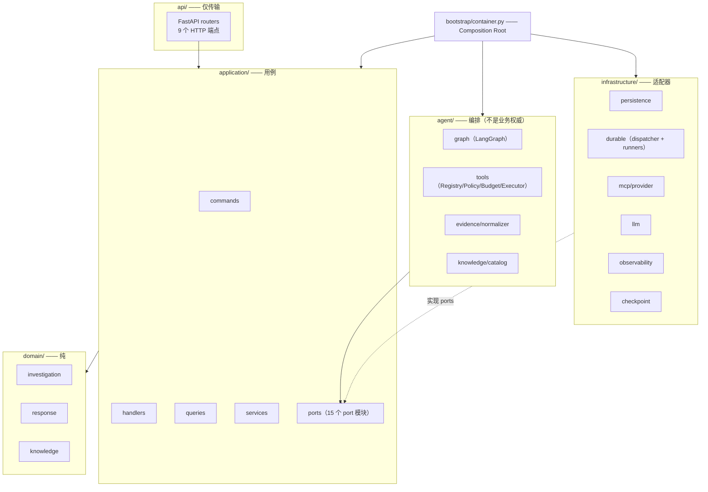

**这张图解决什么问题：** 说明依赖方向——**所有箭头指向内层**。

**组件职责与规则：**

| 层 | 职责 | 硬性规则 |
|---|---|---|
| `domain/` | 聚合、实体、值对象、事件、不变量 | **纯**：无 FastAPI / SQLAlchemy / LangGraph / httpx / Pydantic |
| `application/` | 命令、查询、处理器、端口、服务 | 用端口与 Unit of Work；**看不到 SQL session** |
| `contracts/` | 边界 Schema（API / LLM / Tools） | Pydantic **只在这里**，不在 `domain/` |
| `agent/` | LangGraph 编排、工具、证据归一化、提示词 | 拥有**编排**，**不拥有业务权威** |
| `api/` | FastAPI 传输 | 依赖 `application`，**不依赖 `infrastructure`** |
| `infrastructure/` | PostgreSQL、HISIEM HTTP、MCP、LLM、OTel、持久化执行 | 适配外部系统 |
| `bootstrap/` | 组合根 | **唯一**构造适配器的地方 |

**Truth / Authority 在哪里：**

```text
业务真相   = domain 聚合 + PostgreSQL 持久化
执行真相   = HISIEM 观测到的执行状态
编排状态   = LangGraph checkpoint（只是工作内存）
遥测       = 完全不参与业务判断
```

**可靠性边界：**

| 边界 | 位置 | 风险 |
|---|---|---|
| ① 域纯度边界 | `domain/` 的导入约束 | 域被框架污染 → 不可测试 |
| ② 传输边界 | `api/` 不依赖 `infrastructure/` | 传输层耦合实现 |
| ③ 编排边界 | `agent/` 不拥有权威 | 模型输出渗入业务决策 |
| ④ 检查点边界 | `langgraph_checkpoint` schema 独立 | 图状态被当作业务状态 |
| ⑤ 评测边界 | 生产层不得导入 `evaluation*` | 评测反噬生产 |

---

## 2. Investigation 生命周期

### 图 2-1 两套独立生命周期

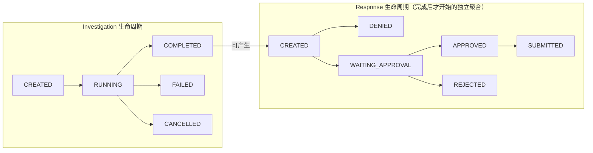

**这张图解决什么问题：** 说明**响应不是调查的一个状态**。

**关键设计：**

> **一次调查（Investigation）完成后，响应（Response）是一个独立的聚合生命周期。**
> 这意味着一项已完成的调查之后仍然可以产生响应、并且被单独判定。

**并发约束：**
```text
一个 Tenant + 一个 Alert 只能有一个 Active Investigation
→ 由 部分唯一索引（partial unique index）在数据库层强制
→ 并发启动时第二次插入失败，返回既有调查
```

**为什么放在数据库层：** 应用层的 check-then-act 存在竞态；部分唯一索引让这个约束**无法被绕过**。

**阶段枚举：** `HYDRATING → PLANNING → INVESTIGATING → VERIFYING → FINALIZING`
**结论枚举：** `MALICIOUS | BENIGN | INCONCLUSIVE`

**Truth / Authority：** Investigation 聚合 + PostgreSQL。**LangGraph 线程 ≠ Investigation。**

**可靠性边界：** 响应生命周期是**完成后**才开始的，所以"调查已关闭"不会阻止响应进行。

---

## 3. LangGraph 的位置

### 图 3-1 图结构

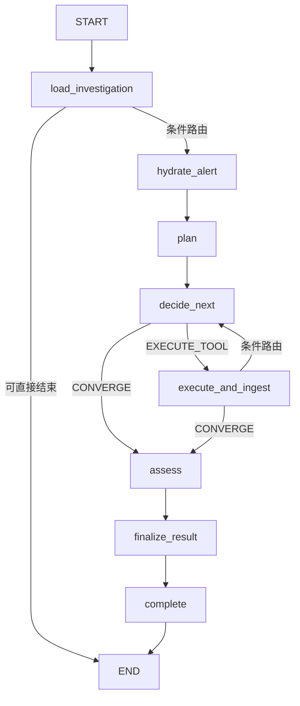

**这张图解决什么问题：** 说明它是一个**真正的 ReAct 式循环**——`decide_next` 与 `execute_and_ingest` 之间有条件回路，直到收敛。

**逐步说明：**

| 节点 | 做什么 |
|---|---|
| `load_investigation` | 加载调查聚合 |
| `hydrate_alert` | **系统控制地**获取告警上下文（不是模型选择） |
| `plan` | 生成调查计划 |
| `decide_next` | 模型决定下一步：执行工具还是收敛 |
| `execute_and_ingest` | 执行工具并把结果归一化为 Evidence |
| `assess` | 评估证据、形成结论 |
| `finalize_result` | 落结论 |
| `complete` | 收尾 |

**Checkpoint 的边界（最重要的区分）：**

```text
LangGraph checkpoint = 跨步骤的**工作内存**（bounded working state）
Domain truth        = domain 聚合 + PostgreSQL

LangGraph schema:   langgraph_checkpoint  （LangGraph 自己拥有并迁移）
业务 schema:        copilot               （Alembic 拥有）
→ 两个 schema、两套连接、两个迁移所有者
```

**为什么必须分开：** 如果 checkpoint 被当成业务状态，那么一次图重放、一次 checkpoint 恢复、或一次图重构都可能**静默地重定义调查的业务状态**。

**Truth / Authority：** 图的**行为**受 checkpoint 影响；调查**是什么**由 domain 决定。**两者不一致时，domain 赢。**

---

## 4. 工具治理：Registry / Policy / Budget / Executor / Provider

### 图 4-1 五道关卡

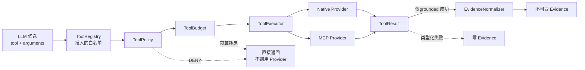

**这张图解决什么问题：** 说明**顺序**本身就是设计。

| 关卡 | 文件 | 作用 |
|---|---|---|
| ToolRegistry | `agent/tools/registry.py` | 模型可见的**确定性白名单** |
| ToolPolicy | `agent/tools/policy.py` | 确定性拒绝策略 |
| ToolBudget | `agent/graph/budget.py` | 调查级别的调用预算 |
| ToolExecutor | `agent/tools/executor.py` | Provider 路由 + **可信上下文注入** + 结果整形 |
| Provider | `native_provider.py` / `infrastructure/mcp/provider.py` | 实际调用 |

**模型可见的工具面（精确）：**

```python
AGENT_SELECTABLE_TOOLS = {
    "hisiem.search_events",
    "hisiem.get_detection_rule",
    "knowledge.retrieve_security_guidance",
    "knowledge.resolve_attack_technique",
}
SYSTEM_CONTROLLED_TOOL = "hisiem.get_alert_context"   # 模型永远不能选
FUTURE_CATALOG_TOOLS   = {"hisiem.get_entity_activity", "threat_intel.lookup_ip"}  # 仅登记，未注册
FORBIDDEN_TOOLS        = {execute_shell, raw_http_request, write_alert, set_alert_verdict,
                          block_ip, isolate_host, start_soar_execution, approve_response, ...}
```

> **`SYSTEM_CONTROLLED_TOOL` 不在可选集合中**——它由图的水合节点直接调用，模型看不到。
> 所以精确说法是"**四个模型可选的只读工具**"，而不是"四个工具"。

**关键顺序保证：** **Policy DENY 与预算耗尽都在任何 Provider 调用之前返回。**
如果 Policy 在 Provider 之后跑，一个被拒绝的能力**仍然已经在远端产生了副作用**。

**Truth / Authority：** Registry 是模型的**整个动作空间**。它被架构测试断言——**改动模型能做什么，不可能不触发测试失败**。

---

## 5. ToolResult → EvidenceNormalizer → Evidence

### 图 5-1 证据归一路径

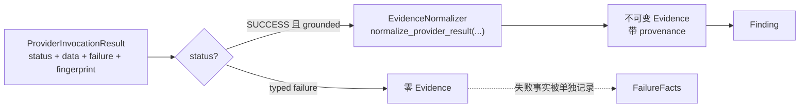

**这张图解决什么问题：** 说明"**失败不会变成事实**"。

**Provider 结果的完整契约：**

```python
ProviderResultStatus = Literal["SUCCESS", "NO_DATA", "REJECTED", "UNAVAILABLE"]
ProviderFailureCode  = Literal["TIMEOUT", "UNAVAILABLE", "AUTH_FAILURE", "RATE_LIMITED",
                               "REMOTE_TOOL_ERROR", "PROTOCOL_ERROR", "UNSUPPORTED_INTERACTION",
                               "SCHEMA_MISMATCH", "INVALID_RESULT", "RESULT_TOO_LARGE",
                               "PROVIDER_ERROR"]        # 11 类
RiskClass            = Literal["READ_ONLY", "HIGH_RISK", "WRITE"]
TenantScope          = Literal["GLOBAL_READ_ONLY", "TENANT_SCOPED"]
```

`ProviderFailure` 只带 `code` + `safe_message`（**没有原始异常文本**）。

`normalize_provider_result(...)` 需要 keyword-only 的 `tool_call_id` / `provider` / `operation`——保证**provenance 不会被漏掉**。

**为什么这是最重要的边界：**

> 没有它，一个坏掉的后端返回 `{}` 会变成"没有发现"，进而变成一个看起来良性的结论。
> **这是安全领域里最危险的一类幻觉**：工具挂了，Agent 却说"没找到匹配事件"。

**Truth / Authority：** Evidence 是**唯一**能被 Finding 引用的 grounded 事实。原始 `ToolResult` **永远不是**。

**可靠性边界：** 每种新的结果形态都需要一条归一化路径。`XP-REL-001/002` 专门验证"类型化失败 → 零 Evidence"这一半。

---

## 6. Knowledge / RAG

### 图 6-1 混合检索

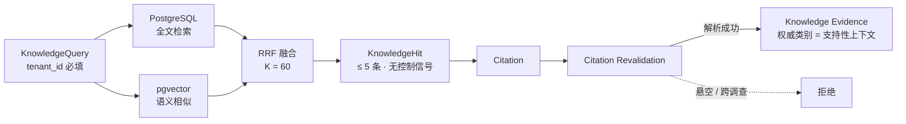

**这张图解决什么问题：** 说明检索的产物是**上下文**，不是**结论**。

**关键设计点：**

| 点 | 实现 | 为什么 |
|---|---|---|
| 排名是纯函数 | `reciprocal_rank_fusion` 等是对普通数据的纯函数 | 让排名**可复现、可无数据库测试** |
| RRF 常数 | `RRF_K = 60`（论文原值，冻结为常量） | 改它会改变**每一次**排名 |
| 结果上限 | `MAX_RESULT_LIMIT = 5`，**超出被拒绝而不是截断** | 截断会产生"看起来完整的不完整事实" |
| 租户必填 | `tenant_id` 是**无默认值的关键字参数，且没有无作用域变体** | 任何调用方都不可能意外检索整个语料库 |
| Hit 无控制信号 | `KnowledgeHit` 没有 `instructions` / `action` / `severity` / `authority` 字段 | 该"缺失"被**针对冻结字段集断言**——将来加一个字段会**测试失败**而不是悄悄扩大检索能表达的范围 |
| 引用指向不可变分块 | `citation_id` 指向 `knowledge_content_chunk` | 引用能**跨嵌入重建存活** |
| ATT&CK 单写者切换 | `active_version_id` 只在切换事务内移动 | 服务一个 ATT&CK 命中 = 声称某个权威版本 |

**为什么用 RRF 而不是加权分数融合：**
BM25 与 cosine 的分数**不在可比尺度上**，加权融合需要一次没有原则性答案的校准。RRF 只用**排名**，所以只需要"两个通道是否一致"。

**Truth / Authority：**

```text
Knowledge Context ≠ Platform Fact
Knowledge         ≠ Verdict Authority
```

知识证据携带**自己的权威类别**（支持性上下文），在工作台上与"平台事实"用**不同的标签**渲染。**纯知识基础不能产生确定性结论**（硬门禁 `KNOWLEDGE_ONLY_DEFINITIVE_VERDICT`）。

**可靠性边界（必须主动说明）：**

> **没有配置真实的 embedding provider。**
> 所以混合检索的评测证明了**接线正确**（融合、排名、打破平局、引用解析、打分端到端联通），
> **没有证明语义检索质量**。产物被标记为 `PLUMBING_ONLY`。

---

## 7. MCP：Discovery / Admission / Selection / Invocation

### 图 7-1 三个不同的问题

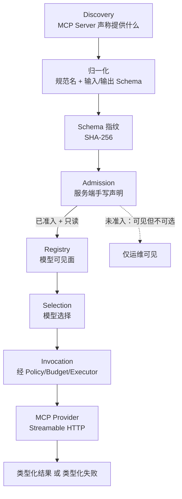

**这张图解决什么问题：** 说明 **Discovery ≠ Admission ≠ Selection**。

| 概念 | 是什么 | 谁决定 |
|---|---|---|
| **Discovery（发现）** | Server **声称**提供什么 | 远端 Server（**不可信**） |
| **Admission（准入）** | 本系统**决定信任**什么 | 服务端**手写**声明 |
| **Selection（选择）** | 模型**实际能选**什么 | Registry（只读 + 已准入） |

**准入声明包含什么：** 内部名、**可信描述**、已配置的 Server 身份、外部名、内部参数/结果契约、**预期 Schema 指纹**、只读/风险分类、租户作用域、每能力上限。

**为什么可信描述要与 Server 自己的描述分开：**
> Server 的描述是**远程内容**，而远程内容是**不可信数据**。
> 描述本身就是提示面 —— 一个恶意的工具描述可以**诱导工具选择**。

**失效闭合（fail closed）控制：**

| 控制 | 机制 | 失败模式 |
|---|---|---|
| Schema 指纹 | SHA-256 over 规范名 + 输入 Schema + 输出 Schema | 漂移 → `SCHEMA_MISMATCH` |
| 协议固定 | 要求生产协议版本 | 降级 → **拒绝**，不静默接受 |
| 只读权威 | `is_model_selectable` 要求 `READ_ONLY` | 写能力 → **永不可选** |
| 传输 | 只用已配置受信端点；HTTPS（除非显式标记为内部可信） | 意外重定向/主机变更 → 拒绝 |
| 结果上限 | 全局 + 每能力上限 | 超限 → `RESULT_TOO_LARGE`，**绝不截断** |

**结果处理顺序（固定）：**
```text
协议/结果类型 → 不支持的交互模式 → is_error → 支持的内容类型
→ 可信契约校验 → 全局与每能力上限
```

**Truth / Authority：** Provider **不是**授权权威。`ToolProvider` 协议的文档里直接写了：
> *"Discovery/invocation adapter; not a policy or authorization authority."*

**可靠性边界：** **MCP V1 只读，写能力不可模型选择。** 这是设计边界，不是待办功能。

---

## 8. Authority Model（权限模型）

### 图 8-1 权限链

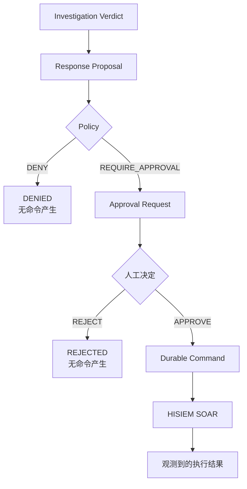

**这张图解决什么问题：** 说明**模型的影响力在哪里结束**。

```text
Model proposes  →  Policy constrains  →  Human authorizes
Durable command records intent  →  HISIEM executes  →  Copilot observes
```

**九条"不等于"（本项目被要求严格区分）：**

| 不等于 | 谁在保证 |
|---|---|
| ToolResult ≠ Evidence | `agent/evidence/normalizer.py` |
| Knowledge ≠ Verdict Authority | 权威类别 + `KNOWLEDGE_ONLY_DEFINITIVE_VERDICT` 门禁 |
| Agent Verdict ≠ Analyst Disposition | 独立持久化字段 |
| Policy ≠ Human Approval | `domain/response/` 独立聚合 |
| Human Approval ≠ Execution | Durable Command + Outbox |
| Submission ≠ Execution Success | 两套独立状态机 |
| Telemetry ≠ Business Truth | 无业务路径读 span |
| Frontend ≠ Authority | 服务端状态在刷新时获胜 |
| LangGraph checkpoint ≠ Domain Truth | 独立 schema |

**唯一一条"等于"：**
```text
HISIEM observed execution result  =  最终执行真相
```

**Authority Boundary 的位置：**
> 位于 **"结论"与"策略"之间**。
> 这条线**以上**全部受模型影响；这条线**以下**全部是确定性、人工、或观测的。

---

## 9. Response Proposal / Policy / Human Approval

### 图 9-1 状态与人工节点

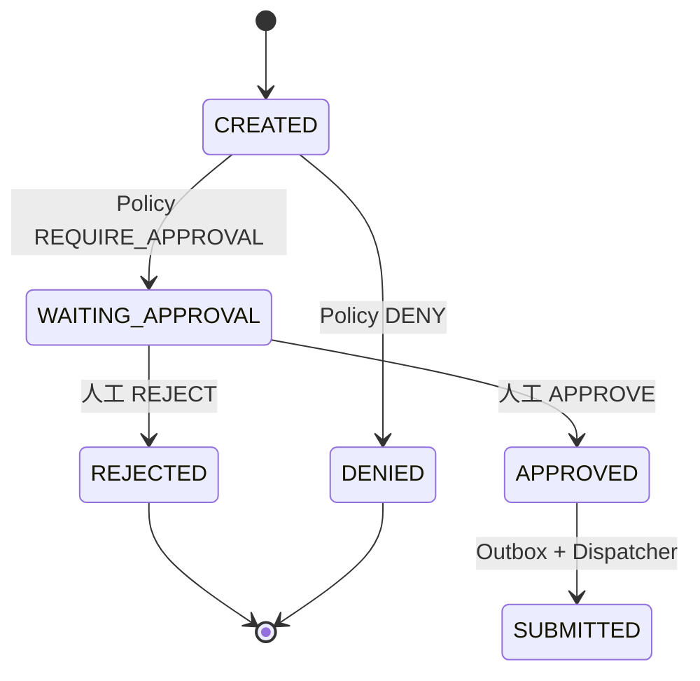

**枚举事实：**

```python
PolicyDecision      = DENY | REQUIRE_APPROVAL          # 只有两种
ApprovalDecisionKind= APPROVE | REJECT
ResponseActionKey   = BLOCK_SOURCE_IP | DISABLE_ACCOUNT | ISOLATE_HOST | START_SOAR_PLAYBOOK
ResponseProposalStatus = CREATED | DENIED | WAITING_APPROVAL | APPROVED | REJECTED | SUBMITTED
```

**Policy ≠ Human Approval 为什么重要：**
- **Policy** 是**规则应用**（确定性、系统拥有）
- **Human Approval** 是**同意**（人的决定）

把两者合并意味着：要么系统可以声称一个从未得到的人工批准，要么人可以覆盖系统必须执行的策略。

**拒绝不能产生可派发命令** —— 这是"Agent recommends, cannot authorize"不变量的直接体现。

---

## 10. Revision / Hash TOCTOU 保护

### 图 10-1 绑定意图而非权限

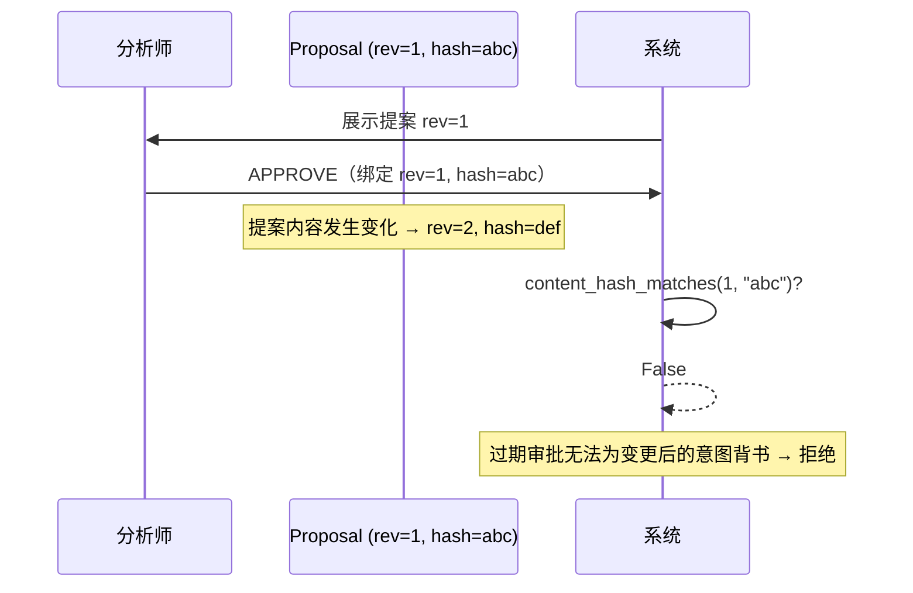

**这张图解决什么问题：** 说明**一次批准授权的是一个具体意图，不是一揽子许可**。

**实现：**
```python
content_revision: int = 1
content_hash: str = ""      # sha256 of the encoded approvable contract

def content_hash_matches(self, revision: int, content_hash: str) -> bool:
    """Approval contract must bind the exact revision+hash that was requested."""
    return self.content_revision == revision and self.content_hash == content_hash
```

**承重细节：** 代码里明确注明——**provenance 不属于"可批准契约"**，因此
> *"它永远不能被用来让一次审批的 hash 匹配或不匹配。"*

也就是说：**hash 覆盖的是人真正批准的东西，不包括附带信息。**

**为什么需要：** 没有它 —— 分析师审阅 v1 并批准；在批准与派发之间提案（或其背后的证据）发生变化；派发执行的是**人从未看过的东西**。

**可靠性边界：** 任何对提案的改动都会使审批失效并要求重新决定。**正确，且略微麻烦——对安全控制而言这是正确的方向。**

---

## 11. Durable Execution / Outbox / Idempotency / Retry

### 图 11-1 从批准到提交

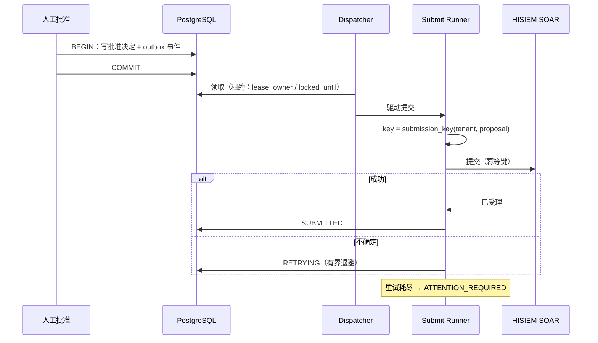

**关键参数（真实常量）：**
```python
_MAX_ATTEMPTS = 10
_MAX_BACKOFF_SECONDS = 120
def _backoff(attempt_count): return min(int(2 ** attempt_count), _MAX_BACKOFF_SECONDS)
```

**幂等键来自业务身份：**
```python
key = submission_key(tenant_id, proposal.id)   # 形如 response:<tenant>:<proposal>
```
> 模块文档写明：提交凭**持久化记录**驱动，"**绝不是队列载荷**"。

**为什么用业务身份而不是尝试序号：**
```text
每次尝试一个 UUID  → 每一次重试都是"新意图"  ← 这正是幂等要防的 bug
response:<tenant>:<proposal> → 重试 / 重复投递 / 重新派发 都收敛为同一个意图
```

**Outbox 的租约三件套：**
| 列 | 作用 |
|---|---|
| `available_at` | 何时可领取（支持退避） |
| `locked_until` | 租约到期时间 |
| `lease_owner` | 归属（+ fencing token 在 SOAR 侧） |

**Truth / Authority：** 命令的**意图**在 PostgreSQL outbox；执行**状态**在 HISIEM。

**可靠性边界：** Outbox 给的是 **at-least-once + 因果关联**，不是 exactly-once。去重靠幂等键。

---

## 12. ATTENTION_REQUIRED

### 图 12-1 两套独立状态机

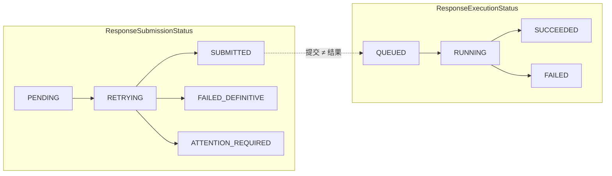

**这张图解决什么问题：** 说明**没有任何一个提交状态的值意味着成功**。

| 提交状态 | 含义 |
|---|---|
| `PENDING` / `RETRYING` | 还没交出去 / 正在重试 |
| `SUBMITTED` | **交出去了。不包含任何关于结果的声明。** |
| `FAILED_DEFINITIVE` | 确定性失败 |
| `ATTENTION_REQUIRED` | **结果不确定，需要人看** |

**为什么 ATTENTION_REQUIRED 是一个状态而不是错误：**

> 世界里真实的状态是**未知**，而所有可用的错误状态都是一种**断言**。
> `FAILED` 断言动作没发生 —— 但超时可能意味着它发生了、只是响应丢了。
> `SUCCEEDED` 断言它发生了。
> **两个都是对真实系统副作用的猜测**，而猜错在这里意味着把 IP 拦两次、或者把主机留成未隔离。
>
> `ATTENTION_REQUIRED` 是唯一说出真相的状态：**我们尝试过，结果不确定，需要人来看。**

工作台**被禁止**把它渲染成终态成功或 provider 拒绝 —— 两种渲染都会让门禁 FAIL。

**Truth / Authority：** 执行真相在 HISIEM。

**可靠性边界：** 重试是有界的；边界处的答案是**显式的不确定性**，不是猜测的终态。

---

## 13. OpenTelemetry

### 图 13-1 跨持久化边界的追踪

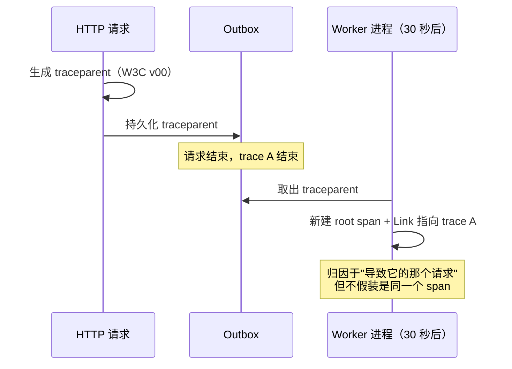

**这张图解决什么问题：** 说明**异步边界上的因果应该怎么表达**。

**实现要点：**

| 机制 | 说明 |
|---|---|
| `start_span` | 普通 span |
| `linked_worker_span` | `SpanKind.CONSUMER`，**新 root + Link** |
| `capture_traceparent` / `validate_traceparent` | W3C v00 |
| `bind_log_context` | 5 个仅日志字段 |
| 指标标签白名单 | `_ALLOWED_LABEL_VALUES`，**9 个键**，失败闭合 |

**为什么用 Link 而不是 parent-child：**
> Worker **不是** HTTP 请求调用栈的延续；它是一个**由它引起的**独立根。
> Link 表达的是这个；parent-child 声称的因果关系更强，会产出**歪曲系统**的 trace。

**指标标签白名单（9 个键，全部是低基数枚举）：**
```text
tool_name · tool_provider · server_category · model_provider · retrieval_mode
result · error_category · operation · response_state
```
**失败闭合语义：** 携带不允许的键的观测被**整条拒绝**，而不是部分记录。
> 理由不只是基数成本 —— 遥测会被复制、导出、长期保留、常常发往第三方后端。
> **一个 prompt 或一个凭证进了 span attribute，它就已经离开了你的信任边界。**

**Truth / Authority：** **没有任何业务路径读取 span / trace id / collector 状态。**

**可靠性边界：** 停掉 Collector 会产生**完全相同的持久化业务结果** —— 由运行时的 `XP-REL-005` 真实进程验证，不是断言。

---

## 14. Workspace Projection（工作台投影）

### 图 14-1 投影而非缓存

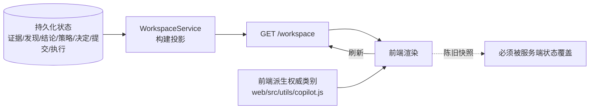

**这张图解决什么问题：** 说明工作台是**持久化真相的投影**，不是带同步问题的缓存。

**必须做到的：**

| 要求 | 含义 |
|---|---|
| 保持权威区分 | 知识上下文**不能**渲染成平台事实；Agent 结论**不能**渲染成分析师判定 |
| 服务端真相获胜 | 陈旧的客户端快照在刷新时必须被更新的服务端状态覆盖 |
| 从持久化状态重建 | 全新加载**精确复现**持久化真相 |
| 不发明 | 不呈现持久化生命周期未记录的审批/执行/提交状态 |
| 不渲染内部细节 | 不显示思维链、提示词、图 checkpoint |

**一个重要的架构事实：**
> **工作台 UI 实现在 HISIEM 仓库（`HISIEM/web/`），不在本仓库。**
> HISIEM 拥有平台的 Web 应用与会话/路由/鉴权。
>
> 权威类别（平台事实 vs 支持性上下文）由前端从持久化的证据来源类型**派生**，
> 而验收工具**执行真实的前端模块**（`web/src/utils/copilot.js`）而不是复述这个映射 ——
> 所以**评测与 UI 不会漂移**。

**Truth / Authority：** 前端**不是**权威。`Frontend ≠ Authority`。

---

## 15. Evaluation：GP-01 / KB-GOLDEN-V1 / XP-01

### 图 15-1 三条评测基线

```mermaid
flowchart TB
    subgraph G["GP-01 —— 调查正确性"]
        M["Materializer<br/>真实 HISIEM 资源"] --> SE["Sealed Manifest"]
        SE --> RN["execute_real_model_run"]
        RN --> Q["tool-evidence-quality"]
        Q --> SC["确定性 scorer"]
        SC --> RP["有界重复性收集<br/>3/3 有效通过"]
        RP --> SU["suite summary"]
    end
    subgraph K["KB-GOLDEN-V1 —— 知识"]
        KC["版本化语料"] --> KR["检索 / 引用 / 排名 / 权威边界"]
    end
    subgraph X["XP-01 —— 跨平面验收"]
        S29["29 个场景<br/>9 个家族"] --> G13["13 条非补偿性硬门禁"]
        G13 --> AG["cross-plane-suite-results/v1<br/>单一确定性产物"]
    end
```

**XP-01 的精确构成（已执行目录验证）：**

```text
29 个场景 / 13 条硬门禁 / 9 个家族
AUTHORITY 5 · CAPABILITY 1 · KNOWLEDGE 4 · MCP 5 · OBSERVABILITY 2
RELIABILITY 5 · SECURITY 3 · TENANT 2 · WORKSPACE 2
执行档位：26 deterministic + 3 runtime-integrated
```

**13 条硬门禁：**
```text
CROSS_TENANT_LEAK              KNOWLEDGE_ONLY_DEFINITIVE_VERDICT
UNADMITTED_MCP_SELECTED        WRITE_MCP_SELECTED
SECRET_LEAK                    DANGLING_CITATION
CROSS_INVESTIGATION_CITATION   EXECUTION_WITHOUT_APPROVAL
SUBMISSION_TREATED_AS_SUCCESS  TELEMETRY_CHANGED_BUSINESS_STATE
ORACLE_FIREWALL                EXPECTED_FACTS_PRESENT
FORBIDDEN_FACTS_ABSENT
```

**非补偿性（non-compensating）是什么意思：**
> 聚合产物里**没有任何分数、权重或通过率**。
> 一个失败场景、一个缺失场景、一个未知场景、或一个缺失的门禁结果，都会让**整个套件 FAIL**。

**为什么这样设计：** 一个分数会**诱导优化分数**。"29 个里 28 个通过，加权 0.96" 隐藏了**是哪个不变量坏了**。

**三个设计细节：**

1. **运行时证据绝不被替代** —— 每个运行时场景**同时**在聚合里保留自己的确定性产物。
2. **确定性被强制** —— 读取之间字节相同、与输入顺序无关、身份里没有时间戳或运行 id。
3. **产物在原子写之前做密钥扫描**，且冻结的扫描是**子串扫描** —— 这就是为什么某个不变量键叫 `credential_marker_absent` 而不是包含标记本身的名字。

**架构边界测试：**
```text
tests/architecture/  285 个测试用例通过
```
> **精确表述：285 个架构测试用例，其中大量是"逐模块参数化"的导入检查，实际强制的是**较小的一组边界规则**。
> 不要说成 "285 条架构不变量"。

具体断言：生产层从不导入 `evaluation*`；`domain/` 保持纯净；**模型可选的工具面恰好等于声明的集合**。

**Truth / Authority：** 评测产物由真实运行产生，**从不合成**；它们不写回生产。

**可靠性边界：** 已知的未测量项 —— **语义检索质量未验证**（无真实 embedding provider）。

---

## 16. 一页速查

```text
分层：domain(纯) → application(端口/UoW) → agent(编排) → api(传输)
      infrastructure 实现端口；bootstrap 是唯一组合根

Graph：load → hydrate(系统控制) → plan → decide_next ⇄ execute_and_ingest → assess → finalize → complete

工具面：4 个模型可选只读工具 + 1 个系统控制工具（模型不可选）
关卡：Registry → Policy → Budget → Executor → Provider
      Policy DENY 与预算耗尽都在 Provider 调用之前返回

Evidence：仅 grounded 成功；11 类类型化失败 → 零 Evidence

MCP：Discovery ≠ Admission ≠ Selection
     指纹 / 协议固定 / 只读 / 类型化失败 / 超限拒绝不截断

权限：模型提议 → 策略约束 → 人工授权 → 持久化命令 → HISIEM 执行 → Copilot 观察

持久化：Outbox + submission_key(tenant, proposal)
        10 次尝试 · 退避上限 120 秒 · 耗尽 → ATTENTION_REQUIRED
        审批绑定 content_revision + content_hash

状态机：SUBMITTED 不含任何结果声明；执行状态独立

评测：XP-01 29 场景 / 13 门禁 / 9 家族 / 非补偿性
      架构测试 285 个用例（多为逐模块参数化）
```
