# HISIEM-SOC-Copilot · 核心场景数据流

> 本文回答："**一次真实场景发生时，数据怎么流？**"
> 系统"有什么"请看 [`01_Copilot_系统架构与核心组件.md`](01_Copilot_系统架构与核心组件.md)。

**使用方式：** 每个场景按「输入 → 逐步过程 → 输出 → 边界 → 容易被问倒的地方」组织。
**练习方法：** 合上文档，从"输入"口述到"输出"。

---

## 场景 1 · Alert → Investigation

### 图 2-1-1 调查启动与并发约束

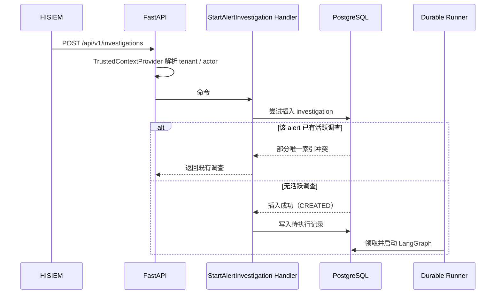

**输入：** HISIEM 的一个告警 id（来自工作台操作或生命周期事件）。

**逐步过程：**

1. HTTP 请求进入。**tenant 和 actor 由 `TrustedContextProvider` 从服务端上下文解析**——**永远不从 body 里读**。
2. 派发 `StartAlertInvestigation` 命令 → handler。
3. 尝试插入 `investigation` 聚合（状态 `CREATED`）。
4. **并发保护：** `(tenant_id, alert_id)` 的部分唯一索引强制"一个租户一个告警只有一个活跃调查"。
5. 冲突 → 返回既有调查（**收敛，而不是报错**）。
6. 成功 → 持久化执行运行器（Durable Runner）领取并启动 LangGraph 图。

**输出：** 一个 `CREATED` 状态的调查，图开始执行。

**边界：**

| 边界 | 说明 |
|---|---|
| 租户边界 | tenant/actor 来自服务端上下文；模型与客户端不可声明 |
| 并发边界 | 由**数据库部分唯一索引**强制，不是应用层 check-then-act |
| 持久化边界 | 调查的启动是持久化事实，不是内存状态 |

**容易被问倒的地方：**

> —— "两个请求同时启动同一个告警的调查怎么办？"
> 部分唯一索引让第二次插入失败，handler 返回**既有**调查。**应用层的 check-then-act 有竞态，索引没有。**
>
> —— "租户从哪来？"
> 服务端可信上下文，通过 `TrustedContextProvider` 解析。开发/测试用 `header` provider 读 `X-Tenant-ID`，**生产必须用认证 provider**。

---

## 场景 2 · Agent → Tool Invocation

### 图 2-2-1 五道关卡与 ReAct 回路

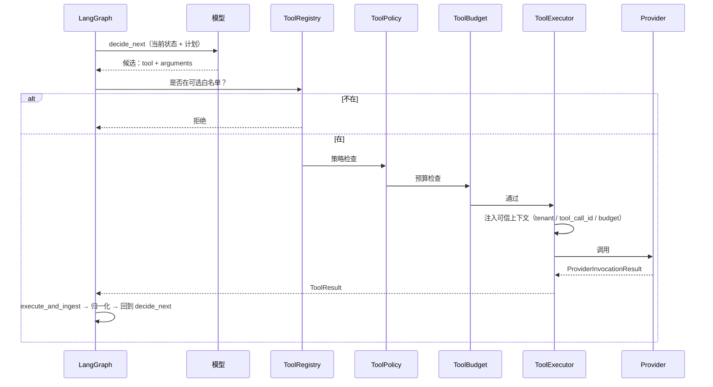

**输入：** 图在 `decide_next` 节点，模型给出一个工具候选。

**逐步过程：**

1. 模型给出 `tool` + `arguments`（**只有工具名和参数，不能指定 server / endpoint / credential / tenant**）。
2. **Registry** 检查是否在 `AGENT_SELECTABLE_TOOLS`（4 个只读工具）中。
3. **Policy** 检查——`DENY` 则**直接返回，不调用 Provider**。
4. **Budget** 检查——耗尽则**直接返回，不调用 Provider**。
5. **Executor** 注入可信调用上下文（`ProviderInvocationContext` 里包含 `tenant_id` / `tool_call_id` / `budget_remaining`）。
   > 该类型的文档写明：*"Trusted runtime context injected by the executor, never model input."*
6. **Provider** 调用（native 或 MCP）。
7. 结果回到图 → `execute_and_ingest` → 归一化 → 回到 `decide_next`。

**输出：** 一个 `ToolResult`，或一个被拒绝/预算耗尽的短路结果。

**边界：**

| 边界 | 说明 |
|---|---|
| 动作空间边界 | 模型只能从 4 个只读工具里选 |
| 顺序边界 | Policy / Budget 在 Provider **之前**，所以拒绝是零副作用的 |
| 租户边界 | 模型提供的 tenant 字段被**拒绝**；tenant 由 executor 注入 |

**容易被问倒的地方：**

> —— "为什么 Policy 必须在 Provider 之前？"
> 如果 Policy 在 Provider 之后，一个被拒绝的能力**已经在远端产生了副作用**。顺序就是这个设计的意义。
>
> —— "模型能不能选一个没实现的工具？"
> **不能。** 未实现的工具在 `FUTURE_CATALOG_TOOLS` 里，**不会被注册**——模型永远不可能选到一个没有 executor、没有 schema、没有 policy 背书的工具。
> 这是"Agent 幻觉出能力"的根本防护。

---

## 场景 3 · ToolResult → Evidence

### 图 2-3-1 证据归一化

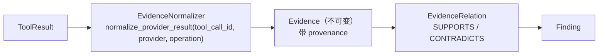

**输入：** 一个成功且 grounded 的 `ToolResult`。

**逐步过程：**

1. `EvidenceNormalizer.normalize_provider_result(...)` 接收结果。
   **keyword-only 参数** `tool_call_id` / `provider` / `operation` 保证 provenance 不会被漏。
2. 产出**不可变** Evidence 行，带来源与工具调用 id。
3. Evidence 可与假设建立关系：`SUPPORTS` / `CONTRADICTS`。
4. Finding 引用 Evidence。

**输出：** 不可变 Evidence 行。

**边界：**

| 边界 | 说明 |
|---|---|
| 归一化边界 | 只有**一条**归一化路径——provenance 不可能对某一种来源被忘记 |
| 不可变边界 | Evidence 一旦写入不被修改 |

**容易被问倒的地方：**

> —— "为什么不让模型直接读原始工具输出？"
> 那会让结论的 grounding 取决于模型对一段错误字符串的解读。**归一化是唯一路径，才有统一的保证。**

---

## 场景 4 · Tool Timeout / Provider Failure → 零 Evidence

### 图 2-4-1 最重要的失败路径

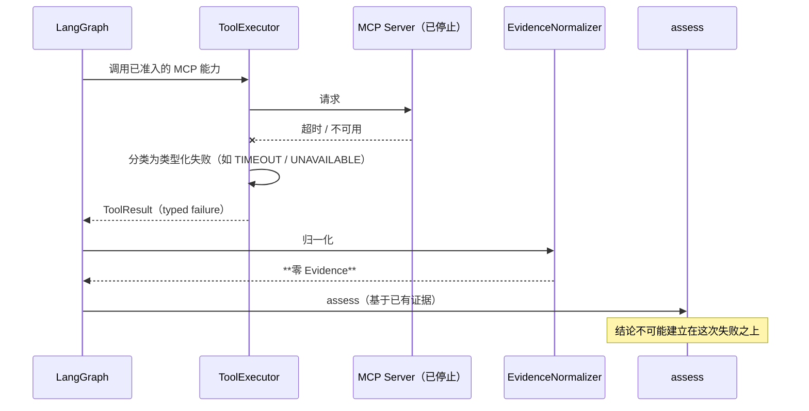

**输入：** 一次工具调用失败——超时、provider 不可用、schema 不匹配、结果过大等。

**逐步过程：**

1. Provider 返回失败。`ProviderFailure` 只带 `code` + `safe_message`（**没有原始异常文本**）。
2. 失败被分类为 11 类 `ProviderFailureCode` 之一。
3. `ToolResult` 携带类型化失败。
4. **EvidenceNormalizer 不产出 Evidence。**
5. 失败事实被**单独记录**：
   - `FALSE_SUCCESS_EVIDENCE_PRESENT` 只在**类型化失败同时也产出了 Evidence** 时触发
   - `FAILURE_NORMALIZED_AS_EMPTY` 只在**后端不可用且状态是 `SUCCESS`/`NO_DATA`** 时触发
6. `assess` 基于已有证据推进。

**输出：** 一个 `ToolResult` 类型化失败 + **零 Evidence**。

**为什么这是整个项目最重要的边界：**

```text
没有它：
  MCP server 挂了 → 调用失败 → 返回空 → Agent 说"没有匹配事件" → 结论"良性"
  ↑ 这是一次**安全相关的幻觉**，而且看起来完全正常

有它：
  调用失败 = 类型化失败 = 零 Evidence = 结论不能建立在它之上
```

**边界：**

| 边界 | 说明 |
|---|---|
| 事实边界 | 失败**不是**事实（`ToolResult ≠ Evidence`） |
| 可观测边界 | 失败被单独记录为失败事实，不是被静默吞掉 |
| 证据边界 | 结论的 grounding 不可能来自一次失败调用 |

**容易被问倒的地方：**

> —— "失败对模型来说长什么样？"
> 一个类型化失败。模型能看到工具失败了，但**它拿不到任何可以当成事实的东西**。
>
> —— "为什么不把错误字符串给模型让它自己判断？"
> 因为那就把 grounding 的责任交给了模型对一段文本的解读。**结构上不给它这个机会，比事后检查它有没有乱解读要可靠。**

---

## 场景 5 · Knowledge Retrieval → Citation → Knowledge Evidence

### 图 2-5-1 混合检索与引用校验

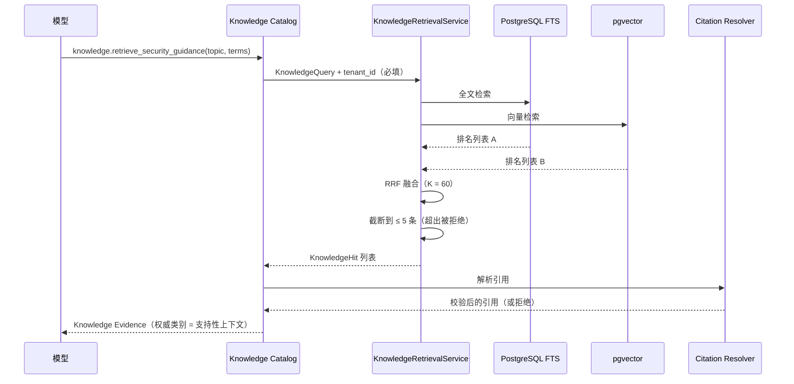

**输入：** 一个调查需要安全知识上下文。

**逐步过程：**

1. 模型选择 `knowledge.retrieve_security_guidance`（在 4 个可选工具中）。
2. 构造 `KnowledgeQuery(topic, context_terms, limit ≤ 5)`。
3. **`tenant_id` 是必填关键字参数，无默认值、无无作用域变体。**
4. 两个通道并行检索：PostgreSQL 全文检索 + pgvector 向量相似。
5. **RRF 融合**（`RRF_K = 60`）。
6. 结果截断到 ≤ 5 条；**请求更多会被拒绝，不是被截断**。
7. `KnowledgeHit` 返回——**不带任何可作为控制信号的字段**。
8. 引用解析与**重新校验**。
9. 产出 Knowledge Evidence，权威类别 = **支持性上下文**。

**输出：** 带可校验引用的 Knowledge Evidence。

**边界：**

| 边界 | 说明 |
|---|---|
| 租户边界 | `tenant_id` 必填；不可能意外检索全语料库 |
| 控制信号边界 | Hit 无 `instructions` / `action` / `severity` / `authority`；该缺失被**针对冻结字段集断言** |
| 引用边界 | 悬空引用 → `DANGLING_CITATION`；跨调查引用 → `CROSS_INVESTIGATION_CITATION` |
| 权威边界 | 知识是**支持性上下文**，不是平台事实，也不是结论权威 |

**容易被问倒的地方：**

> —— "检索质量怎么样？"
> **不能说质量。** 没有配置真实的 embedding provider，混合检索的评测证明的是**接线正确**（融合、排名、引用解析、打分端到端联通），**不是语义检索质量**。产物被标记为 `PLUMBING_ONLY`。
> **主动说出这一点，比被问出来要好。**
>
> —— "为什么用 RRF 而不是加权分数融合？"
> BM25 和 cosine 的分数**不在可比尺度上**，加权融合需要一次没有原则性答案的校准。RRF 只用**排名**，只需要"两个通道是否一致"。

---

## 场景 6 · MCP Discovery → Admission → Selection → Invocation

### 图 2-6-1 三个不同的问题

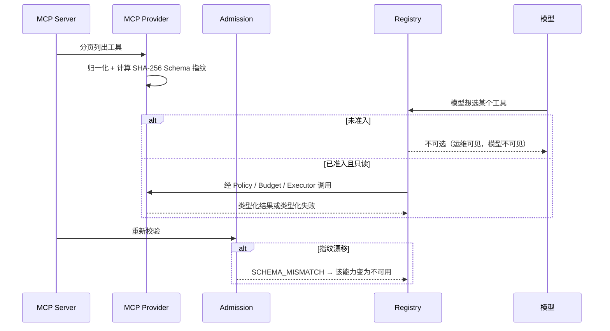

**输入：** 一个配置好的 MCP Server。

**逐步过程：**

1. **Discovery：** provider 完成**全部分页**的工具列表，归一化原始元数据。
2. **指纹：** 计算 `SHA-256` over 规范外部工具名 + 输入 Schema + 输出 Schema（或显式"缺失"标记）。
3. **Admission：** 与手写的服务端准入声明比对（内部名、**可信描述**、外部名、契约、预期指纹、风险分类、租户作用域、每能力上限）。
4. 启动与配置的刷新会重新发现并重新校验。
5. **Selection：** 只有**已准入且 `READ_ONLY`** 的能力进入 Registry 的模型可见面。
6. **Invocation：** 经 Policy / Budget / Executor 调用。

**三种异常处理：**

| 情况 | 结果 |
|---|---|
| 新工具被发现但未准入 | 可见（运维），**不可选**（模型） |
| 已准入的工具消失 | 变为不可用 |
| 指纹漂移 | `SCHEMA_MISMATCH` |

**输出：** 一个类型化结果或类型化失败。

**边界：**

| 边界 | 说明 |
|---|---|
| 信任边界 | Server 的自我描述是**远程不可信内容** |
| 描述边界 | 模型看到的是**我们写的可信描述**，不是 Server 自己的 |
| 写能力边界 | 写能力**结构上不可选**（不是被劝阻） |

**容易被问倒的地方：**

> —— "什么阻止一个恶意的 MCP Server？"
> 三层：① **未准入的工具永远不可选**——Server 加一个工具，模型看不到；② **描述是我们手写的**——Server 不能通过描述**诱导工具选择**；③ **指纹漂移变成 `SCHEMA_MISMATCH`**——Server 不能在一个已准入的名字下悄悄改变行为。
>
> —— "为什么超限要拒绝而不是截断？"
> 截断会产生一个**看起来完整的不完整事实**。显式的 `RESULT_TOO_LARGE` 是可恢复的；被截断的事实会**污染结论**。

---

## 场景 7 · Evidence → Finding → Verdict

### 图 2-7-1 从证据到结论

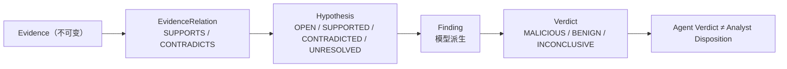

**输入：** 一组 Evidence 行。

**逐步过程：**

1. Evidence 与假设建立关系（`SUPPORTS` / `CONTRADICTS`）。
2. 假设状态：`OPEN → SUPPORTED | CONTRADICTED | UNRESOLVED`。
3. `assess` 节点产出 Finding（模型派生）。
4. `finalize_result` 产出 Verdict：`MALICIOUS | BENIGN | INCONCLUSIVE`。
5. Verdict **持久化**为 `InvestigationResult.verdict.disposition`。

**输出：** 一个持久化的、可追溯到 Evidence 的结论。

**边界：**

| 边界 | 说明 |
|---|---|
| 权威边界 | **Agent Verdict ≠ Analyst Disposition**——模型结论是**建议**，不是分析师的判定 |
| 基础边界 | 纯知识基础不能产生确定性结论（`KNOWLEDGE_ONLY_DEFINITIVE_VERDICT`） |
| 可追溯边界 | Finding 引用 Evidence，Evidence 带 provenance |

**容易被问倒的地方：**

> —— "模型说 MALICIOUS，就是恶意的吗？"
> **不是。** 它是 agent 的**建议**。工作台会把"Agent 结论"和"分析师判定"渲染成**两个不同的事实**，用不同的字段持久化。
>
> —— "什么情况下结论是 INCONCLUSIVE？"
> 证据不足时。这是一等公民的结论——系统必须能说"我无法下结论"，例如知识-only 的基础。

---

## 场景 8 · Verdict → Response Proposal → Policy

### 图 2-8-1 建议与策略

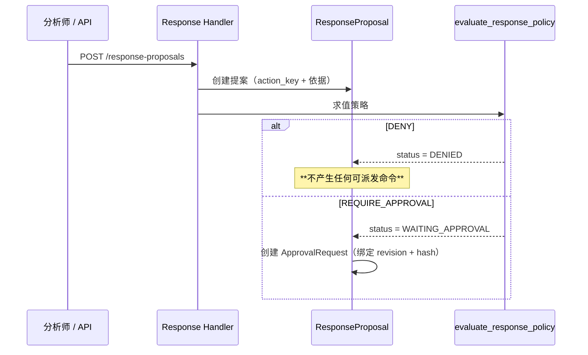

**输入：** 一个已完成的调查 + 一个响应动作。

**逐步过程：**

1. 创建 `ResponseProposal`，动作来自 `ResponseActionKey`：
   `BLOCK_SOURCE_IP | DISABLE_ACCOUNT | ISOLATE_HOST | START_SOAR_PLAYBOOK`。
2. `evaluate_response_policy` 求值——**确定性系统代码**，只有两种结果：
   ```python
   PolicyDecision = DENY | REQUIRE_APPROVAL
   ```
3. `DENY` → 状态 `DENIED`，**不产生任何可派发命令**。
4. `REQUIRE_APPROVAL` → 状态 `WAITING_APPROVAL`，创建 `ApprovalRequest`，**绑定提案的 `content_revision` + `content_hash`**。

**输出：** 一个带策略结果的提案（+ 可能一个审批请求）。

**边界：**

| 边界 | 说明 |
|---|---|
| 权威边界 | **Policy ≠ Human Approval**——策略是规则应用，审批是人的同意 |
| 动作边界 | `DENY` **不可能**产生可派发命令 |
| 绑定边界 | 审批请求绑定到**具体修订与哈希** |

**容易被问倒的地方：**

> —— "既然有策略，为什么还需要人？"
> 因为两者是**不同的事实**。策略是**规则应用**（确定性、系统拥有）；审批是**同意**（人的决定）。
> 合并它们意味着：要么系统可以声称一个从未得到的人工批准，要么人可以覆盖系统必须执行的策略。
>
> —— "策略 DENY 和人工拒绝是一回事吗？"
> **不是。** `DENY` 是系统基于策略拒绝；`REJECTED` 是人拒绝。工作台把它们呈现为**不同的事实**。

---

## 场景 9 · Human Approval

### 图 2-9-1 人工决定

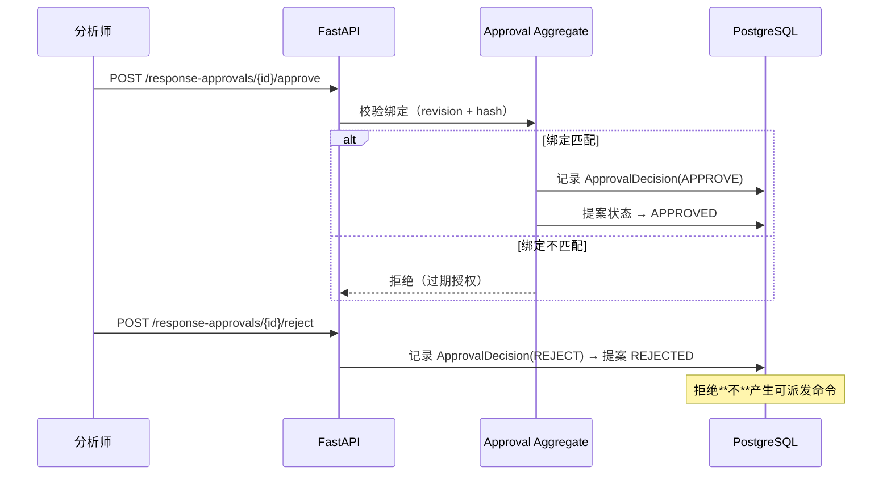

**输入：** 分析师对 `ApprovalRequest` 的决定。

**逐步过程：**

1. 两个独立端点：`/approve` 与 `/reject`（`ApprovalDecisionKind = APPROVE | REJECT`）。
2. 批准前**校验绑定**（见场景 10）。
3. 决定被持久化为 `ApprovalDecision`。
4. 提案状态推进为 `APPROVED` 或 `REJECTED`。
5. `REJECTED` **不产生可派发命令**。

**输出：** 一个持久化的人工决定。

**边界：**

| 边界 | 说明 |
|---|---|
| 人工权威边界 | **Human Approval ≠ Execution**——批准授权的是**意图**，不是执行 |
| 拒绝边界 | 拒绝**不可能**创建可派发命令 |
| 端点边界 | 批准与拒绝是**不同端点**，有不同持久化决定 |

**容易被问倒的地方：**

> —— "批准之后是不是就执行了？"
> **不是。** 批准只是把意图变成一个**持久化命令**。执行在 HISIEM，而且它的结果由 HISIEM 观测。
> `Human Approval ≠ Execution` 是九条不等于之一。

---

## 场景 10 · Proposal Revision Changed → 过期审批被拒

### 图 2-10-1 TOCTOU 闭合

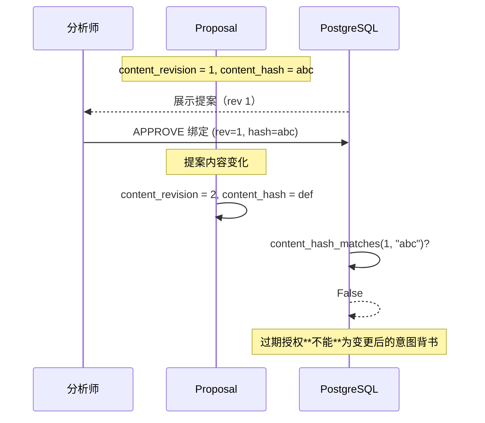

**输入：** 审批之后、派发之前，提案发生变化。

**逐步过程：**

1. 分析师看到的是 `rev=1, hash=abc`。
2. 审批决定绑定这**一对具体值**。
3. 提案内容变化 → `rev=2, hash=def`。
4. `content_hash_matches(1, "abc")` → **False**。
5. 派发被拒绝。

**承重设计细节：**
> 代码注释明确说明 **provenance 不属于"可批准契约"**，因此它
> *"永远不能被用来让一次审批的 hash 匹配或不匹配。"*
>
> 也就是说：**hash 覆盖的是人真正批准的东西，不包括附带信息。**

**输出：** 过期授权被拒绝，需要重新审批。

**边界：**

| 边界 | 说明 |
|---|---|
| 时间边界 | 授权只对**它被授予时的那份意图**有效 |
| 内容边界 | hash 只覆盖可批准契约，不覆盖 provenance |

**容易被问倒的地方：**

> —— "为什么不直接用一个版本号？"
> 版本号可以表达"变了"，但绑定 hash 还表达了"**变的是不是被批准的那部分**"。provenance 变化不应该让审批失效——这正是把 provenance 排除在契约外的原因。
>
> —— "你怎么证明这个门禁不是空的？"
> E3 阶段专门加了一条**过期绑定的适配路径**，让过期授权**真的** FAIL `EXECUTION_WITHOUT_APPROVAL`——而不是因为某个字段缺失而"顺带通过"。

---

## 场景 11 · Approval → Durable Outbox → Dispatcher → HISIEM SOAR

### 图 2-11-1 从决定到执行

```mermaid
sequenceDiagram
    participant AG as 批准
    participant PG as PostgreSQL
    participant D as Dispatcher
    participant R as Submit Runner
    participant H as HISIEM SOAR

    AG->>PG: BEGIN
    AG->>PG: 写 ApprovalDecision
    AG->>PG: 写 outbox 事件 response_execution_queued
    AG->>PG: COMMIT
    Note over PG: 决定与 outbox 同一事务提交
    D->>PG: 领取（租约：lease_owner / locked_until / available_at）
    D->>R: 驱动
    R->>R: key = response:<tenant>:<proposal>
    R->>H: 幂等提交
    H-->>R: 已受理
    R->>PG: submission = SUBMITTED
```

**输入：** 一个人工批准。

**逐步过程：**

1. 批准决定与 `response_execution_queued` 事件**在同一事务**写入 PostgreSQL。
2. Dispatcher 用**租约**从 outbox 领取（`lease_owner` / `locked_until` / `available_at`）。
3. Submit Runner 计算幂等键 `submission_key(tenant_id, proposal.id)`。
4. 提交到 HISIEM SOAR。
5. 提交状态推进。

**为什么幂等键是业务身份：**

```text
response:<tenant>:<proposal>
  → 重试 / 重复投递 / 重新派发 都收敛为**同一个逻辑意图**
```

**输出：** 一个已提交的响应命令。

**边界：**

| 边界 | 说明 |
|---|---|
| 持久化边界 | 决定 + outbox 同事务 → **发布是提交的后果** |
| 幂等边界 | 业务身份键让重复尝试是同一意图 |
| truth 边界 | **执行真相在 HISIEM**，Copilot 只有"信念" |

**容易被问倒的地方：**

> —— "为什么不用消息队列直接发任务？"
> 因为**双写问题**：提交了状态但发布失败 → 动作永远不发生。Outbox 让发布成为提交的后果。
> 提交本身由**持久化记录**驱动，模块文档明确写着"**绝不是队列载荷**"。
>
> —— "dispatcher 挂了怎么办？"
> 租约到期后被重新领取。朴素的 outbox 在派发者中途死亡时会**泄漏消息**——租约就是为此存在的。

---

## 场景 12 · Retry → 耗尽 → ATTENTION_REQUIRED

### 图 2-12-1 不确定是一等公民

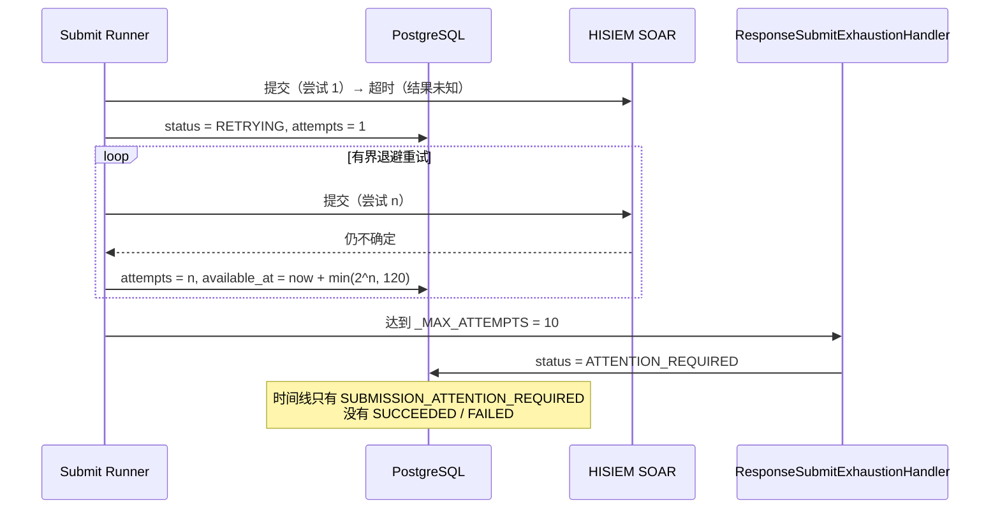

**输入：** 提交持续超时（结果未知）。

**逐步过程：**

1. 提交超时 → 结果**未知**（不是"失败"）。
2. 状态 `RETRYING`，`attempts` 递增。
3. 有界退避：`min(2 ** attempt_count, 120)` 秒。
4. 达到 `_MAX_ATTEMPTS = 10` → `ResponseSubmitExhaustionHandler` 记录 `ATTENTION_REQUIRED`。
5. 时间线携带 `SUBMISSION_ATTENTION_REQUIRED`，且**没有** `SUCCEEDED`/`FAILED` 状态。

**为什么这是最重要的可靠性决策：**

```text
提交超时的真实状态是"未知"。

标 FAILED  → 断言动作没发生 → 可能重试一个已经发生的动作
标 SUCCEEDED → 断言动作发生了 → 声称一个没人观测到的结果
两个都是**对真实系统副作用的猜测**，猜错就意味着：
  · 把同一个 IP 拦两次
  · 或者把一台主机留在未隔离状态

ATTENTION_REQUIRED 说的是唯一正确的话：
  "我们尝试过，结果不确定，需要人来看。"
```

**输出：** 一个显式的**不确定性**状态。

**边界：**

| 边界 | 说明 |
|---|---|
| 不确定性边界 | 未知必须可表达；不能被折叠成终态 |
| 展示边界 | 工作台**被禁止**把它渲染成终态成功或 provider 拒绝——两种渲染都会让门禁 FAIL |
| 重试边界 | 重试有界；边界处的答案是显式不确定性，不是猜测 |

**容易被问倒的地方：**

> —— "为什么不一直重试？"
> 因为对**结果不确定的副作用**做无界重试，就是**执行两次的做法**。不确定性最终必须浮出到人面前。
>
> —— "这不就是把工作推给人吗？"
> **是的，刻意的。** 另一个选择是把**风险**推给一个不知道这事发生过的人——那更糟。
> 生产化的方向是加告警与升级机制，让人**及时**知道。

---

## 场景 13 · HISIEM Execution → Copilot Observe

### 图 2-13-1 观测到的真相

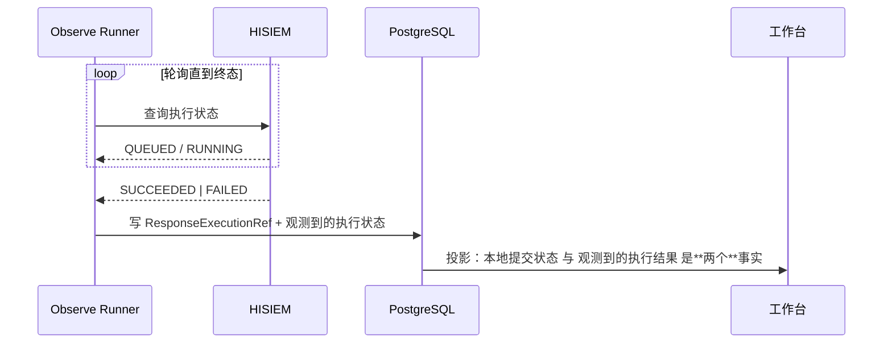

**输入：** 一个已提交的响应命令。

**逐步过程：**

1. Observe Runner 轮询 HISIEM 的执行状态。
2. 直到观测到**终态**（`SUCCEEDED` / `FAILED`）。
3. 写入 `ResponseExecutionRef` + 观测到的执行状态。
4. 工作台展示：**本地提交状态**与**观测到的执行结果**是两个独立的事实。

**核心不变量：**

```text
HISIEM 观测到的执行状态 = 最终执行真相
```

**为什么：**
> Copilot 有一个关于"我提交了什么"的**信念**；HISIEM 有"发生了什么"的**记录**。
> 如果 Copilot 的信念能赢，那么一次丢失的响应或一次发散的重试，会产出一个**自信地报告错误结果**的系统。

**输出：** 一个以 HISIEM 为准的终态。

**边界：**

| 边界 | 说明 |
|---|---|
| 真相边界 | Copilot 的记录是信念；HISIEM 的记录是记录 |
| 时序边界 | Copilot 的视图在观测循环运行期间**可能滞后**——这是正确行为，也是为什么轮询持续到终态 |
| 展示边界 | 提交状态与执行状态必须是**两个**事实（`E5-OBS-02`） |

**容易被问倒的地方：**

> —— "如果两者不一致呢？"
> **HISIEM 赢。** 这就是边界的定义，也是"没有第二个执行真相"的意思。
>
> —— "提交后还没观测到结果时，工作台显示什么？"
> "已提交 —— 等待结果"，而且**不编造外部执行 ID**。此时执行平面的事实是**本地提交状态**，工作台被要求呈现它、并被禁止把它呈现成观测到的结果。

---

## 场景 14 · Workspace Refresh → 持久化真相重建

### 图 2-14-1 投影而非缓存

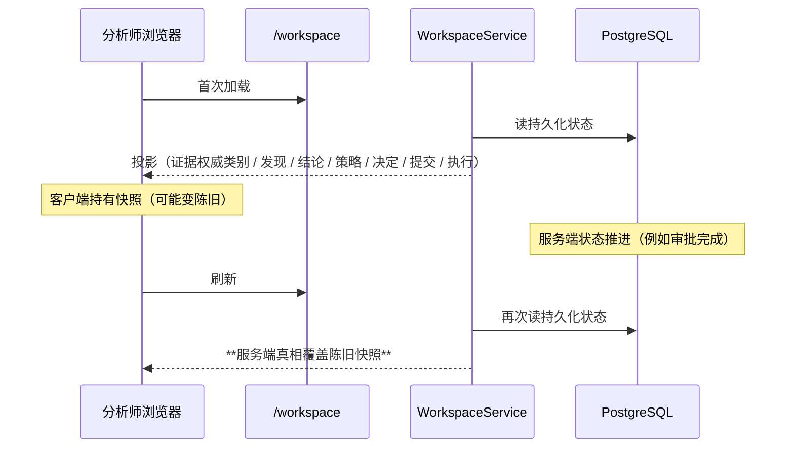

**输入：** 分析师加载或刷新工作台。

**逐步过程：**

1. `WorkspaceService` 从**持久化状态**构建投影。
2. 投影包含：证据权威类别、发现、结论、策略决定、人工决定、提交状态、执行状态、时间线。
3. 客户端可能持有陈旧快照。
4. 刷新时**服务端状态获胜**。

**两个被显式验证的性质：**

| 事实码 | 含义 |
|---|---|
| `WORKSPACE_RECONSTRUCTED_FROM_DURABLE_STATE` | 仅从持久化状态构建的**第二次投影**精确复现持久化真相 |
| `WORKSPACE_STALE_OVERRIDDEN_BY_REFRESH` | 陈旧快照与刷新后的服务端真相**可证明地不同**，且刷新落在服务端 |

**关键：**
> 重建是**对照持久化真相**度量的，**永远不**对照客户端当时看到的东西。
> **瞬时浏览器内存不是判定的输入。**

**输出：** 一个与持久化真相一致的投影。

**边界：**

| 边界 | 说明 |
|---|---|
| 权威边界 | **Frontend ≠ Authority**——前端只派生展示，不发明状态 |
| 重建边界 | 投影是持久化真相的函数，不是缓存的同步问题 |
| 发明边界 | 任何持久化生命周期未记录的审批/执行/提交状态 → `WORKSPACE_INVENTED_AUTHORITY` |

**容易被问倒的地方：**

> —— "工作台的权威类别是从哪来的？"
> 由**前端从持久化的证据来源类型派生**（`web/src/utils/copilot.js`），没有服务端字段。
> 但验收工具**执行真实的前端模块**而不是复述这个映射——**所以评测与 UI 不会漂移**。
> 这是一个已知的、被接受的观察（`E5-OBS-01`）。
>
> —— "前端会不会自己造一个状态？"
> `WORKSPACE_INVENTED_AUTHORITY` 是硬门禁：包括"本地生命周期从未记录过的提交状态"，以及"没有观测到终态却声称执行终止"。

---

## 一页速查

```text
场景 1   部分唯一索引保证"一租户一告警一个活跃调查"
场景 2   Registry → Policy → Budget → Executor；拒绝发生在 Provider 之前
场景 3   唯一归一化路径；provenance 不可漏
场景 4   类型化失败 → 零 Evidence ← 最重要的边界
场景 5   FTS + pgvector + RRF(K=60)；tenant 必填；引用可校验
场景 6   Discovery ≠ Admission ≠ Selection；指纹漂移 → SCHEMA_MISMATCH
场景 7   Evidence → Finding → Verdict；Agent Verdict ≠ Analyst Disposition
场景 8   Policy：DENY | REQUIRE_APPROVAL；DENY 不产生命令
场景 9   批准 ≠ 执行；拒绝不产生命令
场景 10  审批绑定 revision + hash；provenance 不属于可批准契约
场景 11  Outbox + submission_key(tenant, proposal)；发布是提交的后果
场景 12  _MAX_ATTEMPTS = 10 / 退避上限 120s → ATTENTION_REQUIRED
场景 13  HISIEM 观测到的状态 = 最终真相
场景 14  投影从持久化真相重建；服务端刷新获胜
```
