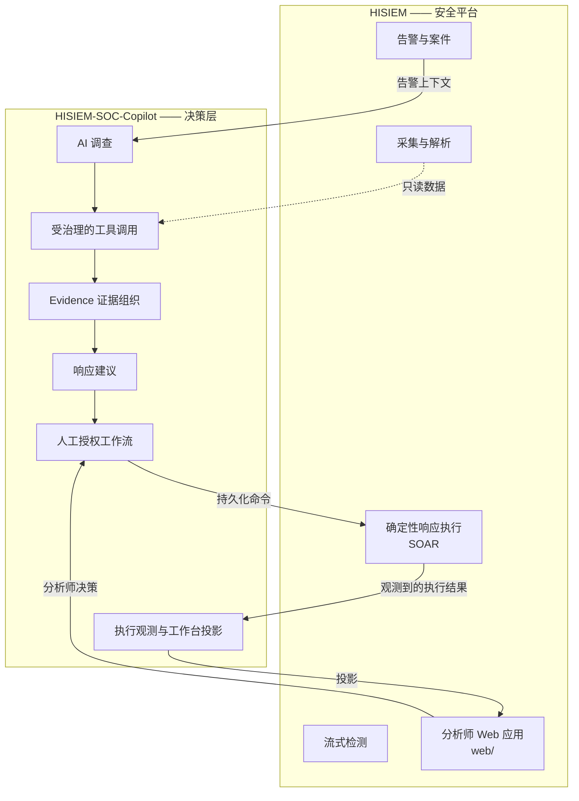
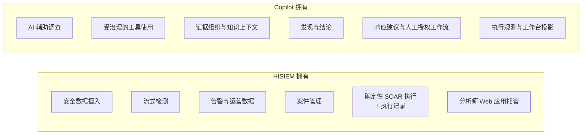
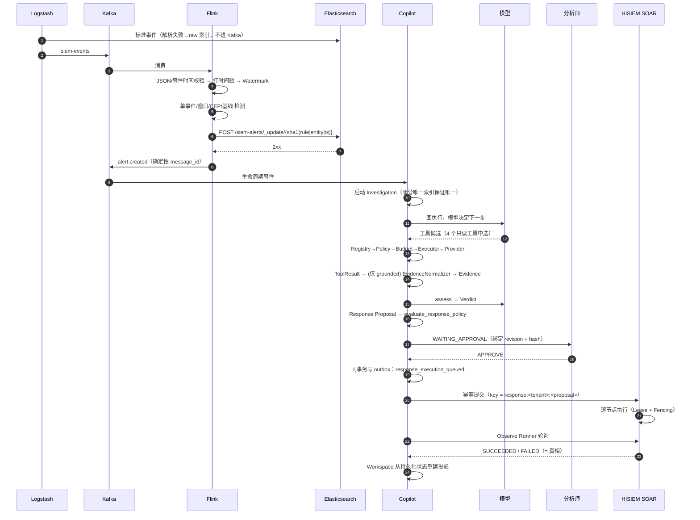
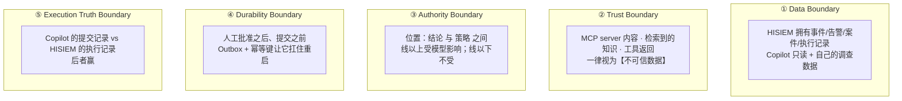
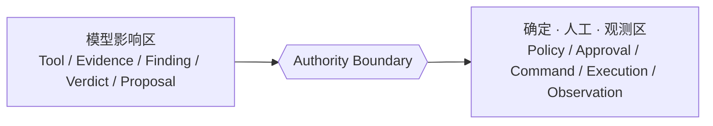
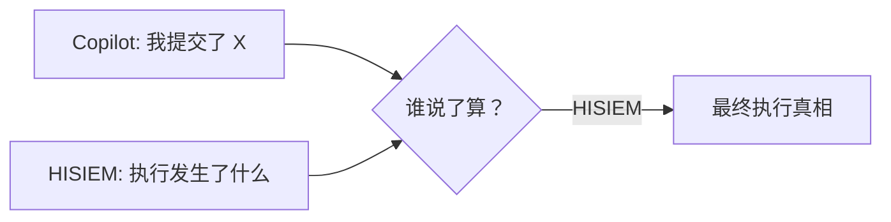
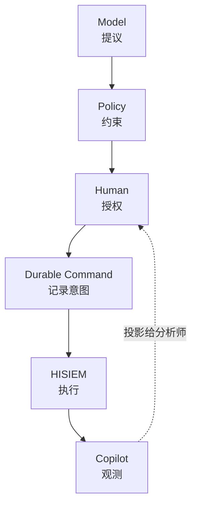
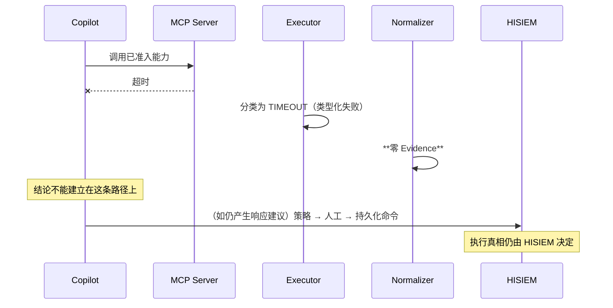

# HISIEM × HISIEM-SOC-Copilot · 端到端架构与数据流

> 本文回答："**两个仓库如何构成一个系统？五条边界分别在哪里？**"
>
> 这是整个学习资料库里**最需要能口述**的一份文档。

---

## 1. 为什么是两个仓库

### 图 X-1 按权限边界拆分



**拆分的理由（必须能一口气说清）：**

| 维度 | HISIEM | Copilot |
|---|---|---|
| 正确性模型 | 事务性、确定性、权威 | 概率性、自适应、只做建议 |
| 失败后果 | 漏检 / 重复告警 / 数据不一致 | 建议错了，但**不会误执行** |
| 信任假设 | 平台代码可信 | **模型输出不可信** |

> **合并的后果：** 模型的"不确定性"会渗进执行路径。
> **拆开之后：** **平台永远不需要知道 Agent 的存在。**

---

## 2. 责任划分

### 图 X-2 谁拥有什么



**一句话：**
```text
HISIEM  =  数据从哪来 + 怎么检测 + 怎么执行 + 执行结果谁说了算
Copilot =  怎么调查 + 怎么组织证据 + 怎么给建议 + 怎么保证不越权
```

**Copilot 永远不是第二个 SIEM，也不是第二个 SOAR。** 它不检测、不拥有告警数据、不执行。

---

## 3. 完整端到端链路

### 图 X-3 一条告警走完全程



### 图 X-4 简化链路（背下来）


---

## 4. 五条边界（跨系统最重要的部分）

### 图 X-5 边界位置图



### 边界 ① · Data Boundary（数据边界）

| 谁 | 拥有 |
|---|---|
| HISIEM | 事件、告警、案件、执行记录、SOAR 状态 |
| Copilot | 调查、Evidence、Finding、Verdict、提案、审批、提交状态 |

**越界后果：** 出现"第二份真相"。系统会开始对"同一件事是什么"产生分歧。

**实现约束：** Copilot 对 HISIEM 数据的访问是**只读的**，通过 `hisiem-integration-contract` 定义的边界。

---

### 边界 ② · Trust Boundary（信任边界）

**凡是"从外面来的"内容，一律是不可信数据：**
```text
MCP Server 的自我描述
MCP 工具返回的内容
检索到的知识文本
模型产出的任何文本
```

**越界后果：** 提示注入可以改写工具选择、租户范围、结论。

**为什么架构能防住：**
```text
注入想让模型选新工具     → 未实现的工具根本不注册
注入想改租户范围         → 租户由服务端注入，模型填了也被拒
注入想让模型授权         → 不存在这样的能力
注入想让引用变成事实     → 引用必须解析到持久化的不可变分块
注入想改策略             → Policy 是确定性系统代码
```

> **必须主动说的边界：注入【可以影响结论】，因为模型在那些文本上推理。
> 它【不能授权任何事】。这是刻意的线。**

---

### 边界 ③ · Authority Boundary（权限边界）

**位置：结论与策略之间。**



```text
线【以上】：模型影响
线【以下】：确定性（Policy）、人工（Approval）、观测（Execution Truth）

从模型输出到副作用之间，不存在代码路径。
```

**越界后果：** 模型输出直接产生副作用——一个提示注入或幻觉变成禁用账号或隔离主机。

---

### 边界 ④ · Durability Boundary（持久化边界）

**位置：人工批准之后、提交之前。**

这个位置之所以关键，是因为"批准"和"执行"之间可能隔着几秒到**几小时**。


**越界后果：**
- 命令只活在内存 → 重启**静默丢失**命令
- 没有幂等键 → 重试变成**第二个业务意图**

**实现：** Outbox 行带 `lease_owner` / `locked_until` / `attempts` / `available_at`；提交键是 `response:<tenant>:<proposal>`。

---

### 边界 ⑤ · Execution Truth Boundary（执行真相边界）

**Copilot 的"提交记录" vs HISIEM 的"执行记录"——后者赢。**



**越界后果：** 一次丢失的响应或一次发散的重试，会产出一个**自信地报告错误结果**的系统。

**为什么这条边界是全局的：**
> Copilot 只有关于"我提交了什么"的**信念**；HISIEM 有"发生了什么"的**记录**。
>
> **唯一一条"等于"：**
> ```text
> HISIEM observed execution result = 最终执行真相
> ```

---

## 5. 权限链条（整个作品集的核心叙事）

### 图 X-6 六段式



```text
Model proposes  →  Policy constrains  →  Human authorizes
Durable command records intent  →  HISIEM executes  →  Copilot observes
```

**每一段为什么必须存在：**

| 段 | 为什么不能省 |
|---|---|
| Model proposes | 模型的价值在**推理与信息搜集** |
| Policy constrains | 确定性规则必须能在**人之前**否决 |
| Human authorizes | 有人必须为**副作用**负责 |
| Durable command | 意图必须扛住**重启** |
| HISIEM executes | 执行能力属于平台，不属于 Agent |
| Copilot observes | 结果必须以**记录**为准，不以**信念**为准 |

---

## 6. 五条边界与九条"不等于"的对应

| 边界 | 对应的"不等于" |
|---|---|
| Data Boundary | LangGraph checkpoint ≠ Domain Truth |
| Trust Boundary | ToolResult ≠ Evidence；Knowledge ≠ Verdict Authority |
| Authority Boundary | Policy ≠ Human Approval；Human Approval ≠ Execution；Frontend ≠ Authority |
| Durability Boundary | （保证 Submission 与 Execution 不混同） |
| Execution Truth Boundary | Submission ≠ Execution Success；Telemetry ≠ Business Truth |

**九条完整清单：**
```text
ToolResult              ≠  Evidence
Knowledge               ≠  Verdict Authority
Agent Verdict           ≠  Analyst Disposition
Policy                  ≠  Human Approval
Human Approval          ≠  Execution
Submission              ≠  Execution Success
Telemetry               ≠  Business Truth
Frontend                ≠  Authority
LangGraph checkpoint    ≠  Domain Truth

HISIEM observed execution result  =  最终执行真相
```

---

## 7. 一次异常的完整传播（跨系统）

### 图 X-7 MCP Server 被判停



**跨系统看这条链的意义：**
> 一个工具挂了，**不会**在 Copilot 侧变成"没有发现"，更**不会**在 HISIEM 侧变成一次错误的执行。
> 这是"ToolResult ≠ Evidence"与"HISIEM 拥有执行真相"两条边界**同时**作用的结果。

---

## 8. 跨系统评测（把两个仓库当**一个系统**验证）

**最有说服力的一点（必须主动讲）：**

```text
XP-01：29 个场景 · 13 条非补偿性硬门禁 · 9 个家族
        横跨两个系统，
        并且【没有修改任一系统的生产代码】。
```

| 事实 | 意义 |
|---|---|
| HISIEM 生产代码改动 = 0 | 不变量被做成**可测**的，而没有动摇被测系统 |
| Copilot 生产层改动 = 0 | 验收是在评测层完成的 |
| 3 个场景是 runtime-integrated | 真实验证需要真进程时就用真进程 |
| 26 个场景是 deterministic | 其余大部分可在任何机器上复现 |

**为什么这一点重要：**
> 让一个**既有系统**变得可测试，而**不让它变得不稳定**——这是一项独立且不平凡的能力。
> 而且这是让两个仓库读起来像**一份工作**而不是两个无关项目的关键。

**已知的未验证项（主动说）：**
```text
语义检索质量未验证（无真实 embedding provider）
7 个可选 span 操作未发射
实时执行路径的现场联通（live wire）未作为最终验收跑过
```

---

## 9. 常见追问与应答骨架

### Q1 "这两个项目什么关系？"

```text
一个系统的两半，按权限边界拆的。
HISIEM 拥有执行真相；Copilot 拥有调查、推理与响应建议。
模型只能提议，不能授权。
```

### Q2 "为什么不合成一个服务？"

```text
正确性模型不同：平台是事务性、确定性的；Agent 是概率性的。
合并会让模型的不确定性渗进执行路径。
拆开后平台不需要知道 Agent 存在。
```

### Q3 "工作台 UI 为什么在 HISIEM 仓库？"

```text
因为 HISIEM 拥有平台的 Web 应用、会话、路由与鉴权。
工作台是那个控制台里的一页，不是独立应用。
代价是一条跨仓库的功能边界；缓解方式是验收工具【执行真实的前端模块】而不是复述映射，
所以评测与 UI 不会漂移。
```

### Q4 "如果 Copilot 和 HISIEM 对结果不一致？"

```text
HISIEM 赢。这就是边界的定义。
Copilot 有"信念"，HISIEM 有"记录"。
```

### Q5 "你怎么知道 Agent 不会误执行？"

```text
因为没有代码路径。
Registry 里没有执行类工具；写能力结构上不可选；
策略是确定性系统代码；批准是独立端点上的真人决定；
批准绑定 revision + hash；命令持久化且幂等。
而且每一条边都有验收场景。
```

### Q6 "这套东西的生产化还差什么？"

```text
模型治理（提示词/版本固定、真实 provider 矩阵、成本预算）
语义检索的真实评测
ATTENTION_REQUIRED 的升级与通知机制
多租户限流与隔离
验收包接入 CI
灾难恢复与审计导出
```

---

## 10. 一页速查

```text
两个仓库，一个系统，按权限边界切。

HISIEM  = 数据 + 检测 + 执行 + 执行真相
Copilot = 调查 + 证据 + 建议 + 不越权

链路：Log → Ingestion → Kafka/ES → Flink → Alert
     → Investigation → Tool/Knowledge → Evidence → Finding → Verdict
     → Response Proposal → Policy → Human Approval → Durable Command
     → HISIEM SOAR → Execution Result → Copilot Observe → Workspace

五条边界：
  ① Data              谁拥有哪份数据
  ② Trust             什么内容不可信
  ③ Authority         谁能授权（位于结论与策略之间）
  ④ Durability        什么能扛住重启（批准与提交之间）
  ⑤ Execution Truth   谁说了算（HISIEM）

九条"不等于"，一条"等于"：
  HISIEM observed execution result = 最终执行真相

最有说服力的跨系统事实：
  29 个场景 / 13 条非补偿性门禁，横跨两个系统，
  且未修改任一系统的生产代码。
```

### 五条边界的记忆口诀

```text
数据分家，内容不信，权限在人，命令落库，结果看平台。
```
