# HISIEM · 系统架构与核心组件

> 本文回答："**系统有什么？各自负责什么？真相在哪里？**"
> 数据"怎么流"请看 [`02_HISIEM_核心场景数据流.md`](02_HISIEM_核心场景数据流.md)。

---

## 1. 系统总体架构

### 图 1-1 双平面总览

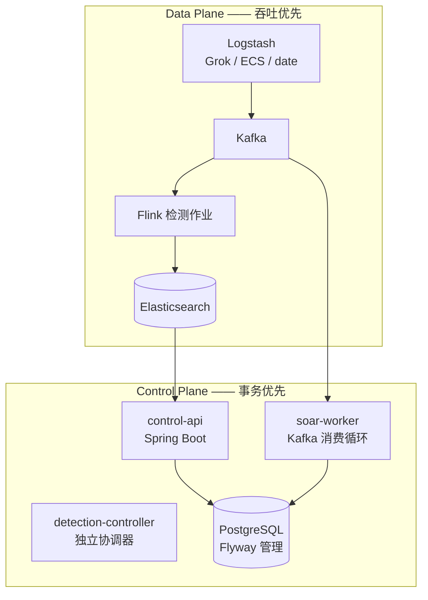

**这张图解决什么问题：** 说明系统为什么不是一个单体。

**组件职责：**

| 组件 | 职责 | 不负责 |
|---|---|---|
| Logstash | 接入、解析、ECS 标准化 | 不做检测 |
| Kafka | 标准事件、解析 DLQ、生命周期消息 | 不做计算 |
| Flink | **检测引擎**：事件时间窗口、CEP、基线、抑制 | 不做存储与案件管理 |
| Elasticsearch | 事件、告警、案件镜像、风险的检索读模型 | 不是事务真相 |
| Spring Boot 控制面 | 案件、规则、鉴权、SOAR 编排、运维 API | 不执行物理检测部署 |
| PostgreSQL | **控制面事务真相**与执行状态 | 不做全文检索 |

**数据从哪来、去哪里：** 日志从 Logstash 进来，分叉到 Elasticsearch（检索）与 Kafka（流处理）；Flink 从 Kafka 读、往 Elasticsearch 写告警；告警生命周期事件回到 Kafka，被 soar-worker 消费，执行状态落到 PostgreSQL。

**Truth / Authority 在哪里：**

```text
PostgreSQL  = 控制面事务真相（案件、执行状态、Outbox）
Elasticsearch = 检索读模型（可以重建）
Flink 算子状态 = 检测中间状态（可 checkpoint 恢复）
```

**可靠性边界：**

| 边界 | 位置 | 风险 |
|---|---|---|
| ① 解析边界 | Logstash → ES raw / ES events + Kafka | 解析失败必须留痕，不能静默丢弃 |
| ② 事件时间边界 | Kafka → Flink 打时间戳 | 时间戳来源是事件本身，源时钟错误无法纠正 |
| ③ 落库边界 | Flink → Elasticsearch | 非事务写入，靠确定性 `_id` 收敛 |
| ④ 公告边界 | ES 写成功 → Kafka 生命周期事件 | 顺序不能反，否则下游会知道不存在的告警 |
| ⑤ 跨存储边界 | PostgreSQL ↔ Elasticsearch | 无分布式事务，靠 Outbox 最终一致 |

---

## 2. 模块与进程边界

### 图 1-2 模块拓扑

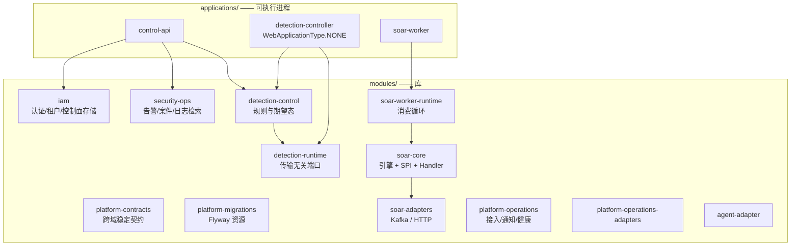

**这张图解决什么问题：** 说明"配置检测"和"运行检测"是两件事。

**关键的三方分离（面试高频）：**

| 模块 | 拥有 | **不拥有** |
|---|---|---|
| `detection-control` | 规则定义、调度、**期望态 vs 观测态** | **物理部署责任** |
| `detection-runtime` | 传输无关的运行时**端口契约** | 部署假设 |
| `applications/detection-controller` | 协调期望态与观测态 | 不是 Web 服务（`WebApplicationType.NONE`） |
| Flink 作业 | 真正的运行时 | 不参与规则管理 |

**为什么这样切：** 让检测**配置**的变更不需要控制面知道 Flink 的存在；让运行时**可替换**而不改变规则语义；并且让"数据库里规则是启用的"永远不会被误认为"规则正在运行"。

**Truth / Authority：** 期望态在 `detection-control`（PG 落库）；观测态来自运行时上报；**两者是不同的事实**。

---

## 3. 采集链路

### 图 1-3 Logstash → Elasticsearch / Kafka

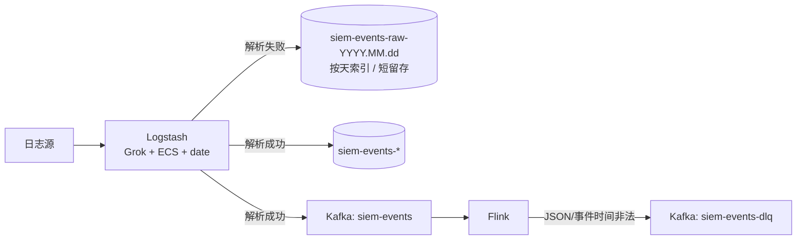

**这张图解决什么问题：** 说明**两种失败策略**的区别。

| 失败点 | 去哪 | 策略含义 |
|---|---|---|
| Logstash 解析失败 | `siem-events-raw-YYYY.MM.dd` | **保留取证**，按天索引、独立短留存，**不进入 Kafka / Flink 检测** |
| Flink 结构/事件时间校验失败 | Kafka `siem-events-dlq` | **隔离待重处理** |

**关键精确点（容易说错）：**

> `siem-events-raw-*` 是 **Elasticsearch 侧的归档索引**，它**不会**进入 Kafka，也不会进入 Flink 检测。它不是"重放通道"。

**Truth / Authority：** 这里没有真相，只有"数据是否完整"。两条失败路径都是**可观测**的，这是本环节的设计目标。

**可靠性边界：** DLQ 有保留但**没有自动重放工具**——记录被保存，不会被自动重新处理。这是一个需要主动说明的当前限制。

---

## 4. Detection Runtime（Flink 作业装配）

### 图 1-4 Flink 作业内部结构

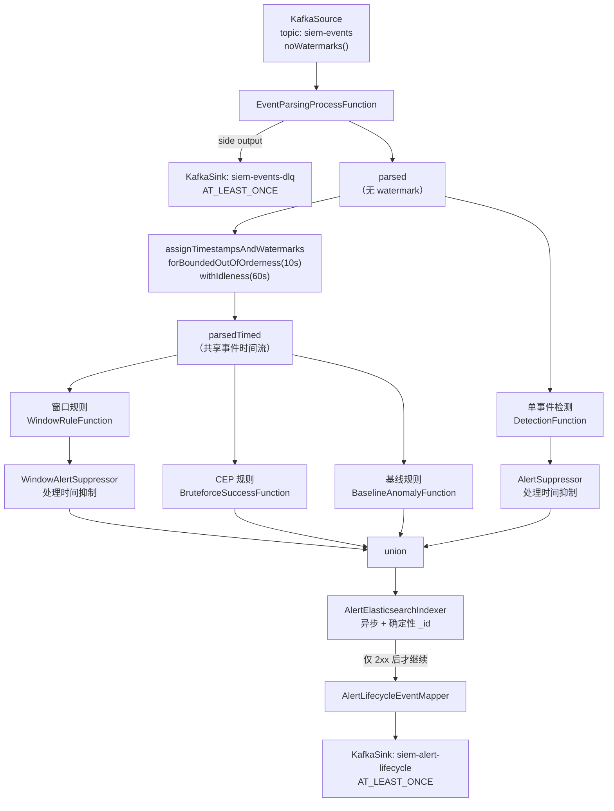

**这张图解决什么问题：** 一次性看清**哪条分支用事件时间、哪条不用**。

> **这是本图最重要的一点：单事件分支消费的是 `parsed`，不是 `parsedTimed`。**
> 也就是说：单事件检测**不依赖 Watermark**，它的抑制使用 **Processing Time**。

**运行参数（真实默认值，来自 `RuntimeTuning`）：**

| 参数 | 默认值 | 环境变量 |
|---|---|---|
| checkpoint 间隔 | 30 秒 | `SIEM_FLINK_CHECKPOINT_INTERVAL_MS` |
| checkpoint 超时 | 10 分钟 | `SIEM_FLINK_CHECKPOINT_TIMEOUT_MS` |
| checkpoint 最小间隔 | 10 秒 | `SIEM_FLINK_CHECKPOINT_MIN_PAUSE_MS` |
| 可容忍失败次数 | 5 | `SIEM_FLINK_CHECKPOINT_TOLERABLE_FAILURES` |
| ES 批大小 | 250 | `SIEM_FLINK_ES_BATCH_SIZE` |
| ES 最大在途 | 3 | `SIEM_FLINK_ES_MAX_IN_FLIGHT` |
| ES 最大缓冲请求 | 500 | `SIEM_FLINK_ES_MAX_BUFFERED` |
| ES 最大缓冲时间 | 500 ms | `SIEM_FLINK_ES_MAX_BUFFER_MS` |

**并发与重启：**

```text
并行度 parallel度 = 2（与 2-slot TaskManager 匹配，KafkaSource 分 2 个并行消费者分摊 3 分区）
重启策略 = exponential-delay
  初始退避 5 秒 → 最大退避 2 分钟
  退避倍数 1.5，抖动因子 0.1，最大尝试次数 10
```

**Truth / Authority：** Flink 算子状态是**可恢复的中间状态**，不是业务真相；业务真相在 PostgreSQL。

**可靠性边界：** 每个算子都显式指定了 `uid(...)`——这是状态能跨作业升级恢复的前提。

---

## 5. Event-Time / Watermark

### 图 1-5 事件时间线

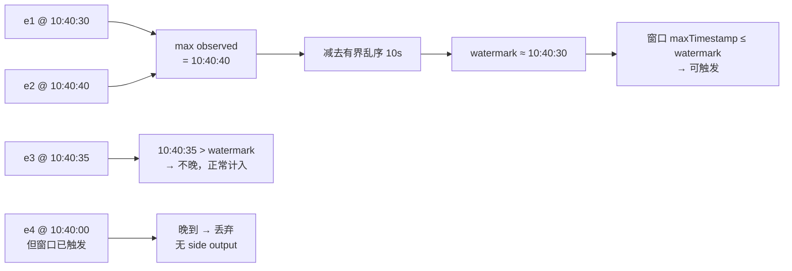

**这张图解决什么问题：** 区分"乱序"和"迟到"——这是最容易混淆的一对概念。

| 机制 | 配置 | 作用 |
|---|---|---|
| 有界乱序 | 10 秒 | 让 Watermark 落后最大观测时间 10 秒，吸收 ≤10 秒的乱序 |
| 空闲输入 | 60 秒 | 某个**输入分区/subtask**静默时，把它从 Watermark 最小值计算中排除 |
| 窗口触发 | watermark ≥ 窗口结束 | 事件时间驱动的触发 |

**Truth / Authority：** Watermark 是一个**假设**（"我不期望再看到 ≤ W 的事件"），不是保证。它是**每个输入通道**的概念，**不是每个 key 的概念**。

**可靠性边界：** 超过 10 秒乱序的事件会错过它的窗口，且**没有 allowedLateness、没有 late-event side output**——这是当前明确的限制。

---

## 6. 检测规则四类

### 图 1-6 四类检测分支

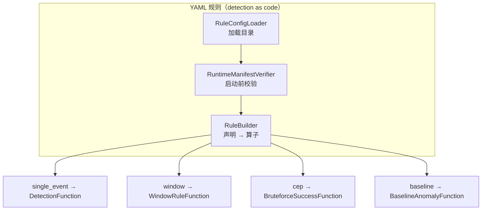

| 类别 | 求值模型 | 本项目规则 | 是否用 Watermark |
|---|---|---|---|
| `single_event` | 逐事件条件匹配 | `rule-ssh-auth-failure-001`、`rule-root-login-failure-001`、`rule-common-user-bruteforce-001` | **否** |
| `window` | 同一 key 在事件时间窗口内命中数 ≥ 阈值 | `rule-ssh-brute-force-001`（滑动 5 分钟 / 步长 1 分钟 / 阈值 5 / key = `source.ip`） | **是** |
| `cep` | 事件时间窗口内有序模式 | `rule-ssh-bruteforce-success-001`（N 次失败后 1 次成功） | **是** |
| `baseline` | 当前窗口计数 vs 滚动均值 + k·σ | `rule-auth-rate-anomaly-001` | **是** |

**共 6 条 YAML 规则**（3 单事件 + 1 窗口 + 1 CEP + 1 基线）。

**Truth / Authority：**
- **规则是配置，不是代码。** 只有 `enabled: true` 的规则会被注册。
- `RuntimeManifestVerifier` 在启动时校验规则目录与运行时清单——**不匹配是启动失败，而不是静默地换一套规则跑**。

**可靠性边界：** 规则集是**演示规模**（6 条），不是生产检测内容库。

---

## 7. Alert 生命周期

### 图 1-7 告警从产生到公告

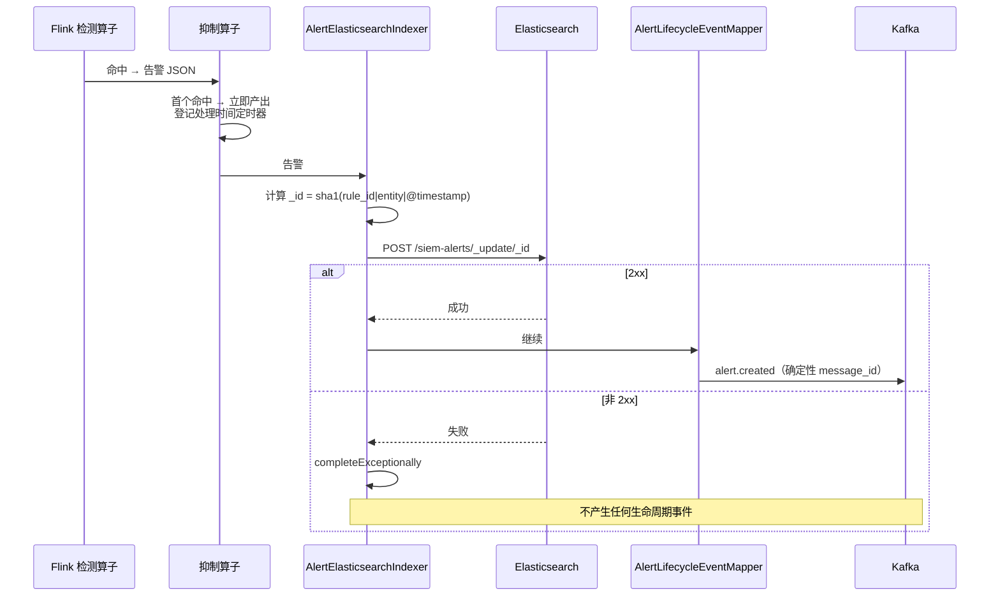

**这张图解决什么问题：** 说明"**下游永远不会知道一个没有被存储的告警**"。

**抑制的两种机制（用不同的时间语义）：**

| 抑制器 | 用于 | 时间语义 | 关键行为 |
|---|---|---|---|
| `AlertSuppressor` | 单事件规则 | **处理时间（墙钟）** | 抑制窗口结束时产出带最终计数的告警，但**保留首个告警的 `@timestamp`** → `_id` 稳定 → ES upsert 覆盖同一文档 |
| `WindowAlertSuppressor` | 窗口规则 | **处理时间** | 收敛同一"规则 + 实体"因滑动窗口重叠产生的多条命中，避免同一攻击建多个告警文档 |

> **注意：窗口本身的检测是事件时间；只有抑制是处理时间。** 这两个不能混为一谈。
> 保留首个 `@timestamp` 不是细节，是**承重设计**：它让抑制更新不会改变文档 id。

**Truth / Authority：** 告警的真相在 Elasticsearch（`siem-alerts`），文档 id 由内容确定性派生。

**可靠性边界：** Kafka Sink 是 at-least-once，重复投递靠确定性 `message_id` 在下游去重。

---

## 8. PostgreSQL / Elasticsearch 一致性

### 图 1-8 跨存储一致性

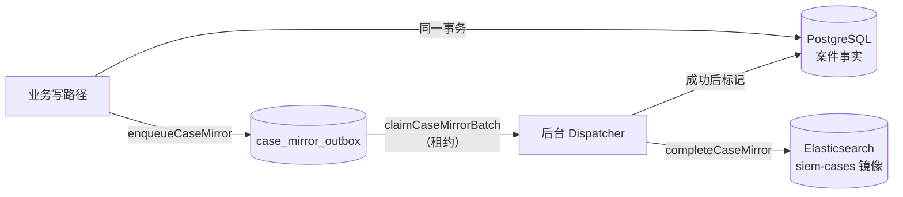

**这张图解决什么问题：** 说明**没有分布式事务**时如何保持两个存储一致。

**核心约束（写在 `CaseStore` 的契约里）：**

> 事实变更在**同一事务**内先落 PostgreSQL 并由 `enqueueCaseMirror` 写入 outbox，再由 `claimCaseMirrorBatch` / `completeCaseMirror` 投递给 Elasticsearch；**业务正常写路径不应绕过此端口直接写 ES**。

**为什么不能用 2PC：** Elasticsearch 不参与 XA；而且两阶段提交用可用性换原子性——对一个告警流水线而言这是错误的取舍。

**Truth / Authority：**

```text
PostgreSQL = 案件的事务真相
Elasticsearch = 可重建的检索镜像
```

**可靠性边界：** **最终一致**。一致性窗口由 outbox 派发延迟与重试策略决定；不存在跨存储快照隔离，读者可能观察到中间状态。

---

## 9. Transactional Outbox

### 图 1-9 两张 Outbox 表

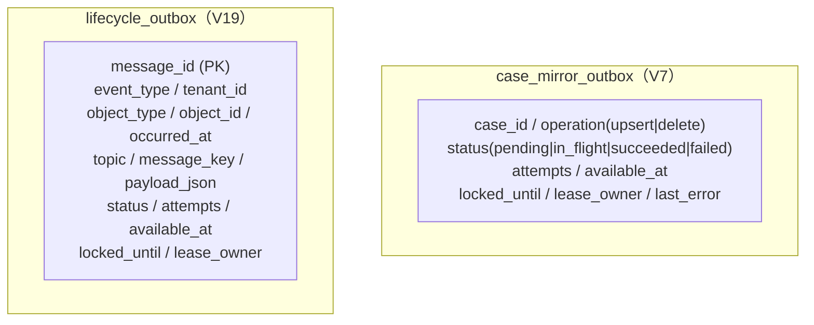

**这张图解决什么问题：** 说明 Outbox 不是"一个模式的名字"，而是**两张真实的表加一套租约语义**。

| 机制 | 作用 |
|---|---|
| `available_at` | 何时可以领取（支持退避重试） |
| `locked_until` + `lease_owner` | 租约：防止多个派发进程领同一批 |
| `attempts` | 重试计数 |
| `message_id` (PK) | **确定性去重键**：重复投递可被下游识别为同一消息 |
| `status` 约束 | 数据库级 CHECK 约束，状态机不可越界 |

**Truth / Authority：** Outbox 表在 PostgreSQL 里，**与业务状态在同一事务中写入**——这就是"因果保证"的来源。

**可靠性边界：** Outbox 提供的是 **at-least-once 投递 + 与提交的因果关联**，**不是 exactly-once**。去重由消费端的幂等键完成。

---

## 10. SOAR 执行引擎

### 图 1-10 SOAR 分层

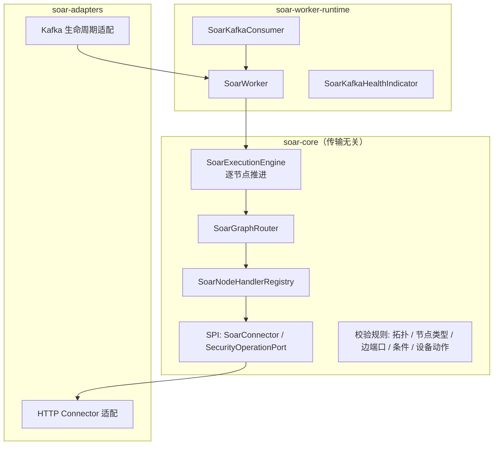

**这张图解决什么问题：** 说明"响应告警"是一个**分布式工作流**，不是一个 webhook。

**节点处理器（11 个具体实现）：**

```text
SoarStartNodeHandler      SoarBusinessNodeHandler    SoarConditionNodeHandler
SoarConnectorNodeHandler  SoarHumanNodeHandler       SoarWaitNodeHandler
SoarParallelNodeHandler   SoarJoinNodeHandler        SoarLoopNodeHandler
SoarLoopEndNodeHandler    SoarEndNodeHandler
```

覆盖：起点、业务动作、条件分支、连接器调用、**人工节点**、等待、并行、汇聚、循环、循环结束、终点。

**迁移版本：** V8 执行 → V9 编排运行时 → V10 平台治理 → V11 生命周期运行时 → V12 Handler 运行时 → V13 并行 → V14 循环 → V15 触发类型。

**Truth / Authority：** 执行状态在 PostgreSQL（`soar_*` 表），**这是执行真相**。

**可靠性边界：** 节点级副作用幂等性由 **connector / action 负责**，引擎不保证——这是必须主动说明的边界。

---

## 11. Lease / Fencing Token

### 图 1-11 租约与隔离令牌

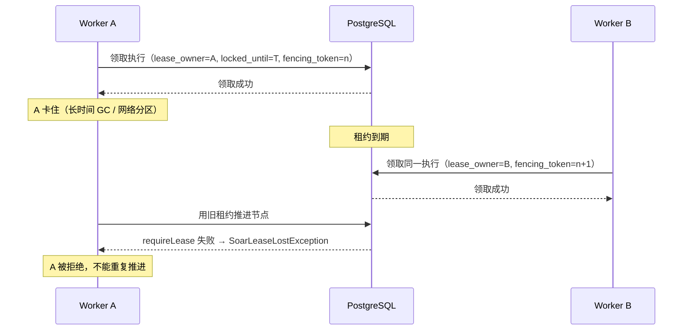

**这张图解决什么问题：** 说明**为什么只有租约不够**。

| 机制 | 回答的问题 | 单靠它不够的原因 |
|---|---|---|
| **Lease（租约）** | 我**什么时候**可以操作？ | 一个被暂停的持有者在租约过期后仍可能发起写 |
| **Fencing Token（隔离令牌）** | 存储层**如何拒绝**过期的持有者？ | 没有它，过期持有者的写会成功 |

**代码证据：**

```java
// SoarExecutionEngine
store.requireLease(claimed);
store.requireLease(execution);
catch (SoarLeaseLostException lost) { ... claimed.fencingToken() ... }
```

**注意边界（不要说错）：** `case_mirror_outbox` 有 `lease_owner` / `locked_until`，但**没有 fencing token 列**。**fencing token 在 SOAR 引擎侧**。不要把两者混淆。

**可靠性边界：** 租约保证的是"不会双推进"，不保证"节点副作用只发生一次"。

---

## 12. Worker / Playbook 执行

### 图 1-12 一次 Playbook 执行的推进

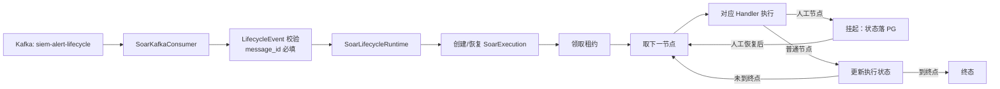

**这张图解决什么问题：** 说明**挂起与恢复**是工作流引擎与"内存里的脚本"的本质区别。

**关键点：**

- 推进是**逐节点**的，不是一次性跑完整个图
- 人工节点会把状态**落在 PostgreSQL 然后退出**，恢复时从持久化状态继续
- 每次推进都受租约保护

**Truth / Authority：** 执行状态（当前节点、尝试次数、租约、终态）= PostgreSQL。

**可靠性边界：**

| 场景 | 行为 |
|---|---|
| Worker 崩溃 | 租约到期 → 被其他 worker 重新领取 → 从持久化状态继续 |
| 两个 worker 同时推进 | 租约 + fencing token 拒绝过期者 |
| 人工节点挂起 | 状态持久化，不占用 worker |

---

## 13. 一页速查

```text
数据面：Logstash → Kafka → Flink → Elasticsearch
控制面：Spring Boot → PostgreSQL

Flink：并行度 2 · checkpoint EXACTLY_ONCE · 30s 间隔 · 重启 exponential-delay 5s→2min ×10
事件时间：forBoundedOutOfOrderness(10s) + withIdleness(60s)，作用在 parsedTimed
单事件：不走 Watermark，抑制用处理时间
窗口/CEP/基线：共享同一个 Watermark

告警 id：sha1(rule_id | entity | @timestamp) → ES _update 幂等
Kafka Sink：AT_LEAST_ONCE（DLQ / lifecycle）
跨存储：Transactional Outbox（case_mirror_outbox / lifecycle_outbox）+ 租约
SOAR：11 个节点处理器 · 租约 + fencing token · 状态在 PostgreSQL
```
