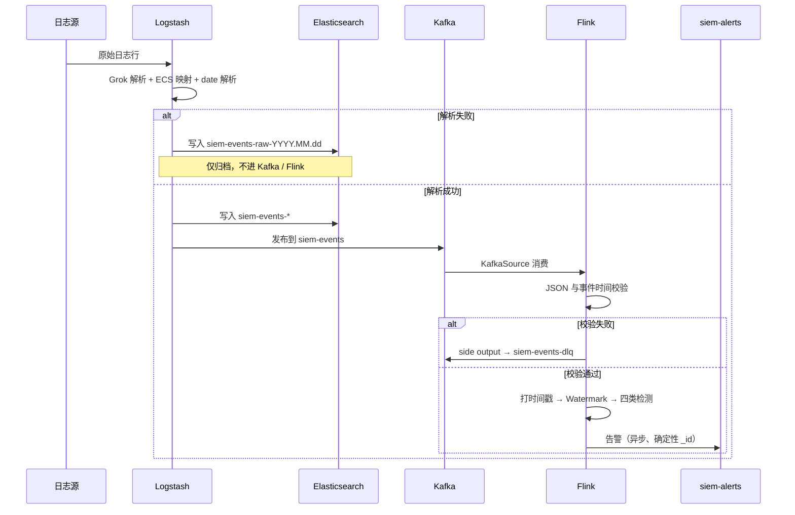
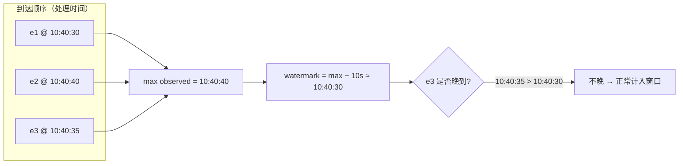
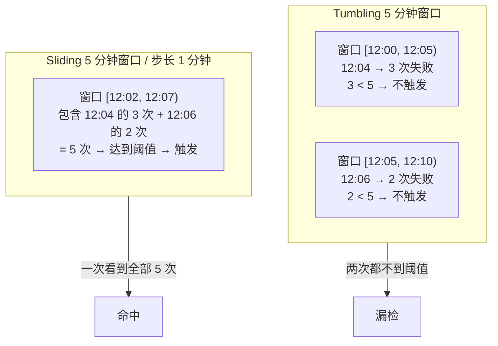
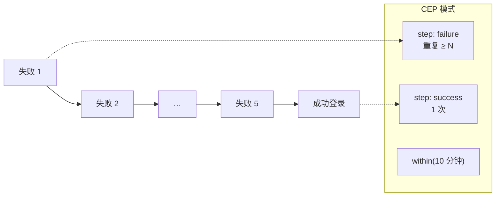
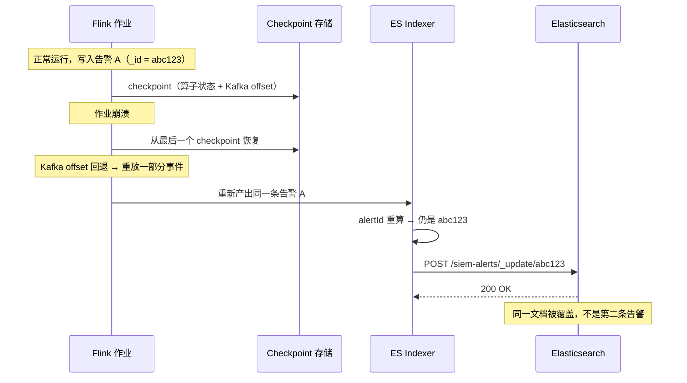
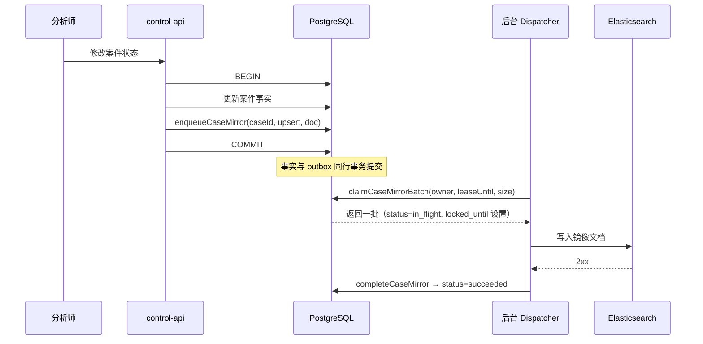
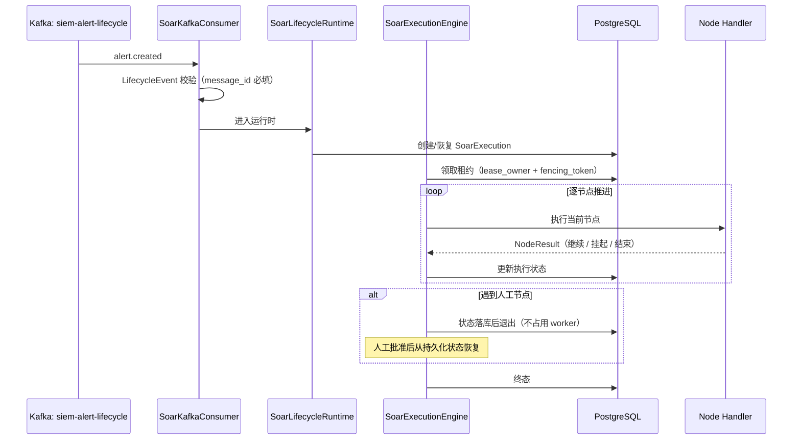
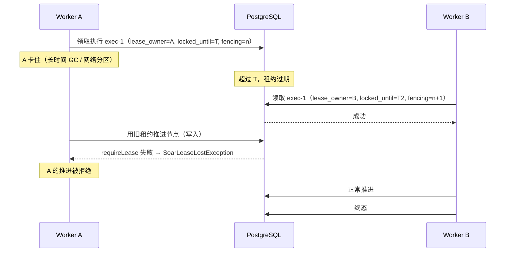

# HISIEM · 核心场景数据流

> 本文回答："**一次真实场景发生时，数据怎么流？**"
> 系统"有什么"请看 [`01_HISIEM_系统架构与核心组件.md`](01_HISIEM_系统架构与核心组件.md)。

**使用方式：** 每个场景都按「输入 → 逐步过程 → 输出 → 边界 → 容易被问倒的地方」组织。
**练习方法：** 合上文档，从"输入"口述到"输出"，卡住再回看。

---

## 场景 1 · 日志 → Logstash → Kafka / ES → Flink → Alert

### 图 2-1-1 主链路



**输入：** 一条原始安全日志行（syslog / agent / 模拟器）。

**逐步过程：**

1. Logstash 用 Grok 解析、映射到 ECS 字段、解析时间字段。
2. **解析失败** → 写 `siem-events-raw-YYYY.MM.dd`（按天、短留存、**不进 Kafka/Flink**）。
3. **解析成功** → 同时写 `siem-events-*`（供检索）和发 Kafka `siem-events`（供检测）。
4. Flink `KafkaSource` 消费，group id `siem-detection`，`committedOffsets(EARLIEST)` 恢复。
5. `EventParsingProcessFunction` 校验 JSON 结构 + 事件时间有效性。
6. 非法 → `siem-events-dlq`；合法 → 打时间戳、推进 Watermark、进入四类检测。
7. 命中 → 告警 → 异步写 `siem-alerts`。

**输出：** Elasticsearch `siem-alerts` 中的一条告警文档。

**边界：**

| 边界 | 说明 |
|---|---|
| 解析边界 | 二选一：raw 归档 或 标准事件，不会两者都写 |
| DLQ 边界 | Flink 侧结构/时间非法 → Kafka DLQ |
| 时间戳边界 | 时间戳来自事件本身，源时钟错误无法纠正 |

**容易被问倒的地方：**

> —— "解析失败的日志会重试吗？"
> **不会。** `siem-events-raw-*` 是 ES 里的归档索引，**不进入 Kafka、不进入 Flink**，也没有自动重放工具。解析失败被**保留取证**，但不会被自动重新处理。这是一个明确的当前限制。
>
> —— "为什么要同时写 ES 和 Kafka？"
> 职责不同：ES 服务**分析师检索**（向后看），Kafka 服务**流式检测**（向前算）。两者消费同一份解析结果，但用途不同。

---

## 场景 2 · 乱序事件 → Timestamp → Watermark → Window → Alert

### 图 2-2-1 时间线



**输入：** 无界事件流，事件自带时间戳，到达顺序与事件时间顺序不一致。

**逐步过程：**

1. `EventParsingProcessFunction` 从事件中提取 `timestampMillis`。
2. `forBoundedOutOfOrderness(10s)` 计算 Watermark = 最大观测事件时间 − 10 秒 − 1 毫秒。
3. 事件 `10:40:35` 在 Watermark 已到 `10:40:30` 时到达：`10:40:35 > 10:40:30` → **不晚**，正常计入。
4. Watermark **只前进不后退**（单调性）。
5. 窗口在其 `maxTimestamp ≤ watermark` 时可触发。

**关键公式：**

```text
watermark = max_observed_event_time − out_of_orderness − 1ms
窗口触发条件：watermark ≥ window.maxTimestamp()
```

> 那个 `−1ms` 是真实存在的：Flink 判定"迟到"的条件是 `timestamp ≤ watermark`。
> 多减 1 毫秒，可以让"恰好等于 max − 10s"的事件仍然算**按时**，也就是边界是**闭区间**。

**输出：** 窗口在事件时间意义上一致地触发。

**边界：**

| 边界 | 说明 |
|---|---|
| 乱序容差边界 | ≤10 秒的乱序被吸收；超过则可能错过窗口 |
| 时间戳来源边界 | 事件自带时间戳可信与否，本系统不校验、不纠偏 |
| 迟到边界 | 没有 allowedLateness、没有 late side output |

**容易被问倒的地方：**

> —— "Watermark 是过滤器吗？"
> **不是。** 它不阻止数据流向下游，它只决定**窗口是否可以求值**，以及一个元素是否被判定为迟到。
>
> —— "Watermark 是每个 key 的吗？"
> **不是。** Watermark 是**每个输入通道**（input channel）的概念，跨通道取**最小值**。它跟 `source.ip` 这类 key 完全无关。
>
> —— "事件 `10:40:35` 比最新的 `10:40:40` 早，为什么还处理？"
> 因为 Watermark 故意落后最大值 10 秒。**这个落后的距离就是乱序预算。**

---

## 场景 3 · Sliding Window 检测（边界盲区）

### 图 2-3-1 为什么需要滑动窗口



**输入：** 同一 `source.ip` 的认证失败事件，散布在窗口边界两侧。

**具体例子（阈值 = 5）：**

```text
12:04 → 3 次失败
12:06 → 2 次失败
```

- **Tumbling 5 分钟窗口**：`[12:00,12:05)` 看到 3 次（不触发），`[12:05,12:10)` 看到 2 次（不触发）→ **漏检**
- **Sliding 5 分钟 / 步长 1 分钟**：存在一个窗口 `[12:02,12:07)` 同时包含 5 次 → **触发**

> **注意：** 这个例子里两次 Tumbling 窗口**各自都没有达到阈值 5**，所以合起来是真正的漏检。
> 如果举例成 "5 次 + 5 次"，那两边的 Tumbling 窗口本身就会触发，例子就错了。

**逐步过程：**

1. `rule-ssh-brute-force-001` 声明 `windowMinutes: 5`、`slidingMinutes: 1`、`threshold: 5`、`keyField: source.ip`。
2. `DetectionJob` 判断 `slidingMinutes > 0` → 使用 `SlidingEventTimeWindows.of(5min, 1min)`。
3. `WindowRuleFunction` 在每个窗口内统计命中数，与阈值比较。
4. 命中 → 产出告警 JSON → `WindowAlertSuppressor` 按"规则 + 实体"抑制。

**输出：** 一条 critical 告警。

**代价（必须主动说）：**

> 滑动窗口会让同一批事件落入多个窗口。5 分钟窗口 / 1 分钟步长 ≈ **每个事件被 5 个窗口评估**。
> 代价是状态与 CPU 上升；收益是消除边界盲区。
> 而**重复告警**由 `WindowAlertSuppressor` 收敛——这是"为自己的修复付出代价"的配套设计。

**边界：**

| 边界 | 说明 |
|---|---|
| 窗口语义边界 | 检测是**事件时间**；抑制是**处理时间**，两者不同 |
| 重复告警边界 | 靠抑制器 + 确定性 `_id` 双重保护 |

**容易被问倒的地方：**

> —— "为什么不用更长的窗口？"
> 更长窗口会提高延迟、增大状态，而且仍然有边界问题——只是把边界挪走。滑动窗口是**针对边界**的直接修复。
>
> —— "滑动窗口会不会产生多条告警？"
> 会。**这正是 `WindowAlertSuppressor` 存在的原因。**

---

## 场景 4 · CEP 攻击链检测

### 图 2-4-1 模式匹配



**输入：** 同一个 `source.ip` 的事件序列，包含 N 次认证失败后的一次成功登录。

**逐步过程：**

1. 规则 `rule-ssh-bruteforce-success-001` 声明 `category: cep`、`keyField: source.ip`、`withinMinutes`。
2. `CEP.pattern(parsedTimed.keyBy(source.ip), pattern)` 建立模式。
3. 模式由 `buildCepPattern` 构建：
   - `p.next(step.name).where(cond)` → **严格连续**（中间不能插入其他事件）
   - `p.followedBy(step.name).where(cond)` → **宽松连续**（允许插入其他事件）
   - `p.within(Duration.ofMinutes(cep.withinMinutes))` → 时间约束
4. 匹配 → `BruteforceSuccessFunction` 产出 critical 告警。

**为什么需要 CEP 而不是窗口：**

```text
窗口规则回答：某个时间范围内"发生了多少次"
CEP 回答：    某个时间范围内"按顺序发生了什么"

"暴力破解发生了" 是计数问题
"暴力破解成功了" 是序列问题
```

**输出：** 一条携带完整攻击链的 critical 告警。

**边界：**

| 边界 | 说明 |
|---|---|
| 状态边界 | 模式需为每个 key 保留**部分匹配状态**，持续 `within()` 时长 |
| 连续性边界 | `next` 精度高但容易被无关事件打断；`followedBy` 更宽容但精度低 |

**容易被问倒的地方：**

> —— "CEP 的状态开销？"
> 每个 key 的部分匹配状态要保留整个 `within()` 时长。**这是作业里最大的状态**，因为它直接影响 checkpoint 的大小和时长。
>
> —— "为什么不全部用 `next`？"
> 严格连续要求两步之间**不能有任何无关事件**。真实日志流里几乎不可能，会大量漏检。
> 所以规则按步骤选择——**精度与召回之间逐段权衡**。

---

## 场景 5 · Flink 重启 / Replay → 确定性 alert id → ES 收敛

### 图 2-5-1 重放收敛



**输入：** Flink 作业崩溃并重启；Kafka offset 回退导致一部分事件被重放。

**逐步过程：**

1. Checkpoint 恢复：算子状态（窗口内容、抑制状态、基线统计）+ Kafka offset 一起回到一致点。
2. 重放导致同一条事件被再次处理 → 同一条告警被再次产出。
3. `alertId(element)` 重新计算：`sha1(rule_id | entity | @timestamp)`。
4. **输入相同 → id 相同**（`@timestamp` 来自事件本身，不随重放改变）。
5. 写路径是 `POST /siem-alerts/_update/<id>` → **upsert**。
6. 结果：同一文档被更新，**不产生重复告警**。

**entity 的取值优先级（必须记得）：**

```text
alert.entity  →  否则 source.ip  →  否则 user.name  →  否则 "unknown"
```

> 这个优先级顺序很重要：**id 必须对每个规则类别都可计算**。

**抑制场景下的 id 稳定性：**

```text
首个命中 → 立即产出告警（保留首个 @timestamp）
抑制窗口内后续命中 → 只累加计数
窗口结束 → 产出带最终计数的告警，但 @timestamp 仍然是首个的
→ _id 不变 → ES upsert 覆盖同一文档
```

**输出：** ES 中仍然只有一条告警文档，计数被更新。

**边界：**

| 边界 | 说明 |
|---|---|
| 状态一致性边界 | Checkpoint 保证算子状态与 offset 一致 |
| 投递语义边界 | Kafka Sink 是 **AT_LEAST_ONCE** → 重复投递**可能发生** |
| 收敛边界 | 重复投递的**无害化**靠确定性 id，不靠传输层 |

**容易被问倒的地方：**

> —— "所以是 exactly-once 吗？"
> **不是端到端 exactly-once。** 准确说法是：
> **Flink 算子状态以 exactly-once 模式 checkpoint；Kafka Sink 明确是 at-least-once；Elasticsearch 写入靠确定性 id 幂等收敛。**
>
> —— "什么会破坏这个收敛？"
> id 的输入失去确定性。例如把 event time 换成 processing time，或者改动 entity 的优先级顺序 —— 重放就会开始产生**新文档**。
> 这是一个"正确但必须被维护"的性质。

---

## 场景 6 · Case 修改 → PostgreSQL → Outbox → Elasticsearch Mirror

### 图 2-6-1 Outbox 派发



**输入：** 分析师修改案件。

**逐步过程：**

1. 事实变更与 `enqueueCaseMirror` 在**同一事务**内提交。
2. 后台 Dispatcher 用**租约**领取一批（`lease_owner` + `locked_until`）。
3. 投递到 Elasticsearch。
4. 成功 → 标记 `succeeded`；失败 → `last_error` 记录，`available_at` 推后重试。

**核心契约（写在 `CaseStore` 里）：**

> **业务正常写路径不应绕过此端口直接写 ES。**

**输出：** PG 与 ES 最终一致。

**边界：**

| 边界 | 说明 |
|---|---|
| 事务边界 | 事实 + outbox 同行提交；Kafka/ES 发布在事务**之外** |
| 一致性边界 | **最终一致**，不是强一致 |
| 投递语义边界 | at-least-once + 幂等消费 |

**容易被问倒的地方：**

> —— "为什么不用分布式事务？"
> Elasticsearch 不参与 XA；而且 2PC 用**可用性**换原子性——对告警/案件流水线是错误的取舍。
> **Outbox + 幂等消费给的是 at-least-once 加收敛，这才是领域真正需要的。**
>
> —— "Dispatcher 挂了怎么办？"
> 租约到期后 `locked_until` 过期，这批会被**重新领取**。这是租约存在的意义——朴素的 outbox 在派发者中途死亡时会泄漏消息。

---

## 场景 7 · SOAR：Trigger → Execution → Lease → Node → Result

### 图 2-7-1 一次 Playbook 执行



**输入：** 一条 `alert.created` 生命周期事件。

**逐步过程：**

1. `SoarKafkaConsumer` 消费，`LifecycleEvent` 校验（`message_id` 不能为空）。
2. `SoarLifecycleRuntime` 创建或恢复执行实例。
3. `SoarExecutionEngine` 领取租约（带 `fencingToken`）。
4. 逐节点推进：`SoarGraphRouter` 决定下一个节点 → `SoarNodeHandlerRegistry` 找到处理器 → 执行。
5. 遇到人工节点 → **状态落库后退出**，不占用 worker。
6. 到达终点 → 写入终态。

**节点类型（11 类处理器）：** 起点、业务动作、条件、连接器、人工、等待、并行、汇聚、循环、循环结束、终点。

**输出：** PostgreSQL 中的执行终态。

**边界：**

| 边界 | 说明 |
|---|---|
| 幂等边界 | 引擎保证"不双推进"，**不保证节点副作用只发生一次** |
| 挂起边界 | 人工节点靠持久化状态恢复，不靠内存 |
| 租约边界 | 每次推进都 `requireLease` |

**容易被问倒的地方：**

> —— "节点副作用幂等吗？"
> **引擎不保证。** 幂等性是 **connector / action 自己的责任**——这是诚实的边界，不要含糊过去。
>
> —— "人工节点挂起时 worker 在做什么？"
> 什么都不做。状态已经落库，worker 释放。**这是工作流引擎与"内存里的脚本"的本质区别。**

---

## 场景 8 · Worker Crash / Lease Expiry / Reclaim

### 图 2-8-1 租约丢失与隔离



**输入：** Worker A 在处理执行 `exec-1` 时卡住（GC 停顿、网络分区、进程被挂起）。

**逐步过程：**

1. A 持有租约（`lease_owner=A`、`locked_until=T`、`fencing_token=n`）。
2. A 卡住，租约到期。
3. B 领取同一个执行（`fencing_token=n+1`）。
4. A 醒来，试图用**旧租约**推进 → `store.requireLease(...)` **失败** → `SoarLeaseLostException`。
5. B 正常推进到终态。

**为什么"只有租约"不够：**

```text
租约回答：我在什么时间窗口内可以操作
fencing token 回答：存储层如何拒绝一个过期持有者

一个被暂停的持有者在租约过期后仍然会尝试写。
没有 fencing token，那次写会成功。
```

**输出：** 执行被恰好一个有效的 worker 推进，不会双推进。

**边界：**

| 边界 | 说明 |
|---|---|
| 双推进边界 | 租约 + fencing token 保护 |
| 重复副作用边界 | **不在引擎层保证**（见场景 7） |
| 表范围边界 | `case_mirror_outbox` 有租约列但**没有** fencing token 列；fencing 在 SOAR 引擎侧 |

**容易被问倒的地方：**

> —— "租约和 fencing token 有什么区别？"
> 见上。**这是本场景的核心考点。**
>
> —— "如果 A 在收到拒绝之前已经调用了一个外部连接器怎么办？"
> 那是一次**可能重复的外部副作用**。引擎无法阻止它——这就是"节点副作用幂等性是 connector 的责任"这句话的由来。
> **主动说出这个边界比被问出来要好。**

---

## 一页速查

```text
场景 1  主链路：解析失败→raw（不进 Kafka/Flink）；成功→ES + Kafka
场景 2  乱序≠迟到：≤10s 乱序被吸收；watermark = max − 10s − 1ms
场景 3  滑动窗口消除边界盲区（3 + 2 vs 阈值 5）；代价由抑制器收敛
场景 4  CEP 解决"序列"问题；next 严格 / followedBy 宽松；状态最大
场景 5  重放收敛：确定性 _id → ES upsert；不是 exactly-once
场景 6  Outbox：事实 + outbox 同事务；租约领取；最终一致
场景 7  SOAR：逐节点推进；人工节点落库挂起
场景 8  租约 + fencing token：防双推进；不防重复副作用
```
