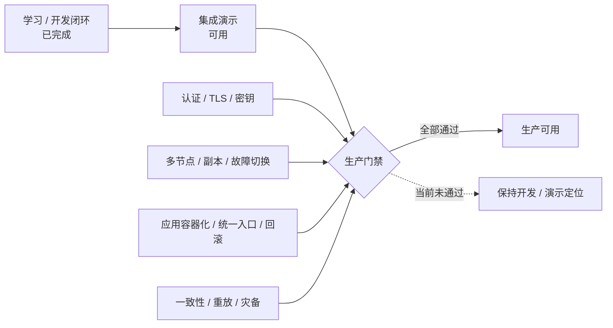
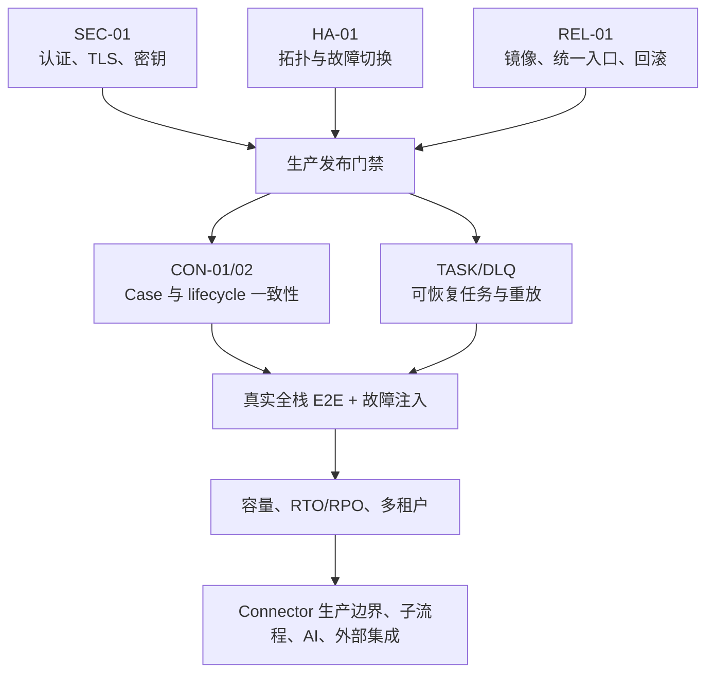

# 项目进展与遗留问题

> 定位：面向项目交接、迭代决策和后续开发的管理视图。当前运行事实仍以 [`current-status.md`](current-status.md) 为准，功能/API 以 [`product-contract.md`](product-contract.md) 为准，阶段优先级以 [`roadmap.md`](roadmap.md) 为准；本文不建立第四份接口契约。
>
> 基线：2026-08-24，`add_frame` 分支，WSL2 + Docker Desktop；最近一次完整验证基线为 Spring Boot 114 个测试、Flink 38 个测试、前端 3 个单元测试、生产构建和 1 条 Playwright E2E。

## 1. 当前结论

HISIEM 已经形成“日志接入 → 标准事件 → 实时检测 → 告警处置 → 案件调查 → SOAR 编排 → 运行监控”的开发闭环，适合学习、功能开发和集成演示。当前不能宣称生产就绪，主要门槛不是再增加页面，而是数据面安全与高可用、跨系统一致性、故障恢复、容量验证和完整租户隔离。

| 使用目标 | 当前判断 | 说明 |
| --- | --- | --- |
| 代码学习与架构研究 | 可用 | 核心链路、实现剖面、数据流图和测试入口已经整理 |
| 单机开发与功能验证 | 可用 | WSL2 + Docker Desktop 基线已验证，数据面与控制面可独立调试 |
| 集成演示 | 可用但需按部署手册启动 | 需要 PostgreSQL/ES/Kafka/Logstash/Flink/Kibana、Spring Boot 和前端同时可用 |
| 小范围试运行 | 有条件 | 只能在隔离网络、非敏感数据和明确人工值守条件下进行 |
| 生产部署 | 不可用 | P0 安全、高可用和交付形态门禁尚未关闭 |

## 2. 能力域进展

| 能力域 | 状态 | 已完成范围 | 当前边界 |
| --- | --- | --- | --- |
| 日志接入与解析 | 已完成开发闭环 | TCP/Syslog/File 数据源、解析模板、预览、激活/停用/删除、原子配置写入、持久 sincedb、raw 失败隔离 | 生产接入协议、采集代理治理和超大规模来源管理未覆盖 |
| 事件检测 | 已完成开发闭环 | YAML 规则、单事件/滑动窗口/CEP/基线四类分支、事件时间/watermark、告警抑制、确定性 ID、安全 partial update | CEP/基线仍只读维护；尚未做生产规模基准和规则热升级治理 |
| 数据质量 | 已完成基础保护 | Logstash 解析失败进入 `siem-events-raw-*`；Flink 坏 JSON/非法时间戳进入 `siem-events-dlq` | DLQ 没有管理页面、审批式重放和积压告警 |
| 告警与调查 | 已完成主要旅程 | 告警筛选/详情/批量处置、自动聚合、案件状态/负责人/证据/时间线、告警与案件关联 | PostgreSQL、ES 与告警 marker 仍是补偿 + 最终一致性模型 |
| 控制面与权限 | 已完成基础闭环 | Spring Security、Bearer 会话、RBAC、首次改密、审计、通知、Flyway V15、后台任务租约 | 数据面尚未形成完整 tenant 隔离；生产密钥与统一身份源未接入 |
| SOAR | 已完成持久编排扩展 | lifecycle/人工触发、11 类 Handler、持久并行/静态循环、Connector SPI/HTTP、验证器链、逐 attempt、幂等回执、续租与 fencing | 无 Cron/Webhook、子 Playbook、AI、凭据库、Connector 生产隔离和事务 lifecycle outbox |
| Vue 控制台 | 已完成主要页面重构 | Vue 3 路由、模块拆分、统一请求错误、结构化详情、规则编辑、Vue Flow 设计器、离开保存保护 | 浏览器 E2E 目前只覆盖一个使用 mock API 的 Playbook 编辑旅程 |
| 运维与交付 | 已完成开发环境基线 | 六组件健康扫描、Kafka/Flink 语义检查、ES 备份恢复、Compose 校验、部署脚本、GitHub Actions | Spring Boot/前端不在 Compose 内；缺少生产反向代理、统一证书和环境级发布回滚 |
| 文档与学习材料 | 已完成当前整理 | 当前事实、产品契约、架构/数据流、实现剖面、SOAR、部署运维和学习地图已分层 | 归档只能用于历史追溯，不能重新作为开发契约 |

## 3. 最近完成的可靠性收口

最近一轮交付重点不是扩展功能面，而是修复会造成错误状态或不可恢复结果的问题：

- Case 镜像删除将任意 HTTP 2xx 和 404 视为幂等成功；keystore 同时从 Git 和部署同步中隔离。
- SOAR Worker 每次只领取一条执行，长节点持续续租，所有状态提交校验 owner、未过期租约和 fencing token；旧 Worker 不能覆盖新 owner。
- Playbook 新建后可稳定进入草稿，路由离开等待最新保存；保存失败阻止导航，刷新/关闭提示未保存内容。
- Flink 严格解析 `@timestamp`，毒消息进入独立 DLQ，不再回退到处理时间或触发 restart loop。
- CI 并行执行 Spring、Flink、前端单元测试、生产构建和浏览器 E2E。
- 架构图已补齐 raw、DLQ、案件 outbox、lifecycle、SOAR 上下文/租约和真实规则分支；历史图已标记为不可复用快照。

## 4. 遗留问题总表

状态定义：`未开始` 表示尚无实现；`部分完成` 表示已有保护但未达到关闭条件；`待环境验证` 表示代码具备基础能力，但缺少生产拓扑或故障演练证据。

| ID | 优先级 | 状态 | 问题 | 主要影响 |
| --- | --- | --- | --- | --- |
| SEC-01 | P0 | 未开始 | ES/Kafka 默认明文，PostgreSQL 使用开发口令并暴露宿主端口 | 数据与凭据可能被未授权访问 |
| HA-01 | P0 | 未开始 | ES/Kafka 为单节点，Kafka RF=1，Flink 也是单 JobManager 基线 | 任一核心节点故障可能中断或丢失服务 |
| REL-01 | P0 | 部分完成 | Spring Boot 与前端未纳入统一生产编排、反向代理和发布回滚 | 无法形成可重复的生产交付物 |
| CON-01 | P1 | 部分完成 | Case 采用 PG 事实 + 同步 ES 保护 + outbox/reconcile 混合一致性 | 故障窗口可能产生暂时不一致或孤儿 marker |
| CON-02 | P1 | 未开始 | 控制面 lifecycle 发布不是事务 outbox | 业务写成功但 Kafka 发布失败时，SOAR 可能漏触发 |
| TASK-01 | P1 | 部分完成 | 后台任务有租约和恢复，但 handler 重放/幂等策略未统一 | 进程崩溃后部分任务仍需人工判断 |
| DLQ-01 | P1 | 部分完成 | 事件 DLQ 只有隔离/只读观测；lifecycle 没有运营型 DLQ | 毒消息处置、审批重放和积压治理不完整 |
| TEST-01 | P1 | 部分完成 | CI 浏览器测试使用 mock API，缺少真实全栈和多实例故障注入 | 单元测试通过不代表部署链路与恢复语义成立 |
| OBS-01 | P1 | 部分完成 | Logstash 宿主扫描常只能确认 TCP；outbox/DLQ/lease 缺少统一告警 | 故障可能被显示成降级或较晚发现 |
| TENANT-01 | P2 | 部分完成 | SOAR 控制表含 tenant，但事件、告警、案件和 ES 索引未完整隔离 | 不能用于严格多租户场景 |
| SOAR-01 | P2 | 部分完成 | Connector SPI、通用 HTTP、幂等与脱敏已完成；凭据治理、mTLS/代理、限流/熔断和隔离未完成 | 只适合学习环境的受控无凭据 API |
| SOAR-02 | P2 | 部分完成 | 持久并行和静态 item 循环已完成；缺少 OR、动态 map/while、子 Playbook 和补偿栈 | 能表达有限复杂流程，尚非通用 SOAR |
| RULE-01 | P2 | 部分完成 | 页面只允许编辑 single_event/window，CEP/基线保持只读 | 高级规则仍依赖代码评审和部署 |
| SCALE-01 | P2 | 待环境验证 | 未完成长期吞吐、索引保留、checkpoint、升级和 RTO/RPO 压测 | 容量上限和恢复时间未知 |
| INT-01 | P2 | 未开始 | 外部邮件/Webhook 通知、完整 TI feed 和统一身份源未接入 | 产品仍以本地学习/演示生态为主 |
| DATA-01 | P2 | 部分完成 | ECS 已落地，OCSF 只有最小辅助映射 | 尚不能声明完整数据标准合规 |

## 5. 关闭条件

### P0：生产门禁

#### SEC-01 数据面安全

- ES HTTP/transport TLS 和认证启用，Kafka 使用 SASL_SSL/SCRAM 或等价机制；
- PostgreSQL、ES、Kafka 凭据由环境密钥系统注入，仓库和镜像不包含生产秘密；
- 宿主端口按最小暴露原则收敛，服务账户具有最小权限；
- `REQUIRE_PRODUCTION_SECURITY=1` 的部署校验通过，并完成证书轮换演练。

#### HA-01 高可用

- 形成经过评审的 ES/Kafka/Flink/PostgreSQL 生产拓扑，Kafka topic RF≥2；
- 核心节点停止、重启、网络短暂中断时，业务能够恢复且数据损失边界可解释；
- checkpoint、Kafka 数据、PG 数据和 ES snapshot 使用独立持久存储；
- 故障演练记录实际 RTO/RPO，而不是只验证容器重新启动。

#### REL-01 可发布交付物

- Spring Boot 与前端构建为版本化镜像，通过反向代理提供统一 HTTPS 入口；
- 配置、密钥、数据库迁移和静态资源版本具有明确升级顺序；
- 提供部署、健康确认、滚动升级和一键回滚流程；
- 发布候选在接近生产的拓扑上完成端到端验收。

### P1：一致性、恢复和可观测性

#### CON-01 Case 一致性

- 对 PG 成功/ES 失败、ES 成功/PG 冲突、进程在各步骤退出执行自动故障注入；
- outbox backlog、失败次数和最长滞留时间有指标与告警；
- 提供 `case_alerts`、`alert.case_id` 和 `siem-cases` 的差异扫描及安全修复工具；
- 多 dispatcher 领取策略经过并发验证，镜像在约定时间内收敛。

#### CON-02 与 DLQ-01 lifecycle 可靠投递

- 控制面业务事务同时写 lifecycle outbox，发布器使用稳定 `message_id` 并可重启续传；
- 非法 lifecycle 消息进入可查询的 quarantine/DLQ，而不是只有日志；
- 重放必须重新校验契约、保留原 topic/partition/offset，并提供审计和幂等结果；
- 能证明“业务已提交但 Producer 失败”不会永久漏掉自动化触发。

#### TASK-01 后台任务恢复

- 每类任务具有明确 handler、稳定幂等键、超时、最大重试和终端失败语义；
- 进程在 handler 执行前后退出的测试可以自动恢复；
- 多实例只允许一个 owner 提交结果，租约过期的旧执行不能覆盖新执行；
- 管理页面可以区分等待、运行、重试、失败和需人工介入。

#### TEST-01 与 OBS-01

- 增加真实环境 `日志 → 事件 → 告警 → 案件 → lifecycle → SOAR` 自动化测试；
- 覆盖 Kafka 重放、Flink 重启、ES 暂停、PG 连接中断和 SOAR 租约接管；
- 浏览器 E2E 至少覆盖登录/改密、规则部署、告警处置、案件和 Playbook 发布执行；
- 对 Kafka lag、Flink checkpoint、raw/DLQ、Case outbox、lifecycle publish 和 SOAR lease 设置阈值告警。

### P2：能力扩展

- `TENANT-01`：先统一 tenant 字段和权限模型，再设计索引/Topic/凭据隔离，禁止只在页面过滤。
- `SOAR-01/02`：持久并行、静态 item 循环、手动触发、Connector SPI/HTTP 基线和审计脱敏已落地；下一步补凭据引用、mTLS/出口代理、限流/熔断/隔离、子 Playbook 与规模测试。
- `RULE-01`：为 CEP/基线建立可视化 DSL、模拟数据测试和发布门禁后，才能开放写操作。
- `SCALE-01`：以目标 EPS、保存周期、查询延迟和 RTO/RPO 为输入完成容量模型与压力测试。
- `INT-01/DATA-01`：外部通知、TI、身份源和 OCSF 合规应各自有数据契约与失败降级，不在主链路中直接堆叠同步调用。

## 6. 不应重新打开的已解决问题

下列旧问题已有代码和回归测试保护，除非出现新的复现证据，不应继续列为“未实现”：

| 已解决问题 | 当前保护 |
| --- | --- |
| 用户 API 暴露 BCrypt hash | 管理接口使用独立输出 DTO |
| 默认管理员可长期使用初始密码 | 首次登录强制改密，会话和权限测试覆盖 |
| 成功的 HTTP 204 被前端当作 JSON 解析失败 | 统一请求层处理空响应和非 JSON 错误 |
| Flink 重放覆盖分析师处置字段 | 新建完整 upsert，后续只更新检测字段 |
| Logstash 失败事件进入正常检测链 | Grok/date 失败只进入 raw；Flink 解析失败进入 DLQ |
| SOAR 旧 Worker 晚到覆盖新 Worker | lease renewal + fencing token + 条件状态提交 |
| Playbook 删除节点或离开页面后状态恢复 | 草稿保存队列、离开等待和失败阻止导航 |
| Case 镜像 DELETE 200 被判断为失败 | 任意 2xx/404 均视为幂等成功 |
| keystore 被 Git 或 rsync 带入仓库/覆盖环境 | `.gitignore` 与 `deploy.sh` 双重排除 |

旧 V8–V10 SOAR 原型仍不是运行事实。当前以 V11–V15、[`soar.md`](soar.md) 和 [`SOAR 能力扩展架构`](design/soar-capability-runtime.md) 为准；已实现的是持久并行/循环与通用 HTTP Connector 基线，Vault、mTLS、灰度、AI 和厂商适配器仍未实现。

## 7. 建议迭代顺序

建议下一轮先完成 SEC-01、HA-01 和 REL-01 的目标设计与最小生产拓扑，再并行处理 Case/lifecycle 一致性和真实全栈测试。若先扩展复杂 SOAR 或更多页面，会扩大尚未治理的安全、消息可靠性和租户边界。

## 8. 下一发布候选的最低验收

- 根项目、Flink、前端单元测试、生产构建和 Playwright 全部通过；
- Compose、Flyway V15、ES templates、四个 Kafka topic 和 Flink Job 状态验证通过；
- 至少一次真实日志到 SOAR 的完整链路成功，并保存关键 ID：event、alert、case、message、execution、node attempt；
- Case outbox、事件 DLQ、Kafka lag 和 SOAR lease 没有未解释积压；
- ES 备份恢复与 Flink savepoint 恢复演练通过；
- P0 未关闭时，发布说明必须明确标注“开发/演示环境”，不得使用“生产就绪”。

## 9. 维护方式

1. 能力是否存在先核对代码、迁移、`infra/` 和测试，再更新 [`current-status.md`](current-status.md)。
2. 本文只维护能力域进展和问题关闭条件；API、路由、Schema 和命令分别留在产品契约、Schema、部署/运维文档。
3. 问题关闭时必须附验证证据，并把项目状态同步到 [`roadmap.md`](roadmap.md)；不能仅把表格状态改成“完成”。
4. 新增问题应说明影响、当前保护和可验证关闭条件，避免写成没有终点的“继续优化”。
5. 历史审计和旧阶段稿只作证据，不得覆盖本文引用的当前事实源。
