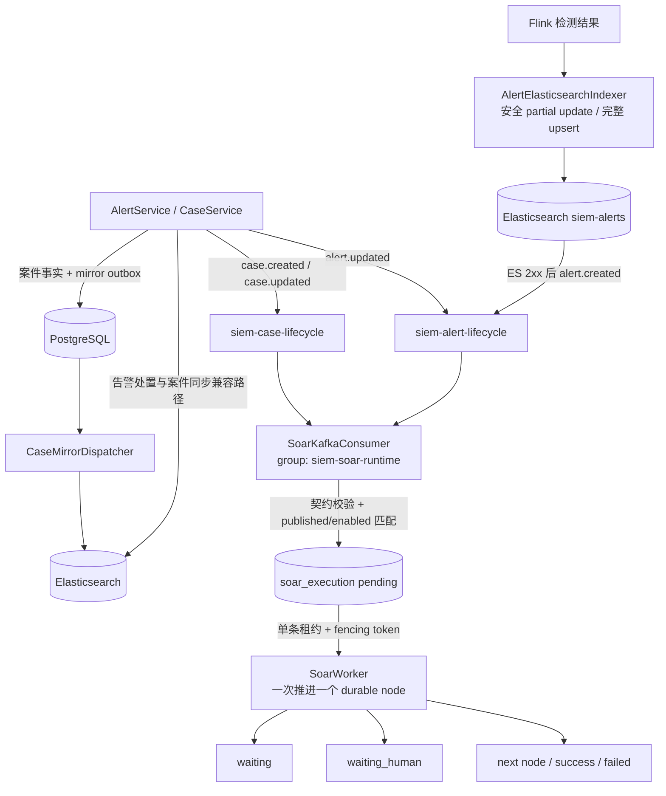

# SOAR 生命周期编排：当前设计与实现

> 状态：2026-08-23 从旧 SOAR 域模型重新实现，并升级到 V12 Handler 执行内核。本文只描述 V11/V12 生命周期 Kafka、持久化 attempt 和 Vue 3 画布的当前代码；V8-V10 表仅为不可修改的历史迁移，新运行时不读取它们。

后端组件关系、消息时序、显式 ExecutionContext、NodeHandler SPI、Worker 单节点推进、执行状态机、参数流、人工/等待恢复和 V12 持久化关系图见 [`design/soar-runtime-architecture.md`](design/soar-runtime-architecture.md)。

## 1. 能力边界

当前 SOAR 是告警/案件处置编排器，不是通用自动化平台。它只接受 `alert.created`、`alert.updated`、`case.created`、`case.updated` 四类事实，通过已有 `AlertService` 和 `CaseService` 执行业务动作。

当前节点固定为六类：Start、End、Condition、Business、Human、Wait。没有外部设备 Connector、任意 HTTP/Shell、子 Playbook、循环、批量 map、并行网关、Webhook/Cron 或手工启动。这些不是“隐藏功能”，而是本次重做主动收窄的边界：先保证消息、参数、状态和恢复语义一致，再扩展节点集合。

## 2. 运行链路



SOAR 从不订阅 `siem-events`。Flink 的 `AlertElasticsearchIndexer` 用异步 HTTP Update API 写告警：文档不存在时使用完整 `upsert`，已存在时只提交移除 `alert.status/verdict/operator/status_updated_at/case_id` 后的 partial `doc`，且不能设置 `doc_as_upsert=true`，否则首次创建也会错误地使用裁剪文档。只有 ES 返回 2xx 才把原告警交给 `AlertLifecycleEventMapper` 和 Kafka Sink，因此新告警不会在 ES 尚不可查询时触发业务动作。Kafka Sink 使用 checkpoint 支持的 `AT_LEAST_ONCE`；重复消息由数据库唯一键去重。

控制面 Publisher 在告警/案件写成功后异步发送，Producer 启用 `acks=all` 和幂等写。回调失败记录 error 日志并增加 `siem.soar.lifecycle.publish.failed`。它不把 Kafka 失败伪装成业务存储回滚；严格的跨 ES/PostgreSQL/Kafka 原子性仍需要生产级 outbox，这属于当前边界。

## 3. 生命周期契约

告警消息只携带条件和处置需要的稳定字段：

```json
{
  "message_id": "deterministic-or-uuid",
  "event_type": "alert.created",
  "occurred_at": "2026-08-23T13:20:00Z",
  "producer": "hsiem-flink",
  "tenant_id": "default",
  "alert": {
    "id": "elasticsearch-document-id",
    "rule_id": "rule-ssh-brute-force-001",
    "rule_name": "SSH 暴力破解",
    "severity": "critical",
    "status": "open",
    "verdict": null,
    "risk_score": 88,
    "source_ip": "198.51.100.247",
    "user_name": "codexuser1",
    "host_name": "server01",
    "timestamp": "2026-08-23T13:19:58Z"
  }
}
```

`alert.id` 特意使用 ES 文档 `_id`，因为它才是 `AlertService.detail/update` 的寻址键；检测结果内展示用的随机 `alert.id` 不能作为自动化动作目标。Flink 用 `alert.created + ES _id` 生成确定性 message ID，checkpoint 重放仍命中同一去重键。

案件 payload 为 `case.id/title/status/verdict/owner/alert_ids`。消息中不包含 `event.original`、`related_events` 或任意原始日志；SOAR 条件不能绕过字段字典读取随意 JSON。

## 4. Playbook 与发布门禁

`PlaybookGraph` 保存节点、边和坐标。新建草稿由后端生成唯一 Start、End 和 `start → end` 连线，前端不能删除二者。编辑已发布/停用 Playbook 会把它重置为 `draft + enabled=false`；运行中的实例继续使用创建时的 `graph_snapshot`。

每个节点还保存执行策略：最大执行次数、初始退避、指数倍率和最大退避。`maxAttempts=0` 表示使用 Handler 默认值，Business 默认 3 次，其他节点默认 1 次；设计器可显式覆盖，发布门禁限制最大 10 次、退避不超过 1 小时。

草稿允许暂时存在孤立节点或未闭合路径，便于自动保存。发布时 `SoarPlaybookValidator` 完整检查：

- 节点只能为六种类型，总数 2–50，ID 唯一；
- 必须且只能有一个 Start 和 End；Start 无入线且一条出线，End 有入线且无出线；
- Condition 必须恰有 `true/false`，Human 必须恰有 `approve/reject`；其余可推进节点恰有一条 `next`；
- 所有节点从 Start 可达，并且每个分支都能到 End；有向图不允许循环；
- Condition 只有 AND，包含 1–10 条条件，字段和操作符必须来自对象类型对应的字典；
- Business 动作必须与入口对象类型一致，必填参数不能空；Human 提示不能为空；Wait 只支持正整数分钟/小时且不超过 30 天。

数据库 `revision` 用作乐观锁。过期编辑页保存或发布返回 409，不会覆盖另一位操作者的改动。状态只有 `draft/published/disabled`；发布即启用，停用不删除定义，再启用恢复为 published。

## 5. 条件和参数传递

字段字典 API：

```text
GET /api/soar/field-dictionary?objectType=alert|case
GET /api/soar/action-dictionary?objectType=alert|case
```

文本字段支持 `== != contains is_empty not_empty`，数值支持 `== != > < is_empty not_empty`，列表支持 `contains/is_empty/not_empty`。前端 Condition 表单只显示后端返回的字段与兼容操作符，后端再次校验，不能通过改请求注入任意路径。

节点参数支持严格模板：`${alert.id}`、`${case.id}`、`${nodes.<nodeId>.output.<field>}`、`${execution.id}`、`${trigger.messageId}`、`${trigger.kafka.topic}` 和 `${variables.<name>}`。`SoarTemplateResolver` 递归处理 Map/List；整个字符串是模板时保留数值、列表等原类型，嵌入普通文本时转成字符串。路径不存在或值为 null 直接使节点失败，不会把未解析的 `${...}` 发送给业务服务。

每个节点 attempt 开始前，Engine 从 execution、trigger、payload 和成功输出重建 `SoarExecutionContext`，把解析后的 config、事件类型和对象 ID 写入 `soar_node_execution.input_json`。完成结果写入 `output_json`，后续节点只引用已持久化输出。因此服务重启后参数传递不依赖 JVM 内存。

## 6. 节点运行语义

| 节点 | 实际行为 |
| --- | --- |
| Start | 记录启动输入和输出，沿唯一 `next` 推进 |
| Condition | 对冻结的 lifecycle payload 计算全部 AND 条件，输出 `matched/branch`，选择 true 或 false |
| Business | 解析动作和参数，通过稳定幂等键调用现有服务，响应和 action receipt 成为节点输出 |
| Human | 创建 `soar_approval_task`，节点/执行进入 `waiting_human` 并释放租约；决定后沿 approve/reject 恢复 |
| Wait | 第一次运行写 `next_run_at` 并进入 `waiting`；到期再次领取时完成原节点并推进，不会重复延长等待 |
| End | 节点成功，执行进入 `success` 并写 finished_at |

Business 白名单与现有服务一一对应：

- alert：更新状态、更新 verdict、从单告警创建案件、加入已有案件；
- case：更新状态、按 verdict 结案、添加告警、更新负责人、追加证据。

SOAR 没有复制一套告警/案件写逻辑。例如 `alert.create_case` 调用 `CaseService.createFromAlert`，人工建案 API 仍坚持至少两条告警；`case.add_evidence` 读取已有证据后追加，避免用新数组覆盖历史证据。

## 7. 持久执行和并发

V11/V12 当前表：

| 表 | 作用 |
| --- | --- |
| `soar_playbook` | 当前草稿/发布定义、事件入口、revision、操作者和软删除 |
| `soar_execution` | 触发信封、对象、完整 payload/图快照、状态、当前节点、租约和 next_run_at |
| `soar_node_execution` | 每次节点访问/尝试的序号、attempt、幂等键、输入、输出、错误和时间 |
| `soar_approval_task` | 绑定精确 node run 的待审批事实、提示、决定、操作者和备注 |
| `soar_action_receipt` | 内部 Business 动作按逻辑 visit 保存的幂等结果 |

执行状态固定为 `pending/running/success/failed/cancelled/waiting/waiting_human`。Playbook 的 disabled 和执行的 cancelled 是不同概念：停用只阻止新消息匹配；取消只终止一个活动实例。

消费者组 `siem-soar-runtime` 读取两个 lifecycle topic。唯一约束 `(tenant_id, playbook_id, trigger_message_id)` 保证同一消息对同一 Playbook 只建一个实例，不影响同一消息匹配多个 Playbook。

Worker 每次只领取并立即执行一个持久节点，避免批量领取后排队导致后续租约尚未开始执行就过期。每次 claim 都递增 `soar_execution.version` 作为 fencing token；Engine 的推进、成功、失败、等待、重试和审批提交都必须同时匹配 lease owner、token、未取消状态和未过期时间。长节点执行期间独立心跳按租约约三分之一周期续租；续租失败后，旧 Worker 即使稍后返回结果也会被状态 SQL 拒绝，不能覆盖新 owner。Engine 从 Registry 选择 Handler，Handler 只返回统一结果，不能直接操作流程状态。每次失败重试都生成新的 attempt 并保留历史，同一逻辑 visit 共享幂等键。内部控制面动作与 `soar_action_receipt` 处于同一 PostgreSQL 事务；未来外部 Connector 仍需接收该键或提供补偿协议。

## 8. API 和页面

页面：

- `/soar/playbooks`：状态、启停、入口事件、节点数和 revision；
- `/soar/playbooks/new`、`/soar/playbooks/:id/edit`：Vue Flow 画布、类型化检查器、自动保存、离开前保存/关闭确认和发布错误；
- `/soar/executions`、`/soar/executions/:id`：目标对象、当前节点、payload/图快照和每个节点完整 I/O；
- `/soar/approvals`：待审批列表、提示、批准/拒绝和备注。

核心 API：

```text
GET/POST            /api/soar/playbooks
GET/PUT/DELETE      /api/soar/playbooks/{id}
POST                /api/soar/playbooks/{id}/publish
PATCH               /api/soar/playbooks/{id}/enabled
GET                 /api/soar/executions
GET                 /api/soar/executions/{id}
POST                /api/soar/executions/{id}/cancel
GET                 /api/soar/approvals
POST                /api/soar/approvals/{id}/approve|reject
GET                 /api/soar/field-dictionary
GET                 /api/soar/action-dictionary
```

不存在 `POST /executions`：生命周期 Kafka 是唯一触发入口。Playbook 写操作仅 admin；执行读取允许已认证运营角色；取消和审批允许 admin/analyst；审计角色只读。

## 9. 可观测性与当前限制

Actuator 的 `soarKafka` health 检查消费者线程、两个 topic、消费组和总 lag；消费者与 Broker 断开时会按 1 秒退避重建客户端，而不是让 daemon 线程永久退出。指标包括 lifecycle 发布成功/失败、消费失败/非法消息、接收/去重、节点重试、执行成功/失败和 `siem.soar.kafka.lag`。Kafka 安全参数与平台健康扫描共用 PLAINTEXT/SASL/SSL 环境变量族。

当前明确限制：

- Compose 是单 broker/RF=1，生产必须启用 TLS/SASL、高可用和更高副本；
- 控制面 lifecycle publish 还不是事务 outbox；
- tenant 隔离覆盖 SOAR 控制表，但告警/案件数据面尚未全面 tenant 化；
- 条件只支持 AND，图是无环单路径分支模型，没有并行、循环、子流程和补偿栈；
- 没有 DLQ 管理界面；格式非法消息会记录并提交，暂态数据库失败会 seek 后重试；
- 没有外部 Connector 或第三方代码运行环境，因而也不宣传 Vault/mTLS/出口代理/Connector 配额属于当前 SOAR 能力。

这些边界会在路线图中单独演进，不能通过恢复旧 V8-V10 类或 YAML 目录绕过当前契约。
