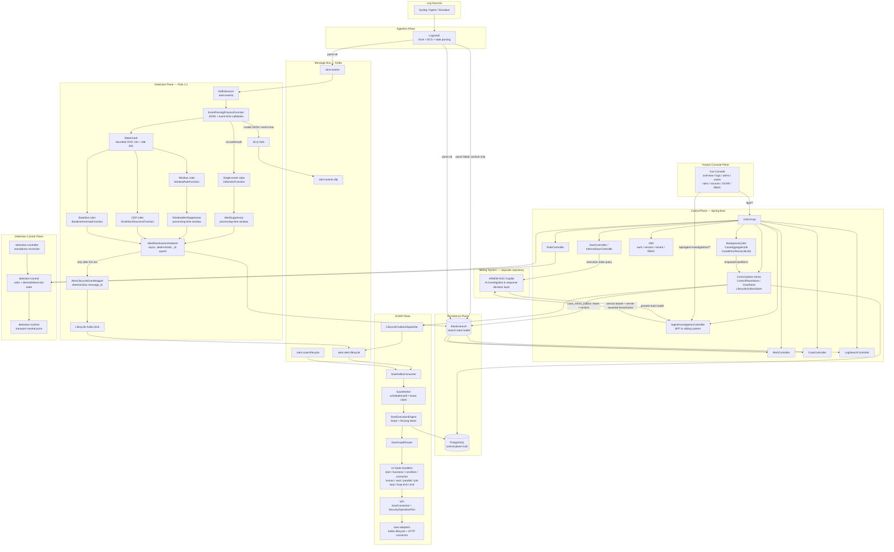
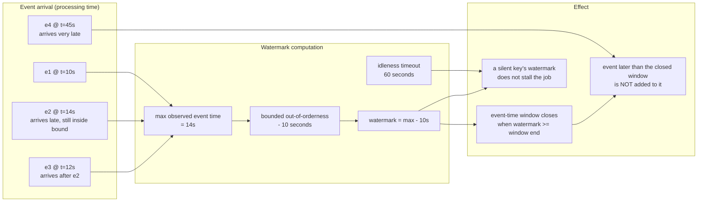
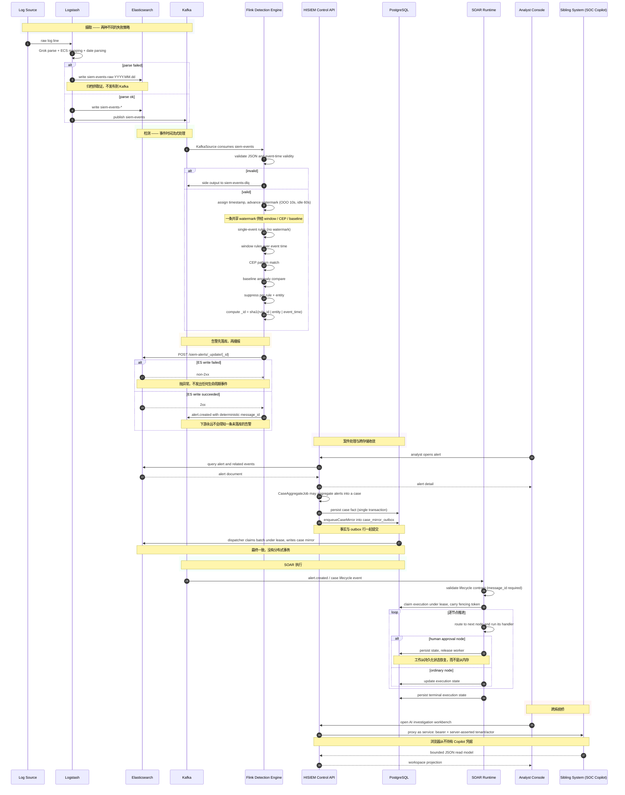

# HISIEM — 架构图与数据流图

本平台的两张规范图：

1. **[架构图](#1-架构图)** — *系统由什么构成*
2. **[数据流图](#2-数据流图)** — *一条真实日志流过它时会发生什么*

配套文档：[`architecture.md`](architecture.md)（数据面/控制面边界）、
[`evidence/architecture-analysis/`](../evidence/architecture-analysis/README.md)（代码级证据）。

---

## 1. 架构图

每个组件都归到拥有它的那个职责平面，并显式画出跨平面边界的那些流。



### 这张图解决了什么

它回答的是「**哪个平面拥有哪项职责，以及一条流在哪里跨过平面边界？**」跨点正是有意思的工程所在——
每一处都是两套不同正确性模型相遇的地方。

### 组件职责

| 平面 | 拥有 | 值得点明的「不负责」 |
|---|---|---|
| **摄取** | 解析、归一化成 ECS、按解析结果路由 | 不检测 |
| **检测（Flink）** | 事件时间窗口、CEP、基线、抑制、告警身份 | 不存储、不管理案件 |
| **消息总线** | 持久扇出、DLQ、生命周期契约载体 | 不计算 |
| **持久化** | PostgreSQL = 事务真相；Elasticsearch = 可重建的检索读模型 | 两者单独都不是完整真相 |
| **SOAR** | Playbook 执行：在租约下逐节点推进，带 fencing | 不决定*是否*运行——那是一条来自控制面的持久命令 |
| **控制面** | 案件、告警面、规则、日志检索、IAM/RBAC、运维 API、Copilot BFF | **不做物理检测部署** |
| **检测控制** | 规则定义、期望 vs 观测运行时状态、对账 | **没有物理部署职责** |
| **控制台** | 分析员呈现与编写 | 自身不持有任何权威 |
| **兄弟系统** | AI 调查、证据、响应*提案*、人工授权流程 | **不检测、也不执行** |

### 数据从哪里来、到哪里去

```text
IN    Log lines arrive at Logstash from syslog / agents / the simulator.
      Parsed events fan out to Elasticsearch (search) AND Kafka (streaming).
      Flink consumes Kafka, detects, and writes alerts back to Elasticsearch.

OUT   Alerts become lifecycle events on Kafka (only after a successful ES write).
      soar-worker consumes those, executes SOAR playbooks, and records execution
      state in PostgreSQL. The console reads from both stores.

CROSS The console never talks to the sibling system directly. It calls HISIEM's
      /api/agent-investigations/** BFF, which proxies server-side with a service
      credential and a tenant/actor taken from HISIEM's already-validated context.
```

### 真相与权威分别住在哪

```text
PostgreSQL                    = control-plane transactional truth
                                (cases, rules, IAM, SOAR execution state, outboxes)
Elasticsearch                 = rebuildable search read model
                                (events, raw events, alerts, case mirror, entity risk)
Flink operator state          = recoverable detection working state (checkpointed)
SOAR execution state          = execution truth, recorded in PostgreSQL
Alert document identity       = deterministic: sha1(rule_id | entity | event_time)
Sibling-system execution view = NOT authoritative here; HISIEM's observed state is
                                the final execution truth for the combined system
```

### 可靠性边界

| # | 边界 | 位置 | 可能出什么错 |
|---|---|---|---|
| 1 | 解析边界 | Logstash → ES raw / ES events + Kafka | 无法解析的记录必须被留存，绝不静默丢弃 |
| 2 | 事件时间边界 | Kafka → Flink 时间戳赋予 | 来源时钟被信任；时钟偏移不被对账 |
| 3 | Sink 边界 | Flink → Elasticsearch | 非事务写入；收敛依赖确定性 `_id` |
| 4 | 播报边界 | ES 2xx → Kafka 生命周期事件 | 顺序是承重的：下游绝不能得知一条未落库的告警 |
| 5 | 跨存储边界 | PostgreSQL ↔ Elasticsearch | 没有分布式事务；经带租约 + 回收的 `case_mirror_outbox` 收敛 |
| 6 | 执行边界 | 控制面 → SOAR | Playbook 推进受租约保护；**节点副作用的幂等属于 connector** |
| 7 | 跨系统边界 | HISIEM BFF → 兄弟系统 | 租户/actor 由服务端断言；浏览器永远无法覆盖它们 |
| 8 | 单 JVM 锁边界 | 控制面进程内守卫 | `synchronized`、`lifecycleInFlight` 与端口锁只覆盖**一个 JVM**；多副本控制面需要分布式锁 |
| 9 | 规则状态与部署边界 | Flink savepoint ↔ detection-controller 对账 | Savepoint 保护的是规则*状态*；启停由期望 generation 与对账驱动，而 process adapter 只在产物必须替换时重建受影响的 job group。更大规模仍需要动态规则广播或版本化作业 |
| 10 | 环境边界 | 本地 Compose | PLAINTEXT、单节点与 RF=1 只适用于本地；生产必须通过 `ProductionSafetyValidator` 的 TLS/SASL 门禁，并补上拓扑 HA |

### 事件时间边界，细说

三个容易被混为一谈的机制，以及由它们导出的那条边界。



| 机制 | 这里的取值 | 它做什么 |
|---|---|---|
| 有界乱序 | 10 秒 | 让 watermark 以一个固定界落后于最新观测到的事件时间，于是轻度的乱序被吸收，而不是被当作迟到 |
| 空闲 | 60 秒 | 阻止一个已经安静下来的来源把每个窗口永远撑开 |
| 窗口触发 | watermark ≥ 窗口结束 | 窗口按事件时间触发。**窗口一旦触发过，就不会因为 allowed-lateness 再触发一次** |

**这个作业里没有 `allowedLateness` 配置，也没有迟到事件的 side output。** 因此边界是：10 秒界内的乱序
被吸收；在其窗口已经触发之后到达的事件既不计入该窗口结果，也不会被单独捕获。见
[已知限制](../../README.md#12-已知限制)。

---

## 2. 数据流图

一条真实日志，端到端走一遍。



### 这张图解决了什么

它回答的是「**按顺序，实际发生了什么，以及每一步能在哪里失败？**」三个 `alt` 分支是值得记住的部分：
解析失败、事件时间校验失败、告警写入失败。每一个都有*不同的*策略，把它们混为一谈，是对这条管线最
常见的误述。

### 三种失败策略，并列对照

| 失败 | 去处 | 策略 |
|---|---|---|
| Logstash 解析失败 | ES `siem-events-raw-YYYY.MM.dd` | **留存供取证**；按日索引、短留存，永不进入 Kafka 或 Flink |
| Flink 校验失败（JSON / 事件时间） | Kafka `siem-events-dlq` | **隔离**待重处理；今天没有自动重放工具 |
| Elasticsearch 告警写入失败 | 抛异常，且**不发出生命周期事件** | 播报被抑制，任何下游系统都不会看到一条幽灵告警 |

### 承重次序

```text
1. The alert must be STORED before it is ANNOUNCED.
   ES 2xx → lifecycle event. A failed write produces an exception, not an event.

2. The case fact and its outbox row commit in the SAME transaction.
   Publication becomes a consequence of the commit, not a second independent action.

3. The SOAR execution state lands in PostgreSQL BEFORE the worker releases it.
   That is what makes a human-approval node resumable rather than blocking.
```

### 兄弟系统在哪里与 HISIEM 相接

```text
Browser  →  HISIEM /api/agent-investigations/**  (Spring Security RBAC)
         →  AgentInvestigationService            (server-side proxy)
         →  Copilot API                          (service bearer credential)

Tenant and actor are taken from HISIEM's already-validated context.
A browser cannot override them through a request body or header, and Copilot
credentials are never returned to the client.
```

反方向同样刻意：对这套组合系统而言要紧的执行状态，是 **HISIEM 记录**的那个，不是兄弟系统自以为提交的
那个。
